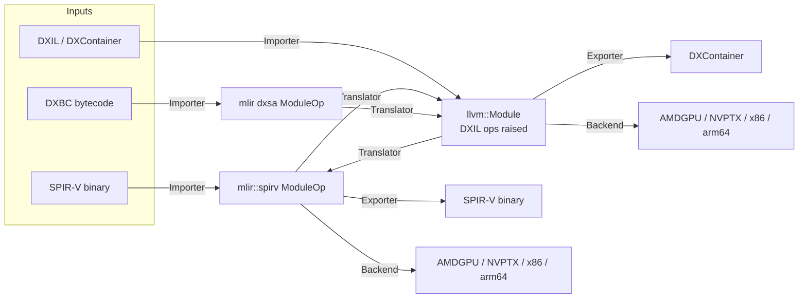

# FeMe: FrontEnd for the MiddleEnd — Design Document

## Summary

FeMe ("FrontEnd for the MiddleEnd") is a library and command line tool for
reading pre-existing shader/kernel intermediate representations — initially
**SPIR-V**, **DXBC**, and **DXIL** — and translating them into
[MLIR](https://mlir.llvm.org/) and/or [LLVM IR](https://llvm.org/docs/LangRef.html),
so that they can be re-optimized, re-targeted to native ISAs (AMDGPU, NVPTX,
X86, AArch64, etc.), or translated into one of the other supported input IRs
(e.g. DXBC → DXIL, DXIL → SPIR-V).

FeMe is not a new "universal IR". It is the plumbing that gets bytes in one of
these existing formats into an IR that the rest of LLVM/MLIR already knows how
to optimize and compile, and back out again. Where possible it reuses existing
LLVM/MLIR infrastructure (the MLIR `spirv` dialect, the LLVM `DirectX`
target's DXIL knowledge, the LLVM `SPIRV` target, MLIR's GPU dialects, etc.)
rather than re-implementing it.

FeMe is designed first and foremost **as a library**. The command line tool is
a thin client of that library. This has architectural consequences described
throughout this document, most importantly: **no global/mutable static
state**.

## Motivation

Today, tools that need to consume, analyze, transform, or re-target compiled
shader/kernel binaries (DXBC, DXIL, SPIR-V) each grow their own bespoke
parsing and lowering code, or shell out to format-specific tools with no
shared infrastructure. LLVM and MLIR already contain most of the pieces
needed to represent and optimize these programs once they're in the
front door:

- MLIR has a mature `spirv` dialect and SPIR-V (de)serializer.
- LLVM's `DirectX` target already understands the DXIL "op" encoding used to
  *emit* DXIL from LLVM IR.
- MLIR and LLVM have rich conversion/optimization/target infrastructure
  (`GPU`, `NVVM`, `ROCDL`, `LLVM` dialects; `AMDGPU`, `NVPTX`, `X86`, `AArch64`
  backends).

What's missing is the **front door**: a coherent, library-first component
that reads these binary/legacy formats and hands the result to the rest of
the ecosystem in a form it already understands, and that can go back out
again. FeMe fills that gap.

Primary driving use cases:

1. **Shader recompilation for GPU drivers** — a driver receives DXIL, DXBC,
   or SPIR-V and needs to (re)compile it to native ISA at install time,
   first-run, or JIT time.
2. **Offline cross-compilation / translation tools** — e.g. translating
   DXIL to SPIR-V (or vice versa) for portability layers, without a full
   round-trip through source.

Both use cases require FeMe to work well embedded in another process (a
driver, a build tool), which is why it is designed as a library first.

## Goals

- Provide reusable **importers** that parse SPIR-V, DXBC, and DXIL into a
  representation usable by MLIR and/or LLVM IR-based tooling.
- Provide reusable **exporters** back to those formats (at least DXIL and
  SPIR-V) so that IR-to-IR translation is possible.
- Provide **retargeting infrastructure** to lower the imported program to
  native ISA via existing LLVM targets and MLIR GPU-compilation pipelines.
- Be usable as a **linkable library with a stable, explicit-state C++ API**
  — no `cl::opt` globals, no process-wide singletons, safe to instantiate
  multiple independent instances in the same process (e.g. one per thread,
  or one per compilation).
- Be safely usable from **multi-threaded host processes**: since a primary
  use case (GPU driver shader recompilation) routinely imports/translates/
  retargets many shaders concurrently across worker threads, FeMe's
  interfaces must support one `feme::Context` per thread with no hidden
  contention or shared mutable state between them (see Core Architectural
  Principle below).
- Because FeMe's importers are a runtime driver's primary attack surface for
  untrusted, externally-supplied shader binaries, **fuzzing the binary-format
  importers (DXBC, DXIL, SPIR-V) is a v1 priority**, not a fast-follow —
  harnesses should land alongside each importer as it's implemented (see
  Testing Strategy below).
- Follow **LLVM/MLIR coding conventions**: `LLVMStyle` formatting, `Expected<T>`
  / `Error` for fallible operations and diagnostics, `-title-case-Doxygen`
  comments, lit + FileCheck based tests, unittests via `gtest`, layout
  conventions matching sibling subprojects (`mlir/`, `offload/`).
- Live in the `llvm-project` monorepo as a sibling project (comparable to
  `mlir`, `offload`), buildable via `LLVM_ENABLE_PROJECTS`/
  `LLVM_ENABLE_RUNTIMES`-style opt-in. Standalone (out-of-tree) builds
  against an installed LLVM+MLIR, mirroring `offload-test-suite`, are out of
  scope for now — the CMake structure needed to add it later is
  straightforward and shouldn't require a redesign.
- Support incremental growth to additional input IRs beyond the initial
  three without an architectural rewrite.

## Non-Goals (for now)

- FeMe is **not** a shader compiler front end (it does not compile HLSL/GLSL
  source). It starts from already-compiled IR.
- FeMe does not aim to be a bit-perfect, fully round-trippable
  decompiler — recovering original source-level constructs is out of scope.
  Fidelity requirements are "sufficient to reoptimize and retarget
  correctly", not "reproduces the original module".
- FeMe does not initially provide a stable C API (see Library API Shape
  below). A C++ API is the initial deliverable; a C API is planned, but
  deliberately sequenced after `feme` CLI tooling is functional and tested
  (see Roadmap / Milestones below), not dropped as a non-goal.
- FeMe does not initially ship its own standalone, user-facing optimizer
  binary in the sense of a general `mlir-opt`/`opt`-style product feature.
  It does, however, ship `feme-opt` as **testing infrastructure** from v1
  (see Command Line Tool(s) and Testing Strategy below) — FeMe's own
  MLIR/LLVM IR passes (DXIL op raising, `dxsa` lowering/canonicalization,
  etc.) need a way to be exercised directly on textual IR via `lit`, the
  same way `mlir-opt`/`opt` let MLIR/LLVM passes be tested in isolation
  from any frontend.
- FeMe does not target MLIR's `gpu` dialect / structured GPU compilation
  pipeline (kernel outlining, `gpu-to-rocdl`/`gpu-to-nvvm`) in v1 — there is
  no concrete client for it yet. Direct `llvm::Module` → `TargetMachine`
  retargeting via the in-tree `AMDGPU`/`NVPTX` backends is sufficient for
  now (see Retargeting to Native ISA below); `gpu`-dialect retargeting can
  be added later as an additional `Backend` without a redesign.

## Prior Art and Reused Infrastructure

FeMe explicitly builds on top of, rather than replacing:

| Format | Existing LLVM/MLIR infrastructure | What FeMe adds |
|---|---|---|
| SPIR-V | MLIR `spirv` dialect + deserializer/serializer (`mlir/lib/Target/SPIRV`), `SPIRVToLLVM` conversion | Entry points, diagnostics integration, retargeting glue, DXIL/DXBC interop |
| DXIL | LLVM `DirectX` target (`llvm/lib/Target/DirectX`) understands DXIL op encoding, `DXContainer` format (`llvm/lib/BinaryFormat/DXContainer.h`, `llvm/lib/MC/*DXContainer*`) for *emitting* DXIL | A *reader* (inverse direction): `DXContainer` parsing, a DXIL-compatible bitcode reader, and a "DXIL op raising" pass (inverse of `DXILOpLowering`) |
| DXBC | An in-progress prototype dialect and bytecode reader exist on the `wip/dxsa-mlir` branch of the [`access-softek/llvm-project`](https://github.com/access-softek/llvm-project) fork, currently living under `mlir/{include,lib}/Dialect/DXSA` and `mlir/lib/Target/DXSA` (not upstreamed into MLIR proper); the writer (`dxsa::serialize`, the assembler direction) is currently an unimplemented stub | Migrate that dialect (`dxsa`) and its `BinaryParser` into feme's tree, refactoring to fit feme's conventions; implement the currently-stubbed `BinaryWriter` (needed as a DXBC assembler for testing, see Testing Tools below); continue extending opcode coverage |

FeMe should be viewed as the missing "read" half of infrastructure whose
"write" half already exists in-tree (DirectX target, SPIR-V target), plus a
migration target for the one format (DXBC) whose prototype representation
exists only on a topic branch, not upstream.

## Core Architectural Principle: No Global State

Because FeMe must be safely embeddable in long-lived host processes (drivers)
that may compile many shaders concurrently or sequentially with different
options, FeMe must avoid the classic LLVM tool patterns that rely on
process-global state:

- No `llvm::cl::opt` for configuring library behavior *or* the main CLI
  tool. `cl::opt` is acceptable only in narrowly-scoped, testing-only
  entrypoints (e.g. a lit-test helper binary), never in `feme` or
  any library code. Instead, FeMe is structured like Clang: a thin `main()`
  hands `argc`/`argv` to an options component built on LLVM's `llvm::opt`
  library (`OptTable`/`ArgList`, driven by an `Options.td`), which parses
  arguments into explicit option structs (`ImportOptions`, `ExportOptions`,
  `BackendOptions`, etc.). Building this on `llvm::opt` rather than
  `cl::opt` means the same options-parsing component can be linked into
  both the CLI tool and an embedding driver that wants a consistent,
  CLI-compatible way to configure FeMe, without pulling in global `cl::opt`
  registration.
- No function-local `static` mutable state, no Meyer's-singleton managers.
- No reliance on a single global `LLVMContext` or `MLIRContext` — every
  operation takes an explicit context object (see `feme::Context` below).
- Diagnostics are delivered through an explicit, caller-supplied callback /
  `DiagnosticHandler`, never printed directly to `errs()` by library code.
- Thread-safety: two independent `feme::Context` instances used from two
  threads must never contend or share mutable state. A single `Context` is
  *not* required to be thread-safe for concurrent use (matching
  `MLIRContext`/`LLVMContext` conventions) — callers needing concurrency use
  one `Context` per thread, which is cheap to create.
- `Importer`/`Exporter`/`Translator`/`Backend` implementations themselves
  must be stateless/reentrant (no mutable instance fields written during
  `import`/`export`/`translate`/`run`) so that the *same* statically-linked
  component instance can be safely invoked concurrently from multiple
  threads, each passing its own `Context`. This is what makes per-thread
  `Context`s cheap: the (potentially large) format-specific tables owned by
  an `Importer`/`Exporter` are built once and shared read-only, rather than
  duplicated per `Context`.
- This matters because a primary use case is a driver library embedded in a
  multi-threaded host process, compiling many independent shaders
  concurrently (one `Context` per worker thread) with no global locks,
  static caches, or ordering dependencies between threads.

This mirrors how MLIR itself moved away from LLVM's older global-table
style APIs, and is the main way FeMe's conventions will diverge from some
older parts of LLVM.

## `feme::Context`

All FeMe entry points take an explicit `feme::Context&` (name TBD, see open
questions) analogous in spirit to `MLIRContext`/`LLVMContext`, but scoped to
a single FeMe "session":

```c++
namespace feme {
class Context {
public:
  explicit Context(ContextOptions Options = {});

  // Wraps an externally-owned MLIRContext instead of constructing a new
  // one (still owns its own LLVMContext); added in the "SPIR-V import"
  // roadmap step so feme-translate's format registrations can run inside
  // the same MLIRContext an mlir-translate/mlir-opt-style tool already
  // configured (dialect registry, printing flags, threading), per the
  // "Owns (or wraps caller-provided) ... instances" bullet below.
  explicit Context(mlir::MLIRContext &ExternalMLIRCtx);

  llvm::LLVMContext &getLLVMContext();
  mlir::MLIRContext &getMLIRContext();

  void setDiagnosticHandler(DiagnosticHandlerTy Handler);
  void diagnose(Diagnostic D) const;

  // Registry of available Importers/Exporters/Translators (see the
  // Pipeline Abstraction section below), populated at construction time
  // from statically-linked components; not a global registry.
  const FormatRegistry &getFormatRegistry() const;

private:
  std::unique_ptr<llvm::LLVMContext> LLVMCtx;
  std::unique_ptr<mlir::MLIRContext> OwnedMLIRCtx; // null when wrapping
  mlir::MLIRContext *MLIRCtx;
  DiagnosticHandlerTy DiagHandler;
  FormatRegistry Registry;
};
} // namespace feme
```

Key properties:

- Owns (or wraps caller-provided) `LLVMContext` and `MLIRContext` instances,
  so that a single FeMe `Context` produces IR that is trivially interoperable
  (same contexts) across import/translate/export/retarget steps.
- Registers the MLIR dialects FeMe needs (`spirv`, `llvm`, `func`, `gpu`,
  target-specific dialects like `nvvm`/`rocdl`, plus FeMe's own dialects such
  as `dxsa`) **eagerly at construction**, matching how most MLIR tools set
  up their context up front. This can be revisited toward lazy/on-demand
  registration later if `Context` construction cost becomes a real concern,
  but eager registration is the simpler starting point.
- Carries no format-specific configuration itself; format-specific options
  (e.g. target SPIR-V version, DXIL validator version) are passed to the
  relevant Importer/Exporter, not stored globally on `Context`.

## Pipeline Abstraction: Importers, Translators, Exporters, Backends

FeMe models its work as four composable, single-step operations, plus a
`Driver` that chains them into full toolchain invocations (see `Driver`
below). All five are pure functions of their inputs (module, options,
`Context`) with no side effects beyond diagnostics:



### `Importer`

Parses a format's binary encoding into an in-memory representation
(the Per-Format Representation Strategy section below discusses *which*
representation per format).

```c++
class Importer {
public:
  virtual ~Importer() = default;
  virtual llvm::Expected<Module> import(llvm::MemoryBufferRef Buffer,
                                         const ImportOptions &Opts,
                                         Context &Ctx) const = 0;
  virtual llvm::StringRef getFormatName() const = 0;
};
```

`ImportOptions` (implemented starting with the SPIR-V `Importer`) is a
single plain, non-polymorphic struct shared by all formats, growing one
field per format-specific knob (e.g. SPIR-V's control-flow
structurization toggle), rather than a per-format options subtype:
FeMe does not use RTTI (see feme/.instructions.md), so `Importer::import`
could not safely downcast a base `ImportOptions&` to a format-specific
subclass.

### `Exporter`

The inverse of an `Importer`: serializes a `Module` back to a format's binary
encoding. Not every format needs to support export in v1 (DXBC export is not
a current use case), but the interface is symmetric.

### `Translator`

Converts a `Module` from one format's representation into another's
(e.g. DXBC's `dxsa` dialect into DXIL-flavored LLVM IR), without necessarily
producing a byte-for-byte serialization of the destination format — the
result can then be run through that format's `Exporter` if serialized bytes
are needed, or consumed directly by further passes/backends.

### `Backend` (retargeting)

Lowers a `Module` to native ISA using existing LLVM target infrastructure
(see Retargeting to Native ISA below). This is deliberately *not*
format-specific: once a program is
LLVM IR (or MLIR `llvm`/`gpu` dialect), retargeting reuses standard
`TargetMachine`/`gpu-to-*` infrastructure, regardless of which frontend it
came from.

### `Driver`

`Importer`/`Translator`/`Exporter`/`Backend` are deliberately low-level,
single-step primitives. Most callers (the `feme` CLI, and eventually the C
API) don't want to manually wire up "which importer, then which translator,
then which backend" for a given `--from`/`--to`/`--target` request — they
want to hand FeMe a source format, a destination format/ISA, and a buffer,
and get a result. `feme::Driver` is that orchestration layer:

```c++
class Driver {
public:
  explicit Driver(Context &Ctx);

  // Computes and runs the full chain of Importer -> Translator(s) ->
  // Exporter/Backend steps needed to go from Opts.From to Opts.To (or
  // Opts.Target), consulting Ctx.getFormatRegistry() to find each step.
  llvm::Expected<DriverResult> run(llvm::MemoryBufferRef Input,
                                    const DriverOptions &Opts) const;
};
```

This mirrors how Clang's driver builds a sequence of "jobs" (compile, then
assemble, then link) from a requested input/output pair, rather than
requiring the caller to invoke the compiler, assembler, and linker
separately. `Driver` is intentionally a thin layer *on top of* the four
pipeline primitives — it contains no format-specific logic of its own, only
the logic to select and sequence the right `Importer`/`Translator`(s)/
`Exporter`/`Backend` for a requested `From`/`To`/`Target` combination (e.g.
`--from=dxbc --to=spirv` resolves to the DXBC `Importer` → the `dxsa` →
raised-LLVM-IR `Translator` → the LLVM `SPIRV` `Backend`, per the
Translation Matrix below). Embedding consumers that want single-step control
(e.g. "just import, hand me the `Module`, I'll do the rest") can still use
`Importer`/`Translator`/`Exporter`/`Backend` directly — `Driver` is a
convenience built from the same public interfaces, not a required entry
point.

#### Status: `feme::Driver` (implemented for `dxil`/`spirv` import; `dxil`/`spirv`/native-ISA output)

`feme::Driver` (`feme/include/feme/Driver/Driver.h`,
`feme/lib/Driver/Driver.cpp`) is implemented, and is what the `feme` CLI
(`feme/tools/feme/feme.cpp`) drives: given `DriverOptions` (reusing
`feme::frontend::DriverOptions`, per "Library API Shape" below, rather than
a second identical struct) and an input buffer, it looks up the `Importer`
named by `Opts.From` ("dxil" or "spirv" -- DXBC is not yet implemented, so
is rejected with a diagnostic rather than a crash), translates the result to
an `llvm::Module` (directly for DXIL, via `SPIRVToLLVMTranslator` for
SPIR-V), and then runs the raising/lowering chain that gets from that to
the requested destination:

1. For DXIL input: `feme::dxil::OpRaisingPass`, then
   `feme::dxil::MetadataRaisingPass` (in that order -- the first consumes
   the `!dx.resources` metadata the second drops).
2. Resolve `Opts.Target`/`Opts.To` to a concrete target triple. `--target`
   wins if set; otherwise `--to` is used, with `"dxil"`/`"spirv"` resolving
   to that format's own triple. Both preserve the pipeline stage a
   DXIL-originated module names (recovered by `MetadataRaisingPass`), as the
   environment component of a `dxil-unknown-shadermodelX.Y-<stage>` or
   `spirv-unknown-vulkan-<stage>` triple; `"spirv"` likewise keeps the triple
   a SPIR-V-originated module already carries (recorded by FeMe's SPIR-V ->
   `llvm` dialect conversion); anything else is used as a triple directly.
   This step happens *after* raising precisely so that recovered stage is
   available.
3. For any destination other than DXIL: `feme::dxil::IntrinsicExpansionPass`.
4. For a SPIR-V destination: `feme::spirv::RaisedLoweringPass`.
5. For an `amdgcn-*` destination: `feme::amdgpu::ResourceLoweringPass`, then
   `feme::amdgpu::RaisedLoweringPass` (in that order -- the first rewrites
   entry point signatures, which the second then sees as ordinary
   functions).
6. `feme::TargetMachineBackend`.

There is no `Ctx.getFormatRegistry()` yet (deviating from the sketch above)
-- `Driver` currently looks up its two `Importer`s directly rather than
through a registry on `Context`, since only two formats exist to look up; a
registry is expected to be added if/when this stops being a short enough
list to hard-code, without changing `Driver`'s own public interface.

Validated end to end (see `test/Tools/feme/feme-*.{ll,mlir,test}`): DXIL
retargeted to DXIL, to SPIR-V, and to a real ISA (`amdgcn-amd-amdhsa`), each
for a shader that writes a `RWBuffer<float4>` indexed by its dispatch-wide
thread id; the SPIR-V "null pipeline" (see the deviation note under
Retargeting to Native ISA below) through the full CLI rather than composed
one `feme-translate` stage at a time; a SPIR-V compute shader that reads its
dispatch thread id and reads and writes a bound `RWBuffer` retargeted back to
SPIR-V; SPIR-V retargeted to `amdgcn-amd-amdhsa`; and clean (non-crash)
diagnostics for an unsupported `--from` and a missing `--to`/`--target`.

Also validated manually against real `dxc`-compiled output for the HLSL
Mandelbrot compute shader driving this work (not checked in, per "Avoiding
binary test fixtures" below): `dxc -T cs_6_5`'s DXContainer retargets
successfully to all three of DXIL, SPIR-V, and AMDGPU. The same shader
compiled with `dxc -T cs_6_5 -spirv` *imports* successfully (see the
control-flow structurization deviation above), and its resource declarations,
resource accesses and builtin input variables all now convert (see "FeMe's
SPIR-V -> `llvm` dialect conversion" above). What that direction is still
missing is breadth of SPIR-V coverage rather than any structural gap; see
"Known gap: `spirv` dialect -> `llvm` dialect conversion coverage" below for
what is not covered yet.

### `feme::Module`

Because different formats are best represented differently (see the
Per-Format Representation Strategy section below), FeMe needs a small
variant-like wrapper so generic code (the CLI, pipeline glue) can
hold "a module" without caring which underlying representation is active:

```c++
class Module {
public:
  enum class Kind { MLIR, LLVMIR };

  template <typename OpTy>
  static Module fromMLIR(mlir::OwningOpRef<OpTy> M);
  static Module fromLLVMIR(std::unique_ptr<llvm::Module> M);

  Kind getKind() const;
  mlir::Operation *getMLIROperation() const;             // asserts getKind() == MLIR
  mlir::OwningOpRef<mlir::Operation *> takeMLIROperation(); // asserts getKind() == MLIR
  llvm::Module &getLLVMModule() const;                    // asserts getKind() == LLVMIR
};
```

This is intentionally a thin, low-ceremony wrapper — it is not a new IR, it's
a tagged union over the two IRs FeMe actually produces.

Deviates from an earlier draft of this sketch, which had `fromMLIR` take an
`mlir::OwningOpRef<mlir::ModuleOp>` specifically and `getMLIRModule()` return
`mlir::ModuleOp`: implemented starting with the SPIR-V `Importer`, whose
top-level op is `mlir::spirv::ModuleOp` (not the builtin `mlir::ModuleOp`),
`fromMLIR` is instead a function template accepting any top-level op type,
and `Module` type-erases to `mlir::OwningOpRef<mlir::Operation *>`
internally; callers that know the concrete format cast the result back with
`mlir::cast`/`mlir::dyn_cast`. `takeMLIROperation()` was added for handing
ownership back to generic MLIR tooling that manages its own operation
lifetime (e.g. feme-translate's translation registrations).

## Per-Format Representation Strategy

This is the crux of the design and the area with the most nuance.

### SPIR-V → MLIR `spirv` dialect (reuse, do not reinvent)

SPIR-V already has a first-class, actively maintained MLIR dialect with a
complete deserializer/serializer. FeMe's SPIR-V `Importer` is a thin wrapper
around `mlir::spirv::deserialize`, producing an `mlir::spirv::ModuleOp`. FeMe
does **not** define its own SPIR-V representation.

From there, FeMe leverages existing MLIR conversions (`SPIRVToLLVM`, and
`spirv`-dialect canonicalization/transform passes already in MLIR) to reach
the `llvm` dialect / `llvm::Module` for retargeting or for DXIL export.

#### Status: SPIR-V -> MLIR `llvm` dialect -> LLVM IR (implemented, as two composable stages)

The `spirv` dialect -> `llvm::Module` leg above is implemented as two
separate `Translator`s, each independently registered with `feme-translate`
(see the "Testing Tools" section) and `lit`-tested on its own, rather than
one opaque step -- matching how DXIL's `feme::dxil::OpRaisingPass` is
tested in isolation rather than only end to end:

1. `feme::SPIRVToLLVMDialectTranslator` (`spirv` -> `llvmdialect`,
   `feme/lib/Translate/SPIRV/SPIRVToLLVMDialectTranslator.cpp`): runs
   `feme::spirv::createConvertSPIRVToLLVMPass` (see "FeMe's SPIR-V -> `llvm`
   dialect conversion" below) and stops at the resulting `llvm` dialect
   `mlir::ModuleOp` -- this is "read SPIR-V into MLIR, [then] translate that
   to the LLVM-IR dialect".
2. `feme::LLVMDialectToLLVMIRTranslator` (`llvmdialect` -> `llvmir`,
   `feme/lib/Translate/LLVMIR/LLVMDialectToLLVMIRTranslator.cpp`): runs
   `mlir::translateModuleToLLVMIR` on an `llvm` dialect module. This stage is
   deliberately format-agnostic (it does not depend on the `spirv` dialect
   at all) since it is the same "last mile" any FeMe pipeline that reaches
   the `llvm` dialect needs, matching how DXIL import re-enters MLIR only at
   the `llvm` dialect for passes that need it (see the DXIL section below).

`feme::SPIRVToLLVMTranslator` (`spirv` -> `llvmir`) composes both stages
into a single `Translator` for callers that want the end-to-end result
without caring about the intermediate `llvm` dialect representation (e.g.
the SPIR-V "null pipeline" deviation below, which historically used it
directly); it contains no logic of its own beyond that composition.

The resulting `llvm::Module` is then handed to `feme::TargetMachineBackend`
targeting LLVM's in-tree `SPIRV` backend (`llvm/lib/Target/SPIRV`), which
lowers it the rest of the way to a real SPIR-V binary.

#### FeMe's SPIR-V -> `llvm` dialect conversion

`feme::spirv::createConvertSPIRVToLLVMPass`
(`feme/lib/Conversion/SPIRVToLLVM/`, registered with `feme-opt` as
`--feme-convert-spirv-to-llvm`) is a superset of MLIR's own
`convert-spirv-to-llvm`: it runs all of MLIR's patterns, plus FeMe's own at a
higher benefit for the constructs where MLIR either has no pattern at all or
has one aimed at a different consumer.

That difference in consumer is the crux. MLIR's conversion exists to feed
MLIR's SPIR-V *runner*, which executes a shader on the host: a resource
becomes an LLVM global the runner binds memory to, a builtin input variable
becomes a global the runner writes the thread index into, and an execution
mode becomes a `__spv__<entry>_execution_mode_info_<mode>` global the runner
reads. FeMe's consumer is LLVM's in-tree `SPIRV` backend, which models all
three as *target intrinsics and function attributes* instead, and which
therefore sees a module converted MLIR's way as one that loads from globals
nothing ever defines.

Naming target intrinsics is only meaningful once a module says what target it
is for, so the pass first records the SPIR-V environment the `spirv.module`
was written for -- a Vulkan shader triple naming the pipeline stage of its
entry points (`spirv-unknown-vulkan-compute`), or an OpenCL flavored
`spirv32`/`spirv64-unknown-unknown` for `Kernel` entry points -- as the
`llvm.target_triple` and `llvm.data_layout` module attributes
`mlir::translateModuleToLLVMIR` forwards onto the `llvm::Module`. The `llvm`
dialect can then name the backend's intrinsics directly, as
`llvm.call_intrinsic "llvm.spv.*"` ops, and FeMe's patterns do:

| SPIR-V | FeMe emits | MLIR's conversion emits |
| --- | --- | --- |
| `spirv.EntryPoint`/`spirv.ExecutionMode` | `hlsl.shader`/`hlsl.numthreads` function attributes | a `__spv__*_execution_mode_info_*` global |
| builtin input variable (`GlobalInvocationId`, ...) | `llvm.spv.thread.id` & friends, one call per vector component | a load from an `external constant` global |
| resource variable (image/sampler, `bind(set, binding)`) | `llvm.spv.resource.handlefrombinding` | an `external constant` global whose *name* encodes the binding |
| `spirv.ImageRead`/`spirv.ImageWrite` | `llvm.spv.resource.getpointer` + `llvm.load`/`llvm.store` | *(no pattern; fails to legalize)* |
| `spirv.ImageQuerySize` | `llvm.spv.resource.getdimensions.{x,xy,xyz}` | *(no pattern; fails to legalize)* |

Since a builtin variable and a resource handle are values the backend
materializes on demand rather than memory, the pointers SPIR-V reads them
through convert to the *value* type: `!spirv.ptr<T, Input>` to `T`, and
`!spirv.ptr<image, UniformConstant>` to the `target("spirv.Image", ...)`
handle type. `spirv.Load` through such a pointer is then the identity. A
consequence is that non-builtin `Input` variables (stage inputs) now fail to
legalize with a diagnostic rather than converting to a pointer nothing can
produce; they had no working lowering either way.

The right-hand column of that table is deliberately the same representation
`feme::spirv::RaisedLoweringPass` produces in the DXIL -> SPIR-V direction,
so both front ends converge on one spelling of a resource handle, a typed
buffer access and a thread index before any retargeting pass runs. FeMe still
does not emit `llvm.spv.*` for anything that has a target-independent LLVM
equivalent -- arithmetic, control flow, memory -- only for the shader
concepts that do not.

#### Deviation: control flow structurization is not always possible on import

MLIR's SPIR-V deserializer defaults to structurizing control flow into
`spirv.mlir.selection`/`spirv.mlir.loop` regions, but it cannot do so for
every legal SPIR-V control flow graph: an `OpPhi` in a loop *merge* block --
which any loop carrying a value out of a `break` produces, i.e. most real
shader loops -- is rejected outright, because `spirv.mlir.loop` has no
results to carry that value in. Confirmed against real `dxc -spirv` output,
this makes structurized import fail on essentially every non-trivial shader.

The deserializer's unstructured mode handles the same input fine, keeping the
original CFG as block arguments and branches -- which, for FeMe's purposes,
maps *at least* as directly onto LLVM IR as the structured form does, since
LLVM IR is itself unstructured. `feme::SPIRVImporter` therefore retries with
structurization disabled when the structurized attempt fails (controlled by
`ImportOptions::SPIRVFallBackToUnstructuredControlFlow`), swallowing the
recovered-from attempt's diagnostics so only a genuine failure reaches the
caller.

#### Known gap: `spirv` dialect -> `llvm` dialect conversion coverage

Import succeeds on real shaders, and the conversion now covers the
constructs a compute shader that binds, reads and writes a typed buffer needs
(see the table above): image, sampled image and sampler *types* convert
upstream in MLIR to the same LLVM target extension types LLVM's SPIR-V
backend uses (`target("spirv.Image", ...)`, see `llvm/docs/SPIRVUsage.md`),
and FeMe's own patterns cover the resource, builtin-variable and image-access
*operations*.

What is still missing is breadth rather than a structural gap: the sampling
ops (`spirv.ImageSampleImplicitLod` and friends), `OpImageFetch`/`OpImageGather`,
storage/uniform buffers (`StorageBuffer` blocks, which LLVM spells as
`target("spirv.VulkanBuffer", ...)`), push constants, and the graphics
pipeline's stage inputs and outputs, all of which are additional patterns of
the same shape as the ones already there. Until they exist, the SPIR-V
*input* half of the translation matrix is limited to compute shaders whose
resources are images (`Buffer`/`Texture`) accessed without a sampler.

### DXIL → stay in LLVM IR; raise DXIL ops back to idiomatic form

DXIL *is* LLVM IR: it's serialized as LLVM bitcode (frozen at an old LLVM IR
version) wrapped in a `DXContainer`, with resource accesses, math intrinsics,
etc. expressed as calls to versioned `dx.op.*` functions
(see `llvm/lib/Target/DirectX/DXIL.td`,
`llvm/lib/Target/DirectX/DXILOpBuilder.*`, and the `DXILOpLowering` pass,
which does the LLVM-IR → DXIL-ops direction today).

Given that, lifting DXIL into a *new* MLIR dialect first would mean
re-deriving structure (control flow, memory semantics, arithmetic) that
already exists faithfully in LLVM IR — pure loss of information for no
benefit. Instead:

1. **Container parsing**: parse the `DXContainer` to extract the DXIL bitcode
   part, module-level metadata (shader model/kind, resource bindings,
   signatures, etc. — much of this already has parsers in
   `llvm/lib/BinaryFormat/DXContainer.h` / `llvm/lib/MC/DXContainer*`, reused
   rather than reimplemented).
2. **Bitcode parsing**: parse the embedded bitcode with LLVM's standard
   bitcode reader. DXIL bitcode is frozen at an old LLVM IR version, but
   LLVM's bitcode format is explicitly designed for backward-read
   compatibility (unlike textual IR, which has no such guarantee) — modern
   `BitcodeReader`'s auto-upgrade logic already handles the kind of
   semantic drift (renamed intrinsics, metadata schema changes, etc.)
   involved, and this is confirmed by existing experience loading real DXIL
   with unmodified, current LLVM. No compatibility shim or vendored
   historical reader is expected to be needed for the bitstream itself; any
   remaining risk is narrow (e.g. confirming behavior for the oldest
   supported shader model versions) and can be resolved empirically during
   implementation rather than needing a design decision up front.

   Deviation: this narrow risk turned out not to be quite as narrow as
   expected -- confirmed against real `dxc`-compiled DXIL (not just
   `llc`/`llvm-as`-assembled fixtures), the module's embedded data layout
   string (`i8:32`, DXIL's real historical convention) is rejected outright
   by modern LLVM's stricter `DataLayout` parser (`i8` must be 1-byte
   aligned), independent of bitcode auto-upgrade. `feme::DXILImporter` does
   need one small compatibility shim after all: a `DataLayoutCallback`
   (passed to `llvm::parseBitcodeFile`) that normalizes `i8`'s alignment to
   8 bits, the only value modern LLVM accepts, before the layout string is
   parsed. This is a lossless normalization (modern LLVM cannot represent,
   and DXIL's own struct layouts do not rely on, any other `i8` alignment),
   not a best-effort guess.
3. **Op raising**: run a FeMe pass that is the semantic inverse of
   `DXILOpLowering` — rewrite `dx.op.*` calls back into standard LLVM IR
   constructs/intrinsics (loads/stores against resource handles, standard
   `llvm.*` math intrinsics, etc.), producing a plain `llvm::Module` with no
   DXIL-specific calling convention left in it, plus a small set of
   FeMe-defined metadata/attributes for the handful of DXIL concepts with no
   direct LLVM IR analog (resource binding info, shader stage, signatures).

The result of DXIL import is therefore an **`llvm::Module`**, not an MLIR
module. This keeps DXIL import "close to the metal" and lets it directly
reuse LLVM's existing optimizer and target infrastructure, including,
notably, **reusing the in-tree `SPIRV` LLVM target
(`llvm/lib/Target/SPIRV`) directly for DXIL → SPIR-V translation**, without
ever touching MLIR, since that target already lowers LLVM IR to SPIR-V
binaries for Clang's OpenCL/HLSL-to-SPIR-V path.

MLIR only re-enters the picture for DXIL when a *pass that only exists in
MLIR* is needed (e.g. structured GPU retargeting through the `gpu` dialect).
For that case, DXIL's `llvm::Module` is imported into the MLIR `llvm` dialect
via existing `mlir::translateLLVMIRToModule`, bridging into MLIR only at the
point of need rather than as the default path.

#### Status: `feme::DXILImporter` (container/bitcode parsing implemented); `feme::dxil::OpRaisingPass` / `feme::dxil::MetadataRaisingPass` / `feme::dxil::IntrinsicExpansionPass` (raising, partial)

`feme::DXILImporter` (`feme/include/feme/Import/DXIL/DXILImporter.h`,
`feme/lib/Import/DXIL/DXILImporter.cpp`) implements step 1 and 2 above:
given a buffer, it detects whether the input is a raw LLVM bitcode file (the
"DXIL bitcode file" case above driver users may pass directly) or a full
`DXContainer` (detected via its `DXBC` magic), and in the latter case
unwraps it down to the embedded DXIL bitcode part using
`llvm::object::DXContainer` (falling back to the debug `ILDB` part if a
non-debug `DXIL` part isn't present), before handing the resulting bitcode
buffer to LLVM's standard `llvm::parseBitcodeFile`. Either encoding produces
an `llvm::Module` wrapped in `feme::Module::fromLLVMIR`. Malformed input in
either the container or the bitcode is a recoverable `llvm::Error`, not a
crash, per "Diagnostics and Error Handling" below.

Step 3 ("op raising", the semantic inverse of `DXILOpLowering`) has now
landed as a separate FeMe pass, `feme::dxil::OpRaisingPass`
(`feme/include/feme/Transforms/DXIL/OpRaising.h`,
`feme/lib/Transforms/DXIL/OpRaising.cpp`), matching how `Importer`s are
format-parsing-only elsewhere in this document: `DXILImporter` itself is
unchanged, and still produces an `llvm::Module` with DXIL's `dx.op.*`
calling convention in it, unmodified from what LLVM's bitcode reader loaded.
`OpRaisingPass` is a separate, composable `llvm::ModulePass` (new pass
manager) that rewrites `dx.op.*` calls it recognizes back into the
`llvm.dx.*`/standard LLVM intrinsic calls `DXILOpLowering` lowered them
from, exercised via `feme-opt` (see "Testing Tools" below).

This is intentionally **incremental, not full DXIL opcode coverage**, though
it now covers the two largest opcode families:

- Every DXIL opcode with a direct, context-free mapping back to a single
  LLVM intrinsic call: scalar/vector math (`Sin`, `Sqrt`, `FMax`, `Dot3`,
  `FMad`, `CountBits`, `FirstbitLo`, ...), screen-space derivatives, and
  thread/wave/quad queries (`ThreadId`, `WaveActiveAllEqual`,
  `WaveReadLaneAt`, ...), plus `IsFinite`/`IsNormal` (raised via the generic
  `llvm.is.fpclass` intrinsic, keyed off its `FPClassTest` mask operand,
  rather than a dedicated per-op intrinsic like `IsNaN`/`IsInf`).
- Resource-handle creation, in both of DXIL's spellings. A
  `dx.op.annotateHandle` call over a
  `dx.op.createHandleFromBinding` call is rewritten into a single
  `llvm.dx.resource.handlefrombinding` intrinsic call, reconstructing the
  resource's `target("dx.")` handle type from the two ops' constant
  `%dx.types.ResBind`/`%dx.types.ResourceProperties` operands -- this is the
  `llvm::hlsl`-style resource metadata reconstruction this section
  previously called out as unimplemented. `TypedBuffer` and unstructured
  `RawBuffer`/`ByteAddressBuffer` element types are recovered exactly, since
  their full shape is present in `ResourceProperties`. `StructuredBuffer`/
  `CBuffer` only have their original element/layout struct's size (and, for
  `StructuredBuffer`, alignment) recoverable from that metadata, not its
  field layout -- reconstructing a plausible-looking but fake struct would
  silently produce a handle type that doesn't match what actually flowed
  through the real frontend, so instead these get an opaque, honestly
  size/alignment-only placeholder element type (an integer/vector-then-byte-
  array pair sized and aligned to match, or a plain byte array when no
  alignment is recoverable or representable). That's enough to round-trip
  the binding and the exact byte size buffer indexing depends on, which is
  what matters for re-targeting the IR -- see `getOpaqueSizedType` in
  `OpRaising.cpp`. Textures/samplers still need dimension/multi-sample/
  feedback bits not yet decoded, so those remain unraised. Since the buffer/
  texture *load and store* ops that actually consume a resource handle
  aren't raised yet either (see below), the reconstructed handle is bridged
  back to the legacy `%dx.types.Handle` type via `llvm.dx.resource.
  casthandle` -- the same "temporary" cast `DXILOpLowering` itself uses for
  this purpose -- so mixed raised/not-yet-raised IR stays valid.

  The pre-SM6.6 spelling, `dx.op.createHandle` (57), is raised too. It is
  what `dxc` still emits by default, and unlike `CreateHandleFromBinding` it
  carries no binding inline at all: it names its resource *indirectly*, by
  (resource class, range ID), an index into the module's `!dx.resources`
  named metadata. Raising it therefore needs a reader for that metadata,
  which lives in `feme/lib/Transforms/DXIL/ResourceMetadata.{h,cpp}` --
  private to the DXIL transforms library, since it models DXIL's frozen
  metadata encoding rather than anything FeMe exposes.
- Typed buffer accesses: `dx.op.bufferStore` (69) and `dx.op.bufferLoad`
  (68) over an already-raised handle are rewritten into
  `llvm.dx.resource.store.typedbuffer`/`llvm.dx.resource.load.typedbuffer`,
  reassembling the four scalar component operands DXIL splits a stored value
  into, and rewriting the `extractvalue`s of a load's `%dx.types.ResRet`
  return struct.

  This is also where the typed buffer element type's *vector width* comes
  from. DXIL records only a typed buffer's scalar component type (`float`),
  never its width (`<4 x float>`) -- neither in `!dx.resources` nor in
  `ResourceProperties` -- so the width is recovered from how the resource is
  actually accessed: a store's write mask names it directly, and a load's
  `%dx.types.ResRet` components are only ever extracted up to it. A handle
  with no accesses at all falls back to 4, DXIL's widest typed buffer
  element.

Still not covered, and left for later changes: the *non-typed* buffer and
texture load/store ops (`RawBufferLoad`/`RawBufferStore`,
`CBufferLoadLegacy`, `TextureLoad`, `Sample*`, ...); texture/sampler resource
kinds (need dimension/multi-sample/feedback bits `ResourceProperties`
doesn't carry, unlike `StructuredBuffer`/`CBuffer`'s recoverable size/
alignment); ops that return an aggregate needing `extractvalue`
reconstruction outside of resources (`IMul`/`UMul`, `UAddc`, `SplitDouble`,
`WaveActiveBallot`); and ops that pick their source intrinsic from an extra
"kind"/flag operand rather than the opcode alone (`WaveActiveOp`,
`WaveActiveBit`, `WavePrefixOp`, `QuadOp`, `Barrier`). Opcodes this pass
doesn't (yet) recognize -- resource or otherwise -- are left as unmodified
`dx.op.*` calls rather than erroring, so it composes safely with modules
that mix raised and not-yet-raised operations, and so opcode coverage can
keep growing incrementally the same way `dxsa`'s opcode coverage does (see
the DXBC section below).

Deviation: retargeting a raised module back through the DirectX
`TargetMachine` (`feme::Driver`, see "Driver" and "Status: `feme::Driver`"
below) surfaced a gap beyond opcode coverage: LLVM's `DXILShaderFlags`
analysis (part of the DirectX target's standard codegen pipeline) asserts
if it ever sees a `dx.op.*` declaration, on the assumption that
`DXILOpLowering` -- earlier in that same pipeline -- is what produces
those. This means retargeting requires *every* `dx.op.*` call raised, not
just "most of them, with the rest passed through unchanged" as this
pass's own incremental-coverage design (above) allows for pass-level
(`feme-opt`) testing. Raising the legacy `CreateHandle` op and the typed
buffer accesses (above) is what closed this for the compute shaders driving
this work; a shader using a resource kind or access op still on the "not
covered" list above will still hit it.

#### Module metadata raising: `feme::dxil::MetadataRaisingPass`

Op raising alone is not enough to retarget a DXIL module, because DXIL
records what the module *is* -- its shader model, its entry points, their
pipeline stages and thread group dimensions -- in `dx.shaderModel`/
`dx.entryPoints` named metadata, together with a frozen `dxil-ms-dx` target
triple. Modern LLVM reads none of that: `DXILMetadataAnalysis` expects a
`dxil-unknown-shadermodelX.Y-<stage>` triple plus `hlsl.shader`/
`hlsl.numthreads`/`hlsl.wavesize` *function attributes*. Without a
translation, a re-emitted container has no entry point at all, and every
later stage (including AMDGPU's, which needs the thread group dimensions to
reconstruct a dispatch-wide thread index) is missing information that was
present in the input.

`feme::dxil::MetadataRaisingPass`
(`feme/include/feme/Transforms/DXIL/MetadataRaising.h`,
`feme/lib/Transforms/DXIL/MetadataRaising.cpp`) is the inverse of LLVM's
`DXILTranslateMetadata`: it rebuilds the triple and the `hlsl.*` attributes,
then drops the `dx.*` named metadata the DirectX backend regenerates for
itself (keeping `dx.valver`, which `DXILMetadataAnalysis` does read, so the
original validator version survives a round trip). Library shader models,
whose entry points each declare their own stage via the per-entry
`ShaderKind` property, are handled too.

It must run *after* `OpRaisingPass`, which consumes the `!dx.resources`
metadata this pass drops. Exercised via `feme-opt` as
`feme-dxil-raise-metadata`.

#### Intrinsic expansion: `feme::dxil::IntrinsicExpansionPass`

`OpRaisingPass` deliberately raises each `dx.op.*` call to whichever
intrinsic `DXILOpLowering` lowered it *from*, which for a handful of
HLSL-specific operations (`frac`, `saturate`, `rsqrt`, integer multiply-add,
the dot products, `isinf`/`isnan`) is a `llvm.dx.*` intrinsic only LLVM's
DirectX backend knows how to select. That is exactly right when re-emitting
DXIL, and exactly wrong for every other target, which fails instruction
selection on them.

`feme::dxil::IntrinsicExpansionPass`
(`feme/include/feme/Transforms/DXIL/IntrinsicExpansion.h`,
`feme/lib/Transforms/DXIL/IntrinsicExpansion.cpp`) expands those into plain
LLVM IR (`frac(x)` -> `x - floor(x)`, and so on). LLVM's own
`DXILIntrinsicExpansion` does the same job in the forward direction but is
private to the DirectX target, so it cannot be reused. `feme::Driver` runs
this whenever the destination is *not* DXIL; doing it once,
target-independently, keeps each target-specific lowering pass from
re-deriving the same identities. Exercised via `feme-opt` as
`feme-dxil-expand-intrinsics`.

The DXIL opcode numbers `OpRaisingPass` matches on are hard-coded rather
than reusing `llvm::dxil::OpCode` (`llvm/lib/Target/DirectX/DXILConstants.h`):
that enum (and the per-opcode metadata table backing it,
`DXILOperation.inc`) is generated from `DXIL.td` but private to the
`DirectX` target library (not installed/exported, and depending on it would
mean feme's build reaching into another target's private generated
headers, contrary to "Maintain proper library layering" in
`feme/.instructions.md`). The opcode numbers themselves are DXIL's frozen
wire-format encoding -- they cannot change without breaking DXIL's own
backward compatibility guarantees -- so hard-coding the handful this pass
currently covers is stable, at the cost of needing to keep them in sync by
hand as coverage grows; this is called out here as a deliberate,
revisitable tradeoff rather than an oversight.

### DXBC → new MLIR `dxsa` dialect (migrate existing prototype, then extend)

DXBC (Shader Model 5.0 and earlier bytecode) is a register-based ISA with
its own opcode set, typed registers, and structured control flow tokens
(`if`/`else`/`endif`, `loop`/`endloop`, etc.) — it is **not** LLVM-IR-shaped,
and has no upstream LLVM/MLIR representation today. This is the one format
where FeMe must define new IR.

This is not starting from a blank page: the `wip/dxsa-mlir` branch of the
[`access-softek/llvm-project`](https://github.com/access-softek/llvm-project)
fork already contains a substantial, incrementally-built prototype — a
`dxsa` MLIR dialect (`mlir/include/mlir/Dialect/DXSA`,
`mlir/lib/Dialect/DXSA`) covering
a large and growing share of the SM5 opcode set (declarations, resource
ops, arithmetic, control flow, atomics, sampling, etc., added opcode-family
by opcode-family), plus a `BinaryParser`
(`mlir/lib/Target/DXSA`) that parses DXBC bytecode tokens into the
dialect, with an extensive `lit` test suite under `mlir/test/Target/DXSA`.
The corresponding `BinaryWriter` (`dxsa::serialize`, i.e. the *assembler*
direction, dialect → binary) exists as a file but is currently an
unimplemented stub — only the parser/disassembler direction is mature
today. That prototype was developed under `mlir/` but was never upstreamed
into MLIR proper.

Decision: **do not** pursue upstreaming `dxsa` into MLIR itself — unlike
SPIR-V, which MLIR hosts because it has broad utility beyond FeMe's use
cases, a DXBC-specific dialect only makes sense as FeMe's own
lifting/interop representation. Instead:

- Migrate the existing `dxsa` dialect and `BinaryParser` out of `mlir/` and
  into feme's tree (`feme/include/feme/Dialect/DXSA`,
  `feme/lib/Dialect/DXSA`, `feme/lib/Target/DXSA`), refactoring as needed to
  fit feme's conventions (no global state, `feme::Context` integration,
  directory/library layout per Directory / Library Layout below).
- **Implement the currently-stubbed `BinaryWriter`** (`dxsa::serialize`):
  DXBC's tokenized format (fixed-width DWORD tokens, self-describing
  opcode/operand tokens, documented in `d3d12TokenizedProgramFormat.hpp`) is
  regular enough that this is expected to be a tractable, mechanical
  encoder — the mirror image of the parser's already-solved decoding logic
  — not a research problem (Wine's `vkd3d-shader` project has already built
  an equivalent bidirectional SM1–5 assembler/disassembler, demonstrating
  feasibility). This is a hard prerequisite for real DXBC export (the
  `dxsa` MLIR dialect → binary path used by FeMe's actual `Exporter`/
  `Backend` pipeline), and is separate from `dxbc-as` (see Testing Tools
  below), the standalone, MLIR-independent DXBC assembler used to build
  human-readable test fixtures for the DXBC *importer*.
- Bring the existing test suite along, converting/relocating it under
  feme's `test/` alongside the migrated code.
- Goal: cover the **full SM5 opcode set** — the existing prototype's
  opcode-family-by-opcode-family commit history demonstrates this is
  tractable — but keep building it up **incrementally**, matching how the
  prototype itself was developed, rather than blocking on 100% coverage
  before anything else in FeMe can land.
- Because DXBC already has structured control flow (unlike arbitrary
  goto/branch soups), raising it toward LLVM IR / MLIR `scf`+`llvm` should be
  comparatively tractable — much of the "structuring" work that plagues
  other bytecode-to-IR lifters is unnecessary here.
- The `dxsa` dialect is intentionally scoped as a **lifting/interop
  dialect**: its ops are expected to be fully converted away (to DXIL-style
  LLVM IR, or to standard MLIR dialects) by a conversion pass, not to persist
  through general optimization. This mirrors how MLIR's own `spirv` dialect
  is meant to be converted away via `SPIRVToLLVM` rather than optimized
  in place long-term.

Status: the migration itself is done — the dialect (`feme/include/feme/Dialect/DXSA`,
`feme/lib/Dialect/DXSA`), `BinaryParser`
(`feme/lib/Target/DXSA/BinaryParser.cpp`), and its `--import-dxsa-bin`
`feme-translate` registration are in place, with the
dialect's C++ namespace rehomed from `mlir::dxsa` to `feme::dxsa` and its
full `lit` test suite (`feme/test/Target/DXSA`, ~390 tests) migrated
alongside it. Remaining follow-up work, not attempted in this migration:
- **`BinaryWriter`** (`feme::dxsa::serialize`) is still the unimplemented
  stub inherited from the prototype; implementing it remains a hard
  prerequisite for real DXBC export, as described above.
- **Opcode coverage** in the dialect/parser itself beyond what the migrated
  prototype already covered is still incremental, per the "cover the full
  SM5 opcode set" goal above.

### Summary table

| Format | Import target | Rationale |
|---|---|---|
| SPIR-V | `mlir::spirv::ModuleOp` (existing MLIR dialect) | Mature, complete, in-tree; no reason to duplicate |
| DXIL | `llvm::Module` (plain LLVM IR, DXIL ops raised) | DXIL already *is* LLVM IR; raising ops preserves fidelity and reuses LLVM's optimizer/targets directly, including the existing LLVM `SPIRV` backend |
| DXBC | New `dxsa` MLIR dialect (migrated from an existing `wip/dxsa-mlir` prototype) | Structured, register-based ISA is a natural fit for a lifting dialect that gets converted away; prototype already demonstrates broad SM5 opcode coverage is achievable incrementally |

## Translation Matrix

"Translation" here means going from one *input* format's representation to
another's, as distinct from retargeting to native ISA (see the section
below).

| From \ To | DXBC | DXIL | SPIR-V |
|---|---|---|---|
| DXBC | — | `dxsa` → raised LLVM IR (direct pass) | `dxsa` → raised LLVM IR → LLVM `SPIRV` target |
| DXIL | *(not a priority; no upstream use case)* | raised LLVM IR → LLVM `DirectX` target (implemented) | raised LLVM IR → SPIR-V lowering → LLVM `SPIRV` target (implemented) |
| SPIR-V | *(not a priority)* | `spirv` dialect → `SPIRVToLLVM` → raise to DXIL conventions → DXIL `Exporter` | — |

Notably, DXIL ⇄ SPIR-V translation is expected to route through plain LLVM
IR and the **existing** LLVM `SPIRV` backend/MLIR `spirv` dialect rather than
needing a new bespoke conversion, which is a big part of why keeping DXIL as
LLVM IR (as discussed above) rather than a new MLIR dialect was the right
call.

## Retargeting to Native ISA

Once a program is in `llvm::Module` form (directly, from DXIL/DXBC import,
or via MLIR's `translateModuleToLLVMIR` from the `llvm` dialect after
converting away `spirv`/`dxsa`), retargeting reuses **standard, unmodified**
LLVM infrastructure:

- `llvm::TargetMachine` + codegen pipeline for X86, AArch64.
- The in-tree `AMDGPU` and `NVPTX` backends for GPU ISA, targeted directly
  from `llvm::Module` via `TargetMachine` — this is sufficient for v1's
  driver-facing use cases. For `AMDGPU`, the raised `llvm::Module` needs an
  extra translation step first — see "Raised LLVM IR -> AMDGPU" immediately
  below — since, unlike SPIR-V's "null pipeline" (Deviation below), the
  in-tree `AMDGPU` target has no notion of the `llvm.dx.*`/`llvm.spv.*`
  intrinsics `feme::dxil::OpRaisingPass`/a SPIR-V `Translator` leave in a
  raised `llvm::Module`.
- MLIR's structured GPU compilation pipeline (kernel outlining,
  `gpu.launch`, `gpu-to-rocdl`/`gpu-to-nvvm`) is **out of scope for v1**:
  there is no concrete client requiring it yet, and direct
  `llvm::Module` → `TargetMachine` retargeting covers the driving use cases
  (Motivation above). This can be added later as a `Backend` alternative for
  `llvm`-dialect input once a real workload needs MLIR-level GPU structuring
  — it does not require a redesign of the `Backend` interface.

FeMe's own contribution here is a thin `Backend` interface plus the glue to
select/configure the right `TargetMachine`/pass pipeline — it does not
reimplement target-specific codegen.

## Raised LLVM IR -> AMDGPU

A raised `llvm::Module` (`feme::dxil::OpRaisingPass`'s output for DXIL, or a
SPIR-V `Translator`'s for SPIR-V — see "Per-Format Representation Strategy"
above) is not yet valid input to the in-tree `AMDGPU` `TargetMachine`: it is
deliberately still expressed using format-agnostic `llvm.dx.*`/`llvm.spv.*`
intrinsics and (eventually) `target("dx.")` resource handle types, none of
which `AMDGPU`'s ISel/codegen understands — that target only knows its own
`llvm.amdgcn.*` intrinsics and buffer-descriptor/buffer-fat-pointer
conventions (`ptr addrspace(8)`/`addrspace(7)`). A dedicated translation
pass is therefore needed between "raised" and "ready for the `AMDGPU`
`Backend`", mirroring how `OpRaisingPass` itself is a dedicated pass between
"DXIL's own calling convention" and "raised" rather than folded into
`DXILImporter`.

Two passes do this, split by concern.

**`feme::amdgpu::ResourceLoweringPass`**
(`feme/include/feme/Transforms/AMDGPU/ResourceLowering.h`,
`feme/lib/Transforms/AMDGPU/ResourceLowering.cpp`) handles the resource
bindings, which is the one place the two execution models genuinely differ
rather than merely spelling the same thing differently. A graphics API binds
a shader's resources out of band, through a descriptor table the shader
refers to by (register space, register); an AMDGPU kernel receives
everything it operates on as *kernel arguments*. So each distinct binding an
entry point uses becomes an additional `ptr addrspace(1)` argument, appended
in a deterministic (space, register) order, and typed buffer accesses
through it become ordinary loads/stores. The resulting kernel is
dispatchable by any host runtime that can bind one global allocation per
resource, in the order the shader declared its bindings -- the AMDGPU
equivalent of the descriptor table it started with.

The alternative -- AMDGPU's own buffer-descriptor conventions
(`llvm.amdgcn.make.buffer.rsrc` producing a `ptr addrspace(8)`, indexed via
`ptr addrspace(7)` buffer fat pointers) -- was not chosen: a buffer resource
descriptor still has to *come from somewhere*, and with no descriptor table
in the picture that somewhere is a kernel argument anyway, so it would add a
layer without removing the fundamental one. Revisit if bounds-checked or
format-converting typed buffer semantics turn out to matter.

An entry point using a resource this pass cannot model -- a non-typed
buffer, a dynamically indexed binding array (which would need one pointer
per register, something a fixed argument list cannot express), or a handle
consumed some other way -- is left untouched *entirely* rather than
partially rewritten, so the failure surfaces as a clean "unsupported" from
the backend instead of silently wrong code.

**`feme::amdgpu::RaisedLoweringPass`**
(`feme/include/feme/Transforms/AMDGPU/RaisedLowering.h`,
`feme/lib/Transforms/AMDGPU/RaisedLowering.cpp`) handles the rest:

- Entry points: given AMDGPU's kernel calling convention plus the
  `amdgpu-flat-work-group-size` bound their `hlsl.numthreads` dimensions
  (see `MetadataRaisingPass` for DXIL, "FeMe's SPIR-V -> `llvm` dialect
  conversion" below for SPIR-V) describe. This keys on the format-agnostic
  `hlsl.shader`/`hlsl.numthreads` attributes alone, so it already covers
  both formats' entry points without needing to distinguish them. Without
  this the entry point is emitted as an ordinary device function, which no
  host runtime can dispatch.
- The thread/group index queries with a direct per-component mapping,
  keyed on a constant component (0/1/2 for x/y/z) operand:
  `llvm.dx.group.id`/`llvm.spv.group.id` -> `llvm.amdgcn.workgroup.id.x`/
  `.y`/`.z`, and `llvm.dx.thread.id.in.group`/`llvm.spv.thread.id.in.group`
  -> `llvm.amdgcn.workitem.id.x`/`.y`/`.z`.
- The two queries with *no* single AMDGPU counterpart, synthesized from the
  entry point's thread group dimensions: `llvm.dx.thread.id`/
  `llvm.spv.thread.id` (the dispatch-wide index, i.e.
  `workgroup_id * <group size> + workitem_id`) and
  `llvm.dx.flattened.thread.id.in.group`/
  `llvm.spv.flattened.thread.id.in.group` (the linearized workitem id).
  `llvm.dx.thread.id`/`llvm.spv.thread.id` in particular is what essentially
  every real compute shader uses to index its output.

`llvm.spv.group.id`/`llvm.spv.thread.id.in.group`/`llvm.spv.thread.id` are
overloaded on return width (unlike their fixed-`i32` `llvm.dx.*`
counterparts, see IntrinsicsSPIRV.td); a call instantiated at a width other
than `i32` -- which this pass never itself produces -- cannot be expressed
as a 1:1 AMDGPU intrinsic call, so it is left unmodified like any other
not-yet-covered op.

**`feme::amdgpu::ResourceLoweringPass`** handles both intrinsic families'
resource ops too, despite them not being spelled the same shape: DXIL raises
a typed buffer access to a dedicated load/store-typedbuffer intrinsic pair
(the load additionally returning a `{value, checkbit}` pair), where SPIR-V
raises it to a `llvm.spv.resource.getpointer` intrinsic addressing an
element, which an ordinary `load`/`store` then goes through (see
`ImageReadPattern`/`ImageWritePattern` in "FeMe's SPIR-V -> `llvm` dialect
conversion" below, which spell a DXIL-raised access the same way from the
*other* direction -- see "Raised LLVM IR -> SPIR-V" below). The pass
dispatches on which shape a binding's handle uses rather than forcing one
onto the other; the element type feeding the pointer arithmetic and load/
store alignment comes from DX's `target("dx.TypedBuffer", ElemTy, ...)`
handle type's own type parameter, or, since SPIR-V's `target("spirv.Image",
...)` handle type does not spell it, from the type of the first load/store
found through the handle's accesses instead.

Not yet covered, and left as unmodified calls rather than erroring (so these
passes compose with modules that mix lowered and not-yet-lowered
operations), matching `OpRaisingPass`'s own precedent:

- Wave/quad ops (`llvm.dx.wave.*`/`llvm.spv.wave.*`): AMDGPU has its own
  cross-lane intrinsics (`llvm.amdgcn.mbcnt.*`, `llvm.amdgcn.ds.permute`,
  ...), but the mapping is not always 1:1 with either format's wave ops and
  needs its own pass to get right.

Exercised via `feme-opt` as the `feme-amdgpu-lower-raised` and
`feme-amdgpu-lower-resources` passes
(`test/Transforms/AMDGPU/amdgpu-lower-{raised,resources}.ll` for the
`llvm.dx.*` half, `test/Transforms/AMDGPU/amdgpu-lower-{raised,resources}-spirv.ll`
for the `llvm.spv.*` one), the same way `OpRaisingPass` is tested in
isolation via `feme-dxil-raise-ops`, and end to end through the CLI by
`test/Tools/feme/feme-dxil-to-amdgpu.ll` (DXIL input) and
`test/Tools/feme/feme-spirv-to-amdgpu.mlir` (SPIR-V input, the same shape of
shader: it reads a builtin dispatch index and reads/writes a bound resource
through it).

## Raised LLVM IR -> SPIR-V

The same problem exists for the in-tree `SPIRV` target, and has a much
smaller answer: LLVM's DirectX and SPIRV backends expose *parallel* intrinsic
families -- `llvm.dx.thread.id`/`llvm.spv.thread.id`,
`llvm.dx.resource.handlefrombinding`/`llvm.spv.resource.handlefrombinding`,
and so on -- because both are fed by the same HLSL frontend. So most of
`feme::spirv::RaisedLoweringPass`
(`feme/include/feme/Transforms/SPIRV/RaisedLowering.h`,
`feme/lib/Transforms/SPIRV/RaisedLowering.cpp`) is a straight substitution of
the callee.

The one genuine translation is the resource handle type. DXIL spells a typed
buffer as `target("dx.TypedBuffer", <N x T>, IsUAV, IsROV, IsSigned)`;
SPIR-V spells the same resource as
`target("spirv.Image", T, Dim, Depth, Arrayed, MS, Sampled, Format)`, whose
element type is the *scalar* component type, with the vector width folded
into the image format instead (`<4 x float>` -> `float` + `Rgba32f`) and
read-only vs read-write carried by `Sampled` (1 vs 2) rather than an `IsUAV`
flag. Signed integer images are distinguished by a different type name
(`spirv.SignedImage`) rather than a parameter.

Naming the image format precisely, rather than emitting `Unknown`, is a
deliberate choice: it costs a small mapping table (component type x width ->
`ImageFormat`) and keeps the result free of SPIR-V's
`StorageImageReadWithoutFormat`/`StorageImageWriteWithoutFormat` capability
requirements. Combinations SPIR-V has no storage image format for -- notably
anything three-component, which SPIR-V does not define at all -- leave the
resource unlowered rather than silently widening it.

Typed buffer accesses become `llvm.spv.resource.getpointer` plus an ordinary
load or store, which is the form LLVM's SPIRV backend selects
`OpImageRead`/`OpImageWrite` from. The handle's *name* operand needs a real
string global, since the backend reads it to name the `OpVariable` it emits;
DXIL keeps resource names only in metadata and strips them entirely in
release builds, so a binding-derived name (`resource_s0_b0`) is synthesized
when there is nothing to carry across.

Exercised via `feme-opt` as `feme-spirv-lower-raised`
(`test/Transforms/SPIRV/spirv-lower-raised.ll`) and end to end through the
CLI by `test/Tools/feme/feme-dxil-to-spirv.ll`.

### Deviation: validating `Backend`/`Translator` with a SPIR-V "null pipeline"

Roadmap step 3 (below) originally proposed X86 as the first `Backend`
target for SPIR-V retargeting, as the easiest ISA to validate against. In
practice, the `Translator`/`Backend` interfaces and the SPIR-V →
`SPIRVToLLVM` → `llvm::Module` conversion are what actually need validating
first — which target that `llvm::Module` is subsequently lowered to is
orthogonal. Since LLVM already ships its own in-tree `SPIRV` backend
(`llvm/lib/Target/SPIRV`, a normal, non-experimental target producing real
SPIR-V binaries from `llvm::Module`, not merely an experimental/example
target), retargeting an `llvm::Module` produced from SPIR-V import back to
SPIR-V via that backend gives a **null pipeline**:

```
SPIR-V binary -> SPIRVImporter -> `spirv` dialect
              -> SPIRVToLLVMTranslator -> llvm::Module
              -> TargetMachineBackend("spirv64-unknown-unknown")
              -> SPIR-V binary
```

The re-emitted binary can then be re-run through the already-implemented
`SPIRVImporter` and checked structurally (e.g. the original entry point is
recovered), giving an end-to-end self-checking test of the `Translator`
(`feme::SPIRVToLLVMTranslator`, spirv dialect → LLVM IR) and `Backend`
(`feme::TargetMachineBackend`, a generic `llvm::TargetMachine`-driven
`Backend` that is not itself SPIR-V-specific) plumbing, without depending on
a real ISA's ABI/calling-convention details (which SPIR-V shader modules
don't straightforwardly have) to define "success." Real ISA retargeting
(X86, AArch64, AMDGPU, NVPTX) is unaffected by this: `TargetMachineBackend`
is the same `Backend` implementation either way, selected purely by
`BackendOptions::TargetTriple` — this is not a SPIR-V-specific `Backend`,
just a SPIR-V-specific validation path for it.

## Library API Shape

- Primary API surface is C++ (matching MLIR/LLVM conventions:
  `Expected<T>`/`Error`/`llvm::Error` for fallibility, `StringRef`/
  `MemoryBufferRef` for input, no exceptions).
- No stable C API in v1 — this is layered on later, analogous to
  `MLIR-C`/`LLVM-C`, once the C++ API has stabilized enough to be worth
  committing to ABI stability for. This is deliberately sequenced *after*
  the `feme` CLI and its underlying `Driver`/`Importer`/`Translator`/
  `Exporter`/`Backend` primitives are functional and tested end to end,
  not something FeMe intends to skip — building the C API against a
  proven, exercised C++ API surface is expected to produce a better,
  more stable binding than designing one speculatively up front.
- Every entry point takes an explicit `feme::Context&`; there is no
  "default"/global context.
- Both the `feme` CLI and the eventual C API are expected to expose
  **driver-style, full-toolchain entry points** (`feme::Driver`, see
  Pipeline Abstraction above) as the primary way most consumers use FeMe:
  given a source format, a destination format or target ISA, and an input
  buffer, FeMe computes and runs the whole
  import → translate → retarget/export chain, the same way Clang's driver
  builds compile+assemble+link jobs from `-x`/`-o`/`--target` rather than
  making every caller invoke each compilation stage by hand. The lower-level
  `Importer`/`Translator`/`Exporter`/`Backend` interfaces remain public for
  consumers that want single-step control, but `Driver` is the expected
  default entry point for both the CLI and a future C API.
- Options are plain structs (`ImportOptions`, `ExportOptions`,
  `BackendOptions`, `DriverOptions`) passed by value/const-ref, not
  `cl::opt` globals. These
  structs are populated either directly by an embedding library consumer, or
  by FeMe's shared `llvm::opt`-based options component (see Command Line
  Tool(s) below), which the CLI tool uses and which is itself linkable by
  other CLI-like consumers.

## Command Line Tool(s)

See [docs/CommandGuide](CommandGuide/index.md) for detailed, per-tool usage
docs (synopsis, options, and examples) for every tool mentioned in this and
the following section.

- `feme`: the primary CLI entry point, modeled after
  `mlir-translate`/`llvm-dis`-style tools:

  ```shell
  feme --from=dxil --to=spirv input.dxil -o output.spv
  feme --from=dxbc --to=dxil  input.dxbc -o output.dxil
  feme --from=spirv --target=amdgcn-amd-amdhsa input.spv -o output.o
  ```

- The tool is a thin wrapper, structured like Clang's driver: `main()` hands
  `argc`/`argv` to FeMe's `llvm::opt`-based options component (see Core
  Architectural Principle: No Global State above), which parses them into
  `DriverOptions` (composed of `ImportOptions`/`ExportOptions`/
  `BackendOptions`) → construct one `feme::Context` → hand the options and
  input buffer to `feme::Driver::run` (see `Driver` above), which computes
  and executes the full import → translate → retarget/export chain. All
  actual logic lives in the library so that anything the CLI can do, an
  embedding driver can do too, including reusing the same `Driver` and
  options component for CLI-compatible, full-toolchain invocations.

## Testing Tools

Beyond `feme` itself, exercising FeMe's architecture independently at each
layer (per the Pipeline Abstraction above) requires a small set of
testing-only tool binaries, following the same pattern LLVM/MLIR already use
(`opt`, `mlir-opt`, `mlir-translate`, `llvm-as`/`llvm-dis`) rather than only
ever testing through the full `feme` driver end to end:

- **`feme-opt`**: an `mlir-opt`/`opt`-style pass-pipeline driver, built with
  `MlirOptMain`/`PassPipelineCLParser` conventions. Lets `lit`+`FileCheck`
  tests exercise a single FeMe pass or conversion in isolation on textual
  MLIR/LLVM IR — e.g. run just the DXIL "op raising" pass on hand-written
  `dx.op.*` IR and check the raised output, or run just the `dxsa` → LLVM IR
  lowering pass on hand-written `dxsa` dialect text — without needing a
  binary importer in the loop at all. This is the primary way FeMe's own
  passes get tested, since most pass bugs have nothing to do with binary
  parsing.

  Deviation: FeMe passes come in two shapes that don't share a pass
  manager -- MLIR passes (e.g. `--feme-convert-spirv-to-llvm`, and the
  eventual `dxsa` lowering) run through `MlirOptMain`, as originally
  scaffolded, but passes operating on a plain
  `llvm::Module` (e.g. `feme::dxil::OpRaisingPass`, see the DXIL section
  above) have no MLIR operation to run `MlirOptMain` over. Rather than
  splitting these into a second binary, `feme-opt` gained a small,
  `opt`-style new-pass-manager mode selected by a leading `--llvm` argument
  (`feme-opt --llvm -passes=<pipeline> input.ll`): it parses textual/bitcode
  LLVM IR, runs an `llvm::PassBuilder` pipeline (FeMe's own LLVM IR passes
  are registered with it by name, alongside any in-tree LLVM pass a test
  pipeline names), and prints the resulting module. Deliberately far
  smaller than LLVM's own `opt` (no legacy pass manager, no IR-linking or
  analysis/debug flags) -- it only needs to cover what lit-testing a single
  FeMe module pass in isolation requires. Without `--llvm`, `feme-opt`
  behaves exactly as before.
- **`feme-translate`**: an `mlir-translate`-style tool exposing each
  format's `Importer`/`Exporter` as individual `--import-<format>=.../
  --export-<format>=...` translation flags, for testing one
  import/export stage in isolation with textual (not final-binary-ISA)
  output. Directly reuses/migrates the translation registration pattern
  already present in the `wip/dxsa-mlir` prototype's
  `mlir/lib/Target/DXSA/TranslateRegistration.cpp` (`import-dxsa-bin`,
  `export-dxsa-bin`). This is distinct from `feme`
  itself: `feme` resolves a full `Driver`-level `--from`/`--to`/`--target`
  chain and only produces final binary/ISA output, while `feme-translate`
  stops at a single stage and can emit human-readable intermediate IR.
  The same pattern also applies to `feme::Translator`s that consume and
  produce MLIR/LLVM IR rather than a binary format: e.g.
  `feme::SPIRVToLLVMTranslator` is registered as the `--spirv-to-llvmir`
  flag (`feme/lib/Translate/SPIRV/TranslateRegistration.cpp`), so it can be
  `lit`/`FileCheck`-tested the same way as `--import-spirv` rather than via
  `gtest` (see the deviation note under Testing Strategy below). Its two
  component stages are registered the same way: `feme::SPIRVToLLVMDialectTranslator`
  as `--spirv-to-llvmdialect` (same file) and the format-agnostic
  `feme::LLVMDialectToLLVMIRTranslator` as `--llvmdialect-to-llvmir`
  (`feme/lib/Translate/LLVMIR/TranslateRegistration.cpp`), so the
  intermediate `llvm` dialect stage can also be `lit`-tested on its own (see
  the "SPIR-V -> MLIR llvm dialect -> LLVM IR" section below). Likewise,
  `feme::TargetMachineBackend` is registered as the `--llvm-backend` flag
  (`feme/lib/Target/TranslateRegistration.cpp`; parses `.ll`/bitcode input,
  writes the `Backend`'s binary output), letting the SPIR-V "null pipeline"
  be composed and `lit`-tested one stage at a time instead of via `gtest`
  (see the deviation note under Testing Strategy below).
- Both tools are testing-only entrypoints in the sense of the Core
  Architectural Principle above: they may use `llvm::cl::opt` (matching
  `mlir-opt`/`mlir-translate` convention) precisely because that principle
  already carves out an exception for narrowly-scoped, testing-only
  entrypoints, never for `feme` or library code itself.

### `dxbc-as`: a standalone DXBC assembler

Hex-DWORD listings and `dxsa` dialect textual IR are not satisfying as
DXBC test inputs: hex is just numbers (not diffable in any meaningful
sense, doesn't capture *meaning*), and driving everything
through the `dxsa` dialect's own writer would make the DXBC importer's
tests partly circular (the code producing test inputs would share the
same dialect/`BinaryWriter` machinery as the code under test). Instead,
FeMe provides a small **standalone** DXBC assembler tool, `dxbc-as`, that:

- Parses the well-known Microsoft/`fxc` DXBC disassembly textual syntax
  (the mnemonic-based SM4/SM5 shader assembly produced by
  `fxc /dumpbin`/`D3DDisassemble`, e.g. `dcl_resource_texture2d`,
  `sample r0.xyzw, v1.xyxx, t0.xyzw, s0`, `mov`, `add`, `ret`, etc.). This
  is a de facto standard: not published by Microsoft as a formal grammar,
  but stable and well-documented in practice, and already independently
  reimplemented by Wine's `vkd3d-shader` project (a full bidirectional
  SM1-5 text assembler/disassembler), which is strong evidence this is a
  tractable, already-solved problem rather than new research.
- Emits raw DXBC tokenized shader bytecode, optionally wrapped in a full
  `DXContainer` using LLVM's existing, already-upstream `DXContainer`
  writer support — reusing LLVM bits, not feme- or MLIR-specific ones.
- Has **no dependency on MLIR, the `dxsa` dialect, or `feme::Context`** —
  it is a plain LLVM-style lexer/parser + binary encoder (comparable in
  spirit to `llvm-mc`), living in its own library
  (`feme/lib/DXBC/Assembler`) with its own standalone tool
  (`feme/tools/dxbc-as`). Because it has zero MLIR dependency, it is also
  a candidate for eventual upstreaming into LLVM proper (alongside
  `DXContainerYAML`) if that turns out to be useful beyond feme; for v1 it
  stays in feme's tree for simplicity.
- Is deliberately **independent from and complementary to** `BinaryWriter`
  (`dxsa::serialize`): `BinaryWriter` is feme's real DXBC *export* path
  (`dxsa` MLIR dialect → binary, used by the actual `Exporter`/`Backend`
  pipeline), while `dxbc-as` exists purely to generate independent,
  human-readable binary test fixtures for exercising the DXBC *importer*
  (`BinaryParser`/`dxsa` dialect construction) without depending on any
  code that importer's own tests are trying to validate.

**Status: implemented** (`feme/lib/DXBC/Assembler`, `feme/tools/dxbc-as`,
`feme/tools/dxbc-as-fuzzer`; see
[docs/CommandGuide/dxbc-as.md](CommandGuide/dxbc-as.md)). Follows a
traditional lex ➜ parse ➜ encode pipeline (`Lexer`/`Parser` build a flat
`Program` "instruction stack"; `Encoder`/`AsmPrinter` consume it to
produce binary or re-printed text respectively). A few implementation
notes/deviations from the description above:

- Mnemonic coverage (`feme/include/feme/DXBC/Assembler/Opcodes.def`) is
  the whole SM4/SM5 instruction set: every `D3D10_SB_OPCODE_TYPE` value,
  with the destination/source operand counts and opcode-specific control
  bits each mnemonic implies. Mnemonic *families* stand in for control
  fields the assembly would otherwise need positional mode keywords for
  (`callc_z`/`callc_nz`, `resinfo`/`resinfo_rcp`/`resinfo_uint`,
  `dcl_resource_texture2d`/`dcl_resource_texture3d`/...).
- Two syntactic constructs deviate from `fxc`'s output because `fxc` has
  no need for them but a *test* assembler does:
  - `.shader_model <stage> <major> <minor>` makes the program header
    opt-in. Most DXBC fixtures are bare instruction sequences (a
    `DXContainer`'s `SHEX` part minus its header), and the `dxsa` importer
    accepts both forms, so which one a fixture wants has to be sayable.
  - `.dword <token>, ...` emits raw tokens. The importer's tests
    deliberately feed it malformed bytecode (unknown opcodes, wrong
    instruction lengths, truncated instructions, corrupted operand type
    fields) to check its diagnostics and its unknown-instruction fallback;
    by construction no well-formed mnemonic can express those.
- Where a component suffix is ambiguous, `dxbc-as` resolves it the way
  `fxc` disassembly does -- by operand position. `.x` on a destination is
  a one-bit write mask, on a source a single-component select. An operand
  can override that, and its component count, through a `{...}` modifier
  list (`{mask}`, `{comp0}`, `{min16f}`, `{nonuniform}`, ...), which also
  carries the modifiers the bare syntax has no room for.
- Binary encoding uses the real, documented token layout and opcode values
  from Microsoft's public `d3d11TokenizedProgramFormat.hpp` for every field
  it populates (opcode/operand tokens, component masks/swizzles, operand
  modifiers, resource dimensions/return types, interpolation modes), so
  output is directly comparable to real `fxc`-produced bytecode where
  fields overlap. Two exceptions, both because this tool has no downstream
  consumer yet to match and Microsoft does not publish these particular
  bit assignments alongside the token format header: the `DXContainer`
  wrapper's checksum (`Header::FileHash`) is left zeroed (no in-tree
  `DXContainer` consumer validates it), and `dcl_globalFlags`' per-flag
  bit assignment within the opcode-specific control range is `dxbc-as`'s
  own, stable but not Microsoft-verified, mapping.
- Generic instructions may carry trailing DWORDs past their operands
  (`samplepos r0.xy, t0.xyzw, r0.x, 0`). Real `fxc` output contains such
  tokens, and refusing to assemble them would make some real shaders
  inexpressible.
- `dxbc-as-fuzzer` (`feme/tools/dxbc-as-fuzzer`) fuzzes
  `feme::dxbc::parseAssembly` directly on raw fuzzer bytes as text (not a
  binary format), matching the "every parser gets a fuzzer" requirement in
  Testing Strategy below even though `dxbc-as`'s *input* is text rather
  than a binary format like SPIR-V/DXIL: `dxbc-as` exists specifically to
  make it easy to hand-author DXBC test inputs, so its own parser must be
  equally robust against adversarial input.

### Avoiding binary test fixtures

Checking in raw binary blobs as `lit` test inputs is discouraged (not
diffable, not `FileCheck`-able, opaque to code review, easy to silently
bit-rot). Since FeMe's whole job is consuming binary formats, every binary
format needs a *textual, human-readable, diffable* way to construct test
inputs on the fly in a `RUN:` line, instead of checking in `.dxil`/`.spv`/
`.dxbc` files directly:

- **DXIL / `DXContainer`**: reuse LLVM's existing, already-upstream
  `yaml2obj`/`obj2yaml` support for `DXContainerYAML`
  (`llvm/lib/ObjectYAML/DXContainerYAML.cpp`) — a test writes a `.yaml`
  describing the container's parts/metadata, with the embedded DXIL module
  itself authored as textual `.ll` and assembled via `llvm-as`, then piped
  through `yaml2obj` to produce the binary container at test time. No new
  tooling needed here, just following existing LLVM convention.

  Deviation: `test/Import/DXIL/dxil-import.ll` uses plain `llvm-as`
  (no container), and `test/Import/DXIL/dxil-import-container.ll` uses
  `llc <input>.ll --filetype=obj` (targeting a `dxil-...` triple) instead of
  hand-written
  `DXContainerYAML` `.yaml` + `yaml2obj`. LLVM's `DirectX` backend
  (`llvm/lib/Target/DirectX`) already emits a real, spec-compliant
  `DXContainer` with an embedded DXIL bitcode part directly from textual
  `.ll` input (see `llvm/test/CodeGen/DirectX/embed-dxil.ll` for prior art
  of this pattern), which is both simpler (one existing tool instead of an
  additionally hand-maintained YAML part layout) and exercises the exact
  container shape a real DXIL toolchain produces, rather than one
  hand-assembled to match `DXILImporter`'s expectations.

  `feme::DXILImporter`'s "imports a real binary" cases (raw bitcode and
  bitcode wrapped in a `DXContainer`) were initially covered by `gtest`
  (`unittests/Import/DXIL/DXILImporterTest.cpp`, using
  `llvm::parseAssemblyString`/`WriteBitcodeToFile` and the
  `DXContainerYAML`/`yaml2dxcontainer` API in-process to build fixtures);
  those cases were migrated to the `lit`/`FileCheck` tests above
  (`test/Import/DXIL/dxil-import.ll`,
  `test/Import/DXIL/dxil-import-container.ll`) and the
  `gtest` versions removed, per the "Deviation" entries under Testing
  Strategy below. This trades away the one advantage the in-process
  `gtest` fixture had — not requiring the `DirectX` target to be configured
  into the build — for a fixture built by real FeMe/LLVM command-line
  tools, matching how every other importer/translator round trip is tested.
  `DXILImporterTest.cpp`'s remaining `gtest` cases (malformed/absent-DXIL
  inputs) don't depend on a real DXIL/DXContainer fixture and so keep no
  such tradeoff.

  Note this doesn't fully close the gap the deviation above already flags:
  DXIL is a distinct, frozen-version dialect of LLVM IR, not current LLVM
  IR, so even a real `DXContainer` built by `llc`/`llvm-as` from
  hand-written *current*-syntax `.ll` only exercises `DXILImporter`'s
  reliance on LLVM's bitcode auto-upgrade path (see the DXIL section
  above), not a genuinely historical DXIL module as a real toolchain would
  emit. No textual, human-readable way to author a truly historical-format
  fixture exists yet; closing that gap is future work, not a regression
  introduced by this migration.
- **DXBC**: use `dxbc-as` (see above) to assemble human-readable,
  Microsoft/`fxc`-style DXBC assembly text into a binary blob at test
  time, piped into `feme-translate --import-dxsa-bin=-` as needed. This
  gives DXBC tests the same quality of human-readable, diffable,
  `FileCheck`-able input as `.ll`/`.yaml` text, without depending on
  feme's own `dxsa` dialect or `BinaryWriter` to produce those inputs.
  `dxbc-as` has fully superseded the migrated `wip/dxsa-mlir` prototype's
  `import-dxsa-hex` plain-text hex listing, which has been deleted: a hex
  DWORD listing doesn't capture semantic meaning the way mnemonic assembly
  text does. Closing that gap meant growing `dxbc-as` from its original
  curated opcode subset to the whole SM4/SM5 instruction set, which is why
  it also carries two deliberate escape hatches (`.shader_model` and
  `.dword`, see the `dxbc-as` section above): the `dxsa` test suite
  includes fixtures whose whole point is bytecode the importer must
  *reject*, and those cannot be spelled with any well-formed mnemonic.
- **SPIR-V**: follow MLIR's existing convention for the `spirv` dialect —
  `mlir-translate --serialize-spirv`/`--deserialize-spirv` (or
  `feme-translate`'s equivalent registration) converts between `spirv`
  dialect textual IR and binary at test time; tests author `spirv` dialect
  text, not `.spv` binaries.
- Fuzzing seed corpora (see Testing Strategy below) are the one intentional
  exception — fuzzer corpora are expected to contain real binary samples,
  and live outside `test/` (e.g. alongside each fuzz harness), not as `lit`
  test inputs.

## Directory / Library Layout

Mirroring sibling in-tree projects (`mlir/`, `offload/`):

Note: the options-parsing component described in "Core Architectural
Principle: No Global State" above lives under `Frontend/` (not `Options/`
as in an earlier draft of this document), matching Flang's
`include/flang/Frontend`/`lib/Frontend` naming for the analogous
"argv → explicit options struct" component, since feme's CLI and an
embedding driver's options are broader than just the `OptTable`/`Options.td`
pair (e.g. `FrontendOptions.h`'s `DriverOptions` struct and `parseArgs`
entry point also live here).

```
feme/
  CMakeLists.txt
  README.md
  LICENSE.TXT            (symlink/copy convention TBD, matches monorepo)
  docs/
    Design.md             (this document)
  include/
    feme/
      Core/
        Context.h
        Module.h
        Diagnostics.h
      Frontend/
        Options.td            (llvm::opt OptTable definitions)
        Options.h
        FrontendOptions.h     (DriverOptions struct, argv -> options parsing)
      Conversion/
        SPIRVToLLVM/        (feme::spirv::createConvertSPIRVToLLVMPass -- an
                             MLIR conversion, extending MLIR's own; see the
                             SPIR-V section above)
      Import/
        Importer.h
        DXBC/
        DXIL/
        SPIRV/
      Export/
        Exporter.h
        DXIL/
      Translate/
      Target/              (retargeting glue)
      Transforms/
        AMDGPU/             (feme::amdgpu::RaisedLoweringPass,
                             feme::amdgpu::ResourceLoweringPass)
        DXIL/               (feme::dxil::OpRaisingPass,
                             feme::dxil::MetadataRaisingPass,
                             feme::dxil::IntrinsicExpansionPass -- LLVM IR
                             passes over DXIL-derived llvm::Modules; not MLIR
                             passes, see the DXBC Dialect/ Transforms/ split
                             below)
        SPIRV/              (feme::spirv::RaisedLoweringPass)
      Driver/                (feme::Driver; implemented, see the "Driver"
                             section above -- a distinct top-level module
                             from Core/, not folded into it, since Driver
                             depends on Import/Translate/Target/Transforms
                             and folding it into Core/ would make Core/
                             depend back on them, an actual circular
                             dependency)
      Dialect/
        DXSA/
          IR/               (ODS .td + generated dialect; migrated from
                             mlir/include/mlir/Dialect/DXSA)
          Transforms/       (dxsa -> ... conversions)
  lib/
    Core/
      Context.cpp
      Module.cpp
      Diagnostics.cpp
    Frontend/
      Options.cpp
      FrontendOptions.cpp
    Conversion/SPIRVToLLVM/... (feme::spirv::createConvertSPIRVToLLVMPass)
    Import/DXBC/...
    Import/DXIL/...
    Import/SPIRV/...
    Export/DXIL/...
    Dialect/DXSA/...       (migrated from mlir/lib/Dialect/DXSA)
    Target/DXSA/...       (BinaryParser migrated from mlir/lib/Target/DXSA;
                           BinaryWriter implemented new, see DXBC section
                           above)
    Target/...
    Transforms/AMDGPU/...  (feme::amdgpu::{Raised,Resource}LoweringPass)
    Transforms/DXIL/...    (feme::dxil::OpRaisingPass,
                            feme::dxil::MetadataRaisingPass,
                            feme::dxil::IntrinsicExpansionPass, plus the
                            private ResourceMetadata.h reader for DXIL's
                            !dx.resources metadata)
    Transforms/SPIRV/...   (feme::spirv::RaisedLoweringPass)
    Driver/...             (feme::Driver)
    DXBC/
      Assembler/           (dxbc-as's lexer/parser/encoder; LLVM-only,
                           no MLIR or feme::Context dependency)
  tools/
    feme/
    feme-opt/
    feme-translate/
    feme-spirv-import-fuzzer/ (llvm-fuzzer-style harness for the SPIR-V
                               Importer; per-format fuzz targets like this
                               are added alongside each Importer, see
                               "Testing Strategy" below)
    feme-dxil-import-fuzzer/ (llvm-fuzzer-style harness for the DXIL
                              Importer, matching feme-spirv-import-fuzzer)
    dxbc-as/               (standalone DXBC assembler, testing tool; see
                           Testing Tools above)
    dxbc-as-fuzzer/        (llvm-fuzzer-style harness for dxbc-as's own
                           assembly parser, see "dxbc-as" above)
  test/                    (lit + FileCheck)
  unittests/               (gtest)
  cmake/
    caches/
      feme.cmake             (CMake cache script setting the variables
                              needed to build feme in-tree, e.g.
                              LLVM_ENABLE_PROJECTS=feme)
```

## Build System Integration

- FeMe is a monorepo sub-project, following the same pattern as `mlir` and
  `offload`: its own top-level `CMakeLists.txt`, added to the build via
  `LLVM_ENABLE_PROJECTS=feme` (in-tree) when built from the umbrella
  `llvm/CMakeLists.txt`.
- Depends on `LLVM` and `MLIR` libraries (`find_package`/`add_subdirectory`
  depending on in-tree vs. installed, matching the dual-mode pattern used by
  other MLIR-dependent subprojects such as `flang`).
- Standalone (out-of-tree, against an installed LLVM+MLIR) build support is
  intentionally out of scope for now (see Goals above); it can be added
  later without restructuring the in-tree build.
- Uses standard LLVM CMake helpers (`add_llvm_library`, `add_mlir_dialect`,
  `add_mlir_library`, `add_llvm_tool`) rather than hand-rolled build rules.

## Diagnostics and Error Handling

- Fallible APIs return `llvm::Expected<T>` / `llvm::Error`, per LLVM
  convention — no `bool` + `errno`-style out-parameters, no exceptions.
- Warnings/notes that don't abort an operation go through the `Context`'s
  `DiagnosticHandler` (see `feme::Context` above), which defaults to a
  simple stderr-printing handler in the CLI tool but is never assumed by
  library code.
- Parsing errors from malformed input (corrupt `DXContainer`, invalid SPIR-V
  binary, etc.) are recoverable `Error`s, not `assert`/`report_fatal_error` —
  FeMe must not crash the host process on untrusted/malformed input, since a
  primary use case is a driver processing externally-supplied shaders.

## Testing Strategy

- `test/`: `lit` + `FileCheck` tests, following MLIR/LLVM conventions —
  e.g. round-trip a hand-written small SPIR-V/DXIL module or `dxbc-as`-
  assembled DXBC module through an `Importer` and check the resulting
  MLIR/LLVM IR textual form; round-trip DXBC→DXIL and check output DXIL;
  run `feme` end to end for CLI-level coverage. Per-pass and per-stage
  tests use `feme-opt`/`feme-translate` (see Testing Tools above) rather
  than always going through the full `feme` driver, and construct binary
  inputs at test time from textual representations rather than checking in
  binary fixtures (see Avoiding binary test fixtures above).
- `unittests/`: `gtest`-based unit tests for library internals not easily
  expressed as CLI/lit tests (e.g. `Context` construction/isolation,
  `Module` variant behavior, error propagation). `test/Unit/lit.cfg.py`
  (mirroring `llvm/test/Unit` and `clang/test/Unit`) lets `lit`
  auto-discover the built `gtest` binaries as a nested suite, so `ninja
  check-feme` runs `unittests/` alongside `test/` from one entry point
  rather than requiring a separate target.
- Deviation: `feme::SPIRVToLLVMTranslator` (see the SPIR-V "null pipeline"
  deviation above) was initially covered by `unittests/Translate/SPIRV`
  `gtest` cases, but a `Translator` invoked on textual MLIR input/output is
  exactly the kind of stage `feme-translate` (see Testing Tools above)
  exists to exercise; those cases were migrated to `lit`/`FileCheck` tests
  (`test/Translate/SPIRV/spirv-to-llvmir*.mlir`) driven through
  `feme-translate`'s new
  `--spirv-to-llvmir` flag instead, and the `gtest` versions removed to
  avoid duplicate, lower-signal coverage of the same behavior.
- Deviation: `feme::TargetMachineBackend` (the SPIR-V "null pipeline"
  `Backend`, see above) was likewise initially covered by
  `unittests/Target` `gtest` cases driving the whole
  import→translate→backend→re-import pipeline in one C++ test function.
  Since a `Backend` invoked on textual LLVM IR input is exactly the kind of
  stage `feme-translate` exists to exercise, feme-translate gained a new
  `--llvm-backend` flag (parses `.ll`/bitcode input, runs
  `feme::TargetMachineBackend`, writes the resulting binary) so the null
  pipeline can be composed and lit-tested one stage at a time
  (`test/Target/spirv-backend-null-pipeline.mlir`,
  `test/Target/llvm-backend-unknown-target.ll`), and the `gtest`
  versions were removed. `test/lit.cfg.py` gained a per-target
  `<arch>-registered-target` feature (mirroring `llvm/test/lit.cfg.py`) so
  the null-pipeline test can `REQUIRES: spirv-registered-target` instead of
  unconditionally requiring LLVM's `SPIRV` target to be configured in.
- Deviation: `feme::SPIRVToLLVMTranslator` was originally a single
  monolithic stage (`spirv` dialect straight to `llvm::Module`). It was
  split into `feme::SPIRVToLLVMDialectTranslator` (`spirv` -> `llvm`
  dialect) and the format-agnostic `feme::LLVMDialectToLLVMIRTranslator`
  (`llvm` dialect -> `llvm::Module`), composed back together by
  `feme::SPIRVToLLVMTranslator` for callers that want the combined
  behavior, so the intermediate `llvm` dialect representation can be
  produced and `lit`-tested on its own
  (`test/Translate/SPIRV/spirv-to-llvmdialect*.mlir`,
  `test/Translate/LLVMIR/llvmdialect-to-llvmir*.mlir`) rather than only as
  an internal implementation detail -- matching how DXIL's
  `feme::dxil::OpRaisingPass` is tested in isolation. See the "SPIR-V ->
  MLIR llvm dialect -> LLVM IR" section above.
- Deviation: `feme::SPIRVImporter`'s "imports a valid SPIR-V binary" case
  and `feme::DXILImporter`'s "imports raw bitcode"/"imports bitcode wrapped
  in a `DXContainer`" cases were likewise initially covered by `gtest`
  (`unittests/Import/SPIRV/SPIRVImporterTest.cpp`,
  `unittests/Import/DXIL/DXILImporterTest.cpp`), each building its binary
  fixture in-process (MLIR's SPIR-V serializer; LLVM's assembler/bitcode
  writer and the `DXContainerYAML`/`yaml2dxcontainer` API). An `Importer`
  invoked on a real binary is exactly the kind of stage `feme-translate`
  exists to exercise, and equivalent `lit`/`FileCheck` coverage already
  existed (`test/Import/SPIRV/spirv-import.mlir`,
  `test/Import/DXIL/dxil-import.ll`,
  `test/Import/DXIL/dxil-import-container.ll`, all driven through
  `feme-translate`'s `--import-spirv`/`--import-dxil` flags), so the
  duplicate `gtest` cases (and their now-unused fixture-building helpers)
  were removed to avoid lower-signal coverage of the same behavior; see the
  "Avoiding binary test fixtures" deviation note above for the DXIL-specific
  tradeoff this involves. Each `Importer`'s remaining `gtest` cases (format
  name, malformed/ill-formed input) don't depend on a real binary fixture
  and were left in place.
- Given FeMe consumes externally-defined binary formats supplied by
  untrusted sources at driver runtime, fuzzing the `Importer`s is a **v1
  requirement, not a fast-follow**: an `llvm-fuzzer`-style harness lands
  alongside each importer as it's implemented (SPIR-V, DXIL, DXBC), matching
  how other LLVM binary-format parsers are fuzzed, and is run in CI
  alongside the `lit`/`gtest` suites. `dxbc-as-fuzzer` (see the "dxbc-as"
  section above) is this requirement's DXBC-adjacent counterpart landing
  ahead of the DXBC `Importer` itself: since `dxbc-as` exists to make DXBC
  test inputs easy to hand-author (and therefore fuzz), its own text parser
  needs the same crash-freedom guarantee a binary importer would.
- Deviation: `feme::dxil::OpRaisingPass` (see the DXIL section above) has no
  `gtest` coverage at all, by design rather than omission: unlike an
  `Importer`/`Translator`/`Backend`, its input and output are both plain
  textual LLVM IR with no binary encoding or MLIR operation involved, so
  there is no fixture-construction cost `feme-opt` doesn't already remove --
  the same rationale the deviations above give for migrating existing
  `gtest` cases to `lit`, but applied from this pass's introduction instead
  of as a later migration. Coverage lives entirely in
  `test/Transforms/DXIL/dxil-raise-ops.ll` (hand-written `dx.op.*` IR
  covering each opcode this pass raises, plus an unrecognized-opcode case)
  and `test/Transforms/DXIL/dxil-raise-ops-roundtrip.ll` (real
  `-dxil-op-lower` output, validating this pass is a genuine inverse of
  LLVM's own lowering, not just of hand-written IR matching this pass's own
  assumptions). The same rationale applies to every LLVM-IR-level pass added
  since, each of which gets a `feme-opt`-driven `lit` test per translation
  phase instead of a `gtest`:

  | Pass | `feme-opt` name | Test |
  |---|---|---|
  | `dxil::OpRaisingPass` | `feme-dxil-raise-ops` | `Transforms/DXIL/dxil-raise-{ops,resource-handles,legacy-resources}*.ll` |
  | `dxil::MetadataRaisingPass` | `feme-dxil-raise-metadata` | `Transforms/DXIL/dxil-raise-metadata{,-library}.ll` |
  | `dxil::IntrinsicExpansionPass` | `feme-dxil-expand-intrinsics` | `Transforms/DXIL/dxil-expand-intrinsics.ll` |
  | `spirv::RaisedLoweringPass` | `feme-spirv-lower-raised` | `Transforms/SPIRV/spirv-lower-raised.ll` |
  | `amdgpu::RaisedLoweringPass` | `feme-amdgpu-lower-raised` | `Transforms/AMDGPU/amdgpu-lower-raised.ll` |
  | `amdgpu::ResourceLoweringPass` | `feme-amdgpu-lower-resources` | `Transforms/AMDGPU/amdgpu-lower-resources.ll` |

  The full chains those passes compose into are covered separately, through
  the CLI, by `test/Tools/feme/feme-dxil-to-{dxil,spirv,amdgpu}.ll`, each of
  which builds its DXIL fixture with `llc` at test time rather than checking
  in a binary.

## Coding Conventions

- Follow the [LLVM Coding Standards](https://llvm.org/docs/CodingStandards.html)
  and [MLIR style conventions](https://mlir.llvm.org/getting_started/DeveloperGuide/)
  throughout: `clang-format` (LLVM style), Doxygen comments on public APIs,
  `Expected`/`Error` for fallibility, `StringRef`/`ArrayRef`/`SmallVector`
  over STL equivalents where LLVM convention prefers them.
- License header: Apache License v2.0 with LLVM Exceptions, matching the
  rest of the monorepo.
- New MLIR dialects (`dxsa`) follow standard ODS/TableGen dialect
  authoring conventions used elsewhere in `mlir/`, even though (per the
  DXBC discussion above) `dxsa` itself lives in feme rather than in `mlir/`.
- Naming: the project consistently uses all-lowercase `feme` for the CMake
  project name, C++ namespace (`namespace feme { ... }`), library name
  prefixes, and the CLI tool name. "FeMe" (mixed case) is used only in prose
  when spelling out the "FrontEnd for the MiddleEnd" backronym.

## Roadmap / Milestones

This is a rough sequencing, not a schedule:

1. **Scaffolding**: directory layout, `CMakeLists.txt` wiring into the
   monorepo build, empty `feme::Context`, `feme` skeleton with
   `--help` only, plus `feme-opt` and `feme-translate` testing-tool
   skeletons (see Testing Tools above) so subsequent steps have a way to
   `lit`-test passes/stages in isolation from the start. Should include setting
   up the lit testing environment and adding the `check-feme` target to the
   build.
2. **SPIR-V import**: wrap MLIR's existing `spirv` deserializer behind
   FeMe's `Importer` interface; round-trip test (SPIR-V in → `spirv` dialect
   text out); add a fuzzing harness for the SPIR-V importer.
3. **SPIR-V retargeting**: `spirv` dialect → `SPIRVToLLVM` → `llvm::Module`
   → `TargetMachine`, implemented as the `feme::Translator`
   (`SPIRVToLLVMTranslator`) and `feme::Backend`
   (`TargetMachineBackend`) interfaces. Deviates from an earlier draft of
   this roadmap step, which proposed X86 as the first validation target:
   validated first end to end as a **null pipeline** retargeting back to
   SPIR-V itself via LLVM's own in-tree `SPIRV` backend (see "Deviation:
   validating `Backend`/`Translator` with a SPIR-V 'null pipeline'" under
   Retargeting to Native ISA above), since that is what actually needs
   validating before a real ISA target (X86, next) is attempted.
4. **DXIL import**: `DXContainer`/bitcode parsing (using LLVM's standard
   bitcode reader, expected to load DXIL bitcode as-is per the DXIL section
   above) + "op raising" pass to plain LLVM IR; add a fuzzing harness for
   the DXIL importer.

   Status: `DXContainer`/bitcode parsing (`feme::DXILImporter`) and its
   fuzzing harness (`feme-dxil-import-fuzzer`) are implemented; the "op
   raising" pass (`feme::dxil::OpRaisingPass`) now covers all direct-mapped
   scalar/vector math and thread/wave/quad-query opcodes, resource-handle
   *creation* in both DXIL spellings (the modern
   `CreateHandleFromBinding`/`AnnotateHandle` pair and the pre-SM6.6
   `CreateHandle`, the latter reading the module's `!dx.resources` metadata)
   for every resource kind whose binding metadata supplies enough to
   reconstruct a handle type -- `TypedBuffer`/unstructured `RawBuffer`
   exactly, `StructuredBuffer`/`CBuffer` via a same-size/alignment opaque
   placeholder element type -- and typed buffer loads/stores. Module-level
   metadata raising (shader model, entry points, thread group dimensions)
   landed alongside it as `feme::dxil::MetadataRaisingPass`. See the
   "Status" note under the DXIL section above. Non-typed buffer and texture
   load/store ops, texture/sampler resource-handle kinds (need
   dimension/multi-sample/feedback bits not recoverable the way
   `StructuredBuffer`/`CBuffer`'s size/alignment is), and a handful of
   opcode families needing more than a 1:1 intrinsic mapping
   (`WaveActiveOp`/`WaveActiveBit`/`WavePrefixOp`/`QuadOp`'s flag-selected
   variants, `Barrier`, and the aggregate-returning `IMul`/`UMul`/
   `UAddc`/`SplitDouble`/`WaveActiveBallot`) remain open for follow-up
   changes.
5. **DXIL retargeting**: reuse step 3's backend glue for DXIL-derived
   `llvm::Module`s.

   Status: implemented via `feme::Driver` (see "Status: `feme::Driver`"
   above), and validated end to end for DXIL retargeted to a real ISA
   (`amdgcn-amd-amdhsa`) and back to DXIL itself, including for real
   `dxc`-compiled output of a compute shader that writes a
   `RWBuffer<float4>`. A shader using a resource kind or access op
   `OpRaisingPass` still doesn't cover will hit LLVM's DirectX codegen
   pipeline's requirement that *every* `dx.op.*` call be raised (see the
   deviation note under the DXIL section above).
6. **DXIL ⇄ SPIR-V translation**: DXIL (LLVM IR) → LLVM `SPIRV` target;
   SPIR-V → `spirv` dialect → `SPIRVToLLVM` → raise to DXIL conventions →
   DXIL exporter.

   Status: the DXIL -> SPIR-V direction is implemented and validated end to
   end (`feme --from=dxil --to=spirv`), via
   `feme::spirv::RaisedLoweringPass` (see "Raised LLVM IR -> SPIR-V" above)
   feeding LLVM's in-tree `SPIRV` target. The SPIR-V -> DXIL direction is
   not: it needs a pass raising SPIR-V-derived, translated LLVM IR into
   DXIL's conventions, and is additionally blocked upstream of that by
   MLIR's `SPIRVToLLVM` conversion having no patterns for the image *access*
   ops (image *types* now convert -- see "Known gap: `spirv` dialect ->
   `llvm` dialect conversion coverage" above), so no SPIR-V shader that
   actually reads or writes a resource reaches LLVM IR today.
7. **DXBC import**: build `dxbc-as` (see Testing Tools above) first —
   a standalone, MLIR-independent DXBC assembler — so DXBC importer tests
   have human-readable, diffable fixtures from day one; then migrate the
   existing `dxsa` dialect and `BinaryParser` prototype from the
   `wip/dxsa-mlir` branch of
   the [`access-softek/llvm-project`](https://github.com/access-softek/llvm-project)
   fork (currently under `mlir/`) into feme, refactoring to fit feme's
   conventions; implement the currently-stubbed `BinaryWriter` (feme's
   actual DXBC export path, distinct from `dxbc-as`, see the DXBC section
   above); then continue extending opcode coverage incrementally
   (opcode-family by opcode-family, as the prototype already did) toward
   full SM5 coverage, plus a conversion pass toward DXIL-flavored LLVM IR;
   add a fuzzing harness for the DXBC importer (extending the existing
   `BinaryParser` fuzzing, if any, from the migrated prototype).

   Status: the `dxsa` dialect and `BinaryParser` migration itself is done
   (see "Status" under the DXBC dialect section above for what moved and
   what's still open: `BinaryWriter`, further `dxbc-as` opcode coverage,
   and opcode coverage beyond what the migrated prototype already had). A
   fuzzing harness for the DXBC importer (distinct from the existing
   `dxbc-as-fuzzer`, which fuzzes the assembler direction) has not been
   added yet. The DXIL-flavored-LLVM-IR conversion pass (step 8) has not
   been started.
8. **DXBC → DXIL translation** end to end.
9. **AMDGPU/NVPTX/AArch64 retargeting** via direct `llvm::Module` →
   `TargetMachine`. MLIR `gpu`-dialect-based retargeting is deferred until a
   concrete client needs it (see Non-Goals above).

   Status: AMDGPU retargeting is implemented and validated end to end via
   `feme::Driver` (`--target=amdgcn-...`) for both DXIL- and SPIR-V-derived
   modules, for the opcodes/intrinsics `feme::amdgpu::RaisedLoweringPass`
   currently covers (see "Raised LLVM IR -> AMDGPU" above); NVPTX/AArch64
   retargeting is not yet attempted (no client need yet, matching this
   step's own original scoping). `Driver`'s target-triple resolution is
   generic (any triple `TargetRegistry` recognizes works for
   `feme::TargetMachineBackend` itself), so adding those is not expected to
   need `Driver` changes -- only, if needed, an NVPTX/AArch64 counterpart to
   `RaisedLoweringPass` for raised-IR-specific intrinsics.
10. **C API**: once `feme` and its underlying library primitives are
    functional and tested end to end (steps 1–9), layer a stable C API
    (analogous to `MLIR-C`/`LLVM-C`) over the by-then-proven C++ API
    surface.
