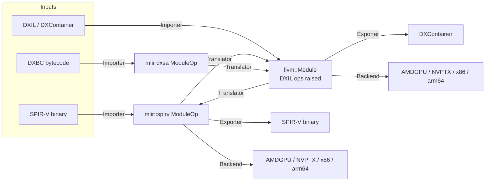

# FeMe: FrontEnd for the MiddleEnd — Design Document

## Summary

FeMe ("FrontEnd for the MiddleEnd") is a library and command line tool for
reading pre-existing shader/kernel intermediate representations — initially
**SPIR-V**, **DXBC**, and **DXIL** — and translating them into
[MLIR](https://mlir.llvm.org/) and/or [LLVM IR](https://llvm.org/docs/LangRef.html),
so that they can be re-optimized, re-targeted to native ISAs (AMDGPU, NVPTX,
X86, AArch64, etc.), or translated into one of the other supported input IRs
(e.g. DXBC → DXIL, DXIL → SPIR-V).

FeMe is not a new "universal IR". It is the plumbing that gets bytes in one of
these existing formats into an IR that the rest of LLVM/MLIR already knows how
to optimize and compile, and back out again. Where possible it reuses existing
LLVM/MLIR infrastructure (the MLIR `spirv` dialect, the LLVM `DirectX`
target's DXIL knowledge, the LLVM `SPIRV` target, MLIR's GPU dialects, etc.)
rather than re-implementing it.

FeMe is designed first and foremost **as a library**. The command line tool is
a thin client of that library. This has architectural consequences described
throughout this document, most importantly: **no global/mutable static
state**.

## Motivation

Today, tools that need to consume, analyze, transform, or re-target compiled
shader/kernel binaries (DXBC, DXIL, SPIR-V) each grow their own bespoke
parsing and lowering code, or shell out to format-specific tools with no
shared infrastructure. LLVM and MLIR already contain most of the pieces
needed to represent and optimize these programs once they're in the
front door:

- MLIR has a mature `spirv` dialect and SPIR-V (de)serializer.
- LLVM's `DirectX` target already understands the DXIL "op" encoding used to
  *emit* DXIL from LLVM IR.
- MLIR and LLVM have rich conversion/optimization/target infrastructure
  (`GPU`, `NVVM`, `ROCDL`, `LLVM` dialects; `AMDGPU`, `NVPTX`, `X86`, `AArch64`
  backends).

What's missing is the **front door**: a coherent, library-first component
that reads these binary/legacy formats and hands the result to the rest of
the ecosystem in a form it already understands, and that can go back out
again. FeMe fills that gap.

Primary driving use cases:

1. **Shader recompilation for GPU drivers** — a driver receives DXIL, DXBC,
   or SPIR-V and needs to (re)compile it to native ISA at install time,
   first-run, or JIT time.
2. **Offline cross-compilation / translation tools** — e.g. translating
   DXIL to SPIR-V (or vice versa) for portability layers, without a full
   round-trip through source.
3. **Complete software implementations of the graphics APIs themselves** —
   [FeMeVulkanDesign.md](FeMeVulkanDesign.md) and
   [FeMeWARPDesign.md](FeMeWARPDesign.md) build a Vulkan ICD and a Direct3D
   software adapter on top of FeMe's CPU target, and both now target *full
   API conformance* covering compute, graphics and ray tracing. This is the
   most demanding consumer of FeMe's importers by a wide margin: a
   conformance suite exercises every corner of the source IR, so importer
   and CPU-target breadth gaps surface there as test failures long before
   any other use case notices them.

Both use cases require FeMe to work well embedded in another process (a
driver, a build tool), which is why it is designed as a library first.

## Goals

- Provide reusable **importers** that parse SPIR-V, DXBC, and DXIL into a
  representation usable by MLIR and/or LLVM IR-based tooling.
- Provide reusable **exporters** back to those formats (at least DXIL and
  SPIR-V) so that IR-to-IR translation is possible.
- Provide **retargeting infrastructure** to lower the imported program to
  native ISA via existing LLVM targets and MLIR GPU-compilation pipelines.
- Be usable as a **linkable library with a stable, explicit-state C++ API**
  — no `cl::opt` globals, no process-wide singletons, safe to instantiate
  multiple independent instances in the same process (e.g. one per thread,
  or one per compilation).
- Be safely usable from **multi-threaded host processes**: since a primary
  use case (GPU driver shader recompilation) routinely imports/translates/
  retargets many shaders concurrently across worker threads, FeMe's
  interfaces must support one `feme::Context` per thread with no hidden
  contention or shared mutable state between them (see Core Architectural
  Principle below).
- Because FeMe's importers are a runtime driver's primary attack surface for
  untrusted, externally-supplied shader binaries, **fuzzing the binary-format
  importers (DXBC, DXIL, SPIR-V) is a v1 priority**, not a fast-follow —
  harnesses should land alongside each importer as it's implemented (see
  Testing Strategy below).
- Follow **LLVM/MLIR coding conventions**: `LLVMStyle` formatting, `Expected<T>`
  / `Error` for fallible operations and diagnostics, `-title-case-Doxygen`
  comments, lit + FileCheck based tests, unittests via `gtest`, layout
  conventions matching sibling subprojects (`mlir/`, `offload/`).
- Live in the `llvm-project` monorepo as a sibling project (comparable to
  `mlir`, `offload`), buildable via `LLVM_ENABLE_PROJECTS`/
  `LLVM_ENABLE_RUNTIMES`-style opt-in. Standalone (out-of-tree) builds
  against an installed LLVM+MLIR, mirroring `offload-test-suite`, are out of
  scope for now — the CMake structure needed to add it later is
  straightforward and shouldn't require a redesign.
- Support incremental growth to additional input IRs beyond the initial
  three without an architectural rewrite.

## Non-Goals (for now)

- FeMe is **not** a shader compiler front end (it does not compile HLSL/GLSL
  source). It starts from already-compiled IR.
- FeMe does not aim to be a bit-perfect, fully round-trippable
  decompiler — recovering original source-level constructs is out of scope.
  Fidelity requirements are "sufficient to reoptimize and retarget
  correctly", not "reproduces the original module".
- FeMe does not initially provide a stable C API (see Library API Shape
  below). A C++ API is the initial deliverable; a C API is planned, but
  deliberately sequenced after `feme` CLI tooling is functional and tested
  (see Roadmap / Milestones below), not dropped as a non-goal.
- FeMe does not initially ship its own standalone, user-facing optimizer
  binary in the sense of a general `mlir-opt`/`opt`-style product feature.
  It does, however, ship `feme-opt` as **testing infrastructure** from v1
  (see Command Line Tool(s) and Testing Strategy below) — FeMe's own
  MLIR/LLVM IR passes (DXIL op raising, `dxsa` lowering/canonicalization,
  etc.) need a way to be exercised directly on textual IR via `lit`, the
  same way `mlir-opt`/`opt` let MLIR/LLVM passes be tested in isolation
  from any frontend.
- FeMe does not target MLIR's `gpu` dialect / structured GPU compilation
  pipeline (kernel outlining, `gpu-to-rocdl`/`gpu-to-nvvm`) in v1 — there is
  no concrete client for it yet. Direct `llvm::Module` → `TargetMachine`
  retargeting via the in-tree `AMDGPU`/`NVPTX` backends is sufficient for
  now (see Retargeting to Native ISA below); `gpu`-dialect retargeting can
  be added later as an additional `Backend` without a redesign.

## Prior Art and Reused Infrastructure

FeMe explicitly builds on top of, rather than replacing:

| Format | Existing LLVM/MLIR infrastructure | What FeMe adds |
|---|---|---|
| SPIR-V | MLIR `spirv` dialect + deserializer/serializer (`mlir/lib/Target/SPIRV`), `SPIRVToLLVM` conversion | Entry points, diagnostics integration, retargeting glue, DXIL/DXBC interop |
| DXIL | LLVM `DirectX` target (`llvm/lib/Target/DirectX`) understands DXIL op encoding, `DXContainer` format (`llvm/lib/BinaryFormat/DXContainer.h`, `llvm/lib/MC/*DXContainer*`) for *emitting* DXIL | A *reader* (inverse direction): `DXContainer` parsing, a DXIL-compatible bitcode reader, and a "DXIL op raising" pass (inverse of `DXILOpLowering`) |
| DXBC | An in-progress prototype dialect and bytecode reader exist on the `wip/dxsa-mlir` branch of the [`access-softek/llvm-project`](https://github.com/access-softek/llvm-project) fork, currently living under `mlir/{include,lib}/Dialect/DXSA` and `mlir/lib/Target/DXSA` (not upstreamed into MLIR proper); the writer (`dxsa::serialize`, the assembler direction) is currently an unimplemented stub | Migrate that dialect (`dxsa`) and its `BinaryParser` into feme's tree, refactoring to fit feme's conventions; implement the currently-stubbed `BinaryWriter` (needed as a DXBC assembler for testing, see Testing Tools below); continue extending opcode coverage |

FeMe should be viewed as the missing "read" half of infrastructure whose
"write" half already exists in-tree (DirectX target, SPIR-V target), plus a
migration target for the one format (DXBC) whose prototype representation
exists only on a topic branch, not upstream.

## Core Architectural Principle: No Global State

Because FeMe must be safely embeddable in long-lived host processes (drivers)
that may compile many shaders concurrently or sequentially with different
options, FeMe must avoid the classic LLVM tool patterns that rely on
process-global state:

- No `llvm::cl::opt` for configuring library behavior *or* the main CLI
  tool. `cl::opt` is acceptable only in narrowly-scoped, testing-only
  entrypoints (e.g. a lit-test helper binary), never in `feme` or
  any library code. Instead, FeMe is structured like Clang: a thin `main()`
  hands `argc`/`argv` to an options component built on LLVM's `llvm::opt`
  library (`OptTable`/`ArgList`, driven by an `Options.td`), which parses
  arguments into explicit option structs (`ImportOptions`, `ExportOptions`,
  `BackendOptions`, etc.). Building this on `llvm::opt` rather than
  `cl::opt` means the same options-parsing component can be linked into
  both the CLI tool and an embedding driver that wants a consistent,
  CLI-compatible way to configure FeMe, without pulling in global `cl::opt`
  registration.
- No function-local `static` mutable state, no Meyer's-singleton managers.
- No reliance on a single global `LLVMContext` or `MLIRContext` — every
  operation takes an explicit context object (see `feme::Context` below).
- Diagnostics are delivered through an explicit, caller-supplied callback /
  `DiagnosticHandler`, never printed directly to `errs()` by library code.
- Thread-safety: two independent `feme::Context` instances used from two
  threads must never contend or share mutable state. A single `Context` is
  *not* required to be thread-safe for concurrent use (matching
  `MLIRContext`/`LLVMContext` conventions) — callers needing concurrency use
  one `Context` per thread, which is cheap to create.
- `Importer`/`Exporter`/`Translator`/`Backend` implementations themselves
  must be stateless/reentrant (no mutable instance fields written during
  `import`/`export`/`translate`/`run`) so that the *same* statically-linked
  component instance can be safely invoked concurrently from multiple
  threads, each passing its own `Context`. This is what makes per-thread
  `Context`s cheap: the (potentially large) format-specific tables owned by
  an `Importer`/`Exporter` are built once and shared read-only, rather than
  duplicated per `Context`.
- This matters because a primary use case is a driver library embedded in a
  multi-threaded host process, compiling many independent shaders
  concurrently (one `Context` per worker thread) with no global locks,
  static caches, or ordering dependencies between threads.

This mirrors how MLIR itself moved away from LLVM's older global-table
style APIs, and is the main way FeMe's conventions will diverge from some
older parts of LLVM.

## `feme::Context`

All FeMe entry points take an explicit `feme::Context&` analogous in spirit
to `MLIRContext`/`LLVMContext`, but scoped to
a single FeMe "session":

```c++
namespace feme {
class Context {
public:
  explicit Context(ContextOptions Options = {});

  // Wraps an externally-owned MLIRContext instead of constructing a new
  // one (still owns its own LLVMContext); added in the "SPIR-V import"
  // roadmap step so feme-translate's format registrations can run inside
  // the same MLIRContext an mlir-translate/mlir-opt-style tool already
  // configured (dialect registry, printing flags, threading), per the
  // "Owns (or wraps caller-provided) ... instances" bullet below.
  explicit Context(mlir::MLIRContext &ExternalMLIRCtx);

  llvm::LLVMContext &getLLVMContext();
  mlir::MLIRContext &getMLIRContext();

  void setDiagnosticHandler(DiagnosticHandlerTy Handler);
  void diagnose(Diagnostic D) const;

  // Registry of available Importers/Exporters/Translators (see the
  // Pipeline Abstraction section below), populated at construction time
  // from statically-linked components; not a global registry.
  const FormatRegistry &getFormatRegistry() const;

private:
  std::unique_ptr<llvm::LLVMContext> LLVMCtx;
  std::unique_ptr<mlir::MLIRContext> OwnedMLIRCtx; // null when wrapping
  mlir::MLIRContext *MLIRCtx;
  DiagnosticHandlerTy DiagHandler;
  FormatRegistry Registry;
};
} // namespace feme
```

Key properties:

- Owns (or wraps caller-provided) `LLVMContext` and `MLIRContext` instances,
  so that a single FeMe `Context` produces IR that is trivially interoperable
  (same contexts) across import/translate/export/retarget steps.
- Registers the MLIR dialects FeMe needs (`spirv`, `llvm`, `func`, `gpu`,
  target-specific dialects like `nvvm`/`rocdl`, plus FeMe's own dialects such
  as `dxsa`) **eagerly at construction**, matching how most MLIR tools set
  up their context up front. This can be revisited toward lazy/on-demand
  registration later if `Context` construction cost becomes a real concern,
  but eager registration is the simpler starting point.
- Carries no format-specific configuration itself; format-specific options
  (e.g. target SPIR-V version, DXIL validator version) are passed to the
  relevant Importer/Exporter, not stored globally on `Context`.

#### Status: `setDiagnosticHandler`/`diagnose`, `FormatRegistry` (implemented)

`Context::setDiagnosticHandler`/`diagnose` (`feme::Diagnostic`/
`DiagnosticSeverity`/`DiagnosticHandlerTy`, `feme/include/feme/Core/
Diagnostic.h`) are implemented: warnings/notes that don't abort an
operation (see "Diagnostics and Error Handling" below) now go through
`Ctx.diagnose(...)` instead of library code writing to `errs()` directly
-- `feme::Driver::run`'s "`--wave-size` is ignored for this target"
warning is the first, and so far only, caller. No handler is installed by
default; a `Context` with none set silently drops diagnostics, and only a
CLI tool (`feme`/`feme-run`) that wants them printed installs one of its
own.

`Context::getFormatRegistry()` (`feme::FormatRegistry`,
`feme/include/feme/Core/FormatRegistry.h`) is also implemented, mapping
format names to the `Importer`/`Exporter` instance that handles them.
Deviation: FeMeCore (where `Context`/`FormatRegistry` live) cannot depend
on the format libraries (`FeMeImportDXIL`, `FeMeExportDXIL`, ...) without
an upward, cyclic library dependency -- those libraries already depend on
FeMeCore for `Context`/`Module` -- so a bare `Context`'s registry starts
empty rather than being populated by `Context`'s own constructor as the
class sketch above suggests. `feme::Driver`, which already links every
format library, populates its `Context`'s registry lazily (at most once
per `Context`) in its own constructor instead; see the "Status:
`feme::Driver`" section below for how this replaces `detectFormat`'s
former file-local `static const` Importer instances.


FeMe models its work as four composable, single-step operations, plus a
`Driver` that chains them into full toolchain invocations (see `Driver`
below). All five are pure functions of their inputs (module, options,
`Context`) with no side effects beyond diagnostics:



### `Importer`

Parses a format's binary encoding into an in-memory representation
(the Per-Format Representation Strategy section below discusses *which*
representation per format).

```c++
class Importer {
public:
  virtual ~Importer() = default;
  virtual llvm::Expected<Module> import(llvm::MemoryBufferRef Buffer,
                                         const ImportOptions &Opts,
                                         Context &Ctx) const = 0;
  virtual llvm::StringRef getFormatName() const = 0;
};
```

`ImportOptions` (implemented starting with the SPIR-V `Importer`) is a
single plain, non-polymorphic struct shared by all formats, growing one
field per format-specific knob (e.g. SPIR-V's control-flow
structurization toggle), rather than a per-format options subtype:
FeMe does not use RTTI (see feme/.instructions.md), so `Importer::import`
could not safely downcast a base `ImportOptions&` to a format-specific
subclass.

### `Exporter`

The inverse of an `Importer`: serializes a `Module` back to a format's binary
encoding. Not every format needs to support export in v1 (DXBC export is not
a current use case), but the interface is symmetric.

#### Status: `feme::Exporter`; `feme::DXILExporter`/`feme::SPIRVExporter` (implemented)

`feme::Exporter` (`feme/include/feme/Export/Exporter.h`) is implemented,
mirroring `Importer`'s shape (an `ExportOptions` struct, currently empty,
for the same "single plain struct, no RTTI downcast" reason `ImportOptions`
is one). `feme::DXILExporter`/`feme::SPIRVExporter`
(`feme/lib/Export/DXIL`/`feme/lib/Export/SPIRV`) are thin wrappers: each
resolves the same DXIL/SPIR-V target triple `feme::Driver`'s
`resolveTargetTriple` already computes (preserving a DXIL-originated
module's recovered shader model, or a SPIR-V-originated module's own
environment) and delegates the actual codegen to the existing
`feme::TargetMachineBackend` -- this closes "DXIL/SPIR-V export is spelled
as a `Backend` today" without introducing a second, parallel lowering
path. `feme::FormatRegistry` (see the "`feme::Context`" section above) maps
format names to Exporters the same way it does Importers; `feme::Driver`
registers both and, for a `--target` of `"dxil"`/`"spirv"` specifically,
now goes through the registered Exporter instead of calling
`TargetMachineBackend` directly (any other `--target`, i.e. real-ISA
retargeting, is unaffected). DXBC has no Exporter, matching this section's
"not a current use case" note above.

### `Translator`

Converts a `Module` from one format's representation into another's
(e.g. DXBC's `dxsa` dialect into DXIL-flavored LLVM IR), without necessarily
producing a byte-for-byte serialization of the destination format — the
result can then be run through that format's `Exporter` if serialized bytes
are needed, or consumed directly by further passes/backends.

### `Backend` (retargeting)

Lowers a `Module` to native ISA using existing LLVM target infrastructure
(see Retargeting to Native ISA below). This is deliberately *not*
format-specific: once a program is
LLVM IR (or MLIR `llvm`/`gpu` dialect), retargeting reuses standard
`TargetMachine`/`gpu-to-*` infrastructure, regardless of which frontend it
came from.

### `Driver`

`Importer`/`Translator`/`Exporter`/`Backend` are deliberately low-level,
single-step primitives. Most callers (the `feme` CLI, and eventually the C
API) don't want to manually wire up "which importer, then which translator,
then which backend" for a given input file and `--target` request — they
want to hand FeMe a destination format/ISA and a buffer, and get a result,
with the source format detected automatically from the buffer's contents.
`feme::Driver` is that orchestration layer:

```c++
class Driver {
public:
  explicit Driver(Context &Ctx);

  // Computes and runs the full chain of Importer -> Translator(s) ->
  // Exporter/Backend steps needed to go from the input's detected format to
  // Opts.Target, consulting Ctx.getFormatRegistry() to find each step.
  llvm::Expected<DriverResult> run(llvm::MemoryBufferRef Input,
                                    const DriverOptions &Opts) const;
};
```

This mirrors how Clang's driver builds a sequence of "jobs" (compile, then
assemble, then link) from a requested input/output pair, rather than
requiring the caller to invoke the compiler, assembler, and linker
separately. `Driver` is intentionally a thin layer *on top of* the four
pipeline primitives — it contains no format-specific logic of its own, only
the logic to detect the input format and sequence the right
`Importer`/`Translator`(s)/`Exporter`/`Backend` for a requested `Target`
(e.g. a DXBC input with `--target=spirv` resolves to the DXBC `Importer` →
the `dxsa` → raised-LLVM-IR `Translator` → the LLVM `SPIRV` `Backend`, per
the Translation Matrix below). Embedding consumers that want single-step
control (e.g. "just import, hand me the `Module`, I'll do the rest") can
still use `Importer`/`Translator`/`Exporter`/`Backend` directly — `Driver`
is a convenience built from the same public interfaces, not a required
entry point.

#### Status: `feme::Driver` (implemented for `dxil`/`spirv`/`dxbc` import; `dxil`/`spirv`/native-ISA output)

`feme::Driver` (`feme/include/feme/Driver/Driver.h`,
`feme/lib/Driver/Driver.cpp`) is implemented, and is what the `feme` CLI
(`feme/tools/feme/feme.cpp`) drives: given `DriverOptions` (reusing
`feme::frontend::DriverOptions`, per "Library API Shape" below, rather than
a second identical struct) and an input buffer, it detects which `Importer`
to use from the buffer's contents ("dxil", "spirv", or "dxbc" -- a legacy
DXBC `DXContainer` and a DXIL one share the same "DXBC" magic, so telling
them apart needs a peek at which part the container carries, `SHEX`/`SHDR`
for DXBC or `DXIL`/`ILDB` for DXIL; any input whose format cannot be
determined this way is rejected with a diagnostic rather than a crash),
translates the result to an `llvm::Module` (directly for DXIL, via
`SPIRVToLLVMTranslator` for SPIR-V, via `feme::dxsa::
DXSAToLLVMIRTranslator` for DXBC), and then runs the raising/lowering chain
that gets from that to the requested destination:

1. For DXIL *or* DXBC input: `feme::dxil::OpRaisingPass`, then
   `feme::dxil::MetadataRaisingPass` (in that order -- the first consumes
   the `!dx.resources` metadata the second drops). A DXBC-derived module
   needs this too: `feme::dxsa::translateToLLVMIR` deliberately targets
   DXIL's own `dx.op.*` calling convention directly (see the DXBC section
   below) rather than idiomatic LLVM IR, so it is exactly as unraised as a
   directly-imported DXIL module is.
2. Resolve `Opts.Target` to a concrete target triple: `"dxil"`/`"spirv"`
   resolve to that format's own triple, preserving the pipeline stage a
   DXIL-originated module names (recovered by `MetadataRaisingPass`), as the
   environment component of a `dxil-unknown-shadermodelX.Y-<stage>` or
   `spirv-unknown-vulkan-<stage>` triple; `"spirv"` likewise keeps the triple
   a SPIR-V-originated module already carries (recorded by FeMe's SPIR-V ->
   `llvm` dialect conversion); anything else is used as a triple directly.
   This step happens *after* raising precisely so that recovered stage is
   available.
3. For any destination other than DXIL: `feme::dxil::IntrinsicExpansionPass`.
4. For a SPIR-V destination: `feme::spirv::RaisedLoweringPass`.
5. For an `amdgcn-*` destination: `feme::amdgpu::ResourceLoweringPass`, then
   `feme::amdgpu::RaisedLoweringPass` (in that order -- the first rewrites
   entry point signatures, which the second then sees as ordinary
   functions).
6. `feme::OptimizerPipeline`, at `Opts.OptLevel` (`-O0` by default, `-O1`/
   `-O2`/`-O3`, or the `-Od` alias for `-O0` -- see "Command Line Tool(s)"
   below). Runs after every format-specific raising pass so the optimizer
   always sees idiomatic LLVM IR, and before codegen, matching where
   `clang`/`opt -O<N> | llc` run the optimizer relative to instruction
   selection.
7. `feme::TargetMachineBackend`.

`Ctx.getFormatRegistry()` (see the "`feme::Context`" section's Status note
above) now backs format detection: `Driver`'s constructor populates it
(lazily, at most once per `Context`) with the same three Importers/two
Exporters `detectFormat`/the final export step used to hold as file-local
`static const` instances, and `feme::detectFormat`
(`feme/lib/Driver/Driver.cpp`) now looks each up by name in the registry
instead. `Driver`'s own public interface is unchanged, matching what this
section previously anticipated.

Validated end to end (see `test/Tools/feme/feme-*.{ll,mlir,test}`): DXIL
retargeted to DXIL, to SPIR-V, and to a real ISA (`amdgcn-amd-amdhsa`), each
for a shader that writes a `RWBuffer<float4>` indexed by its dispatch-wide
thread id; the SPIR-V "null pipeline" (see the deviation note under
Retargeting to Native ISA below) through the full CLI rather than composed
one `feme-translate` stage at a time; a SPIR-V compute shader that reads its
dispatch thread id and reads and writes a bound `RWBuffer` retargeted back to
SPIR-V; SPIR-V retargeted to `amdgcn-amd-amdhsa`; and clean (non-crash)
diagnostics for an input file whose format cannot be detected and a missing
`--target`.

Also validated manually against real `dxc`-compiled output for the HLSL
Mandelbrot compute shader driving this work (not checked in, per "Avoiding
binary test fixtures" below): `dxc -T cs_6_5`'s DXContainer retargets
successfully to all three of DXIL, SPIR-V, and AMDGPU. The same shader
compiled with `dxc -T cs_6_5 -spirv` *imports* successfully (see the
control-flow structurization deviation above), and its resource declarations,
resource accesses and builtin input variables all now convert (see "FeMe's
SPIR-V -> `llvm` dialect conversion" above). What that direction is still
missing is breadth of SPIR-V coverage rather than any structural gap; see
"Known gap: `spirv` dialect -> `llvm` dialect conversion coverage" below for
what is not covered yet.

### `feme::Module`

Because different formats are best represented differently (see the
Per-Format Representation Strategy section below), FeMe needs a small
variant-like wrapper so generic code (the CLI, pipeline glue) can
hold "a module" without caring which underlying representation is active:

```c++
class Module {
public:
  enum class Kind { MLIR, LLVMIR };

  template <typename OpTy>
  static Module fromMLIR(mlir::OwningOpRef<OpTy> M);
  static Module fromLLVMIR(std::unique_ptr<llvm::Module> M);

  Kind getKind() const;
  mlir::Operation *getMLIROperation() const;             // asserts getKind() == MLIR
  mlir::OwningOpRef<mlir::Operation *> takeMLIROperation(); // asserts getKind() == MLIR
  llvm::Module &getLLVMModule() const;                    // asserts getKind() == LLVMIR
};
```

This is intentionally a thin, low-ceremony wrapper — it is not a new IR, it's
a tagged union over the two IRs FeMe actually produces.

Deviates from an earlier draft of this sketch, which had `fromMLIR` take an
`mlir::OwningOpRef<mlir::ModuleOp>` specifically and `getMLIRModule()` return
`mlir::ModuleOp`: implemented starting with the SPIR-V `Importer`, whose
top-level op is `mlir::spirv::ModuleOp` (not the builtin `mlir::ModuleOp`),
`fromMLIR` is instead a function template accepting any top-level op type,
and `Module` type-erases to `mlir::OwningOpRef<mlir::Operation *>`
internally; callers that know the concrete format cast the result back with
`mlir::cast`/`mlir::dyn_cast`. `takeMLIROperation()` was added for handing
ownership back to generic MLIR tooling that manages its own operation
lifetime (e.g. feme-translate's translation registrations).

## Per-Format Representation Strategy

This is the crux of the design and the area with the most nuance.

### SPIR-V → MLIR `spirv` dialect (reuse, do not reinvent)

SPIR-V already has a first-class, actively maintained MLIR dialect with a
complete deserializer/serializer. FeMe's SPIR-V `Importer` is a thin wrapper
around `mlir::spirv::deserialize`, producing an `mlir::spirv::ModuleOp`. FeMe
does **not** define its own SPIR-V representation.

From there, FeMe leverages existing MLIR conversions (`SPIRVToLLVM`, and
`spirv`-dialect canonicalization/transform passes already in MLIR) to reach
the `llvm` dialect / `llvm::Module` for retargeting or for DXIL export.

#### Status: SPIR-V -> MLIR `llvm` dialect -> LLVM IR (implemented, as two composable stages)

The `spirv` dialect -> `llvm::Module` leg above is implemented as two
separate `Translator`s, each independently registered with `feme-translate`
(see the "Testing Tools" section) and `lit`-tested on its own, rather than
one opaque step -- matching how DXIL's `feme::dxil::OpRaisingPass` is
tested in isolation rather than only end to end:

1. `feme::SPIRVToLLVMDialectTranslator` (`spirv` -> `llvmdialect`,
   `feme/lib/Translate/SPIRV/SPIRVToLLVMDialectTranslator.cpp`): runs
   `feme::spirv::createConvertSPIRVToLLVMPass` (see "FeMe's SPIR-V -> `llvm`
   dialect conversion" below) and stops at the resulting `llvm` dialect
   `mlir::ModuleOp` -- this is "read SPIR-V into MLIR, [then] translate that
   to the LLVM-IR dialect".
2. `feme::LLVMDialectToLLVMIRTranslator` (`llvmdialect` -> `llvmir`,
   `feme/lib/Translate/LLVMIR/LLVMDialectToLLVMIRTranslator.cpp`): runs
   `mlir::translateModuleToLLVMIR` on an `llvm` dialect module. This stage is
   deliberately format-agnostic (it does not depend on the `spirv` dialect
   at all) since it is the same "last mile" any FeMe pipeline that reaches
   the `llvm` dialect needs, matching how DXIL import re-enters MLIR only at
   the `llvm` dialect for passes that need it (see the DXIL section below).

`feme::SPIRVToLLVMTranslator` (`spirv` -> `llvmir`) composes both stages
into a single `Translator` for callers that want the end-to-end result
without caring about the intermediate `llvm` dialect representation (e.g.
the SPIR-V "null pipeline" deviation below, which historically used it
directly); it contains no logic of its own beyond that composition.

The resulting `llvm::Module` is then handed to `feme::TargetMachineBackend`
targeting LLVM's in-tree `SPIRV` backend (`llvm/lib/Target/SPIRV`), which
lowers it the rest of the way to a real SPIR-V binary.

#### FeMe's SPIR-V -> `llvm` dialect conversion

`feme::spirv::createConvertSPIRVToLLVMPass`
(`feme/lib/Conversion/SPIRVToLLVM/`, registered with `feme-opt` as
`--feme-convert-spirv-to-llvm`) is a superset of MLIR's own
`convert-spirv-to-llvm`: it runs all of MLIR's patterns, plus FeMe's own at a
higher benefit for the constructs where MLIR either has no pattern at all or
has one aimed at a different consumer.

That difference in consumer is the crux. MLIR's conversion exists to feed
MLIR's SPIR-V *runner*, which executes a shader on the host: a resource
becomes an LLVM global the runner binds memory to, a builtin input variable
becomes a global the runner writes the thread index into, and an execution
mode becomes a `__spv__<entry>_execution_mode_info_<mode>` global the runner
reads. FeMe's consumer is LLVM's in-tree `SPIRV` backend, which models all
three as *target intrinsics and function attributes* instead, and which
therefore sees a module converted MLIR's way as one that loads from globals
nothing ever defines.

Naming target intrinsics is only meaningful once a module says what target it
is for, so the pass first records the SPIR-V environment the `spirv.module`
was written for -- a Vulkan shader triple naming the pipeline stage of its
entry points (`spirv-unknown-vulkan-compute`), or an OpenCL flavored
`spirv32`/`spirv64-unknown-unknown` for `Kernel` entry points -- as the
`llvm.target_triple` and `llvm.data_layout` module attributes
`mlir::translateModuleToLLVMIR` forwards onto the `llvm::Module`. The `llvm`
dialect can then name the backend's intrinsics directly, as
`llvm.call_intrinsic "llvm.spv.*"` ops, and FeMe's patterns do:

| SPIR-V | FeMe emits | MLIR's conversion emits |
| --- | --- | --- |
| `spirv.EntryPoint`/`spirv.ExecutionMode` | `hlsl.shader`/`hlsl.numthreads` function attributes | a `__spv__*_execution_mode_info_*` global |
| builtin input variable (`GlobalInvocationId`, ...) | `llvm.spv.thread.id` & friends, one call per vector component | a load from an `external constant` global |
| resource variable (image/sampler, `bind(set, binding)`) | `llvm.spv.resource.handlefrombinding` | an `external constant` global whose *name* encodes the binding |
| `spirv.ImageRead`/`spirv.ImageWrite`/`spirv.ImageFetch` (no modifiers) | `llvm.spv.resource.getpointer` + `llvm.load`/`llvm.store` | *(no pattern; fails to legalize)* |
| `spirv.ImageFetch` with a lone `Lod` operand (`Texture2D<T>::Load`, which `dxc` always gives an explicit mip) | `llvm.spv.resource.load.level` | *(no pattern; fails to legalize)* |
| `spirv.ImageQuerySize` | `llvm.spv.resource.getdimensions.{x,xy,xyz}` | *(no pattern; fails to legalize)* |
| `spirv.SampledImage` + `spirv.ImageSampleImplicitLod` (no modifiers) | `llvm.spv.resource.sample`, image/sampler handles carried as a struct in between | *(folds both handles into one combined runner-facing type; no sampling op pattern at all)* |
| `spirv.ImageSampleExplicitLod` with a lone `Lod` operand | `llvm.spv.resource.samplelevel` | *(no pattern; fails to legalize)* |
| `spirv.Switch` | `llvm.switch`, case literals rebuilt against the (post-conversion, signless) selector type | *(no pattern; fails to legalize -- see "`spirv.Switch` op is not supported at the moment" in `mlir::populateSPIRVToLLVMConversionPatterns`)* |
| `spirv.Dot` | a per-lane `llvm.intr.fmuladd` chain, mirroring `feme::dxil::expandFDot`'s expansion of the analogous (post-raising) `llvm.dx.fdot` intrinsic | *(no pattern; fails to legalize)* |
| `StorageBuffer` block variable (`RWStructuredBuffer<T>`/`StructuredBuffer<T>`) and `spirv.AccessChain` into it | `llvm.spv.resource.handlefrombinding` to a `target("spirv.VulkanBuffer", ...)` handle, `llvm.spv.resource.getpointer` for the buffer index plus an ordinary `llvm.getelementptr` for any further field indices | an `llvm.mlir.global` in the pointer's storage class's address space (memory nothing binds to for the SPIRV backend's consumer) |
| `PushConstant` block variable | an `llvm.mlir.global` in address space 13, which LLVM's own `SPIRVPushConstantAccess` backend pass finds and rewrites into the `spirv.PushConstant` handle representation itself | *(storage class not among the ones MLIR's `GlobalVariablePattern` converts; fails to legalize)* |
| `TaskPayloadWorkgroupEXT` variable (a task entry's bounded payload, SPIR-V enum 5402) | an `llvm.mlir.global` in address space 14 -- a FeMe-only convention, since LLVM's own `storageClassToAddressSpace` (`llvm/lib/Target/SPIRV/SPIRVUtils.h`) has no mapping at all for this storage class (roadmap H6h) | *(storage class not among the ones MLIR's `GlobalVariablePattern` converts; fails to legalize)* |
| `spirv.Constant` of `spirv.array` type (e.g. a `const static` HLSL array) | one flat `llvm.mlir.constant`, whatever the array's nesting | *(scalar/vector only; fails to legalize for an array)* |
| `spirv.CompositeConstruct` building a vector (e.g. `floatN(...)`, a `.xxx` swizzle) or a struct (e.g. assembling a whole HLSL struct value before storing it in one shot) | an `llvm.mlir.poison` seed plus one `llvm.insertelement` per lane, or one `llvm.insertvalue` per member (reassembling a real-vector constituent lane-by-lane into a roadmap-L13 tight-vector-substituted member's array type, since `llvm.bitcast` cannot itself produce an aggregate result) | *(no pattern; fails to legalize)* |

Real `dxc`-compiled SPIR-V also spells "no image operand modifiers" as an
explicit `#spirv.image_operands<None>` attribute on `spirv.ImageRead`/
`spirv.ImageWrite`, rather than omitting the (optional) attribute entirely;
`feme::spirv::hasImageOperands` checks the attribute's *value*, not just its
presence, so a real access is not rejected as if it used a modifier (`Lod`,
`Bias`, ...) neither pattern supports.

Since a builtin variable and a resource handle are values the backend
materializes on demand rather than memory, the pointers SPIR-V reads them
through convert to the *value* type: `!spirv.ptr<T, Input>` to `T`, and
`!spirv.ptr<image, UniformConstant>` to the `target("spirv.Image", ...)`
handle type. `spirv.Load` through such a pointer is then the identity. A
consequence is that non-builtin `Input` variables (stage inputs) now fail to
legalize with a diagnostic rather than converting to a pointer nothing can
produce; they had no working lowering either way.

A storage buffer's pointer works the same way one level up: the *block*
pointer (the variable's own declared type) converts to the
`spirv.VulkanBuffer` handle, but every pointer an access chain into it
produces converts to an ordinary `!llvm.ptr` in address space 11 (the
address space LLVM's SPIRV backend expects a storage buffer access to use),
since those are real memory once the handle has been materialized --
`feme::spirv::BlockAccessChainPattern` itself builds any further
`llvm.getelementptr` navigating a selected member's own fields/elements
(a matrix, a sized array, or a nested struct), rather than falling through
to MLIR's own `AccessChainPattern`, which cannot: its base pointer is the
handle type, not `!llvm.ptr`. This also needed one narrower fix: MLIR's own
runtime array conversion refuses one with a nonzero `ArrayStride`
decoration, which every runtime array nested in a real (Vulkan-valid)
storage buffer block carries, so FeMe's own conversion drops the stride (the
resulting `!llvm.array<0 x T>`'s layout comes from `T` alone).

#### Deviation: a std140 uniform buffer array needs its own explicit stride

A *uniform* buffer's own sized (not runtime) array member needed a second,
related fix (roadmap F12a). MLIR's own `spirv::ArrayType` conversion
(`convertArrayType` in SPIRVToLLVM.cpp) is stricter than its runtime-array
counterpart above: it refuses to convert an array at all unless its
declared `ArrayStride` equals its element's *natural* Vulkan stride
(originally, and until roadmap H6g-b-a-i fixed it, this was the element's
raw/compact LLVM ABI size -- wrong for a 3- or 4-component vector, whose
element's *base alignment* the stride must actually be a multiple of
instead, per the Vulkan spec; see that row's own design/report entries).
That was always true for a std430 storage buffer array (the only kind the
fix above needed to cover), but not for a std140 *uniform* buffer array,
whose every element is widened to a 16-byte-aligned stride regardless of
its own size -- e.g. `layout(std140) uniform Input { uint data[16]; }`'s
own 16-byte stride against its `uint` element's own 4-byte size, the shape
`dEQP-VK.pipeline.monolithic.push_descriptor.compute.incremental_updates*`
hits. Dropping the stride the way the runtime-array fix does is not an
option here: unlike a storage buffer's own dynamically-sized array, whose
real per-element stride is recovered from its element type's own natural
size (a std430 invariant), a std140 array's real stride has to come from
somewhere, and the only place left to carry it is the `spirv.VulkanBuffer`
handle type itself.

So a uniform block whose sole member is a fixed-size array is recognized
by `feme::spirv::getUniformBlockElement` as FeMe's own wrapper shape --
exactly like a storage buffer's own sole runtime-array member already is --
rather than navigated as an ordinary struct field: its dynamic index
reaches `llvm.spv.resource.getpointer` directly, with the array's own
`ContentType` reduced to the same `!llvm.array<0 x T>` marker a storage
buffer's own wrapper already uses (see `convertUniformArrayContent`), and
its real stride carried as `spirv.VulkanBuffer`'s own third integer
parameter -- present only for this shape, absent (and so implicitly
"derive from the element's own natural size") for every other one.
`feme::cpu::SPIRVResourceLoweringPass`'s `classifyVulkanBufferHandle` reads
that third parameter back and multiplies the dynamic array index by it at
lowering time, exactly the arithmetic a storage buffer's own dynamic array
access already used.

The right-hand column of that table is deliberately the same representation
`feme::spirv::RaisedLoweringPass` produces in the DXIL -> SPIR-V direction,
so both front ends converge on one spelling of a resource handle, a typed
buffer access and a thread index before any retargeting pass runs. FeMe still
does not emit `llvm.spv.*` for anything that has a target-independent LLVM
equivalent -- arithmetic, control flow, memory -- only for the shader
concepts that do not.

#### Deviation: a std430 array of 3-/4-component vectors needs its element's base alignment, not its compact size, for stride validation

Roadmap H6g-b-a-i found a real, upstream MLIR bug in the very
`convertArrayType` stride check the prior deviation above already
described as "always true for a std430 storage buffer array": that
description was itself wrong for an array of 3-component vectors (and,
more generally, of anything whose Vulkan *base alignment* differs from its
own compact size). `vector<3xf32>`'s compact size is 12 bytes, but its
Vulkan base alignment -- and so the `ArrayStride` every conformant SPIR-V
producer (glslang included) emits for an array of one -- is 16 bytes, the
same as a 4-component vector's. `convertArrayType` validated the declared
stride against the element's raw `SPIRVType::getSizeInBytes()` instead,
spuriously rejecting every std430 storage buffer array of `vec3`s (a
generic, common CTS vertex-attribute shape, not mesh-shading-specific) with
`spirv.AccessChain` legalization failures.

Fixed by adding `VulkanLayoutUtils::getNaturalArrayStride(Type)` (the
element's size rounded up to its own alignment) and using it in place of
the element's raw compact size, both in `convertArrayType`'s own check and
in `VulkanLayoutUtils::decorateType(spirv::ArrayType, ...)`'s stride/total-
size computation (an independent copy of the identical flaw, backing
`SPIRVCompositeTypeLayoutPass` and `convertStructTypeWithOffset`'s own
struct-identity check). See "Roadmap H6g-b-a-i: measured impact" in
VulkanCTSReport.md for the full root-cause investigation and CTS impact.

#### Deviation: control flow structurization is not always possible on import

MLIR's SPIR-V deserializer defaults to structurizing control flow into
`spirv.mlir.selection`/`spirv.mlir.loop` regions, but it cannot do so for
every legal SPIR-V control flow graph: an `OpPhi` in a loop *merge* block --
which any loop carrying a value out of a `break` produces, i.e. most real
shader loops -- is rejected outright, because `spirv.mlir.loop` has no
results to carry that value in. Confirmed against real `dxc -spirv` output,
this makes structurized import fail on essentially every non-trivial shader.

The deserializer's unstructured mode handles the same input fine, keeping the
original CFG as block arguments and branches -- which, for FeMe's purposes,
maps *at least* as directly onto LLVM IR as the structured form does, since
LLVM IR is itself unstructured. `feme::SPIRVImporter` therefore retries with
structurization disabled when the structurized attempt fails (controlled by
`ImportOptions::SPIRVFallBackToUnstructuredControlFlow`), swallowing the
recovered-from attempt's diagnostics so only a genuine failure reaches the
caller.

#### Known gap: `spirv` dialect -> `llvm` dialect conversion coverage

Import succeeds on real shaders, and the conversion now covers the
constructs a compute shader that binds, reads and writes a typed buffer,
storage buffer or sampled texture needs (see the table above): image,
sampled image and sampler *types* convert upstream in MLIR to the same LLVM
target extension types LLVM's SPIR-V backend uses (`target("spirv.Image",
...)`, see `llvm/docs/SPIRVUsage.md`), and FeMe's own patterns cover the
resource, builtin-variable, storage-buffer, push-constant, image-access,
basic-sampling and stage-IO variable *operations*.

What is still missing is breadth rather than a structural gap:

- **Sampling variants.** `spirv.ImageSampleImplicitLod` with no modifiers and
  `spirv.ImageSampleExplicitLod` with a lone `Lod` operand convert; the
  remaining bias/gradient/depth-comparison variants (`*DrefImplicitLod`,
  ...) and `OpImageGather`/`OpImageDrefGather` each still need their own
  pattern supplying the additional operand(s)
  `llvm.spv.resource.samplebias`/`samplegrad`/`samplecmp*`/`gather*` expect.

Roadmap step V3 closed what used to be a second bullet here,
**`Uniform`-storage-class buffer blocks** (`cbuffer`/`ConstantBuffer<T>`):
`feme::spirv::convertUniformBlockType`/`BlockAccessChainPattern`
(SPIRVToLLVMPatterns.cpp) convert the standard SPIR-V *binary* shape for a
uniform block -- a single `Block`-decorated wrapper struct whose sole
member is the block's own field struct, reached through `spirv.AccessChain`
exactly like a storage buffer block is -- into the same `spirv.VulkanBuffer`
handle representation a storage buffer uses. Real `clang`-compiled cbuffer
access at the *LLVM IR* level (before LLVM's own SPIR-V backend runs, see
`llvm/lib/Target/SPIRV/SPIRVCBufferAccess.cpp`) flattens each cbuffer
member into its own external global tied back to the handle via `!hlsl.cbs`
module metadata instead, but that shape never reaches this conversion: it
is purely an intermediate representation the SPIR-V backend itself
consumes and lowers into ordinary `OpAccessChain`/`OpTypeStruct` by the
time a real binary exists, which is exactly the shape FeMe's own SPIR-V
*import* (`feme::SPIRVImporter`, `mlir::spirv::deserialize`) produces the
`spirv` dialect from. Actually importing an arbitrary real-world binary
that way remains gated on the separate, pre-existing round-trip gap
described next -- unrelated to cbuffers specifically.

Roadmap step C2 generalized that narrow shape to the ones glslang's GLSL ->
SPIR-V compilation actually emits, which never adds FeMe's own single-member
wrapper struct at all: `feme::spirv::getBufferBlockElement`/
`getUniformBlockElement` also recognize a `Block`/`BufferBlock`-decorated
struct declared directly, with more than one member (fixed header fields
alongside a storage buffer's trailing runtime array, or several ordinary
uniform-block fields), a sized-array member, a `ColMajor` matrix member
(`RowMajor`, whose physical layout is transposed from LLVM's own natural
column-major representation, is declined rather than silently
miscompiled), and the pre-SPIR-V-1.3 SSBO spelling (`Uniform` storage class
with a `BufferBlock`-decorated struct, rather than `StorageBuffer`/
`Block`). An array-of-blocks binding (`T blocks[N]` in GLSL) is handled too
-- `ArrayedBlockAccessChainPattern` builds the `spirv.VulkanBuffer` handle
itself once its own access chain's leading (array) index is available,
since unlike a non-arrayed block's handle, *which* descriptor to bind is
not known until then.

Until the sampling-variant bullet above is closed, the SPIR-V *input* half
of the translation matrix does not yet cover every shader stage or every
resource kind a real HLSL program can use.


Non-builtin `Input`/`Output` variables (a vertex shader's inputs, a fragment
shader's outputs, and so on -- roadmap R19) closed what used to be a third
bullet here: their `Location`/`Component`/`Index`/`NoPerspective`/`Flat`/
`Patch`/`Centroid`/`Sample`/`PerPrimitiveEXT` decorations convert to an
ordinary `llvm.mlir.global` in the address space (7/8) LLVM's SPIRV backend
expects that storage class to use, plus `!spirv.Decorations` metadata on it
in the same shape `buildOpSpirvDecorations`
(`llvm/lib/Target/SPIRV/SPIRVUtils.cpp`) reads back
(`feme::spirv::attachStageIODecorations`), instead of failing to legalize --
see "Signature reflection" in feme/docs/FeMeGraphicsDesign.md for what is
still deferred (feeding these variables into the `feme::EntrySignature`
model itself, and MLIR's own SPIR-V *deserializer* not yet parsing
`Component`/`Centroid`/`Sample`/`PerPrimitiveEXT` from a real binary, which
is an upstream MLIR limitation rather than one FeMe's own conversion adds).
A builtin interface block (`gl_PerVertex`) is a distinct case from either
of the two above: it converts through this same non-builtin path (its
storage class check finds nothing whole-variable to reject it on), but its
`BuiltIn` decorations are attached per member (`OpMemberDecorate`), not to
the variable itself -- see "Signature reflection"'s H2a/H2c/H2d discussion
in feme/docs/FeMeGraphicsDesign.md for that gap and its (partial, as of
H2c) resolution.

#### Known gap: `feme::SPIRVImporter` cannot deserialize LLVM SPIR-V backend output

Found by roadmap step R14 (feme/docs/Roadmap.md's §2.2.6 "Round trips")
while trying to write a SPIR-V→SPIR-V→run execute-after-round-trip test to
match the DXIL one it added: every SPIR-V binary anything in this tree
imports is produced by `feme-translate --serialize-spirv` -- MLIR's own
`spirv` dialect serializer, invoked directly on hand-authored `spirv`
dialect MLIR (see e.g. `test/Tools/feme/feme-spirv-compute-shader.mlir`).
`feme::SPIRVExporter` (the "SPIR-V" branch of `feme --target=spirv`'s
retargeting, used whenever a module -- including one `feme::SPIRVImporter`
itself just produced -- is retargeted back to SPIR-V) is a different
producer entirely: it hands idiomatic LLVM IR to `feme::TargetMachineBackend`,
i.e. LLVM's own in-tree SPIR-V code generator. That generator's binary
output is not guaranteed to deserialize back through MLIR's `spirv::deserialize`
(the two are independent, upstream components with no cross-compatibility
contract between them); concretely, retargeting
`test/Tools/feme-run/HLSL/front-end-equivalence.hlsl`'s hand-written SPIR-V
half through `feme --target=spirv` and feeding the result back into
`feme::SPIRVImporter` (via `feme-run` or `feme-translate --import-spirv`)
fails with `error: unhandled opcode 83` (`OpAccessChain`) -- despite the
*original*, non-round-tripped binary executing through `feme-run` without
issue. Closing this gap would mean either extending MLIR's SPIR-V
deserializer to accept whatever shape LLVM's SPIR-V backend emits for an
access chain (upstream MLIR work, outside this repository), or giving
`feme::SPIRVExporter` its own MLIR-`spirv`-dialect-based serialization path
instead of going through `TargetMachineBackend` (a much larger change than
this roadmap step's own testing-focused scope) -- both out of scope here.
Until one of those happens, only a SPIR-V binary produced by MLIR's own
serializer (i.e. never one that has been through `feme --target=spirv`) is
guaranteed importable.

### DXIL → stay in LLVM IR; raise DXIL ops back to idiomatic form

DXIL *is* LLVM IR: it's serialized as LLVM bitcode (frozen at an old LLVM IR
version) wrapped in a `DXContainer`, with resource accesses, math intrinsics,
etc. expressed as calls to versioned `dx.op.*` functions
(see `llvm/lib/Target/DirectX/DXIL.td`,
`llvm/lib/Target/DirectX/DXILOpBuilder.*`, and the `DXILOpLowering` pass,
which does the LLVM-IR → DXIL-ops direction today).

Given that, lifting DXIL into a *new* MLIR dialect first would mean
re-deriving structure (control flow, memory semantics, arithmetic) that
already exists faithfully in LLVM IR — pure loss of information for no
benefit. Instead:

1. **Container parsing**: parse the `DXContainer` to extract the DXIL bitcode
   part, module-level metadata (shader model/kind, resource bindings,
   signatures, etc. — much of this already has parsers in
   `llvm/lib/BinaryFormat/DXContainer.h` / `llvm/lib/MC/DXContainer*`, reused
   rather than reimplemented).
2. **Bitcode parsing**: parse the embedded bitcode with LLVM's standard
   bitcode reader. DXIL bitcode is frozen at an old LLVM IR version, but
   LLVM's bitcode format is explicitly designed for backward-read
   compatibility (unlike textual IR, which has no such guarantee) — modern
   `BitcodeReader`'s auto-upgrade logic already handles the kind of
   semantic drift (renamed intrinsics, metadata schema changes, etc.)
   involved, and this is confirmed by existing experience loading real DXIL
   with unmodified, current LLVM. No compatibility shim or vendored
   historical reader is expected to be needed for the bitstream itself; any
   remaining risk is narrow (e.g. confirming behavior for the oldest
   supported shader model versions) and can be resolved empirically during
   implementation rather than needing a design decision up front.

   Deviation: this narrow risk turned out not to be quite as narrow as
   expected -- confirmed against real `dxc`-compiled DXIL (not just
   `llc`/`llvm-as`-assembled fixtures), the module's embedded data layout
   string (`i8:32`, DXIL's real historical convention) is rejected outright
   by modern LLVM's stricter `DataLayout` parser (`i8` must be 1-byte
   aligned), independent of bitcode auto-upgrade. `feme::DXILImporter` does
   need one small compatibility shim after all: a `DataLayoutCallback`
   (passed to `llvm::parseBitcodeFile`) that normalizes `i8`'s alignment to
   8 bits, the only value modern LLVM accepts, before the layout string is
   parsed. This is a lossless normalization (modern LLVM cannot represent,
   and DXIL's own struct layouts do not rely on, any other `i8` alignment),
   not a best-effort guess.
3. **Op raising**: run a FeMe pass that is the semantic inverse of
   `DXILOpLowering` — rewrite `dx.op.*` calls back into standard LLVM IR
   constructs/intrinsics (loads/stores against resource handles, standard
   `llvm.*` math intrinsics, etc.), producing a plain `llvm::Module` with no
   DXIL-specific calling convention left in it, plus a small set of
   FeMe-defined metadata/attributes for the handful of DXIL concepts with no
   direct LLVM IR analog (resource binding info, shader stage, signatures).

The result of DXIL import is therefore an **`llvm::Module`**, not an MLIR
module. This keeps DXIL import "close to the metal" and lets it directly
reuse LLVM's existing optimizer and target infrastructure, including,
notably, **reusing the in-tree `SPIRV` LLVM target
(`llvm/lib/Target/SPIRV`) directly for DXIL → SPIR-V translation**, without
ever touching MLIR, since that target already lowers LLVM IR to SPIR-V
binaries for Clang's OpenCL/HLSL-to-SPIR-V path.

MLIR only re-enters the picture for DXIL when a *pass that only exists in
MLIR* is needed (e.g. structured GPU retargeting through the `gpu` dialect).
For that case, DXIL's `llvm::Module` is imported into the MLIR `llvm` dialect
via existing `mlir::translateLLVMIRToModule`, bridging into MLIR only at the
point of need rather than as the default path.

#### Status: `feme::DXILImporter` (container/bitcode parsing implemented); `feme::dxil::OpRaisingPass` / `feme::dxil::MetadataRaisingPass` / `feme::dxil::IntrinsicExpansionPass` (raising, partial)

`feme::DXILImporter` (`feme/include/feme/Import/DXIL/DXILImporter.h`,
`feme/lib/Import/DXIL/DXILImporter.cpp`) implements step 1 and 2 above:
given a buffer, it detects whether the input is a raw LLVM bitcode file (the
"DXIL bitcode file" case above driver users may pass directly) or a full
`DXContainer` (detected via its `DXBC` magic), and in the latter case
unwraps it down to the embedded DXIL bitcode part using
`llvm::object::DXContainer` (falling back to the debug `ILDB` part if a
non-debug `DXIL` part isn't present), before handing the resulting bitcode
buffer to LLVM's standard `llvm::parseBitcodeFile`. Either encoding produces
an `llvm::Module` wrapped in `feme::Module::fromLLVMIR`. Malformed input in
either the container or the bitcode is a recoverable `llvm::Error`, not a
crash, per "Diagnostics and Error Handling" below.

Step 3 ("op raising", the semantic inverse of `DXILOpLowering`) has now
landed as a separate FeMe pass, `feme::dxil::OpRaisingPass`
(`feme/include/feme/Transforms/DXIL/OpRaising.h`,
`feme/lib/Transforms/DXIL/OpRaising.cpp`), matching how `Importer`s are
format-parsing-only elsewhere in this document: `DXILImporter` itself is
unchanged, and still produces an `llvm::Module` with DXIL's `dx.op.*`
calling convention in it, unmodified from what LLVM's bitcode reader loaded.
`OpRaisingPass` is a separate, composable `llvm::ModulePass` (new pass
manager) that rewrites `dx.op.*` calls it recognizes back into the
`llvm.dx.*`/standard LLVM intrinsic calls `DXILOpLowering` lowered them
from, exercised via `feme-opt` (see "Testing Tools" below).

This is intentionally **incremental, not full DXIL opcode coverage**, though
it now covers the two largest opcode families:

- Every DXIL opcode with a direct, context-free mapping back to a single
  LLVM intrinsic call: scalar/vector math (`Sin`, `Sqrt`, `FMax`, `Dot3`,
  `FMad`, `CountBits`, `FirstbitLo`, ...), screen-space derivatives, and
  thread/wave/quad queries (`ThreadId`, `WaveActiveAllEqual`,
  `WaveReadLaneAt`, ...), plus `IsFinite`/`IsNormal` (raised via the generic
  `llvm.is.fpclass` intrinsic, keyed off its `FPClassTest` mask operand,
  rather than a dedicated per-op intrinsic like `IsNaN`/`IsInf`). This
  includes shader model 6.9's unified `FDot` op (opcode 311, `dx.op.dot.*`),
  which `dxc -T cs_6_9`/higher emits for HLSL's `dot()` in place of the
  older, arity-specific `Dot2`/`Dot3`/`Dot4` -- unlike those (which take
  2*N separate scalar operands), `FDot` takes its two operand *vectors*
  directly, raised to `llvm.dx.fdot` (matching the intrinsic's own
  `int_dx_fdot` signature). LLVM's own DirectX backend never actually
  *emits* opcode 311 (`DXILIntrinsicExpansion` scalarizes `llvm.dx.fdot`
  before `DXILOpLowering` runs), so unlike `Dot3` this has no
  `-dxil-op-lower` round-trip test -- only a real `dxc`-compiled module
  exercises it, which is why `feme-dxil-to-amdgpu-dot.ll` feeds one in via
  the raw-bitcode path instead of `llc`-produced `DXContainer`.
- Resource-handle creation, in both of DXIL's spellings. A
  `dx.op.annotateHandle` call over a
  `dx.op.createHandleFromBinding` call is rewritten into a single
  `llvm.dx.resource.handlefrombinding` intrinsic call, reconstructing the
  resource's `target("dx.")` handle type from the two ops' constant
  `%dx.types.ResBind`/`%dx.types.ResourceProperties` operands -- this is the
  `llvm::hlsl`-style resource metadata reconstruction this section
  previously called out as unimplemented. `TypedBuffer` and unstructured
  `RawBuffer`/`ByteAddressBuffer` element types are recovered exactly, since
  their full shape is present in `ResourceProperties`. `StructuredBuffer`/
  `CBuffer` only have their original element/layout struct's size (and, for
  `StructuredBuffer`, alignment) recoverable from that metadata, not its
  field layout -- reconstructing a plausible-looking but fake struct would
  silently produce a handle type that doesn't match what actually flowed
  through the real frontend, so instead these get an opaque, honestly
  size/alignment-only placeholder element type (an integer/vector-then-byte-
  array pair sized and aligned to match, or a plain byte array when no
  alignment is recoverable or representable). That's enough to round-trip
  the binding and the exact byte size buffer indexing depends on, which is
  what matters for re-targeting the IR -- see `getOpaqueSizedType` in
  `OpRaising.cpp`. Textures and samplers are not raised yet; the encoding
  they need is decided in "Decision: texture and sampler handle kinds"
  below. Since the buffer/
  texture *load and store* ops that actually consume a resource handle
  aren't raised yet either (see below), the reconstructed handle is bridged
  back to the legacy `%dx.types.Handle` type via `llvm.dx.resource.
  casthandle` -- the same "temporary" cast `DXILOpLowering` itself uses for
  this purpose -- so mixed raised/not-yet-raised IR stays valid.

  The pre-SM6.6 spelling, `dx.op.createHandle` (57), is raised too. It is
  what `dxc` still emits by default, and unlike `CreateHandleFromBinding` it
  carries no binding inline at all: it names its resource *indirectly*, by
  (resource class, range ID), an index into the module's `!dx.resources`
  named metadata. Raising it therefore needs a reader for that metadata,
  which lives in `feme/lib/Transforms/DXIL/ResourceMetadata.{h,cpp}` --
  private to the DXIL transforms library, since it models DXIL's frozen
  metadata encoding rather than anything FeMe exposes.
- Typed buffer accesses: `dx.op.bufferStore` (69) and `dx.op.bufferLoad`
  (68) over an already-raised handle are rewritten into
  `llvm.dx.resource.store.typedbuffer`/`llvm.dx.resource.load.typedbuffer`,
  reassembling the four scalar component operands DXIL splits a stored value
  into, and rewriting the `extractvalue`s of a load's `%dx.types.ResRet`
  return struct.

  This is also where the typed buffer element type's *vector width* comes
  from. DXIL records only a typed buffer's scalar component type (`float`),
  never its width (`<4 x float>`) -- neither in `!dx.resources` nor in
  `ResourceProperties` -- so the width is recovered from how the resource is
  actually accessed: a store's write mask names it directly, and a load's
  `%dx.types.ResRet` components are only ever extracted up to it. A handle
  with no accesses at all falls back to 4, DXIL's widest typed buffer
  element.

Still not covered, and left for later changes: the *non-typed* buffer and
texture load/store ops (`RawBufferLoad`/`RawBufferStore` on a struct-typed
element, `TextureLoad`, `Sample*`, ...) -- `CBufferLoadLegacy`'s standard
32-bit-per-component row shape is covered as of roadmap step R12
(`feme::dxil::OpRaisingPass::raiseCBufferLoadLegacy`, used by the CPU
target's root-constant support; its `.f16`/`.f64`/`.i16` overloads, 8- or
2-field rows of a different component width, are not) -- and texture/sampler
resource kinds, whose encoding is decided in "Decision: texture and sampler
handle kinds" below but not yet implemented. Ops that return an aggregate
needing
`extractvalue` reconstruction outside of resources (`IMul`/`UMul`, `UAddc`,
`SplitDouble`, `WaveActiveBallot`, roadmap step R3) and ops that pick their
source intrinsic from an extra "kind"/flag operand rather than the opcode
alone (`Barrier`; `WaveActiveOp`/`WaveActiveBit`/`WavePrefixOp`/`QuadOp`,
roadmap step R4) are raised too -- see the "Status" note below for what
each of those covers exactly. Opcodes this pass doesn't (yet) recognize --
resource or otherwise -- are left as unmodified `dx.op.*` calls rather than
erroring, so it composes safely with modules that mix raised and
not-yet-raised operations, and so opcode coverage can keep growing
incrementally the same way `dxsa`'s opcode coverage does (see the DXBC
section below).

Deviation: retargeting a raised module back through the DirectX
`TargetMachine` (`feme::Driver`, see "Driver" and "Status: `feme::Driver`"
below) surfaced a gap beyond opcode coverage: LLVM's `DXILShaderFlags`
analysis (part of the DirectX target's standard codegen pipeline) asserts
if it ever sees a `dx.op.*` declaration, on the assumption that
`DXILOpLowering` -- earlier in that same pipeline -- is what produces
those. This means retargeting requires *every* `dx.op.*` call raised, not
just "most of them, with the rest passed through unchanged" as this
pass's own incremental-coverage design (above) allows for pass-level
(`feme-opt`) testing. Raising the legacy `CreateHandle` op and the typed
buffer accesses (above) is what closed this for the compute shaders driving
this work; a shader using a resource kind or access op still on the "not
covered" list above will still hit it.

#### Decision: texture and sampler handle kinds

This section is the decision this document previously recorded as owed
before textures and samplers could be raised, and which Roadmap.md's §1.3
and §1.8.4 list as blocking G2's canonical image operations.

The premise the earlier note recorded was wrong, and stating that plainly
matters more than the decision itself: it claimed the dimension,
multi-sample and feedback bits "`ResourceProperties` doesn't carry". They
are carried. `ResourceInfo::getAnnotateProps`
(`llvm/lib/Analysis/DXILResource.cpp`) packs, into the two `i32` words of
the `%dx.types.ResourceProperties` constant every `dx.op.annotateHandle`
call already supplies:

| Field | Location | Meaning for a texture/sampler |
|---|---|---|
| `ResourceKind` | Word0 bits 0-7 | *Is* the dimension: `Texture1D`, `Texture2D`, `Texture2DMS`, `Texture3D`, `TextureCube`, the four array forms, `FeedbackTexture2D{,Array}`, `Sampler` |
| `IsUAV` | Word0 bit 12 | Writeable (`RWTexture*`) |
| `IsROV` | Word0 bit 13 | Rasterizer-ordered view |
| `SamplerCmpOrHasCounter` | Word0 bit 15 | For `Sampler`, `SamplerType::Comparison` vs `Default` |
| Component type | Word1 bits 0-7 | `dxil::ElementType`, the same field `TypedBuffer` already uses |
| Component count | Word1 bits 8-15 | Texel vector width (`Texture2D<float4>` reports 4) |
| Sample count | Word1 bits 16-23 | Nonzero only for `Texture2DMS{,Array}` |
| Feedback kind | Word1 (whole word) | `SamplerFeedbackType` for the two feedback kinds |

`ResourceTypeInfo::isTyped()` returns true for every non-feedback texture
kind, which is why the component type/count/sample-count layout is shared
with `TypedBuffer` rather than being texture-specific. The decision is
therefore simply to decode those fields, and the raised handle types are the
ones LLVM's DirectX target already defines
(`llvm/include/llvm/Analysis/DXILResource.h`):

| DXIL `ResourceKind` | Raised handle type |
|---|---|
| `Texture1D`/`2D`/`3D`/`Cube` and their array forms | `target("dx.Texture", ElemTy, IsUAV, IsROV, IsSigned, Kind)` |
| `Texture2DMS`, `Texture2DMSArray` | `target("dx.MSTexture", ElemTy, IsUAV, SampleCount, IsSigned, Kind)` |
| `FeedbackTexture2D`, `FeedbackTexture2DArray` | `target("dx.FeedbackTexture", FeedbackType, Kind)` |
| `Sampler` | `target("dx.Sampler", SamplerType)` |

`ElemTy` is `widenToTypedBufferElement(getElementLLVMType(...))`, and
`IsSigned` is `isSignedElementType`, both reused unchanged from the typed
buffer path. `Kind` is passed through as its raw `dxil::ResourceKind`
value, which is what `TextureExtType::getDimension` expects. Nothing new has
to be invented, and nothing needs recovering from access sites — with one
exception, below.

Three consequences are worth recording explicitly, because they are the
parts that are *not* mechanical:

1. **The legacy `!dx.resources` path cannot recover the component count.**
   The pre-SM6.6 `dx.op.createHandle` spelling names its resource by
   (class, range ID) and `ResourceMetadata` reads the answer out of
   `!dx.resources`, which stores the `ElementType` extended-property tag and
   the sample count but no component count at all (see
   `ResourceInfo::getAsMetadata`). Textures raised through that path must
   therefore recover the texel width the same way typed buffers already do:
   from how the resource is actually accessed — a `dx.op.textureStore` write
   mask names it directly, and a `dx.op.textureLoad`/`sample`'s
   `%dx.types.ResRet` components are only ever extracted up to it — falling
   back to 4, DXIL's widest texel, for a handle with no accesses.
   `ResourceBinding` gains a component-count field for this, populated by
   the same access scan `widenToTypedBufferElement` currently short-circuits.
2. **UNORM/SNORM/packed element kinds stay unraised, and that is a
   deliberate hole, not an oversight.** `getElementLLVMType` already returns
   null for them because an LLVM scalar type cannot express the format
   conversion they imply, and a texture is where they are actually common
   (`Texture2D<unorm float4>`). Raising them needs the format to survive into
   the handle, which is FeMeGraphicsDesign.md's central format table
   ("Texture layout and formats"), not DXIL's handle type. Until G2 defines
   that table, a normalized-format texture is left as an unraised
   `dx.op.*` call, exactly like an unsupported opcode.
3. **Raising the handle is not raising the access.** `dx.op.textureLoad`,
   `dx.op.textureStore`, `dx.op.sample*`, `dx.op.textureGather*`,
   `dx.op.getDimensions` and `dx.op.calculateLOD` are separate work and are
   the *only* consumers that make a raised texture handle useful. They are
   scheduled with G2's canonical `feme.image.*`/`feme.sampler.*` operations
   rather than here, because their canonical target is owned by the graphics
   design; this section only fixes what the handle type must be, so both
   ends agree before either is written. The `DXILShaderFlags` constraint in
   the Deviation note above still applies: a shader using a texture is not
   retargetable until both halves land.

Status (roadmap R30): `buildAnnotatedHandleType` in `feme/lib/Transforms/
DXIL/OpRaising.cpp` implements the table above exactly, for the bindless
`createHandleFromHeap`/`createHandleFromBinding` path; the legacy
`!dx.resources`-based `buildHandleType` now reconstructs texture handles
too (generalizing the same access-site component-count recovery a legacy
`TypedBuffer` already needed -- see its own comment), leaving only
`Sampler` unraised on that path (matching R29's own bindless-first
precedent for samplers specifically). `raiseSample`/`raiseSampleLevel`/
`raiseTextureLoad`/`raiseTextureStore`/`raiseGetDimensions` cover item 3's
"raising the access" for `dx.op.sample` (60), `dx.op.sampleLevel` (62),
`dx.op.textureLoad` (66), `dx.op.textureStore` (67) and
`dx.op.getDimensions`'s `.x`/`.xy` fields (72, i.e. a `GetDimensions` call
whose out-parameters only ever read width, or width and height together --
a mip-count out-parameter, DXIL's `.z`/`.w` fields, is still left unraised,
since `DXILOpLowering.cpp` has no `levels_xy`-shaped forward lowering to
verify against yet). The first three, plus `getDimensions`, were the only
texture ops LLVM's own `DXILOpLowering.cpp` already lowered a canonical
intrinsic to/from (`getdimensions.xy`'s own forward lowering was added
alongside this raiser, the same way `TextureStore`'s was, immediately
below); `TextureStore` did not
(unlike `TextureLoad`, it had a `DXILOpClass` but no numbered
`DXILOp<67, ...>` definition, canonical intrinsic, or lowering at all), so
raising it needed a new `llvm.dx.resource.store.texture` canonical
intrinsic and `DXILOpLowering::lowerTextureStore` added upstream first,
symmetric with the existing `TextureLoad`/`load.level` pair -- cross-checked
against `-dxil-op-lower` the same way every other raiser in this file is.
`dx.op.sampleBias`/`sampleGrad` (bias/gradient sampling) and every
comparison-sampling/gather op (`sampleCmp*`, `textureGather*`) have no
numbered `DXILOp<N, ...>` definition in this LLVM tree at all yet
(`sampleCmp`/`textureGather` are declared `DXILOpClass`es with no wire
opcode assigned), so there is nothing to raise from or verify against on
the DXIL side -- that gap is upstream LLVM's, not FeMe's. See "Canonical
image operations" in feme/docs/FeMeGraphicsDesign.md for where the
canonical `llvm.dx.resource.sample*`/`llvm.spv.resource.sample*`
intrinsics these raisers produce are consumed by the CPU target, and this
document's "Raised LLVM IR -> AMDGPU" section for where
`llvm.dx.resource.load.level`/`store.texture`/`getdimensions.x`/`.xy` are
consumed when retargeting to `amdgcn-*` instead.

#### Module metadata raising: `feme::dxil::MetadataRaisingPass`

Op raising alone is not enough to retarget a DXIL module, because DXIL
records what the module *is* -- its shader model, its entry points, their
pipeline stages and thread group dimensions -- in `dx.shaderModel`/
`dx.entryPoints` named metadata, together with a frozen `dxil-ms-dx` target
triple. Modern LLVM reads none of that: `DXILMetadataAnalysis` expects a
`dxil-unknown-shadermodelX.Y-<stage>` triple plus `hlsl.shader`/
`hlsl.numthreads`/`hlsl.wavesize` *function attributes*. Without a
translation, a re-emitted container has no entry point at all, and every
later stage (including AMDGPU's, which needs the thread group dimensions to
reconstruct a dispatch-wide thread index) is missing information that was
present in the input.

`feme::dxil::MetadataRaisingPass`
(`feme/include/feme/Transforms/DXIL/MetadataRaising.h`,
`feme/lib/Transforms/DXIL/MetadataRaising.cpp`) is the inverse of LLVM's
`DXILTranslateMetadata`: it rebuilds the triple and the `hlsl.*` attributes,
then drops the `dx.*` named metadata the DirectX backend regenerates for
itself (keeping `dx.valver`, which `DXILMetadataAnalysis` does read, so the
original validator version survives a round trip). Library shader models,
whose entry points each declare their own stage via the per-entry
`ShaderKind` property, are handled too.

It must run *after* `OpRaisingPass`, which consumes the `!dx.resources`
metadata this pass drops. Exercised via `feme-opt` as
`feme-dxil-raise-metadata`.

Before dropping `!dx.entryPoints`, the pass also preserves each entry's
input/output/patch-constant signature rows and root-signature bytes (roadmap
R18), which would otherwise be lost with nothing left to recover them from;
see "Signature reflection" in feme/docs/FeMeGraphicsDesign.md and
`feme/include/feme/Transforms/DXIL/SignatureImport.h`.

#### Intrinsic expansion: `feme::dxil::IntrinsicExpansionPass`

`OpRaisingPass` deliberately raises each `dx.op.*` call to whichever
intrinsic `DXILOpLowering` lowered it *from*, which for a handful of
HLSL-specific operations (`frac`, `saturate`, `rsqrt`, integer multiply-add,
the dot products, `isinf`/`isnan`) is a `llvm.dx.*` intrinsic only LLVM's
DirectX backend knows how to select. That is exactly right when re-emitting
DXIL, and exactly wrong for every other target, which fails instruction
selection on them.

`feme::dxil::IntrinsicExpansionPass`
(`feme/include/feme/Transforms/DXIL/IntrinsicExpansion.h`,
`feme/lib/Transforms/DXIL/IntrinsicExpansion.cpp`) expands those into plain
LLVM IR (`frac(x)` -> `x - floor(x)`, and so on). LLVM's own
`DXILIntrinsicExpansion` does the same job in the forward direction but is
private to the DirectX target, so it cannot be reused. `feme::Driver` runs
this whenever the destination is *not* DXIL; doing it once,
target-independently, keeps each target-specific lowering pass from
re-deriving the same identities. Exercised via `feme-opt` as
`feme-dxil-expand-intrinsics`.

The DXIL opcode numbers `OpRaisingPass` matches on are hard-coded rather
than reusing `llvm::dxil::OpCode` (`llvm/lib/Target/DirectX/DXILConstants.h`):
that enum (and the per-opcode metadata table backing it,
`DXILOperation.inc`) is generated from `DXIL.td` but private to the
`DirectX` target library (not installed/exported, and depending on it would
mean feme's build reaching into another target's private generated
headers, contrary to "Maintain proper library layering" in
`feme/.instructions.md`). The opcode numbers themselves are DXIL's frozen
wire-format encoding -- they cannot change without breaking DXIL's own
backward compatibility guarantees -- so hard-coding the handful this pass
currently covers is stable, at the cost of needing to keep them in sync by
hand as coverage grows; this is called out here as a deliberate,
revisitable tradeoff rather than an oversight.

### DXBC → new MLIR `dxsa` dialect (migrate existing prototype, then extend)

DXBC (Shader Model 5.0 and earlier bytecode) is a register-based ISA with
its own opcode set, typed registers, and structured control flow tokens
(`if`/`else`/`endif`, `loop`/`endloop`, etc.) — it is **not** LLVM-IR-shaped,
and has no upstream LLVM/MLIR representation today. This is the one format
where FeMe must define new IR.

This is not starting from a blank page: the `wip/dxsa-mlir` branch of the
[`access-softek/llvm-project`](https://github.com/access-softek/llvm-project)
fork already contains a substantial, incrementally-built prototype — a
`dxsa` MLIR dialect (`mlir/include/mlir/Dialect/DXSA`,
`mlir/lib/Dialect/DXSA`) covering
a large and growing share of the SM5 opcode set (declarations, resource
ops, arithmetic, control flow, atomics, sampling, etc., added opcode-family
by opcode-family), plus a `BinaryParser`
(`mlir/lib/Target/DXSA`) that parses DXBC bytecode tokens into the
dialect, with an extensive `lit` test suite under `mlir/test/Target/DXSA`.
The corresponding `BinaryWriter` (`dxsa::serialize`, i.e. the *assembler*
direction, dialect → binary) exists as a file but is currently an
unimplemented stub — only the parser/disassembler direction is mature
today. That prototype was developed under `mlir/` but was never upstreamed
into MLIR proper.

Decision: **do not** pursue upstreaming `dxsa` into MLIR itself — unlike
SPIR-V, which MLIR hosts because it has broad utility beyond FeMe's use
cases, a DXBC-specific dialect only makes sense as FeMe's own
lifting/interop representation. Instead:

- Migrate the existing `dxsa` dialect and `BinaryParser` out of `mlir/` and
  into feme's tree (`feme/include/feme/Dialect/DXSA`,
  `feme/lib/Dialect/DXSA`, `feme/lib/Target/DXSA`), refactoring as needed to
  fit feme's conventions (no global state, `feme::Context` integration,
  directory/library layout per Directory / Library Layout below).
- **Implement the currently-stubbed `BinaryWriter`** (`dxsa::serialize`):
  DXBC's tokenized format (fixed-width DWORD tokens, self-describing
  opcode/operand tokens, documented in `d3d12TokenizedProgramFormat.hpp`) is
  regular enough that this is expected to be a tractable, mechanical
  encoder — the mirror image of the parser's already-solved decoding logic
  — not a research problem (Wine's `vkd3d-shader` project has already built
  an equivalent bidirectional SM1–5 assembler/disassembler, demonstrating
  feasibility). This is a hard prerequisite for real DXBC export (the
  `dxsa` MLIR dialect → binary path used by FeMe's actual `Exporter`/
  `Backend` pipeline), and is separate from `dxbc-as` (see Testing Tools
  below), the standalone, MLIR-independent DXBC assembler used to build
  human-readable test fixtures for the DXBC *importer*.
- Bring the existing test suite along, converting/relocating it under
  feme's `test/` alongside the migrated code.
- Goal: cover the **full SM5 opcode set** — the existing prototype's
  opcode-family-by-opcode-family commit history demonstrates this is
  tractable — but keep building it up **incrementally**, matching how the
  prototype itself was developed, rather than blocking on 100% coverage
  before anything else in FeMe can land.
- Because DXBC already has structured control flow (unlike arbitrary
  goto/branch soups), raising it toward LLVM IR / MLIR `scf`+`llvm` should be
  comparatively tractable — much of the "structuring" work that plagues
  other bytecode-to-IR lifters is unnecessary here.
- The `dxsa` dialect is intentionally scoped as a **lifting/interop
  dialect**: its ops are expected to be fully converted away (to DXIL-style
  LLVM IR, or to standard MLIR dialects) by a conversion pass, not to persist
  through general optimization. This mirrors how MLIR's own `spirv` dialect
  is meant to be converted away via `SPIRVToLLVM` rather than optimized
  in place long-term.

Status: the migration itself is done — the dialect (`feme/include/feme/Dialect/DXSA`,
`feme/lib/Dialect/DXSA`), `BinaryParser`
(`feme/lib/Target/DXSA/BinaryParser.cpp`), and its `--import-dxsa-bin`
`feme-translate` registration are in place, with the
dialect's C++ namespace rehomed from `mlir::dxsa` to `feme::dxsa` and its
full `lit` test suite (`feme/test/Target/DXSA`, ~390 tests) migrated
alongside it. Roadmap step R13 implemented the previously-stubbed
`BinaryWriter` (`feme::dxsa::serialize`, `feme/lib/Target/DXSA/
BinaryWriter.cpp`), registered as `feme-translate`'s `--export-dxsa-bin`:
it reuses `dxbc-as`'s own mnemonic-to-opcode table and encoder
(`feme::dxbc::lookupOpcode`/`getOpcodeInfo`/`encodeProgram`) rather than
re-deriving SM4/SM5's bit layouts, and covers every operation built from
DXSAOpBase.td's five generic shapes (no-operand/unary/binary/ternary/
multiply-add) plus `DXSA_MovConditionalOp`'s `movc`/`dmovc` family — the
ISA's arithmetic/logic/comparison/conversion core, matching the "extend
incrementally" plan above. Remaining follow-up work:
- **`BinaryWriter` coverage** beyond the generic-shape ops above —
  declarations, control flow, and resource/texture ops all still diagnose
  rather than serialize, so a real, complete shader cannot round-trip
  through it end to end yet.
- **Opcode coverage** in the dialect/parser itself beyond what the migrated
  prototype already covered is still incremental, per the "cover the full
  SM5 opcode set" goal above.

Roadmap step R7 added `feme::DXBCImporter`
(`feme/include/feme/Import/DXBC/DXBCImporter.h`,
`feme/lib/Import/DXBC/DXBCImporter.cpp`), the `Importer` this section's
"Import target" table row describes: given a full `DXContainer`, it locates
the `SHEX` (Shader Model 4.1+) or `SHDR` (Shader Model 4.0) part carrying
the raw tokenized shader bytecode (unlike `DXILImporter`'s `DXIL`/`ILDB`
parts, `object::DXContainer` does not model this part structurally, so it
is found by iterating the container's parts and matching on name) and hands
its bytes to `feme::dxsa::deserialize`, exactly as `--import-dxsa-bin`
already did for bare (container-less) bytecode. It is registered with
`feme-translate` as `--import-dxbc`, and is what `feme::Driver`/`feme` use
for a legacy DXBC input (see "Status: `feme::Driver`" above) -- closing the
"DXBC is not reachable from `feme` or `Driver` at all" gap `feme/docs/
Roadmap.md` tracked.

### Summary table

| Format | Import target | Rationale |
|---|---|---|
| SPIR-V | `mlir::spirv::ModuleOp` (existing MLIR dialect) | Mature, complete, in-tree; no reason to duplicate |
| DXIL | `llvm::Module` (plain LLVM IR, DXIL ops raised) | DXIL already *is* LLVM IR; raising ops preserves fidelity and reuses LLVM's optimizer/targets directly, including the existing LLVM `SPIRV` backend |
| DXBC | New `dxsa` MLIR dialect (migrated from an existing `wip/dxsa-mlir` prototype) | Structured, register-based ISA is a natural fit for a lifting dialect that gets converted away; prototype already demonstrates broad SM5 opcode coverage is achievable incrementally |

## Translation Matrix

"Translation" here means going from one *input* format's representation to
another's, as distinct from retargeting to native ISA (see the section
below).

| From \ To | DXBC | DXIL | SPIR-V |
|---|---|---|---|
| DXBC | — | `dxsa` → raised LLVM IR (direct pass, partially implemented) | `dxsa` → raised LLVM IR → LLVM `SPIRV` target |
| DXIL | *(not a priority; no upstream use case)* | raised LLVM IR → LLVM `DirectX` target (implemented) | raised LLVM IR → SPIR-V lowering → LLVM `SPIRV` target (implemented) |
| SPIR-V | *(not a priority)* | `spirv` dialect → `SPIRVToLLVM` → raise to DXIL conventions → DXIL `Exporter` | — |

#### Status: `feme::dxsa::translateToLLVMIR` (DXBC -> DXIL, partial)

The DXBC -> DXIL edge is implemented as a direct `dxsa` dialect ->
`llvm::Module` translation
(`feme/lib/Translate/DXSA/DXSAToLLVMIRTranslator.cpp`), registered with
`feme-translate` as `--dxsa-to-llvmir`, and it replaces DXC's `dxilconv`
tool. It is the one place in FeMe where a *translator* rather than a
conversion pass does the work: DXBC and DXIL are both flat instruction
streams over a fixed register file, so the natural shape is a direct
walk rather than a dialect conversion.

The essential structural difference between the two formats is width.
DXBC is a 4-component-vector ISA; DXIL is scalar. Every `dxsa`
instruction therefore expands to one LLVM computation per component its
destination write mask enables, reading each source through that
component's swizzle. Signature registers are not materialized as
variables at all: an input read becomes a `dx.op.loadInput` call and an
output write a `dx.op.storeOutput` call, which is what makes the result
DXIL rather than generic LLVM IR. Everything DXIL spells with a native
LLVM instruction (`fadd`, `shl`, `sitofp`, `icmp`, ...) is emitted as
one, and only the operations DXIL models as `dx.op.*` calls become calls.

The translation deliberately does **not** aim to reproduce `dxilconv`'s
output instruction-for-instruction, only to be semantically equivalent;
`feme/test/Translate/DXBC` carries `dxilconv`'s own test shaders with
`FileCheck` lines derived from its reference output, and
`agent_thoughts.md` records where the two differ and why.

Implemented so far: the program header and entry-point metadata, input
and output signatures synthesized from the register declarations,
temporary registers, indexable temps, literals, the source modifiers
(`-`, `| |`), minimum-precision (`min16f`/`min16i`/`min16u`) operands,
the `precise` modifier, the straight-line
arithmetic/logic/conversion/comparison/dot-product opcode families,
structured control flow, `movc`, `discard`, constant buffers, and the
registerless signature operands (`oDepth`/`oDepthGE`/`oDepthLE` and the
compute-shader thread identifiers).

The resource families are covered as far as reading and writing goes:
resource, sampler and unordered-access-view declarations; the whole
sampling family including `sample_d`'s gradients, the `_cl` LOD clamps
and the `_s` Tiled Resources feedback status with
`check_access_fully_mapped`; the four `gather4` forms; and `ld`, `ldms`,
`ld_uav_typed`, `ld_raw` and `ld_structured` with their matching stores.
Not yet implemented, in rough dependency order: the resource *queries*
(`bufinfo`, `resinfo`, `sampleinfo`, `samplepos`), the atomics and UAV
counters, group-shared memory, doubles, subroutines (`label`/`call`),
and the non-pixel-shader stage-specific declarations -- notably, a compute
shader's `dcl_thread_group` dimensions are not yet carried into the
`NumThreads` tag of `!dx.entryPoints`' shader-properties list, so
`feme::dxil::MetadataRaisingPass` cannot recover `"hlsl.numthreads"` for a
DXBC-derived compute shader the way it can for one imported directly from
DXIL (see `test/Tools/feme/feme-dxbc-to-dxil.dxasm`'s header comment for
why its own fixture sidesteps this rather than exercising it).

Roadmap step R7 fixed a latent bug this translation's own test suite had
not caught (no existing test `FileCheck`ed a UAV's `!dx.resources` entry):
`emitResourceBindings` gave a UAV binding the same 9-operand shape as an
SRV's, omitting the three `i1` globally-coherent/has-counter/
rasterizer-ordered flags a UAV's entry must carry per `llvm::dxil::
ResourceInfo::write` (`llvm/lib/Analysis/DXILResource.cpp`). A 9-operand
UAV entry is silently unusable: `feme::dxil::ResourceMetadata` (see
`feme/lib/Transforms/DXIL/ResourceMetadata.cpp`) requires exactly 11
operands to parse a UAV entry at all, so `feme::dxil::OpRaisingPass`'s
`raiseLegacyCreateHandle` could never find the binding and left every
DXBC-derived UAV's `dx.op.createHandle` (and everything reading through it)
unraised -- invisible until DXBC gained an actual `Driver` retargeting path
to notice via LLVM's DirectX target rejecting the still-lowered result (see
"Status: `feme::Driver`" above). All three flags are conservatively emitted
`false`, since `dxsa`'s `dcl_uav_*` access-flag modifiers
(`globallyCoherent`, `rasterizerOrdered`, `hasOrderPreservingCounter`, see
[dxbc-as.md](CommandGuide/dxbc-as.md)'s "Operands" section) are not yet
read off the declaration into `Resource`; every shader this translation
currently handles leaves all three false regardless, so this is not yet a
loss of fidelity in practice.

Two design points are worth recording because they shape the whole
translation:

- **Temp registers are stack slots, not values.** Each `(register,
  component)` pair gets an `alloca` in the entry block, and the whole set
  is promoted with `PromoteMemToReg` once the program has been
  translated. That is what supplies the phi nodes a temp whose live range
  crosses a branch needs, without the translator reconstructing SSA
  itself. The slots are named `dx.v32.r<n>`, flattening the register and
  component the way DXIL's own temp-register intrinsics do, so the
  promoted values match `dxilconv`'s naming.
- **Dead computations are swept.** A DXBC instruction computes every
  component its write mask names, and nothing has to read them all: a
  swizzle can leave a component of the register an instruction wrote
  unreachable. `dxilconv` drops what such a component computed, so the
  translation deletes trivially dead instructions before it finishes --
  which is also why a pure `dx.op` declaration is marked `willreturn`,
  since otherwise "nothing reads this call" is not enough to delete it.
- **A slot needs a type and DXBC registers do not have one.**
  `inferTempTypes` picks one per component before translation begins: an
  instruction with definite floating-point or integer semantics votes for
  its own type (separately for its result and its operands, since a
  comparison reads floats and writes an integer mask), a register used to
  index another operand votes integer, a `mov` of a literal votes
  integer, a `mov` to or from a signature register votes that element's
  declared type, and a component with no vote stays `i32`. Where a value
  has to cross between `float` and `i32`, DXIL's own
  `bitcastF32toI32`/`bitcastI32toF32` operations are emitted rather than
  an LLVM `bitcast`, which is what DXIL -- a frozen LLVM 3.7 dialect --
  spells.

#### Building complete legacy DXBC containers for testing

`fxc` prints a shader's input, output and patch-constant signatures as
fixed-width tables in the comment banner above its disassembly:

```
// Input signature:
//
// Name                 Index   Mask Register SysValue  Format   Used
// -------------------- ----- ------ -------- -------- ------- ------
// A                        0   xyzw        0     NONE   float    yz
```

Those tables carry the whole of the legacy `ISGN`/`OSGN`/`PCSG` parts --
element name, semantic index, register, declared write mask, system value
and component type -- none of which the instruction stream itself records:
`dcl_input_ps linear v0.yz` says nothing about the element's name, its
component type, or the `xw` components some earlier stage wrote that this
one does not read. `dxbc-as --emit=container` therefore reads the tables
back (`feme/lib/DXBC/Assembler/SignatureComments.cpp`) and emits the
corresponding `ISGN`/`OSGN`/`PCSG` parts alongside `SHEX`, so that a bare
`.dxasm` fixture is enough to build a container with a real signature in
it. A signature `fxc` did not print at all contributes no part; one it
printed as empty ("no Input") contributes an empty part, which is what
`fxc` itself emits.

The rows are anchored on the `SysValue`/`Format` pair rather than on
column positions, because a long element name overflows its column and
shifts the rest of the row, and because a discontiguous mask is printed
with its components in fixed positions ("x z") and so arrives as several
whitespace-separated pieces. A real `fxc` container records minimum precision in the newer `ISG1`/
`OSG1` parts and writes 32-bit component types into the legacy ones; since
the legacy part is the only one this container carries, a `min16f` element
is written with the 16-bit component type instead, which is the only
lossless way to preserve what the disassembly says.

`feme-translate --dxsa-to-llvmir --dxbc-container=<path>` reads a full
container's real legacy `ISGN`/`OSGN` (via `object::DXContainer`'s
`getLegacyInputSignature()`/`getLegacyOutputSignature()`) and uses its
element names, semantic indices, register/mask placement, system values,
and component types directly, instead of synthesizing them from the
`dxsa.module`'s declarations. A fixture that wants that pairs the two:

```
; RUN: dxbc-as --emit=container %s -o %t.dxbc
; RUN: dxbc-as %s | feme-translate --import-dxsa-bin - \
; RUN:   | feme-translate --dxsa-to-llvmir --dxbc-container=%t.dxbc - \
; RUN:   | FileCheck %s
```

Two things a signature element carries are not in the signature part at
all and are read back from the shader's declarations: a pixel shader
input's interpolation mode, which the legacy layout has no field for, and
-- when there is no container -- minimum precision, which the operand
tokens carry directly.

Synthesis from declarations remains the default, and remains visible in
the output of fixtures that use it: a synthesized element is named `IN<n>`
/`OUT<n>`, its component type is always `F32`, and its mask covers only
the components this shader mentions. That is why a fixture translated
without a container reads a signature register as `float` and
reinterprets it where `dxilconv`'s real `ISGN` says `uint`.

For a container that needs parts `fxc`'s disassembly does not describe
(`RDEF`, `PSV0`, `STAT`), three pieces of upstream LLVM tooling still
compose into one pipeline:

- `yaml2obj`, given a `DXContainerYAML::Object`, writes the parts LLVM
  models structurally -- e.g. `ISG1`/`OSG1`/`PSV0`/`RTS0`, and the legacy
  `ISGN`/`OSGN`/`PCSG` shader model 5.x signature parts too, via a
  `LegacySignature` YAML field
  (`llvm/test/ObjectYAML/DXContainer/LegacySignatureParts.yaml`) -- and,
  for the parts it still does not model (`RDEF`/`SHEX`/`STAT`), writes a
  `PrivateData` byte sequence given in the YAML verbatim, the same escape
  hatch the `PRIV` part already used.
- `dxbc-as --emit=binary` assembles a `.dxasm` fixture into the raw
  bytecode that belongs in `SHEX`.
- `llvm-objcopy --add-section=SHEX=<file>` merges that bytecode into the
  container `yaml2obj` built, producing one complete `DXContainer`.

`llvm-split-file` groups the container-skeleton YAML and the `.dxasm` it
pairs with into one self-contained test file; see
`feme/test/Tools/dxbc-as/full-container.test` for a worked example that
builds a container this way and inspects it with `obj2yaml`.

Notably, DXIL ⇄ SPIR-V translation is expected to route through plain LLVM
IR and the **existing** LLVM `SPIRV` backend/MLIR `spirv` dialect rather than
needing a new bespoke conversion, which is a big part of why keeping DXIL as
LLVM IR (as discussed above) rather than a new MLIR dialect was the right
call.

## Retargeting to Native ISA

Once a program is in `llvm::Module` form (directly, from DXIL/DXBC import,
or via MLIR's `translateModuleToLLVMIR` from the `llvm` dialect after
converting away `spirv`/`dxsa`), retargeting reuses **standard, unmodified**
LLVM infrastructure:

- `llvm::TargetMachine` + codegen pipeline for X86, AArch64.
- The in-tree `AMDGPU` and `NVPTX` backends for GPU ISA, targeted directly
  from `llvm::Module` via `TargetMachine` — this is sufficient for v1's
  driver-facing use cases. For `AMDGPU`, the raised `llvm::Module` needs an
  extra translation step first — see "Raised LLVM IR -> AMDGPU" immediately
  below — since, unlike SPIR-V's "null pipeline" (Deviation below), the
  in-tree `AMDGPU` target has no notion of the `llvm.dx.*`/`llvm.spv.*`
  intrinsics `feme::dxil::OpRaisingPass`/a SPIR-V `Translator` leave in a
  raised `llvm::Module`.
- MLIR's structured GPU compilation pipeline (kernel outlining,
  `gpu.launch`, `gpu-to-rocdl`/`gpu-to-nvvm`) is **out of scope for v1**:
  there is no concrete client requiring it yet, and direct
  `llvm::Module` → `TargetMachine` retargeting covers the driving use cases
  (Motivation above). This can be added later as a `Backend` alternative for
  `llvm`-dialect input once a real workload needs MLIR-level GPU structuring
  — it does not require a redesign of the `Backend` interface.

FeMe's own contribution here is a thin `Backend` interface plus the glue to
select/configure the right `TargetMachine`/pass pipeline — it does not
reimplement target-specific codegen.

Retargeting to a *CPU* (X86, AArch64) is a larger problem than picking a
different `TargetMachine`, because a CPU supplies none of the SPMD execution
model a shader assumes: the program has to be SIMD-ized to a chosen wave
size, its resources given a concrete ABI, and its dispatch driven by a host
loop or JIT. The CPU execution layer has one dynamic descriptor-heap model;
traditional DXIL register bindings and SPIR-V set/binding resources are
normalized into reserved ranges of that model before resource lowering, so
the SIMD and execution layers do not acquire a second binding path. That is a
design of its own; see
[FeMeCPUDesign.md](FeMeCPUDesign.md) for that design, its implementation
status, and how `feme::Driver::run` retargets to it (`feme::cpu::
runPipeline`) alongside DXIL/SPIR-V/AMDGPU.

## Raised LLVM IR -> AMDGPU

A raised `llvm::Module` (`feme::dxil::OpRaisingPass`'s output for DXIL, or a
SPIR-V `Translator`'s for SPIR-V — see "Per-Format Representation Strategy"
above) is not yet valid input to the in-tree `AMDGPU` `TargetMachine`: it is
deliberately still expressed using format-agnostic `llvm.dx.*`/`llvm.spv.*`
intrinsics and (eventually) `target("dx.")` resource handle types, none of
which `AMDGPU`'s ISel/codegen understands — that target only knows its own
`llvm.amdgcn.*` intrinsics and buffer-descriptor/buffer-fat-pointer
conventions (`ptr addrspace(8)`/`addrspace(7)`). A dedicated translation
pass is therefore needed between "raised" and "ready for the `AMDGPU`
`Backend`", mirroring how `OpRaisingPass` itself is a dedicated pass between
"DXIL's own calling convention" and "raised" rather than folded into
`DXILImporter`.

Two passes do this, split by concern.

**`feme::amdgpu::ResourceLoweringPass`**
(`feme/include/feme/Transforms/AMDGPU/ResourceLowering.h`,
`feme/lib/Transforms/AMDGPU/ResourceLowering.cpp`) handles the resource
bindings, which is the one place the two execution models genuinely differ
rather than merely spelling the same thing differently. A graphics API binds
a shader's resources out of band, through a descriptor table the shader
refers to by (register space, register); an AMDGPU kernel receives
everything it operates on as *kernel arguments*. So each distinct binding an
entry point uses becomes an additional `ptr addrspace(1)` argument, appended
in a deterministic (space, register, SRV-vs-UAV) order (see below for why
SRV-vs-UAV has to be part of that key, not just (space, register)), and
typed buffer/texture/cbuffer accesses through it become ordinary
loads/stores. The resulting kernel is dispatchable by any host runtime that
can bind one global allocation per resource, in the order the shader
declared its bindings -- the AMDGPU equivalent of the descriptor table it
started with.

`dx.TypedBuffer` and (roadmap step, this document's "Status" note below)
`dx.Texture`/`dx.CBuffer` handles are all covered this way, alongside
SPIR-V's `spirv.Image`. A `dx.Texture` binding needs more than its data
pointer, though: unlike a typed buffer's flat element index, a texture's
`Coord0..2` are per-dimension, and nothing in DXIL carries the row/slice
pitch a real texture unit would read off the bound resource descriptor to
turn those into one flat offset. So a `dx.Texture` binding of more than one
coordinate dimension gets one extra trailing `i32` "stride" kernel argument
per coordinate beyond the first (immediately after its own data pointer,
not batched separately at the end), and an access linearizes its
coordinates against them the same way an ordinary row-major array index
would: `coord0 + coord1*stride0 (+ coord2*stride1)`. This only covers
`Texture1D`/`2D`/`3D` (a cube face or array layer's non-strided indexing
does not fit the same linear-stride model) and only mip level 0 (a
specific mip's own, smaller strides are not otherwise available). A
`dx.CBuffer` binding needs no such extra argument: every cbuffer row is a
fixed 16 bytes regardless of how many same-typed fields it packs, so a
row's field N is just an `ElementType`-strided load starting at that row
index's 16-byte-aligned byte offset -- no pitch to recover.

The alternative -- AMDGPU's own buffer-descriptor conventions
(`llvm.amdgcn.make.buffer.rsrc` producing a `ptr addrspace(8)`, indexed via
`ptr addrspace(7)` buffer fat pointers, or an image-specific equivalent) --
was not chosen: a buffer/image resource descriptor still has to *come from
somewhere*, and with no descriptor table in the picture that somewhere is a
kernel argument anyway, so it would add a layer without removing the
fundamental one. Revisit if bounds-checked or format-converting typed
buffer/texture semantics, or a texture dimension this flat model does not
cover (cube/array, a non-zero mip), turn out to matter.

An entry point using a resource this pass cannot model -- a raw/structured
buffer, a sampler, a multisampled/feedback texture, a dynamically indexed
binding array (which would need one pointer per register, something a
fixed argument list cannot express), or a handle consumed some other way --
is left untouched *entirely* rather than partially rewritten. That leftover
`target("dx.")`/`target("spirv.")` handle (or, for a resource kind
`feme::dxil::OpRaisingPass` itself does not yet raise for a bound,
non-bindless binding -- e.g. a `Sampler`'s legacy `dx.op.*` calling
convention, see "Decision: texture and sampler handle kinds" above -- the
un-raised `dx.op.*` call it leaves instead) is not valid input to
`AMDGPU`'s real ISel: neither is a real target intrinsic/type it has any
notion of, and `llvm::MVT::getVT` has no case for a `target("dx.")`/
`target("spirv.")` type at all, so it `llvm_unreachable`s once instruction
selection actually needs that value's type -- non-deterministically late,
depending on the exact shader and subtarget, rather than at any point
specific to this pass. `feme::verifyNoRaisedIRRemains`
(`feme/include/feme/Core/RaisedIRVerifier.h`) runs right after this pass
and `RaisedLoweringPass` (also for NVPTX's own counterpart pair)
specifically to catch this and turn it into the clean "unsupported"
diagnostic promised above -- and already documented by
feme/docs/CommandGuide/feme.md's "Current limitations" section -- instead
of that crash.

Status: a real `dxc -T cs_6_2 -enable-16bit-types` compute shader binding a
`Texture2D`/`RWTexture2D` pair alongside a `cbuffer` of `half` scalars --
this section's Motivation shape -- exposed two `collectBindings` bugs
before `dx.Texture`/`dx.CBuffer` had any lowering to exercise them: it
matched a handle's resource family purely by the shared
`llvm.dx.resource.handlefrombinding` intrinsic ID, which cannot
distinguish `dx.TypedBuffer`/`dx.Texture`/`dx.CBuffer` from each other
(only the handle's own result type name can), and it keyed a binding by
(space, register) alone, which cannot distinguish an SRV `Texture2D` at
`t0` from a UAV `RWTexture2D` at `u0` -- HLSL's `t`/`u` registers are
independent namespaces -- or either from a `cbuffer` at `b0` sharing the
same numeric pair, all three of which this exact shader hits at once.
Both are now part of the lookup key (see `Binding::IsUAV`'s comment).
`feme-dxil-to-amdgpu-texture.ll` compiles that shape end to end; see
Roadmap.md's "the remaining resource access ops"/"`RaisedLoweringPass`
breadth" entries.

Status: the SPIR-V side of that same shape -- a real `dxc -T cs_6_x -spirv`
compute shader binding a `Texture2D`/`RWTexture2D` pair alongside a
`cbuffer` -- hit two gaps of its own once tried end to end, both in
`collectBindings`/`hasOnlySupportedUses`/`lowerSPIRVAccess`, which had only
ever been exercised against a 1D `Buffer`/`RWBuffer` (`spirv.Image`'s
`Buffer` `Dim`) pair (`amdgpu-lower-resources-spirv.ll`): a genuinely 2D/3D
`spirv.Image` binding's `getpointer`/`load.level` coordinate is a vector,
which this pass's SPIR-V path GEP'd directly instead of linearizing the
way the `dx.Texture` path above already does, and `Texture2D<T>::Load`'s
own access -- `llvm.spv.resource.load.level`, not `getpointer`, since
`dxc` always gives it an explicit (if always-zero) mip level (see
`ImageFetchLodPattern` in SPIRVToLLVMPatterns.cpp) -- was not one of the
shapes `hasOnlySupportedUses` recognized at all, so the whole binding was
left unrewritten and its still-raised `spirv.Image` handle tripped
`feme::verifyNoRaisedIRRemains` once `AMDGPU`'s real ISel was reached. A
`spirv.Image` binding now gets the same per-extra-dimension addressing-
stride kernel argument a `dx.Texture` one does (`getSPIRVImageCoordComponents`
mirrors `getTextureCoordComponents`, keyed off the handle's `Dim` type
parameter instead of `dxil::TextureExtType::getDimension()`), and
`load.level`'s "the call result *is* the value" shape (mirroring
`dx.Texture`'s own `load.level`) is now one `hasOnlySupportedUses`/
`getElementType`/`lowerSPIRVAccess` recognize alongside `getpointer`'s
"pointer some other load/store reads/writes through" one; the coordinate-
linearization logic itself is shared (`linearizeCoordinate`) rather than
duplicated between the DX and SPIR-V paths, since the shape is identical
once each format's own access op is unwrapped down to "coordinate,
strides, element type". A cbuffer reaches this pass under a third,
previously unmodeled SPIR-V handle type, `spirv.VulkanBuffer` (not
`spirv.Image`) -- but its own access shape (`getpointer` addressing one
field directly, read through a single ordinary `load`) already matches a
`Buffer`-dimension `spirv.Image` binding's exactly, so it needed only a
new `AllResourceOps` entry (`SPIRVCBufferResourceOps`) disambiguated by
handle type name the same way `dx.Texture`/`dx.CBuffer` already are, not a
new lowering code path. `amdgpu-lower-resources-spirv-image2d.ll` and
`amdgpu-lower-resources-spirv-cbuffer.ll` cover the pass in isolation;
`feme-spirv-to-amdgpu-image2d.mlir` compiles a `Texture2D`/`RWTexture2D`
pair end to end through the real `feme` CLI. A `spirv.Image` binding's own
`GetDimensions` equivalent (`llvm.spv.resource.getdimensions.*`) is not yet
modeled this way -- see `Binding::NumDimensionArgs`'s comment -- so a
shader calling it is, correctly if not yet usefully, left unrewritten
rather than miscompiled; revisit if that turns out to matter in practice.

A `Texture2D`/`RWTexture2D::GetDimensions` call (raised, on the DXIL side,
by `raiseGetDimensions`'s `.x`/`.xy` cases -- see "DXIL texture and sampler
access raising" above) is handled the same "extra trailing kernel argument"
way the addressing stride is, but as its own, separate argument group
(`Binding::NumDimensionArgs`): a real texture unit reads a bound resource's
width/height off its descriptor, which -- like the stride -- a flat AMDGPU
kernel argument list has no equivalent of, so the host supplies them
directly instead. They are deliberately not the same argument as the
addressing stride, even though the two are numerically the same value for
any texture this flat model already addresses (the stride *is* the row
pitch, and this model assumes -- but does not require -- that a row's
pitch equals its width): reusing the stride would make `GetDimensions`'
correctness depend on that assumption holding, rather than on a value the
host supplies for exactly this purpose. `feme-dxil-to-amdgpu-texture-
getdimensions.ll` compiles a `GetDimensions(width, height)` call end to
end this way.

**`feme::amdgpu::RaisedLoweringPass`**
(`feme/include/feme/Transforms/AMDGPU/RaisedLowering.h`,
`feme/lib/Transforms/AMDGPU/RaisedLowering.cpp`) handles the rest:

- Entry points: given AMDGPU's kernel calling convention plus the
  `amdgpu-flat-work-group-size` bound their `hlsl.numthreads` dimensions
  (see `MetadataRaisingPass` for DXIL, "FeMe's SPIR-V -> `llvm` dialect
  conversion" below for SPIR-V) describe. This keys on the format-agnostic
  `hlsl.shader`/`hlsl.numthreads` attributes alone, so it already covers
  both formats' entry points without needing to distinguish them. Without
  this the entry point is emitted as an ordinary device function, which no
  host runtime can dispatch.
- The thread/group index queries with a direct per-component mapping,
  keyed on a constant component (0/1/2 for x/y/z) operand:
  `llvm.dx.group.id`/`llvm.spv.group.id` -> `llvm.amdgcn.workgroup.id.x`/
  `.y`/`.z`, and `llvm.dx.thread.id.in.group`/`llvm.spv.thread.id.in.group`
  -> `llvm.amdgcn.workitem.id.x`/`.y`/`.z`.
- The two queries with *no* single AMDGPU counterpart, synthesized from the
  entry point's thread group dimensions: `llvm.dx.thread.id`/
  `llvm.spv.thread.id` (the dispatch-wide index, i.e.
  `workgroup_id * <group size> + workitem_id`) and
  `llvm.dx.flattened.thread.id.in.group`/
  `llvm.spv.flattened.thread.id.in.group` (the linearized workitem id).
  `llvm.dx.thread.id`/`llvm.spv.thread.id` in particular is what essentially
  every real compute shader uses to index its output.
- Local variables: an `alloca` -- e.g. from a `const static` HLSL array a
  SPIR-V or DXIL input keeps as a per-invocation local rather than folding
  into a single constant -- is in the generic default address space (0),
  since neither format-agnostic conversion has any reason to know AMDGPU's
  address space layout. AMDGPU's `alloca`/frame-index selection only
  covers address space 5 (`private`), and its IR verifier rejects any other
  address space outright *once the module's own target triple says
  `amdgcn-*`* -- which is not yet true when this pass runs (`feme::Driver`
  only retargets the module's triple right before handing it to
  `TargetMachineBackend`, after this pass has already run) -- so this pass
  moves every `alloca` there, rebuilding any `getelementptr` dynamically
  indexing into it to match (a `getelementptr`'s result address space is
  fixed, as part of its type, at creation time, so its direct users need
  rebuilding too, the same reason `ResourceLoweringPass::lowerSPIRVAccess`
  cannot just `replaceAllUsesWith` a differently-typed pointer either -- see
  its comment) and repointing the terminal `load`/`store` at the rebuilt
  chain. An `alloca` whose address escapes some other way is left
  unmodified rather than partially rewritten, matching
  `ResourceLoweringPass`'s own "leave what it cannot model alone" precedent.

`llvm.spv.group.id`/`llvm.spv.thread.id.in.group`/`llvm.spv.thread.id` are
overloaded on return width (unlike their fixed-`i32` `llvm.dx.*`
counterparts, see IntrinsicsSPIRV.td); a call instantiated at a width other
than `i32` -- which this pass never itself produces -- cannot be expressed
as a 1:1 AMDGPU intrinsic call, so it is left unmodified like any other
not-yet-covered op.

**`feme::amdgpu::ResourceLoweringPass`** handles both intrinsic families'
resource ops too, despite them not being spelled the same shape: DXIL raises
a typed buffer access to a dedicated load/store-typedbuffer intrinsic pair
(the load additionally returning a `{value, checkbit}` pair), where SPIR-V
raises it to a `llvm.spv.resource.getpointer` intrinsic addressing an
element, which an ordinary `load`/`store` then goes through (see
`ImageReadPattern`/`ImageWritePattern` in "FeMe's SPIR-V -> `llvm` dialect
conversion" below, which spell a DXIL-raised access the same way from the
*other* direction -- see "Raised LLVM IR -> SPIR-V" below). The pass
dispatches on which shape a binding's handle uses rather than forcing one
onto the other; the element type feeding the pointer arithmetic and load/
store alignment comes from DX's `target("dx.TypedBuffer", ElemTy, ...)`
handle type's own type parameter, or, since SPIR-V's `target("spirv.Image",
...)` handle type does not spell it, from the type of the first load/store
found through the handle's accesses instead.

Not yet covered, and left as unmodified calls rather than erroring (so these
passes compose with modules that mix lowered and not-yet-lowered
operations), matching `OpRaisingPass`'s own precedent:

- Wave/quad ops (`llvm.dx.wave.*`/`llvm.spv.wave.*`): AMDGPU has its own
  cross-lane intrinsics (`llvm.amdgcn.mbcnt.*`, `llvm.amdgcn.ds.permute`,
  ...), but the mapping is not always 1:1 with either format's wave ops and
  needs its own pass to get right.

Exercised via `feme-opt` as the `feme-amdgpu-lower-raised` and
`feme-amdgpu-lower-resources` passes
(`test/Transforms/AMDGPU/amdgpu-lower-{raised,resources}.ll` for the
`llvm.dx.*` half, `test/Transforms/AMDGPU/amdgpu-lower-{raised,resources}-spirv.ll`
for the `llvm.spv.*` one), the same way `OpRaisingPass` is tested in
isolation via `feme-dxil-raise-ops`, and end to end through the CLI by
`test/Tools/feme/feme-dxil-to-amdgpu.ll` (DXIL input) and
`test/Tools/feme/feme-spirv-to-amdgpu.mlir` (SPIR-V input, the same shape of
shader: it reads a builtin dispatch index and reads/writes a bound resource
through it).

**NVPTX** (roadmap step R13) gets the exact same two-pass split --
`feme::nvptx::ResourceLoweringPass`/`RaisedLoweringPass`
(`feme/{include,lib}/Transforms/NVPTX`) -- mapped onto NVVM/PTX-kernel
primitives instead: `llvm.nvvm.read.ptx.sreg.ctaid.*`/`tid.*` for the
group/thread-index queries, PTX's `ptx_kernel` calling convention for entry
points, and NVPTX's local address space (5) for local variables (the same
numeric value as AMDGPU's private address space, purely by coincidence). A
resource binding becomes a kernel pointer parameter exactly like AMDGPU's
own, since a CUDA kernel receives everything as parameters too (and NVPTX's
global address space -- 1 -- again coincides with AMDGPU's). Tested via
`feme-opt` (`test/Transforms/NVPTX/nvptx-lower-{raised,resources}.ll`); not
yet end to end through the CLI, since NVPTX has no native object-file (ELF)
codegen -- only PTX assembly text -- and `feme::Backend`'s
`BackendOptions::FileType` has no knob yet to request that instead of the
hard-coded `ObjectFile` default.

## Raised LLVM IR -> SPIR-V

The same problem exists for the in-tree `SPIRV` target, and has a much
smaller answer: LLVM's DirectX and SPIRV backends expose *parallel* intrinsic
families -- `llvm.dx.thread.id`/`llvm.spv.thread.id`,
`llvm.dx.resource.handlefrombinding`/`llvm.spv.resource.handlefrombinding`,
and so on -- because both are fed by the same HLSL frontend. So most of
`feme::spirv::RaisedLoweringPass`
(`feme/include/feme/Transforms/SPIRV/RaisedLowering.h`,
`feme/lib/Transforms/SPIRV/RaisedLowering.cpp`) is a straight substitution of
the callee.

The one genuine translation is the resource handle type. DXIL spells a typed
buffer as `target("dx.TypedBuffer", <N x T>, IsUAV, IsROV, IsSigned)`;
SPIR-V spells the same resource as
`target("spirv.Image", T, Dim, Depth, Arrayed, MS, Sampled, Format)`, whose
element type is the *scalar* component type, with the vector width folded
into the image format instead (`<4 x float>` -> `float` + `Rgba32f`) and
read-only vs read-write carried by `Sampled` (1 vs 2) rather than an `IsUAV`
flag. Signed integer images are distinguished by a different type name
(`spirv.SignedImage`) rather than a parameter.

Naming the image format precisely, rather than emitting `Unknown`, is a
deliberate choice: it costs a small mapping table (component type x width ->
`ImageFormat`) and keeps the result free of SPIR-V's
`StorageImageReadWithoutFormat`/`StorageImageWriteWithoutFormat` capability
requirements. Combinations SPIR-V has no storage image format for -- notably
anything three-component, which SPIR-V does not define at all -- leave the
resource unlowered rather than silently widening it.

Typed buffer accesses become `llvm.spv.resource.getpointer` plus an ordinary
load or store, which is the form LLVM's SPIRV backend selects
`OpImageRead`/`OpImageWrite` from. The handle's *name* operand needs a real
string global, since the backend reads it to name the `OpVariable` it emits;
DXIL keeps resource names only in metadata and strips them entirely in
release builds, so a binding-derived name (`resource_s0_b0`) is synthesized
when there is nothing to carry across.

Exercised via `feme-opt` as `feme-spirv-lower-raised`
(`test/Transforms/SPIRV/spirv-lower-raised.ll`) and end to end through the
CLI by `test/Tools/feme/feme-dxil-to-spirv.ll`.

### Deviation: validating `Backend`/`Translator` with a SPIR-V "null pipeline"

Roadmap step 3 (below) originally proposed X86 as the first `Backend`
target for SPIR-V retargeting, as the easiest ISA to validate against. In
practice, the `Translator`/`Backend` interfaces and the SPIR-V →
`SPIRVToLLVM` → `llvm::Module` conversion are what actually need validating
first — which target that `llvm::Module` is subsequently lowered to is
orthogonal. Since LLVM already ships its own in-tree `SPIRV` backend
(`llvm/lib/Target/SPIRV`, a normal, non-experimental target producing real
SPIR-V binaries from `llvm::Module`, not merely an experimental/example
target), retargeting an `llvm::Module` produced from SPIR-V import back to
SPIR-V via that backend gives a **null pipeline**:

```
SPIR-V binary -> SPIRVImporter -> `spirv` dialect
              -> SPIRVToLLVMTranslator -> llvm::Module
              -> TargetMachineBackend("spirv64-unknown-unknown")
              -> SPIR-V binary
```

The re-emitted binary can then be re-run through the already-implemented
`SPIRVImporter` and checked structurally (e.g. the original entry point is
recovered), giving an end-to-end self-checking test of the `Translator`
(`feme::SPIRVToLLVMTranslator`, spirv dialect → LLVM IR) and `Backend`
(`feme::TargetMachineBackend`, a generic `llvm::TargetMachine`-driven
`Backend` that is not itself SPIR-V-specific) plumbing, without depending on
a real ISA's ABI/calling-convention details (which SPIR-V shader modules
don't straightforwardly have) to define "success." Real ISA retargeting
(X86, AArch64, AMDGPU, NVPTX) is unaffected by this: `TargetMachineBackend`
is the same `Backend` implementation either way, selected purely by
`BackendOptions::TargetTriple` — this is not a SPIR-V-specific `Backend`,
just a SPIR-V-specific validation path for it.

## Raised LLVM IR (SPIR-V) -> DXIL

Roadmap step R13 closed milestone 6's remaining direction: raising a
SPIR-V-derived, translated `llvm::Module` back into the `llvm.dx.*`/
`target("dx.")` conventions `feme::dxil::OpRaisingPass`'s own output
already uses, via `feme::dxil::SPIRVRaisingPass`
(`feme/include/feme/Transforms/DXIL/SPIRVRaising.h`,
`feme/lib/Transforms/DXIL/SPIRVRaising.cpp`) -- the mirror image of
`feme::spirv::RaisedLoweringPass` above, run the opposite direction. The
same parallel-intrinsic-family structure that direction exploits applies
here too: the thread/group index queries are a straight callee
substitution, `llvm.spv.thread.id`/`.group.id`/`.thread.id.in.group`/
`.flattened.thread.id.in.group` -> their `llvm.dx.*` counterparts.

The resource handle direction is narrower than SPIR-V -> AMDGPU/NVPTX's own
resource handling, though, because of what actually reaches this pass: a
typed-buffer image resource (`target("spirv.Image", ...)`) needs the image
*access* ops MLIR's `SPIRVToLLVM` conversion still has no patterns for (see
"Known gap: `spirv` dialect -> `llvm` dialect conversion coverage" under
the SPIR-V section above), so no such shader reaches LLVM IR at all today
-- there is nothing yet to raise. What *does* reach LLVM IR is a
`StorageBuffer` block (HLSL's `(RW)StructuredBuffer<T>`,
`target("spirv.VulkanBuffer", [0 x ElemTy], StorageClass, IsWriteable)`),
accessed through `llvm.spv.resource.getpointer` plus an ordinary load or
store. This pass raises that shape -- restricted to a flat (whole-element)
access, matching `feme::cpu::SPIRVResourceLoweringPass`'s own narrowing,
not yet a structured-buffer field access -- into DXIL's raw/structured
buffer handle (`target("dx.RawBuffer", ElemTy, IsUAV, IsROV)`) and
`llvm.dx.resource.load.rawbuffer`/`store.rawbuffer`, the same shape
`feme::dxil::OpRaisingPass::raiseRawBufferLoad`/`raiseRawBufferStore`
produce from real DXIL. `IsROV` is always false: SPIR-V carries no
rasterizer-ordered-view distinction to recover it from.

`feme::Driver` runs this pass whenever a module whose *original* input
format was SPIR-V (not merely one that happens to already be in
`llvm.dx.*` form, e.g. DXIL/DXBC) retargets to a DXIL triple. Doing so
exposed a real, pre-existing bug: both `feme::Driver::resolveTargetTriple`
and `feme::DXILExporter` fell back to a stage-less
`dxil-unknown-shadermodel6.5-library` triple for any non-DXIL-originated
module, which is fine for the SPIR-V "null pipeline" (validated only up to
`llvm::Module`, never actually fed to DirectX codegen) but not for a real
`--target=dxil`: LLVM's DirectX codegen rejects a stage-specific op like
`llvm.dx.thread.id` outright for a stage-less module. Both now recover the
real pipeline stage from the entry point's `hlsl.shader` function
attribute first -- set identically by `MetadataRaisingPass` for a
DXIL-derived module and by `SPIRVToLLVMTranslator` for a SPIR-V-derived
one -- before falling back to `library`.

Exercised via `feme-opt` as `feme-dxil-raise-spirv`
(`test/Transforms/DXIL/dxil-raise-spirv.ll`) and end to end through the CLI
by `test/Tools/feme/feme-spirv-to-dxil.mlir` (a `StorageBuffer` compute
shader retargeted from SPIR-V all the way to a real `DXContainer`).

## Library API Shape

- Primary API surface is C++ (matching MLIR/LLVM conventions:
  `Expected<T>`/`Error`/`llvm::Error` for fallibility, `StringRef`/
  `MemoryBufferRef` for input, no exceptions).
- No stable C API in v1 — this is layered on later, analogous to
  `MLIR-C`/`LLVM-C`, once the C++ API has stabilized enough to be worth
  committing to ABI stability for. This is deliberately sequenced *after*
  the `feme` CLI and its underlying `Driver`/`Importer`/`Translator`/
  `Exporter`/`Backend` primitives are functional and tested end to end,
  not something FeMe intends to skip — building the C API against a
  proven, exercised C++ API surface is expected to produce a better,
  more stable binding than designing one speculatively up front.
- Every entry point takes an explicit `feme::Context&`; there is no
  "default"/global context.
- Both the `feme` CLI and the eventual C API are expected to expose
  **driver-style, full-toolchain entry points** (`feme::Driver`, see
  Pipeline Abstraction above) as the primary way most consumers use FeMe:
  given a source format, a destination format or target ISA, and an input
  buffer, FeMe computes and runs the whole
  import → translate → retarget/export chain, the same way Clang's driver
  builds compile+assemble+link jobs from `-x`/`-o`/`--target` rather than
  making every caller invoke each compilation stage by hand. The lower-level
  `Importer`/`Translator`/`Exporter`/`Backend` interfaces remain public for
  consumers that want single-step control, but `Driver` is the expected
  default entry point for both the CLI and a future C API.
- Options are plain structs (`ImportOptions`, `ExportOptions`,
  `BackendOptions`, `DriverOptions`) passed by value/const-ref, not
  `cl::opt` globals. These
  structs are populated either directly by an embedding library consumer, or
  by FeMe's shared `llvm::opt`-based options component (see Command Line
  Tool(s) below), which the CLI tool uses and which is itself linkable by
  other CLI-like consumers.

## Command Line Tool(s)

See [docs/CommandGuide](CommandGuide/index.md) for detailed, per-tool usage
docs (synopsis, options, and examples) for every tool mentioned in this and
the following section.

- `feme`: the primary CLI entry point, modeled after
  `mlir-translate`/`llvm-dis`-style tools:

  ```shell
  feme --target=spirv input.dxil -o output.spv
  feme --target=dxil  input.dxbc -o output.dxil
  feme --target=amdgcn-amd-amdhsa input.spv -o output.o
  feme --target=amdgcn-amd-amdhsa -O2 input.spv -o output.o
  ```

- The tool is a thin wrapper, structured like Clang's driver: `main()` hands
  `argc`/`argv` to FeMe's `llvm::opt`-based options component (see Core
  Architectural Principle: No Global State above), which parses them into
  `DriverOptions` (composed of `ImportOptions`/`ExportOptions`/
  `BackendOptions`, plus an `OptLevel` selected via `-O0`/`-O1`/`-O2`/`-O3`
  or the `-Od` alias for `-O0`, see `feme::OptimizerPipeline` under Driver
  above) → construct one `feme::Context` → hand the options and input buffer
  to `feme::Driver::run` (see `Driver` above), which computes and executes
  the full import → translate → optimize → retarget/export chain. All
  actual logic lives in the library so that anything the CLI can do, an
  embedding driver can do too, including reusing the same `Driver` and
  options component for CLI-compatible, full-toolchain invocations.

## Testing Tools

Beyond `feme` itself, exercising FeMe's architecture independently at each
layer (per the Pipeline Abstraction above) requires a small set of
testing-only tool binaries, following the same pattern LLVM/MLIR already use
(`opt`, `mlir-opt`, `mlir-translate`, `llvm-as`/`llvm-dis`) rather than only
ever testing through the full `feme` driver end to end:

- **`feme-opt`**: an `mlir-opt`/`opt`-style pass-pipeline driver, built with
  `MlirOptMain`/`PassPipelineCLParser` conventions. Lets `lit`+`FileCheck`
  tests exercise a single FeMe pass or conversion in isolation on textual
  MLIR/LLVM IR — e.g. run just the DXIL "op raising" pass on hand-written
  `dx.op.*` IR and check the raised output, or run just the `dxsa` → LLVM IR
  lowering pass on hand-written `dxsa` dialect text — without needing a
  binary importer in the loop at all. This is the primary way FeMe's own
  passes get tested, since most pass bugs have nothing to do with binary
  parsing.

  Deviation: FeMe passes come in two shapes that don't share a pass
  manager -- MLIR passes (e.g. `--feme-convert-spirv-to-llvm`, and the
  eventual `dxsa` lowering) run through `MlirOptMain`, as originally
  scaffolded, but passes operating on a plain
  `llvm::Module` (e.g. `feme::dxil::OpRaisingPass`, see the DXIL section
  above) have no MLIR operation to run `MlirOptMain` over. Rather than
  splitting these into a second binary, `feme-opt` gained a small,
  `opt`-style new-pass-manager mode selected by a leading `--llvm` argument
  (`feme-opt --llvm -passes=<pipeline> input.ll`): it parses textual/bitcode
  LLVM IR, runs an `llvm::PassBuilder` pipeline (FeMe's own LLVM IR passes
  are registered with it by name, alongside any in-tree LLVM pass a test
  pipeline names), and prints the resulting module. Deliberately far
  smaller than LLVM's own `opt` (no legacy pass manager, no IR-linking or
  analysis/debug flags) -- it only needs to cover what lit-testing a single
  FeMe module pass in isolation requires. Without `--llvm`, `feme-opt`
  behaves exactly as before.
- **`feme-translate`**: an `mlir-translate`-style tool exposing each
  format's `Importer`/`Exporter` as individual `--import-<format>=.../
  --export-<format>=...` translation flags, for testing one
  import/export stage in isolation with textual (not final-binary-ISA)
  output. Directly reuses/migrates the translation registration pattern
  already present in the `wip/dxsa-mlir` prototype's
  `mlir/lib/Target/DXSA/TranslateRegistration.cpp` (`import-dxsa-bin`,
  `export-dxsa-bin`). This is distinct from `feme`
  itself: `feme` resolves a full `Driver`-level input-format-detection/
  `--target` chain and only produces final binary/ISA output, while
  `feme-translate` stops at a single stage and can emit human-readable
  intermediate IR.
  The same pattern also applies to `feme::Translator`s that consume and
  produce MLIR/LLVM IR rather than a binary format: e.g.
  `feme::SPIRVToLLVMTranslator` is registered as the `--spirv-to-llvmir`
  flag (`feme/lib/Translate/SPIRV/TranslateRegistration.cpp`), so it can be
  `lit`/`FileCheck`-tested the same way as `--import-spirv` rather than via
  `gtest` (see the deviation note under Testing Strategy below). Its two
  component stages are registered the same way: `feme::SPIRVToLLVMDialectTranslator`
  as `--spirv-to-llvmdialect` (same file) and the format-agnostic
  `feme::LLVMDialectToLLVMIRTranslator` as `--llvmdialect-to-llvmir`
  (`feme/lib/Translate/LLVMIR/TranslateRegistration.cpp`), so the
  intermediate `llvm` dialect stage can also be `lit`-tested on its own (see
  the "SPIR-V -> MLIR llvm dialect -> LLVM IR" section below). Likewise,
  `feme::TargetMachineBackend` is registered as the `--llvm-backend` flag
  (`feme/lib/Target/TranslateRegistration.cpp`; parses `.ll`/bitcode input,
  writes the `Backend`'s binary output), letting the SPIR-V "null pipeline"
  be composed and `lit`-tested one stage at a time instead of via `gtest`
  (see the deviation note under Testing Strategy below).
- **`feme-render`**: the graphics counterpart of `feme-run`. It renders a
  *textual scene description* — render targets, pipeline state, vertex and
  index data, resources, and one or more draws — through FeMe's software
  graphics executor and prints the resulting attachments as *textual image
  fixtures*, so a `lit` test can assert on what a vertex/fragment pipeline
  actually rasterized rather than only on the shape of its IR. It is
  deliberately a separate binary rather than a draw mode bolted onto
  `feme-run`: a dispatch is described by a group count and a heap, a draw by
  a pipeline, attachments and vertex streams, and mixing the two argument
  models in one tool serves neither. Both fixture formats are specified in
  "Textual scene and image fixtures" below;
  see [docs/CommandGuide/feme-render.md](CommandGuide/feme-render.md) for
  the tool itself, and [FeMeGraphicsDesign.md](FeMeGraphicsDesign.md) for the
  executor it drives. (`feme-run`, its compute sibling, is specified in
  [FeMeCPUDesign.md](FeMeCPUDesign.md) since it exists to exercise that
  document's CPU target; the same split applies here.)
- Every tool in this section is a testing-only entrypoint in the sense of the
  Core
  Architectural Principle above: they may use `llvm::cl::opt` (matching
  `mlir-opt`/`mlir-translate` convention) precisely because that principle
  already carves out an exception for narrowly-scoped, testing-only
  entrypoints, never for `feme` or library code itself.

### `dxbc-as`: a standalone DXBC assembler

Hex-DWORD listings and `dxsa` dialect textual IR are not satisfying as
DXBC test inputs: hex is just numbers (not diffable in any meaningful
sense, doesn't capture *meaning*), and driving everything
through the `dxsa` dialect's own writer would make the DXBC importer's
tests partly circular (the code producing test inputs would share the
same dialect/`BinaryWriter` machinery as the code under test). Instead,
FeMe provides a small **standalone** DXBC assembler tool, `dxbc-as`, that:

- Parses the well-known Microsoft/`fxc` DXBC disassembly textual syntax
  (the mnemonic-based SM4/SM5 shader assembly produced by
  `fxc /dumpbin`/`D3DDisassemble`, e.g. `dcl_resource_texture2d`,
  `sample r0.xyzw, v1.xyxx, t0.xyzw, s0`, `mov`, `add`, `ret`, etc.). This
  is a de facto standard: not published by Microsoft as a formal grammar,
  but stable and well-documented in practice, and already independently
  reimplemented by Wine's `vkd3d-shader` project (a full bidirectional
  SM1-5 text assembler/disassembler), which is strong evidence this is a
  tractable, already-solved problem rather than new research.
- Emits raw DXBC tokenized shader bytecode, optionally wrapped in a full
  `DXContainer` using LLVM's existing, already-upstream `DXContainer`
  writer support — reusing LLVM bits, not feme- or MLIR-specific ones.
- Has **no dependency on MLIR, the `dxsa` dialect, or `feme::Context`** —
  it is a plain LLVM-style lexer/parser + binary encoder (comparable in
  spirit to `llvm-mc`), living in its own library
  (`feme/lib/DXBC/Assembler`) with its own standalone tool
  (`feme/tools/dxbc-as`). Because it has zero MLIR dependency, it is also
  a candidate for eventual upstreaming into LLVM proper (alongside
  `DXContainerYAML`) if that turns out to be useful beyond feme; for v1 it
  stays in feme's tree for simplicity.
- Is deliberately **independent from and complementary to** `BinaryWriter`
  (`dxsa::serialize`): `BinaryWriter` is feme's real DXBC *export* path
  (`dxsa` MLIR dialect → binary, used by the actual `Exporter`/`Backend`
  pipeline), while `dxbc-as` exists purely to generate independent,
  human-readable binary test fixtures for exercising the DXBC *importer*
  (`BinaryParser`/`dxsa` dialect construction) without depending on any
  code that importer's own tests are trying to validate.

**Status: implemented** (`feme/lib/DXBC/Assembler`, `feme/tools/dxbc-as`,
`feme/tools/dxbc-as-fuzzer`; see
[docs/CommandGuide/dxbc-as.md](CommandGuide/dxbc-as.md)). Follows a
traditional lex ➜ parse ➜ encode pipeline (`Lexer`/`Parser` build a flat
`Program` "instruction stack"; `Encoder`/`AsmPrinter` consume it to
produce binary or re-printed text respectively). A few implementation
notes/deviations from the description above:

- Mnemonic coverage (`feme/include/feme/DXBC/Assembler/Opcodes.def`) is
  the whole SM4/SM5 instruction set: every `D3D10_SB_OPCODE_TYPE` value,
  with the destination/source operand counts and opcode-specific control
  bits each mnemonic implies. Mnemonic *families* stand in for control
  fields the assembly would otherwise need positional mode keywords for
  (`callc_z`/`callc_nz`, `resinfo`/`resinfo_rcp`/`resinfo_uint`,
  `dcl_resource_texture2d`/`dcl_resource_texture3d`/...).
- Two syntactic constructs deviate from `fxc`'s output because `fxc` has
  no need for them but a *test* assembler does:
  - `.shader_model <stage> <major> <minor>` makes the program header
    opt-in. Most DXBC fixtures are bare instruction sequences (a
    `DXContainer`'s `SHEX` part minus its header), and the `dxsa` importer
    accepts both forms, so which one a fixture wants has to be sayable.
  - `.dword <token>, ...` emits raw tokens. The importer's tests
    deliberately feed it malformed bytecode (unknown opcodes, wrong
    instruction lengths, truncated instructions, corrupted operand type
    fields) to check its diagnostics and its unknown-instruction fallback;
    by construction no well-formed mnemonic can express those.
- Where a component suffix is ambiguous, `dxbc-as` resolves it the way
  `fxc` disassembly does -- by operand position. `.x` on a destination is
  a one-bit write mask, on a source a single-component select. An operand
  can override that, and its component count, through a `{...}` modifier
  list (`{mask}`, `{comp0}`, `{min16f}`, `{nonuniform}`, ...), which also
  carries the modifiers the bare syntax has no room for.
- Binary encoding uses the real, documented token layout and opcode values
  from Microsoft's public `d3d11TokenizedProgramFormat.hpp` for every field
  it populates (opcode/operand tokens, component masks/swizzles, operand
  modifiers, resource dimensions/return types, interpolation modes), so
  output is directly comparable to real `fxc`-produced bytecode where
  fields overlap. Two exceptions, both because this tool has no downstream
  consumer yet to match and Microsoft does not publish these particular
  bit assignments alongside the token format header: the `DXContainer`
  wrapper's checksum (`Header::FileHash`) is left zeroed (no in-tree
  `DXContainer` consumer validates it), and `dcl_globalFlags`' per-flag
  bit assignment within the opcode-specific control range is `dxbc-as`'s
  own, stable but not Microsoft-verified, mapping.
- Generic instructions may carry trailing DWORDs past their operands
  (`samplepos r0.xy, t0.xyzw, r0.x, 0`). Real `fxc` output contains such
  tokens, and refusing to assemble them would make some real shaders
  inexpressible.
- `dxbc-as-fuzzer` (`feme/tools/dxbc-as-fuzzer`) fuzzes
  `feme::dxbc::parseAssembly` directly on raw fuzzer bytes as text (not a
  binary format), matching the "every parser gets a fuzzer" requirement in
  Testing Strategy below even though `dxbc-as`'s *input* is text rather
  than a binary format like SPIR-V/DXIL: `dxbc-as` exists specifically to
  make it easy to hand-author DXBC test inputs, so its own parser must be
  equally robust against adversarial input.

### Avoiding binary test fixtures

Checking in raw binary blobs as `lit` test inputs is discouraged (not
diffable, not `FileCheck`-able, opaque to code review, easy to silently
bit-rot). Since FeMe's whole job is consuming binary formats, every binary
format needs a *textual, human-readable, diffable* way to construct test
inputs on the fly in a `RUN:` line, instead of checking in `.dxil`/`.spv`/
`.dxbc` files directly:

- **DXIL / `DXContainer`**: reuse LLVM's existing, already-upstream
  `yaml2obj`/`obj2yaml` support for `DXContainerYAML`
  (`llvm/lib/ObjectYAML/DXContainerYAML.cpp`) — a test writes a `.yaml`
  describing the container's parts/metadata, with the embedded DXIL module
  itself authored as textual `.ll` and assembled via `llvm-as`, then piped
  through `yaml2obj` to produce the binary container at test time. No new
  tooling needed here, just following existing LLVM convention.

  Deviation: `test/Import/DXIL/dxil-import.ll` uses plain `llvm-as`
  (no container), and `test/Import/DXIL/dxil-import-container.ll` uses
  `llc <input>.ll --filetype=obj` (targeting a `dxil-...` triple) instead of
  hand-written
  `DXContainerYAML` `.yaml` + `yaml2obj`. LLVM's `DirectX` backend
  (`llvm/lib/Target/DirectX`) already emits a real, spec-compliant
  `DXContainer` with an embedded DXIL bitcode part directly from textual
  `.ll` input (see `llvm/test/CodeGen/DirectX/embed-dxil.ll` for prior art
  of this pattern), which is both simpler (one existing tool instead of an
  additionally hand-maintained YAML part layout) and exercises the exact
  container shape a real DXIL toolchain produces, rather than one
  hand-assembled to match `DXILImporter`'s expectations.

  `feme::DXILImporter`'s "imports a real binary" cases (raw bitcode and
  bitcode wrapped in a `DXContainer`) were initially covered by `gtest`
  (`unittests/Import/DXIL/DXILImporterTest.cpp`, using
  `llvm::parseAssemblyString`/`WriteBitcodeToFile` and the
  `DXContainerYAML`/`yaml2dxcontainer` API in-process to build fixtures);
  those cases were migrated to the `lit`/`FileCheck` tests above
  (`test/Import/DXIL/dxil-import.ll`,
  `test/Import/DXIL/dxil-import-container.ll`) and the
  `gtest` versions removed, per the "Deviation" entries under Testing
  Strategy below. This trades away the one advantage the in-process
  `gtest` fixture had — not requiring the `DirectX` target to be configured
  into the build — for a fixture built by real FeMe/LLVM command-line
  tools, matching how every other importer/translator round trip is tested.
  `DXILImporterTest.cpp`'s remaining `gtest` cases (malformed/absent-DXIL
  inputs) don't depend on a real DXIL/DXContainer fixture and so keep no
  such tradeoff.

  Note this doesn't fully close the gap the deviation above already flags:
  DXIL is a distinct, frozen-version dialect of LLVM IR, not current LLVM
  IR, so even a real `DXContainer` built by `llc`/`llvm-as` from
  hand-written *current*-syntax `.ll` only exercises `DXILImporter`'s
  reliance on LLVM's bitcode auto-upgrade path (see the DXIL section
  above), not a genuinely historical DXIL module as a real toolchain would
  emit. No textual, human-readable way to author a truly historical-format
  fixture exists yet; closing that gap is future work, not a regression
  introduced by this migration.
- **DXBC**: use `dxbc-as` (see above) to assemble human-readable,
  Microsoft/`fxc`-style DXBC assembly text into a binary blob at test
  time, piped into `feme-translate --import-dxsa-bin=-` as needed. This
  gives DXBC tests the same quality of human-readable, diffable,
  `FileCheck`-able input as `.ll`/`.yaml` text, without depending on
  feme's own `dxsa` dialect or `BinaryWriter` to produce those inputs.
  `dxbc-as` has fully superseded the migrated `wip/dxsa-mlir` prototype's
  `import-dxsa-hex` plain-text hex listing, which has been deleted: a hex
  DWORD listing doesn't capture semantic meaning the way mnemonic assembly
  text does. Closing that gap meant growing `dxbc-as` from its original
  curated opcode subset to the whole SM4/SM5 instruction set, which is why
  it also carries two deliberate escape hatches (`.shader_model` and
  `.dword`, see the `dxbc-as` section above): the `dxsa` test suite
  includes fixtures whose whole point is bytecode the importer must
  *reject*, and those cannot be spelled with any well-formed mnemonic.
- **SPIR-V**: follow MLIR's existing convention for the `spirv` dialect —
  `mlir-translate --serialize-spirv`/`--deserialize-spirv` (or
  `feme-translate`'s equivalent registration) converts between `spirv`
  dialect textual IR and binary at test time; tests author `spirv` dialect
  text, not `.spv` binaries.
- **Rendered images, textures and scenes**: `feme-render` (see Testing Tools
  above) consumes and produces text for both, specified in "Textual scene and
  image fixtures" immediately below. No `.png`, `.dds` or packed-texel blob
  is checked in.
- Fuzzing seed corpora (see Testing Strategy below) are the one intentional
  exception — fuzzer corpora are expected to contain real binary samples,
  and live outside `test/` (e.g. alongside each fuzz harness), not as `lit`
  test inputs.

### Textual scene and image fixtures

The rule above applies unchanged to graphics, where it bites hardest: a
rendered image is the most tempting binary fixture in the whole project, and
the least reviewable. A `.png` diff tells a reviewer that an edge rule
changed; it does not tell them *how*. Both of `feme-render`'s fixture formats
are therefore text, and both are specified here rather than in the tool's
command guide page, because the graphics executor's unit tests
(`unittests/Graphics/`) and both API runtimes' tests consume the same formats.

**Images.** One format is used for *both* an input texture and an expected or
produced attachment, so a rendered attachment can be fed straight back in as
the next test's texture, and an actual-output dump can be pasted into a
`CHECK` line:

```text
image color0 4x4 r8g8b8a8-unorm
  y=0: ff0000ff ff0000ff 000000ff 000000ff
  y=1: ff0000ff 000000ff 000000ff 000000ff
  y=2: 000000ff 000000ff 000000ff 000000ff
  y=3: 000000ff 000000ff 000000ff 000000ff
```

- The header names the image, its extent, and its format from the central
  format table FeMeGraphicsDesign.md's "Texture layout and formats" defines.
  Extent grows a third component for 3D and array images (`4x4x6`), and mip
  and array slices are separate blocks with their own headers
  (`image tex 2x2 r8g8b8a8-unorm mip=1 slice=3`).
- One line per row, one token per texel, most significant component first,
  in the format's own storage encoding: hexadecimal for integer and
  normalized formats, and a fixed-precision decimal (`+1.0000e+00`) for
  floating-point ones. Storage encoding, not a converted one — a fixture must
  not silently depend on the conversion it is testing.
- Comparison is *exact* by default. The executor is required to be
  deterministic across worker counts, tile orders and wave sizes
  (FeMeGraphicsDesign.md, "Determinism and Reference Execution"), so a
  tolerance would hide precisely the class of bug this fixture exists to
  catch. `--tolerance` exists only for the cross-implementation differentials
  against lavapipe and WARP, where the specification itself permits
  variation, and it is an explicit per-run argument, never a file property.
- Everything after `#` is a comment, which is what makes an expected image
  reviewable: a coverage fixture can annotate which texel is the top-left
  rule's boundary case.

**Scenes.** A scene is YAML, extending the resource-heap schema
`feme-run --heap` already accepts (`root-constants`, `resource-heap`,
`bindings`, plus the image resource class §2.6.1 of the roadmap adds) with
the state a draw needs and nothing else:

```yaml
attachments:
  - name: color0
    format: r8g8b8a8-unorm
    extent: [4, 4]
    clear: [0.0, 0.0, 0.0, 1.0]
  - name: depth0
    format: d32-float
    extent: [4, 4]
    clear: [1.0]
  - name: stencil0
    format: s8-uint
    extent: [4, 4]
    clear: [0]
depth-attachment: depth0     # names an `attachments` entry; omit for none
stencil-attachment: stencil0 # names an `attachments` entry; omit for none
pipeline:
  vertex: { module: vs.ll, entry: main }
  fragment: { module: fs.ll, entry: main }
  cull: none                # none | front | back | front-and-back
  front-face: ccw
  depth: { test: less, write: true }
  blend: replace
viewport: { rect: [0, 0, 4, 4], depth: [0.0, 1.0] }
scissor: [0, 0, 4, 4]
vertex-buffers:
  - binding: 0
    stride: 12
    attributes:
      - { location: 0, format: r32g32b32-float, offset: 0 }
    data: [-1.0, -1.0, 0.0,  3.0, -1.0, 0.0,  -1.0, 3.0, 0.0]
index-buffer:
  format: uint32               # uint16 | uint32
  data: [0, 1, 2]
textures:
  - { index: 0, file: checker.image }
draws:
  - { vertices: 3, instances: 1 }
  - { vertices: 3, indexed: true, first-index: 0, vertex-offset: 0 }
```

- Every enumerated value is FeMe's own spelling, never a `VkFormat` or `DXGI`
  enum: the fixture describes the normalized pipeline description
  FeMeGraphicsDesign.md defines, so the same scene is legitimate evidence for
  both API runtimes.
- Shader modules are referenced by path, not embedded, so they stay ordinary
  `.ll`/`.hlsl`/`spirv`-dialect files built by the same `RUN:` line
  machinery every other test uses.
- Textures are referenced by path to an image fixture in the format above.
- A `draws` entry with `indexed: true` reads `vertices` indices from
  `index-buffer` starting at `first-index`, adding `vertex-offset` to each
  index read, matching Vulkan/Direct3D's own indexed-draw semantics
  (roadmap R32).
- `depth-attachment`/`stencil-attachment` name one of the scene's own
  `attachments` entries rather than adding a second attachment list; every
  other `attachments` entry is a color attachment. A depth attachment uses
  the `D16_UNORM`/`D32_FLOAT` format family and a stencil attachment uses
  `S8_UINT`. `feme::graphics::DepthStencilAttachment` (and the Vulkan ICD,
  roadmap C1) also supports a combined `D24_UNORM_S8_UINT` surface -- both
  halves sharing one word of storage -- but `feme-render`'s scene YAML
  does not yet exercise that shape: naming the same combined-format
  attachment from both `depth-attachment` and `stencil-attachment` is a
  mechanical, on-demand addition to this parser, not a `feme::graphics`
  limitation (see `feme::graphics::DepthStencilAttachment`'s own header
  comment in PreparedDraw.h).
- State the scene does not mention takes the executor's documented default,
  and a scene naming state the executor does not implement is an error at
  load time, not a silently ignored key. Both properties are what keep a
  scene diffable: a state change shows up as one added line.

This is a `lit` fixture format, not an interchange format. It is versioned
only by the tests that use it, has no stability guarantee, and is
deliberately not a scene *file format* anyone should build a tool around.

## Directory / Library Layout

Mirroring sibling in-tree projects (`mlir/`, `offload/`):

Note: the options-parsing component described in "Core Architectural
Principle: No Global State" above lives under `Frontend/` (not `Options/`
as in an earlier draft of this document), matching Flang's
`include/flang/Frontend`/`lib/Frontend` naming for the analogous
"argv → explicit options struct" component, since feme's CLI and an
embedding driver's options are broader than just the `OptTable`/`Options.td`
pair (e.g. `FrontendOptions.h`'s `DriverOptions` struct and `parseArgs`
entry point also live here).

```
feme/
  CMakeLists.txt
  README.md
  LICENSE.TXT            (symlink/copy convention TBD, matches monorepo)
  docs/
    Design.md             (this document)
  include/
    feme/
      Core/
        Context.h
        Module.h
        Diagnostics.h
      Frontend/
        Options.td            (llvm::opt OptTable definitions)
        Options.h
        FrontendOptions.h     (DriverOptions struct, argv -> options parsing)
      Conversion/
        SPIRVToLLVM/        (feme::spirv::createConvertSPIRVToLLVMPass -- an
                             MLIR conversion, extending MLIR's own; see the
                             SPIR-V section above)
      Import/
        Importer.h
        DXBC/
        DXIL/
        SPIRV/
      Export/
        Exporter.h
        DXIL/
      Translate/
      Target/              (retargeting glue)
      Optimizer/           (feme::OptimizerPipeline: runs LLVM's standard
                           per-module optimization pipeline at a requested
                           `-O0`/`-O1`/`-O2`/`-O3` level, see Driver above)
      Transforms/
        AMDGPU/             (feme::amdgpu::RaisedLoweringPass,
                             feme::amdgpu::ResourceLoweringPass)
        DXIL/               (feme::dxil::OpRaisingPass,
                             feme::dxil::MetadataRaisingPass,
                             feme::dxil::IntrinsicExpansionPass -- LLVM IR
                             passes over DXIL-derived llvm::Modules; not MLIR
                             passes, see the DXBC Dialect/ Transforms/ split
                             below)
        SPIRV/              (feme::spirv::RaisedLoweringPass)
      Driver/                (feme::Driver; implemented, see the "Driver"
                             section above -- a distinct top-level module
                             from Core/, not folded into it, since Driver
                             depends on Import/Translate/Target/Transforms
                             and folding it into Core/ would make Core/
                             depend back on them, an actual circular
                             dependency)
      Dialect/
        DXSA/
          IR/               (ODS .td + generated dialect; migrated from
                             mlir/include/mlir/Dialect/DXSA)
          Transforms/       (dxsa -> ... conversions)
  lib/
    Core/
      Context.cpp
      Module.cpp
      Diagnostics.cpp
    Frontend/
      Options.cpp
      FrontendOptions.cpp
    Conversion/SPIRVToLLVM/... (feme::spirv::createConvertSPIRVToLLVMPass)
    Import/DXBC/...
    Import/DXIL/...
    Import/SPIRV/...
    Export/DXIL/...
    Dialect/DXSA/...       (migrated from mlir/lib/Dialect/DXSA)
    Target/DXSA/...       (BinaryParser migrated from mlir/lib/Target/DXSA;
                           BinaryWriter implemented new, see DXBC section
                           above)
    Target/...
    Optimizer/...          (feme::OptimizerPipeline)
    Transforms/AMDGPU/...  (feme::amdgpu::{Raised,Resource}LoweringPass)
    Transforms/DXIL/...    (feme::dxil::OpRaisingPass,
                            feme::dxil::MetadataRaisingPass,
                            feme::dxil::IntrinsicExpansionPass, plus the
                            private ResourceMetadata.h reader for DXIL's
                            !dx.resources metadata)
    Transforms/SPIRV/...   (feme::spirv::RaisedLoweringPass)
    Driver/...             (feme::Driver)
    DXBC/
      Assembler/           (dxbc-as's lexer/parser/encoder; LLVM-only,
                           no MLIR or feme::Context dependency)
  tools/
    feme/
    feme-opt/
    feme-translate/
    feme-spirv-import-fuzzer/ (llvm-fuzzer-style harness for the SPIR-V
                               Importer; per-format fuzz targets like this
                               are added alongside each Importer, see
                               "Testing Strategy" below)
    feme-dxil-import-fuzzer/ (llvm-fuzzer-style harness for the DXIL
                              Importer, matching feme-spirv-import-fuzzer)
    dxbc-as/               (standalone DXBC assembler, testing tool; see
                           Testing Tools above)
    dxbc-as-fuzzer/        (llvm-fuzzer-style harness for dxbc-as's own
                           assembly parser, see "dxbc-as" above)
  test/                    (lit + FileCheck)
  unittests/               (gtest)
  cmake/
    caches/
      feme.cmake             (CMake cache script setting the variables
                              needed to build feme in-tree, e.g.
                              LLVM_ENABLE_PROJECTS=feme)
    modules/
      AddFeMe.cmake           (add_feme_library(), feme's own
                              add_llvm_library() wrapper -- see "Build
                              System Integration" below)
```

## Build System Integration

- FeMe is a monorepo sub-project, following the same pattern as `mlir` and
  `offload`: its own top-level `CMakeLists.txt`, added to the build via
  `LLVM_ENABLE_PROJECTS=feme` (in-tree) when built from the umbrella
  `llvm/CMakeLists.txt`.
- Depends on `LLVM` and `MLIR` libraries (`find_package`/`add_subdirectory`
  depending on in-tree vs. installed, matching the dual-mode pattern used by
  other MLIR-dependent subprojects such as `flang`).
- Also depends on `clang` as a host compiler, for the sole purpose of
  compiling `libFeMeRuntimeCPU`'s C source
  (`feme/runtime/CPU/FeMeRuntimeCPU.c`, see "Runtime Support Library" in
  feme/docs/FeMeCPUDesign.md) to bitcode at build time; `llvm/CMakeLists.txt`
  enables `clang` implicitly whenever `feme` is enabled, the same way it
  does for `flang` and `lldb`. FeMe's own libraries do not otherwise depend
  on clang's C++ libraries (`libclangAST`, etc.) -- only the `clang` driver
  binary is used, as an external tool invoked from CMake, not linked
  against.
- Standalone (out-of-tree, against an installed LLVM+MLIR) build support is
  intentionally out of scope for now (see Goals above); it can be added
  later without restructuring the in-tree build.
- Uses standard LLVM CMake helpers rather than hand-rolled build rules:
  `add_llvm_library`/`add_llvm_tool` for libraries and tools with no MLIR
  dependency; `add_mlir_dialect`/`add_mlir_dialect_library`/
  `add_mlir_translation_library` for the DXSA MLIR dialect and its
  translation registration, which really are MLIR-ecosystem registrations
  (they append to MLIR's own `MLIR_DIALECT_LIBS`/`MLIR_TRANSLATION_LIBS`
  bookkeeping and depend on `mlir-headers`); and `add_feme_library`
  (`feme/cmake/modules/AddFeMe.cmake`) -- a thin `add_llvm_library()` wrapper
  following the same pattern as `add_mlir_library`/`add_clang_library` -- for
  every other feme library. feme libraries previously used
  `add_mlir_library` for this last case too, which had the effect of folding
  them into MLIR's own `MLIRTargets` export set; `add_feme_library` gives
  them their own export-set/install bookkeeping instead.

## Diagnostics and Error Handling

- Fallible APIs return `llvm::Expected<T>` / `llvm::Error`, per LLVM
  convention — no `bool` + `errno`-style out-parameters, no exceptions.
- Warnings/notes that don't abort an operation go through the `Context`'s
  `DiagnosticHandler` (see `feme::Context` above), which defaults to a
  simple stderr-printing handler in the CLI tool but is never assumed by
  library code.
- Parsing errors from malformed input (corrupt `DXContainer`, invalid SPIR-V
  binary, etc.) are recoverable `Error`s, not `assert`/`report_fatal_error` —
  FeMe must not crash the host process on untrusted/malformed input, since a
  primary use case is a driver processing externally-supplied shaders.

## Testing Strategy

- `test/`: `lit` + `FileCheck` tests, following MLIR/LLVM conventions —
  e.g. round-trip a hand-written small SPIR-V/DXIL module or `dxbc-as`-
  assembled DXBC module through an `Importer` and check the resulting
  MLIR/LLVM IR textual form; round-trip DXBC→DXIL and check output DXIL;
  run `feme` end to end for CLI-level coverage. Per-pass and per-stage
  tests use `feme-opt`/`feme-translate` (see Testing Tools above) rather
  than always going through the full `feme` driver, and construct binary
  inputs at test time from textual representations rather than checking in
  binary fixtures (see Avoiding binary test fixtures above).
- `unittests/`: `gtest`-based unit tests for library internals not easily
  expressed as CLI/lit tests (e.g. `Context` construction/isolation,
  `Module` variant behavior, error propagation). `test/Unit/lit.cfg.py`
  (mirroring `llvm/test/Unit` and `clang/test/Unit`) lets `lit`
  auto-discover the built `gtest` binaries as a nested suite, so `ninja
  check-feme` runs `unittests/` alongside `test/` from one entry point
  rather than requiring a separate target.
- Deviation: `feme::SPIRVToLLVMTranslator` (see the SPIR-V "null pipeline"
  deviation above) was initially covered by `unittests/Translate/SPIRV`
  `gtest` cases, but a `Translator` invoked on textual MLIR input/output is
  exactly the kind of stage `feme-translate` (see Testing Tools above)
  exists to exercise; those cases were migrated to `lit`/`FileCheck` tests
  (`test/Translate/SPIRV/spirv-to-llvmir*.mlir`) driven through
  `feme-translate`'s new
  `--spirv-to-llvmir` flag instead, and the `gtest` versions removed to
  avoid duplicate, lower-signal coverage of the same behavior.
- Deviation: `feme::TargetMachineBackend` (the SPIR-V "null pipeline"
  `Backend`, see above) was likewise initially covered by
  `unittests/Target` `gtest` cases driving the whole
  import→translate→backend→re-import pipeline in one C++ test function.
  Since a `Backend` invoked on textual LLVM IR input is exactly the kind of
  stage `feme-translate` exists to exercise, feme-translate gained a new
  `--llvm-backend` flag (parses `.ll`/bitcode input, runs
  `feme::TargetMachineBackend`, writes the resulting binary) so the null
  pipeline can be composed and lit-tested one stage at a time
  (`test/Target/spirv-backend-null-pipeline.mlir`,
  `test/Target/llvm-backend-unknown-target.ll`), and the `gtest`
  versions were removed. `test/lit.cfg.py` gained a per-target
  `<arch>-registered-target` feature (mirroring `llvm/test/lit.cfg.py`) so
  the null-pipeline test can `REQUIRES: spirv-registered-target` instead of
  unconditionally requiring LLVM's `SPIRV` target to be configured in.
- Deviation: `feme::SPIRVToLLVMTranslator` was originally a single
  monolithic stage (`spirv` dialect straight to `llvm::Module`). It was
  split into `feme::SPIRVToLLVMDialectTranslator` (`spirv` -> `llvm`
  dialect) and the format-agnostic `feme::LLVMDialectToLLVMIRTranslator`
  (`llvm` dialect -> `llvm::Module`), composed back together by
  `feme::SPIRVToLLVMTranslator` for callers that want the combined
  behavior, so the intermediate `llvm` dialect representation can be
  produced and `lit`-tested on its own
  (`test/Translate/SPIRV/spirv-to-llvmdialect*.mlir`,
  `test/Translate/LLVMIR/llvmdialect-to-llvmir*.mlir`) rather than only as
  an internal implementation detail -- matching how DXIL's
  `feme::dxil::OpRaisingPass` is tested in isolation. See the "SPIR-V ->
  MLIR llvm dialect -> LLVM IR" section above.
- Deviation: `feme::SPIRVImporter`'s "imports a valid SPIR-V binary" case
  and `feme::DXILImporter`'s "imports raw bitcode"/"imports bitcode wrapped
  in a `DXContainer`" cases were likewise initially covered by `gtest`
  (`unittests/Import/SPIRV/SPIRVImporterTest.cpp`,
  `unittests/Import/DXIL/DXILImporterTest.cpp`), each building its binary
  fixture in-process (MLIR's SPIR-V serializer; LLVM's assembler/bitcode
  writer and the `DXContainerYAML`/`yaml2dxcontainer` API). An `Importer`
  invoked on a real binary is exactly the kind of stage `feme-translate`
  exists to exercise, and equivalent `lit`/`FileCheck` coverage already
  existed (`test/Import/SPIRV/spirv-import.mlir`,
  `test/Import/DXIL/dxil-import.ll`,
  `test/Import/DXIL/dxil-import-container.ll`, all driven through
  `feme-translate`'s `--import-spirv`/`--import-dxil` flags), so the
  duplicate `gtest` cases (and their now-unused fixture-building helpers)
  were removed to avoid lower-signal coverage of the same behavior; see the
  "Avoiding binary test fixtures" deviation note above for the DXIL-specific
  tradeoff this involves. Each `Importer`'s remaining `gtest` cases (format
  name, malformed/ill-formed input) don't depend on a real binary fixture
  and were left in place.
- Given FeMe consumes externally-defined binary formats supplied by
  untrusted sources at driver runtime, fuzzing the `Importer`s is a **v1
  requirement, not a fast-follow**: an `llvm-fuzzer`-style harness lands
  alongside each importer as it's implemented (SPIR-V, DXIL, DXBC), matching
  how other LLVM binary-format parsers are fuzzed. `dxbc-as-fuzzer` (see the
  "dxbc-as" section above) is this requirement's DXBC-adjacent counterpart
  landing ahead of the DXBC `Importer` itself: since `dxbc-as` exists to
  make DXBC test inputs easy to hand-author (and therefore fuzz), its own
  text parser needs the same crash-freedom guarantee a binary importer
  would.
- Every fuzz target -- `feme-dxil-import-fuzzer`, `feme-spirv-import-fuzzer`,
  `feme-dxbc-import-fuzzer`, `dxbc-as-fuzzer`, and
  `feme-cpu-restructure-fuzzer` -- is exercised by `ninja check-feme-fuzz`
  (Roadmap step R6), a bounded (`-runs=N`/`-max_total_time=N`), seed-corpus-
  only run added as its own CMake target (`feme/test/CMakeLists.txt`) once
  the fourth fuzzer (DXBC's) existed, so the "run in CI alongside the
  `lit`/`gtest` suites" claim above is actually checked: every fuzz target
  is also added to `FEME_TEST_DEPENDS`, so `ninja check-feme` builds all of
  them even without running `check-feme-fuzz` itself, catching a fuzzer
  that stops compiling. Wiring this up immediately caught two real,
  previously-undetected bugs -- a bit-rotted `dxbc-as-fuzzer` call site (a
  `wrapInContainer` signature change had gone unnoticed because nothing
  built it) and a `feme-dxbc-import-fuzzer` crash on its first run (see
  DXBC import's Status note above) -- exactly the class of regression this
  target exists to catch.
- Deviation: `feme::dxil::OpRaisingPass` (see the DXIL section above) has no
  `gtest` coverage at all, by design rather than omission: unlike an
  `Importer`/`Translator`/`Backend`, its input and output are both plain
  textual LLVM IR with no binary encoding or MLIR operation involved, so
  there is no fixture-construction cost `feme-opt` doesn't already remove --
  the same rationale the deviations above give for migrating existing
  `gtest` cases to `lit`, but applied from this pass's introduction instead
  of as a later migration. Coverage lives entirely in
  `test/Transforms/DXIL/dxil-raise-ops.ll` (hand-written `dx.op.*` IR
  covering each opcode this pass raises, plus an unrecognized-opcode case)
  and `test/Transforms/DXIL/dxil-raise-ops-roundtrip.ll` (real
  `-dxil-op-lower` output, validating this pass is a genuine inverse of
  LLVM's own lowering, not just of hand-written IR matching this pass's own
  assumptions). The same rationale applies to every LLVM-IR-level pass added
  since, each of which gets a `feme-opt`-driven `lit` test per translation
  phase instead of a `gtest`:

  | Pass | `feme-opt` name | Test |
  |---|---|---|
  | `dxil::OpRaisingPass` | `feme-dxil-raise-ops` | `Transforms/DXIL/dxil-raise-{ops,resource-handles,legacy-resources}*.ll` |
  | `dxil::MetadataRaisingPass` | `feme-dxil-raise-metadata` | `Transforms/DXIL/dxil-raise-metadata{,-library}.ll` |
  | `dxil::IntrinsicExpansionPass` | `feme-dxil-expand-intrinsics` | `Transforms/DXIL/dxil-expand-intrinsics.ll` |
  | `spirv::RaisedLoweringPass` | `feme-spirv-lower-raised` | `Transforms/SPIRV/spirv-lower-raised.ll` |
  | `amdgpu::RaisedLoweringPass` | `feme-amdgpu-lower-raised` | `Transforms/AMDGPU/amdgpu-lower-raised.ll` |
  | `amdgpu::ResourceLoweringPass` | `feme-amdgpu-lower-resources` | `Transforms/AMDGPU/amdgpu-lower-resources.ll` |

  The full chains those passes compose into are covered separately, through
  the CLI, by `test/Tools/feme/feme-dxil-to-{dxil,spirv,amdgpu}.ll`, each of
  which builds its DXIL fixture with `llc` at test time rather than checking
  in a binary.

## Coding Conventions

- Follow the [LLVM Coding Standards](https://llvm.org/docs/CodingStandards.html)
  and [MLIR style conventions](https://mlir.llvm.org/getting_started/DeveloperGuide/)
  throughout: `clang-format` (LLVM style), Doxygen comments on public APIs,
  `Expected`/`Error` for fallibility, `StringRef`/`ArrayRef`/`SmallVector`
  over STL equivalents where LLVM convention prefers them.
- License header: Apache License v2.0 with LLVM Exceptions, matching the
  rest of the monorepo.
- New MLIR dialects (`dxsa`) follow standard ODS/TableGen dialect
  authoring conventions used elsewhere in `mlir/`, even though (per the
  DXBC discussion above) `dxsa` itself lives in feme rather than in `mlir/`.
- Naming: the project consistently uses all-lowercase `feme` for the CMake
  project name, C++ namespace (`namespace feme { ... }`), library name
  prefixes, and the CLI tool name. "FeMe" (mixed case) is used only in prose
  when spelling out the "FrontEnd for the MiddleEnd" backronym.

## Roadmap / Milestones

This is a rough sequencing, not a schedule. Each step below records its own
implementation status inline; for a consolidated view of what remains across
this document *and* [FeMeCPUDesign.md](FeMeCPUDesign.md), together with the
end-to-end test coverage that should grow alongside it, see
[Roadmap.md](Roadmap.md).

1. **Scaffolding**: directory layout, `CMakeLists.txt` wiring into the
   monorepo build, empty `feme::Context`, `feme` skeleton with
   `--help` only, plus `feme-opt` and `feme-translate` testing-tool
   skeletons (see Testing Tools above) so subsequent steps have a way to
   `lit`-test passes/stages in isolation from the start. Should include setting
   up the lit testing environment and adding the `check-feme` target to the
   build.
2. **SPIR-V import**: wrap MLIR's existing `spirv` deserializer behind
   FeMe's `Importer` interface; round-trip test (SPIR-V in → `spirv` dialect
   text out); add a fuzzing harness for the SPIR-V importer.

   Status: this step's own scope (deserializer wrapper, round-trip test,
   fuzzer) is done, but roadmap milestone V0.5 (see Roadmap.md's §3.3) found
   that wrapping the deserializer was not enough for the importer to
   "survive real shaders" -- its structured-reconstruction mode rejects an
   `OpPhi` in a loop merge block outright (any loop with a value-producing
   `break`) and, even when structurization *does* succeed, the resulting
   `spirv.mlir.loop`'s own conversion to the `llvm` dialect crashes on a
   loop-carried value (upstream MLIR bug, not a FeMe one). `SPIRVImporter`
   therefore never attempts structured reconstruction by default any more
   (`ImportOptions::SPIRVEnableControlFlowStructurization` now defaults to
   `false`; see that flag's own comment and "SPIR-V import prerequisites" in
   FeMeVulkanDesign.md): it deserializes straight to the unstructured form --
   plain block arguments and branches -- which converts to LLVM IR
   unconditionally, then leans on `feme::cpu::PreparePass`'s existing
   restructurer (already required for DXIL's naturally unstructured CFGs) to
   recover structure for the CPU target. Validated against a real
   `dxc -spirv`-compiled corpus (`feme/test/Tools/feme-run/SPIRV`), not only
   hand-written fixtures.
3. **SPIR-V retargeting**: `spirv` dialect → `SPIRVToLLVM` → `llvm::Module`
   → `TargetMachine`, implemented as the `feme::Translator`
   (`SPIRVToLLVMTranslator`) and `feme::Backend`
   (`TargetMachineBackend`) interfaces. Deviates from an earlier draft of
   this roadmap step, which proposed X86 as the first validation target:
   validated first end to end as a **null pipeline** retargeting back to
   SPIR-V itself via LLVM's own in-tree `SPIRV` backend (see "Deviation:
   validating `Backend`/`Translator` with a SPIR-V 'null pipeline'" under
   Retargeting to Native ISA above), since that is what actually needs
   validating before a real ISA target (X86, next) is attempted.
4. **DXIL import**: `DXContainer`/bitcode parsing (using LLVM's standard
   bitcode reader, expected to load DXIL bitcode as-is per the DXIL section
   above) + "op raising" pass to plain LLVM IR; add a fuzzing harness for
   the DXIL importer.

   Status: `DXContainer`/bitcode parsing (`feme::DXILImporter`) and its
   fuzzing harness (`feme-dxil-import-fuzzer`) are implemented; the "op
   raising" pass (`feme::dxil::OpRaisingPass`) now covers all direct-mapped
   scalar/vector math and thread/wave/quad-query opcodes, resource-handle
   *creation* in both DXIL spellings (the modern
   `CreateHandleFromBinding`/`AnnotateHandle` pair and the pre-SM6.6
   `CreateHandle`, the latter reading the module's `!dx.resources` metadata)
   for every resource kind whose binding metadata supplies enough to
   reconstruct a handle type -- `TypedBuffer`/unstructured `RawBuffer`
   exactly, `StructuredBuffer`/`CBuffer` via a same-size/alignment opaque
   placeholder element type -- and typed buffer loads/stores. Module-level
   metadata raising (shader model, entry points, thread group dimensions)
   landed alongside it as `feme::dxil::MetadataRaisingPass`. Every opcode
   family that picks its source intrinsic from an extra "kind"/flag operand
   rather than the opcode alone is raised too: `Barrier` (its constant mode
   operand selecting one of six barrier-scope intrinsics) and the
   aggregate-returning `IMul`/`UMul`/`UAddc`/`SplitDouble`/`WaveActiveBallot`
   (a general multi-return-value `extractvalue`-reconstruction mechanism,
   roadmap step R3), plus `WaveActiveOp`/`WaveActiveBit`/`WavePrefixOp`
   (a reduce-kind/signedness or bitwise-op flag) and `QuadOp` (a direction
   flag, roadmap step R4). See the "Status" note under the DXIL section
   above. Non-typed buffer and texture load/store ops and texture/sampler
   resource-handle kinds remain open for follow-up changes; the handle
   encoding the latter needs is settled in "Decision: texture and sampler
   handle kinds" above.
5. **DXIL retargeting**: reuse step 3's backend glue for DXIL-derived
   `llvm::Module`s.

   Status: implemented via `feme::Driver` (see "Status: `feme::Driver`"
   above), and validated end to end for DXIL retargeted to a real ISA
   (`amdgcn-amd-amdhsa`) and back to DXIL itself, including for real
   `dxc`-compiled output of a compute shader that writes a
   `RWBuffer<float4>`. A shader using a resource kind or access op
   `OpRaisingPass` still doesn't cover will hit LLVM's DirectX codegen
   pipeline's requirement that *every* `dx.op.*` call be raised (see the
   deviation note under the DXIL section above).
6. **DXIL ⇄ SPIR-V translation**: DXIL (LLVM IR) → LLVM `SPIRV` target;
   SPIR-V → `spirv` dialect → `SPIRVToLLVM` → raise to DXIL conventions →
   DXIL exporter.

   Status: the DXIL -> SPIR-V direction is implemented and validated end to
   end (`feme --target=spirv` on a DXIL input), via
   `feme::spirv::RaisedLoweringPass` (see "Raised LLVM IR -> SPIR-V" above)
   feeding LLVM's in-tree `SPIRV` target. Roadmap step R13 closed the SPIR-V
   -> DXIL direction too: `feme::dxil::SPIRVRaisingPass` raises the
   `llvm.spv.*`/`target("spirv.")` conventions a SPIR-V `Translator`
   produces back to `llvm.dx.*`/`target("dx.")`, covering the thread/group
   index queries and a `StorageBuffer` resource (`(RW)StructuredBuffer<T>`)
   accessed through a flat element access; `feme::Driver` runs it whenever
   a SPIR-V-derived module retargets to DXIL, validated end to end
   (`feme --target=dxil` on a SPIR-V input, see
   `test/Tools/feme/feme-spirv-to-dxil.mlir`). A typed-buffer image
   resource remains unraised: still blocked upstream by MLIR's
   `SPIRVToLLVM` conversion having no patterns for the image *access* ops
   (image *types* now convert -- see "Known gap: `spirv` dialect ->
   `llvm` dialect conversion coverage" above), so no SPIR-V shader that
   actually reads or writes one reaches LLVM IR today.
7. **DXBC import**: build `dxbc-as` (see Testing Tools above) first —
   a standalone, MLIR-independent DXBC assembler — so DXBC importer tests
   have human-readable, diffable fixtures from day one; then migrate the
   existing `dxsa` dialect and `BinaryParser` prototype from the
   `wip/dxsa-mlir` branch of
   the [`access-softek/llvm-project`](https://github.com/access-softek/llvm-project)
   fork (currently under `mlir/`) into feme, refactoring to fit feme's
   conventions; implement the currently-stubbed `BinaryWriter` (feme's
   actual DXBC export path, distinct from `dxbc-as`, see the DXBC section
   above); then continue extending opcode coverage incrementally
   (opcode-family by opcode-family, as the prototype already did) toward
   full SM5 coverage, plus a conversion pass toward DXIL-flavored LLVM IR;
   add a fuzzing harness for the DXBC importer (extending the existing
   `BinaryParser` fuzzing, if any, from the migrated prototype).

   Status: the `dxsa` dialect and `BinaryParser` migration itself is done
   (see "Status" under the DXBC dialect section above for what moved and
   what's still open: `BinaryWriter`, further `dxbc-as` opcode coverage,
   and opcode coverage beyond what the migrated prototype already had).
   Roadmap step R6 added the fuzzing harness for the DXBC importer
   (`feme-dxbc-import-fuzzer`, distinct from the existing `dxbc-as-fuzzer`,
   which fuzzes the assembler direction; see
   [docs/CommandGuide/feme-dxbc-import-fuzzer.md](CommandGuide/feme-dxbc-import-fuzzer.md)),
   which immediately found and fixed a real crash: a malformed but
   otherwise well-formed-looking `l`/`d` immediate source operand token
   (a recognized operand type whose decoded component count doesn't match
   its payload) hit an unchecked `SrcOperandAttr::get` builder call and
   asserted instead of surfacing a diagnostic; `BinaryParser.cpp` now
   builds it with `getChecked` and falls back to the `dxsa.unknown`
   diagnostic path like every other malformed-operand case (see
   `test/Target/DXSA/src_operand_immediate_zero_components_invalid.dxasm`).
   The DXIL-flavored-LLVM-IR conversion pass (step 8) has not been
   started.
8. **DXBC → DXIL translation** end to end.

   Status: `feme::dxsa::translateToLLVMIR` (the DXIL-flavored-LLVM-IR
   conversion pass step 7's status note above called out as not yet
   started) is implemented, registered with `feme-translate` as
   `--dxsa-to-llvmir` (see "Status: `feme::dxsa::translateToLLVMIR`" under
   the Translation Matrix below for its own coverage and known gaps).
   Roadmap step R7 closed the remaining "end to end" gap: `feme::
   DXBCImporter` (see "Status" under the DXBC dialect section above) makes
   a legacy DXBC `DXContainer` importable, `feme::dxsa::
   DXSAToLLVMIRTranslator` wraps the translation behind the `Translator`
   interface so `feme::Driver` can dispatch to it like any other format
   (see "Status: `feme::Driver`" above), and both are registered with
   `feme` and `feme-translate` (`--import-dxbc`) -- so a DXBC module can now
   go all the way to a re-emitted DXIL `DXContainer` (or any other
   `feme::Driver` destination) through the full `feme` CLI, not just
   through isolated `feme-translate` stages (see
   `test/Tools/feme/feme-dxbc-to-dxil.dxasm`). Step R7 also fixed a
   resource-metadata bug this exposed (see "Status: `feme::dxsa::
   translateToLLVMIR`" below).
9. **AMDGPU/NVPTX/AArch64 retargeting** via direct `llvm::Module` →
   `TargetMachine`. MLIR `gpu`-dialect-based retargeting is deferred until a
   concrete client needs it (see Non-Goals above).

   Status: AMDGPU retargeting is implemented and validated end to end via
   `feme::Driver` (`--target=amdgcn-...`) for both DXIL- and SPIR-V-derived
   modules, for the opcodes/intrinsics `feme::amdgpu::RaisedLoweringPass`
   currently covers (see "Raised LLVM IR -> AMDGPU" above). Roadmap step
   R13 added NVPTX and AArch64: `feme::nvptx::RaisedLoweringPass`/
   `ResourceLoweringPass` mirror AMDGPU's own pair onto NVVM/PTX-kernel
   primitives, wired into `feme::Driver` (`--target=nvptx*`) and validated
   via their own `feme-opt` tests (`test/Transforms/NVPTX`) -- but not end
   to end through the full `feme` CLI the way AMDGPU is, since NVPTX has no
   native object-file (ELF) codegen (only PTX assembly text) and
   `feme::Backend`'s `BackendOptions::FileType` has no knob yet to request
   that instead of the hard-coded `ObjectFile` default this needs.
   AArch64 needed no new code: `Driver`'s target-triple resolution was
   already generic enough (any triple `TargetRegistry` recognizes works for
   `feme::TargetMachineBackend`, and `feme::cpu::runPipeline` is
   triple-generic too), so `test/Tools/feme/feme-dxil-to-aarch64.ll` simply
   validates that against a genuine non-host CPU ISA end to end.
10. **C API**: once `feme` and its underlying library primitives are
    functional and tested end to end (steps 1–9), layer a stable C API
    (analogous to `MLIR-C`/`LLVM-C`) over the by-then-proven C++ API
    surface.
