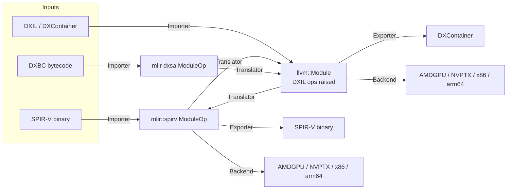

# FeMe: FrontEnd for the MiddleEnd — Design Document

## Summary

FeMe ("FrontEnd for the MiddleEnd") is a library and command line tool for
reading pre-existing shader/kernel intermediate representations — initially
**SPIR-V**, **DXBC**, and **DXIL** — and translating them into
[MLIR](https://mlir.llvm.org/) and/or [LLVM IR](https://llvm.org/docs/LangRef.html),
so that they can be re-optimized, re-targeted to native ISAs (AMDGPU, NVPTX,
X86, AArch64, etc.), or translated into one of the other supported input IRs
(e.g. DXBC → DXIL, DXIL → SPIR-V).

FeMe is not a new "universal IR". It is the plumbing that gets bytes in one of
these existing formats into an IR that the rest of LLVM/MLIR already knows how
to optimize and compile, and back out again. Where possible it reuses existing
LLVM/MLIR infrastructure (the MLIR `spirv` dialect, the LLVM `DirectX`
target's DXIL knowledge, the LLVM `SPIRV` target, MLIR's GPU dialects, etc.)
rather than re-implementing it.

FeMe is designed first and foremost **as a library**. The command line tool is
a thin client of that library. This has architectural consequences described
throughout this document, most importantly: **no global/mutable static
state**.

## Motivation

Today, tools that need to consume, analyze, transform, or re-target compiled
shader/kernel binaries (DXBC, DXIL, SPIR-V) each grow their own bespoke
parsing and lowering code, or shell out to format-specific tools with no
shared infrastructure. LLVM and MLIR already contain most of the pieces
needed to represent and optimize these programs once they're in the
front door:

- MLIR has a mature `spirv` dialect and SPIR-V (de)serializer.
- LLVM's `DirectX` target already understands the DXIL "op" encoding used to
  *emit* DXIL from LLVM IR.
- MLIR and LLVM have rich conversion/optimization/target infrastructure
  (`GPU`, `NVVM`, `ROCDL`, `LLVM` dialects; `AMDGPU`, `NVPTX`, `X86`, `AArch64`
  backends).

What's missing is the **front door**: a coherent, library-first component
that reads these binary/legacy formats and hands the result to the rest of
the ecosystem in a form it already understands, and that can go back out
again. FeMe fills that gap.

Primary driving use cases:

1. **Shader recompilation for GPU drivers** — a driver receives DXIL, DXBC,
   or SPIR-V and needs to (re)compile it to native ISA at install time,
   first-run, or JIT time.
2. **Offline cross-compilation / translation tools** — e.g. translating
   DXIL to SPIR-V (or vice versa) for portability layers, without a full
   round-trip through source.

Both use cases require FeMe to work well embedded in another process (a
driver, a build tool), which is why it is designed as a library first.

## Goals

- Provide reusable **importers** that parse SPIR-V, DXBC, and DXIL into a
  representation usable by MLIR and/or LLVM IR-based tooling.
- Provide reusable **exporters** back to those formats (at least DXIL and
  SPIR-V) so that IR-to-IR translation is possible.
- Provide **retargeting infrastructure** to lower the imported program to
  native ISA via existing LLVM targets and MLIR GPU-compilation pipelines.
- Be usable as a **linkable library with a stable, explicit-state C++ API**
  — no `cl::opt` globals, no process-wide singletons, safe to instantiate
  multiple independent instances in the same process (e.g. one per thread,
  or one per compilation).
- Be safely usable from **multi-threaded host processes**: since a primary
  use case (GPU driver shader recompilation) routinely imports/translates/
  retargets many shaders concurrently across worker threads, FeMe's
  interfaces must support one `feme::Context` per thread with no hidden
  contention or shared mutable state between them (see Core Architectural
  Principle below).
- Because FeMe's importers are a runtime driver's primary attack surface for
  untrusted, externally-supplied shader binaries, **fuzzing the binary-format
  importers (DXBC, DXIL, SPIR-V) is a v1 priority**, not a fast-follow —
  harnesses should land alongside each importer as it's implemented (see
  Testing Strategy below).
- Follow **LLVM/MLIR coding conventions**: `LLVMStyle` formatting, `Expected<T>`
  / `Error` for fallible operations and diagnostics, `-title-case-Doxygen`
  comments, lit + FileCheck based tests, unittests via `gtest`, layout
  conventions matching sibling subprojects (`mlir/`, `offload/`).
- Live in the `llvm-project` monorepo as a sibling project (comparable to
  `mlir`, `offload`), buildable via `LLVM_ENABLE_PROJECTS`/
  `LLVM_ENABLE_RUNTIMES`-style opt-in. Standalone (out-of-tree) builds
  against an installed LLVM+MLIR, mirroring `offload-test-suite`, are out of
  scope for now — the CMake structure needed to add it later is
  straightforward and shouldn't require a redesign.
- Support incremental growth to additional input IRs beyond the initial
  three without an architectural rewrite.

## Non-Goals (for now)

- FeMe is **not** a shader compiler front end (it does not compile HLSL/GLSL
  source). It starts from already-compiled IR.
- FeMe does not aim to be a bit-perfect, fully round-trippable
  decompiler — recovering original source-level constructs is out of scope.
  Fidelity requirements are "sufficient to reoptimize and retarget
  correctly", not "reproduces the original module".
- FeMe does not initially provide a stable C API (see Library API Shape
  below). A C++ API is the initial deliverable; a C API is planned, but
  deliberately sequenced after `feme` CLI tooling is functional and tested
  (see Roadmap / Milestones below), not dropped as a non-goal.
- FeMe does not initially ship its own standalone, user-facing optimizer
  binary in the sense of a general `mlir-opt`/`opt`-style product feature.
  It does, however, ship `feme-opt` as **testing infrastructure** from v1
  (see Command Line Tool(s) and Testing Strategy below) — FeMe's own
  MLIR/LLVM IR passes (DXIL op raising, `dxsa` lowering/canonicalization,
  etc.) need a way to be exercised directly on textual IR via `lit`, the
  same way `mlir-opt`/`opt` let MLIR/LLVM passes be tested in isolation
  from any frontend.
- FeMe does not target MLIR's `gpu` dialect / structured GPU compilation
  pipeline (kernel outlining, `gpu-to-rocdl`/`gpu-to-nvvm`) in v1 — there is
  no concrete client for it yet. Direct `llvm::Module` → `TargetMachine`
  retargeting via the in-tree `AMDGPU`/`NVPTX` backends is sufficient for
  now (see Retargeting to Native ISA below); `gpu`-dialect retargeting can
  be added later as an additional `Backend` without a redesign.

## Prior Art and Reused Infrastructure

FeMe explicitly builds on top of, rather than replacing:

| Format | Existing LLVM/MLIR infrastructure | What FeMe adds |
|---|---|---|
| SPIR-V | MLIR `spirv` dialect + deserializer/serializer (`mlir/lib/Target/SPIRV`), `SPIRVToLLVM` conversion | Entry points, diagnostics integration, retargeting glue, DXIL/DXBC interop |
| DXIL | LLVM `DirectX` target (`llvm/lib/Target/DirectX`) understands DXIL op encoding, `DXContainer` format (`llvm/lib/BinaryFormat/DXContainer.h`, `llvm/lib/MC/*DXContainer*`) for *emitting* DXIL | A *reader* (inverse direction): `DXContainer` parsing, a DXIL-compatible bitcode reader, and a "DXIL op raising" pass (inverse of `DXILOpLowering`) |
| DXBC | An in-progress prototype dialect and bytecode reader exist on the `wip/dxsa-mlir` branch of the [`access-softek/llvm-project`](https://github.com/access-softek/llvm-project) fork, currently living under `mlir/{include,lib}/Dialect/DXSA` and `mlir/lib/Target/DXSA` (not upstreamed into MLIR proper); the writer (`dxsa::serialize`, the assembler direction) is currently an unimplemented stub | Migrate that dialect (`dxsa`) and its `BinaryParser` into feme's tree, refactoring to fit feme's conventions; implement the currently-stubbed `BinaryWriter` (needed as a DXBC assembler for testing, see Testing Tools below); continue extending opcode coverage |

FeMe should be viewed as the missing "read" half of infrastructure whose
"write" half already exists in-tree (DirectX target, SPIR-V target), plus a
migration target for the one format (DXBC) whose prototype representation
exists only on a topic branch, not upstream.

## Core Architectural Principle: No Global State

Because FeMe must be safely embeddable in long-lived host processes (drivers)
that may compile many shaders concurrently or sequentially with different
options, FeMe must avoid the classic LLVM tool patterns that rely on
process-global state:

- No `llvm::cl::opt` for configuring library behavior *or* the main CLI
  tool. `cl::opt` is acceptable only in narrowly-scoped, testing-only
  entrypoints (e.g. a lit-test helper binary), never in `feme` or
  any library code. Instead, FeMe is structured like Clang: a thin `main()`
  hands `argc`/`argv` to an options component built on LLVM's `llvm::opt`
  library (`OptTable`/`ArgList`, driven by an `Options.td`), which parses
  arguments into explicit option structs (`ImportOptions`, `ExportOptions`,
  `BackendOptions`, etc.). Building this on `llvm::opt` rather than
  `cl::opt` means the same options-parsing component can be linked into
  both the CLI tool and an embedding driver that wants a consistent,
  CLI-compatible way to configure FeMe, without pulling in global `cl::opt`
  registration.
- No function-local `static` mutable state, no Meyer's-singleton managers.
- No reliance on a single global `LLVMContext` or `MLIRContext` — every
  operation takes an explicit context object (see `feme::Context` below).
- Diagnostics are delivered through an explicit, caller-supplied callback /
  `DiagnosticHandler`, never printed directly to `errs()` by library code.
- Thread-safety: two independent `feme::Context` instances used from two
  threads must never contend or share mutable state. A single `Context` is
  *not* required to be thread-safe for concurrent use (matching
  `MLIRContext`/`LLVMContext` conventions) — callers needing concurrency use
  one `Context` per thread, which is cheap to create.
- `Importer`/`Exporter`/`Translator`/`Backend` implementations themselves
  must be stateless/reentrant (no mutable instance fields written during
  `import`/`export`/`translate`/`run`) so that the *same* statically-linked
  component instance can be safely invoked concurrently from multiple
  threads, each passing its own `Context`. This is what makes per-thread
  `Context`s cheap: the (potentially large) format-specific tables owned by
  an `Importer`/`Exporter` are built once and shared read-only, rather than
  duplicated per `Context`.
- This matters because a primary use case is a driver library embedded in a
  multi-threaded host process, compiling many independent shaders
  concurrently (one `Context` per worker thread) with no global locks,
  static caches, or ordering dependencies between threads.

This mirrors how MLIR itself moved away from LLVM's older global-table
style APIs, and is the main way FeMe's conventions will diverge from some
older parts of LLVM.

## `feme::Context`

All FeMe entry points take an explicit `feme::Context&` (name TBD, see open
questions) analogous in spirit to `MLIRContext`/`LLVMContext`, but scoped to
a single FeMe "session":

```c++
namespace feme {
class Context {
public:
  explicit Context(ContextOptions Options = {});

  // Wraps an externally-owned MLIRContext instead of constructing a new
  // one (still owns its own LLVMContext); added in the "SPIR-V import"
  // roadmap step so feme-translate's format registrations can run inside
  // the same MLIRContext an mlir-translate/mlir-opt-style tool already
  // configured (dialect registry, printing flags, threading), per the
  // "Owns (or wraps caller-provided) ... instances" bullet below.
  explicit Context(mlir::MLIRContext &ExternalMLIRCtx);

  llvm::LLVMContext &getLLVMContext();
  mlir::MLIRContext &getMLIRContext();

  void setDiagnosticHandler(DiagnosticHandlerTy Handler);
  void diagnose(Diagnostic D) const;

  // Registry of available Importers/Exporters/Translators (see the
  // Pipeline Abstraction section below), populated at construction time
  // from statically-linked components; not a global registry.
  const FormatRegistry &getFormatRegistry() const;

private:
  std::unique_ptr<llvm::LLVMContext> LLVMCtx;
  std::unique_ptr<mlir::MLIRContext> OwnedMLIRCtx; // null when wrapping
  mlir::MLIRContext *MLIRCtx;
  DiagnosticHandlerTy DiagHandler;
  FormatRegistry Registry;
};
} // namespace feme
```

Key properties:

- Owns (or wraps caller-provided) `LLVMContext` and `MLIRContext` instances,
  so that a single FeMe `Context` produces IR that is trivially interoperable
  (same contexts) across import/translate/export/retarget steps.
- Registers the MLIR dialects FeMe needs (`spirv`, `llvm`, `func`, `gpu`,
  target-specific dialects like `nvvm`/`rocdl`, plus FeMe's own dialects such
  as `dxsa`) **eagerly at construction**, matching how most MLIR tools set
  up their context up front. This can be revisited toward lazy/on-demand
  registration later if `Context` construction cost becomes a real concern,
  but eager registration is the simpler starting point.
- Carries no format-specific configuration itself; format-specific options
  (e.g. target SPIR-V version, DXIL validator version) are passed to the
  relevant Importer/Exporter, not stored globally on `Context`.

## Pipeline Abstraction: Importers, Translators, Exporters, Backends

FeMe models its work as four composable, single-step operations, plus a
`Driver` that chains them into full toolchain invocations (see `Driver`
below). All five are pure functions of their inputs (module, options,
`Context`) with no side effects beyond diagnostics:



### `Importer`

Parses a format's binary encoding into an in-memory representation
(the Per-Format Representation Strategy section below discusses *which*
representation per format).

```c++
class Importer {
public:
  virtual ~Importer() = default;
  virtual llvm::Expected<Module> import(llvm::MemoryBufferRef Buffer,
                                         const ImportOptions &Opts,
                                         Context &Ctx) const = 0;
  virtual llvm::StringRef getFormatName() const = 0;
};
```

`ImportOptions` (implemented starting with the SPIR-V `Importer`) is a
single plain, non-polymorphic struct shared by all formats, growing one
field per format-specific knob (e.g. SPIR-V's control-flow
structurization toggle), rather than a per-format options subtype:
FeMe does not use RTTI (see feme/.instructions.md), so `Importer::import`
could not safely downcast a base `ImportOptions&` to a format-specific
subclass.

### `Exporter`

The inverse of an `Importer`: serializes a `Module` back to a format's binary
encoding. Not every format needs to support export in v1 (DXBC export is not
a current use case), but the interface is symmetric.

### `Translator`

Converts a `Module` from one format's representation into another's
(e.g. DXBC's `dxsa` dialect into DXIL-flavored LLVM IR), without necessarily
producing a byte-for-byte serialization of the destination format — the
result can then be run through that format's `Exporter` if serialized bytes
are needed, or consumed directly by further passes/backends.

### `Backend` (retargeting)

Lowers a `Module` to native ISA using existing LLVM target infrastructure
(see Retargeting to Native ISA below). This is deliberately *not*
format-specific: once a program is
LLVM IR (or MLIR `llvm`/`gpu` dialect), retargeting reuses standard
`TargetMachine`/`gpu-to-*` infrastructure, regardless of which frontend it
came from.

### `Driver`

`Importer`/`Translator`/`Exporter`/`Backend` are deliberately low-level,
single-step primitives. Most callers (the `feme` CLI, and eventually the C
API) don't want to manually wire up "which importer, then which translator,
then which backend" for a given `--from`/`--to`/`--target` request — they
want to hand FeMe a source format, a destination format/ISA, and a buffer,
and get a result. `feme::Driver` is that orchestration layer:

```c++
class Driver {
public:
  explicit Driver(Context &Ctx);

  // Computes and runs the full chain of Importer -> Translator(s) ->
  // Exporter/Backend steps needed to go from Opts.From to Opts.To (or
  // Opts.Target), consulting Ctx.getFormatRegistry() to find each step.
  llvm::Expected<DriverResult> run(llvm::MemoryBufferRef Input,
                                    const DriverOptions &Opts) const;
};
```

This mirrors how Clang's driver builds a sequence of "jobs" (compile, then
assemble, then link) from a requested input/output pair, rather than
requiring the caller to invoke the compiler, assembler, and linker
separately. `Driver` is intentionally a thin layer *on top of* the four
pipeline primitives — it contains no format-specific logic of its own, only
the logic to select and sequence the right `Importer`/`Translator`(s)/
`Exporter`/`Backend` for a requested `From`/`To`/`Target` combination (e.g.
`--from=dxbc --to=spirv` resolves to the DXBC `Importer` → the `dxsa` →
raised-LLVM-IR `Translator` → the LLVM `SPIRV` `Backend`, per the
Translation Matrix below). Embedding consumers that want single-step control
(e.g. "just import, hand me the `Module`, I'll do the rest") can still use
`Importer`/`Translator`/`Exporter`/`Backend` directly — `Driver` is a
convenience built from the same public interfaces, not a required entry
point.

### `feme::Module`

Because different formats are best represented differently (see the
Per-Format Representation Strategy section below), FeMe needs a small
variant-like wrapper so generic code (the CLI, pipeline glue) can
hold "a module" without caring which underlying representation is active:

```c++
class Module {
public:
  enum class Kind { MLIR, LLVMIR };

  template <typename OpTy>
  static Module fromMLIR(mlir::OwningOpRef<OpTy> M);
  static Module fromLLVMIR(std::unique_ptr<llvm::Module> M);

  Kind getKind() const;
  mlir::Operation *getMLIROperation() const;             // asserts getKind() == MLIR
  mlir::OwningOpRef<mlir::Operation *> takeMLIROperation(); // asserts getKind() == MLIR
  llvm::Module &getLLVMModule() const;                    // asserts getKind() == LLVMIR
};
```

This is intentionally a thin, low-ceremony wrapper — it is not a new IR, it's
a tagged union over the two IRs FeMe actually produces.

Deviates from an earlier draft of this sketch, which had `fromMLIR` take an
`mlir::OwningOpRef<mlir::ModuleOp>` specifically and `getMLIRModule()` return
`mlir::ModuleOp`: implemented starting with the SPIR-V `Importer`, whose
top-level op is `mlir::spirv::ModuleOp` (not the builtin `mlir::ModuleOp`),
`fromMLIR` is instead a function template accepting any top-level op type,
and `Module` type-erases to `mlir::OwningOpRef<mlir::Operation *>`
internally; callers that know the concrete format cast the result back with
`mlir::cast`/`mlir::dyn_cast`. `takeMLIROperation()` was added for handing
ownership back to generic MLIR tooling that manages its own operation
lifetime (e.g. feme-translate's translation registrations).

## Per-Format Representation Strategy

This is the crux of the design and the area with the most nuance.

### SPIR-V → MLIR `spirv` dialect (reuse, do not reinvent)

SPIR-V already has a first-class, actively maintained MLIR dialect with a
complete deserializer/serializer. FeMe's SPIR-V `Importer` is a thin wrapper
around `mlir::spirv::deserialize`, producing an `mlir::spirv::ModuleOp`. FeMe
does **not** define its own SPIR-V representation.

From there, FeMe leverages existing MLIR conversions (`SPIRVToLLVM`, and
`spirv`-dialect canonicalization/transform passes already in MLIR) to reach
the `llvm` dialect / `llvm::Module` for retargeting or for DXIL export.

### DXIL → stay in LLVM IR; raise DXIL ops back to idiomatic form

DXIL *is* LLVM IR: it's serialized as LLVM bitcode (frozen at an old LLVM IR
version) wrapped in a `DXContainer`, with resource accesses, math intrinsics,
etc. expressed as calls to versioned `dx.op.*` functions
(see `llvm/lib/Target/DirectX/DXIL.td`,
`llvm/lib/Target/DirectX/DXILOpBuilder.*`, and the `DXILOpLowering` pass,
which does the LLVM-IR → DXIL-ops direction today).

Given that, lifting DXIL into a *new* MLIR dialect first would mean
re-deriving structure (control flow, memory semantics, arithmetic) that
already exists faithfully in LLVM IR — pure loss of information for no
benefit. Instead:

1. **Container parsing**: parse the `DXContainer` to extract the DXIL bitcode
   part, module-level metadata (shader model/kind, resource bindings,
   signatures, etc. — much of this already has parsers in
   `llvm/lib/BinaryFormat/DXContainer.h` / `llvm/lib/MC/DXContainer*`, reused
   rather than reimplemented).
2. **Bitcode parsing**: parse the embedded bitcode with LLVM's standard
   bitcode reader. DXIL bitcode is frozen at an old LLVM IR version, but
   LLVM's bitcode format is explicitly designed for backward-read
   compatibility (unlike textual IR, which has no such guarantee) — modern
   `BitcodeReader`'s auto-upgrade logic already handles the kind of
   semantic drift (renamed intrinsics, metadata schema changes, etc.)
   involved, and this is confirmed by existing experience loading real DXIL
   with unmodified, current LLVM. No compatibility shim or vendored
   historical reader is expected to be needed for the bitstream itself; any
   remaining risk is narrow (e.g. confirming behavior for the oldest
   supported shader model versions) and can be resolved empirically during
   implementation rather than needing a design decision up front.
3. **Op raising**: run a FeMe pass that is the semantic inverse of
   `DXILOpLowering` — rewrite `dx.op.*` calls back into standard LLVM IR
   constructs/intrinsics (loads/stores against resource handles, standard
   `llvm.*` math intrinsics, etc.), producing a plain `llvm::Module` with no
   DXIL-specific calling convention left in it, plus a small set of
   FeMe-defined metadata/attributes for the handful of DXIL concepts with no
   direct LLVM IR analog (resource binding info, shader stage, signatures).

The result of DXIL import is therefore an **`llvm::Module`**, not an MLIR
module. This keeps DXIL import "close to the metal" and lets it directly
reuse LLVM's existing optimizer and target infrastructure, including,
notably, **reusing the in-tree `SPIRV` LLVM target
(`llvm/lib/Target/SPIRV`) directly for DXIL → SPIR-V translation**, without
ever touching MLIR, since that target already lowers LLVM IR to SPIR-V
binaries for Clang's OpenCL/HLSL-to-SPIR-V path.

MLIR only re-enters the picture for DXIL when a *pass that only exists in
MLIR* is needed (e.g. structured GPU retargeting through the `gpu` dialect).
For that case, DXIL's `llvm::Module` is imported into the MLIR `llvm` dialect
via existing `mlir::translateLLVMIRToModule`, bridging into MLIR only at the
point of need rather than as the default path.

### DXBC → new MLIR `dxsa` dialect (migrate existing prototype, then extend)

DXBC (Shader Model 5.0 and earlier bytecode) is a register-based ISA with
its own opcode set, typed registers, and structured control flow tokens
(`if`/`else`/`endif`, `loop`/`endloop`, etc.) — it is **not** LLVM-IR-shaped,
and has no upstream LLVM/MLIR representation today. This is the one format
where FeMe must define new IR.

This is not starting from a blank page: the `wip/dxsa-mlir` branch of the
[`access-softek/llvm-project`](https://github.com/access-softek/llvm-project)
fork already contains a substantial, incrementally-built prototype — a
`dxsa` MLIR dialect (`mlir/include/mlir/Dialect/DXSA`,
`mlir/lib/Dialect/DXSA`) covering
a large and growing share of the SM5 opcode set (declarations, resource
ops, arithmetic, control flow, atomics, sampling, etc., added opcode-family
by opcode-family), plus a `BinaryParser`
(`mlir/lib/Target/DXSA`) that parses DXBC bytecode tokens into the
dialect, with an extensive `lit` test suite under `mlir/test/Target/DXSA`.
The corresponding `BinaryWriter` (`dxsa::serialize`, i.e. the *assembler*
direction, dialect → binary) exists as a file but is currently an
unimplemented stub — only the parser/disassembler direction is mature
today. That prototype was developed under `mlir/` but was never upstreamed
into MLIR proper.

Decision: **do not** pursue upstreaming `dxsa` into MLIR itself — unlike
SPIR-V, which MLIR hosts because it has broad utility beyond FeMe's use
cases, a DXBC-specific dialect only makes sense as FeMe's own
lifting/interop representation. Instead:

- Migrate the existing `dxsa` dialect and `BinaryParser` out of `mlir/` and
  into feme's tree (`feme/include/feme/Dialect/DXSA`,
  `feme/lib/Dialect/DXSA`, `feme/lib/Target/DXSA`), refactoring as needed to
  fit feme's conventions (no global state, `feme::Context` integration,
  directory/library layout per Directory / Library Layout below).
- **Implement the currently-stubbed `BinaryWriter`** (`dxsa::serialize`):
  DXBC's tokenized format (fixed-width DWORD tokens, self-describing
  opcode/operand tokens, documented in `d3d12TokenizedProgramFormat.hpp`) is
  regular enough that this is expected to be a tractable, mechanical
  encoder — the mirror image of the parser's already-solved decoding logic
  — not a research problem (Wine's `vkd3d-shader` project has already built
  an equivalent bidirectional SM1–5 assembler/disassembler, demonstrating
  feasibility). This is a hard prerequisite for real DXBC export (the
  `dxsa` MLIR dialect → binary path used by FeMe's actual `Exporter`/
  `Backend` pipeline), and is separate from `dxbc-as` (see Testing Tools
  below), the standalone, MLIR-independent DXBC assembler used to build
  human-readable test fixtures for the DXBC *importer*.
- Bring the existing test suite along, converting/relocating it under
  feme's `test/` alongside the migrated code.
- Goal: cover the **full SM5 opcode set** — the existing prototype's
  opcode-family-by-opcode-family commit history demonstrates this is
  tractable — but keep building it up **incrementally**, matching how the
  prototype itself was developed, rather than blocking on 100% coverage
  before anything else in FeMe can land.
- Because DXBC already has structured control flow (unlike arbitrary
  goto/branch soups), raising it toward LLVM IR / MLIR `scf`+`llvm` should be
  comparatively tractable — much of the "structuring" work that plagues
  other bytecode-to-IR lifters is unnecessary here.
- The `dxsa` dialect is intentionally scoped as a **lifting/interop
  dialect**: its ops are expected to be fully converted away (to DXIL-style
  LLVM IR, or to standard MLIR dialects) by a conversion pass, not to persist
  through general optimization. This mirrors how MLIR's own `spirv` dialect
  is meant to be converted away via `SPIRVToLLVM` rather than optimized
  in place long-term.

### Summary table

| Format | Import target | Rationale |
|---|---|---|
| SPIR-V | `mlir::spirv::ModuleOp` (existing MLIR dialect) | Mature, complete, in-tree; no reason to duplicate |
| DXIL | `llvm::Module` (plain LLVM IR, DXIL ops raised) | DXIL already *is* LLVM IR; raising ops preserves fidelity and reuses LLVM's optimizer/targets directly, including the existing LLVM `SPIRV` backend |
| DXBC | New `dxsa` MLIR dialect (migrated from an existing `wip/dxsa-mlir` prototype) | Structured, register-based ISA is a natural fit for a lifting dialect that gets converted away; prototype already demonstrates broad SM5 opcode coverage is achievable incrementally |

## Translation Matrix

"Translation" here means going from one *input* format's representation to
another's, as distinct from retargeting to native ISA (see the section
below).

| From \ To | DXBC | DXIL | SPIR-V |
|---|---|---|---|
| DXBC | — | `dxsa` → raised LLVM IR (direct pass) | `dxsa` → raised LLVM IR → LLVM `SPIRV` target |
| DXIL | *(not a priority; no upstream use case)* | — | raised LLVM IR → LLVM `SPIRV` target |
| SPIR-V | *(not a priority)* | `spirv` dialect → `SPIRVToLLVM` → raise to DXIL conventions → DXIL `Exporter` | — |

Notably, DXIL ⇄ SPIR-V translation is expected to route through plain LLVM
IR and the **existing** LLVM `SPIRV` backend/MLIR `spirv` dialect rather than
needing a new bespoke conversion, which is a big part of why keeping DXIL as
LLVM IR (as discussed above) rather than a new MLIR dialect was the right
call.

## Retargeting to Native ISA

Once a program is in `llvm::Module` form (directly, from DXIL/DXBC import,
or via MLIR's `translateModuleToLLVMIR` from the `llvm` dialect after
converting away `spirv`/`dxsa`), retargeting reuses **standard, unmodified**
LLVM infrastructure:

- `llvm::TargetMachine` + codegen pipeline for X86, AArch64.
- The in-tree `AMDGPU` and `NVPTX` backends for GPU ISA, targeted directly
  from `llvm::Module` via `TargetMachine` — this is sufficient for v1's
  driver-facing use cases.
- MLIR's structured GPU compilation pipeline (kernel outlining,
  `gpu.launch`, `gpu-to-rocdl`/`gpu-to-nvvm`) is **out of scope for v1**:
  there is no concrete client requiring it yet, and direct
  `llvm::Module` → `TargetMachine` retargeting covers the driving use cases
  (Motivation above). This can be added later as a `Backend` alternative for
  `llvm`-dialect input once a real workload needs MLIR-level GPU structuring
  — it does not require a redesign of the `Backend` interface.

FeMe's own contribution here is a thin `Backend` interface plus the glue to
select/configure the right `TargetMachine`/pass pipeline — it does not
reimplement target-specific codegen.

### Deviation: validating `Backend`/`Translator` with a SPIR-V "null pipeline"

Roadmap step 3 (below) originally proposed X86 as the first `Backend`
target for SPIR-V retargeting, as the easiest ISA to validate against. In
practice, the `Translator`/`Backend` interfaces and the SPIR-V →
`SPIRVToLLVM` → `llvm::Module` conversion are what actually need validating
first — which target that `llvm::Module` is subsequently lowered to is
orthogonal. Since LLVM already ships its own in-tree `SPIRV` backend
(`llvm/lib/Target/SPIRV`, a normal, non-experimental target producing real
SPIR-V binaries from `llvm::Module`, not merely an experimental/example
target), retargeting an `llvm::Module` produced from SPIR-V import back to
SPIR-V via that backend gives a **null pipeline**:

```
SPIR-V binary -> SPIRVImporter -> `spirv` dialect
              -> SPIRVToLLVMTranslator -> llvm::Module
              -> TargetMachineBackend("spirv64-unknown-unknown")
              -> SPIR-V binary
```

The re-emitted binary can then be re-run through the already-implemented
`SPIRVImporter` and checked structurally (e.g. the original entry point is
recovered), giving an end-to-end self-checking test of the `Translator`
(`feme::SPIRVToLLVMTranslator`, spirv dialect → LLVM IR) and `Backend`
(`feme::TargetMachineBackend`, a generic `llvm::TargetMachine`-driven
`Backend` that is not itself SPIR-V-specific) plumbing, without depending on
a real ISA's ABI/calling-convention details (which SPIR-V shader modules
don't straightforwardly have) to define "success." Real ISA retargeting
(X86, AArch64, AMDGPU, NVPTX) is unaffected by this: `TargetMachineBackend`
is the same `Backend` implementation either way, selected purely by
`BackendOptions::TargetTriple` — this is not a SPIR-V-specific `Backend`,
just a SPIR-V-specific validation path for it.

## Library API Shape

- Primary API surface is C++ (matching MLIR/LLVM conventions:
  `Expected<T>`/`Error`/`llvm::Error` for fallibility, `StringRef`/
  `MemoryBufferRef` for input, no exceptions).
- No stable C API in v1 — this is layered on later, analogous to
  `MLIR-C`/`LLVM-C`, once the C++ API has stabilized enough to be worth
  committing to ABI stability for. This is deliberately sequenced *after*
  the `feme` CLI and its underlying `Driver`/`Importer`/`Translator`/
  `Exporter`/`Backend` primitives are functional and tested end to end,
  not something FeMe intends to skip — building the C API against a
  proven, exercised C++ API surface is expected to produce a better,
  more stable binding than designing one speculatively up front.
- Every entry point takes an explicit `feme::Context&`; there is no
  "default"/global context.
- Both the `feme` CLI and the eventual C API are expected to expose
  **driver-style, full-toolchain entry points** (`feme::Driver`, see
  Pipeline Abstraction above) as the primary way most consumers use FeMe:
  given a source format, a destination format or target ISA, and an input
  buffer, FeMe computes and runs the whole
  import → translate → retarget/export chain, the same way Clang's driver
  builds compile+assemble+link jobs from `-x`/`-o`/`--target` rather than
  making every caller invoke each compilation stage by hand. The lower-level
  `Importer`/`Translator`/`Exporter`/`Backend` interfaces remain public for
  consumers that want single-step control, but `Driver` is the expected
  default entry point for both the CLI and a future C API.
- Options are plain structs (`ImportOptions`, `ExportOptions`,
  `BackendOptions`, `DriverOptions`) passed by value/const-ref, not
  `cl::opt` globals. These
  structs are populated either directly by an embedding library consumer, or
  by FeMe's shared `llvm::opt`-based options component (see Command Line
  Tool(s) below), which the CLI tool uses and which is itself linkable by
  other CLI-like consumers.

## Command Line Tool(s)

- `feme`: the primary CLI entry point, modeled after
  `mlir-translate`/`llvm-dis`-style tools:

  ```shell
  feme --from=dxil --to=spirv input.dxil -o output.spv
  feme --from=dxbc --to=dxil  input.dxbc -o output.dxil
  feme --from=spirv --target=amdgcn-amd-amdhsa input.spv -o output.o
  ```

- The tool is a thin wrapper, structured like Clang's driver: `main()` hands
  `argc`/`argv` to FeMe's `llvm::opt`-based options component (see Core
  Architectural Principle: No Global State above), which parses them into
  `DriverOptions` (composed of `ImportOptions`/`ExportOptions`/
  `BackendOptions`) → construct one `feme::Context` → hand the options and
  input buffer to `feme::Driver::run` (see `Driver` above), which computes
  and executes the full import → translate → retarget/export chain. All
  actual logic lives in the library so that anything the CLI can do, an
  embedding driver can do too, including reusing the same `Driver` and
  options component for CLI-compatible, full-toolchain invocations.

## Testing Tools

Beyond `feme` itself, exercising FeMe's architecture independently at each
layer (per the Pipeline Abstraction above) requires a small set of
testing-only tool binaries, following the same pattern LLVM/MLIR already use
(`opt`, `mlir-opt`, `mlir-translate`, `llvm-as`/`llvm-dis`) rather than only
ever testing through the full `feme` driver end to end:

- **`feme-opt`**: an `mlir-opt`/`opt`-style pass-pipeline driver, built with
  `MlirOptMain`/`PassPipelineCLParser` conventions. Lets `lit`+`FileCheck`
  tests exercise a single FeMe pass or conversion in isolation on textual
  MLIR/LLVM IR — e.g. run just the DXIL "op raising" pass on hand-written
  `dx.op.*` IR and check the raised output, or run just the `dxsa` → LLVM IR
  lowering pass on hand-written `dxsa` dialect text — without needing a
  binary importer in the loop at all. This is the primary way FeMe's own
  passes get tested, since most pass bugs have nothing to do with binary
  parsing.
- **`feme-translate`**: an `mlir-translate`-style tool exposing each
  format's `Importer`/`Exporter` as individual `--import-<format>=.../
  --export-<format>=...` translation flags, for testing one
  import/export stage in isolation with textual (not final-binary-ISA)
  output. Directly reuses/migrates the translation registration pattern
  already present in the `wip/dxsa-mlir` prototype's
  `mlir/lib/Target/DXSA/TranslateRegistration.cpp` (`import-dxsa-bin`,
  `import-dxsa-hex`, `export-dxsa-bin`). This is distinct from `feme`
  itself: `feme` resolves a full `Driver`-level `--from`/`--to`/`--target`
  chain and only produces final binary/ISA output, while `feme-translate`
  stops at a single stage and can emit human-readable intermediate IR.
- Both tools are testing-only entrypoints in the sense of the Core
  Architectural Principle above: they may use `llvm::cl::opt` (matching
  `mlir-opt`/`mlir-translate` convention) precisely because that principle
  already carves out an exception for narrowly-scoped, testing-only
  entrypoints, never for `feme` or library code itself.

### `dxbc-as`: a standalone DXBC assembler

Hex-DWORD listings and `dxsa` dialect textual IR are still not truly
satisfying as DXBC test inputs: hex is just numbers (not diffable in any
meaningful sense, doesn't capture *meaning*), and driving everything
through the `dxsa` dialect's own writer would make the DXBC importer's
tests partly circular (the code producing test inputs would share the
same dialect/`BinaryWriter` machinery as the code under test). Instead,
FeMe provides a small **standalone** DXBC assembler tool, `dxbc-as`, that:

- Parses the well-known Microsoft/`fxc` DXBC disassembly textual syntax
  (the mnemonic-based SM4/SM5 shader assembly produced by
  `fxc /dumpbin`/`D3DDisassemble`, e.g. `dcl_resource_texture2d`,
  `sample r0.xyzw, v1.xyxx, t0.xyzw, s0`, `mov`, `add`, `ret`, etc.). This
  is a de facto standard: not published by Microsoft as a formal grammar,
  but stable and well-documented in practice, and already independently
  reimplemented by Wine's `vkd3d-shader` project (a full bidirectional
  SM1-5 text assembler/disassembler), which is strong evidence this is a
  tractable, already-solved problem rather than new research.
- Emits raw DXBC tokenized shader bytecode, optionally wrapped in a full
  `DXContainer` using LLVM's existing, already-upstream `DXContainer`
  writer support — reusing LLVM bits, not feme- or MLIR-specific ones.
- Has **no dependency on MLIR, the `dxsa` dialect, or `feme::Context`** —
  it is a plain LLVM-style lexer/parser + binary encoder (comparable in
  spirit to `llvm-mc`), living in its own library
  (`feme/lib/DXBC/Assembler`) with its own standalone tool
  (`feme/tools/dxbc-as`). Because it has zero MLIR dependency, it is also
  a candidate for eventual upstreaming into LLVM proper (alongside
  `DXContainerYAML`) if that turns out to be useful beyond feme; for v1 it
  stays in feme's tree for simplicity.
- Is deliberately **independent from and complementary to** `BinaryWriter`
  (`dxsa::serialize`): `BinaryWriter` is feme's real DXBC *export* path
  (`dxsa` MLIR dialect → binary, used by the actual `Exporter`/`Backend`
  pipeline), while `dxbc-as` exists purely to generate independent,
  human-readable binary test fixtures for exercising the DXBC *importer*
  (`BinaryParser`/`dxsa` dialect construction) without depending on any
  code that importer's own tests are trying to validate.

### Avoiding binary test fixtures

Checking in raw binary blobs as `lit` test inputs is discouraged (not
diffable, not `FileCheck`-able, opaque to code review, easy to silently
bit-rot). Since FeMe's whole job is consuming binary formats, every binary
format needs a *textual, human-readable, diffable* way to construct test
inputs on the fly in a `RUN:` line, instead of checking in `.dxil`/`.spv`/
`.dxbc` files directly:

- **DXIL / `DXContainer`**: reuse LLVM's existing, already-upstream
  `yaml2obj`/`obj2yaml` support for `DXContainerYAML`
  (`llvm/lib/ObjectYAML/DXContainerYAML.cpp`) — a test writes a `.yaml`
  describing the container's parts/metadata, with the embedded DXIL module
  itself authored as textual `.ll` and assembled via `llvm-as`, then piped
  through `yaml2obj` to produce the binary container at test time. No new
  tooling needed here, just following existing LLVM convention.
- **DXBC**: use `dxbc-as` (see above) to assemble human-readable,
  Microsoft/`fxc`-style DXBC assembly text into a binary blob at test
  time, piped into `feme-translate --import-dxbc=-`/`feme` as needed. This
  gives DXBC tests the same quality of human-readable, diffable,
  `FileCheck`-able input as `.ll`/`.yaml` text, without depending on
  feme's own `dxsa` dialect or `BinaryWriter` to produce those inputs. The
  existing `wip/dxsa-mlir` prototype's `import-dxsa-hex` plain-text hex
  listing is not carried forward — it doesn't capture semantic meaning the
  way mnemonic assembly text does, and `dxbc-as` supersedes the need for
  it.
- **SPIR-V**: follow MLIR's existing convention for the `spirv` dialect —
  `mlir-translate --serialize-spirv`/`--deserialize-spirv` (or
  `feme-translate`'s equivalent registration) converts between `spirv`
  dialect textual IR and binary at test time; tests author `spirv` dialect
  text, not `.spv` binaries.
- Fuzzing seed corpora (see Testing Strategy below) are the one intentional
  exception — fuzzer corpora are expected to contain real binary samples,
  and live outside `test/` (e.g. alongside each fuzz harness), not as `lit`
  test inputs.

## Directory / Library Layout

Mirroring sibling in-tree projects (`mlir/`, `offload/`):

Note: the options-parsing component described in "Core Architectural
Principle: No Global State" above lives under `Frontend/` (not `Options/`
as in an earlier draft of this document), matching Flang's
`include/flang/Frontend`/`lib/Frontend` naming for the analogous
"argv → explicit options struct" component, since feme's CLI and an
embedding driver's options are broader than just the `OptTable`/`Options.td`
pair (e.g. `FrontendOptions.h`'s `DriverOptions` struct and `parseArgs`
entry point also live here).

```
feme/
  CMakeLists.txt
  README.md
  LICENSE.TXT            (symlink/copy convention TBD, matches monorepo)
  docs/
    Design.md             (this document)
  include/
    feme/
      Core/
        Context.h
        Module.h
        Diagnostics.h
      Frontend/
        Options.td            (llvm::opt OptTable definitions)
        Options.h
        FrontendOptions.h     (DriverOptions struct, argv -> options parsing)
      Import/
        Importer.h
        DXBC/
        DXIL/
        SPIRV/
      Export/
        Exporter.h
        DXIL/
      Translate/
      Target/              (retargeting glue)
      Dialect/
        DXSA/
          IR/               (ODS .td + generated dialect; migrated from
                             mlir/include/mlir/Dialect/DXSA)
          Transforms/       (dxsa -> ... conversions)
  lib/
    Core/
      Context.cpp
      Module.cpp
      Diagnostics.cpp
    Frontend/
      Options.cpp
      FrontendOptions.cpp
    Import/DXBC/...
    Import/DXIL/...
    Import/SPIRV/...
    Export/DXIL/...
    Dialect/DXSA/...       (migrated from mlir/lib/Dialect/DXSA)
    Target/DXSA/...       (BinaryParser migrated from mlir/lib/Target/DXSA;
                           BinaryWriter implemented new, see DXBC section
                           above)
    Target/...
    DXBC/
      Assembler/           (dxbc-as's lexer/parser/encoder; LLVM-only,
                           no MLIR or feme::Context dependency)
  tools/
    feme/
    feme-opt/
    feme-translate/
    feme-spirv-import-fuzzer/ (llvm-fuzzer-style harness for the SPIR-V
                               Importer; per-format fuzz targets like this
                               are added alongside each Importer, see
                               "Testing Strategy" below)
    dxbc-as/               (standalone DXBC assembler, testing tool; see
                           Testing Tools above)
  test/                    (lit + FileCheck)
  unittests/               (gtest)
  cmake/
    caches/
      feme.cmake             (CMake cache script setting the variables
                              needed to build feme in-tree, e.g.
                              LLVM_ENABLE_PROJECTS=feme)
```

## Build System Integration

- FeMe is a monorepo sub-project, following the same pattern as `mlir` and
  `offload`: its own top-level `CMakeLists.txt`, added to the build via
  `LLVM_ENABLE_PROJECTS=feme` (in-tree) when built from the umbrella
  `llvm/CMakeLists.txt`.
- Depends on `LLVM` and `MLIR` libraries (`find_package`/`add_subdirectory`
  depending on in-tree vs. installed, matching the dual-mode pattern used by
  other MLIR-dependent subprojects such as `flang`).
- Standalone (out-of-tree, against an installed LLVM+MLIR) build support is
  intentionally out of scope for now (see Goals above); it can be added
  later without restructuring the in-tree build.
- Uses standard LLVM CMake helpers (`add_llvm_library`, `add_mlir_dialect`,
  `add_mlir_library`, `add_llvm_tool`) rather than hand-rolled build rules.

## Diagnostics and Error Handling

- Fallible APIs return `llvm::Expected<T>` / `llvm::Error`, per LLVM
  convention — no `bool` + `errno`-style out-parameters, no exceptions.
- Warnings/notes that don't abort an operation go through the `Context`'s
  `DiagnosticHandler` (see `feme::Context` above), which defaults to a
  simple stderr-printing handler in the CLI tool but is never assumed by
  library code.
- Parsing errors from malformed input (corrupt `DXContainer`, invalid SPIR-V
  binary, etc.) are recoverable `Error`s, not `assert`/`report_fatal_error` —
  FeMe must not crash the host process on untrusted/malformed input, since a
  primary use case is a driver processing externally-supplied shaders.

## Testing Strategy

- `test/`: `lit` + `FileCheck` tests, following MLIR/LLVM conventions —
  e.g. round-trip a hand-written small SPIR-V/DXIL module or `dxbc-as`-
  assembled DXBC module through an `Importer` and check the resulting
  MLIR/LLVM IR textual form; round-trip DXBC→DXIL and check output DXIL;
  run `feme` end to end for CLI-level coverage. Per-pass and per-stage
  tests use `feme-opt`/`feme-translate` (see Testing Tools above) rather
  than always going through the full `feme` driver, and construct binary
  inputs at test time from textual representations rather than checking in
  binary fixtures (see Avoiding binary test fixtures above).
- `unittests/`: `gtest`-based unit tests for library internals not easily
  expressed as CLI/lit tests (e.g. `Context` construction/isolation,
  `Module` variant behavior, error propagation).
- Given FeMe consumes externally-defined binary formats supplied by
  untrusted sources at driver runtime, fuzzing the `Importer`s is a **v1
  requirement, not a fast-follow**: an `llvm-fuzzer`-style harness lands
  alongside each importer as it's implemented (SPIR-V, DXIL, DXBC), matching
  how other LLVM binary-format parsers are fuzzed, and is run in CI
  alongside the `lit`/`gtest` suites.

## Coding Conventions

- Follow the [LLVM Coding Standards](https://llvm.org/docs/CodingStandards.html)
  and [MLIR style conventions](https://mlir.llvm.org/getting_started/DeveloperGuide/)
  throughout: `clang-format` (LLVM style), Doxygen comments on public APIs,
  `Expected`/`Error` for fallibility, `StringRef`/`ArrayRef`/`SmallVector`
  over STL equivalents where LLVM convention prefers them.
- License header: Apache License v2.0 with LLVM Exceptions, matching the
  rest of the monorepo.
- New MLIR dialects (`dxsa`) follow standard ODS/TableGen dialect
  authoring conventions used elsewhere in `mlir/`, even though (per the
  DXBC discussion above) `dxsa` itself lives in feme rather than in `mlir/`.
- Naming: the project consistently uses all-lowercase `feme` for the CMake
  project name, C++ namespace (`namespace feme { ... }`), library name
  prefixes, and the CLI tool name. "FeMe" (mixed case) is used only in prose
  when spelling out the "FrontEnd for the MiddleEnd" backronym.

## Roadmap / Milestones

This is a rough sequencing, not a schedule:

1. **Scaffolding**: directory layout, `CMakeLists.txt` wiring into the
   monorepo build, empty `feme::Context`, `feme` skeleton with
   `--help` only, plus `feme-opt` and `feme-translate` testing-tool
   skeletons (see Testing Tools above) so subsequent steps have a way to
   `lit`-test passes/stages in isolation from the start. Should include setting
   up the lit testing environment and adding the `check-feme` target to the
   build.
2. **SPIR-V import**: wrap MLIR's existing `spirv` deserializer behind
   FeMe's `Importer` interface; round-trip test (SPIR-V in → `spirv` dialect
   text out); add a fuzzing harness for the SPIR-V importer.
3. **SPIR-V retargeting**: `spirv` dialect → `SPIRVToLLVM` → `llvm::Module`
   → `TargetMachine`, implemented as the `feme::Translator`
   (`SPIRVToLLVMTranslator`) and `feme::Backend`
   (`TargetMachineBackend`) interfaces. Deviates from an earlier draft of
   this roadmap step, which proposed X86 as the first validation target:
   validated first end to end as a **null pipeline** retargeting back to
   SPIR-V itself via LLVM's own in-tree `SPIRV` backend (see "Deviation:
   validating `Backend`/`Translator` with a SPIR-V 'null pipeline'" under
   Retargeting to Native ISA above), since that is what actually needs
   validating before a real ISA target (X86, next) is attempted.
4. **DXIL import**: `DXContainer`/bitcode parsing (using LLVM's standard
   bitcode reader, expected to load DXIL bitcode as-is per the DXIL section
   above) + "op raising" pass to plain LLVM IR; add a fuzzing harness for
   the DXIL importer.
5. **DXIL retargeting**: reuse step 3's backend glue for DXIL-derived
   `llvm::Module`s.
6. **DXIL ⇄ SPIR-V translation**: DXIL (LLVM IR) → LLVM `SPIRV` target;
   SPIR-V → `spirv` dialect → `SPIRVToLLVM` → raise to DXIL conventions →
   DXIL exporter.
7. **DXBC import**: build `dxbc-as` (see Testing Tools above) first —
   a standalone, MLIR-independent DXBC assembler — so DXBC importer tests
   have human-readable, diffable fixtures from day one; then migrate the
   existing `dxsa` dialect and `BinaryParser` prototype from the
   `wip/dxsa-mlir` branch of
   the [`access-softek/llvm-project`](https://github.com/access-softek/llvm-project)
   fork (currently under `mlir/`) into feme, refactoring to fit feme's
   conventions; implement the currently-stubbed `BinaryWriter` (feme's
   actual DXBC export path, distinct from `dxbc-as`, see the DXBC section
   above); then continue extending opcode coverage incrementally
   (opcode-family by opcode-family, as the prototype already did) toward
   full SM5 coverage, plus a conversion pass toward DXIL-flavored LLVM IR;
   add a fuzzing harness for the DXBC importer (extending the existing
   `BinaryParser` fuzzing, if any, from the migrated prototype).
8. **DXBC → DXIL translation** end to end.
9. **AMDGPU/NVPTX/AArch64 retargeting** via direct `llvm::Module` →
   `TargetMachine`. MLIR `gpu`-dialect-based retargeting is deferred until a
   concrete client needs it (see Non-Goals above).
10. **C API**: once `feme` and its underlying library primitives are
    functional and tested end to end (steps 1–9), layer a stable C API
    (analogous to `MLIR-C`/`LLVM-C`) over the by-then-proven C++ API
    surface.
