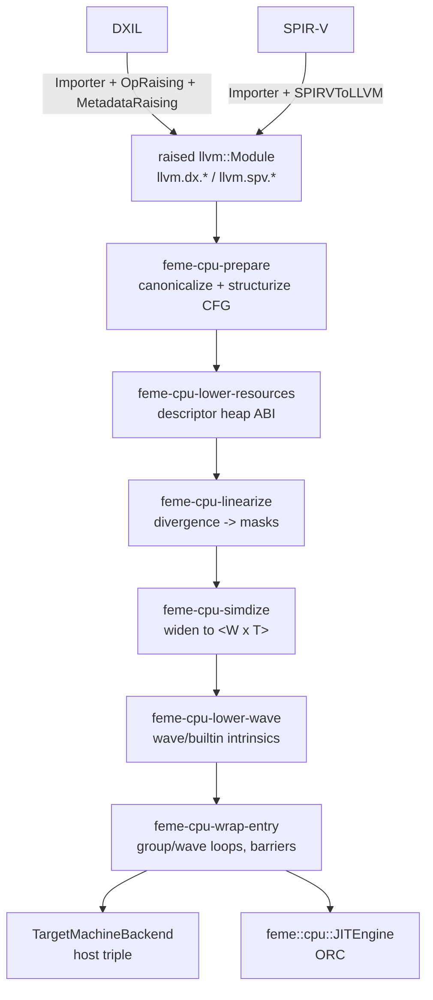

# FeMe CPU Target Design

## Status

Proposal / first draft. Nothing described here is implemented yet. This
document is a companion to [Design.md](Design.md) — it does not restate
FeMe's architecture, only the parts that are new for CPU targets. Read the
"Pipeline Abstraction", "Retargeting to Native ISA", and "Raised LLVM IR ->
AMDGPU" sections of that document first; this design is a sibling of the
latter.

Open questions that need answers before this leaves draft state are
collected in "Open Questions" at the end.

## Summary

FeMe can already import DXIL and SPIR-V, raise both into a common,
format-agnostic "raised" LLVM IR, and retarget that IR to AMDGPU or back to
DXIL/SPIR-V. This document proposes a fourth destination: **the host CPU**,
executed either as an object file or through an in-process **JIT**.

A GPU shader is an SPMD program: the source describes the behaviour of a
single invocation ("lane"), and the machine supplies the parallelism. A CPU
has no such machine. Something has to *choose* how many invocations execute
per hardware thread and rewrite the program accordingly. That choice is this
design's central knob: a **wave size** `W`, chosen by the user, by the
shader, or (failing both) from the host's vector width. The program is
transformed from "one lane per program" into "`W` lanes per program", with
every lane-varying value widened to a `<W x T>` vector, every divergent
branch replaced by an execution mask, and the shader's own wave intrinsics
(`WaveActiveSum`, `WaveReadLaneAt`, ...) lowered to ordinary vector
operations over that mask.

Three pieces are needed beyond the transform itself:

1. A **resource model** — a shader refers to its resources indirectly; a CPU
   program has to get real pointers from somewhere. This design accepts
   **bindless shaders only** (DXIL SM 6.6+ `ResourceDescriptorHeap`,
   SPIR-V's `SPV_EXT_descriptor_heap`) and passes the kernel a
   **descriptor heap** with a fixed, shader-independent layout, rather than
   the one-pointer-argument-per-binding scheme
   `feme::amdgpu::ResourceLoweringPass` uses. Every access through a
   descriptor is bounds-checked.
2. A small **runtime support library** for the operations that do not lower
   to plain IR (typed-buffer format conversion, atomics on formats, and the
   host-side dispatch loop).
3. A **JIT flow** built on ORC, following FeMe's no-global-state rule, so a
   host process can compile and dispatch a shader without touching the file
   system.

## Motivation

- **Reference/fallback execution.** Running a shader without a GPU (or
  without a *conformant* GPU) is how correctness questions get answered:
  WARP, `lavapipe`, and SwiftShader all exist for this reason. FeMe already
  has the front half of such a tool; the CPU target is the back half.
- **Testing FeMe itself.** Every test FeMe has today checks *IR shape*: that
  a `dx.op.*` call became the right intrinsic, that a handle got the right
  target type. None of them check that the translated program *computes the
  right answer*, because there is no way to run it in `lit`. A CPU target
  plus a tiny dispatch tool turns "did we translate this correctly?" into an
  executable question, on any CI machine, with no GPU and no driver.
- **Shader debugging and analysis.** Once a shader is ordinary host code,
  ordinary host tools apply: debuggers, sanitizers, profilers.
- **Compute offload.** A host that already has a DXIL/SPIR-V compute kernel
  and no GPU to run it on can run it on the CPU rather than maintaining a
  second, hand-written implementation.

The first two are the ones driving this design; the second in particular is
what makes the JIT flow a v1 deliverable rather than a follow-up.

## Goals

- Retarget an already-raised `llvm::Module` (from either DXIL or SPIR-V
  import) to the host CPU, as a `feme::Backend` selected the same way every
  other target is (`--target=<host triple>`), reusing
  `feme::TargetMachineBackend` for the final codegen step. **Everything in
  this design operates on `llvm::Module`** — no phase is DXIL- or
  SPIR-V-specific, so the two inputs share the entire pipeline (see
  "Format-Agnostic Operation").
- Support a **wave size** `W` ∈ {4, 8, 16, 32, 64, 128} — every power of two
  in `[4, 128]` — independent of the host's native vector width, selected
  from the user's request, the shader's own declaration, or a host-derived
  default, in that order of authority (see "Wave Size Selection").
- Preserve the semantics of the wave/quad intrinsics FeMe already raises,
  relative to that wave size.
- Define a bindless resource ABI (a descriptor heap) that a host can
  populate without knowing how the shader was compiled, that survives the
  shader being recompiled at a different wave size, and every access through
  which is bounds-checked.
- Provide an in-process JIT (`feme::cpu::JITEngine`) that owns dispatch
  management — compilation, the group loop, and the thread pool it runs on —
  `feme::Context`-scoped and free of process-wide mutable state.
- Be testable phase by phase: each transform is an individually
  `feme-opt`-runnable pass with its own `lit` tests, and the whole thing is
  additionally testable by *running* shaders and checking their output
  buffers.

## Non-Goals (for now)

- **Performance parity with a hand-written CPU rasterizer/kernel.** The
  target is correct, reasonably vectorized code, not beating ISPC. Notably,
  this design does no lane-reordering, no repacking of divergent work, and
  no dynamic wave compaction.
- **Graphics pipeline stages.** Compute (`hlsl.shader = "compute"` /
  SPIR-V `GLCompute`) only, at least initially. Vertex/pixel shaders need a
  pipeline around them (rasterization, interpolation, blending) that is a
  much larger project than the shader transform itself, and none of FeMe's
  driving use cases need it yet. The transform is stage-agnostic; the
  *wrapper* and resource model are not. "Accounting for Graphics Later"
  below records what this design would have to grow, and which of its
  present choices would have to change, so that the compute-only v1 does not
  paint the graphics case into a corner.
- **Register-bound resources.** Bindless only: DXIL SM 6.6+
  `ResourceDescriptorHeap` and SPIR-V `SPV_EXT_descriptor_heap`. See
  "Resource Model".
- **Texture sampling.** Filtering, addressing modes, mip selection and
  format decode are a large body of work with no representation in FeMe's
  raised IR yet (`ResourceLoweringPass` explicitly doesn't handle texture
  handles either). Typed/structured/raw buffers and constant buffers only.
- **Derivatives / quad ops** (`ddx`, `ddy`, `QuadReadAcross*`): not
  implemented in v1, but the lane arrangement they need *is* fixed now.
  `W` is a multiple of 4 and lanes are quad-tiled (see "Lane
  linearization"), so lanes `4k..4k+3` are a 2x2 quad in a defined order,
  and adding these operations later is a matter of emitting the shuffles
  rather than renumbering lanes.
- **Indirect calls and recursion.** Neither appears in DXIL or in the
  SPIR-V subset FeMe imports today.
- **Debug info fidelity.** Preserving line tables through the SIMD-izer is
  desirable and cheap for straight-line code; guaranteeing anything about
  variable locations after widening is not attempted.

## Prior Art

This is a well-trodden problem; the design deliberately follows the
established solutions rather than inventing.

| System | Approach | What this design takes from it |
|---|---|---|
| Whole-Function Vectorization (Karrenberg & Hack, 2011) and the Region Vectorizer | Divergence analysis → CFG linearization with masks → value widening | The overall three-phase shape, and the "analyze, linearize, widen" separation into distinct passes |
| ISPC | SPMD-on-SIMD with a fixed program count ("gang size"), mask stack | Wave size as an explicit compile-time constant; masked memory ops; "all lanes off" branch skipping |
| POCL, Intel's OpenCL CPU runtime | Work-item loops, barrier-delimited regions | The barrier model: split the kernel at barriers into regions, wrap each region in a loop over the waves of a group |
| llvmpipe / SwiftShader | JIT shaders to host code behind a driver | The JIT/ORC flow and the "compile once, dispatch many" split |
| LLVM in-tree | `UniformityInfo`, `StructurizeCFG`, `FixIrreducible`, `UnifyLoopExits`, masked load/store/gather/scatter intrinsics, ORC | Essentially all of the machinery — see below |

The single most important consequence: **almost none of the hard analysis is
new code**. LLVM's `GenericUniformityInfo` already implements
divergence/sync-dependence over an arbitrary "is this value lane-varying?"
predicate, and `StructurizeCFG` already turns reducible divergent control
flow into the structured form a mask-based linearizer wants.

## Execution Model

A dispatch is a 3D grid of **thread groups**; each group is a 3D block of
**invocations** whose dimensions come from `hlsl.numthreads` (recovered by
`feme::dxil::MetadataRaisingPass` for DXIL, and by FeMe's SPIR-V → `llvm`
dialect conversion for SPIR-V — see Design.md). This design adds two levels
between "group" and "invocation":

```
dispatch  = grid of groups                     (host loop, parallel)
group     = ceil(GroupSize / W) waves          (host loop or wave loop, sequential per group)
wave      = W lanes, one SIMD program          (the transformed function)
lane      = one original shader invocation     (one element of every <W x T>)
```

**Lane linearization.** Lane `i` of wave `w` is the invocation at
**quad-tiled index** `w * W + i`. The quad-tiled index tiles the group's
`(x, y)` plane into 2x2 blocks and numbers each block's four invocations
consecutively:

```
QuadTiled(x, y, z) = z * X * Y
                   + ((y / 2) * (X / 2) + (x / 2)) * 4
                   + (y % 2) * 2 + (x % 2)
```

where `X`, `Y` are the group's `hlsl.numthreads` dimensions. Lanes
`4k..4k+3` are therefore a 2x2 quad, in the order
`(x, y)`, `(x+1, y)`, `(x, y+1)`, `(x+1, y+1)` — the arrangement SM 6.6
compute-shader derivatives and pixel shaders both assume.

The tiling only means anything when both `X` and `Y` are even, so when
either is odd the mapping falls back to plain `SV_GroupIndex` order and
quad operations are undefined — matching SM 6.6, which requires even group
dimensions for compute derivatives.

A 1D group (`Y == 1`) is that fallback case, so its mapping is exactly `x`,
i.e. HLSL's `SV_GroupIndex` / SPIR-V's `LocalInvocationIndex` ordering, and
`llvm.dx.flattened.thread.id.in.group` is `splat(w * W) + iota` — the
cheapest possible thing. For an even-dimensioned 2D or 3D group it is that
same vector run through a fixed, compile-time-known permutation, which is a
handful of vector integer ops on constants (`X` and `Y` are constants, and
`w` is the wave loop's index), and constant-folds outright when the wave
loop is unrolled. Every other builtin is derived from the flattened index
as before.

Neither source model specifies which invocation lands in which lane, so
this is FeMe's choice to make; making it a quad-consistent one costs
almost nothing (see "Decisions made now to keep it cheap later") and is
what lets quad ops and derivatives be added later without renumbering
lanes underneath shaders that already observe `WaveGetLaneIndex()`.

**Partial waves.** `GroupSize` need not be a multiple of `W`. The final wave
of a group runs with an entry mask that has the out-of-range lanes off,
rather than the kernel being specialized per group. When
`GroupSize % W == 0` (the common case) the entry mask is all-ones and every
mask expression folds away.

**Wave size semantics.** `W` is what the shader observes:
`WaveGetLaneCount()` returns `W`, `WaveGetLaneIndex()` returns the lane's
index in `[0, W)`, and every `WaveActive*` reduction reduces over exactly
those `W` lanes, honouring the current execution mask (inactive lanes do not
contribute, matching both DXIL's and SPIR-V's definitions).

### Wave Size Selection

`W` must be a power of two in `[4, 128]`: `{4, 8, 16, 32, 64, 128}`. The
lower bound is the quad (`2x2`) granularity every source model assumes
exists; the upper bound is where the legalized vector code stops being
plausible on any host FeMe targets. There is no scalar (`W = 1`)
configuration: a one-lane wave cannot express quad ops, makes
`WaveGetLaneCount() == 1` visible to shaders that were not written for it,
and is not a wave size any real target reports.

Two independent parties can express an opinion about `W`:

- **The user**, via `--wave-size=N` (`feme`), `-feme-wave-size=N`
  (`feme-opt`), or `JITOptions::WaveSize`.
- **The shader**, via a required wave size: HLSL `[WaveSize(n)]`, which SM
  6.6 encodes as a single value and SM 6.8 as a `(min, max, preferred)`
  range in `!dx.entryPoints` — both of which
  `feme::dxil::MetadataRaisingPass` already normalizes into the
  `"hlsl.wavesize"="min,max,preferred"` function attribute — or SPIR-V's
  `SubgroupSize`/`RequiredSubgroupSizeKHR` execution mode.

The resolution rules are:

| User | Shader | Result |
|---|---|---|
| unset | unset | `max(4, HostVectorBits / 32)`, rounded down to a power of two and clamped to 128 |
| unset | set | the shader's value (its preferred size, else the low end of its range) |
| set | unset | the user's value |
| set | set, equal (or user's value inside the shader's range) | that value |
| set | set, different | **error** |

The host-derived default divides by 32 because 32-bit is the width of the
overwhelming majority of lane-varying values in shader code; `max(4, ...)`
keeps a host with no vector unit at all from producing an illegal `W`. A
value outside `[4, 128]` or not a power of two is an error wherever it comes
from, including from the shader — a shader declaring `[WaveSize(3)]` is
malformed, not a request FeMe rounds up.

The conflict case is a hard error rather than a warning-plus-override
because a shader that declares a required wave size is asserting that its
algorithm depends on that size, and silently running it at another one
produces wrong answers with no diagnostic — the exact failure mode a
reference implementation exists to catch. The resolved `W` is recorded on
the compiled artifact so a host never has to re-derive it.

**Independence from host vector width.** `W` is a *semantic* choice, not a
codegen one: `<32 x float>` on a host with 128-bit vectors is legal, and
LLVM's type legalizer splits it into 8 operations. The host-derived default
exists because it is the performance-sensible choice when nothing else has
an opinion, but correctness never depends on it, and the ability to compile
at the wave size a shader was *written* for (e.g. 32, for a shader whose
algorithm assumes `WaveGetLaneCount() == 32`) matters more than the codegen
quality.

## Pipeline Overview



Each box is a separate pass with its own `feme-opt` name and its own `lit`
tests, following the precedent set by `feme-dxil-raise-ops` /
`feme-amdgpu-lower-{raised,resources}`. The split points are chosen so that
each pass's input and output are both *printable, checkable* LLVM IR:

- After `feme-cpu-lower-resources`, resources are bounds-checked pointers and
  the module has no `handlefromheap` left — checkable without reasoning
  about masks.
- After `feme-cpu-linearize`, control flow is (almost) straight-line and
  masks are explicit `i1` values on `feme.cpu.masked.*` calls — checkable
  without reasoning about vectors.
- After `feme-cpu-simdize`, everything is `<W x T>` — checkable without
  reasoning about the group wrapper.

The resource lowering runs *before* linearization/widening deliberately: it
is the one phase whose correctness has nothing to do with `W`, so it should
be testable at `W`-agnostic scale, and lowering handles to plain pointers
early lets the widener treat them as ordinary uniform values.

## Format-Agnostic Operation

Everything from `feme-cpu-prepare` onwards operates on `llvm::Module`, and
no phase knows whether the module came from DXIL or from SPIR-V. This is a
requirement, not an accident of the implementation:

- **DXIL is a first-class input.** The reference-execution and
  FeMe-self-testing use cases that motivate this design are mostly about
  DXIL today, so "SPIR-V works and DXIL mostly works" is not an acceptable
  outcome. Every DXIL compute shader meeting the bindless requirement must
  run.
- **One pipeline, two front ends.** DXIL and SPIR-V converge at raised IR
  (see Design.md); putting the CPU pipeline entirely after that point means
  the divergence analysis, linearizer, widener, wave lowering and wrapper
  are written and tested once. The alternative — SIMD-izing in MLIR on the
  `spirv` or `vector` dialect — would be more expressive but would keep the
  two inputs apart until much later and leave DXIL with a second
  implementation of the same transform.

Raised IR still carries the two parallel intrinsic spellings —
`llvm.dx.thread.id` and `llvm.spv.thread.id`, and so on — because raising
preserves the source's own vocabulary rather than inventing a third. The CPU
passes therefore match on the *pair*, exactly as
`feme::amdgpu::RaisedLoweringPass` already does, through one shared
classification helper rather than a `dx`/`spv` switch per pass. That helper
is the only place in the CPU pipeline where the input format is visible, and
its tests are the only tests that need writing twice.

Two consequences for the phase descriptions below:

- Phase 1 is where the format-specific cleanup lives:
  `feme::dxil::IntrinsicExpansionPass` for the DXIL-only intrinsics, and CFG
  structurization, which DXIL input needs and SPIR-V input has already had.
  After Phase 1 the module is uniform in shape regardless of origin.
- Every `lit` test for a later phase is written against raised IR directly,
  so it does not care which importer produced it; the end-to-end tests are
  run from both a DXIL and a SPIR-V input of the same shader, which is what
  actually proves the claim.

## Phase 1: Preparation (`feme::cpu::PreparePass`)

Gets the raised module into the shape the later phases assume:

- **`feme::dxil::IntrinsicExpansionPass`** (already exists) for the DXIL-only
  intrinsics with no direct CPU equivalent.
- **Structurize control flow**: `FixIrreducible` then `StructurizeCFG` (both
  in-tree, both target-independent). SPIR-V input already went through
  MLIR's structurizer during import; DXIL input has not and can be
  arbitrarily unstructured. `UnifyLoopExits` runs alongside, as
  `StructurizeCFG` requires it. Because DXIL is a first-class input, a CFG
  these passes handle badly is a bug to fix here, not an input to reject.
- **`LowerSwitch`**: the linearizer handles two-way branches only.
- **Promote what can be promoted** (`mem2reg`/SROA): an `alloca` that stays
  in memory becomes a per-lane array in Phase 4 (see below), which is
  correct but much worse code, so it is worth running SROA first.
- **Canonicalize entry points**: exactly one `hlsl.shader="compute"`
  function is selected (by name, from options), and any other entry point is
  either dropped or left alone; the wrapper in Phase 6 needs a single root.

Nothing here is FeMe-specific except the pass ordering and the entry point
selection, so this pass is mostly a pipeline builder.

## Phase 2: Uniformity Analysis (`feme::cpu::computeWaveUniformity`)

Widening every value to `<W x T>` would be correct and slow. The interesting
question is which values are *lane-varying* (divergent) and which are
uniform across the wave; uniform values stay scalar, uniform branches stay
branches.

LLVM's `llvm::UniformityInfo` (`GenericUniformityInfo<SSAContext>`) already
implements exactly this analysis, including the hard part (sync dependence:
which values become divergent because of *where* control flow reconverged).
It is driven entirely through `TargetTransformInfo`:
`hasBranchDivergence()`, `getValueUniformity()`, `isUniform()`. Neither the
`DirectX` nor the `SPIRV` target implements those hooks, and the host target
(x86, AArch64) answers "no divergence" — so FeMe supplies its own:

```c++
/// A TargetTransformInfo implementation describing the SPMD execution model
/// of a raised shader, independent of the host it will run on: branches are
/// divergent, and the lane-varying builtins are the sources of divergence.
class WaveTTIImpl : public llvm::TargetTransformInfoImplBase { ... };

/// Computes UniformityInfo for `F` under the SPMD model.
llvm::UniformityInfo computeWaveUniformity(llvm::Function &F,
                                           llvm::DominatorTree &DT,
                                           llvm::CycleInfo &CI);
```

Divergence sources are the lane-varying builtins FeMe already raises:
`llvm.{dx,spv}.thread.id`, `.thread.id.in.group`,
`.flattened.thread.id.in.group`, `llvm.dx.wave.getlaneindex`, and every wave
op whose result is per-lane (`WavePrefix*`, `WaveReadLaneFirst` is *uniform*,
etc.). Everything else — group ids, resource handles, constants, loads of
uniform addresses — is uniform by inference.

This is an analysis, not a transform, and gets `gtest` coverage directly
(construct IR, assert the expected values are divergent) plus a
`feme-opt -passes='print<feme-cpu-uniformity>'` printer so `lit` tests can
check it the way `print<uniformity>` does upstream.

**Alternative considered:** teaching the in-tree `DirectX`/`SPIRV` TTIs
these hooks upstream, so `UniformityInfoAnalysis` works out of the box.
That's arguably where this belongs long-term, and is a strictly larger
change (it affects those targets' own pipelines); FeMe's own TTI is not
mutually exclusive with it and can be deleted later.

## Phase 3: Linearization and Predication (`feme::cpu::LinearizePass`)

Turns divergent control flow into data flow over an explicit execution mask,
before any widening happens. Working on scalar IR here (masks are `i1`, not
`<W x i1>`) keeps this pass's tests readable and its logic independent of
`W`.

- Each block gets an **entry mask** value: the disjunction of the edge masks
  reaching it, where an edge mask is the predecessor's mask conjoined with
  the (possibly negated) branch condition.
- **Divergent two-way branches** become unconditional fallthrough; both
  sides execute under their masks. Blocks are visited in a topological order
  of the structurized CFG, so a mask is always available when needed.
- **Divergent `phi`s** become `select`s of the incoming edge masks.
- **Loops with divergent exits** keep their backedge, but the latch's
  condition becomes "any lane still active", and the loop body runs under a
  per-iteration active mask (lanes that exited are masked off for the
  remaining iterations). Values live out of the loop are captured under the
  exit mask into a loop-carried value.
- **Uniform branches stay branches.** This is the entire payoff of Phase 2,
  and also the mechanism for the "skip a block when all lanes are off"
  optimization: a *divergent* branch whose taken block is expensive can be
  guarded by a uniform `if (mask != 0)` test (`feme.cpu.mask.any` below).
  That guard is not emitted in v1 — it trades a branch misprediction for
  skipped work, so which blocks deserve it is a heuristic that wants
  measurements rather than a rule, and it is part of the performance work
  the roadmap defers until correctness is established.
- **Early `ret`** under divergence becomes a mask update plus a jump to a
  unified exit; the shader's "still running" mask is conjoined into every
  subsequent block's mask.
- **Side-effecting operations** (stores, atomics, resource writes) are *not*
  predicated by control flow any more, so they are rewritten into the
  **masked intrinsic forms** described below, which carry their governing
  mask as an explicit `i1` operand. Loads from addresses that could be
  lane-varying get the same treatment: an unmasked gather can fault on a
  lane that was never supposed to execute.

### Mask representation between phases

Masks are carried in the IR, in a family of FeMe-internal intrinsics that
mirror LLVM's `llvm.masked.*` intrinsics but with a scalar `i1` mask, so
that everything Phase 3 produces is printable IR a `lit` test can match and
`feme-opt` can round-trip:

```llvm
declare float @feme.cpu.masked.load.f32(ptr %p, i32 immarg %align,
                                        i1 %mask, float %passthru)
declare void  @feme.cpu.masked.store.f32(float %val, ptr %p,
                                         i32 immarg %align, i1 %mask)
declare i32   @feme.cpu.masked.atomicrmw.add.i32(ptr %p, i32 %val, i1 %mask,
                                                 i32 immarg %ordering)
declare { i32, i1 } @feme.cpu.masked.cmpxchg.i32(ptr %p, i32 %cmp, i32 %new,
                                                 i1 %mask, i32 immarg %ordering)
declare i1    @feme.cpu.mask.any(i1 %mask)
```

- **The name prefix is `feme.cpu.`, not `llvm.feme.cpu.`** (as an earlier
  draft of this document said). `llvm.`-prefixed names are reserved for
  in-tree intrinsics: LLVM would treat such a declaration as an intrinsic
  with no known ID, which loses attribute handling and is not something
  out-of-tree code should rely on. `feme.cpu.*` functions are ordinary
  declarations with the right attributes applied explicitly
  (`nounwind willreturn`, plus `memory(argmem: read)` /
  `memory(argmem: readwrite)` as appropriate), so the optimizer treats them
  no worse than it treats an opaque call, and no better than it should.
- **Names are type-mangled** in the `.f32` / `.v4i32` style, and are
  created and recognized through one helper header
  (`Transforms/CPU/MaskIntrinsics.h`) rather than by string matching at
  each use.
- **The wave's entry mask is a trailing `i1` parameter** on the function
  Phase 3 rewrites, not a magic call. Phase 4 widens it to `<W x i1>` like
  any other value, and Phase 6's wrapper supplies it — all-ones except for
  a group's final partial wave.
- **`feme.cpu.mask.any`** exists so the "skip this region when every lane is
  off" guard is expressible before widening; Phase 4 turns it into
  `llvm.vector.reduce.or` over the widened mask.

Phase 4 consumes every one of these — a `feme.cpu.*` call surviving into
Phase 5 is an assertion failure, not a call the backend will attempt —
lowering them to the real thing:

| Phase 3 form | Phase 4 lowering |
|---|---|
| `feme.cpu.masked.load` at a uniform address | plain `load`, or `llvm.masked.load` when the mask is not provably all-ones |
| `feme.cpu.masked.load` at a contiguous divergent address | `llvm.masked.load` |
| `feme.cpu.masked.load` at an arbitrary divergent address | `llvm.masked.gather` |
| `feme.cpu.masked.store` | `llvm.masked.store` / `llvm.masked.scatter`, by the same rules |
| `feme.cpu.masked.atomicrmw` / `.cmpxchg` | scalarized lane loop guarded by the widened mask |
| `feme.cpu.mask.any` | `llvm.vector.reduce.or` |

**Alternatives considered.** Operand bundles on the instruction survive
printing too, but bundles on non-call instructions are not a thing LLVM
supports, so every masked `load`/`store` would have had to become a call
anyway — at which point it may as well be a call with a name that says what
it means. An out-of-IR side table (a `DenseMap` from instruction to mask,
computed by Phase 3 and consumed by Phase 4) keeps the intermediate IR
clean, but makes the two phases inseparable: Phase 4 could not be run on
hand-written IR in a `lit` test, and Phase 3's output could not be checked
without a printer that reinvents this representation anyway. That conflicts
directly with this design's per-phase testing goal, which is the deciding
factor.

## Phase 4: Widening (`feme::cpu::SIMDizePass`)

Rewrites the linearized function to operate on `W` lanes. The pass takes `W`
as an explicit option (`feme-opt -passes=feme-cpu-simdize -feme-wave-size=8`).

| Construct | Widened form |
|---|---|
| Divergent value of type `T` | `<W x T>` |
| Uniform value | unchanged (broadcast at use sites that mix) |
| Elementwise op | same op on `<W x T>` |
| `select`/mask | `<W x i1>` |
| Uniform-address `load`/`store` | unchanged, or masked when predicated |
| Divergent-address `load`/`store` | `llvm.masked.gather` / `llvm.masked.scatter` |
| Contiguous divergent address (address = base + lane*stride, stride == size) | `llvm.masked.load` / `llvm.masked.store` — worth detecting, it's the common case for `buf[tid]` |
| `alloca T` | `alloca [W x T]`, indexed by lane; SROA-able back into vectors when uniformly accessed |
| Call to a non-entry internal function | widen the callee too (whole-function vectorization of the call graph, bottom-up), passing the mask as an extra argument |
| Call to a math libcall (`llvm.sin.f32`, ...) | vector-typed intrinsic call, letting the host's vector library / scalarizer handle it |
| Atomic RMW / cmpxchg | scalarized lane loop (see below) |
| `feme.cpu.masked.*` call from Phase 3 | the corresponding `llvm.masked.*` intrinsic (see "Mask representation between phases") |

**Scalarization fallback.** Any operation with no vector form is emitted as
a `W`-iteration loop (or unrolled sequence) over the lanes, guarded by the
mask. Atomics are the main user; correctness of ordering between lanes of a
wave is preserved because the lanes are genuinely sequential on a CPU.
Having this fallback is what lets the pass be *total* — it never has to bail
out on an unsupported opcode, which matters a lot for a target whose job is
"run any shader".

**Uniform-value hoisting.** Because Phase 2 already classified values, this
pass does not need to re-derive uniformity; it just never widens a value the
analysis called uniform.

## Phase 5: Wave and Builtin Lowering (`feme::cpu::WaveLoweringPass`)

Once everything is `<W x ...>`, the wave intrinsics are ordinary vector
operations. This is the phase that most justifies the whole approach — a
wave op on a GPU is a cross-lane hardware instruction, and on a CPU it's a
reduction over a vector register:

| Intrinsic | Lowering (`M` = execution mask) |
|---|---|
| `wave.getlaneindex` | `iota` (constant `<W x i32>`) |
| `WaveGetLaneCount` | constant `W` |
| `wave.is.first.lane` | lane == `cttz(bitcast M to iW)` |
| `wave.any` / `wave.all` | `reduce.or(M & X)` / `reduce.and(M ? X : true)` |
| `wave.all.equal` | broadcast of first active lane, compared under `M` |
| `wave.readlane(X, i)` | `extractelement X, i` (broadcast back) |
| `WaveReadLaneFirst` | `extractelement X, cttz(M)` |
| `WaveActiveBallot` | `bitcast (M & X) to iW`, zext to `i64`/`<4 x i32>` |
| `wave.active.countbits` | `ctpop(bitcast (M & X))` |
| `WaveActiveSum/Product/Min/Max/BitAnd/...` | `llvm.vector.reduce.*` over `select(M, X, identity)` |
| `WavePrefix*` | inclusive/exclusive scan; log2(W)-step shuffle scan, or a lane loop for large `W` |
| Thread/group ids | derived from the wrapper's loop indices (below) |

Every row here is a small, independently testable rewrite, which is how this
phase's `lit` tests are organized (one `CHECK` function per intrinsic, at a
couple of wave sizes).

## Phase 6: Group Execution and Barriers (`feme::cpu::EntryWrapperPass`)

The SIMD-ized function computes one wave. Something has to run all the waves
of a group, provide the ids they ask for, and honour barriers. This pass
produces a **wrapper function** with the fixed ABI below, containing:

```c
for (w = 0; w < WavesPerGroup; ++w)      // the "wave loop"
  wave_body(group_id, w, entry_mask(w), descriptors, groupshared);
```

**Barriers.** `GroupMemoryBarrierWithGroupSync` (DXIL `Barrier`, SPIR-V
`OpControlBarrier`) requires every invocation in the group to arrive before
any proceeds — but the wave loop runs waves one at a time to completion. The
standard fix (POCL, Intel's CPU OpenCL) is **barrier splitting**: cut the
kernel at each barrier into regions, and wrap *each region* in its own wave
loop:

```c
for (w = ...) region0(w);   // up to the barrier
for (w = ...) region1(w);   // after it
```

Values live across a barrier must be spilled to a per-wave array indexed by
`w` (a "context" allocation), since they no longer live in registers across
the split. Barriers inside divergent control flow are undefined behaviour in
both source models, so only barriers in *uniform* control flow need
handling; a barrier inside a uniform loop splits the loop itself (loop
fission over the wave loop).

**Alternative considered:** fibers/coroutines — give each wave a stack and
switch at barriers (SwiftShader does a variant of this). It handles
arbitrary barrier placement and avoids liveness spilling, but costs a
context switch per barrier per wave and drags in a coroutine/stack-switching
runtime. Barrier splitting is more code in the compiler and less at run
time, which is the right trade for FeMe. LLVM coroutines are a plausible
implementation of the fiber approach if splitting proves insufficient.

**Groupshared memory** (`addrspace(3)` in raised IR) becomes a buffer
allocated per group by the wrapper (or supplied by the caller through the
dispatch arguments if it is too large for the stack), with the address space
cast away. It is shared by all waves of the group, which is exactly right —
the wave loop is sequential, so no synchronization is needed beyond the
barrier semantics above.

**Group loops.** Whether the wrapper iterates groups too, or the host does,
is an ABI decision: this design puts *one group* per wrapper call and lets
the host parallelize across groups (see JIT flow below), because that's the
level where a thread pool wants to hand out work.

## Resource Model

**The CPU target accepts bindless shaders only.** A shader must address its
resources through a descriptor heap:

- **DXIL**: Shader Model 6.6+ dynamic resource indexing —
  `ResourceDescriptorHeap[i]` / `SamplerDescriptorHeap[i]`, which is
  `dx.op.createHandleFromHeap` in DXIL and `llvm.dx.resource.handlefromheap`
  after raising.
- **SPIR-V**: the `SPV_EXT_descriptor_heap` extension (the SPIR-V half of
  `VK_EXT_descriptor_heap`), which expresses the same thing: an
  application-managed heap of descriptors indexed by the shader.

Register-bound resources — `llvm.{dx,spv}.resource.handlefrombinding`,
`handlefromimplicitbinding`, and SPIR-V descriptor set/binding decorations —
are **rejected with a diagnostic**, with the single exception of the root
constant buffer described below. This is a deliberate narrowing of scope,
not an implementation gap:

- The kernel ABI becomes completely shader-independent. There is no slot
  assignment to compute, no binding table to publish, and no per-shader
  argument layout for a host to reconstruct; one dispatch path works for
  every shader, and rebinding between dispatches means writing a different
  descriptor into the heap.
- Dynamically indexed resources — the case
  `feme::amdgpu::ResourceLoweringPass` explicitly gives up on — are the
  *only* case here, so nothing special is needed to support them.
- Both source models converge on the same shape, so the pass is one rewrite
  rather than one per binding model.
- Bindless is where both APIs are going; a reference implementation that
  only runs modern shaders is more useful than one that also runs the legacy
  binding model badly.

Supporting register binding later is a strictly additive change: a pass that
assigns register-bound resources heap slots and rewrites
`handlefrombinding` into `handlefromheap` would sit in front of everything
described here.

### Descriptor heaps

```c
/// One descriptor. Layout is part of the CPU target ABI; see
/// feme/include/feme/Target/CPU/RuntimeABI.h.
typedef struct {
  void    *Data;        // base pointer to the resource's storage
  uint64_t SizeInBytes; // for bounds checking
  uint32_t Stride;      // element stride (structured/typed buffers)
  uint32_t Format;      // feme::cpu::ResourceFormat, for typed buffers
  uint32_t Kind;        // typed / structured / raw / cbuffer / none
  uint32_t Flags;       // UAV vs SRV, ROV, counter present, trusted, ...
  void    *Counter;     // append/consume/counter UAV, else null
} FemeDescriptor;
```

The host supplies two heaps — the resource heap and the sampler heap — as
flat arrays of `FemeDescriptor` with explicit counts. The sampler heap is
part of the ABI from the start even though sampling is a non-goal, so that
adding it later does not change the ABI. A descriptor the host has not
written is zero-filled (`Kind = None`, `SizeInBytes = 0`), which the
bounds-checking rules below turn into "reads zero, writes ignored" rather
than into undefined behaviour.

### Lowering (`feme::cpu::ResourceLoweringPass`, `feme-cpu-lower-resources`)

- `llvm.dx.resource.handlefromheap(index, nonuniform)` (and its SPIR-V
  equivalent) becomes a bounds-checked load of `ResourceHeap[index]`. The
  `nonuniform` flag is a codegen hint on a GPU and is ignored here; a
  lane-varying `index` simply makes the descriptor a divergent value, which
  Phase 4 widens like any other.
- A typed buffer access at element `i` becomes `Data + i * Stride` plus a
  format conversion selected from the descriptor's `Format`, since in a
  bindless shader the storage format is a runtime value rather than
  something the handle type fixes. "Descriptor formats" below works through
  how that selection is made and what it costs.
- Constant buffers are read-only descriptors with `Kind = CBuffer`; the
  4-component-vector-indexed access DXIL uses (`CBufferLoadLegacy`) becomes
  ordinary loads.
- Counter UAVs use `Counter` with host atomics.
- A **descriptor kind mismatch** — a shader reading a `Kind = CBuffer`
  descriptor through a structured buffer handle, say — is undefined in both
  source models. FeMe treats it as an out-of-bounds access (zeros/ignored)
  rather than reinterpreting the pointer, so a mistyped heap cannot be
  turned into an arbitrary host memory access.

### Descriptor formats

This is the one place where bindless makes the CPU target's job harder
rather than easier, so it is worth taking apart.

On a GPU, a typed buffer load goes through a texture unit that reads the
descriptor, decodes the storage format (`R8G8B8A8_UNORM`, `R11G11B10_FLOAT`,
...) and hands the shader the `float4` it asked for. The shader's element
type is a *view*; the storage format is in the descriptor. In a
register-bound shader the compiler can often recover the format from the
binding, which is what lets a GPU backend specialize. In a **bindless**
shader it genuinely cannot: `ResourceDescriptorHeap[i]` is a runtime index
into a heap the host filled in after compilation, so the format is a
runtime value and the conversion has to be selected at run time. (Raw and
structured buffers are unaffected — they have no format — so this concerns
typed buffers now and textures whenever sampling arrives.)

The options, roughly in order of how much they cost the compiler:

| # | Design | Cost per access | Extensible? | Notes |
|---|---|---|---|---|
| A | One runtime call per access; the helper switches on `Format` | call + switch, effectively scalar per lane | trivially | Always correct, always slow. The floor. |
| B | Inlined `switch` on `Format` at the access site, common formats as vectorized cases, generic helper as `default` | one uniform branch, hoistable | new formats join the `default` case first | Fast path is straight-line vector code. |
| C | Format dispatch hoisted to the *region* using the handle: one `switch` outside the loop, the loop body cloned per format | amortized to zero inside the loop | as B | B plus unswitching; mostly falls out of LICM/`SimpleLoopUnswitch` given B. |
| D | Whole-kernel specialization: read the heap at JIT time, constant-fold every `Format`, compile per unique heap shape | zero | as B | Best code; costs a recompile per distinct heap shape and only works on the JIT path. |
| E | The descriptor carries a converter function pointer | indirect call, no inlining | trivially, by the host | Rejected: indirect calls are a non-goal, they defeat vectorization, and letting an untrusted heap supply code pointers is exactly what the bounds-checking rules exist to avoid. |
| F | Require the descriptor's format to match the shader's view, validated at dispatch | zero | n/a | Not a model of either API; useful only as an opt-in assertion. |

**The plan: B by default, A as B's `default` case, C for free, D and F as
options.** Concretely:

- `ResourceLoweringPass` emits, at each typed access, a `switch` on the
  descriptor's `Format` with inlined vector code for the formats worth
  inlining (the 32-bit ones, `R8G8B8A8_UNORM`/`_SNORM`/`_SRGB`,
  `R16G16B16A16_FLOAT`, `R11G11B10_FLOAT`, `R10G10B10A2_UNORM`, and the
  8/16-bit integer ones) and a call to `feme_rt_{load,store}_typed_*` for
  everything else. Adding a format later means adding a case, and until
  someone does, the format still *works* through the helper. That
  "correct first, fast later" property is why A stays in the design rather
  than being replaced by B.
- **The identity case is not a case.** When the descriptor's format is bit-
  identical to the shader's view (the common `Buffer<float4>` over
  `R32G32B32A32_FLOAT` situation), the "conversion" is the load itself, and
  the emitted code is the check plus a plain vector load.
- **The format load is uniform** whenever the descriptor is, which is almost
  always, so the `switch` hoists out of loops and C requires nothing beyond
  running the existing loop passes after resource lowering.
- **Divergent descriptors need a waterfall.** If lanes of one wave index
  *different* heap slots, their formats can differ and there is no single
  vector conversion to emit. The lowering handles this the way GPU backends
  handle divergent descriptors: a **waterfall loop** that picks the first
  active lane's format, builds the sub-mask of lanes sharing it, runs the
  vectorized fast path under that sub-mask, and repeats until every lane is
  serviced. Worst case that is `W` iterations (equivalent to A); the common
  case is one. This is the only part of the scheme that is genuinely new
  code rather than "emit a switch", so it is worth stating explicitly that
  it is the fallback and not the norm.
- **D is a JIT-only optimization, added later.** `JITOptions` grows a
  `SpecializeFormats` flag and `JITEngine::create` an optional heap
  *description* (formats and kinds only, no pointers) that lets the
  compiler constant-fold the `switch`. It is off by default because it
  trades the design's best property — one compiled kernel runs against any
  heap — for code quality, and because the specialization cache key becomes
  the heap shape. The AOT path cannot have it at all, which is another
  reason B has to be good enough on its own.
- **F is an opt-in check, not a mode.** `--cpu-require-matching-formats`
  (and the equivalent `JITOptions` flag) makes a format/view mismatch a
  dispatch-time error instead of a conversion. It is for hosts that believe
  they are handing over exactly-typed data and want to find out when they
  are wrong, and for narrowing bug reports; it never changes what a
  conforming shader computes.

The testing consequence is that format handling is exercised at three
levels: `lit` tests over the emitted `switch` shape (B), `feme-run` tests
over each format's round-trip values including the odd-width ones (A and B
agreeing), and a differential test that runs the same shader with and
without `SpecializeFormats` (D agreeing with B).

### Bounds checking

Every access through a descriptor is bounds-checked, at two levels:

1. **The heap index**: `index < HeapCount`. A failing index yields the
   all-zero descriptor rather than reading past the heap.
2. **The offset within the resource**: `Offset + AccessSize <= SizeInBytes`.

Out-of-bounds reads return zero and out-of-bounds writes are dropped,
matching D3D/Vulkan robustness rather than trapping. For a vector access the
check is per-component under the execution mask, so a partially in-bounds
access behaves like the GPU's. This is **not optional**: a fault-on-OOB CPU
target would turn a merely-nonconformant shader into a host crash, which is
unacceptable both for the reference-execution use case and for a host that
JITs untrusted shader code. An option to disable the checks
(`-feme-cpu-no-robustness`) for performance measurement is reasonable but
must not be the default.

Because both checks are `select`s rather than branches, they widen and
predicate like any other operation, and constant heap indices with a known
heap size fold the first check away entirely.

#### Per-descriptor control

Robustness is also controllable **per descriptor**, through a
`FEME_DESCRIPTOR_TRUSTED` bit in the descriptor's `Flags`. The three levels
compose as follows:

| Level | Set by | Effect |
|---|---|---|
| Heap index check | always on | An index `>= HeapCount` yields the all-zero descriptor. Never skippable — it is what makes the `Flags` word itself safe to read. |
| Offset check, default | the compiler | `Offset + AccessSize <= SizeInBytes`, OOB reads zero / writes dropped. |
| Offset check, per descriptor | the host, via `FEME_DESCRIPTOR_TRUSTED` | The offset check is skipped for accesses through *that* descriptor. |
| Offset check, whole module | `-feme-cpu-no-robustness` | The offset check is skipped everywhere and the `Flags` bit is not consulted. Measurement only. |

Per-descriptor is the right granularity because it matches where the
knowledge lives. Whether an access can go out of bounds is a property of
the resource and the host's confidence in the shader indexing it, not of
the shader as a whole: a host that generated a buffer itself and sized it
from the same data the shader indexes with knows more about that one
descriptor than it does about the other thirty in the heap. A compile-time
switch forces that judgement to be all-or-nothing, and — worse for the JIT
path — makes it part of the compilation key, so flipping it for one buffer
recompiles the shader. The `Flags` bit costs nothing at compile time and
lets the same compiled kernel run against a trusted and an untrusted heap.

The cost is that the check becomes data-dependent rather than statically
absent: the emitted code is `select(Trusted | InBounds, ...)` where it was
`select(InBounds, ...)`. `Trusted` is a uniform load from the descriptor,
so the extra work is one load and one `or` per descriptor per kernel, not
per access — and for the overwhelmingly common untrusted case the code is
what it was. Hosts wanting the checks genuinely gone still have
`-feme-cpu-no-robustness`.

Two rules keep the escape hatch from becoming a footgun:

- **`FEME_DESCRIPTOR_TRUSTED` is a host assertion, not a request.** Setting
  it on a descriptor whose resource the shader then over-reads is undefined
  behaviour — a host memory access, possibly a wild one. It is documented
  as such in `RuntimeABI.h`, and nothing in FeMe sets it.
- **It is ignored under `Kind = None`.** A zero-filled descriptor is
  bounds-checked regardless of what the flags word happens to contain, so
  the "host forgot to write this slot" case cannot be turned into an
  arbitrary access by a stale flag.

`feme-run` exposes it as `trusted: true` on a heap entry, so the behaviour
of both settings is testable.

### Root constants

A bindless shader still has to learn its heap indices from somewhere, and
in practice that is root constants. The CPU ABI therefore carries a small
opaque byte block in the dispatch arguments, and exactly one register-bound
constant buffer — by default `(b0, space0)`, overridable with
`--cpu-root-constants=bN,spaceM` — is lowered to loads from it instead of
being rejected. Everything else must come from the heap.

The block is untyped bytes on the ABI side. Accesses into it keep the
layout the source model already fixed (HLSL `cbuffer` packing rules for
DXIL, the `Offset` decorations the SPIR-V importer preserves), so FeMe
neither imposes nor validates a layout: a host that fills the block with a
struct whose layout disagrees with the shader's gets wrong answers, exactly
as it would on a GPU. `ResourceInfo` reports the size the shader reads so a
host can at least check that much.

#### Limitations, and how this compares to GPU APIs

One block is a real restriction, and a deliberate one for v1. Against the
two APIs FeMe imports from:

| Capability | D3D12 | Vulkan | FeMe CPU v1 |
|---|---|---|---|
| Inline constants | Root constants, any number of `bN` entries, sharing a 64-DWORD root signature budget | One push constant block per pipeline, ≥128 bytes guaranteed | One block, `(b0, space0)` by default |
| Per-stage constants | Per-stage visibility flags on each entry | Per-stage ranges within the one block | Compute only, so one block |
| Root descriptors (a CBV/SRV/UAV bound as a raw address) | Yes | Buffer device address, inline uniform blocks | None — everything else is a heap descriptor |
| Descriptor tables / sets | Yes | Yes | None — bindless heap only |
| Static / immutable samplers | Yes | Yes | None |
| Size limit | 64 DWORDs of root signature, shared with everything else in it | Device `maxPushConstantsSize` | None imposed |

Two directions of divergence matter:

- **FeMe is more restrictive** in that a shader binding a second constant
  buffer (`b1`, or `b0` in another space) is rejected with a diagnostic
  naming this limitation, rather than silently getting one of them. Shaders
  that keep all their heap indices in one struct — the common bindless
  style, and the one both APIs' documentation recommends — are unaffected.
- **FeMe is more permissive** about size, because there is no register file
  to spend: the block is ordinary memory, and dynamically indexing it is
  fine. A shader that relies on that will not port back to either GPU API,
  so FeMe warns when the block a shader reads exceeds 256 bytes (D3D12's
  64-DWORD budget, and comfortably above Vulkan's guaranteed minimum). The
  warning is about portability, not correctness, and is suppressible.

Lifting the restriction later does not change anything described here: the
ABI's single `RootConstants`/`RootConstantSize` pair becomes an array
indexed by the order `ResourceInfo` reports, and the pass that today
matches one register binding matches several. It is deferred because no
motivating shader needs it, and because every additional block is another
thing a host must get right for a dispatch to mean anything.

### Heap usage discovery

There is no per-shader binding table to publish, but the host still benefits
from knowing what the shader needs: FeMe emits a named metadata node
(`!feme.cpu.resources`) recording the root constant block's size, whether
the sampler heap is used, and the statically known heap indices when the
shader uses constants. `feme::cpu::ResourceInfo::fromModule` reads it back,
so the artifact remains self-describing on the object-file path where there
is no in-process compiler to ask.

## Kernel ABI

One exported symbol per entry point, with a `feme_cpu_entry_` name prefix
and a single argument:

```c
typedef struct {
  const FemeDescriptor *ResourceHeap;  // the resource descriptor heap
  uint32_t ResourceHeapCount;
  const FemeDescriptor *SamplerHeap;   // the sampler descriptor heap
  uint32_t SamplerHeapCount;
  const void *RootConstants;           // root constant block, or null
  uint32_t RootConstantSize;
  uint32_t GroupID[3];                 // this dispatch item
  uint32_t GroupCount[3];              // full dispatch size
  void    *GroupShared;                // group-shared storage, or null
  void    *Reserved[4];                // ABI headroom
} FemeDispatchArgs;

void feme_cpu_entry_<name>(const FemeDispatchArgs *Args);
```

Everything the shader can ask about its position derives from `GroupID`,
`GroupCount`, and the wave loop index, so the ABI does not change with `W`,
with the shader's resource usage, or between the JIT and object-file paths.
`W` and the thread group dimensions are baked into the compiled code and
reported alongside the resource info.

## JIT Flow

The `JITEngine` **owns dispatch management**. It is not a "compile and hand
back a function pointer" API: it owns the compiled code, the thread pool the
groups run on, the group loop, and the marshalling of the dispatch arguments
described above. A host asks it to run a dispatch; how that dispatch is cut
into groups, which thread runs which group, and how the ABI struct is filled
in are all FeMe's business. That keeps the ABI an implementation detail
rather than a contract every embedder has to re-implement correctly, and it
makes `feme-run` (and therefore the end-to-end tests) a thin shell over the
same code path a real host uses.

```c++
namespace feme::cpu {

struct JITOptions {
  unsigned WaveSize = 0;             // 0 = resolve from the shader, else host
  std::string EntryPoint;            // empty = the module's only entry point
  llvm::CodeGenOptLevel OptLevel = llvm::CodeGenOptLevel::Default;
  bool EnableRobustness = true;
  unsigned NumThreads = 0;           // 0 = hardware concurrency
};

/// The resources a dispatch runs against. Descriptor heaps are owned by the
/// caller and must outlive the dispatch.
struct DispatchResources {
  llvm::ArrayRef<FemeDescriptor> ResourceHeap;
  llvm::ArrayRef<FemeDescriptor> SamplerHeap;
  llvm::ArrayRef<uint8_t> RootConstants;
};

/// Owns an ORC LLJIT instance, the compiled shader in it, and the execution
/// of dispatches against it. One per compiled shader; safe to use from
/// multiple threads to dispatch, per FeMe's no-global-state rule (see
/// Design.md).
class JITEngine {
public:
  static llvm::Expected<std::unique_ptr<JITEngine>>
  create(Context &Ctx, feme::Module M, const JITOptions &Opts);

  /// What the shader needs from the host: root constant size, sampler heap
  /// use, and the resolved wave size and thread group dimensions.
  const ResourceInfo &getResourceInfo() const;

  /// Runs the whole dispatch to completion: schedules every group across the
  /// engine's thread pool, fills in FemeDispatchArgs per group, and joins.
  llvm::Error dispatch(const DispatchResources &Resources,
                       std::array<uint32_t, 3> GroupCount) const;
};

} // namespace feme::cpu
```

Notes and constraints:

- **ORC, not MCJIT**: `llvm::orc::LLJIT` with a `ThreadSafeModule`, which is
  the supported path and already thread-safe in the way FeMe needs.
- **Target initialization** (`InitializeNativeTarget`, `...AsmPrinter`) is
  process-global and idempotent; FeMe wraps it in a `llvm::call_once` inside
  `Context` construction rather than requiring callers to do it, keeping the
  "no global mutable state *of FeMe's own*" property honest about the one
  piece of LLVM that genuinely is global.
- **Runtime symbols**: the runtime support library's helpers are resolved
  from an explicitly populated symbol map, not from the host process's
  dynamic symbol table — an embedded driver must not have shader code
  reaching arbitrary host symbols.
- **Dispatch parallelism**: `dispatch()` runs groups across an
  `llvm::ThreadPool` owned by the engine (or the calling thread when
  `NumThreads == 1`). Groups are independent by definition, so this needs no
  synchronization beyond the join. The pool belongs to the engine rather
  than to `Context` so that two shaders compiled from one context do not
  contend for one pool, and so that engine destruction is the only join
  point that matters.
- **Concurrent dispatches**: `dispatch()` is `const` and holds no per-run
  state on the engine, so a host may run several dispatches concurrently
  against different descriptor heaps. Whether *those* dispatches conflict on
  the resources they were handed is the host's problem, exactly as on a GPU.
- **Caching**: an `ObjectCache` can be attached so a host can persist
  compiled shaders; the cache key must include the wave size, opt level and
  robustness setting, not just the input hash.
- **Object-file path**: the same pipeline minus the JIT, through
  `feme::TargetMachineBackend` with the host triple, producing a relocatable
  object with the same ABI. A host taking that path schedules groups itself;
  the runtime support library ships the same group loop so it does not have
  to. This is what makes `--target=<host-triple>` work as an ordinary FeMe
  target and gives an AOT story for free.
- **Escape hatch**: a host that genuinely wants to schedule groups itself
  can ask the engine for the entry symbol and the resolved ABI description.
  This is deliberately the secondary interface — it exists so that owning
  dispatch does not *preclude* a driver-style embedder, not because the
  common path needs it.

## Runtime Support Library

A small static library (`libFeMeRuntimeCPU`) with a C ABI, containing only
what cannot reasonably be emitted as IR:

- Typed-buffer format pack/unpack for every format, as the `default` case
  of the format `switch` the resource lowering emits (see "Descriptor
  formats"). The formats worth inlining are inlined there; this is what
  makes the ones that are not still work.
- Atomic helpers for formats needing read-modify-write conversion.
- The host-side dispatch loop, so the object-file path has a usable
  `main`-adjacent entry point without every embedder rewriting it.

It deliberately does **not** contain a math library: `llvm.sin` and friends
lower through the host's normal vector-math handling.

## Accounting for Graphics Later

Compute-only is the v1 scope, but graphics stages are plausible enough
longer term to be worth designing *around* rather than into a corner. This
section records what would change, what would not, and the few decisions
being made now specifically to keep the door open.

### What does not change

The core of this design is stage-agnostic and stays as-is:

- Phases 2–5 (uniformity, linearization, widening, wave lowering). An SPMD
  program is an SPMD program; a pixel shader's divergence is a vertex
  shader's is a compute shader's.
- The bindless descriptor heap, the bounds-checking rules, and the root
  constant block. Graphics APIs bind resources to graphics stages exactly
  the way they bind them to compute, so the heap model transfers unchanged;
  each stage gets its own root constants.
- Wave size selection, including the shader-declared/user-specified conflict
  rules.
- The JIT's ownership of execution — the object it owns grows from "a
  compiled kernel" to "a compiled pipeline", but the ownership story is the
  same one, and is the reason graphics is expressible at all without
  exposing an ABI to embedders.

### What changes

1. **The wrapper (Phase 6) becomes stage-specific.** "Loop over the waves of
   a thread group" is a compute concept. A vertex shader's wrapper loops
   over waves of vertices drawn from an index buffer; a pixel shader's
   consumes fragment quads produced by rasterization. `EntryWrapperPass`
   would become a family of wrappers over a common interface — supply a
   wave, supply its builtins, run the body — with the compute wrapper as one
   member. This is the main reason the wrapper is already a separate pass
   from everything before it.
2. **Fixed-function stages have to exist.** Rasterization, attribute
   interpolation, depth/stencil, blending and output merge are not shader
   translation at all; they are a software rasterizer, and they are where
   the bulk of the work is (this is the llvmpipe/SwiftShader-scale part of
   the problem). They would live in the runtime support library, JIT-
   specialized per pipeline state where it pays.
3. **Stage I/O becomes part of the ABI.** Compute shaders communicate only
   through resources; graphics stages have input/output *signatures*
   (vertex attributes, varyings, render targets, system values like
   `SV_Position`). The kernel ABI would grow per-stage input and output
   pointers plus a signature description, and the importers would have to
   preserve signature information that FeMe does not need today — DXIL's
   `!dx.entryPoints` signature elements and SPIR-V's `Input`/`Output`
   storage class variables.
4. **Helper lanes appear.** A pixel shader runs inactive "helper"
   invocations so that derivatives at quad edges are well defined: lanes
   that compute values but must not have side effects. That is a *second*
   mask — "live" for computation, "active" for stores — where this design
   currently has one. Phase 3's mask representation would have to carry a
   pair.
5. **Derivatives and quad ops become required.** `ddx`/`ddy` and
   `QuadReadAcross*` are shuffles within a quad once a lane-to-quad mapping
   is fixed, but they are only meaningful when one is.
6. **The pipeline object replaces the single kernel.** `JITEngine` would
   grow into something owning several compiled stages plus the fixed-
   function state between them, with `dispatch()` joined by `draw()`.
   Mesh/amplification shaders reintroduce thread groups (and therefore
   barriers) into a graphics pipeline, which is a point in favour of keeping
   the compute wrapper factored out rather than special-cased.

### Decisions made now to keep it cheap later

- **The lane-to-quad mapping is fixed now, not later.** `W` is a multiple
  of 4 and lanes are quad-tiled, so lanes `4k..4k+3` *are* a 2x2 quad in a
  defined order — see "Lane linearization". This is the one item in this
  section that is worth paying for immediately rather than merely designing
  around: lane assignment is observable through `WaveGetLaneIndex()`,
  `WaveReadLaneAt` and ballots, so changing it later would silently change
  what existing shaders (and existing test expectations) compute. The price
  is a compile-time-known permutation of the flattened index for 2D and 3D
  groups, and literally nothing for 1D groups. It is also part of why the
  minimum wave size is 4 rather than 1 or 2.
- **The wrapper is a separate phase** with everything stage-specific on one
  side of it.
- **`FemeDispatchArgs` has explicit ABI headroom** and separates the
  resource-facing fields (heaps, root constants) from the
  execution-facing ones (group id/count), so a stage-specific block can be
  added without disturbing the former.
- **Masks are produced by a named phase**, not inferred implicitly, so
  extending "the mask" into "the pair of masks" is a change to one pass's
  contract rather than an archaeology exercise.

None of these cost anything for compute. Everything else — rasterization,
interpolation, signatures, pipeline objects — is deliberately deferred,
because it is a separate project that happens to reuse this one.

## Tooling and Testing

### Command line

- `feme --target=<host-triple> --wave-size=N` produces an object file.
  `--wave-size` is a new `DriverOptions` field; when unset it is resolved
  per "Wave Size Selection" (shader declaration, else host-derived default),
  and it is ignored (with a diagnostic if explicitly set) for non-CPU
  targets.
- `feme-opt` gains one pass name per phase, matching the existing
  convention: `feme-cpu-prepare`, `feme-cpu-lower-resources`,
  `feme-cpu-linearize`, `feme-cpu-simdize`, `feme-cpu-lower-wave`,
  `feme-cpu-wrap-entry`, plus the `print<feme-cpu-uniformity>` printer.
- **`feme-run`** (new): JITs a DXIL/SPIR-V/LLVM IR input and dispatches it,
  with resources described by a small YAML file (buffer contents in, buffer
  contents out, as text). This is the tool that turns "does this translate
  correctly?" into "does this compute the right answer?" in `lit`:

  ```yaml
  # feme-run --wave-size=8 --groups=4,1,1 shader.dxil --heap=heap.yaml
  root-constants: [0, 1]
  resource-heap:
    - index: 0
      kind: typed-buffer
      format: r32g32b32a32_float
      data: [0.0, 1.0, 2.0, 3.0, ...]
    - index: 1
      kind: structured-buffer
      stride: 16
      data: [...]
  ```

  and the output heap entries are printed for `FileCheck` to match.
  `--reference` runs the shader one invocation at a time through the
  unwidened module instead (see "CFG restructurization test suite"), which
  is the ground truth that suite diffs against.
  Deliberately textual, per Design.md's "Avoiding binary test fixtures"
  section. Note that the file describes *heap slots*, not bindings — it is
  the same thing the shader indexes, so a test's expectations do not depend
  on a slot assignment the compiler chose.

### Test strategy per phase

Following the instruction that each phase of translation gets unit tests:

| Phase | Unit tests (`gtest`) | `lit` tests |
|---|---|---|
| Uniformity | divergence classification on hand-built IR, including sync dependence | `print<feme-cpu-uniformity>` output |
| Prepare | pass ordering/entry selection | structurization of an unstructured DXIL-derived CFG; the named-shape corpus under `-verify-structured` (see "CFG restructurization test suite") |
| Resource lowering | heap access lowering, bounds check emission, resource info extraction | one test per resource kind, dynamic heap indexing, OOB read/write behaviour, per-descriptor `trusted` opt-out, format `switch` shape, divergent-descriptor waterfall, rejection of register-bound resources |
| Linearize | mask construction on diamond/loop CFGs | per-CFG-shape `CHECK`s, uniform-branch preservation, `feme.cpu.masked.*` emission |
| SIMDize | widening rules, contiguity detection | per-construct `CHECK`s at `W` ∈ {4, 8}, `feme.cpu.masked.*` → `llvm.masked.*` lowering from hand-written IR |
| Wave lowering | one test per intrinsic | per-intrinsic `CHECK`s at two wave sizes |
| Entry wrapper | barrier region splitting, quad-tiled lane mapping (including the 1D degenerate case and odd dimensions) | wave loop shape, barrier split, groupshared, builtin derivation for 1D/2D/3D groups |
| JIT | `JITEngine::create`/`dispatch` on a tiny module, resource info round-trip, multi-threaded group scheduling | — |
| End to end | — | `feme-run` executing real shaders and `FileCheck`ing results, at several wave sizes, from both DXIL and SPIR-V inputs of the same shader |

Wave size resolution gets its own tests: each row of the resolution table
above (including the conflict error and the out-of-range/non-power-of-two
diagnostics) is a `lit` test over a shader with and without a declared wave
size.

Differential testing across wave sizes is the cheapest high-value test this
design enables and should be first-class rather than an afterthought: the
same shader run at `W = 4` and at `W = 128` must produce identical output
buffers unless it observes `WaveGetLaneCount()`, so a mismatch isolates a
widening bug from a translation bug. `W = 4` is the cheapest configuration
to read in `CHECK` lines and doubles as the "smallest legal wave"
regression, replacing the role a scalar mode would have played.

### CFG restructurization test suite

Phase 1 leans on `FixIrreducible` + `StructurizeCFG` to make arbitrary DXIL
control flow structured, and Phase 3 assumes they succeeded. That is the
riskiest load-bearing assumption in this design, and its failure mode is
the bad one: not a crash or a rejected input, but a shader that runs and
computes the wrong thing. Neither upstream pass is tested against
shader-shaped input at the scale FeMe needs, so **FeMe grows its own test
suite for CFG restructurization**, in four layers.

**1. A named-shape corpus.** Hand-written `.ll` under
`feme/test/Transforms/CPU/CFG/`, one file per control flow shape, each
named for what it is rather than for the shader it came from: `diamond`,
`nested-diamonds`, `short-circuit-and`/`-or`, `loop-break`,
`loop-continue`, `loop-multi-exit`, `loop-early-return`,
`switch-multiway`, `irreducible-two-entry`, `irreducible-nested`,
`loop-jump-into-body`, `infinite-loop-divergent-exit`. These are the
regression suite: every restructurization bug found anywhere else gets
reduced into a new file here.

**2. A structural verifier, so those tests are one line each.**
`feme-opt -passes=feme-cpu-prepare -verify-structured` checks Phase 1's
postconditions rather than a `CHECK` pattern per file: no irreducible
cycles (`CycleInfo`), every cycle single-entry with a unique exit block, no
`switch`, no critical edges, and every divergent branch's reconvergence
point dominated as the linearizer requires. A shape file's `RUN` line is
then "restructure this and assert it is structured", which is both cheaper
to write and stronger than matching block names. The same verifier runs as
an assertions-only postcondition inside `PreparePass` itself.

**3. A generator plus a differential harness.** Named shapes will not cover
what real optimized DXIL does to a CFG, so a small generator
(`feme-cfg-gen`, seeded) emits shader-shaped functions: random nesting of
uniform and divergent `if`s, loops with random break/continue placement,
and — behind a flag — unstructured edges that make the result irreducible.
Each generated block folds its own block id into a per-invocation
accumulator written to a UAV, so the *output buffer is a trace of the path
each invocation took*, which is what makes a mismatch diagnosable rather
than merely detectable.

The ground truth for the comparison is `feme-run --reference`: a mode that
skips Phases 3–5 and calls the *unwidened* function once per invocation, so
the reference executes the original control flow rather than a
restructured, masked version of it. Phase 6 still runs, in a scalar variant
whose "wave loop" is a loop over single invocations, so builtins,
groupshared memory, barriers and the kernel ABI are the ones described
above and only the SPMD transform is out of the picture. This is not a
`W = 1` wave size — there is none — and wave intrinsics have no meaning one
invocation at a time, so the mode rejects them; generated shaders avoid
them, which is the right scope anyway, since this suite is testing control
flow. The harness runs each seed through the reference and through the real
pipeline at a couple of wave sizes and diffs the buffers.

**4. Fuzzing.** FeMe already builds libFuzzer targets
(`feme-dxil-import-fuzzer`, `feme-spirv-import-fuzzer`, `dxbc-as-fuzzer`),
so a `feme-cpu-restructure-fuzzer` that interprets its input as a generator
seed and asserts the verifier's postconditions costs little and runs where
those already run. Failing seeds reduce to layer-1 files, by hand or with
`llvm-reduce`.

Layers 1 and 2 come with the prepare pass in milestone 4; layers 3 and 4
depend on `feme-run`, so they arrive in milestone 5 and are the thing that
makes milestone 6 (linearization) safe to build on.

## Directory / Library Layout Additions

Extending the layout in Design.md:

```
feme/
  include/feme/
    Analysis/
      CPU/WaveUniformity.h        (WaveTTIImpl, computeWaveUniformity)
    Transforms/
      CPU/Prepare.h
      CPU/ResourceLowering.h
      CPU/Linearize.h
      CPU/SIMDize.h
      CPU/WaveLowering.h
      CPU/EntryWrapper.h
    Target/
      CPU/RuntimeABI.h            (FemeDescriptor, FemeDispatchArgs; C ABI)
      CPU/ResourceInfo.h
      CPU/JITEngine.h
  lib/
    Analysis/CPU/...
    Transforms/CPU/...
    Target/CPU/...
  runtime/
    CPU/                          (libFeMeRuntimeCPU, C ABI)
  tools/
    feme-run/
    feme-cfg-gen/                 (seeded CFG generator; see the test suite)
    feme-cpu-restructure-fuzzer/  (libFuzzer over feme-cfg-gen seeds)
```

`Analysis/` is a new top-level module; the alternative (putting
`WaveUniformity` under `Transforms/CPU/`) would make an analysis usable by
non-CPU consumers live in a target-specific directory. Nothing else in the
existing layout moves.

## Roadmap / Milestones

Sequenced so each step is independently testable and useful:

1. **Scaffolding + ABI header**: `Target/CPU/RuntimeABI.h`, wave size
   resolution (`--wave-size` in `DriverOptions`, shader declaration, host
   default) with its diagnostics, empty passes registered in `feme-opt`.
2. **Uniformity analysis** (`WaveTTIImpl` + printer + unit tests). No
   transform yet.
3. **Resource lowering** to the descriptor heap, with the heap-usage
   metadata and reader. Testable at `W`-agnostic scale.
4. **Uniform-control-flow end-to-end at `W = 4`**: prepare + widening of
   straight-line, uniform-control-flow shaders + entry wrapper, plus
   `feme-run` and the JIT. This is the first point at which a shader *runs*,
   and it deliberately comes before the divergence transform — it makes
   every subsequent step verifiable by execution rather than by IR
   inspection alone.
5. **CFG restructurization suite**: the named-shape corpus, the
   `-verify-structured` postcondition checker, and — now that `feme-run`
   exists — the generator, its differential harness, and the fuzzer over
   it. This lands before the linearizer because the linearizer is what
   starts depending on Phase 1 having actually succeeded.
6. **Linearization** for divergent control flow (straight-line diamonds,
   then loops).
7. **Widening** for the remaining wave sizes, including masked memory ops
   and the scalarization fallback.
8. **Wave intrinsic lowering**.
9. **Barriers and groupshared memory** (region splitting).
10. **Format conversion runtime**: the inlined format `switch` and the
    runtime helpers behind it, including the waterfall loop for divergent
    descriptors.
11. **Performance work**: contiguity detection, all-lanes-off branch
    skipping, uniform-load hoisting. Only after correctness is established
    and measurable.

## Resolved Decisions

Questions this design previously left open, and the answers now baked into
it:

1. **Wave size default and range.** `W` is any power of two in `[4, 128]`.
   With no other input it defaults to `max(4, HostVectorBits / 32)`; a
   shader-declared size wins over the default, and a user-specified size
   wins over nothing else (a conflict with the shader is an error). Large
   `W` on a narrow host is allowed — legalization quality is a performance
   concern, and the ability to run a shader at the wave size it was written
   for is a correctness one. See "Wave Size Selection".
2. **Required wave size conflicts.** Hard error. A declared wave size is a
   correctness assertion by the shader; honouring the user's conflicting
   request silently would produce wrong answers in the tool whose job is to
   produce right ones.

3. **Resource model.** Bindless only — a descriptor heap indexed by the
   shader (DXIL SM 6.6+ `ResourceDescriptorHeap`, SPIR-V
   `SPV_EXT_descriptor_heap`), plus one root constant block. Register-bound
   resources are rejected. This makes the kernel ABI shader-independent and
   makes dynamic indexing the only case rather than a special one; adding
   register binding later is a purely additive front-end pass.
4. **Robustness by default.** Every access through a descriptor is
   bounds-checked, at the heap index and at the offset within the resource.
   OOB reads return zero, OOB writes are dropped. This is not optional
   behaviour that a host can trade away by default: the target's job is to
   run possibly-wrong shaders without crashing (or worse) the host. The
   offset check is opt-out **per descriptor** (a `FEME_DESCRIPTOR_TRUSTED`
   flag the host sets) so that the choice lives where the knowledge does and
   does not become part of the compilation key; the heap index check is
   never skippable.
5. **JIT scope.** `feme::cpu::JITEngine` owns dispatch management — the
   compiled code, the group loop, the thread pool, and the marshalling of
   the ABI struct. Handing back a raw function pointer remains available as
   a secondary interface for a driver-style embedder, but it is not the
   supported path, so the ABI stays an implementation detail.
6. **DXIL input.** DXIL is a first-class input, not a best-effort one: every
   DXIL compute shader that satisfies the bindless requirement must work,
   including arbitrarily unstructured control flow. `FixIrreducible` +
   `StructurizeCFG` in Phase 1 are the mechanism, and CFG shapes those
   passes handle badly are bugs to fix rather than inputs to reject.
7. **Level of abstraction.** The whole pipeline operates on `llvm::Module`,
   not on MLIR, so DXIL and SPIR-V inputs converge before any of it runs and
   share every phase. See "Format-Agnostic Operation".
8. **Root constants.** Exactly one register-bound constant buffer,
   `(b0, space0)` by default, is carried as an opaque byte block in the
   dispatch arguments; a second one is a diagnostic. This is narrower than
   D3D12's root constants and matches Vulkan's single push constant block.
   The block has no size limit — FeMe warns past 256 bytes so the
   divergence from both GPU APIs stays visible — and growing to several
   blocks later is an additive ABI change. See "Root constants".
9. **Mask representation between phases.** Masks live in the IR, as an
   explicit `i1` operand on a family of `feme.cpu.masked.*` intrinsic-shaped
   declarations that Phase 4 lowers to LLVM's real `llvm.masked.*`
   intrinsics, plus a trailing `i1` entry-mask parameter on the rewritten
   function. Phase 3's output is therefore printable, `FileCheck`-able IR,
   and Phase 4 is runnable on hand-written IR — which an out-of-IR side
   table would have prevented. See "Mask representation between phases".
10. **Graphics readiness.** Of the things "Accounting for Graphics Later"
    identifies, exactly one is paid for now: the lane-to-quad mapping,
    because lane assignment is observable and therefore expensive to change
    afterwards. Lanes are quad-tiled from the start. The rest — the
    stage-specific wrapper, the fixed-function stages, stage I/O in the ABI,
    helper lanes as a second mask, and a pipeline object in place of the
    single kernel — stay deferred, kept cheap by the wrapper being a
    separate phase, the ABI having explicit headroom, and masks being
    produced by a named phase.
11. **Unstructured control flow coverage.** FeMe grows its own CFG
    restructurization test suite rather than assuming `FixIrreducible` +
    `StructurizeCFG` are adequately covered upstream: a named-shape `.ll`
    corpus, a structural verifier that turns each corpus file into a
    one-line test, a seeded CFG generator whose shaders trace the path each
    invocation took, and a fuzzer over the generator. See "CFG
    restructurization test suite".

## Open Questions

These need answers (or at least preferences) to firm this design up:

1. **Descriptor format specialization.** "Descriptor formats" settles the
   default (an inlined format `switch` with a runtime helper behind it) and
   defers whole-kernel specialization from a host-supplied heap description
   to a JIT-only option. The question left open is whether that option is
   worth building at all, which is a measurement rather than a design
   argument: how much does the hoisted, unswitched `switch` actually cost on
   real shaders?
