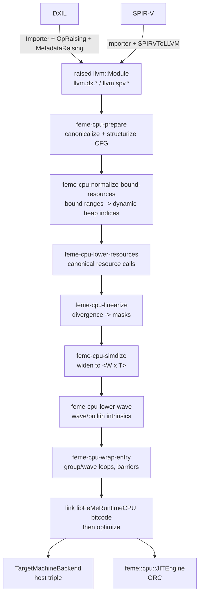

# FeMe CPU Target Design

## Status

Roadmap milestone 1 (scaffolding + raised-IR contract + ABI header),
milestone 2 (uniformity analysis), milestone 3 (resource canonicalization +
scalar helper IR), milestone 4 (uniform-control-flow end-to-end at
`W = 4`), milestone 5 (the CFG restructurization test suite), milestone 6
(linearization for divergent diamonds and loops with a divergent exit),
milestone 7 (widening for loops, masked memory ops, and the scalarization
fallback), milestone 8 (wave intrinsic lowering), milestone 9 (barriers
and groupshared memory), milestone 10 (end-to-end HLSL test coverage), and
milestone 11 (traditional bound-resource emulation) are implemented.
`feme::cpu::runPipeline`
(feme/include/feme/Target/CPU/Pipeline.h) factors the
Prepare/BoundResourceNormalization/ResourceLowering/Linearize/SIMDize/
WaveLowering/EntryWrapper sequence out of `feme::cpu::JITEngine::create`
into a function `feme::Driver::run`'s own CPU-target retargeting path
shares, so `feme --target=<a non-DXIL/SPIR-V/AMDGPU triple>` retargets a
raised shader to a real object file the same way `feme
--target=amdgcn-amd-amdhsa` already did for AMDGPU, rather than handing
raised IR straight to a host `TargetMachine` that cannot make sense of it.
This document is a companion to
[Design.md](Design.md) — it
does not restate FeMe's architecture, only the parts that are new for CPU
targets. Read the "Pipeline Abstraction", "Retargeting to Native ISA", and
"Raised LLVM IR -> AMDGPU" sections of that document first; this design is
a sibling of the latter.

Deviation: milestone 1's implementation narrowed a few things described
below; each is called out inline where it's discussed, and summarized here:

- `WaveActiveBallot` raising was deferred. It was grouped, in
  `feme::dxil::OpRaisingPass`'s own scope notes, with `IMul`/`UMul`/
  `UAddc`/`SplitDouble` as ops needing a general multi-return-value
  `extractvalue`-reconstruction mechanism this milestone did not build; it
  is not specific to wave ops and was better done once for all five than
  once for `WaveActiveBallot` alone. Roadmap step R3 added that mechanism
  (`feme::dxil::OpRaisingPass::raiseAggregateCall`) and the CPU-target
  lowering it unblocks (`feme::cpu::WaveCallKind::Ballot`/`lowerBallot` in
  WaveLowering.cpp) -- see the milestone 8 deviation note below and
  `feme/test/Tools/feme-run/HLSL/ballot.hlsl`.
- `checkSupportedRaisedOps` (see "Raised IR prerequisites" below) rejected
  every register-bound resource handle unconditionally, including the one
  the "Root constants" section carves out an exception for, until roadmap
  step R12 implemented that exception (`feme::cpu::RootConstantLoweringPass`,
  matching one `(b0, space0)` binding by default and lowering it to
  bounds-checked root-constant loads instead of rejecting it -- see that
  section's own Deviation note for the narrowing R12 itself introduced).
  Milestone 11 narrows this further still -- see its own Deviation note
  below -- by normalizing every *other*
  register-bound handle into a heap access before this check runs, rather
  than rejecting it.
- `CreateHandleFromHeap` (DXIL opcode 218) and `WaveGetLaneCount` (opcode
  112) needed wiring in `llvm/lib/Target/DirectX/DXIL.td` and
  `IntrinsicsDirectX.td` before `feme::dxil::OpRaisingPass` could raise
  them at all -- both were previously unwired `DXILOpClass`
  placeholders/intrinsics with no opcode connecting them, exactly as the
  "Raised IR prerequisites" section anticipated for `CreateHandleFromHeap`.
  Neither gained a forward-lowering (`DXILOpLowering.cpp`) path, since
  FeMe's raising only needs to parse already-lowered `dx.op.*` calls, not
  produce them.
- Milestone 11's implementation (`feme::cpu::BoundResourceNormalizationPass`)
  narrowed the design in several ways:
  - Only DXIL's `llvm.dx.resource.handlefrombinding` is normalized, and
    only for the two resource kinds `feme::cpu::ResourceLoweringPass`
    itself canonicalizes (`TypedBuffer`/`RawBuffer`). `handlefromimplicitbinding`
    has no in-tree raiser to produce it in the first place, and SPIR-V's
    `spv.resource.handlefrombinding` has no raised bindless-heap
    counterpart (`handlefromheap`) to rewrite into: `SPV_EXT_descriptor_heap`
    remains unraised (see "Resource Model"'s SPIR-V bullet), so SPIR-V
    binding-range preservation is deferred until that lands upstream and
    SPIR-V resource access executes through `feme-run` at all (see
    "Known gap" in Design.md's SPIR-V section).
  - `feme::cpu::checkSupportedRaisedOps` moved to run *after*
    `BoundResourceNormalizationPass` (in both `feme::cpu::runPipeline` and
    `feme::cpu::JITEngine::create`'s `--reference` pipeline) rather than
    before the CPU pipeline runs at all, since a finite, unambiguous
    traditional binding is no longer categorically unsupported. An
    unbounded range, a conflicting re-declaration of the same binding, or
    an unsupported resource kind is left unrewritten and still rejected by
    that check, with an updated diagnostic describing all of these cases.
  - The reserved heap prefix and each accepted range's assignment are
    published through a new `!feme.cpu.bound_resources` module metadata
    node (mirroring `!feme.cpu.resources`) and a `feme::cpu::ArtifactInfo`
    version bump (1 -> 2, adding `ReservedResourceHeapSize`/`BoundRanges`).
  - Physical-heap materialization
    (`feme::cpu::materializeResourceHeap`) lives in a new
    feme/include/feme/Target/CPU/ResourceHeap.h (part of `FeMeTargetCPU`),
    not in `libFeMeRuntimeCPU`'s `FeMeRuntimeCPU.c` as this milestone's own
    roadmap text literally suggests: that file is plain freestanding C
    compiled for the *shader's own* IR (see its file comment), with no
    dynamic allocation and no dependency on FeMe's C++ code, so it cannot
    host a `std::vector`-returning, host-side helper. `feme::cpu::JITEngine`
    and `feme-run` both call this helper instead of duplicating the logic.
  - Root constants remain unimplemented (see the bullet above); a bound
    constant buffer is therefore still an unsupported resource kind, not
    normalized by this pass, matching `feme::cpu::ResourceLoweringPass`'s
    own scope.

Deviation: roadmap step R10 closes the "SPIR-V resource access executes
through `feme-run` at all" gap the milestone 11 bullet above deferred, but
not by teaching `BoundResourceNormalizationPass` itself SPIR-V's binding
form (`SPV_EXT_descriptor_heap`, and with it a raised `spv.resource.
handlefromheap` that pass could rewrite into, remain unraised upstream, so
that deferral still stands as written). Instead, a new
`feme::cpu::SPIRVResourceLoweringPass` normalizes a SPIR-V-sourced bound
`spirv.VulkanBuffer` handle -- the storage-buffer representation
`feme::spirv::convertBufferBlockType` (see the "SPIR-V" section of
Design.md) produces for `RWStructuredBuffer<T>`/`StructuredBuffer<T>` --
directly into the same canonical `feme.cpu.resource.*` calls
`BoundResourceNormalizationPass` + `ResourceLoweringPass` jointly produce
for DXIL, in one pass rather than two: SPIR-V has no bindless heap concept
to normalize *into*, so there is no intermediate `handlefromheap` step to
split around `checkSupportedRaisedOps` the way the DXIL side does. It
covers only a flat (non-aggregate-element) storage buffer access -- a
`getpointer` immediately followed by an ordinary load/store, with no
`getelementptr` navigating the element's own fields -- matching
`ResourceLoweringPass`'s own "typed and raw buffers only" narrowing;
image/sampler resources and a structured buffer's individual fields remain
future work. `feme-run` itself gained `feme::SPIRVImporter` +
`feme::SPIRVToLLVMTranslator` wiring (mirroring its existing DXIL import),
and a small `feme::cpu::SPIRVBuiltinFoldingPass` folds the
`insertelement`-chain-then-`extractelement` idiom
`feme::spirv::createConvertSPIRVToLLVMPass` always materializes a builtin
(thread/group ID) input variable as, back into the single scalar lane a
shader actually reads -- otherwise `feme::cpu::SIMDizePass`'s pattern
matching over a resource store's value operand does not recognize it, even
though DXIL's already-scalar `llvm.dx.thread.id` never needs this. The
completion test is `test/Tools/feme-run/HLSL/front-end-equivalence.hlsl`:
one shader's DXIL and SPIR-V executions checked against the same expected
numbers.

Deviation: roadmap step R26 generalizes `feme::cpu::SPIRVResourceLoweringPass`
from the implicit range-size-1 binding the R10 deviation note above
describes to a real arrayed one, matching
`feme::cpu::BoundResourceNormalizationPass`'s own DXIL array-binding support
(see "Bound-resource normalization" below): `llvm.spv.resource.
handlefrombinding`'s own range-size and (possibly dynamic) array-index
operands are read rather than ignored, each (descriptor set, binding)
identity is assigned a contiguous run of heap slots sized by its declared
range, and an access through it is range-checked and clamped into that run
with the same overflow/out-of-range `UINT32_MAX` sentinel the DXIL pass
uses. An unbounded range (range size 0) is left un-normalized, and two
handles at the same identity disagreeing about the range size are a
conflicting declaration, both mirroring the DXIL pass's own rejections. The
array index is deliberately not cached alongside the handle -- it is
re-read from the handle's own operand at lowering time instead, avoiding
the exact stale-`Argument`-pointer bug the R25 deviation note above
describes fixing in `RootConstantLowering.cpp`, for the same reason
(`addResourceEnvParams` rebuilds the handle's function, RAUWing every
argument and erasing the original). A Vulkan *dynamic* storage/uniform
buffer offset needs no change here at all: per "Memory and Buffers" in
feme/docs/FeMeVulkanDesign.md, it is folded into `FemeDescriptor::Data` when
a host materializes a dispatch's physical heap, exactly like every other
buffer's binding offset, so the existing `BoundResourceRange`/
`materializeResourceHeap` model already carries it. `SPV_EXT_descriptor_heap`
remains unraised, so this is still a separate pass rather than a reuse of
`BoundResourceNormalizationPass`, answering FeMeVulkanDesign.md's open
question 3 in the negative for good. `test/Transforms/CPU/spirv-resource-
lowering-array.ll` covers an arrayed, dynamically-indexed binding;
`spirv-resource-lowering-unsupported.ll`/`-conflicting.ll` gain the
unbounded-range and range-size-conflict cases; and
`unittests/Transforms/CPU/SPIRVResourceLoweringTest.cpp` covers the same at
the pass level.

Deviation: milestone 2's implementation narrowed one thing described in
"Phase 2: Uniformity Analysis" below:

- `WaveTTIImpl::getValueUniformity` classifies divergence sources and
  wave-wide reductions by an explicit, enumerated list of the
  `llvm.{dx,spv}.*` intrinsic IDs FeMe's DXIL/SPIR-V raising already
  produces (see `feme::dxil::OpRaisingPass` and
  `feme::spirv::RaisedLoweringPass`), rather than a more general
  name/attribute-based rule. There is no separate `WaveReadLaneFirst`
  intrinsic wired yet -- FeMe raises only `WaveReadLaneAt`
  (`llvm.{dx,spv}.wave.readlane`), which subsumes it (reading a uniform
  lane index) and is classified `AlwaysUniform` for the same reason the
  design's `WaveReadLaneFirst` example is: it broadcasts a single lane's
  value to the whole wave. The list grows as new raised wave intrinsics are
  added; nothing about the classification itself is expected to change.
- The `gtest` coverage this analysis originally got (construct IR, assert
  `isDivergentAtDef` directly against `UniformityInfo`) was replaced with
  `FileCheck` tests against the `print<feme-cpu-uniformity>` printer's
  output instead: asserting on printed `DIVERGENT:` lines is easier to
  read and debug than a table of `EXPECT_TRUE`/`EXPECT_FALSE` calls, and
  it exercises the printer itself as a side effect. See
  `feme/test/Analysis/CPU/uniformity.ll`; there is no longer a
  `WaveUniformityTest.cpp`. The "Test strategy per phase" table below is
  updated accordingly.

Deviation: milestone 3's implementation narrowed several things described
in "Resource Model" below; each is called out inline where it's discussed,
and summarized here:

- `feme::cpu::ResourceLoweringPass` only canonicalizes the two resource
  kinds `feme::dxil::OpRaisingPass` currently reconstructs a
  `handlefromheap` for: `TypedBuffer` and `RawBuffer` (which covers both
  `ByteAddressBuffer` and `StructuredBuffer`; see "Descriptor heaps" for
  how the pass tells them apart). A constant buffer read through the heap
  is left entirely unmodified rather than canonicalized -- roadmap step R3
  added the general multi-return-value `extractvalue` reconstruction
  mechanism the milestone 1 deviation above once deferred `WaveActiveBallot`
  et al. for (`feme::dxil::OpRaisingPass::raiseAggregateCall`), but
  `dx.op.cbufferLoadLegacy` itself is not yet one of that mechanism's
  `RaisableAggregateOp` entries: it returns a whole row of dwords per call
  (a wider, differently-shaped aggregate than `IMul`/`UMul`/`UAddc`/
  `SplitDouble`/`WaveActiveBallot`'s fixed two-or-four-field structs), so
  wiring it up is left for a future change. Sampling remains a non-goal, so
  a sampler heap access is untouched for the same reason
  `feme::dxil::OpRaisingPass` never raises a `handlefromheap` for one.
- SPIR-V's bindless descriptor-heap counterpart (`SPV_EXT_descriptor_heap`)
  has no raised-IR representation yet -- only DXIL defines
  `llvm.dx.resource.handlefromheap` (see "Raised IR prerequisites") -- so
  `ResourceLoweringPass` has nothing to rewrite in a SPIR-V-sourced module
  until that lands upstream.
- The new heap/root-constant parameters `ResourceLoweringPass` appends to a
  rewritten function are threaded through the calls *within* that function
  only. Full inter-procedural threading -- a resource access reached
  through a helper function the entry point calls -- is deferred; a
  function is rewritten only if every resource access it performs is local
  to it. Raised shaders are typically already fully inlined by this point,
  so this has not been a practical limitation yet.
- Root constants were not implemented as of this milestone (this was
  already true as of milestone 1's deviation note above): every
  register-bound handle was rejected unconditionally, `!feme.cpu.
  resources`' `RootConstantSize` field was always 0, and the "Kernel ABI"'s
  `RootConstants`/`RootConstantSize` parameters `ResourceLoweringPass`
  appends were always null/0 at this stage. Roadmap step R12 implemented
  them (`feme::cpu::RootConstantLoweringPass`, see the "Root constants"
  section's own Deviation note for the narrowing it introduced); a shader
  with no other resource access gets `RootConstants`/`RootConstantSize`
  populated by that pass directly, and one that also performs bindless
  resource access gets them populated by `ResourceLoweringPass` instead
  (the two passes' env-parameter names would otherwise collide), but both
  now report a real, non-zero `RootConstantSize` when the shader actually
  reads one.
- The `libFeMeRuntimeCPU` scalar helper source (`feme/runtime/CPU/
  FeMeRuntimeCPU.c`, compiled to bitcode by clang) implements the
  typed-buffer `<4 x float>` view
  (switching between the `R32G32B32A32_FLOAT` identity format and the
  packed `R8G8B8A8_UNORM` format, to establish the format-switch pattern
  concretely and correctly) and the raw/structured `i32`/`float` views.
  Every other view/format "Descriptor formats" lists is a mechanical
  repeat of the same pattern -- "extend one helper implementation rather
  than every access site" -- added on demand as a shader actually needs
  it, rather than spelled out exhaustively up front. Nothing links this
  bitcode into a compiled shader module yet; that lands with the
  widening/entry-wrapper milestones (4, 7) "Descriptor formats" describes
  the linking flow for.
- `feme::cpu::ArtifactInfo`'s versioned byte layout includes the
  execution-shape fields ("Kernel ABI": wave size, thread-group
  dimensions, groupshared size/alignment) from the start, so a later
  milestone that wires wave-size resolution (milestone 4) and groupshared
  allocation (milestone 9) into `ResourceLoweringPass` or a sibling pass
  does not need a new artifact version -- but this milestone always
  populates them with 0. Nothing yet writes this artifact into an actual
  object file either: `emitArtifactGlobal`/`readArtifactGlobal` round-trip
  the format in-module (see feme/include/feme/Target/CPU/ResourceInfo.h),
  which is what "testable at `W`-agnostic scale" means for this piece;
  reading the symbol back out of a real object file is exercised once the
  AOT/JIT milestones produce one.

Deviation: milestone 4's implementation narrowed several things described
in "Phase 4: Widening", "Phase 5: Wave and Builtin Lowering", "Phase 6:
Group Execution and Barriers" and "JIT Flow" below; each is called out
inline where it's discussed, and summarized here:

- `feme::cpu::SIMDizePass` widens acyclic, uniform-control-flow shaders
  only (a CFG with no loop and no divergent branch): the divergence
  transform (Phase 3, milestone 6) does not exist yet, so this pass
  verifies both properties itself and diagnoses (rather than mis-widens) a
  function that has either. Only a subset of "Widening"'s table is
  implemented: elementwise scalar/vector-typed instructions (binary/unary
  ops, casts, `icmp`/`fcmp`, `select`, `phi`), the per-lane-varying
  builtins (thread id family, lane index), and `feme.cpu.resource.*` calls
  (scalarized when any operand is divergent, left scalar when every
  operand is uniform). Masked memory ops, the scalarization fallback for
  arbitrary instructions, atomics, and widening a loop are all milestone 7
  (see its own deviation note for what narrowed there in turn); vector/
  aggregate leaf decomposition is likewise narrower than the design even
  after milestone 7 (see that deviation note for the one shape it does
  cover).
- The per-lane-varying builtins `SIMDizePass` cannot widen with an
  ordinary elementwise rule (thread id, thread id in group, flattened
  thread id in group, lane index) become canonical, wave-size-mangled
  `feme.cpu.builtin.*` calls (see `feme::cpu::BuiltinCalls`), mirroring how
  `feme::cpu::ResourceCalls` separates canonicalization from lowering;
  `feme::cpu::WaveLoweringPass`'s builtin half lowers them into the real
  group-id/wave-index/lane arithmetic. `llvm.{dx,spv}.group.id` is uniform
  and is simply replaced by the corresponding wave-body `GroupID`
  parameter directly in `SIMDizePass`, with no canonical call of its own.
  This is not what the design's Phase 4/5 split originally implied
  (`SIMDizePass` widens a scalar type in place; it does not introduce new
  call kinds), but keeps Phase 4's "everything is `<W x T>`" postcondition
  true without Phase 4 having to know the group/wave-index arithmetic
  Phase 5 owns.
- Roadmap H6n: `llvm.spv.subgroup.id` is likewise uniform and is replaced
  directly by the wave-body's own `WaveIndex` parameter in `SIMDizePass`,
  mirroring `llvm.{dx,spv}.group.id`'s treatment immediately above --
  "which subgroup this is" is exactly "which wave-loop iteration `w` this
  is" (see `group = ceil(GroupSize / W) waves` below), so no new call kind
  or `WaveLoweringPass` support is needed. `llvm.spv.num.subgroups` folds
  to a compile-time `ConstantInt`, `ceil(NumThreads.x*y*z / WaveSize)`,
  computed directly from the entry's own `hlsl.numthreads` attribute and
  the pass's own `WaveSize` parameter -- both known at `SIMDizePass` time,
  so, like a fully-unrolled wave loop's own group/wave-index arithmetic
  above, it constant-folds outright rather than needing any runtime value
  at all.
- Roadmap H6o: `llvm.spv.num.workgroups` is uniform per widened-function
  call the same way `llvm.{dx,spv}.group.id` is, but unlike `NumSubgroups`
  immediately above it is a genuine *runtime* dispatch-time value (the
  dispatch's own grid size, `vkCmdDrawMeshTasksEXT`'s `groupCountX/Y/Z`),
  not derivable at compile time from `hlsl.numthreads` -- so it cannot
  constant-fold. `SIMDizePass` instead substitutes it directly for three
  new wave-body parameters (`wave_group_count_x/y/z`, alongside `WaveBodyEnv`'s
  existing `GroupIDX/Y/Z`), and `feme::cpu::EntryWrapperPass` threads the
  actual per-dispatch value into them from `FemeDispatchArgs::GroupCount`
  (a struct field that already existed, parallel to `GroupID`, but was
  never read before this fix) -- the same "uniform value threaded through
  the wave-body interface, not widened" treatment as `GroupID` itself,
  just sourced from a different `FemeDispatchArgs` field.
- `feme::cpu::WaveLoweringPass` implements only the builtin half (thread
  and group id arithmetic); the remaining wave intrinsics (`WaveActiveSum`,
  `WaveReadLaneAt`, ...) are milestone 8, matching the design's own "two
  halves, separately usable" note.
- `feme::cpu::EntryWrapperPass` implements only the barrier-free case: the
  wave loop and the exported `feme_cpu_entry_<name>` ABI function. Barrier
  region splitting and groupshared allocation are milestone 9;
  `FemeDispatchArgs::GroupShared` is threaded straight through to the wave
  body unconditionally.
- `feme::cpu::JITEngine::dispatch` runs every group of a dispatch
  sequentially, on the calling thread, rather than across a thread pool:
  `JITOptions::NumThreads` is accepted but not yet consulted. The
  `ObjectCache`-based compiled-shader caching, the escape hatch for a
  driver-style embedder, and the object-file path
  (`feme::TargetMachineBackend` retargeting to the host triple) described
  in "JIT Flow" are not yet wired into this pass; only the JIT path is
  implemented so far.
- `feme-run`'s input must already be idiomatic, raised LLVM IR
  (`.ll`/`.bc`); it does not yet import DXIL or SPIR-V itself the way
  `feme::Driver` does. Its heap YAML format only describes untyped raw/
  structured byte buffers, not the typed-buffer view/format the full
  design's YAML sketch shows -- matching what `libFeMeRuntimeCPU` and
  resource-call scalarization exercise as of this milestone. `--reference`
  execution (the ground truth the CFG restructurization suite, milestone
  5, diffs against) is implemented as of that milestone -- see its own
  Deviation note below.

  Update (roadmap R21, see feme/docs/Roadmap.md): `feme::cpu::JITEngine`'s
  compiled-code ownership is factored out into `feme::cpu::CompiledStage`
  (`feme/include/feme/Target/CPU/CompiledStage.h`), whose `invokeGroup`
  matches this section's own "JIT Flow" design below at the per-group
  granularity, and `dispatch` now runs every group across a real
  `llvm::DefaultThreadPool` sized by `JITOptions::NumThreads` (0 = hardware
  concurrency, 1 = the calling thread with no pool), rather than accepting
  and ignoring it. `ObjectCache`-based caching and the object-file/AOT path
  described in "JIT Flow" remain unwired to this milestone's `create`.

  Update (end-to-end HLSL test coverage, see feme/test/Tools/feme-run/HLSL):
  `feme-run` now also accepts a DXIL bitcode file or `DXContainer` directly,
  running the same import + `feme::dxil::OpRaisingPass`/
  `MetadataRaisingPass` sequence `feme::Driver` runs before any
  target-specific lowering -- closing this note's DXIL half. SPIR-V import
  remains unwired: real Clang-compiled SPIR-V could not even round-trip
  through `feme::SPIRVImporter` for a shader using a resource (an
  `OpCopyObject` this milestone's testing surfaced but does not fix -- see
  "Known gap" in Design.md's SPIR-V section), so there is no bindless-heap
  raised form to feed this tool for that format yet either.

  A second, genuinely new gap this testing surfaced (not previously called
  out anywhere in this document): Clang's own HLSL front end cannot emit
  `ResourceDescriptorHeap`/`SamplerDescriptorHeap` (SM6.6 bindless) access
  at all -- only a register-bound handle -- so a real HLSL shader Clang
  compiles today can never reach the bindless form this CPU target
  otherwise requires (see "Root constants" above), regardless of anything
  in `feme-run` or `feme::Driver`. `feme-run --dxil-bind-register-resources`
  was a narrow, testing-only bridge around exactly that gap: it rewrote a
  raised `llvm.dx.resource.handlefrombinding` call into
  `llvm.dx.resource.handlefromheap`, mapping the register slot directly
  onto the same heap index space `--heap`'s YAML file addressed. It was
  *not* a relaxation of the CPU target's own "no register-bound resource"
  rejection (`feme::cpu::checkSupportedRaisedOps`) -- the bridge ran,
  opt-in only, inside `feme-run` itself, before the module ever reached
  that check. Milestone 11 (below) removed this bridge: a register-bound
  handle Clang's HLSL front end emits is now normalized into the bindless
  heap by the common `feme::cpu::BoundResourceNormalizationPass` path every
  other consumer already uses, rather than by a `feme-run`-only rewrite.

  Relatedly, `feme::dxil::OpRaisingPass` gained `raiseRawBufferStore`/
  `raiseRawBufferLoad` (a single-component `dx.op.rawBufferStore`/
  `rawBufferLoad`, opcodes 140/139): every HLSL end-to-end test that
  reports its result through a `RWStructuredBuffer`/`RWByteAddressBuffer`
  (the idiomatic way to do so; a `RWBuffer<T>` typed buffer, the only kind
  already raised, cannot express an untyped per-thread scalar write)
  depends on this raising existing at all -- it was simply never exercised
  before real HLSL compiled through it.

Deviation: milestone 5's implementation narrowed a few things described in
"CFG restructurization test suite" below; each is called out inline where
it's discussed, and summarized here:

- Building the named-shape corpus surfaced a real gap rather than only
  validating one: `StructurizeCFG`'s own "Flow" blocks (built to merge a
  divergent branch's two arms back together) can leave a critical edge
  behind, which `feme::cpu::verifyStructured`'s "no critical edges" check
  caught on an existing test (`prepare-structurize.ll`). Fixed by adding
  `BreakCriticalEdgesPass` as Phase 1's last step, rather than left as a
  narrowing -- this is the kind of regression the suite exists to catch,
  and it was caught the first time it was exercised.
- The layer 3 generator (`feme-cfg-gen`/`feme::cpu::generateCFGIR`) builds
  its random nesting out of a fixed menu of constructs (`if`/`else`, a
  counted loop with optional break/continue, and the "irreducible-two-entry"
  shape as its one unstructured-edge kind) rather than an unconstrained
  random control-flow graph; every construct still nests to an
  `Opts.MaxDepth`-bounded, arbitrary depth and the corpus this can generate
  is already far larger than anyone would hand-write, but it is not every
  irreducible shape `FixIrreducible` might ever see.
- The differential harness (layer 3's other half, `--reference` diffed
  against the normal pipeline) was scoped, as of this milestone, to the same
  acyclic, uniform-control-flow shapes `feme::cpu::SIMDizePass` widened
  (`feme-cfg-gen --divergent=false --loops=false --unstructured=false`):
  divergent branches and loops are exactly what the linearizer (roadmap
  milestone 6) and the remaining widening work (milestone 7) made
  widenable. Roadmap step R1 (see feme/docs/Roadmap.md) grows the harness's
  default scope to match: `feme/test/Tools/feme-run/differential-harness.test`
  now diffs `--divergent`/`--loops` shapes (several curated seeds, across
  wave sizes 4/8/16/32 and more than one group count) against `--reference`,
  using the `feme-run-differential`/`feme-wave-size-sweep` helpers
  (feme/utils) roadmap step R1 also adds. `--unstructured` shapes are
  exercised against `--reference` alone, not yet the normal pipeline (see
  the next bullet and feme/docs/Roadmap.md's gap inventory for why).
  `--reference` itself (`feme::cpu::ReferenceLoweringPass` +
  `feme::cpu::ReferenceEntryWrapperPass`) has no shape restriction -- it
  runs any shader `feme::cpu::PreparePass` + resource lowering accept,
  rejecting only an actual wave intrinsic use (which has no meaning one
  invocation at a time).
- Enabling `--unstructured` surfaced two real bugs, not just a scope
  narrowing:
  - `feme-cfg-gen`'s own `genIrreducible` construct had no termination
    guarantee: its two mutually-reachable blocks each only left the cycle on
    a `%tid`/`%gid`-derived condition, and neither operand changes across a
    hop between them, so a thread for which both conditions were `false`
    bounced between the two forever. Fixed by bounding every hop with a
    shared counter that forces an exit once a small cap is reached (see
    CFGGen.cpp's `genIrreducible`); the shape stays irreducible (neither
    block dominates the other) but now always terminates.
  - Separately, some `--unstructured`-derived shapes reach the JIT despite
    `feme::cpu::LinearizePass` diagnosing an unlinearized divergent branch
    inside a loop (which the design says should be "diagnosed and left
    completely untouched" -- see this milestone's own note above), producing
    a program that runs forever instead of failing cleanly the way the same
    diagnostic does for a non-`--unstructured` shape (roadmap milestone 6's
    `feme-cpu-simdize` divergent-branch check does not catch every case
    `feme-cpu-linearize` itself already declined to fix). This is a new P0
    gap (see feme/docs/Roadmap.md's gap inventory); it is why this
    milestone's harness growth stops at `--reference`-only coverage for
    `--unstructured` rather than diffing it against the normal pipeline.
- `feme-cpu-restructure-fuzzer` asserts `feme::cpu::verifyStructured`'s
  postconditions (layers 1/2) over generator seeds (layer 3's generator),
  not execution correctness (layer 3's differential harness); it always
  enables `AllowUnstructured`, so it is a structural (not semantic) check
  over the harness's full breadth rather than just its currently-widenable
  subset.

Deviation: milestone 6's implementation narrowed several things described in
"Phase 3: Linearization and Predication" below; each is called out inline
where it's discussed, and summarized here:

- `feme::cpu::LinearizePass` handles exactly two shapes: a **divergent
  diamond** (a two-way branch whose condition is divergent, with a
  reconvergence point) -- which may itself sit entirely inside a loop body,
  as long as neither of its targets is that loop's own back edge or exit
  edge -- and a **loop whose divergent exit check sits directly in its
  header and/or its latch, or in one other block reached from the header
  and reaching the latch each via a plain unconditional chain** (see below).
  Both are validated (and, on a shape this milestone does not recognize,
  diagnosed and left completely untouched) before anything is mutated,
  matching how `feme::cpu::SIMDizePass` already bails rather than mis-widens
  an unsupported CFG.
- An **empty diamond arm** (a branch whose true or false successor *is* the
  reconvergence block itself, i.e. an `if` with no corresponding body on
  that side) is not supported yet: the general rewrite needs to redirect the
  edge the branch instruction itself owns rather than a distinct arm
  block's tail, which adds a case this milestone defers. A nested divergent
  branch, and a uniform branch nested inside a divergent arm (or vice
  versa), both work today -- only the empty-arm case is narrowed.
- **Early `ret` under a divergent branch** (one arm returns directly instead
  of reconverging) is not supported: in practice this already fails
  `PostDominatorTree`'s "does every path from this branch reach a common
  block" property before this pass's own check even runs, since the
  branch then has no real immediate post-dominator to reconverge at, so it
  is reported as "no reconvergence point" rather than a dedicated
  diagnostic. The mask-update-plus-jump-to-a-unified-exit rewrite "Phase 3"
  describes for this case is still future work.
- The loop linearizer recognizes a divergent exit check directly in the
  header or the latch, **or in a third block reached from the header, and
  reaching the latch, each via a plain unconditional chain** -- the shape
  `StructurizeCFG`'s general "Flow" merge-block scheme restructures even a
  single header/latch loop's exit check into once `feme-cpu-prepare` has
  run (see the `loop-break.ll` shape below), always targeting the loop's
  one shared exit block (guaranteed by `feme::cpu::verifyStructured`'s
  "unique exit block" postcondition). `feme::cpu::DiamondFlattener` was
  generalized alongside this: it now also flattens a plain, non-loop-
  control diamond that sits *inside* a cycle (neither of its targets is
  the cycle's own back edge or exit edge) -- e.g. the diamond
  `StructurizeCFG` builds for a divergent `break` check, which reconverges
  at the "Flow" block holding the real exit decision -- rather than
  stopping at the cycle boundary unconditionally; only a genuine
  loop-control edge is still left to `LoopLinearizer`. `feme::cpu::
  DiamondFlattener` was also generalized to validate/flatten from every
  cycle's exit block, not just the function entry, so a divergent diamond
  *entirely after* a loop -- e.g. a Mandelbrot-style escape-time loop
  followed by a palette lookup branching on whether it converged -- is
  flattened too, instead of being silently left unvisited. A divergent
  check reached through an internal diamond that reconverges back at the
  latch **via an empty arm** (the `loop-continue.ll` named shape, where the
  "continue" arm jumps directly to the reconvergence block with no body of
  its own) is still diagnosed and left alone: that is `DiamondFlattener`'s
  own pre-existing "empty diamond arm" narrowing (see two bullets above),
  not a loop-linearizer-specific gap.
- (Roadmap H19k) `StructurizeCFG` unconditionally splits a loop's own
  uniform trip-count check into two `CondBr` blocks whenever that check is
  not already fused with the latch -- the ordinary
  `for (init; cond; ++i) { body }` shape: the check itself, plus a "Flow"
  block re-deriving the identical decision via a `phi` of two compile-time-
  constant `i1`s. `LoopLinearizer` (`Linearize.cpp`) now recognizes and
  folds away exactly this redundant re-derivation (`foldRedundantFlowBlock`,
  called from `linearizeCycle` before the header/latch/exit-check search
  runs) whenever the `CondBr` condition is a `PHINode` in that same block
  with exactly 2 incoming values that are both literal `ConstantInt`s
  selecting the block's two different successors -- a syntactic,
  conservative precondition chosen so it can never fold away a genuine
  divergent decision (whose condition is always a real runtime value, not
  a phi of pure literal constants). This is a narrower, more targeted
  extension than the whole-pipeline `SimplifyCFGPass` insertion first
  attempted for H19k and abandoned (it also unconditionally tail-merges
  same-terminator-type blocks, corrupting the genuinely different
  `loop-early-return.ll` multi-exit shape) -- see "Roadmap H19k: measured
  impact" in `VulkanCTSReport.md`.
- **As of this milestone, masking was implemented only for the canonical
  `feme.cpu.resource.*` calls** (which already carry a mask operand -- see
  `feme::cpu::ResourceCalls`), by rewriting that operand from the constant
  `true` `feme::cpu::ResourceLoweringPass` leaves it as to the block's
  actual mask. Ordinary `load`/`store` under a divergent condition were not
  yet rewritten into the `feme.cpu.masked.load`/`.store` intrinsic forms
  "Mask representation between phases" describes -- resource calls were the
  only memory access the pipeline canonicalized and executed end to end at
  this point, so those intrinsics (and the scalarized-active-lane-loop
  lowering Phase 4 gives them) were added once Phase 4 actually needed them
  (roadmap milestone 7, see its own deviation note -- `llvm.masked.gather`/
  `.scatter` rather than the scalarized-active-lane-loop this note
  anticipated). `feme.cpu.mask.any` (needed by the loop linearizer itself,
  unlike the memory intrinsics) is implemented in
  `feme/include/feme/Transforms/CPU/MaskIntrinsics.h`.
- Nested loops (a cycle containing another cycle) are not linearized: only
  a leaf cycle (one with no child cycle) is considered a candidate.
- The "skip a block when all lanes are off" guard described as "not emitted
  in v1" in "Divergent two-way branches become unconditional fallthrough"
  is, as that section says, still not emitted -- this milestone does not
  change that.

Deviation: milestone 7's implementation narrowed several things described in
"Phase 4: Widening" and "Mask representation between phases" below; each is
called out inline where it's discussed, and summarized here:

- **`feme::cpu::SIMDizePass` now widens a loop**, provided
  `feme::cpu::LinearizePass` has already removed every divergent branch from
  it (a loop with one still unlinearized is diagnosed, the same as any other
  unsupported divergent branch): the loop-carried "active" mask becomes a
  widened `phi`, and the mask-gated backedge's `feme.cpu.mask.any` lowers to
  `llvm.vector.reduce.or`. `feme::cpu::LinearizePass`'s `LoopLinearizer` also
  now masks a `feme.cpu.resource.*` call inside a loop body with the
  iteration's active mask (previously only a divergent diamond's arm did).
  Fixing this also required a real bug fix, not just new capability:
  `FunctionWidener::widen`'s final erasure pass used to assume its
  widened function's block *list* order was itself a "uses before defs"
  order, which nothing about LLVM guarantees (only that a def's block
  *dominates* its use's block, regardless of either's position in the
  function's block list) -- a `LinearizePass`-inserted "Flow" merge block
  routinely sorts earlier in the list than a cycle-exit block whose value
  it still uses, once a loop and a diamond after it both need linearizing
  (see `simdize-erasure-order.ll`). Every to-be-erased instruction's uses
  are now severed (RAUW'd with `poison`) up front, across the whole
  to-be-erased set, before any of them are actually erased, making every
  remaining erasure order safe.
- **Masked memory ops are implemented, but only via `llvm.masked.gather`/
  `.scatter`.** `feme::cpu::LinearizePass` now rewrites a plain, non-atomic,
  non-volatile `load`/`store` inside a masked region into a
  `feme.cpu.masked.load`/`.store` call (closing the milestone 6 deviation
  that only `feme.cpu.resource.*` calls got this treatment), and
  `feme::cpu::SIMDizePass` widens either into `llvm.masked.gather`/
  `.scatter` over a `<W x ptr>` address vector -- correct whether the
  address is genuinely divergent or turns out to be the same pointer
  broadcast into every lane. The finer per-case lowerings "Mask
  representation between phases"'s table describes (a broadcast scalar load
  for a wave-invariant uniform address, a scalarized active-lane store loop
  for a uniform address, a real `llvm.masked.load`/`.store` for a
  *contiguous* divergent address) are deferred, pure performance work --
  see the roadmap's "General performance work" item -- `llvm.masked.gather`/
  `.scatter` is correct, if not optimal, for every case that table
  distinguishes.
- **The scalarization fallback is implemented for any divergent instruction
  with no vector form** (atomics, chiefly, but the fallback is fully
  generic): `FunctionWidener::widenScalarizedFallback` clones the
  instruction once per lane with each operand's extracted scalar value,
  reassembling a result vector when it produces one. As of roadmap step R2
  (feme/docs/Roadmap.md), an `AtomicRMWInst` under a divergent condition no
  longer reaches this generic fallback unmasked: `feme::cpu::LinearizePass`
  now rewrites one the same way it already did a plain `load`/`store`, into
  a `feme.cpu.masked.atomicrmw` call (`feme::cpu::MaskIntrinsics`), and
  `FunctionWidener::widenMaskedAtomicRMW` widens it by substituting the
  masked-off lane's operand with `Op`'s identity element (`Xchg`, which has
  none, instead substitutes the value already at the address, safe only
  because dispatch is still sequential -- see §1.6's "Dispatch is
  sequential, not thread-pooled" row in feme/docs/Roadmap.md) rather than
  skipping the instruction, so no real per-lane control flow is needed. An
  `AtomicRMWInst` with no divergent operand at all is still always routed
  through this same widening (not left alone as a uniform value would be):
  its side effect accumulates once per lane, so leaving it unwidened would
  silently run it once for the whole wave instead of once per active lane.
  `FunctionWidener::widenScalarizedFallback` itself excludes a generic
  divergent `CallInst` (e.g. an unrecognized math libcall), whose callee
  operand the fallback's per-operand extraction does not know to leave
  alone; such a call remains a diagnosed error.
- **Vector/aggregate leaf decomposition is narrower than the design
  (widened by roadmap steps R12, C3, H6g-b-a-i-a-i-b, and L11).** "Vectors
  become components, not nested vectors" describes splitting *any*
  divergent `<N x T>` (or aggregate) value into `N` separate `<W x T>`
  components, since LLVM has no `<W x <N x T>>`.
  `feme::cpu::SIMDizePass` implements eleven producer shapes: a
  constant-index `insertelement` chain assembling a vector from scalar
  components, the one shape a typed-buffer *store*'s raising actually
  produces (`feme::dxil::OpRaisingPass::raiseTypedBufferStore`); (R12) a
  vector-typed `feme.cpu.resource.*` *load* call (e.g. a typed-buffer
  element read back), decomposed into its `N` components directly as it
  is scalarized rather than a single nested-vector `Widened` entry; (H7o)
  a plain, non-groupshared `LoadInst` of vector type at a divergent
  address (e.g. a per-invocation-divergent index into an ordinary,
  non-groupshared `<4 x float>` array, the classic
  `positions[gl_VertexIndex]` GLSL/HLSL constant-lookup-table idiom),
  decomposed the same way a resource-call load already was; (L11) a
  groupshared `LoadInst` of vector type at a divergent address (e.g.
  reading a whole `float4` row out of a `groupshared float4x4` at a
  per-lane row index), decomposed by `widenGroupSharedLoad`'s own
  per-component `getelementptr`+`llvm.masked.gather` pair -- one per
  vector element, off the same already-widened `<W x ptr>` row address --
  rather than the ordinary-load path's per-lane clone-and-reassemble,
  since a groupshared address is already a real vector-of-pointers value
  and needs no per-lane extraction; and, as of roadmap step C3 (feme/docs/Roadmap.md), a `phi` of vector type
  (the shape a uniform diamond's merge block gives a value reconciled
  across two divergent arms), a `select` of vector type (a scalar `i1`
  condition is shared unchanged by every per-component `select`; a
  per-lane `<N x i1>` condition -- roadmap H6g-b-a-i-a-i-b -- is itself
  decomposed into its own `N` widened components, one used per
  `select`), a `shufflevector` (its mask is always a compile-time
  constant in LLVM IR, so it decomposes with no runtime work at all --
  see "the common HLSL/GLSL swizzle shape" below), ordinary elementwise
  arithmetic/cast (`BinaryOperator`/`UnaryOperator`/`CastInst`) over a
  vector -- the "color = a + b" shape shader code is full of, and by far
  the most common of the nine once it was actually measured against a
  real CTS run (see VulkanCTSReport.md's "Roadmap C3: measured impact") --
  a vector comparison (`fcmp`/`icmp`, H6g-b-a-i-a-i-b), decomposed the
  same way ordinary elementwise arithmetic is: its `<N x i1>` result
  splits into `N` `<W x i1>` components, most commonly consumed by a
  `select`'s own now-per-lane condition -- the common component-wise
  `lessThanEqual`/`greaterThan`-style GLSL comparison feeding a per-lane
  `select`/`mix` -- and (H6g-b-a-i-a-i-b) a vector-typed, homogeneous
  "trivially vectorizable" intrinsic call (`llvm.minnum`/`llvm.maxnum`/
  `llvm.smin`/`llvm.smax`/...) over a vector operand, decomposed the same
  way: one scalar-element intrinsic call per component -- the shape a
  GLSL `min`/`max`/`clamp` builtin over a vec-typed value takes, and,
  measured against a real CTS run, the shape that actually dominates this
  row's own cited `dEQP-VK.mesh_shader.ext.in_out.*` bucket (see
  VulkanCTSReport.md's "Roadmap H6g-b-a-i-a-i-b: measured impact") once
  the row's own `fcmp`/`icmp`/`select`/reduce fixes below let those cases
  progress far enough to reach it.
  Any producer's components may be consumed by another link of an
  insertelement chain, a matched resource-store call's stored-value
  operand, a matched `feme.cpu.masked.store.*` call's stored-value
  operand (H6g-b-a-i-a-i-a: `LinearizePass`'s masked form of an ordinary
  `store` under divergent control flow -- reached, for example, by a mesh
  entry point's `gl_PrimitiveTriangleIndicesEXT[...] = uvec3(...)`, which
  has no canonicalized `feme.stage.*` op of its own to become a resource
  store instead; `FunctionWidener::widenMaskedStore` reassembles each
  lane's vector from its decomposed components and writes it with a
  load-select-store idiom rather than `llvm.masked.scatter`, which cannot
  represent a per-lane vector value), an `extractelement` (C3: a constant
  index reads a component
  directly; a non-constant one now chains `select`s across every component
  instead of being diagnosed -- "a shuffle or a dynamic index becomes
  selects across the components"), a vector-typed `select`'s condition,
  true, or false operand, a `shufflevector`'s vector operand, a
  vector-typed `phi`'s incoming value, an `fcmp`/`icmp` operand
  (H6g-b-a-i-a-i-b), an argument of a `llvm.vector.reduce.*` call
  (H6g-b-a-i-a-i-b: `isSupportedVectorReduceIntrinsic`/`widenVectorReduce`
  -- the shape glslang's `all`/`any`-style GLSL builtins take over a
  component-wise vector comparison, e.g.
  `llvm.vector.reduce.and.v4i1(fcmp ole <4 x float> %a, %b)`; unlike every
  other consumer here, the reduce call's own *result* is not itself
  vector-typed -- it folds a divergent vector's `N` components together
  two at a time with the matching scalar op, landing one lane-wise
  `<W x T>` result in the ordinary `Widened` map instead of
  `WidenedVectorComponents`), an argument of a vector-typed homogeneous
  vectorizable-intrinsic call (H6g-b-a-i-a-i-b, see above), or another
  elementwise arithmetic/cast operand (see
  `FunctionWidener::widenInsertElement`/`widenExtractElement`/
  `widenVectorSelect`/`widenShuffleVector`/`widenVectorElementwise`/
  `widenVectorReduce`/`createWidenedVectorPHIStub`/
  `fillWidenedVectorPHIIncoming`/`checkVectorDecompositionSupported` in
  SIMDize.cpp). A `CastInst` whose operand's element count would not line
  up component-for-component with the result (e.g. `bitcast <4 x i32> to
  <2 x i64>`) remains diagnosed.
  A divergent *aggregate* (struct/array) value gets its own analogous
  decomposition too (roadmap L21): an `insertvalue` chain assembling a
  struct/array from scalar leaves (or from an already-decomposed
  sub-aggregate inserted whole at once), consumed by another
  `insertvalue`'s aggregate-base or inserted-value operand or an
  `extractvalue`'s aggregate operand -- the latter itself a supported
  producer when its own result is a genuine scalar leaf or a nested
  sub-aggregate (`FunctionWidener::checkAggregateValueSupported`/
  `widenInsertValue`/`widenExtractValue`/
  `WidenedAggregateComponents`/`getAggregateComponents` in SIMDize.cpp) --
  the shape `feme::cpu::SPIRVResourceLoweringPass`'s own whole-aggregate
  resource load/store decomposition (roadmap L20) produces once
  reassembled through `feme::cpu::LinearizePass`, confirmed by reducing a
  real `Feature/StructuredBuffer/packed.test` failure. Every leaf this
  decomposition reaches must itself be a genuine scalar, never a nested
  vector (no real case has needed one: every vector-typed field seen
  inside a divergent aggregate so far is already fully scalar-decomposed
  by the time it reaches this pass); a divergent aggregate built any
  other way (e.g. an ordinary `LoadInst` of aggregate type, or a
  `PHINode` of aggregate type -- unlike a vector `phi`, no real case has
  needed one yet, since `LinearizePass` fully scalarizes every field of a
  divergent aggregate reassignment into a plain scalar `select` before
  ever rebuilding the struct itself) remains diagnosed rather than
  attempting to build an illegal type; generalizing either further is a
  substantial follow-up of its own, not yet scheduled against a specific
  future milestone.
- **A divergent call to a homogeneous, single-overload-type math intrinsic
  widens directly to its vector-typed overload**, rather than being
  rejected: this covers both `llvm::isTriviallyVectorizable`'s
  target-independent intrinsics (`llvm.sqrt.f32`, `llvm.log2.f32`, ...) and
  the handful of `LLVMMatchType`-shaped DXIL/SPIR-V math intrinsics
  `feme::dxil::OpRaisingPass`'s `DirectOps` table raises that utility
  doesn't itself know about (`llvm.dx.frac`/`.rsqrt`/`.saturate` and their
  `spv` counterparts -- see `isElementwiseVectorizableIntrinsic` in
  SIMDize.cpp). A divergent call whose operands aren't all the same type as
  its result (e.g. `llvm.powi`'s integer exponent) remains a diagnosed
  error, same as any other unrecognized divergent call.

Deviation: milestone 8's implementation narrowed several things described in
"Phase 5: Wave and Builtin Lowering" below; each is called out inline where
it's discussed, and summarized here:

- **Only the wave intrinsics DXIL raising already produces are lowered**:
  `WaveGetLaneCount`, `WaveIsFirstLane`, `WaveActiveAnyTrue`/`AllTrue`,
  `WaveActiveAllEqual`, `WaveReadLaneAt`, `WaveAllBitCount`
  (`wave.active.countbits`), `WavePrefixBitCount`, (roadmap step R3)
  `WaveActiveBallot`, and (roadmap step R4) `WaveActiveSum`/`Product`/
  `Min`/`Max`/`BitAnd`/`Or`/`Xor` and `WavePrefixSum`/`Product`. `QuadOp`'s
  `llvm.dx.quad.read.*` family is raised (roadmap step R4) but still not
  lowered here: quad ops need a fixed lane-to-quad mapping this target
  does not yet implement, an explicit v1 non-goal (see "Non-Goals" above).
  `WaveReadLaneFirst` has no dedicated raised intrinsic to lower in the
  first place (DXIL/SPIR-V both express it through the same
  `WaveReadLaneAt`-family op raising already covers).
- **`feme::cpu::WaveCalls` introduces the `feme.cpu.wave.*` canonical calls**
  this milestone needs, mirroring how `feme::cpu::ResourceCalls`/
  `BuiltinCalls` split canonicalization (`feme::cpu::SIMDizePass`, which
  widens each wave intrinsic's operand(s) and attaches the wave's entry
  mask) from lowering (`feme::cpu::WaveLoweringPass`, which builds the real
  reduction/scan/broadcast arithmetic) -- not a deviation from the design's
  intent, but an implementation detail the design's own text did not
  anticipate needing a name for.
- **`WaveReadLaneAt`'s lane operand assumed uniform (closed by roadmap step
  R12).** The design's lowering table describes both a uniform-index fast
  path (guarded extract and broadcast) and a varying-index case (one
  guarded extract per result lane); milestone 8 implemented only the
  former, matching the HLSL source language's own requirement that the
  lane argument be uniform across the wave. R12 implemented the
  varying-index case too: `feme::cpu::WaveLowering.cpp`'s `lowerReadLane`
  now builds a genuine per-lane gather (an unrolled lane loop, like
  `WavePrefixBitCount` below) rather than extracting only lane 0 of the
  index and broadcasting it -- a uniform index still produces the correct
  answer, since every lane's gather then happens to read the same source
  lane. `feme::cpu::WaveTTIImpl::getValueUniformity` keeps DXIL's
  `wave.readlane` classified `AlwaysUniform` unconditionally (HLSL's
  language rule guarantees it, and this lets a uniformly-indexed read of
  an otherwise-divergent value stay uniform, e.g. reading a divergent
  per-lane accumulation at a fixed lane), but SPIR-V's broader
  `OpGroupNonUniformShuffle` semantics (which this also lowers, and which
  permit a genuinely varying index) are left at the generic
  operand-divergence rule instead -- conservative (a uniform-index read of
  a divergent value is classified divergent too, since nothing
  distinguishes which operand's divergence matters for an ordinary call),
  but sound, and `feme::cpu::FunctionWidener::widenWaveCall` narrows a
  call the analysis did classify uniform back to a scalar for its callers
  regardless of which format raised it.
- **`WavePrefixBitCount` scans with an unrolled lane loop**, not the
  log2(`W`)-step shuffle scan the design's table offers as an alternative:
  `WaveSize` is a compile-time constant bounded by `feme::cpu::MaxWaveSize`,
  so the unrolled loop (extract, add, insert, once per lane) is a small,
  fixed-size, easy-to-verify-correct instruction sequence, matching the
  scalarization-style unrolled loops elsewhere in this target
  (`FunctionWidener::widenResourceCall`/`widenScalarizedFallback`). A
  shuffle-based scan is pure performance work that can replace it later
  without changing `feme.cpu.wave.*`'s canonical shape.

Deviation: milestone 9's implementation narrowed several things described in
"Phase 6: Group Execution and Barriers" below; each is called out inline
where it's discussed, and summarized here (roadmap step R5,
feme/docs/Roadmap.md, closed the first two; step R24 closed the rest of
the first two's own remaining narrowings):

- **Region splitting supports a straight-line wave body, a single uniform
  loop, or a single uniform branch.** A `..._with_group_sync` barrier
  inside the design's own worked example -- a uniform loop, keeping the
  iteration outside the region/wave loops -- is recognized by
  `feme::cpu::matchLoopShape` and split by
  `feme::cpu::buildWrapperForLoop`: the loop's header/latch (a pure,
  side-effect-free scalar recurrence -- e.g. a stride-halving reduction's
  own induction variable) are cloned directly into the wrapper as an
  ordinary scalar loop, run once per iteration rather than once per wave.
  A barrier inside a uniform two-way *branch* (as opposed to a loop) is
  recognized by `feme::cpu::matchBranchShape` and split by
  `feme::cpu::buildWrapperForBranch` the same way: the branch's own
  condition (pure, referencing only uniform parameters) is cloned into the
  wrapper as an ordinary scalar `br`, run once for the whole group, and
  each arm's barrier-split regions run through the usual per-wave
  `buildWaveLoop` -- every branch a divergent-control-flow barrier could
  have introduced is already gone by this point
  (`feme::cpu::LinearizePass`), so this shape only needs to handle a
  barrier that survives inside genuinely uniform (e.g. group-id-derived)
  branchy control flow. Two things about a branch remain out of scope: a
  merge block with a phi (a value one arm computes differently from the
  other) and a value live across a barrier *within* one arm (each arm is
  barrier-split independently, and `feme::cpu::EntryWrapperPass` allocates
  only one `barrier_spill` buffer per wrapper, which two independently
  split arms cannot safely share) -- both are diagnosed rather than
  mis-compiled.
- **A wave body carrying a parameter this pass cannot supply is
  diagnosed, not `llvm_unreachable`'d.** A shader entry point takes no
  parameters of its own -- its inputs arrive through stage-IO or resource
  accesses -- so every parameter of the widened wave body belongs to the
  `feme::cpu::WaveBodyEnv` ABI `feme::cpu::SIMDizePass` appends, plus the
  `loopvarN` scalars `buildWrapperForLoop` adds, and `buildWaveLoop`
  dispatches on those names to build its call. An entry point that
  reached `SIMDizePass` still carrying a parameter of its own keeps it
  ahead of the ABI ones, which that dispatch has no argument for. An
  unexpected *input* shape is not an unreachable state, so `buildWrapper`
  now checks the wave body's parameter names up front and reports an
  unrecognized one through the module's diagnostic handler --
  `feme::cpu::runPipeline`'s `ErrorDiagnosticGuard` turns that into a
  clean pipeline failure -- matching this pass's two existing diagnostics
  rather than crashing the process.
- **Values live across a `..._with_group_sync` barrier, including a
  `phi`, are spilled.** Any SSA value -- a `phi` included -- defined in
  one barrier-split region and used by a later one is spilled into a
  per-wave context array (`feme::cpu::spillValuesLiveAcrossBarriers`) --
  `[WavesPerGroup x SpillTy]`, allocated by the wrapper alongside
  groupshared memory and indexed by the wave loop's `w` -- exactly the
  design's own "context" allocation. A spilled `phi`'s store goes after
  its own block's last phi rather than immediately after itself, since
  every phi in a block must stay grouped at its top. A loop-carried value
  other than the loop's own (uniform) induction variable -- one that would
  need spilling *across the loop's own backedge*, not just across a
  barrier within one iteration -- remains unsupported (`feme::cpu::LoopShape`
  requires every header phi's recurrence to be a pure, uniform
  computation).
- **Only a uniform, unconditionally-executed groupshared access is
  canonicalized -- closed by roadmap step R23.** Three shapes used to
  scalarize into one `getelementptr`/broadcast clone per lane before
  `feme::cpu::rewriteGroupSharedGlobals` ever saw them, diagnosed rather
  than rewired: a divergent (per-lane-varying) index -- the common
  `groupshared[threadIdInGroup]` pattern (`feme::cpu::FunctionWidener::
  widenGroupSharedGEP` now widens it into a real vector-of-pointers
  `getelementptr` instead, which `widenGroupSharedLoad`/`widenGroupSharedStore`
  turn into `llvm.masked.gather`/`.scatter` over the flat buffer); an
  access reached through a `getelementptr` at all, even a uniform one, an
  `atomicrmw` in particular (`widenGroupSharedAtomicRMW` reuses the
  uniform `getelementptr` directly per lane instead of broadcasting it);
  and a *masked* store -- one only some lanes execute, e.g. `if (tid.x ==
  0) Shared[0] = ...` -- even at a uniform address, since
  `feme::cpu::LinearizePass` lowers that into a `feme.cpu.masked.store`
  call that always widens to a real `llvm.masked.scatter`
  (`rewriteGroupSharedGlobals` now retargets the resulting same-value
  broadcast too, whether it is `ConstantFolder`'s fold-then-
  re-materialize of a direct global reference or `getWidened`'s ordinary
  broadcast of a uniform `getelementptr`). A *nested* `getelementptr` (a
  groupshared array of arrays/structs, one level deeper than a single
  index) remains unsupported in general -- except (roadmap L11) the one
  specific shape `widenGroupSharedLoad`'s vector-typed-result case itself
  produces: a second-level, per-component `getelementptr` off an
  already-divergent, already-widened first-level `<W x ptr>` row address,
  which `rewriteGroupSharedGlobals` recognizes and retargets precisely
  because its own first-level GEP's type (a vector of pointers) marks it
  as this shape and not an ordinary uniform nested array/struct chain.
- **`Device` and `All` memory scope are not distinguished.** Both get a
  `fence` visible across host threads (`SyncScope::System`); the design
  only requires the CPU target's memory model, not DXIL's/SPIR-V's finer
  distinction between them, to be sound. A `Group`-only barrier gets
  `SyncScope::SingleThread` instead, since every wave of one group already
  runs on the same host thread in program order.
- **No SPIR-V raising produces any of the six barrier intrinsics yet**
  (`feme::cpu::matchBarrierCall` recognizes both spellings, matching every
  other raised-op classification in this target, but nothing raises the
  `spv.*` ones today) -- the same "Raised IR prerequisites" gap milestone
  3's deviation note already flagged for SPIR-V's descriptor-heap
  extension.

## Summary

FeMe can already import DXIL and SPIR-V, raise both into a common,
format-agnostic "raised" LLVM IR, and retarget that IR to AMDGPU or back to
DXIL/SPIR-V. This document proposes a fourth destination: **the host CPU**,
executed either as an object file or through an in-process **JIT**.

A GPU shader is an SPMD program: the source describes the behaviour of a
single invocation ("lane"), and the machine supplies the parallelism. A CPU
has no such machine. Something has to *choose* how many invocations execute
per hardware thread and rewrite the program accordingly. That choice is this
design's central knob: a **wave size** `W`, chosen by the user, by the
shader, or (failing both) from the host's vector width. The program is
transformed from "one lane per program" into "`W` lanes per program", with
every lane-varying value widened to a `<W x T>` vector, every divergent
branch replaced by an execution mask, and the shader's own wave intrinsics
(`WaveActiveSum`, `WaveReadLaneAt`, ...) lowered to ordinary vector
operations over that mask.

Three pieces are needed beyond the transform itself:

1. A **resource model** — a shader refers to its resources indirectly; a CPU
   program has to get real pointers from somewhere. The execution pipeline
   accepts only **dynamic descriptor heaps** (DXIL SM 6.6+
   `ResourceDescriptorHeap`, SPIR-V's `SPV_EXT_descriptor_heap`), but a
   normalization pass maps traditional bound resources into reserved ranges
   of those same heaps before execution. This keeps the executable ABI and
   every access helper shader-independent rather than introducing the
   one-pointer-argument-per-binding scheme
   `feme::amdgpu::ResourceLoweringPass` uses. Every access through a
   descriptor is bounds-checked.
2. A small **runtime support library** for the operations that do not lower
   to plain IR (typed-buffer format conversion, atomics on formats, and the
   host-side dispatch loop).
3. A **JIT flow** built on ORC, following FeMe's no-global-state rule, so a
   host process can compile and dispatch a shader without touching the file
   system.

## Motivation

- **Reference/fallback execution.** Running a shader without a GPU (or
  without a *conformant* GPU) is how correctness questions get answered:
  WARP, `lavapipe`, and SwiftShader all exist for this reason. FeMe already
  has the front half of such a tool; the CPU target is the back half.
- **Testing FeMe itself.** Every test FeMe has today checks *IR shape*: that
  a `dx.op.*` call became the right intrinsic, that a handle got the right
  target type. None of them check that the translated program *computes the
  right answer*, because there is no way to run it in `lit`. A CPU target
  plus a tiny dispatch tool turns "did we translate this correctly?" into an
  executable question, on any CI machine, with no GPU and no driver.
- **Shader debugging and analysis.** Once a shader is ordinary host code,
  ordinary host tools apply: debuggers, sanitizers, profilers.
- **Compute offload.** A host that already has a DXIL/SPIR-V compute kernel
  and no GPU to run it on can run it on the CPU rather than maintaining a
  second, hand-written implementation.

The first two are the ones driving this design; the second in particular is
what makes the JIT flow a v1 deliverable rather than a follow-up.

## Goals

- Retarget an already-raised `llvm::Module` (from either DXIL or SPIR-V
  import) to the host CPU, as a `feme::Backend` selected the same way every
  other target is (`--target=<host triple>`), reusing
  `feme::TargetMachineBackend` for the final codegen step. **Everything in
  this design operates on `llvm::Module`** — no phase is DXIL- or
  SPIR-V-specific, so the two inputs share the entire pipeline (see
  "Format-Agnostic Operation").
- Support a **wave size** `W` ∈ {4, 8, 16, 32, 64, 128} — every power of two
  in `[4, 128]` — independent of the host's native vector width, selected
  from the user's request, the shader's own declaration, or a host-derived
  default, in that order of authority (see "Wave Size Selection").
- Preserve the semantics of the wave/quad intrinsics FeMe already raises,
  relative to that wave size.
- Define a dynamic resource ABI (a descriptor heap) that survives the shader
  being recompiled at a different wave size and through which every access is
  bounds-checked. Accept both native dynamic resources and finite traditional
  binding ranges by normalizing the latter into that ABI and publishing the
  resulting binding-to-heap map.
- Provide an in-process JIT (`feme::cpu::JITEngine`) that owns dispatch
  management — compilation, the group loop, and the thread pool it runs on —
  `feme::Context`-scoped and free of process-wide mutable state.
- Be testable phase by phase: each transform is an individually
  `feme-opt`-runnable pass with its own `lit` tests, and the whole thing is
  additionally testable by *running* shaders and checking their output
  buffers.

## Non-Goals (for now)

- **Performance parity with a hand-written CPU rasterizer/kernel.** The
  target is correct, reasonably vectorized code, not beating ISPC. Notably,
  this design does no lane-reordering, no repacking of divergent work, and
  no dynamic wave compaction.
- **Graphics pipeline stages, for this document's own v1.** Compute
  (`hlsl.shader = "compute"` / SPIR-V `GLCompute`) is the stage this design's
  eleven milestones above build and test end to end; vertex/pixel shaders need
  a pipeline around them (rasterization, interpolation, blending) that is out
  of scope *here*. That pipeline is no longer hypothetical: it is designed and
  landing in [FeMeGraphicsDesign.md](FeMeGraphicsDesign.md) and
  [Roadmap.md](Roadmap.md)'s R-series (stage-aware `StageCompileOptions`,
  `VertexWrapperPass`/`FragmentWrapperPass`, and the `CompiledStage`
  vertex/fragment entry points are done as of roadmap R27/R28), directly on
  top of the stage-agnostic phases 2-5 this document owns. The transform was
  kept stage-agnostic, and the *wrapper* and resource model were kept
  extensible, for exactly this reason — see "Accounting for Graphics"
  below for what changed and what did not once graphics work actually started,
  and do not read this bullet as FeMe having a compute-only scope: the CPU
  target's planned scope is every graphics stage Vulkan/Direct3D require, with
  compute simply first through this document's own milestones.
- **Unbounded traditional binding ranges.** A finite register/set binding or
  binding array is emulated through a reserved descriptor-heap range. An
  unbounded range has no finite prefix to reserve and must use the source
  format's native dynamic-resource representation instead. See "Resource
  Model".
- **Texture sampling.** Filtering, addressing modes, mip selection and
  format decode are a large body of work with no representation in FeMe's
  raised IR yet (`feme::amdgpu::ResourceLoweringPass` explicitly doesn't
  handle texture handles either). Typed/structured/raw buffers and constant
  buffers only.
- **Derivatives / quad ops** (`ddx`, `ddy`, `QuadReadAcross*`): not
  implemented in v1, but the lane arrangement they need *is* fixed now.
  `W` is a multiple of 4 and lanes are quad-tiled (see "Lane
  linearization"), so in any group whose `X` and `Y` dimensions are even —
  the groups in which quads are defined at all — lanes `4k..4k+3` are a 2x2
  quad in a defined order, and adding these operations later is a matter of
  emitting the shuffles rather than renumbering lanes.
- **Indirect calls and recursion.** Neither appears in DXIL or in the
  SPIR-V subset FeMe imports today.
- **Debug info fidelity.** Preserving line tables through the SIMD-izer is
  desirable and cheap for straight-line code; guaranteeing anything about
  variable locations after widening is not attempted.

## Prior Art

This is a well-trodden problem; the design deliberately follows the
established solutions rather than inventing.

| System | Approach | What this design takes from it |
|---|---|---|
| Whole-Function Vectorization (Karrenberg & Hack, 2011) and the Region Vectorizer | Divergence analysis → CFG linearization with masks → value widening | The overall three-phase shape, and the "analyze, linearize, widen" separation into distinct passes |
| ISPC | SPMD-on-SIMD with a fixed program count ("gang size"), mask stack | Wave size as an explicit compile-time constant; masked memory ops; "all lanes off" branch skipping |
| POCL, Intel's OpenCL CPU runtime | Work-item loops, barrier-delimited regions | The barrier model: split the kernel at barriers into regions, wrap each region in a loop over the waves of a group |
| llvmpipe / SwiftShader | JIT shaders to host code behind a driver | The JIT/ORC flow and the "compile once, dispatch many" split |
| LLVM in-tree | `UniformityInfo`, `StructurizeCFG`, `FixIrreducible`, `UnifyLoopExits`, masked load/store/gather/scatter intrinsics, ORC | Essentially all of the machinery — see below |

The single most important consequence: **almost none of the hard analysis is
new code**. LLVM's `GenericUniformityInfo` already implements
divergence/sync-dependence over an arbitrary "is this value lane-varying?"
predicate, and `StructurizeCFG` already turns reducible divergent control
flow into the structured form a mask-based linearizer wants.

## Execution Model

A dispatch is a 3D grid of **thread groups**; each group is a 3D block of
**invocations** whose dimensions come from `hlsl.numthreads` (recovered by
`feme::dxil::MetadataRaisingPass` for DXIL, and by FeMe's SPIR-V → `llvm`
dialect conversion for SPIR-V — see Design.md). This design adds two levels
between "group" and "invocation":

```
dispatch  = grid of groups                     (host loop, parallel)
group     = ceil(GroupSize / W) waves          (host loop or wave loop, sequential per group)
wave      = W lanes, one SIMD program          (the transformed function)
lane      = one original shader invocation     (one element of every <W x T>)
```

**Lane linearization.** Lane `i` of wave `w` is the invocation at
**quad-tiled index** `w * W + i`. The quad-tiled index tiles the group's
`(x, y)` plane into 2x2 blocks and numbers each block's four invocations
consecutively:

```
QuadTiled(x, y, z) = z * X * Y
                   + ((y / 2) * (X / 2) + (x / 2)) * 4
                   + (y % 2) * 2 + (x % 2)
```

where `X`, `Y` are the group's `hlsl.numthreads` dimensions. Lanes
`4k..4k+3` are therefore a 2x2 quad, in the order
`(x, y)`, `(x+1, y)`, `(x, y+1)`, `(x+1, y+1)` — the arrangement SM 6.6
compute-shader derivatives and pixel shaders both assume.

The tiling only means anything when both `X` and `Y` are even, so when
either is odd the mapping falls back to plain `SV_GroupIndex` order and
quad operations are undefined — matching SM 6.6, which requires even group
dimensions for compute derivatives.

A 1D group (`Y == 1`) is that fallback case, so its mapping is exactly `x`,
i.e. HLSL's `SV_GroupIndex` / SPIR-V's `LocalInvocationIndex` ordering, and
`llvm.dx.flattened.thread.id.in.group` is `splat(w * W) + iota` — the
cheapest possible thing. For an even-dimensioned 2D or 3D group it is that
same vector run through a fixed, compile-time-known permutation, which is a
handful of vector integer ops on constants (`X` and `Y` are constants, and
`w` is the wave loop's index), and constant-folds outright when the wave
loop is unrolled. Every other builtin is derived from the flattened index
as before.

Neither source model specifies which invocation lands in which lane, so
this is FeMe's choice to make; making it a quad-consistent one costs
almost nothing (see "Decisions made now to keep it cheap later") and is
what lets quad ops and derivatives be added later without renumbering
lanes underneath shaders that already observe `WaveGetLaneIndex()`.

**Partial waves.** `GroupSize` need not be a multiple of `W`. The final wave
of a group runs with an entry mask that has the out-of-range lanes off,
rather than the kernel being specialized per group. When
`GroupSize % W == 0` (the common case) the entry mask is all-ones and every
mask expression folds away.

**Wave size semantics.** `W` is what the shader observes:
`WaveGetLaneCount()` returns `W`, `WaveGetLaneIndex()` returns the lane's
index in `[0, W)`, and every `WaveActive*` reduction reduces over exactly
those `W` lanes, honouring the current execution mask (inactive lanes do not
contribute, matching both DXIL's and SPIR-V's definitions).

### Wave Size Selection

`W` must be a power of two in `[4, 128]`: `{4, 8, 16, 32, 64, 128}`. The
lower bound is the quad (`2x2`) granularity every source model assumes
exists; the upper bound is where the legalized vector code stops being
plausible on any host FeMe targets. There is no scalar (`W = 1`)
configuration: a one-lane wave cannot express quad ops, makes
`WaveGetLaneCount() == 1` visible to shaders that were not written for it,
and is not a wave size any real target reports.

Two independent parties can express an opinion about `W`:

- **The user**, via `--wave-size=N` (`feme`), `-feme-wave-size=N`
  (`feme-opt`), or `JITOptions::WaveSize`.
- **The shader**, via a required wave size: HLSL `[WaveSize(n)]`, which SM
  6.6 encodes as a single value and SM 6.8 as a `(min, max, preferred)`
  range in `!dx.entryPoints` — both of which
  `feme::dxil::MetadataRaisingPass` already normalizes into the
  `"hlsl.wavesize"="min,max,preferred"` function attribute, widening the
  single-value form to `"n,0,0"` — or SPIR-V's
  `SubgroupSize`/`RequiredSubgroupSizeKHR` execution mode.

The resolution rules are:

| User | Shader | Result |
|---|---|---|
| unset | unset | `max(4, HostVectorBits / 32)`, rounded down to a power of two and clamped to 128 |
| unset | set | the shader's value (its preferred size, else the low end of its range) |
| set | unset | the user's value |
| set | set, equal (or user's value inside the shader's range) | that value |
| set | set, different | **error** |

A zero component of `hlsl.wavesize` means "unspecified", so the SM 6.6
spelling `"n,0,0"` reads as a required `n`, not as a range whose preferred
size is zero.

The host-derived default divides by 32 because 32-bit is the width of the
overwhelming majority of lane-varying values in shader code; `max(4, ...)`
keeps a host with no vector unit at all from producing an illegal `W`. A
value outside `[4, 128]` or not a power of two is an error wherever it comes
from, including from the shader — a shader declaring `[WaveSize(3)]` is
malformed, not a request FeMe rounds up.

The conflict case is a hard error rather than a warning-plus-override
because a shader that declares a required wave size is asserting that its
algorithm depends on that size, and silently running it at another one
produces wrong answers with no diagnostic — the exact failure mode a
reference implementation exists to catch. The resolved `W` is recorded on
the compiled artifact so a host never has to re-derive it.

**Independence from host vector width.** `W` is a *semantic* choice, not a
codegen one: `<32 x float>` on a host with 128-bit vectors is legal, and
LLVM's type legalizer splits it into 8 operations. The host-derived default
exists because it is the performance-sensible choice when nothing else has
an opinion, but correctness never depends on it, and the ability to compile
at the wave size a shader was *written* for (e.g. 32, for a shader whose
algorithm assumes `WaveGetLaneCount() == 32`) matters more than the codegen
quality.

## Pipeline Overview



The numbered phases below are the *transforms* the SPMD model needs: Phase 2
is the uniformity analysis, which is not a box here because it produces no
IR, and bound-resource normalization and resource lowering have no numbers
of their own — they run where the diagram shows them, after Phase 1 and
before Phase 3. Every reference to a numbered phase in this document means
the numbered heading, never a box in this diagram.

Each box is a separate pass with its own `feme-opt` name and its own `lit`
tests, following the precedent set by `feme-dxil-raise-ops` /
`feme-amdgpu-lower-{raised,resources}`. The split points are chosen so that
each pass's input and output are both *printable, checkable* LLVM IR:

- After `feme-cpu-lower-resources`, source-format handles and accesses are
  canonical `feme.cpu.resource.*` calls carrying explicit heap indices; no
  descriptor has been loaded and no format-specific control flow has been
  introduced — checkable without reasoning about masks or vectors.
- After `feme-cpu-linearize`, control flow is (almost) straight-line and
  masks are explicit `i1` values on `feme.cpu.masked.*` calls — checkable
  without reasoning about vectors.
- After `feme-cpu-simdize`, everything is `<W x T>` — checkable without
  reasoning about the group wrapper.

Bound-resource normalization and resource canonicalization run *before*
linearization/widening deliberately: the first reduces both source binding
models to dynamic heap indices, and the second records what each access means
without choosing how a wave executes it. Phase 3 can therefore predicate
resource calls like any other side effect, and Phase 4 can scalarize a
varying call over active lanes without ever forming a vector of descriptor
aggregates. The scalar helper definitions are linked only after SIMDization,
so their internal format dispatch is ordinary host control flow that never
passes through the shader linearizer.

### Raised IR prerequisites

The CPU pipeline begins only after the source front end has raised every
shader operation it needs into the shared `llvm.{dx,spv}.*` vocabulary. In
particular, both input paths must represent dynamic and bound handle creation,
including binding range length and dynamic array index;
typed/structured/raw/constant-buffer accesses; barrier scope and memory
semantics; and every supported wave operation. DXIL op raising and SPIR-V
conversion do not cover all of those operations today; closing those gaps is
an explicit prerequisite, not work hidden inside a CPU pass.

The CPU target depends on the descriptor-heap extensions named in the
Resource Model even when the corresponding support has not yet landed in
LLVM's SPIR-V reader or backend. FeMe adds the importer/conversion support it
needs. Any operation that remains source-specific or whose semantics the CPU
pipeline does not support is diagnosed before preparation, rather than
surviving until host instruction selection.

## Format-Agnostic Operation

Everything from `feme-cpu-prepare` onwards operates on `llvm::Module`, and
no phase knows whether the module came from DXIL or from SPIR-V. This is a
requirement, not an accident of the implementation:

- **DXIL is a first-class input.** The reference-execution and
  FeMe-self-testing use cases that motivate this design are mostly about
  DXIL today, so "SPIR-V works and DXIL mostly works" is not an acceptable
  outcome. Every DXIL compute shader using supported resource operations and
  either native dynamic resources or finite bound ranges must run.
- **One pipeline, two front ends.** DXIL and SPIR-V converge at raised IR
  (see Design.md); putting the CPU pipeline entirely after that point means
  the divergence analysis, linearizer, widener, wave lowering and wrapper
  are written and tested once. The alternative — SIMD-izing in MLIR on the
  `spirv` or `vector` dialect — would be more expressive but would keep the
  two inputs apart until much later and leave DXIL with a second
  implementation of the same transform.

Raised IR still carries the two parallel intrinsic spellings —
`llvm.dx.thread.id` and `llvm.spv.thread.id`, and so on — because raising
preserves the source's own vocabulary rather than inventing a third. The CPU
passes therefore match on the *pair*, exactly as
`feme::amdgpu::RaisedLoweringPass` already does, through one shared
classification helper rather than a `dx`/`spv` switch per pass. That helper
and `BoundResourceNormalizationPass`'s binding-identity decoder are the only
places in the CPU pipeline where the input format is visible, and their tests
are the only tests that need writing twice. Normalization erases that last
resource-addressing distinction before `ResourceLoweringPass`.

Two consequences for the phase descriptions below:

- Phase 1 is where the format-specific cleanup lives:
  `feme::dxil::IntrinsicExpansionPass` for the DXIL-only intrinsics, and CFG
  structurization, which DXIL input needs and SPIR-V input has already had.
  After Phase 1 and bound-resource normalization the module is uniform in
  shape regardless of origin.
- Every `lit` test for a later phase is written against raised IR directly,
  so it does not care which importer produced it; the end-to-end tests are
  run from both a DXIL and a SPIR-V input of the same shader, which is what
  actually proves the claim.

## Phase 1: Preparation (`feme::cpu::PreparePass`)

Gets the raised module into the shape the later phases assume:

- **`feme::dxil::IntrinsicExpansionPass`** (already exists) for the DXIL-only
  intrinsics with no direct CPU equivalent.
- **Structurize control flow**: `FixIrreducible` then `StructurizeCFG` (both
  in-tree, both target-independent). SPIR-V input already went through
  MLIR's structurizer during import; DXIL input has not and can be
  arbitrarily unstructured. `UnifyLoopExits` runs alongside, as
  `StructurizeCFG` requires it. Because DXIL is a first-class input, a CFG
  these passes handle badly is a bug to fix here, not an input to reject.
  `BreakCriticalEdges` runs immediately after: `StructurizeCFG`'s own "Flow"
  blocks (built to merge a divergent branch's two arms back together) can
  leave a critical edge behind, which the linearizer's mask-merging cannot
  be built on top of (see `feme::cpu::verifyStructured`'s "no critical
  edges" postcondition, roadmap milestone 5's "CFG restructurization test
  suite").
- **`LowerSwitch`**: the linearizer handles two-way branches only.
- **Promote what can be promoted** (`mem2reg`/SROA): an `alloca` that stays
  in memory becomes a per-lane array in Phase 4 (see below), which is
  correct but much worse code, so it is worth running SROA first.
- **Canonicalize entry points**: exactly one entry point of the requested
  `feme::ShaderStage` -- `Compute` unless a caller asks otherwise -- is
  selected (by name, from options; see "Stage identity" in
  FeMeGraphicsDesign.md, and `feme::getShaderStage` for the
  `feme.shader.stage`/`hlsl.shader` attributes it reads). Retain its reachable internal
  call graph, remove other entry points and unreachable definitions, and
  diagnose a call graph that cannot be isolated. Every retained definition
  goes through the CPU pipeline; the wrapper in Phase 6 needs a single root.

Nothing here is FeMe-specific except the pass ordering and the entry point
selection, so this pass is mostly a pipeline builder.

## Phase 2: Uniformity Analysis (`feme::cpu::computeWaveUniformity`)

Widening every value to `<W x T>` would be correct and slow. The interesting
question is which values are *lane-varying* (divergent) and which are
uniform across the wave; uniform values stay scalar, uniform branches stay
branches.

LLVM's `llvm::UniformityInfo` (`GenericUniformityInfo<SSAContext>`) already
implements exactly this analysis, including the hard part (sync dependence:
which values become divergent because of *where* control flow reconverged).
It is driven entirely through `TargetTransformInfo`:
`hasBranchDivergence()` and `getValueUniformity()`. Neither the
`DirectX` nor the `SPIRV` target implements those hooks, and the host target
(x86, AArch64) answers "no divergence" — so FeMe supplies its own:

```c++
/// A TargetTransformInfo implementation describing the SPMD execution model
/// of a raised shader, independent of the host it will run on: branches are
/// divergent, and the lane-varying builtins are the sources of divergence.
class WaveTTIImpl : public llvm::TargetTransformInfoImplBase { ... };

/// Computes UniformityInfo for `F` under the SPMD model.
llvm::UniformityInfo computeWaveUniformity(llvm::Function &F,
                                           llvm::DominatorTree &DT,
                                           llvm::CycleInfo &CI);
```

Divergence sources are the lane-varying builtins FeMe already raises:
`llvm.{dx,spv}.thread.id`, `.thread.id.in.group`,
`.flattened.thread.id.in.group`, `llvm.dx.wave.getlaneindex`, and every wave
op whose result is per-lane (`WavePrefix*`, `WaveReadLaneFirst` is *uniform*,
etc.). Group ids and constants are uniform. A load through a uniform address
is uniform only when the memory value is proven invariant across the wave;
otherwise it remains lane-observable and is scalarized in Phase 4.

This result guides Phase 3 but is not retained across that pass: CFG
linearization replaces phis, creates masks and rewrites calls, invalidating
an ordinary `UniformityInfo`. Phase 4 recomputes uniformity over the
linearized function, treating the explicit mask operations and canonical
resource calls as divergence sources where appropriate. For internal calls,
the CPU pipeline computes a fixed-point summary of which formal parameters
are varying across all call sites; a function is cloned when different call
sites require incompatible uniform/varying specializations.

This is an analysis, not a transform, and gets coverage entirely through a
`feme-opt -passes='print<feme-cpu-uniformity>'` printer, so `lit` tests can
check it the way `print<uniformity>` does upstream: `FileCheck`-ing the
printer's `DIVERGENT:` output is easier to read and debug than asserting
`isDivergentAtDef` calls directly against `UniformityInfo` in a `gtest`
(see the Status section's milestone 2 deviation note).

**Alternative considered:** teaching the in-tree `DirectX`/`SPIRV` TTIs
these hooks upstream, so `UniformityInfoAnalysis` works out of the box.
That's arguably where this belongs long-term, and is a strictly larger
change (it affects those targets' own pipelines); FeMe's own TTI is not
mutually exclusive with it and can be deleted later.

## Phase 3: Linearization and Predication (`feme::cpu::LinearizePass`)

Turns divergent control flow into data flow over an explicit execution mask,
before any widening happens. Working on scalar IR here (masks are `i1`, not
`<W x i1>`) keeps this pass's tests readable and its logic independent of
`W`.

- Each block gets an **entry mask** value: the disjunction of the edge masks
  reaching it, where an edge mask is the predecessor's mask conjoined with
  the (possibly negated) branch condition.
- **Divergent two-way branches** become unconditional fallthrough; both
  sides execute under their masks. Blocks are visited in a topological order
  of the structurized CFG, so a mask is always available when needed.
- **Divergent `phi`s** become `select`s of the incoming edge masks.
- **Loops with divergent exits** keep their backedge, but the latch's
  condition becomes "any lane still active", and the loop body runs under a
  per-iteration active mask (lanes that exited are masked off for the
  remaining iterations). Values live out of the loop are captured under the
  exit mask into a loop-carried value.
- **Uniform branches stay branches.** This is the entire payoff of Phase 2,
  and also the mechanism for the "skip a block when all lanes are off"
  optimization: a *divergent* branch whose taken block is expensive can be
  guarded by a uniform `if (mask != 0)` test (`feme.cpu.mask.any` below).
  That guard is not emitted in v1 — it trades a branch misprediction for
  skipped work, so which blocks deserve it is a heuristic that wants
  measurements rather than a rule, and it is part of the performance work
  the roadmap defers until correctness is established.
- **Early `ret`** under divergence becomes a mask update plus a jump to a
  unified exit; the shader's "still running" mask is conjoined into every
  subsequent block's mask.
- **Side-effecting operations** (stores, atomics, resource writes) are *not*
  predicated by control flow any more, so they are rewritten into the
  **masked intrinsic forms** described below, which carry their governing
  mask as an explicit `i1` operand. Loads from addresses that could be
  lane-varying get the same treatment: an unmasked gather can fault on a
  lane that was never supposed to execute.
- **Canonical resource calls** are similarly rewritten to masked forms. A
  resource helper is never invoked for an inactive lane, so its descriptor
  and resource bounds checks cannot touch memory on behalf of control flow
  the source program did not execute.

### Mask representation between phases

Masks are carried in the IR, in a family of FeMe-internal intrinsics that
mirror LLVM's `llvm.masked.*` intrinsics but with a scalar `i1` mask, so
that everything Phase 3 produces is printable IR a `lit` test can match and
`feme-opt` can round-trip:

```llvm
declare float @feme.cpu.masked.load.f32(ptr %p, i32 immarg %align,
                                        i1 %mask, float %passthru)
declare void  @feme.cpu.masked.store.f32(float %val, ptr %p,
                                         i32 immarg %align, i1 %mask)
declare i32   @feme.cpu.masked.atomicrmw.add.i32(ptr %p, i32 %val, i1 %mask,
                                                 i32 immarg %ordering)
declare { i32, i1 } @feme.cpu.masked.cmpxchg.i32(ptr %p, i32 %cmp, i32 %new,
                                                 i1 %mask, i32 immarg %ordering)
declare i1    @feme.cpu.mask.any(i1 %mask)
```

- **The name prefix is `feme.cpu.`, not `llvm.feme.cpu.`.** `llvm.`-prefixed
  names are reserved for
  in-tree intrinsics: LLVM would treat such a declaration as an intrinsic
  with no known ID, which loses attribute handling and is not something
  out-of-tree code should rely on. `feme.cpu.*` functions are ordinary
  declarations with the right attributes applied explicitly
  (`nounwind willreturn`, plus `memory(argmem: read)` /
  `memory(argmem: readwrite)` as appropriate), so the optimizer treats them
  no worse than it treats an opaque call, and no better than it should.
- **Names are type-mangled** in the `.f32` / `.v4i32` style, and are
  created and recognized through one helper header
  (`Transforms/CPU/MaskIntrinsics.h`) rather than by string matching at
  each use.
- **The wave's entry mask is a trailing `i1` parameter** on the function
  Phase 3 rewrites, not a magic call. Phase 4 widens it to `<W x i1>` like
  any other value, and Phase 6's wrapper supplies it — all-ones except for
  a group's final partial wave.
- **`feme.cpu.mask.any`** exists so the "skip this region when every lane is
  off" guard is expressible before widening; Phase 4 turns it into
  `llvm.vector.reduce.or` over the widened mask.

Phase 4 consumes every one of these — a `feme.cpu.masked.*` or
`feme.cpu.mask.*` call surviving into Phase 5 is an assertion failure, not a
call the backend will attempt — lowering them to the real thing. The
`feme.cpu.resource.*` calls are the exception: Phase 4 rewrites them into
per-lane calls to the same declarations, which stay unresolved until the
runtime bitcode link supplies their definitions.

| Phase 3 form | Phase 4 lowering |
|---|---|
| `feme.cpu.masked.load` at a uniform address, memory proven wave-invariant | one guarded scalar `load`, broadcast to active lanes |
| `feme.cpu.masked.load` at a uniform address, memory lane-observable | scalarized active-lane loop |
| `feme.cpu.masked.load` at a contiguous divergent address | `llvm.masked.load` |
| `feme.cpu.masked.load` at an arbitrary divergent address | `llvm.masked.gather` |
| `feme.cpu.masked.store` to a uniform address | scalarized active-lane loop, in ascending lane order |
| `feme.cpu.masked.store` to a contiguous/arbitrary divergent address | `llvm.masked.store` / `llvm.masked.scatter` |
| `feme.cpu.masked.atomicrmw` / `.cmpxchg` | scalarized lane loop guarded by the widened mask |
| masked `feme.cpu.resource.*` call | scalar helper call in an active-lane loop |
| `feme.cpu.mask.any` | `llvm.vector.reduce.or` |

**Alternatives considered.** Operand bundles on the instruction survive
printing too, but bundles on non-call instructions are not a thing LLVM
supports, so every masked `load`/`store` would have had to become a call
anyway — at which point it may as well be a call with a name that says what
it means. An out-of-IR side table (a `DenseMap` from instruction to mask,
computed by Phase 3 and consumed by Phase 4) keeps the intermediate IR
clean, but makes the two phases inseparable: Phase 4 could not be run on
hand-written IR in a `lit` test, and Phase 3's output could not be checked
without a printer that reinvents this representation anyway. That conflicts
directly with this design's per-phase testing goal, which is the deciding
factor.

## Phase 4: Widening (`feme::cpu::SIMDizePass`)

Rewrites the linearized function to operate on `W` lanes. The pass takes `W`
as an explicit option (`feme-opt -passes=feme-cpu-simdize -feme-wave-size=8`).

| Construct | Widened form |
|---|---|
| Divergent value of scalar type `T` | `<W x T>` |
| Divergent value of vector type `<N x T>` | `N` separate `<W x T>` values, one per component |
| Divergent value of aggregate type | one widened value per scalar leaf, by the same two rules |
| Uniform value | unchanged (broadcast at use sites that mix) |
| Elementwise op | same op on `<W x T>` |
| `select`/mask | `<W x i1>` |
| Uniform-address `load`/`store` | load stays scalar and broadcasts when the memory is wave-invariant; otherwise a scalarized active-lane loop, stores in ascending lane order (see "Mask representation between phases") |
| Divergent-address `load`/`store` | `llvm.masked.gather` / `llvm.masked.scatter` |
| Contiguous divergent address (address = base + lane*stride, stride == size) | `llvm.masked.load` / `llvm.masked.store` — worth detecting, it's the common case for `buf[tid]` |
| `alloca T` | `alloca [W x T]`, indexed by lane; SROA-able back into vectors when uniformly accessed |
| Call to a non-entry internal function | widen the callee too (whole-function vectorization of the call graph, bottom-up), passing the mask as an extra argument |
| Call to a math libcall (`llvm.sin.f32`, ...) | vector-typed intrinsic call, letting the host's vector library / scalarizer handle it |
| Atomic RMW / cmpxchg | scalarized lane loop (see below) |
| `feme.cpu.masked.*` call from Phase 3 | the corresponding `llvm.masked.*` intrinsic (see "Mask representation between phases") |
| masked `feme.cpu.resource.*` call | scalar helper call for each active lane; results are reassembled into the widened value |

**Scalarization fallback.** Any operation with no vector form is emitted as
a `W`-iteration loop (or unrolled sequence) over the lanes, guarded by the
mask. Atomics are the main user; correctness of ordering between lanes of a
wave is preserved because the lanes are genuinely sequential on a CPU.
Having this fallback is what lets the pass be *total* — it never has to bail
out on an unsupported opcode, which matters a lot for a target whose job is
"run any shader".

**Vectors become components, not nested vectors.** LLVM has no `<W x <4 x
float>>`, and shader code is full of `float4`s, so a divergent value of
vector type is split into one widened value per component — the
structure-of-arrays form a GPU register file has anyway. A
`<4 x float>` typed-buffer load through a resource call therefore produces
four `<W x float>` values, `extractelement`/`insertelement` at a constant
index become value selection at no cost, and a shuffle or a dynamic index
becomes selects across the components. Aggregates decompose the same way,
which is also what makes the `alloca` row above work for a `struct` that
SROA did not promote.

**Uniform-value hoisting.** This pass recomputes uniformity on Phase 3's
linearized IR and never widens a value that result calls uniform. It may
reuse Phase 2's call-graph summaries, but not its invalidated per-value
analysis result.

**Wave-body interface.** Phase 4 gives the SIMDized body an explicit internal
signature containing the group id, wave index, entry mask, both descriptor
heap pointers and counts, the root constant pointer and size, and the
groupshared pointer — the parameters resource lowering and Phase 3 accreted,
now widened where widening applies. Phase 5 lowers
builtins from these parameters; Phase 6 constructs the loops that supply
them. This internal interface is not the exported kernel ABI.

## Phase 5: Wave and Builtin Lowering (`feme::cpu::WaveLoweringPass`)

Once everything is `<W x ...>`, the wave intrinsics are ordinary vector
operations. This is the phase that most justifies the whole approach — a
wave op on a GPU is a cross-lane hardware instruction, and on a CPU it's a
reduction over a vector register:

| Intrinsic | Lowering (`M` = execution mask) |
|---|---|
| `wave.getlaneindex` | `iota` (constant `<W x i32>`) |
| `WaveGetLaneCount` | constant `W` |
| `wave.is.first.lane` | `M != 0 && lane == cttz(bitcast M to iW, false)` |
| `wave.any` / `wave.all` | `reduce.or(M & X)` / `reduce.and(M ? X : true)` |
| `wave.all.equal` | guarded broadcast of the first active lane, compared under `M` |
| `wave.readlane(X, i)` | uniform `i`: guarded extract and broadcast; varying `i`: one guarded extract per result lane |
| `WaveReadLaneFirst` | guarded extract at `cttz(M, false)`, broadcast back |
| `WaveActiveBallot` | `bitcast (M & X) to iW`, split and zero-pad into the source ABI's 32-bit result words |
| `wave.active.countbits` | `ctpop(bitcast (M & X))` |
| `WaveActiveSum/Product/Min/Max/BitAnd/...` | `llvm.vector.reduce.*` over `select(M, X, identity)` |
| `WavePrefix*` | inclusive/exclusive scan; log2(W)-step shuffle scan, or a lane loop for large `W` |
| Thread/group ids | derived from Phase 4's group-id and wave-index parameters |

Every row here is a small, independently testable rewrite, which is how this
phase's `lit` tests are organized (one `CHECK` function per intrinsic, at a
couple of wave sizes).

**Two halves, separately usable.** The last row is not a wave operation: the
thread and group id builtins are lane arithmetic on the wave-body parameters
and have a meaning for any execution, wave-shaped or not. The pass therefore
lowers builtins and wave ops as two independently runnable halves. Milestone
4 needs only the builtin half to run its first shader, and `feme-run
--reference` runs the builtin half over single invocations while rejecting
wave ops outright (see "CFG restructurization test suite"). Milestone 8 adds
the wave op half; see the Status section's milestone 8 deviation note for
which rows of the table above it implements and which it leaves for later
(`WaveReadLaneFirst` has no dedicated raised intrinsic to lower at all, and
`QuadOp`'s row is raised but not lowered -- quad/derivative support is an
explicit v1 non-goal).

No lowering may create poison merely because `M` is all-zero: Phase 3 does
not initially skip all-off regions, so such operations can be evaluated even
though no source lane observes their result. Where a source specification
leaves a read from an inactive or out-of-range lane undefined, FeMe chooses
zero for deterministic reference execution. Ballots always use the source
ABI's full result shape (`i64` or `<4 x i32>`), zeroing words and high bits
beyond `W`.

## Phase 6: Group Execution and Barriers (`feme::cpu::EntryWrapperPass`)

The SIMD-ized function computes one wave. Something has to run all the waves
of a group, provide the ids they ask for, and honour barriers. This pass
produces a **wrapper function** with the fixed ABI below, containing:

```c
for (w = 0; w < WavesPerGroup; ++w)      // the "wave loop"
  wave_body(group_id, w, entry_mask(w), heaps, root_constants,
            root_constant_size, groupshared);
```

**Barriers.** `GroupMemoryBarrierWithGroupSync` (DXIL `Barrier`, SPIR-V
`OpControlBarrier`) requires every invocation in the group to arrive before
any proceeds — but the wave loop runs waves one at a time to completion. The
standard fix (POCL, Intel's CPU OpenCL) is **barrier splitting**: cut the
kernel at each barrier into regions, and wrap *each region* in its own wave
loop:

```c
for (w = ...) region0(w);   // up to the barrier
for (w = ...) region1(w);   // after it
```

Values live across a barrier must be spilled to a per-wave array indexed by
`w` (a "context" allocation), since they no longer live in registers across
the split. Barriers inside divergent control flow are undefined behaviour in
both source models, so only barriers in *uniform* control flow need
handling. A barrier inside a uniform loop keeps the loop iteration outside
the region and wave loops:

```c
for (iteration = ...) {
  for (w = ...) region_before_barrier(iteration, w);
  for (w = ...) region_after_barrier(iteration, w);
}
```

Fissioning the whole loop into one all-iterations "before" loop and one
all-iterations "after" loop is not equivalent.

Barrier raising preserves execution scope, memory scope, affected memory
classes and ordering rather than collapsing every source operation into one
generic barrier. V1 supports workgroup execution barriers, workgroup and
device memory scopes, and the acquire/release/acquire-release semantics
needed by DXIL barriers and SPIR-V `OpControlBarrier`. Region splitting
implements workgroup execution convergence; the wrapper emits the
corresponding LLVM fences for memory ordering. Device memory scope does not
turn a workgroup barrier into synchronization between groups. Unsupported
execution scopes or memory semantics are diagnosed before wrapper creation.

**Alternative considered:** fibers/coroutines — give each wave a stack and
switch at barriers (SwiftShader does a variant of this). It handles
arbitrary barrier placement and avoids liveness spilling, but costs a
context switch per barrier per wave and drags in a coroutine/stack-switching
runtime. Barrier splitting is more code in the compiler and less at run
time, which is the right trade for FeMe. LLVM coroutines are a plausible
implementation of the fiber approach if splitting proves insufficient.

**Groupshared memory** (`addrspace(3)` in raised IR) becomes a buffer
allocated per group by the wrapper (or supplied by the caller through the
dispatch arguments if it is too large for the stack), with the address space
cast away. It is shared by all waves of the group, which is exactly right —
the wave loop is sequential, so no synchronization is needed beyond the
barrier semantics above. A SPIR-V `Workgroup`-storage-class global (a GLSL
`shared`/HLSL `groupshared` variable declared directly in SPIR-V, rather
than raised from DXIL) is imported into the identical `addrspace(3)`
convention by `feme::spirv::WorkgroupGlobalVariablePattern`
(SPIRVToLLVMPatterns.cpp), so this section's own layout/allocation
machinery needs no SPIR-V-specific case of its own (roadmap milestone E13).
`VK_KHR_zero_initialize_workgroup_memory`'s own zero-initializer -- a SPIR-V
`OpConstantNull` Initializer, only ever legal for this storage class --
becomes the imported global's own `#llvm.zero` initializer; the wrapper
`memset`s the whole flat groupshared buffer to zero, once per group, right
after allocating/loading it whenever any groupshared global in the module
requested one (`GroupSharedLayout::NeedsZeroInit`), rather than tracking
each flagged global's own byte range individually.

**Group loops.** Whether the wrapper iterates groups too, or the host does,
is an ABI decision: this design puts *one group* per wrapper call and lets
the host parallelize across groups (see JIT flow below), because that's the
level where a thread pool wants to hand out work.

## Resource Model

**The CPU execution model is dynamic-resource-only, but the CPU target also
accepts traditional bound resources by normalizing them into dynamic
resources.** After normalization every shader addresses resources through a
descriptor heap:

- **DXIL**: Shader Model 6.6+ dynamic resource indexing —
  `ResourceDescriptorHeap[i]` / `SamplerDescriptorHeap[i]`, which is
  `dx.op.createHandleFromHeap` in DXIL and `llvm.dx.resource.handlefromheap`
  after raising. That intrinsic does not exist in LLVM yet — in-tree DirectX
  has the `createHandleFromHeap` op class but only
  `llvm.dx.resource.handlefrombinding` and `handlefromimplicitbinding` on
  the raised side — so defining it, and its `llvm.spv.*` counterpart, is
  part of the raised-IR prerequisite above rather than something the CPU
  passes can assume.
- **SPIR-V**: the `SPV_EXT_descriptor_heap` extension (the SPIR-V half of
  `VK_EXT_descriptor_heap`), which expresses the same thing: an
  application-managed heap of descriptors indexed by the shader.
- **Traditional bindings**: DXIL
  `llvm.dx.resource.handlefrombinding`/`handlefromimplicitbinding` and SPIR-V
  descriptor set/binding resources are assigned fixed ranges in the same
  resource or sampler heap, then rewritten to the corresponding
  `handlefromheap` operation before resource lowering.

The normalization is intentionally outside the execution pipeline. Neither
`feme::cpu::ResourceLoweringPass`, the SIMDizer, the runtime resource helpers,
nor the kernel ABI gains a bound-resource case: each sees only a heap index.
The designated root-constant binding is recognized first and keeps the
special lowering described below; every other supported bound resource goes
through heap emulation.

### Bound-resource normalization

`feme::cpu::BoundResourceNormalizationPass`
(`feme-cpu-normalize-bound-resources`) runs immediately before
`feme::cpu::ResourceLoweringPass`. It performs the following independently
for the resource and sampler heaps:

1. Collect each finite bound range used by the selected entry point and its
   retained call graph. A range is identified by source model, register
   space/descriptor set, base register/binding, resource class, and array
   length. Duplicate uses of the same range share one assignment; conflicting
   declarations of the same binding are diagnosed.
2. Sort ranges by that identity and assign them contiguous slots in a reserved
   heap prefix. Array element `j` of a range assigned base `B` maps to `B + j`.
   This ordering is deterministic but is not itself an ABI: the published
   `ResourceInfo` map is the contract a host consumes.
3. Rewrite each bound handle into a range-checked
   `handlefromheap(B + dynamic_array_index)`. A scalar binding has a zero
   array index. An index outside the declared range, or an overflow while
   forming the physical index, selects `UINT32_MAX` as an out-of-heap
   sentinel; the ordinary heap bounds check then returns zero or drops the
   write. This per-range check is required so an invalid index cannot alias
   the next bound range.
4. Add the reserved-prefix size to every *native* dynamic heap index in the
   shader, with overflow likewise selecting the out-of-heap sentinel. This
   makes a shader that mixes traditional and bindless resources unambiguous:
   logical dynamic slot 0 still names the caller's slot 0 after the runtime
   prepends the emulated bindings.

Only finite ranges can be assigned this way. An unbounded traditional range
is diagnosed with guidance to express it using the source format's native
dynamic-resource operation. Resource kinds that `ResourceLoweringPass` does
not yet canonicalize remain unsupported regardless of whether their source
handle was bound or dynamic; normalization changes addressing, not the set of
implemented resource operations.

`feme::cpu::BoundResourceNormalizationPass` itself implements this shape for
DXIL only (SPIR-V has no raised bindless-heap counterpart to rewrite
`handlefrombinding` into -- see the SPIR-V bullet above). SPIR-V gets the
same shape from a separate pass instead: `feme::cpu::SPIRVResourceLoweringPass`
(roadmap steps R10, R26) normalizes and lowers a bound `spirv.VulkanBuffer`
handle in one step rather than two, using SPIR-V's (descriptor set, binding)
pair in the same role as DXIL's (register space, register) and its own
range-size/array-index operands for steps 1–3 above; it has no bindless-heap
step 4 of its own to perform, since there is no SPIR-V shader mixing
traditional and bindless resources to make unambiguous. Roadmap R30 extended
it to bound 2D sampled images and samplers as well: those are assigned slots
in the *image* and *sampler* heaps, which step 2 numbers independently of
the resource heap and of each other, so `ResourceInfo` reports one
`BoundResourceClass` per range alongside its heap base (see "Heap usage
discovery") and a host materializes each heap from the ranges of its own
class. See that pass's header comment for its exact scope.

This arrangement preserves the useful properties of the dynamic-only
execution model:

- The kernel ABI becomes completely shader-independent. There is no slot
  assignment in the ABI and no pointer argument per binding; one dispatch
  path works for every shader.
- Dynamically indexed resources — the case
  `feme::amdgpu::ResourceLoweringPass` explicitly gives up on — are the
  canonical case here, so nothing downstream needs a special bound-resource
  path.
- Both source models converge on the same shape, so the pass is one rewrite
  rather than separate execution implementations per binding model.
- Rebinding changes only the descriptors materialized for a dispatch; no
  shader recompilation is required while the binding layout is unchanged.

### Descriptor heaps

```c
/// One descriptor. Layout is part of the CPU target ABI; see
/// feme/include/feme/Target/CPU/RuntimeABI.h.
typedef struct {
  void    *Data;        // base pointer to the resource's storage
  uint64_t SizeInBytes; // for bounds checking
  uint32_t Stride;      // element stride (structured/typed buffers)
  uint32_t Format;      // feme::cpu::ResourceFormat, for typed buffers
  uint32_t Kind;        // typed / structured / raw / cbuffer / none
  uint32_t Flags;       // UAV vs SRV, ROV, counter present, trusted, ...
  void    *Counter;     // append/consume/counter UAV, else null
} FemeDescriptor;
```

The executable receives two physical heaps — the resource heap and the
sampler heap — as flat arrays of `FemeDescriptor` with explicit counts. The
sampler heap is part of the ABI from the start even though sampling is a
non-goal, so that adding it later does not change the ABI. A descriptor the
host has not written is zero-filled (`Kind = None`, `SizeInBytes = 0`), which
the bounds-checking rules below turn into "reads zero, writes ignored" rather
than into undefined behaviour.

For a native-dynamic-only shader, the caller's heaps are already the physical
heaps and can be passed through without copying. When emulated bindings are
present, the runtime adapter materializes each physical heap as:

```
[descriptors for reserved bound ranges][caller's logical dynamic heap]
```

It fills the prefix from binding records supplied for this dispatch, leaves
an unbound slot as the zero descriptor, appends the caller's dynamic heap,
and passes only the resulting ordinary heap to `FemeDispatchArgs`. The
compiled entry point and every helper therefore remain unaware that any
descriptor originated from a traditional binding. A host using the direct
AOT entry symbol may perform the same materialization through
`libFeMeRuntimeCPU`; passing the entry point a logical, unprefixed heap is an
ABI error rather than a second interpretation of `FemeDispatchArgs`.

### Lowering (`feme::cpu::ResourceLoweringPass`, `feme-cpu-lower-resources`)

- `llvm.dx.resource.handlefromheap(index, nonuniform)` (and its SPIR-V
  equivalent) remains an explicit heap index rather than becoming a loaded
  `FemeDescriptor`. The `nonuniform` flag is a GPU codegen hint and is
  ignored; normal uniformity analysis determines whether the index varies by
  lane.
- Each operation through that handle becomes a scalar, type-mangled
  `feme.cpu.resource.*` call carrying the heap pointer and count, descriptor
  index, element or byte offset, and source-level view type. For example:

  ```llvm
  declare <4 x float> @feme.cpu.resource.load.typed.v4f32(
      ptr %heap, i32 %heap_count, i32 %descriptor_index,
      i64 %element_index, i1 %mask)
  declare void @feme.cpu.resource.store.typed.v4f32(
      ptr %heap, i32 %heap_count, i32 %descriptor_index,
      i64 %element_index, <4 x float> %value, i1 %mask)
  ```

  Structured and raw-buffer calls carry byte offsets and alignment instead;
  constant-buffer calls are read-only. Counter UAV calls name the atomic
  operation explicitly.
- **The mask is a trailing `i1` operand**, as it is on the
  `feme.cpu.masked.*` intrinsics, rather than a second family of names. This
  pass emits `true` for it; Phase 3 replaces that with the governing mask
  where the access was predicated, so "masked `feme.cpu.resource.*` call"
  below means the same call with a mask that is no longer a constant. Phase
  4's lowering is one rule either way — call the helper for each active lane
  — which is what lets a shader with no divergent control flow run before
  the linearizer exists (roadmap milestone 4).
- **The heap operands come from new function parameters.** A raised shader
  function has no way to name the heap, so this pass appends the resource
  heap pointer and count, the sampler heap pointer and count, and the root
  constant pointer and size to every function it rewrites, and threads them
  through the calls between them. Phase 3's entry mask joins that parameter
  list, Phase 4 carries it into the wave-body signature, and Phase 6's
  wrapper supplies all of it from `FemeDispatchArgs`. Passing them rather
  than reading a global keeps the transformed module free of mutable global
  state, per Design.md, and lets two dispatches run against different heaps
  concurrently.
- These are ordinary declarations with attributes describing their memory
  effects, created and recognized through one helper rather than ad hoc name
  matching. Phase 4 emits a scalar helper
  call for each active lane and reconstructs the widened result; a
  lane-varying descriptor is therefore just a lane-varying integer index,
  never an invalid vector of descriptor structures.
- A **descriptor kind mismatch** — a shader reading a `Kind = CBuffer`
  descriptor through a structured buffer handle, say — is undefined in both
  source models. FeMe treats it as an out-of-bounds access (zeros/ignored)
  rather than reinterpreting the pointer, so a mistyped heap cannot be
  turned into an arbitrary host memory access.

### Descriptor formats

This is the one place where bindless makes the CPU target's job harder
rather than easier, so it is worth taking apart.

On a GPU, a typed buffer load goes through a texture unit that reads the
descriptor, decodes the storage format (`R8G8B8A8_UNORM`, `R11G11B10_FLOAT`,
...) and hands the shader the `float4` it asked for. The shader's element
type is a *view*; the storage format is in the descriptor. In a
register-bound shader the compiler can often recover the format from the
binding, which is what lets a GPU backend specialize. In a **bindless**
shader it genuinely cannot: `ResourceDescriptorHeap[i]` is a runtime index
into a heap the host filled in after compilation, so the format is a
runtime value and the conversion has to be selected at run time. (Raw and
structured buffers are unaffected — they have no format — so this concerns
typed buffers now and textures whenever sampling arrives.)

The implementation of each canonical call lives in an LLVM bitcode form of
`libFeMeRuntimeCPU`. After SIMDization and wrapper construction, FeMe links
only the referenced helper definitions into the shader module, internalizes
them, and runs the ordinary host optimization pipeline. Resolving calls to a
separately compiled native library through ORC would leave them opaque and is
not sufficient: the helper IR must be present before optimization for
inlining, constant propagation and loop optimization to apply. The AOT path
uses the same link-before-codegen flow, so its generated object contains the
needed helpers and does not depend on link-time optimization by the final
host application.

The helper reads the descriptor, checks its kind and bounds, and switches on
`Format`. It contains direct scalar implementations for the 32-bit formats,
`R8G8B8A8_UNORM`/`_SNORM`/`_SRGB`, `R16G16B16A16_FLOAT`,
`R11G11B10_FLOAT`, `R10G10B10A2_UNORM`, and the 8/16-bit integer formats;
the identity case is the load or store itself. Additional formats extend one
helper implementation rather than every access site.

V1 deliberately invokes this scalar implementation once per active lane.
That is correct for both uniform and divergent descriptors, bounds code size,
and gives LLVM an opportunity to inline and optimize without making vector
resource dispatch part of the correctness-critical SIMDizer. A later
`ResourceCallOptimizationPass` may recognize a uniform descriptor index,
hoist its descriptor and format checks, and replace the lane calls with a
vector fast path. A divergent-descriptor waterfall is one possible late
optimization, not a required representation between phases.

JIT-only heap-shape specialization remains optional. A future
`SpecializeFormats` option may provide descriptor kinds and formats (never
pointers) at compile time, include that shape in the cache key, and
constant-fold the linked helper. `--cpu-require-matching-formats` similarly
remains an opt-in dispatch-time assertion for hosts that expect the runtime
format to exactly match the shader view; neither option changes the default
semantics.

Tests therefore cover the canonical call shape, scalar helper behavior for
every format (including odd-width formats), uniform and divergent descriptor
indices, and agreement between specialized and unspecialized execution.

### Bounds checking

Every access through a descriptor is bounds-checked, at two levels:

1. **The heap index**: `index < HeapCount`. A failing index yields the
   all-zero descriptor rather than reading past the heap.
2. **The offset within the resource**: `Offset + AccessSize <= SizeInBytes`.

Out-of-bounds reads return zero and out-of-bounds writes are dropped,
matching D3D/Vulkan robustness rather than trapping. For a vector access the
check is per-component, so a partially in-bounds access behaves like the
GPU's; whether a lane runs the access at all is the execution mask's job.
This is **not optional**: a fault-on-OOB CPU
target would turn a merely-nonconformant shader into a host crash, which is
unacceptable both for the reference-execution use case and for a host that
JITs untrusted shader code. An option to disable the checks
(`-feme-cpu-no-robustness`) for performance measurement is reasonable but
must not be the default. It is implemented by linking the unchecked variant
of the helpers, so it changes which definitions arrive rather than adding a
run-time branch.

Both checks live in the linked helper rather than at the access site, because
that is where the descriptor is read. They are `select`s rather than
branches, so once the helper is inlined into the active-lane loop they cost a
compare and a mask each, and a constant heap index against a known heap count
folds the first check away outright.

#### Per-descriptor control

Robustness is also controllable **per descriptor**, through a
`FEME_DESCRIPTOR_TRUSTED` bit in the descriptor's `Flags`. The three levels
compose as follows:

| Level | Set by | Effect |
|---|---|---|
| Heap index check | always on | An index `>= HeapCount` yields the all-zero descriptor. Never skippable — it is what makes the `Flags` word itself safe to read. |
| Offset check, default | the helper | `Offset + AccessSize <= SizeInBytes`, OOB reads zero / writes dropped. |
| Offset check, per descriptor | the host, via `FEME_DESCRIPTOR_TRUSTED` | The offset check is skipped for accesses through *that* descriptor. |
| Offset check, whole module | `-feme-cpu-no-robustness` | The offset check is skipped everywhere and the `Flags` bit is not consulted. Measurement only. |

Per-descriptor is the right granularity because it matches where the
knowledge lives. Whether an access can go out of bounds is a property of
the resource and the host's confidence in the shader indexing it, not of
the shader as a whole: a host that generated a buffer itself and sized it
from the same data the shader indexes with knows more about that one
descriptor than it does about the other thirty in the heap. A compile-time
switch forces that judgement to be all-or-nothing, and — worse for the JIT
path — makes it part of the compilation key, so flipping it for one buffer
recompiles the shader. The `Flags` bit costs nothing at compile time and
lets the same compiled kernel run against a trusted and an untrusted heap.

The cost is that the check becomes data-dependent rather than statically
absent: the emitted code is `select(Trusted | InBounds, ...)` where it was
`select(InBounds, ...)`. `Trusted` comes from the same descriptor the helper
already loaded to get `Data` and `SizeInBytes`, so it adds one `or` to a
load that was happening anyway, and for the overwhelmingly common untrusted
case the code is what it was. Hoisting that descriptor load out of the
active-lane loop for a uniform descriptor index is the
`ResourceCallOptimizationPass`'s job (see "Descriptor formats"), not
something the flag makes harder. Hosts wanting the checks genuinely gone
still have `-feme-cpu-no-robustness`.

Two rules keep the escape hatch from becoming a footgun:

- **`FEME_DESCRIPTOR_TRUSTED` is a host assertion, not a request.** Setting
  it on a descriptor whose resource the shader then over-reads is undefined
  behaviour — a host memory access, possibly a wild one. It is documented
  as such in `RuntimeABI.h`, and nothing in FeMe sets it.
- **It is ignored under `Kind = None`.** A zero-filled descriptor is
  bounds-checked regardless of what the flags word happens to contain, so
  the "host forgot to write this slot" case cannot be turned into an
  arbitrary access by a stale flag.

`feme-run` exposes it as `trusted: true` on a heap entry, so the behaviour
of both settings is testable.

### Root constants

A bindless shader still has to learn its heap indices from somewhere, and
in practice that is root constants. The CPU ABI therefore carries a small
opaque byte block in the dispatch arguments, and exactly one register-bound
constant buffer — whichever single binding the shader itself declares, by
default `(b0, space0)` — is lowered to loads from it instead of being
rejected. Everything else must come from the heap.

Deviation (roadmap steps R12, then R25): `feme::cpu::RootConstantLoweringPass`
recognizes any single `(space, register)` binding now (R25 lifted R12's
original restriction to exactly `(b0, space0)`), and only for a
DXIL-sourced module (SPIR-V's `PushConstant`-storage-class equivalent is
not yet recognized -- see "Non-Goals"/the SPIR-V conversion coverage notes
for the analogous, still-open gap on that side). An array binding
(`register(bN[K])`) is accepted too, with either a constant or dynamic
array index; an *unbounded* range (`register(bN[])`) is not, since it has
no fixed advertised size to bounds-check reads against. A DXIL
`cbufferrow.4` load (32-bit components, the shape a plain
`float`/`uint`/`int`-typed `cbuffer` member produces) is accepted with
either a constant or dynamic row index (R25 lifted R12's constant-row-only
restriction); `cbufferrow.2`/`.8` (64-/16-bit components) are left for
`feme::cpu::checkSupportedRaisedOps` to reject, same as before either pass
existed. The root-constant span a shader requires is now always the
binding's *full advertised size* (its declared per-element byte size times
its array length), not merely the rows a function's own loads happen to
touch statically -- required the moment a row or array index can be
dynamic, since there is then no longer a fixed set of rows to inspect
ahead of time. A function with two or more distinct bindings remains
ambiguous (there is still only one root-constant block) and is left
entirely alone, for `checkSupportedRaisedOps` to reject as ordinary
register-bound resources this target has no other way to address.
`ResourceInfo`/`StageArtifactInfo` (bumping `ArtifactAbiVersion` to 4)
report which binding a given `RootConstantSize` belongs to, via new
`RootConstantSpace`/`RootConstantRegister` fields, so a host can place its
data correctly no matter which binding a shader chose. Getting to R12 in
the first place needed a real, previously-missing raiser
(`feme::dxil::OpRaisingPass::raiseCBufferLoadLegacy`): `dx.op.
cbufferLoadLegacy` was not raised into any canonical intrinsic at all
before R12 (see `feme::dxil::OpRaisingPass`'s file comment). A shader that
also performs bindless resource access has its root-constant load lowered
by `feme::cpu::ResourceLoweringPass` instead of this pass, reusing the
`RootConstants`/`RootConstantSize` parameters that pass already appends to
every function it touches (`feme::cpu::RootConstantLoweringPass` adding
its own pair would collide by name with `feme::cpu::EntryWrapperPass`'s
by-name argument wiring); see RootConstantLowering.h's file comment for
the exact split. Out-of-range reads (including a null, empty root-constant
block, an out-of-range array index, or an out-of-range row) are guarded by
a real, uniform branch around the load itself, not a `select` after an
unconditional one — the bounds check depends only on the dispatch-wide
`RootConstantSize` and this access's own operands, never on per-lane data,
so introducing this narrow, always-uniform control flow this early in the
pipeline (before `feme::cpu::LinearizePass`/`SIMDizePass` run) needs no
divergence handling of its own.

The `--cpu-root-constants=bN,spaceM` CLI override the original design
sketched is still not implemented, and is no longer needed for the reason
it was proposed: R25 already recognizes whichever single binding a shader
declares, rather than requiring the host to point at one out of several.
An override would only matter once more than one binding must be
disambiguated, which remains future work (see "Limitations" below).

The block is untyped bytes on the ABI side. Accesses into it keep the
layout the source model already fixed (HLSL `cbuffer` packing rules for
DXIL, the `Offset` decorations the SPIR-V importer preserves), so FeMe
neither imposes nor validates a layout: a host that fills the block with a
struct whose layout disagrees with the shader's gets wrong answers, exactly
as it would on a GPU. `ResourceInfo` reports the full byte span the shader
can read. `JITEngine::dispatch()` and the runtime dispatch API reject a null
or undersized block before scheduling any group. The direct entry-symbol
escape hatch retains robust behavior: root-constant accesses outside
`RootConstantSize` read zero, using the same linked helper machinery as
descriptor-backed constant buffers.

#### Limitations, and how this compares to GPU APIs

One block is a real restriction, and a deliberate one for v1. Against the
two APIs FeMe imports from:

| Capability | D3D12 | Vulkan | FeMe CPU v1 |
|---|---|---|---|
| Inline constants | Root constants, any number of `bN` entries, sharing a 64-DWORD root signature budget | One push constant block per pipeline, ≥128 bytes guaranteed | One block, whichever single binding the shader declares |
| Per-stage constants | Per-stage visibility flags on each entry | Per-stage ranges within the one block | Compute only, so one block |
| Root descriptors (a CBV/SRV/UAV bound as a raw address) | Yes | Buffer device address, inline uniform blocks | None — everything else is a heap descriptor |
| Descriptor tables / sets | Yes | Yes | Finite ranges, emulated in the dynamic heap |
| Static / immutable samplers | Yes | Yes | None |
| Size limit | 64 DWORDs of root signature, shared with everything else in it | Device `maxPushConstantsSize` | None imposed |

Two directions of divergence matter:

- **FeMe is more restrictive** in that only one binding is supplied through
  the inline root-constant block. A second, distinct constant buffer
  (`b1`, or `b0` in another space) remains an unsupported register-bound
  resource today (constant-buffer resource lowering through the dynamic
  descriptor heap does not exist yet -- see "Resource Model"); the host
  cannot promote several arbitrary bindings into separate inline blocks.
  Shaders that keep all their heap indices in one root-constant struct —
  the common bindless style, and the one both APIs' documentation
  recommends — avoid this restriction entirely, since R25 no longer cares
  which single binding that struct happens to use.
- **FeMe is more permissive** about size, because there is no register file
  to spend: the block is ordinary memory, and dynamically indexing it is
  fine. A shader that relies on that will not port back to either GPU API,
  so FeMe warns when the block a shader reads exceeds 256 bytes (D3D12's
  64-DWORD budget, and comfortably above Vulkan's guaranteed minimum). The
  warning is about portability, not correctness, and is suppressible.

Lifting the restriction later does not change anything described here: the
ABI's single `RootConstants`/`RootConstantSize` pair becomes an array
indexed by the order `ResourceInfo` reports, and the pass that today
matches one register binding matches several. It is deferred because no
motivating shader needs it, and because every additional block is another
thing a host must get right for a dispatch to mean anything.

### Resource usage discovery

The host needs both dynamic-heap usage and the emulated binding layout. FeMe
emits a named metadata node (`!feme.cpu.resources`) recording the root
constant block's size, whether the sampler heap is used, the statically known
logical dynamic heap indices, each heap's reserved-prefix size, and one map
entry per bound range. A map entry contains the source binding identity,
resource/sampler heap selection, resource class, declared range length, and
assigned prefix base. `feme::cpu::ResourceInfo::fromModule` reads it back
while the module is in memory.

LLVM metadata is not an object-file ABI. Before AOT codegen, FeMe also emits
a versioned, read-only data symbol named `feme_cpu_info_<entry>`, containing
the ABI version, resolved wave size, thread-group dimensions, groupshared
size and alignment, required root-constant span, heap-use flags and reserved
prefix sizes, followed by counted tails for the statically known logical
heap indices and bound-range map. An AOT host reads this symbol through
`ResourceInfo`; the JIT builds the same information directly from the
module. `ResourceInfo` reports the same fields either way, so a host is never
told less because it chose the object-file path — which is the only reason
the symbol exists. Adding the map requires a new artifact-info version;
readers continue to accept the previous dynamic-only version with zero
prefix sizes and an empty map.

## Kernel ABI

One exported symbol per entry point, with a `feme_cpu_entry_` name prefix
and a single argument:

```c
typedef struct {
  const FemeDescriptor *ResourceHeap;         // the resource descriptor heap
  uint32_t ResourceHeapCount;
  const FemeImageDescriptor *ImageHeap;       // the image descriptor heap
  uint32_t ImageHeapCount;
  const FemeSamplerDescriptor *SamplerHeap;   // the sampler descriptor heap
  uint32_t SamplerHeapCount;
  const void *RootConstants;                 // root constant block, or null
  uint32_t RootConstantSize;
  void    *Reserved[2];                       // ABI headroom
} FemeShaderResources;

typedef struct {
  FemeShaderResources Resources;       // shared with graphics stage ABIs
  uint32_t GroupID[3];                 // this dispatch item
  uint32_t GroupCount[3];              // full dispatch size
  void    *GroupShared;                // group-shared storage, or null
  void    *Reserved[4];                // ABI headroom
} FemeDispatchArgs;

void feme_cpu_entry_<name>(const FemeDispatchArgs *Args);
```

Everything the shader can ask about its position derives from `GroupID`,
`GroupCount`, and the wave loop index, so the ABI does not change with `W`,
with the shader's resource usage, or between the JIT and object-file paths.
The heaps in this low-level ABI are always physical, already-normalized
heaps; binding identities never cross the entry-point boundary. `W`, the
thread group dimensions and the heap-prefix maps are baked into or reported
alongside the compiled code.

Status (roadmap R29): `FemeShaderResources` -- previously a graphics-only
struct -- is now the resource block embedded in `FemeDispatchArgs` itself
(see FeMeGraphicsDesign.md's "Relationship to the compute ABI"), gaining an
image heap and a `FemeSamplerDescriptor`-typed sampler heap in the same
change. This is a deliberate ABI break: a `FemeDispatchArgs`-shaped argument
block compiled before this milestone no longer matches this layout, and an
artifact built against the old layout must be recompiled.

## JIT Flow

The `JITEngine` **owns dispatch management**. It is not a "compile and hand
back a function pointer" API: it owns the compiled code, the thread pool the
groups run on, the group loop, and the marshalling of the dispatch arguments
described above. A host asks it to run a dispatch; how that dispatch is cut
into groups, which thread runs which group, and how the ABI struct is filled
in are all FeMe's business. That keeps the ABI an implementation detail
rather than a contract every embedder has to re-implement correctly, and it
makes `feme-run` (and therefore the end-to-end tests) a thin shell over the
same code path a real host uses.

```c++
namespace feme::cpu {

struct JITOptions {
  unsigned WaveSize = 0;             // 0 = resolve from the shader, else host
  std::string EntryPoint;            // empty = the module's only entry point
  llvm::CodeGenOptLevel OptLevel = llvm::CodeGenOptLevel::Default;
  bool EnableRobustness = true;
  unsigned NumThreads = 0;           // 0 = hardware concurrency
};

/// One finite traditional binding range supplied for a dispatch. Binding is
/// matched against ResourceInfo; Descriptors contains the range's elements.
struct BoundDescriptorRange {
  SourceBinding Binding;
  llvm::ArrayRef<FemeDescriptor> Descriptors;
};

/// The resources a dispatch runs against. Dynamic heaps and descriptors are
/// owned by the caller and must remain alive until this dispatch call returns.
struct DispatchResources {
  // Logical native-dynamic heaps; JITEngine appends these after any reserved
  // prefixes before calling the compiled entry point.
  llvm::ArrayRef<FemeDescriptor> ResourceHeap;
  llvm::ArrayRef<FemeImageDescriptor> ImageHeap;
  llvm::ArrayRef<FemeSamplerDescriptor> SamplerHeap;
  llvm::ArrayRef<BoundDescriptorRange> BoundRanges;
  llvm::ArrayRef<uint8_t> RootConstants;
};

/// Owns an ORC LLJIT instance, the compiled shader in it, and the execution
/// of dispatches against it. One per compiled shader; safe to use from
/// multiple threads to dispatch, per FeMe's no-global-state rule (see
/// Design.md).
class JITEngine {
public:
  static llvm::Expected<std::unique_ptr<JITEngine>>
  create(Context &Ctx, feme::Module M, const JITOptions &Opts);

  /// What the shader needs from the host: root constant size, heap use,
  /// emulated binding map, and resolved execution shape.
  const ResourceInfo &getResourceInfo() const;

  /// Runs the whole dispatch to completion: schedules every group across the
  /// engine's thread pool, fills in FemeDispatchArgs per group, and joins.
  llvm::Error dispatch(const DispatchResources &Resources,
                       std::array<uint32_t, 3> GroupCount) const;
};

} // namespace feme::cpu
```

`SourceBinding` preserves the input model and its binding coordinates (DXIL
register class/register/space or SPIR-V descriptor set/binding), so unrelated
namespaces cannot collide. `dispatch()` validates that every supplied
`BoundDescriptorRange` appears in `ResourceInfo`, rejects duplicate or
oversized ranges, zero-fills omitted or short ranges, and materializes
prefixed heaps only when a prefix is nonempty. Unknown bindings are errors
because silently ignoring a host typo is harder to diagnose than an unbound
shader slot. This materialization is per-dispatch state and does not mutate
the engine, preserving concurrent dispatches and keeping recompilation out of
rebinding.

Notes and constraints:

- **ORC, not MCJIT**: `llvm::orc::LLJIT` with a `ThreadSafeModule`, which is
  the supported path and already thread-safe in the way FeMe needs.
- **Target initialization** (`InitializeNativeTarget`, `...AsmPrinter`) is
  process-global and idempotent; FeMe wraps it in a `llvm::call_once` inside
  `Context` construction rather than requiring callers to do it, keeping the
  "no global mutable state *of FeMe's own*" property honest about the one
  piece of LLVM that genuinely is global.
- **Runtime helpers**: referenced resource helpers are linked from the
  `libFeMeRuntimeCPU` bitcode module, internalized and optimized with the
  shader. Any residual C ABI symbols are resolved from an explicitly
  populated symbol map, not from the host process's dynamic symbol table —
  an embedded driver must not have shader code reaching arbitrary host
  symbols.
- **Dispatch parallelism**: `dispatch()` runs groups across an
  `llvm::DefaultThreadPool` owned by the engine (or the calling thread when
  `NumThreads == 1`). Groups are independent by definition, so this needs no
  synchronization beyond the join. The pool belongs to the engine rather
  than to `Context` so that two shaders compiled from one context do not
  contend for one pool, and so that engine destruction is the only join
  point that matters.
- **Concurrent dispatches**: `dispatch()` is `const` and holds no per-run
  state on the engine, so a host may run several dispatches concurrently
  against different descriptor heaps. Whether *those* dispatches conflict on
  the resources they were handed is the host's problem, exactly as on a GPU.
  Each invocation uses its own `llvm::ThreadPoolTaskGroup` and waits only for
  that group; it never waits for unrelated work already queued on the
  engine's shared pool.
- **Caching**: an `ObjectCache` can be attached so a host can persist
  compiled shaders; the cache key must include the wave size, opt level and
  robustness setting, not just the input hash.
- **Deviation (milestone 11's implementation)**: the shipped type is
  `feme::cpu::BoundResourceBinding` (feme/include/feme/Target/CPU/
  ResourceHeap.h) -- `{Space, BaseRegister, Descriptors}` -- rather than
  the `SourceBinding`/`BoundDescriptorRange` pair sketched above; DXIL is
  the only source model with bound-resource handling yet (see the Status
  section's Deviation note), so there is no other namespace a `Space`/
  `BaseRegister` pair could collide with today. Roadmap R30 added the image
  and sampler counterparts -- `BoundImageBinding`/`BoundSamplerBinding` and
  `materializeImageHeap`/`materializeSamplerHeap` -- so that a bound
  sampled image or sampler lands in the image or sampler heap rather than
  the buffer-oriented resource heap; all three share one class-filtered
  helper, and a range only ever fills the heap its `BoundResourceClass`
  names. `materializeResourceHeap`
  matches each `ResourceInfo::BoundRanges` entry by `(Space,
  BaseRegister)` and zero-fills an unmatched or short range, but does not
  itself diagnose a duplicate or oversized `BoundResourceBinding`, or one
  naming a binding `ResourceInfo` doesn't have -- it silently ignores
  data outside a declared range's bounds rather than erroring, unlike this
  section's original text. Making an unknown/malformed binding a host
  error is possible future work, not required for the completion test.
- **Object-file path**: the same helper-bitcode link and optimization
  pipeline minus the JIT, through
  `feme::TargetMachineBackend` with the host triple, producing a relocatable
  object containing its referenced helpers and the versioned artifact-info
  symbol. A host taking that path schedules groups itself; the runtime
  support library ships the same group loop so it does not have to. This is
  what makes `--target=<host-triple>` work as an ordinary FeMe target.
- **Escape hatch**: a host that genuinely wants to schedule groups itself
  can ask the engine for the entry symbol and the resolved ABI description.
  This is deliberately the secondary interface — it exists so that owning
  dispatch does not *preclude* a driver-style embedder, not because the
  common path needs it.

## Runtime Support Library

A small support library (`libFeMeRuntimeCPU`) with linkable LLVM bitcode for
shader helpers and a C ABI for host-side dispatch, containing only what
cannot reasonably be emitted directly by the transforms:

- Descriptor lookup, robustness checks, and typed-buffer format pack/unpack
  for every supported format. Only referenced helper definitions are linked
  into a compiled shader module.
- Atomic helpers for formats needing read-modify-write conversion.
- The host-side dispatch loop, so the object-file path has a usable
  `main`-adjacent entry point without every embedder rewriting it.

Each helper keeps its canonical dotted `feme.cpu.resource.*`/`feme.cpu.rt.*`
name via a GNU `asm` label (a dotted name is not a valid C identifier). On
Mach-O hosts, Clang spells an `asm`-labeled symbol's LLVM IR name with a
leading `'\1'` (SOH) byte that tells the AsmPrinter to skip the platform's
usual global-symbol mangling; since that byte is part of the `GlobalValue`'s
actual name, `feme::cpu::JITEngine` strips it from every global in the
parsed runtime module before linking it in, so its names always line up
with the plain canonical names `feme::cpu::ResourceCalls` declares,
regardless of host object format.

It deliberately does **not** contain a math library: `llvm.sin` and friends
lower through the host's normal vector-math handling.

## Accounting for Graphics

Compute was this document's own v1 scope, and graphics stages were designed
*around* rather than into a corner from the start. That plan is no longer
speculative: graphics is an active, in-progress part of FeMe's planned scope,
not a "later" this document merely leaves room for, and the section title is
kept only because it still records the original decision points. This section
records what changed, what did not, and the few decisions made in v1
specifically to keep the door open — the door FeMeGraphicsDesign.md and
Roadmap.md's R-series are now walking through.

[FeMeGraphicsDesign.md](FeMeGraphicsDesign.md) develops this outline into the
shared core, CPU-target, image/sampler, and software-executor design used by
the Vulkan and Direct3D runtimes. This section remains the record of the
compute design decisions that constrain that work.

### What does not change

The core of this design is stage-agnostic and stays as-is:

- Phases 2–5 (uniformity, linearization, widening, wave lowering). An SPMD
  program is an SPMD program; a pixel shader's divergence is a vertex
  shader's is a compute shader's.
- The dynamic descriptor heap, bound-resource normalization, the
  bounds-checking rules, and the root constant block. Graphics APIs bind
  resources to graphics stages exactly the way they bind them to compute, so
  the normalization and heap model transfer unchanged; each stage gets its
  own root constants.
- Wave size selection, including the shader-declared/user-specified conflict
  rules.
- The JIT's ownership of execution — the object it owns grows from "a
  compiled kernel" to "a compiled pipeline", but the ownership story is the
  same one, and is the reason graphics is expressible at all without
  exposing an ABI to embedders.

### What changes

1. **The wrapper (Phase 6) becomes stage-specific.** "Loop over the waves of
   a thread group" is a compute concept. A vertex shader's wrapper loops
   over waves of vertices drawn from an index buffer; a pixel shader's
   consumes fragment quads produced by rasterization. `EntryWrapperPass`
   would become a family of wrappers over a common interface — supply a
   wave, supply its builtins, run the body — with the compute wrapper as one
   member. This is the main reason the wrapper is already a separate pass
   from everything before it.
2. **Fixed-function stages have to exist.** Rasterization, attribute
   interpolation, depth/stencil, blending and output merge are not shader
   translation at all; they are a software rasterizer, and they are where
   the bulk of the work is (this is the llvmpipe/SwiftShader-scale part of
   the problem). They would live in the runtime support library, JIT-
   specialized per pipeline state where it pays.
3. **Stage I/O becomes part of the ABI.** Compute shaders communicate only
   through resources; graphics stages have input/output *signatures*
   (vertex attributes, varyings, render targets, system values like
   `SV_Position`). The kernel ABI would grow per-stage input and output
   pointers plus a signature description, and the importers would have to
   preserve signature information that FeMe does not need today — DXIL's
   `!dx.entryPoints` signature elements and SPIR-V's `Input`/`Output`
   storage class variables.
4. **Helper lanes appear.** A pixel shader runs inactive "helper"
   invocations so that derivatives at quad edges are well defined: lanes
   that compute values but must not have side effects. That is a *second*
   mask — "live" for computation, "active" for stores — where this design
   currently has one. Phase 3's mask representation would have to carry a
   pair.
5. **Derivatives and quad ops become required.** `ddx`/`ddy` and
   `QuadReadAcross*` are shuffles within a quad once a lane-to-quad mapping
   is fixed, but they are only meaningful when one is.
6. **The pipeline object replaces the single kernel.** `JITEngine` would
   grow into something owning several compiled stages plus the fixed-
   function state between them, with `dispatch()` joined by `draw()`.
   Mesh/amplification shaders reintroduce thread groups (and therefore
   barriers) into a graphics pipeline, which is a point in favour of keeping
   the compute wrapper factored out rather than special-cased.

### Decisions made now to keep it cheap later

- **The lane-to-quad mapping is fixed now, not later.** `W` is a multiple
  of 4 and lanes are quad-tiled, so wherever quads are defined — even `X`
  and `Y` — lanes `4k..4k+3` *are* a 2x2 quad in a defined order; see "Lane
  linearization". This is the one item in this
  section that is worth paying for immediately rather than merely designing
  around: lane assignment is observable through `WaveGetLaneIndex()`,
  `WaveReadLaneAt` and ballots, so changing it later would silently change
  what existing shaders (and existing test expectations) compute. The price
  is a compile-time-known permutation of the flattened index for 2D and 3D
  groups, and literally nothing for 1D groups. It is also part of why the
  minimum wave size is 4 rather than 1 or 2.
- **The wrapper is a separate phase** with everything stage-specific on one
  side of it.
- **`FemeDispatchArgs` has explicit ABI headroom** and separates the
  resource-facing fields (heaps, root constants) from the
  execution-facing ones (group id/count), so a stage-specific block can be
  added without disturbing the former.
- **Masks are produced by a named phase**, not inferred implicitly, so
  extending "the mask" into "the pair of masks" is a change to one pass's
  contract rather than an archaeology exercise.

None of these cost anything for compute. Everything else — rasterization,
interpolation, signatures, pipeline objects — is deliberately deferred,
because it is a separate project that happens to reuse this one.

## Tooling and Testing

### Command line

- `feme --target=<host-triple> --wave-size=N` produces an object file.
  `--wave-size` is a new `DriverOptions` field; when unset it is resolved
  per "Wave Size Selection" (shader declaration, else host-derived default),
  and it is ignored (with a diagnostic if explicitly set) for non-CPU
  targets.
- `feme-opt` gains one pass name per phase, matching the existing
  convention: `feme-cpu-prepare`, `feme-cpu-normalize-bound-resources`,
  `feme-cpu-lower-resources`, `feme-cpu-linearize`, `feme-cpu-simdize`,
  `feme-cpu-lower-wave`, `feme-cpu-wrap-entry`, plus the
  `print<feme-cpu-uniformity>` printer.
- **`feme-run`** (new): JITs a DXIL/SPIR-V/LLVM IR input and dispatches it,
  with resources described by a small YAML file (buffer contents in, buffer
  contents out, as text). This is the tool that turns "does this translate
  correctly?" into "does this compute the right answer?" in `lit`:

  ```yaml
  # feme-run --wave-size=8 --groups=4,1,1 shader.dxil --heap=heap.yaml
  root-constants: [0, 1]
  bound-resources:
    - space: 0
      register: 0
      class: uav
      kind: structured-buffer
      stride: 16
      data: [...]
  resource-heap:
    - index: 0
      kind: typed-buffer
      format: r32g32b32a32_float
      data: [0.0, 1.0, 2.0, 3.0, ...]
    - index: 1
      kind: structured-buffer
      stride: 16
      data: [...]
  ```

  and the output heap entries are printed for `FileCheck` to match.
  `--reference` runs the shader one invocation at a time through the
  unwidened module instead (see "CFG restructurization test suite"), which
  is the ground truth that suite diffs against.
  Deliberately textual, per Design.md's "Avoiding binary test fixtures"
  section. `bound-resources` describes source-visible binding identities;
  `resource-heap` describes logical native-dynamic slots. `feme-run` uses
  `ResourceInfo` to materialize both into the physical heap the entry point
  receives, so tests never encode compiler-assigned prefix slots.

  Deviation (milestone 11's implementation): the shipped YAML key is
  `bindings`, not `bound-resources` above, and each entry is `{space,
  register, entries: [{index, size, data}]}` -- the same
  `{index, size, data}` shape `resource-heap` already used, rather than the
  richer `{class, kind, stride, format, data}` sketched above. Every entry
  this milestone's heap file format describes is an unstructured,
  host-writable raw buffer (matching `resource-heap`'s own scope note
  elsewhere in this document); `class`/`kind`/`stride`/`format` remain
  future work for whenever `feme-run` grows typed-buffer/format support.
  The materialization itself matches this section as described:
  `feme::cpu::materializeResourceHeap` (feme/include/feme/Target/CPU/
  ResourceHeap.h) builds the physical heap from `ResourceInfo`'s
  `BoundRanges` and the YAML's `bindings`/`resource-heap` lists, so a test
  never encodes a compiler-assigned prefix slot.

  Roadmap step R8 fills in `kind`/`format`/`stride` on both `resource-heap`
  and `bindings`' `entries` (still not `class`: every entry remains a UAV,
  as milestone 11 shipped it -- SRV/read-only descriptors stay future
  work). `kind` is one of `raw-buffer` (the default, matching this
  section's original scope note), `structured-buffer`, `typed-buffer` or
  `cbuffer`; `format` (meaningful only for `typed-buffer`) is the
  lowercase, underscore-separated spelling of a `feme::cpu::ResourceFormat`
  enumerator, e.g. `r32g32b32a32_float`. This is what
  test/Tools/feme-run/HLSL/typed-buffer.hlsl's `RWBuffer<float4>` uses, the
  first executing test giving `femeCpuResourceLoadTypedV4F32`/
  `femeCpuResourceStoreTypedV4F32` (feme/runtime/CPU/FeMeRuntimeCPU.c)
  real, DXIL-derived execution coverage.

  Roadmap step R8 also adds `--object` (see the "Testing" milestone's own
  status further down): loads a real, already-compiled object file --
  `feme --target=<host-triple>`'s output -- with `orc::LLJIT::
  addObjectFile` and dispatches its `feme_cpu_entry_<name>` symbol
  directly through `feme::cpu::runDispatch` (the group-iteration/heap-
  materialization loop factored out of `JITEngine::dispatch` for exactly
  this reuse), rather than JIT-compiling IR the way every other mode does.
  With no `ResourceInfo`/IR metadata surviving object-file compilation,
  this mode has no way to place a `bindings` entry's descriptors into a
  bound resource's reserved heap prefix, so it rejects `bindings`
  entirely; `resource-heap` still works, and lands at the same physical
  heap slot a single-binding-at-heap-base-0 shader's own compiled-in
  prefix already expects (see
  test/Tools/feme-run/feme-run-object-aot.ll's own comment).

### Test strategy per phase

Following the instruction that each phase of translation gets unit tests:

| Phase | Unit tests (`gtest`) | `lit` tests |
|---|---|---|
| Uniformity | — (see the Status section's milestone 2 deviation note) | divergence classification on hand-built IR, including sync dependence, via `print<feme-cpu-uniformity>` output |
| Prepare | pass ordering/entry selection | structurization of an unstructured DXIL-derived CFG; the named-shape corpus under `-verify-structured` (see "CFG restructurization test suite") |
| Bound-resource normalization | deterministic range assignment and `ResourceInfo` map round-trip | DXIL register and SPIR-V set/binding rewrites, finite arrays, mixed bound/dynamic rebasing, per-range OOB, overflow, conflicts, and unbounded-range diagnostics |
| Resource lowering | canonical call creation and resource info extraction | one test per resource kind, normalized dynamic heap indexing, and type mangling; no bound-handle form may survive into this pass |
| Linearize | mask construction on diamond/loop CFGs | per-CFG-shape `CHECK`s, uniform-branch preservation, masked memory and resource-call emission |
| SIMDize | widening rules, vector/aggregate component splitting, contiguity detection, resource-call scalarization | per-construct `CHECK`s at `W` ∈ {4, 8}, masked calls → LLVM masked operations or active-lane loops |
| Runtime helpers | descriptor and root-constant robustness, format conversions, atomics | OOB reads/writes, per-descriptor `trusted`, every format, uniform and divergent descriptor indices |
| Wave lowering | one test per intrinsic | per-intrinsic `CHECK`s at two wave sizes, all-off masks, varying lane reads, and ballot result packing |
| Entry wrapper | barrier region splitting, scope/order mapping, quad-tiled lane mapping | wave loop shape, barriers inside/outside uniform loops, rejected scopes, groupshared, builtin derivation for 1D/2D/3D groups |
| JIT | `JITEngine::create`/`dispatch` on a tiny module, resource/artifact info round-trip including binding maps, bound-prefix materialization, concurrent rebinding, multi-threaded group scheduling | — |
| End to end | — | `feme-run` executing real shaders and `FileCheck`ing results, at several wave sizes, from both DXIL and SPIR-V inputs of the same shader |

Wave size resolution gets its own tests: each row of the resolution table
above (including the conflict error and the out-of-range/non-power-of-two
diagnostics) is a `lit` test over a shader with and without a declared wave
size.

Differential testing across wave sizes is the cheapest high-value test this
design enables and should be first-class rather than an afterthought. A
wave-size-independent shader — one that does not use lane index, lane reads,
ballots, reductions, prefixes, wave size, or any other wave-sensitive
operation — must produce identical output at `W = 4` and `W = 128`, so a
mismatch isolates a widening bug from a translation bug. Wave-sensitive
shaders instead have per-wave-size expected results. `W = 4` is the cheapest
configuration to read in `CHECK` lines and doubles as the "smallest legal
wave" regression, replacing the role a scalar mode would have played.

### CFG restructurization test suite

Phase 1 leans on `FixIrreducible` + `StructurizeCFG` to make arbitrary DXIL
control flow structured, and Phase 3 assumes they succeeded. That is the
riskiest load-bearing assumption in this design, and its failure mode is
the bad one: not a crash or a rejected input, but a shader that runs and
computes the wrong thing. Neither upstream pass is tested against
shader-shaped input at the scale FeMe needs, so **FeMe grows its own test
suite for CFG restructurization**, in four layers.

**1. A named-shape corpus.** Hand-written `.ll` under
`feme/test/Transforms/CPU/CFG/`, one file per control flow shape, each
named for what it is rather than for the shader it came from: `diamond`,
`nested-diamonds`, `short-circuit-and`/`-or`, `loop-break`,
`loop-continue`, `loop-multi-exit`, `loop-early-return`,
`switch-multiway`, `irreducible-two-entry`, `irreducible-nested`,
`loop-jump-into-body`, `infinite-loop-divergent-exit`. These are the
regression suite: every restructurization bug found anywhere else gets
reduced into a new file here.

**2. A structural verifier, so those tests are one line each.**
`feme-opt -passes=feme-cpu-prepare -verify-structured` checks Phase 1's
postconditions rather than a `CHECK` pattern per file: no irreducible
cycles (`CycleInfo`), every cycle single-entry with a unique exit block, no
`switch`, no critical edges, and every divergent branch's reconvergence
point dominated as the linearizer requires. A shape file's `RUN` line is
then "restructure this and assert it is structured", which is both cheaper
to write and stronger than matching block names. The same verifier runs as
an assertions-only postcondition inside `PreparePass` itself.

**3. A generator plus a differential harness.** Named shapes will not cover
what real optimized DXIL does to a CFG, so a small generator
(`feme-cfg-gen`, seeded) emits shader-shaped functions: random nesting of
uniform and divergent `if`s, loops with random break/continue placement,
and — behind a flag — unstructured edges that make the result irreducible.
Each generated block folds its own block id into a per-invocation
accumulator written to a UAV, so the *output buffer is a trace of the path
each invocation took*, which is what makes a mismatch diagnosable rather
than merely detectable.

The ground truth for the comparison is `feme-run --reference`: a mode that
skips Phases 3 and 4 and calls the *unwidened* function once per invocation,
so the reference executes the original control flow rather than a
restructured, masked version of it. Phase 5 runs its builtin half only, and
Phase 6 runs in a scalar variant whose "wave loop" is a loop over single
invocations, so builtins,
groupshared memory, barriers and the kernel ABI are the ones described
above and only the SPMD transform is out of the picture. This is not a
`W = 1` wave size — there is none — and wave intrinsics have no meaning one
invocation at a time, so the mode rejects them; generated shaders avoid
them, which is the right scope anyway, since this suite is testing control
flow. The harness runs each seed through the reference and through the real
pipeline at a couple of wave sizes and diffs the buffers.

**4. Fuzzing.** FeMe already builds libFuzzer targets
(`feme-dxil-import-fuzzer`, `feme-spirv-import-fuzzer`, `dxbc-as-fuzzer`),
so a `feme-cpu-restructure-fuzzer` that interprets its input as a generator
seed and asserts the verifier's postconditions costs little and runs where
those already run. Failing seeds reduce to layer-1 files, by hand or with
`llvm-reduce`.

All four layers arrive together in milestone 5, once `feme-run` exists (see
the Status section's Deviation note for one thing that narrowed): the
result is the thing that makes milestone 6 (linearization) safe to build
on.

## Directory / Library Layout Additions

Extending the layout in Design.md:

```
feme/
  include/feme/
    Analysis/
      CPU/WaveUniformity.h        (WaveTTIImpl, computeWaveUniformity)
    Transforms/
      CPU/Prepare.h
      CPU/BoundResourceNormalization.h
      CPU/ResourceLowering.h
      CPU/ResourceCalls.h           (feme.cpu.resource.* creation/matching)
      CPU/ResourceCallOptimization.h
      CPU/MaskIntrinsics.h          (feme.cpu.masked.* creation/matching)
      CPU/Linearize.h
      CPU/SIMDize.h
      CPU/WaveLowering.h
      CPU/EntryWrapper.h
    Target/
      CPU/RuntimeABI.h            (FemeDescriptor, FemeDispatchArgs; C ABI)
      CPU/ResourceInfo.h
      CPU/JITEngine.h
  lib/
    Analysis/CPU/...
    Transforms/CPU/...
    Target/CPU/...
  runtime/
    CPU/                          (libFeMeRuntimeCPU, helper bitcode + C ABI)
  tools/
    feme-run/
    feme-cfg-gen/                 (seeded CFG generator; see the test suite)
    feme-cpu-restructure-fuzzer/  (libFuzzer over feme-cfg-gen seeds)
```

`Analysis/` is a new top-level module; the alternative (putting
`WaveUniformity` under `Transforms/CPU/`) would make an analysis usable by
non-CPU consumers live in a target-specific directory. Nothing else in the
existing layout moves.

## Roadmap / Milestones

Sequenced so each step is independently testable and useful. For how the
remaining steps here interleave with the ones still open in
[Design.md](Design.md), and for the end-to-end test coverage each needs, see
[Roadmap.md](Roadmap.md).

1. **Scaffolding + raised-IR contract + ABI header** (done):
  `Target/CPU/RuntimeABI.h`, wave size resolution (`--wave-size` in
  `DriverOptions`, shader declaration, host default) with its diagnostics,
  empty passes registered in `feme-opt`, and front-end raising for the
  descriptor-heap, barrier and wave operations required by the first
  executable milestones. Unsupported raised operations get an early CPU
  target diagnostic. See the Status section's Deviation note for what
  narrowed (`WaveActiveBallot` raising deferred; the register-bound-handle
  check does not yet honor the future root-constant exception).
2. **Uniformity analysis** (`WaveTTIImpl` + printer + `lit` tests) (done):
   No transform yet -- see the Status section's Deviation note for the
   things that narrowed (the intrinsic list `getValueUniformity` switches
   on is explicit/enumerated rather than a general rule; its test coverage
   moved from `gtest` to `FileCheck`-ing the printer).
3. **Resource canonicalization + scalar helper IR** (done): canonical
  `feme.cpu.resource.*` calls, the `libFeMeRuntimeCPU` bitcode helpers,
  heap-usage metadata, versioned AOT artifact information and the
  `ResourceInfo` reader. Testable at `W`-agnostic scale. See the Status
  section's Deviation note for what narrowed (only the `TypedBuffer`/
  `RawBuffer` resource kinds, no SPIR-V bindless heap raising upstream yet,
  no inter-procedural parameter threading, root constants still not
  implemented, only a representative subset of formats/views has a scalar
  helper, and nothing yet links that helper IR into a compiled shader or
  writes the artifact into a real object file).
4. **Uniform-control-flow end-to-end at `W = 4`** (done): prepare +
   widening of straight-line, uniform-control-flow shaders + Phase 5's
   builtin half + entry wrapper, plus
   `feme-run` and the JIT. This is the first point at which a shader *runs*,
   and it deliberately comes before the divergence transform — it makes
   every subsequent step verifiable by execution rather than by IR
   inspection alone. See the Status section's Deviation note for what
   narrowed (acyclic/uniform-CFG-only widening covering a subset of the
   widening table, the builtin-half/wave-op split, the barrier-free entry
   wrapper, sequential rather than thread-pooled dispatch, and `feme-run`
   accepting only already-raised LLVM IR).
5. **CFG restructurization suite** (done): the named-shape corpus, the
   `-verify-structured` postcondition checker, and — now that `feme-run`
   exists — the generator, its differential harness, and the fuzzer over
   it. This lands before the linearizer because the linearizer is what
   starts depending on Phase 1 having actually succeeded. See the Status
   section's Deviation note for what narrowed (the generator's fixed
   construct menu, the differential harness's acyclic-uniform-only scope,
   and the fuzzer checking structure rather than execution).
6. **Linearization** for divergent control flow (straight-line diamonds,
   then loops) (done): `feme::cpu::LinearizePass` flattens a divergent
   two-way branch into masked, unconditional fallthrough with `phi`s
   replaced by `select`s (nesting either way with a uniform branch), and
   linearizes a loop whose divergent exit check sits in its header and/or
   latch into a loop-carried "active" mask gated by `feme.cpu.mask.any`.
   See the Status section's Deviation note for what narrowed (an empty
   diamond arm, early return under divergence, a loop's divergent check
   reached through an internal diamond -- which in practice includes the
   common `loop-break.ll` shape once `StructurizeCFG` has restructured it --
   and masking scoped to `feme.cpu.resource.*` calls rather than ordinary
   `load`/`store`).
7. **Widening** for the remaining wave sizes, including masked memory ops
   and the scalarization fallback (done): `feme::cpu::SIMDizePass` now
   widens a loop `feme::cpu::LinearizePass` has linearized (a widened
   loop-carried mask `phi`, `feme.cpu.mask.any` lowered to
   `llvm.vector.reduce.or`), and `feme::cpu::LinearizePass` now masks a
   `feme.cpu.resource.*` call inside a loop body the same way it already did
   for a divergent diamond's arm. `feme::cpu::LinearizePass` also masks a
   plain `load`/`store` into `feme.cpu.masked.load`/`.store` calls, which
   `feme::cpu::SIMDizePass` widens into `llvm.masked.gather`/`.scatter`. Any
   divergent instruction with no vector form (atomics, chiefly) scalarizes
   into a generic per-lane clone-and-reassemble loop rather than erroring.
   See the Status section's Deviation note for what narrowed (the masked
   memory ops always lower to `llvm.masked.gather`/`.scatter` rather than
   the finer uniform-address/contiguous-address cases the design's lowering
   table distinguishes, and vector/aggregate leaf decomposition remains
   unimplemented -- diagnosed rather than attempted). Roadmap step R2 closed
   the scalarization fallback's remaining "does not mask per-lane execution"
   gap: an `atomicrmw` under a divergent condition is now masked the same
   way a `load`/`store` already was.
8. **Wave intrinsic lowering** (done): Phase 5's remaining half, over the mask
   milestone 6 introduced. `feme::cpu::SIMDizePass` canonicalizes a raised
   wave intrinsic (other than `wave.getlaneindex`, already a builtin) into a
   `feme.cpu.wave.*` call over its widened operand(s) and the wave's entry
   mask (`feme::cpu::WaveCalls`, mirroring `ResourceCalls`/`BuiltinCalls`'s
   canonicalization/lowering split), and `feme::cpu::WaveLoweringPass` lowers
   it per "Phase 5"'s table. See the Status section's Deviation note for what
   narrowed (only the wave intrinsics DXIL raising already produces are
   lowered; `WaveReadLaneAt`'s lane operand is assumed uniform, per the HLSL
   source rule, rather than also handling a varying one; `WavePrefixBitCount`
   scans with an unrolled lane loop rather than a shuffle scan).
9. **Barriers and groupshared memory** (region splitting) (done):
   `feme::cpu::SIMDizePass` canonicalizes a `groupshared` (`addrspace(3)`)
   global's uniform accesses into a `getelementptr` off the wave body's
   `wave_groupshared` parameter (`feme::cpu::rewriteGroupSharedGlobals`,
   GroupShared.h), and `feme::cpu::EntryWrapperPass` allocates the backing
   buffer -- on the wrapper's own stack if it fits under
   `GroupSharedStackLimit`, else from the host-supplied
   `FemeDispatchArgs::GroupShared` -- per "Groupshared memory" in "Phase 6:
   Group Execution and Barriers". `feme::cpu::EntryWrapperPass` also
   implements barrier region splitting: a `..._with_group_sync` barrier
   (`feme::cpu::matchBarrierCall`, BarrierCalls.h) cuts the wave body into
   one region per barrier, each wrapped in its own wave loop with a memory
   fence in between; a barrier with no group-sync requirement becomes an
   in-place `fence` instead. See the Status section's Deviation note for
   what narrowed (only a straight-line wave body is split -- a barrier
   inside a surviving branch or a loop is diagnosed; no SSA value may be
   live across a `..._with_group_sync` barrier, only groupshared/resource
   memory may carry state across one; only a uniform groupshared access is
   canonicalized, a divergent one is diagnosed; `Device` and `All` memory
   scope are not distinguished).
10. **End-to-end HLSL test coverage** (done): real HLSL source, compiled to
   a DXIL `DXContainer` by Clang's own HLSL front end and DirectX backend,
   imported, raised, and JIT-dispatched by `feme-run` -- covering a loop, a
   divergent branch, wave ops, a barrier plus groupshared memory, and one
   shader combining all of them (see feme/test/Tools/feme-run/HLSL). This
   required two small, additive changes rather than only new tests:
   `feme-run` itself gained DXIL import (closing part of milestone 4's own
   Deviation note above) and a testing-only register-bound-resource-to-heap
   bridge (`--dxil-bind-register-resources`), and
   `feme::dxil::OpRaisingPass` gained raw/structured buffer store/load
   raising (`raiseRawBufferStore`/`raiseRawBufferLoad`) -- see this
   milestone's own update to milestone 4's Deviation note above for why
   each was needed and what each does and does not cover. SPIR-V is
   compiled from the same HLSL by Clang and validated as a well-formed
   SPIR-V module, but not executed through `feme-run`: real SPIR-V
   resource access does not yet round-trip through `feme::SPIRVImporter`
   at all (see "Known gap" in Design.md's SPIR-V section), independent of
   anything in this milestone. Roadmap step R10 closes the *execution*
   half of this gap for a storage-buffer shader, once roadmap step R9's
   `spirv` dialect -> `llvm` dialect conversion breadth covers one (see
   the Status section's own R10 Deviation note above) -- but its own
   completion test hand-writes the SPIR-V half directly as `spirv` dialect
   MLIR rather than compiling it from the same `.hlsl` file this
   milestone's tests do: Clang's HLSL front end only reaches SPIR-V
   through LLVM's in-tree SPIRV backend, which R10's own build did not
   configure.
11. **Traditional bound-resource emulation** (done): add
  `feme::cpu::BoundResourceNormalizationPass`, preserve finite DXIL and
  SPIR-V binding-range metadata through raising/import, publish the reserved
  heap prefixes and source-binding map through `ResourceInfo` and the next
  artifact-info version, and teach `JITEngine`/`libFeMeRuntimeCPU`/
  `feme-run` to materialize physical heaps from bound ranges plus logical
  dynamic heaps. Remove `feme-run`'s testing-only
  `--dxil-bind-register-resources` bridge once its HLSL tests use this common
  path. The completion test is the same shader executed with a traditional
  binding, a native dynamic slot, and both in one module, with identical
  results through JIT and AOT runtime dispatch. No change is permitted below
  `ResourceLoweringPass`: a bound handle reaching it is a pipeline error.
  See the Status section's Deviation note for what narrowed (DXIL
  `handlefrombinding` only -- neither `handlefromimplicitbinding` nor
  SPIR-V's binding form, since SPIR-V has no raised bindless-heap
  counterpart yet; the physical-heap materializer lives in a new
  `feme::cpu::ResourceHeap.h`, not literally in `FeMeRuntimeCPU.c`, which is
  freestanding shader-side code and cannot host it).
12. **Resource performance**: recognize uniform descriptor calls, hoist
  descriptor/format checks, emit vector fast paths, and measure whether a
  divergent-descriptor waterfall or JIT heap-shape specialization pays for
  its complexity.
13. **General performance work**: contiguity detection, all-lanes-off branch
  skipping, uniform-load hoisting. Only after correctness is established
  and measurable.
