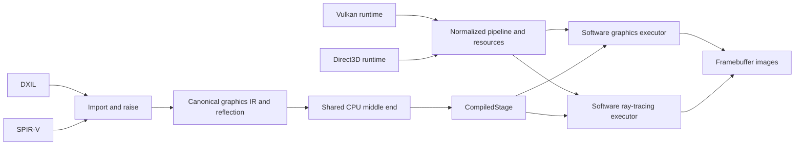
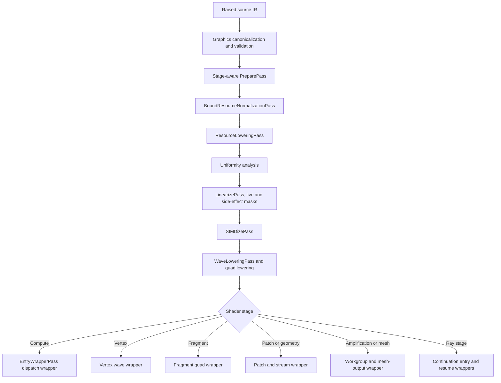

# FeMe Graphics Core and CPU Target Design

## Status

This is an initial design for extending FeMe's core shader representation and
CPU target from compute execution to graphics and ray-tracing workloads. It is a
companion to [Design.md](Design.md) and
[FeMeCPUDesign.md](FeMeCPUDesign.md), and supplies the shared compiler and
execution machinery required by [FeMeVulkanDesign.md](FeMeVulkanDesign.md)
and [FeMeWARPDesign.md](FeMeWARPDesign.md).

The Vulkan and Direct3D designs intentionally leave shader semantics in FeMe
and API semantics in their respective runtimes. This document defines the
missing boundary between them. It covers:

- an API-neutral representation of graphics stages, signatures, and stage
  operations in raised LLVM IR;
- CPU compilation and invocation ABIs for raster, mesh, and ray-tracing work;
- helper-lane, derivative, image, and sampler semantics;
- a reusable software graphics executor built around FeMe-compiled stages;
- artifact reflection, validation, testing, and an incremental implementation
  plan.

FeMe is not graphics-capable today, and the gaps are specific:

- `feme::cpu::PreparePass` selects an entry point with an
  `isComputeEntryPoint` predicate that string-compares the `hlsl.shader`
  function attribute against `"compute"` (closed by roadmap R16: it now
  selects by `feme::ShaderStage`), and `feme::cpu::runPipeline` has a
  single signature, `runPipeline(llvm::Module &, llvm::StringRef EntryPoint,
  unsigned WaveSize)`, with no stage parameter.
- `feme::cpu::EntryWrapperPass` emits only the dispatch wrapper
  `feme_cpu_entry_<name>(const FemeDispatchArgs *)`.
- `FemeDispatchArgs` carries dispatch state plus `void *Reserved[4]` of ABI
  headroom, but no stage input or output storage.
- `FemeDescriptor` describes only `ResourceKind::{Typed, Structured, Raw,
  CBuffer}`. There is no image or sampler descriptor, and `FemeDispatchArgs`
  types `SamplerHeap` as `const FemeDescriptor *`.
- `feme::dxil::MetadataRaisingPass` records the stage — as the `hlsl.shader`
  function attribute and as the environment component of the module's target
  triple — and then erases `!dx.entryPoints`, dropping the signatures needed
  to execute it.
- FeMe's SPIR-V to `llvm` dialect conversion deliberately fails to legalize
  non-builtin `Input` and `Output` variables rather than converting them to a
  pointer nothing can produce.
- `ArtifactInfo` is at `ArtifactAbiVersion = 2` and describes a compute
  dispatch only.

The central claim of this design is deliberately testable: after graphics
stage I/O and side effects are canonicalized, the existing uniformity,
control-flow linearization, SIMDization, and wave-lowering phases remain the
common CPU middle end. Graphics adds stage-aware preparation before those
phases and stage-specific wrappers after them; it does not fork a second
SIMD compiler.

### Prerequisites from the compute CPU target

Graphics does not start from a finished compute target. Several compute gaps
tracked by [Roadmap.md](Roadmap.md) are load-bearing for graphics milestones
and must land first, because the stages that need them cannot be made correct
by anything in this document:

| Compute gap | First graphics milestone that requires it |
|---|---|
| Root constants cover only one narrow shape | G1, for `FemeShaderResources::RootConstants` |
| A barrier inside a surviving branch is diagnosed, not split | G5 and G6, for patch and mesh workgroups |
| Divergent groupshared access is diagnosed | G5 and G6 |
| A `phi` live across a group-sync barrier cannot be spilled | G5 and G6 |

Status: three of these four rows were narrowed by compute work that landed
after this document's first draft, and the table above records the corrected
state. Roadmap step R12 landed `feme::cpu::RootConstantLoweringPass`, so root
constants are implemented — for the default `(b0, space0)` binding, a
non-array `dx.CBuffer`, and a constant row index only — and
`ResourceInfo::RootConstantSize` is genuinely populated; what G1 needs beyond
that is breadth, not a first implementation. Roadmap step R5 split a barrier
inside a *uniform, header-tested loop* and spilled ordinary values live across
a barrier, leaving only a barrier inside a surviving *branch* and a live
`phi`. Divergent groupshared access is unchanged. See feme/docs/Roadmap.md
§1.8.1 for the per-row priority these carry as graphics prerequisites.

G0 through G4 depend only on the compute middle end as it exists once root
constants work. G5 and G6 reuse the compute workgroup and barrier lowering
directly, so they inherit its restrictions rather than working around them.

## Summary

FeMe core should preserve shader-stage interfaces while importing DXIL and
SPIR-V, then canonicalize source-specific stage operations into a small raised
graphics contract. The CPU target should compile each programmable stage into
an immutable `CompiledStage`. A stage owns code and reflection but does not own
Vulkan or Direct3D objects.

The first graphics pipeline supports vertex and fragment shaders around a
tiled software rasterizer. Later milestones add patch tessellation, geometry,
amplification/mesh shading, and ray tracing without changing the ownership
boundary. API runtimes translate their pipeline state, resource views, vertex
input, framebuffer attachments, acceleration structures, and shader records
into FeMe's API-neutral descriptions. FeMe compiles and invokes programmable
stages; the software libraries perform tessellation, primitive processing,
rasterization, output merge, acceleration-structure traversal, and hit
selection.



There are three ownership layers:

1. **API runtimes** validate API objects and commands, translate pipeline
   state, manage synchronization and memory, and report capabilities.
2. **FeMe core and CPU target** preserve and compile shader semantics,
   resource operations, stage interfaces, waves, helper lanes, and
   derivatives.
3. **The software graphics executor** implements API-neutral fixed function
   from normalized immutable descriptions. API-specific corner cases remain
   in the frontend translation rather than leaking Vulkan or Direct3D types
   into this layer.

## Goals

- Compile conventional vertex and fragment shaders from both DXIL and SPIR-V.
- Provide explicit execution models for tessellation and geometry stages,
  amplification/task and mesh stages, and all programmable ray-tracing stages.
- Keep one raised graphics contract after source-format import.
- Reuse the CPU target's existing control-flow and SIMD phases.
- Define stage invocation and resource ABIs that work for JIT and AOT code.
- Preserve all metadata needed to link stages and execute system values,
  interpolation, derivatives, discard, depth, and coverage correctly.
- Share image, sampler, rasterization, and format code between the Vulkan and
  Direct3D software runtimes without sharing either API's object model.
- Share tessellation, mesh-output assembly, acceleration-structure traversal,
  and ray dispatch while retaining API-specific build and binding semantics in
  the frontends.
- Support deterministic reference execution and parallel tiled execution from
  the same compiled stage semantics.
- Fail unsupported stages, operations, formats, and malformed interfaces
  before native code executes.
- Keep one definition of each runtime structure. FeMe has not shipped, so
  graphics should correct the existing compute ABI in place rather than
  growing parallel versioned variants beside it.

## Initial Non-Goals

- Tessellation, geometry, mesh/amplification, and ray tracing in the first
  executing graphics milestone. They are later milestones in this design, not
  permanently out of scope.
- Work graphs, video, or programmable blending.
- Presentation, swapchains, DXGI integration, or window-system integration.
- Claiming Vulkan or Direct3D conformance. Neither runtime may assert
  conformance, and the Vulkan ICD must continue to report a zero
  `VkConformanceVersion`, until the corresponding suites pass.
- Performance parity with llvmpipe, SwiftShader, or WARP.
- A public cross-vendor shader ABI. These interfaces are internal FeMe
  implementation contracts and remain free to change until FeMe ships.
- Translating Vulkan semantics into Direct3D semantics or the reverse.
- Making API-specific pipeline objects part of FeMe core.

## Architectural Boundary

The API runtime must retain responsibility for:

- pipeline-layout/root-signature compatibility;
- descriptor-set or descriptor-heap lifetime and update rules;
- image creation, memory binding, subresource layout, and state transitions;
- render-pass/dynamic-rendering or render-target binding semantics;
- command ordering, barriers, queues, fences, and device loss;
- conversion of API enums and feature choices into normalized descriptions;
- truthful feature, limit, stage, and format reporting.

FeMe core and the CPU target own:

- stage identification and entry-point selection;
- input/output signature reflection and canonical stage operations;
- wave semantics, divergence, helper invocation behavior, derivatives, and
  quad operations;
- resource bounds checks and shader-visible image/sampler behavior;
- patch, mesh-workgroup, ray payload/attribute, and shader-call semantics;
- compiled-stage lifetime, artifact metadata, and invocation contracts.

The reusable graphics executor owns normalized fixed function:

- input assembly and vertex fetch;
- primitive assembly, clipping, viewport transform, and face determination;
- tile binning, sample coverage, and interpolation;
- fragment-quad formation and stage invocation;
- tessellation-coordinate generation and assembly of geometry or mesh outputs
  into the primitive stream;
- early/late depth and stencil, blending, logic operations, and attachment
  stores.

The reusable ray-tracing executor owns normalized acceleration-structure
build/refit helpers, traversal, instance transforms, procedural intersection,
hit selection, and scheduling of ray shader continuations. API runtimes still
own acceleration-structure objects, build-command validation, device-address
rules, shader-table/record interpretation, and synchronization.

The executor must not accept `VkGraphicsPipelineCreateInfo`,
`D3D12_GRAPHICS_PIPELINE_STATE_DESC`, or API handles. Each runtime lowers its
state into immutable FeMe descriptions and rejects combinations it cannot map
without changing semantics.

## Project and Library Boundaries

A tentative layout is:

```text
feme/
  include/feme/Graphics/          Stage and normalized pipeline interfaces
  include/feme/RayTracing/        Ray pipeline and traversal interfaces
  include/feme/Target/CPU/        CPU stage compilation and invocation ABI
  lib/Graphics/                   API-neutral software graphics executor
  lib/RayTracing/                 Acceleration structures and ray executor
  lib/Transforms/Graphics/        Raised graphics canonicalization/validation
  lib/Transforms/CPU/             Stage-aware CPU lowering and wrappers
  runtime/CPU/                    Image, sampler, and format helper bitcode
  test/Transforms/Graphics/       DXIL/SPIR-V convergence and validation tests
  test/Transforms/CPU/Graphics/   CPU lowering and execution tests
  unittests/Graphics/             Raster, interpolation, image, and format tests
  unittests/RayTracing/           Build, traversal, and continuation tests
```

`feme/lib/Transforms/CPU/` and `feme/runtime/CPU/` already exist; the rest are
new. Library names follow the existing convention in which the CMake target
mirrors the directory path (`FeMeTargetCPU`, `FeMeTransformsCPU`), giving
`FeMeGraphics`, `FeMeRayTracing`, and `FeMeTransformsGraphics`.

`FeMeGraphics` may depend on FeMe core, the CPU target, LLVM support, and the
portable threading library. It must not depend on Vulkan-Headers, Windows SDK
or WDK headers, DXGI, or an API loader. `libfeme_vulkan` and the FeMe Direct3D
software adapter depend on `FeMeGraphics`, not the reverse.

The graphics executor and CPU runtime helpers should remain independently
testable. Shader sampling belongs in linked helper bitcode because it executes
inside a compiled stage. Rasterization and output merge belong in the host
graphics library because they schedule stage invocations and operate on
pipeline state.

## Core Graphics Representation

### Stage identity

FeMe should introduce a source-independent `feme::ShaderStage` enumeration
covering:

```text
Vertex, Hull, Domain, Geometry, Fragment, Compute,
Amplification, Mesh, Library,
RayGeneration, Intersection, AnyHit, ClosestHit, Miss, Callable
```

The enumerator names follow Direct3D where the two APIs disagree on spelling
for the pre-raster stages (`Hull`, `Domain`, `Amplification`) and Vulkan where
Direct3D's spelling would be ambiguous in a software rasterizer (`Fragment`,
not `Pixel`). This is a naming choice, not a semantic one, and this document
uses "fragment" throughout; the Direct3D frontend maps `pixel` onto
`ShaderStage::Fragment`. Each enumerator has exactly one spelling in
reflection, diagnostics, and serialized artifacts.

This enumeration is reflection and pipeline data, not a replacement for LLVM
target triples. Stage information already survives import twice: DXIL raising
sets the `hlsl.shader` function attribute, and `feme::Driver` preserves the
recovered stage as the environment component of a
`dxil-unknown-shadermodelX.Y-<stage>` or `spirv-unknown-vulkan-<stage>` triple.
Those triple environments already spell every stage this design needs,
including `pixel`, `mesh`, `amplification`, `raygeneration`, and
`intersection`, and they must keep working unchanged for retargeting.

`feme::ShaderStage` is therefore a *validated projection* of that existing
information, recorded on the entry point as a `feme.shader.stage` attribute so
that stage selection is a checked enumeration rather than a string comparison.
Import derives it from the source-format stage and diagnoses any disagreement
with the module triple's environment. Existing `hlsl.shader` attributes remain
accepted, but CPU stage selection should stop using `isComputeEntryPoint`'s
comparison against `"compute"` as its fundamental model.

One module may contain several entry points. Selection is always explicit when
more than one compatible entry exists. A stage compile rejects a requested
entry whose declared stage does not match `StageCompileOptions::Stage`.

Status: implemented (roadmap R16). `feme::ShaderStage`, the
`feme.shader.stage` attribute, and their accessors live in
`feme/include/feme/Core/ShaderStage.h`; `feme::dxil::MetadataRaisingPass` and
the `spirv` -> `llvm` dialect conversion both record the attribute at import,
and `feme::cpu::PreparePass` takes the stage it selects as a
`feme::ShaderStage` (`feme-opt -feme-cpu-stage=<stage>`) instead of comparing
`hlsl.shader` against `"compute"`. Three details the sketch above leaves
open, decided by that implementation:

- **What "diagnosed against the module triple's environment" means per
  format.** A stage-specific DXIL profile (`cs`, `vs`, ...) fixes the
  environment before any entry point is examined, so an entry whose own
  `ShaderKind` property names a different stage is diagnosed directly. A
  `lib` profile -- and any triple whose environment names no stage at all --
  constrains nothing, since each entry point declares its own stage
  (`feme::isShaderStageCompatibleWithEnvironment`). SPIR-V has no separately
  authored triple to check against: FeMe *derives* the triple from the first
  entry point's execution model, so the same rule turns into a cross-entry
  consistency check, and a `spirv.module` mixing two stages is diagnosed
  rather than converted under a triple that describes only one of them.
- **`hlsl.shader` remains the fallback, not just an accepted duplicate.**
  `feme::getShaderStage` prefers `feme.shader.stage` and falls back to
  `hlsl.shader`, so hand-written IR and modules raised before R16 keep
  selecting. `hlsl.shader` also keeps being *written* at import: LLVM's own
  DirectX and SPIRV backends read the stage from it, so it is a backend
  interface rather than a transitional spelling, and the two attributes
  differ deliberately for one stage (`hlsl.shader="pixel"` alongside
  `feme.shader.stage="fragment"`).
- **`ShaderStage::Library` is an enumerator like any other.** It is the stage
  a `lib` profile's entry point declares when it declares none of its own,
  which keeps every DXIL entry point mapping to exactly one enumerator.

### Signature reflection

Every entry point has an input and output signature. A signature element
records enough information to retain both source identity and executable
linkage:

| Field | Purpose |
|---|---|
| Direction | Input, output, patch input, patch output |
| Location | API-neutral user-varying location, when one exists |
| Semantic | DXIL semantic name and index, when source-visible |
| System value | Position, vertex ID, instance ID, primitive ID, depth, coverage, and peers |
| Component type | Signed, unsigned, float, or boolean plus logical bit width |
| Shape | First component, component count, rows/array count |
| Interpolation | Flat, perspective, no-perspective, centroid, sample |
| Frequency | Per-vertex, per-primitive, per-patch, or per-sample |
| Stream | Geometry output stream, reserved until that stage is implemented |

The core representation should use stable numeric element IDs within one
entry point. Canonical stage operations refer to those IDs; import metadata
maps IDs back to DXIL signature rows/columns or SPIR-V interface variables.
This avoids embedding semantic strings in every operation while retaining them
for Direct3D linkage and diagnostics.

DXIL import must preserve the input, output, patch-constant, and root-signature
information in `!dx.entryPoints` before `MetadataRaisingPass` removes the
source metadata. SPIR-V import must convert non-builtin `Input` and `Output`
variables, `Location`, `Component`, `Index`, interpolation decorations, and
per-primitive/per-patch decorations instead of rejecting them.

Pipeline linking is frontend-sensitive:

- Vulkan primarily links user varyings by location and component.
- Direct3D links compatible signatures by semantic name/index and system
  value rules.

The API runtime performs that linkage and supplies a `StageInterfaceMap` from
producer element IDs to consumer element IDs. FeMe validates type, width,
interpolation, and system-value compatibility but does not impose one API's
linkage rules on the other.

Status: the data model, its verifier, and its serialization round trip are
implemented (roadmap R17). `feme::SignatureElement`/`feme::EntrySignature`
and the enumerations for each field above live in
`feme/include/feme/Core/Signature.h`; `feme::verifySignature` checks the
structural invariants the model relies on (unique element IDs, an in-range
component shape, a supported bit width, a semantic index only alongside a
semantic name, and patch direction/frequency agreeing), and
`feme::serializeSignature`/`feme::parseSignature` round-trip it through a
versioned byte layout, following `feme::cpu::ArtifactInfo`'s
serialize/parse convention in `feme/include/feme/Target/CPU/ResourceInfo.h`.
Import wiring is not yet fully part of this: SPIR-V's `Input`/`Output`
interface variables (R19) do not populate this model yet (DXIL's
`!dx.entryPoints` rows, R18, now do -- see the Status note below), so no
canonical stage operation refers to an `ElementID` this model assigned yet.
`SignatureInterpolationMode`'s enumerators are deliberately DXIL's paired
(base mode, sampling qualifier) kinds rather than the five independent axes
the table above lists, so that R18 could map onto it without re-deriving the
pairing; `SignatureSystemValue` currently only names the vertex/fragment
builtins "Builtins and system values" describes, since later stages' system
values are out of scope until their own milestones.

Status: DXIL's half of import wiring is implemented (roadmap R18).
`feme::dxil::convertEntrySignature`
(`feme/include/feme/Transforms/DXIL/SignatureImport.h`) converts a
`!dx.entryPoints` entry's `Signatures` tuple into a `feme::EntrySignature`,
and `feme::dxil::MetadataRaisingPass` calls it, then attaches the result as
`!feme.signature` function metadata (via `setEntrySignature`), before
erasing `!dx.entryPoints` itself. DXIL numbers its input, output and
patch-constant signatures independently starting at 0, so the converter
renumbers `ElementID` by combined position rather than reusing DXIL's own
per-list IDs, which would otherwise collide across the three lists and
violate `verifySignature`'s uniqueness check. `SignatureInterpolationMode`
and DXIL's `InterpMode` map directly per the pairing above, with DXIL's
`Undefined` (an element interpolation does not apply to) collapsing onto
`Flat` alongside `Constant`; DXIL semantic kinds with no `SignatureSystemValue`
counterpart yet (tessellation, geometry/mesh and shading-rate builtins, and
`Target`, a fragment shader's ordinary render-target output) convert to
`None` rather than being dropped, keeping the row itself but not claiming a
system value FeMe does not model.

A hull shader's patch-constant signature is its own *output*; a domain
shader's is an *input* it consumes. `convertEntrySignature` takes the
entry's `feme::ShaderStage` to decide which, since DXIL's metadata does not
otherwise distinguish the two.

R18 also covers an entry's root signature: DXIL's `EntryRootSigTag` (12)
entry property, a raw serialized byte blob, is preserved verbatim as
`!feme.dxil.rootsignature` function metadata (`setRootSignature`/
`getRootSignature`). FeMe does not parse a root signature's contents yet --
that is roadmap W2, tracked in feme/docs/FeMeWARPDesign.md's "Root
Signatures and Descriptor Heaps" -- so nothing here claims to interpret it,
only to stop it from being lost when `!dx.entryPoints` is erased.

See `feme/lib/Transforms/DXIL/SignatureImport.cpp` and
`test/Transforms/DXIL/dxil-raise-metadata-signature.ll`/
`dxil-raise-metadata-patch-constant.ll`.

### Canonical stage operations

After source raising, graphics behavior should be expressed by a small family
of canonical, typed operations represented as named calls until LLVM has an
appropriate intrinsic:

```text
feme.stage.input.load(element, row, component, vertex)
feme.stage.output.store(element, row, component, value, vertex)
feme.stage.patch.load(...)
feme.stage.patch.store(...)
feme.stage.discard(condition)
feme.stage.demote(condition)
feme.stage.is_helper()
feme.stage.derivative.x.fine(value)
feme.stage.derivative.y.fine(value)
feme.stage.derivative.x.coarse(value)
feme.stage.derivative.y.coarse(value)
feme.stage.quad.read(value, direction)
feme.stage.interpolate.at.centroid(element, component)
feme.stage.interpolate.at.sample(element, component, sample)
feme.stage.interpolate.at.offset(element, component, offset)
feme.stage.emit(stream)
feme.stage.cut(stream)
feme.stage.patch.tessfactor.store(edge-or-inside, index, value)
feme.stage.mesh.set_output_counts(vertices, primitives)
feme.stage.mesh.vertex.store(element, vertex, component, value)
feme.stage.mesh.primitive.store(element, primitive, component, value)
feme.stage.mesh.indices.store(primitive, indices)
feme.stage.mesh.dispatch(groups, payload)
feme.ray.trace(acceleration-structure, flags, mask, ray, payload)
feme.ray.report_hit(t, hit-kind, attributes)
feme.ray.ignore_hit()
feme.ray.accept_hit_and_end_search()
feme.ray.call_shader(index, parameters)
feme.ray.sysval.*(...)
feme.ray.query.*(...)
```

Three families are deliberately separate from `feme.stage.*`:

- `feme.image.*` and `feme.sampler.*` cover the load, store, sample, gather,
  query, and atomic operations described under [Images and
  Samplers](#images-and-samplers). They are not stage operations because they
  are legal in compute as well, and because their lowering target is linked
  helper bitcode rather than a stage wrapper.
- `feme.ray.sysval.*` covers ray system values (world and object ray origin
  and direction, `TMin`, current `T`, hit kind, instance and geometry
  indices, primitive index, ray flags, and the object/world transforms).
  These are invocation state supplied by the traversal executor, not
  signature elements, so they do not appear in the signature model even
  though they are system values in the source languages.
- `feme.stage.interpolate.at.*` is the pull model (HLSL
  `EvaluateAttributeAt*`, SPIR-V `InterpolateAt*`). It is distinct from the
  declared interpolation applied to `feme.stage.input.load`, because it
  re-evaluates an attribute at a caller-chosen location and therefore
  requires the wrapper to retain interpolation planes rather than only
  interpolated values.

`fwidth` and its variants are not canonical operations; they are expressed as
absolute values and a sum of the coarse or fine derivative operations above.
Fragment barycentric access is not yet canonicalized and is not part of the
first advertised capability set.

Only operations required by implemented stages are legal. The initial vertex
path needs input loads and output stores. The initial fragment path adds input
loads, output stores, discard/demote, derivatives, and quad reads. Later
milestones legalize patch, stream-emission, mesh-output, and ray operations only
for their corresponding stages. Validation also enforces uniformity rules such
as mesh output counts being set once per workgroup and payload/attribute sizes
matching the ray pipeline layout.

These calls are not the final CPU ABI. A graphics canonicalization pass
validates constant element IDs and component ranges, rewrites DXIL
`loadInput`/`storeOutput` and SPIR-V interface-variable accesses, and leaves a
source-independent module for target lowering. A non-CPU backend may lower the
same operations differently.

### Builtins and system values

System values use the same signature model when they are stage inputs or
outputs, but the CPU target may lower frequently used scalar values directly
from invocation state. The distinction must remain invisible to shaders.

The first vertex milestone supports:

- vertex ID and instance ID;
- base vertex, base instance, and draw ID where the source language exposes
  them;
- user vertex attributes;
- clip-space position and user varyings as outputs.

The first fragment milestone supports:

- interpolated user varyings and position;
- front-face, primitive ID, sample ID/position, coverage, and helper status;
- color, depth, and coverage outputs;
- discard/demote and derivative operations.

Unsupported system values are diagnosed during stage compilation. They are not
silently replaced with zero because doing so can produce plausible but wrong
images.

### Tessellation and geometry stage model

DXIL hull/domain stages and SPIR-V tessellation-control/evaluation stages map
onto one patch model. A patch record contains input control points, output
control points, per-patch values, outer and inner tessellation levels, and the
normalized tessellator state. Signature frequency distinguishes per-control-
point from per-patch data.

The control stage executes as a workgroup-like patch invocation. Its lanes
write output control points and patch values into bounded patch storage;
barriers synchronize invocations exactly as required by the source model. DXIL
hull shader control-point and patch-constant phases are separate canonical
entry phases even when they originated in one function. SPIR-V tessellation-
control invocations use the same storage and synchronization contract.

After the control stage completes, an API-neutral fixed-function tessellator
uses the normalized domain, partitioning/spacing, winding, point-mode, and
maximum-factor state to generate domain coordinates and primitive connectivity.
The evaluation/domain stage runs over those coordinates and produces ordinary
primitive vertices. The frontend maps Vulkan and Direct3D rules into normalized
state only where their semantics agree; an unmappable combination is rejected
rather than approximated.

Geometry stages consume assembled primitives plus adjacency and run as bounded
invocations with one or more output streams. `emit` snapshots the current
output signature into a stream record and `cut` terminates a strip. The wrapper
checks the declared maximum output count before every emission. Stream output
and rasterization consume the same emitted records but retain their distinct
API ordering and capture rules.

### Amplification/task and mesh stage model

Amplification (Direct3D) and task (SPIR-V) stages are normalized as workgroups
that read resources, use groupshared memory and barriers, construct a bounded
payload, and request a three-dimensional grid of mesh workgroups. The payload
layout is pipeline reflection, not an opaque host pointer. Dispatch requests
are appended to a checked executor-owned queue after the amplification
workgroup completes.

A mesh stage is likewise a workgroup, but its result is a bounded meshlet:

- a uniform vertex and primitive count set once for the workgroup;
- per-vertex outputs, including position;
- per-primitive outputs, including cull and shading-rate data where supported;
- point, line, or triangle connectivity using indices into the emitted vertex
  array.

The CPU wrapper reuses compute's group ID, local invocation, groupshared, wave,
and barrier machinery, then adds mesh-output storage and validation. Counts and
indices are checked against shader declarations and device limits before the
meshlet enters clipping and rasterization. A failed or out-of-range emission
becomes a draw failure; it must not corrupt the executor's primitive queues.

The executor schedules amplification and mesh work breadth-first from bounded
queues. It does not recursively invoke mesh work on worker stacks. This gives
deterministic resource limits and prevents a shader-controlled dispatch tree
from exhausting host stack or address space.

### Ray-tracing stage model

The core stage set explicitly names ray generation, intersection, any-hit,
closest-hit, miss, and callable stages. A ray pipeline also describes hit
groups, payload and attribute layouts, callable parameter layouts, maximum
recursion depth, and shader-record requirements. DXIL library exports and
SPIR-V ray-tracing entry points converge on this reflection after frontend
linking.

Ray operations are not ordinary function calls. `trace`, callable invocation,
intersection reporting, any-hit decisions, and ray queries suspend or resume
shader state across acceleration-structure traversal. FeMe canonicalizes them
as explicit operations and lowers them through a continuation transform. The
initial implementation may use heap-allocated continuation frames and scalar
ray lanes. Native host recursion is not the ABI: recursion depth and frame
bytes must be checked before scheduling further work.

Payloads, hit attributes, callable parameters, and shader-record data are
typed, size-bounded byte layouts recorded in pipeline reflection. Canonical
operations access validated offsets in those layouts. Pointer identity from a
Vulkan shader binding table or Direct3D shader table never enters compiled
shader code.

Inline ray queries use the same traversal core but keep their state in the
calling stage. They require a resumable query object with explicit initialize,
proceed, candidate inspection/confirmation, and committed-hit operations.
Supporting ray queries is therefore separable from supporting a full ray
pipeline and should land with traversal foundations.

## CPU Lowering Pipeline

The CPU pipeline becomes a shared middle end with stage-specific ends:



The pass sequence up to the wrapper is exactly the one
[FeMeCPUDesign.md](FeMeCPUDesign.md) already defines
(`feme-cpu-prepare`, `feme-cpu-normalize-bound-resources`,
`feme-cpu-lower-resources`, `feme-cpu-linearize`, `feme-cpu-simdize`,
`feme-cpu-lower-wave`, `feme-cpu-wrap-entry`). Graphics adds one pass in front
of it and replaces the last one per stage. The reference path substitutes
`feme::cpu::ReferenceLoweringPass` and `feme::cpu::ReferenceEntryWrapperPass`
for the widening and wrapper phases and needs the same stage extension.

`feme::cpu::runPipeline` should take a `StageCompileOptions` value rather than
assuming a compute shader. Its result identifies the stage and exported symbol
plus complete reflection. The existing
`runPipeline(llvm::Module &, llvm::StringRef, unsigned)` signature can remain
as a compute-only compatibility overload.

### Preparation and validation

`PreparePass` should select any supported `feme.shader.stage` entry and retain
stage attributes needed by later passes. A new graphics validation step runs
before mutation and checks:

- the signature exists and every canonical operation references it legally;
- only operations legal for the selected stage are present;
- interpolation and system-value declarations are internally consistent;
- the wave size is one of the sizes `FeMeCPUDesign.md` supports (every power
  of two in `[4, 128]`, all of which are multiples of four, which is what
  fragment quad packing requires);
- required resource kinds, formats, image operations, and sampler operations
  are implemented;
- patch sizes, mesh output limits, and ray payload/attribute/call layouts are
  internally consistent and within configured limits;
- unsupported control-flow side effects are rejected before linearization.

The validation result should be structured reflection used by both JIT and AOT
paths, not only diagnostics recreated independently by each caller.

### Shared middle-end phases

Uniformity analysis, control-flow preparation, linearization, SIMDization, and
ordinary wave operations remain shared for raster and mesh stages. The first
implementation must prove that claim with vertex, fragment, tessellation, and
mesh shaders run through the standalone passes, rather than cloning the passes
into stage variants.

Ray stages use the shared phases between continuation boundaries. The
continuation transform must run before a suspension point is lowered into
executor calls, and resumed regions may then pass through the ordinary SIMD
pipeline. G8 explicitly tests whether packetized ray continuations compose
with the current linearizer; scalar-per-lane continuation execution is the
required correctness fallback if they do not.

The important extension is mask semantics. Compute and vertex execution need
one live-lane mask. Fragment execution needs at least two:

- **live mask**: invocations that execute instructions and contribute values,
  including helper invocations;
- **side-effect mask**: invocations allowed to write resources, atomics,
  fragment outputs, depth, stencil reference, or coverage.

Discard removes a lane from both masks for subsequent operations. Demote keeps
the lane live for derivatives while removing it from the side-effect mask.
Control-flow linearization must update both masks explicitly. Every lowered
side effect consumes the side-effect mask; ordinary arithmetic and derivative
inputs consume the live mask.

This replaces the current implicit assumption that one active mask controls
both execution and stores. A fragment shader is accepted only after verifier
checks prove that no masked-off helper lane can reach an unguarded side effect.

### Vertex wrapper

The vertex wrapper receives a batch of vertex invocations prepared by input
assembly. Lanes map monotonically to invocation records; unlike fragment
waves, no 2D quad meaning is imposed. Each invocation record supplies vertex,
instance, draw, base-vertex, and base-instance IDs plus access to fetched
attributes.

The wrapper:

1. forms waves up to the compiled wave size;
2. creates a live mask for a partial final wave;
3. lowers input loads from structure-of-arrays stage storage;
4. invokes the widened shader body;
5. writes position and varyings to structure-of-arrays output storage.

Structure-of-arrays storage matches SIMD access and allows the rasterizer to
consume only outputs present in the linked interface. The ABI description,
not a C++ struct compiled into the shader, supplies offsets and strides.

Vertex reuse and post-transform caching belong to the graphics executor. The
compiled vertex stage is a pure batch operation with shader-visible resource
side effects; it does not know whether indices were cached.

### Fragment wrapper

The rasterizer supplies fragment work in 2x2 quads. Lanes `4k..4k+3` use the
quad ordering already fixed by `FeMeCPUDesign.md`; a wave contains one or more
whole quads and the wave size is a multiple of four.

Each quad record supplies pixel/sample coordinates, interpolants or their
planes, primitive-facing data, coverage, depth, and initial live and
side-effect masks. The wrapper:

1. materializes interpolated inputs according to the pipeline's
   `StageInterfaceMap`;
2. executes the widened fragment body with helper lanes live;
3. lowers derivatives and quad reads using the fixed lane mapping;
4. collects color, depth, stencil-reference, and coverage outputs;
5. returns final masks and outputs to output merge.

The wrapper does not blend or write attachments. This permits the graphics
executor to select legal early/late depth behavior and preserve ordering
requirements without recompiling shader semantics into every API frontend.

### Derivatives and quad operations

Fine derivatives use the immediate 2x2 quad values. With lanes ordered as
`(0,0), (1,0), (0,1), (1,1)`:

```text
ddx_fine = value[x=1] - value[x=0] on the same row
ddy_fine = value[y=1] - value[y=0] in the same column
```

Coarse derivatives select one horizontal or vertical difference for the quad
according to the source specification. Exact selection is part of the CPU
target contract and tested independently for DXIL and SPIR-V source forms.

Derivatives execute for helper lanes. Values are undefined where the source
specification makes them undefined, such as non-uniform control flow, but the
implementation must not read outside the allocated wave. A partial tile still
provides complete helper quads at framebuffer edges, with attachment writes
suppressed by the side-effect mask.

Quad operations are lowered separately from general wave shuffles. They never
cross a four-lane quad even when the compiled wave is wider than four.

### Patch and geometry wrappers

The patch wrapper allocates one bounded patch record, invokes the control
stage with workgroup barrier semantics, validates tessellation factors, and
hands the record to the tessellator. Evaluation invocations are batched over
generated domain coordinates and use the same structure-of-arrays output
layout as vertex waves. Patch records never outlive the draw work that consumes
them.

The geometry wrapper receives primitive records and owns a bounded stream
builder per invocation. Emission is side-effecting even when no framebuffer
write occurs, so it consumes the current side-effect mask. SIMD lanes reserve
stream ranges with checked prefix sums; deterministic mode uses lane order.

### Amplification and mesh wrappers

These wrappers extend the compute group ABI with immutable payload input and a
bounded output builder. Groupshared memory and barriers use the same lowering
as compute. The amplification wrapper returns dispatch records; the mesh
wrapper returns one meshlet record. No partially written record becomes
visible before every wave in the workgroup completes successfully.

### Ray continuation wrappers

A compiled ray stage exports entry and resume points described by
`StageArtifactInfo`. Each receives a versioned `FemeRayInvocation` containing
ray system values, validated shader-record data, payload/attribute storage, and
a continuation-frame handle owned by the ray executor.

Suspending operations return an executor action rather than calling traversal
recursively. The executor advances traversal or another shader, then schedules
the corresponding resume point. Any-hit outcomes are explicit actions:
continue, ignore the candidate, accept and continue, or accept and terminate.
The executor validates that an action is legal for the current stage and
candidate state.

## Graphics Runtime ABI

### ABI strategy

FeMe has not shipped, so none of these structures are frozen. The rule for
this design is therefore *one definition per concept, corrected in place*,
rather than a compatibility shim: where the compute ABI is wrong for graphics,
fix the compute ABI.

That rule still does not permit reinterpreting `FemeDispatchArgs::Reserved` as
a graphics payload. The objection there is semantic rather than binary: vertex
and fragment state have different invariants from a dispatch, and a field
whose meaning depends on the stage of its caller cannot be validated,
reflected, or fuzzed. Graphics gets its own argument blocks, sharing one
resource block with compute:

```c++
struct FemeShaderResources {
  const FemeDescriptor *ResourceHeap;
  uint32_t ResourceHeapCount;
  const FemeImageDescriptor *ImageHeap;
  uint32_t ImageHeapCount;
  const FemeSamplerDescriptor *SamplerHeap;
  uint32_t SamplerHeapCount;
  const void *RootConstants;
  uint32_t RootConstantSize;
};

struct FemeVertexArgs {
  uint32_t AbiVersion;
  const FemeShaderResources *Resources;
  const FemeStageLayout *InputLayout;
  const void *Inputs;
  const FemeStageLayout *OutputLayout;
  void *Outputs;
  const FemeVertexInvocation *Invocations;
  uint32_t InvocationCount;
};

struct FemeFragmentArgs {
  uint32_t AbiVersion;
  const FemeShaderResources *Resources;
  const FemeStageLayout *InputLayout;
  const void *Inputs;
  const FemeFragmentInvocation *Invocations;
  FemeFragmentResult *Results;
  uint32_t QuadCount;
};

struct FemePatchArgs;
struct FemeMeshArgs;
struct FemeRayInvocation;
struct FemeContinuationFrame;
```

These are shape sketches, not final field layouts. The implementation
milestone settles exact C-compatible definitions, explicit sizes, alignment,
and reserved fields after two end-to-end prototype shaders establish the data
actually required. All pointer ranges are accompanied by validated counts or
layouts; compiled code never follows API object pointers.

#### Relationship to the compute ABI

`FemeShaderResources` is the resource block for every stage, compute included.
Two of today's `FemeDispatchArgs` fields are wrong rather than merely
incomplete:

- `SamplerHeap` is typed `const FemeDescriptor *`, because it was reserved
  before sampling had any representation. It becomes
  `const FemeSamplerDescriptor *`.
- There is no image heap at all. Images do not belong in the buffer-oriented
  `ResourceHeap`, because `FemeDescriptor` cannot express dimensionality, mip
  and array ranges, sample layout, or plane layout.

`FemeDispatchArgs` should therefore be respelled to embed
`FemeShaderResources` alongside its dispatch state, rather than gaining a
second versioned spelling. Image and sampler lowering then emits identical
code in compute and graphics stages, and there is exactly one
resource-binding contract to validate, reflect, and fuzz.

This is a G2 deliverable, not a G3 one: compute shaders that sample images are
required by Vulkan V5 and Direct3D W3, both of which precede any raster stage.
Compiled artifacts produced before that change stop loading, which is
acceptable now and will not be later. The `AbiVersion` fields exist so that a
serialized AOT artifact and the runtime loading it disagree loudly rather than
silently; once FeMe ships, they become the mechanism for real compatibility
rather than a formality.

### Stage layout

`FemeStageLayout` is an immutable, bounds-checked table generated from stage
reflection and pipeline linkage. Each entry gives a stable element ID, scalar
type, component count, storage offset/stride, and interpolation information.
The stage wrapper receives only entries used by the compiled shader.

Layouts use structure-of-arrays storage by default. A runtime may fetch packed
vertex formats directly into this storage, but packed API formats and buffer
strides are not exposed to compiled shaders. This keeps vertex conversion in
input assembly and prevents API format numbering from becoming ABI.

### Compiled stage API

The compute-oriented `JITEngine` should be factored into compilation ownership
shared by all stages:

```c++
namespace feme::cpu {

struct StageCompileOptions {
  ShaderStage Stage = ShaderStage::Compute;
  std::string EntryPoint;
  unsigned WaveSize = 0;
  llvm::CodeGenOptLevel OptLevel = llvm::CodeGenOptLevel::Default;
  bool EnableRobustness = true;
};

class CompiledStage {
public:
  static llvm::Expected<std::unique_ptr<CompiledStage>>
  create(Context Ctx, feme::Module M, const StageCompileOptions &Opts);

  ShaderStage getStage() const;
  const StageArtifactInfo &getArtifactInfo() const;
  llvm::Error invokeGroup(const PreparedDispatch &, std::array<uint32_t, 3>,
                          llvm::MutableArrayRef<uint8_t> GroupShared) const;
  llvm::Error invokeVertices(const PreparedVertexBatch &) const;
  llvm::Error invokeFragments(const PreparedFragmentBatch &) const;
  llvm::Error invokePatches(const PreparedPatchBatch &) const;
  llvm::Error invokeMeshGroups(const PreparedMeshBatch &) const;
  llvm::Expected<RayAction> invokeRay(const PreparedRayInvocation &) const;
  llvm::Expected<RayAction> resumeRay(const PreparedRayContinuation &) const;
};

} // namespace feme::cpu
```

`StageCompileOptions` supersedes `JITOptions` for stage compilation. It drops
`JITOptions::NumThreads`, which is a dispatch scheduling policy rather than a
compilation input and belongs on the caller's execution request; `JITEngine`
keeps it for its own convenience dispatch loop.

This type is the same object that [FeMeVulkanDesign.md](FeMeVulkanDesign.md)
proposes as `CompiledKernel` and that [FeMeWARPDesign.md](FeMeWARPDesign.md)
asks whether Direct3D can share unchanged. This design answers that question:
there is one type. `CompiledKernel` is `CompiledStage` restricted to
`ShaderStage::Compute`, and `invokeGroup` is the per-workgroup entry point
both runtimes already require, so Vulkan V1 and Direct3D W1 can build against
the final name rather than renaming it at G1. Whether the compute-only name
survives as an alias is an implementation detail; the ownership, threading,
and invocation contracts are identical.

Only the invocation matching `getStage()` is legal. The actual implementation
may expose typed stage wrappers if that prevents misuse more cleanly; artifact
ownership and compilation remain shared. Ray entry/resume interfaces are
actions consumed by the traversal executor, not public function pointers that
an API frontend chains itself.

As proposed by the Vulkan design for compute, a compiled stage owns the
`feme::Context`, LLVM context, ORC JIT, and code object required for its entire
lifetime, taking the `Context` by value or holding an ORC `ThreadSafeContext`
rather than borrowing a caller's `Context&`. Invocation is `const`; all
per-draw mutable data lives in prepared batches. Independent worker threads may
invoke one stage concurrently, and each concurrent compile uses its own
`feme::Context`.

`JITEngine` remains a compute convenience wrapper around `CompiledStage` or a
shared lower-level code object. It should not become a monolithic API-aware
graphics device.

### Artifact reflection

`ArtifactInfo` (today at `ArtifactAbiVersion = 2`) describes a compute
dispatch. Rather than leaving it in place and adding a parallel graphics
structure, generalize it into a stage-tagged `StageArtifactInfo` whose current
compute fields are one case. One structure keeps serialization, round-trip
testing, and reflection single-sourced. It contains:

- ABI version, shader stage, wave size, and entry symbol;
- input and output signatures;
- resource, sampler, and root-constant requirements;
- writes-depth, writes-coverage, uses-discard/demote, uses-derivatives, and
  uses-helper-status flags;
- early-depth eligibility and side-effect summary;
- required image operations, sampler features, and formats;
- tessellation domain/partitioning, patch size, geometry stream, and maximum
  emitted-vertex requirements;
- amplification payload and dispatch limits plus mesh topology, maximum vertex
  and primitive counts, and per-primitive output requirements;
- ray payload, attribute, callable-data and continuation-frame sizes, shader
  entry/resume symbols, hit-group membership, recursion requirements, and
  trace/query operation flags.

The serialized artifact uses fixed-width little-endian fields and checked
counted tails, following the conventions `ArtifactInfo` already establishes.
JIT reflection and serialized AOT reflection are built from the same structure
and round-trip in unit tests.

Pipeline creation uses this reflection to reject an incompatible interface or
unsupported fixed-function combination before recording a draw.

## Images and Samplers

### Separate descriptor kinds

Images and samplers must not be squeezed into the existing buffer-oriented
`FemeDescriptor`. Introduce explicit descriptors with FeMe-owned enum values:

```text
FemeImageDescriptor
  base allocation and byte size
  dimensionality and extent
  mip and array ranges
  plane, sample count, and format
  row, slice, mip, and sample layout
  sampled/storage/depth flags

FemeSamplerDescriptor
  min/mag/mip filter
  U/V/W addressing modes
  LOD bias and min/max clamp
  comparison function
  border color
  anisotropy and reduction mode
```

API runtimes resolve views into these descriptors at command execution, just
as they materialize buffer descriptors. A descriptor references validated host
storage and layout metadata, never an API image object.

Combined image samplers remain two logical descriptors paired by lowering.
This matches Vulkan's separable model and Direct3D's distinct resource and
sampler heaps without forcing either frontend to synthesize opaque objects.

### Canonical image operations

Source-specific DXIL and SPIR-V operations lower to canonical calls for:

- integer-coordinate load and storage-image store;
- implicit- and explicit-LOD sample;
- bias, gradients, offsets, projection where required, and comparison sample;
- gather and component selection;
- dimensions, mip count, sample count, and residency/status results;
- format-aware storage image atomics where supported.

Each operation carries typed coordinates and operands, not packed API enums.
The CPU resource lowering pass converts it to a scalar helper with an explicit
lane mask. SIMDization either vectorizes a proven common case or scalarizes
active lanes through the helper. Correct scalar helpers come first; specialized
SIMD sampling is a later optimization.

Implicit LOD uses fragment derivatives of the coordinates. It is rejected in
stages where the source specification does not define it unless an API feature
explicitly supplies semantics. Helper invocations may sample and contribute to
LOD calculation but may not perform storage-image writes or atomics.

### Texture layout and formats

The API-neutral image descriptor supports linear and FeMe-private tiled
layouts. API-visible copy footprints remain frontend responsibilities; the
runtime converts to or from the internal layout as required.

One central format table describes:

- storage size, block dimensions, component encoding, and planes;
- typed load/store conversion;
- filterability and comparison support;
- render-target, blend, depth/stencil, and multisample support;
- sRGB decode on sampling and encode on attachment stores.

Vulkan and Direct3D format maps target this table. A frontend may expose a
format capability only when every operation required by that capability is
implemented. Format aliases with identical storage still retain view
compatibility rules in the API runtime.

All image address arithmetic uses checked operations before forming a host
pointer. Out-of-range shader accesses return the source API's required robust
value or suppress writes; they never access unrelated process memory.

## Software Graphics Executor

### Normalized pipeline

The executor consumes an immutable `GraphicsPipeline` containing:

- the compiled raster stages selected by the pipeline, including either the
  vertex/tessellation/geometry path or amplification/mesh path, plus fragment;
- a linked `StageInterfaceMap`;
- primitive topology and restart behavior;
- rasterization, viewport, scissor, culling, and provoking-vertex state;
- sample count and sample locations;
- depth/stencil and blend state;
- attachment format classes and shader reflection affecting execution.

Dynamic API state is supplied in a `PreparedDraw`. The frontend validates and
normalizes it before execution. Pipeline cache keys include shader bytes,
stage ABI, all normalized state affecting generated code, LLVM version, target
triple, CPU feature policy, wave size, image-helper ABI, and compiler version.
This is the same identity the Vulkan design requires of its pipeline cache
UUID, so a graphics cache key must never be narrower than the compute one.

### Draw flow

The initial indexed and non-indexed triangle path is:

```text
validate draw and materialize descriptors
  -> assemble vertex invocation keys
  -> fetch/convert attributes
  -> run vertex waves, with optional post-transform cache
  -> assemble primitives
  -> clip in homogeneous coordinates
  -> divide, viewport transform, cull, and set up edges/planes
  -> bin primitives into tiles
  -> generate covered 2x2 quads with helpers
  -> interpolate linked inputs
  -> run fragment waves
  -> perform required late tests and output merge
```

The first implementation may perform all vertex work before tile work. Later
streaming and pipelining are scheduling optimizations that must not change
observable ordering.

The conventional tessellation path inserts patch control, fixed tessellation,
domain evaluation, and optional geometry execution between vertex shading and
primitive assembly. The mesh path replaces input assembly and conventional
pre-raster stages with amplification dispatch and meshlet production; emitted
meshlets join the same clipping, rasterization, and fragment path. This shared
primitive-stream boundary is the reason neither path needs a second
rasterizer.

### Acceleration structures and ray execution

The ray-tracing library defines a canonical CPU acceleration structure with
checked headers, nodes, instances, geometry records, and references to vertex,
index, transform, and procedural data. Frontends implement their API's build,
update, compaction, serialization, device-address, and synchronization rules,
then call shared builders or import a validated canonical structure. An API
object or arbitrary device address is never treated as a canonical node
pointer without validation.

The correctness implementation uses a BVH with deterministic build and
traversal modes. Triangle intersection follows the source API's watertightness,
culling, transform, and precision requirements; procedural leaves invoke the
intersection stage, whose reported candidates may invoke any-hit before the
closest committed hit is selected. Instance traversal maintains a bounded
transform/instance stack and exposes the required world/object ray system
values.

A normalized `RayPipeline` contains compiled ray stages, hit-group mappings,
shader-record layouts, recursion and frame limits, and resource reflection.
A `PreparedTrace` snapshots descriptor heaps, root/push data, shader tables,
acceleration structures, dimensions, and dynamic state. Shader-table records
are validated and translated to FeMe record IDs and local argument bytes before
worker execution.

Ray generation invocations may run in parallel. Within one invocation, an
executor-owned work queue advances traversal and continuation actions. A
wavefront scheduler may later regroup compatible continuation points into SIMD
packets, but scalar scheduling is the reference semantics. Observable shader
side effects follow API memory and invocation-order rules; deterministic mode
does not serialize races into defined behavior.

### Tiling and scheduling

Tiles are fixed-size implementation units chosen by benchmark after the
correctness prototype. Each tile task owns disjoint attachment regions unless
the draw uses an explicitly ordered feature. This allows parallel tiles
without locks in the common case.

Draws on one queue remain ordered. Within a draw, vertex batches and tiles may
run concurrently only when resource side effects and API ordering permit it.
The conservative implementation completes vertex work, joins, then processes
tiles. Barriers and draws with unordered shader writes use the same coarse join
model proposed by the Vulkan and Direct3D designs.

Rasterizer-ordered views, fragment shader interlocks, and ordered blending are
scheduler constraints. The existing `FEME_DESCRIPTOR_ROV` bit may participate
in reflection, but setting it does not by itself implement ordering.

### Rasterization correctness

The rasterizer needs focused tests for:

- homogeneous clipping and guard-band boundaries;
- viewport transform, depth range, origin, and winding conventions;
- top-left fill, zero-area primitives, culling, and provoking vertex;
- perspective, no-perspective, flat, centroid, and sample interpolation;
- fixed and programmable sample locations and coverage;
- helper quads at primitive, scissor, and framebuffer edges;
- early/late depth and stencil interactions with discard and shader depth;
- multisample coverage and resolve;
- blend factors, dual-source blending, logic operations, write masks, sRGB,
  integer targets, NaNs, infinities, and signed zero.

API differences are explicit normalized state or frontend choices. They must
not be hidden in conditionals on an API tag inside the rasterizer.

### Early and late tests

`StageArtifactInfo` identifies whether the fragment stage discards, writes
depth or coverage, uses storage side effects, or requires ordering. The
frontend combines that reflection with pipeline state to choose a legal test
schedule.

An early depth pass may reject side-effect invocations before fragment
execution only when the source API permits it. Helper lanes may still be
required for neighboring surviving fragments. When tests must be late, the
fragment stage returns masks and outputs to output merge, which performs depth,
stencil, blend, and attachment writes in specification order.

## Determinism and Reference Execution

The graphics library should provide a deterministic mode that fixes:

- vertex-cache policy or disables the cache;
- tile size, bin order, tile traversal, and worker count;
- wave size and quad packing;
- reduction and blend operation order where the API leaves an implementation
  choice;
- floating-point contraction and reassociation policy;
- initialization of padding, helper inputs, and temporary storage;
- tessellation coordinate order, geometry/mesh emission order, BVH build
  choices, traversal tie breaking, and ray continuation queue order.

Deterministic mode cannot define shader races or API-undefined results. Its
purpose is reproducible tests for behavior the specification defines.

The reference path extends `feme-run --reference` with scalar vertex execution
and one-quad-at-a-time fragment execution. Derivatives require four live scalar
records evaluated in lockstep; a truly single-invocation fragment interpreter
cannot be the reference for them. Reference output merge uses direct scalar
format operations and no tiled fast paths. Tessellation and mesh reference
execution runs one patch or workgroup at a time. Ray reference execution uses
scalar traversal and explicit continuation frames with a deterministic queue.

## Error Handling and Security

Graphics adds untrusted signature metadata, image dimensions and layouts,
vertex/index data, pipeline state, draw counts, mesh output declarations,
acceleration-structure inputs, shader records, recursion depths, and payload
sizes. Implementations must:

- use checked arithmetic for every signature table, vertex fetch, primitive
  count, image footprint, mip offset, tile allocation, and draw product;
- cap shader outputs, varyings, attachments, view dimensions, mip levels,
  samples, viewports, scissors, and generated geometry to reported limits;
- cap tessellation expansion, amplification fanout, meshlet storage, BVH depth,
  ray recursion, continuation bytes, and pending executor actions;
- validate every stage operation before native code generation;
- bounds-check vertex, index, descriptor, image, and attachment access;
- suppress helper-lane side effects even after divergent control flow;
- avoid process symbol lookup from generated code;
- make JIT and helper failures explicit queue/device errors rather than
  continuing with a partial pipeline;
- fuzz signature import, interface linking, stage canonicalization, image
  layout, sampler state, clipping, raster setup, tessellation factors, mesh
  counts, acceleration-structure builds, shader tables, and continuation
  transitions.

A malformed shader or pipeline may fail compilation. It must not produce an
entry point whose argument interpretation disagrees with its reflection.

## Threading and Lifetime Rules

- Each concurrent stage compilation owns an independent `feme::Context`.
- A `CompiledStage` owns all code and context state required by invocation.
- Compiled stages and normalized pipelines are immutable after creation.
- Prepared draws own descriptor snapshots, root data, stage storage, image
  views, and dynamic state until all tile tasks finish.
- Prepared traces own translated shader records, acceleration structures,
  continuation frames, and resource snapshots until every ray action finishes.
- Worker tasks hold strong references to pipeline and attachment storage.
- Tile tasks do not call API frontend code while executor locks are held.
- Pipeline cache entries contain validated descriptions or exact-identity
  native code; untrusted native cache bytes are not loaded initially.
- Destruction joins or cancels all work before releasing JIT code or mapped
  resources.
- Amplification, mesh, and ray queues have explicit count and byte budgets;
  workers never wait while holding a queue lock needed by a child action.

## Implementation Milestones

### Sequencing against the API runtime designs

This document's milestones are prerequisites for milestones in
[FeMeVulkanDesign.md](FeMeVulkanDesign.md) and
[FeMeWARPDesign.md](FeMeWARPDesign.md), not a parallel track. The dependency
graph is:

| Graphics milestone | Unblocks in Vulkan | Unblocks in Direct3D |
|---|---|---|
| G0 core reflection | — | — |
| G1 stage-aware compilation | shared `CompiledStage` for V1 | shared `CompiledStage` for W1 |
| G2 images, samplers, formats | V5 images and sampling | W3 textures and sampling |
| G3 basic triangle pipeline | V6 graphics queue and pipelines | W4 basic graphics |
| G4 depth, stencil, blend, MSAA | V6 | W4 completion |
| G5 tessellation and geometry | V7 | W5 graphics completeness |
| G6 amplification and mesh | V8 | W6 mesh-shader evaluation |
| G7–G8 ray query and pipelines | V8 | W6 ray-tracing evaluation |

Two consequences follow, and both are load-bearing for planning:

- **G1 is not optional for compute.** `CompiledStage` is the compute
  `CompiledKernel` that Vulkan V1 and Direct3D W1 already require. Landing it
  as a stage-parameterized type from the start avoids compiling the compute
  runtime against a name that G1 would then replace.
- **The Vulkan design's compute-only device stops at V5 (images and
  sampling).** Its V6–V8 milestones — the graphics queue family,
  `VkRenderPass`/dynamic rendering, graphics pipeline state, mesh and
  ray-tracing exposure, and the WSI decision — are owned by that document and
  are written there, in its "Graphics, Presentation, and Window-System
  Integration" section. This design supplies only their FeMe-side content.
  The Direct3D design already schedules W4–W6, so it needs no new milestones,
  only the dependency on G2–G8 recorded above.

Neither runtime may advertise a graphics-capable queue, a
`VK_QUEUE_GRAPHICS_BIT` queue family, or a Direct3D feature level implying
raster support until the corresponding G milestone's completion test passes
for every format and state combination it reports. Truthful capability
reporting is a stated requirement of both runtime designs, and partial
graphics support is more damaging than none.

### G0: Core reflection and canonical graphics IR

- Add `feme::ShaderStage`, signature structures, serialization, and verifier.
- Preserve DXIL vertex/fragment signatures during metadata raising.
- Convert SPIR-V graphics interface variables and decorations.
- Canonicalize source input/output operations into `feme.stage.*` calls.
- Round-trip equivalent vertex and fragment interfaces from DXIL and SPIR-V
  into matching core reflection.

Completion test: import one vertex and one fragment shader from each source
format, print canonical signatures and operations, and match the same logical
interface with `FileCheck`.

### G1: Stage-aware CPU compilation

- Generalize entry selection and `runPipeline` with `StageCompileOptions`.
- Introduce `CompiledStage` ownership and `StageArtifactInfo`.
- Add vertex and fragment wrappers with in-memory synthetic stage layouts.
- Extend linearization and side-effect lowering to live/side-effect masks.
- Lower derivatives and quad reads for wave sizes 4 and 8.

Completion test: execute a vertex shader over synthetic attributes and a
fragment shader over synthetic quads, checking outputs, discard, helper-lane
write suppression, and derivatives without a rasterizer.

This is the discriminating milestone for the design's central claim. If either
shader cannot pass through the existing uniformity, linearization, SIMDization,
and wave-lowering phases with localized extensions, revise the shared
middle-end boundary before building fixed function.

### G2: Images, samplers, and format core

- Define the image and sampler descriptors, and fold `FemeShaderResources`
  into `FemeDispatchArgs` so compute and graphics share one resource block.
- Canonicalize the first load/store/sample/query operations from DXIL and
  SPIR-V.
- Implement robust 1D/2D image addressing, mip layout, point and linear
  filtering, explicit/implicit LOD, addressing modes, and comparison sampling.
- Implement the initial color format table and sRGB conversions.
- Add scalar reference helpers and active-lane SIMD lowering.

Completion test: run matched DXIL/SPIR-V fragment shaders over textual image
fixtures and compare sampling at texel centers, edges, mip boundaries,
out-of-range coordinates, and helper lanes.

### G3: Basic triangle pipeline

- Implement normalized pipeline and prepared-draw descriptions.
- Add vertex/index fetch, triangle assembly, clipping, viewport transform,
  culling, tile binning, top-left coverage, and interpolation.
- Run vertex and fragment stages through the graphics executor.
- Support one color attachment, one viewport/scissor, no multisampling, and
  replacement color stores.

Completion test: render off-screen triangles with analytic expected coverage
and interpolants, then compare supported cases against Mesa's lavapipe and
Microsoft's WARP without requiring presentation.

### G4: Depth, stencil, blending, and multisampling

- Add depth/stencil attachments and legal early/late scheduling.
- Add blend/write-mask/logic-op coverage and multiple render targets.
- Add multisample coverage, sample interpolation/shading, and resolves.
- Expand formats and texture operations required by the first advertised API
  graphics profile.
- Add deterministic and parallel tiled schedules.
- Begin capability-scoped raster conformance runs in both API runtimes.

Completion test: pass focused raster and output-merge suites plus the Vulkan
and Direct3D frontend tests for every advertised format/state combination.

### G5: Tessellation and geometry

Prerequisite: the compute barrier restrictions listed under [Prerequisites
from the compute CPU target](#prerequisites-from-the-compute-cpu-target) must
be lifted first. A tessellation-control stage that cannot synchronize inside
control flow cannot express the source model.

- Add geometry, hull, and domain stage signatures and wrappers.
- Implement patch storage, control-stage barriers, normalized tessellator
  state, domain-coordinate generation, and domain/evaluation execution.
- Implement bounded geometry streams, stream output, adjacency, and layered
  rendering.
- Add ordered fragment features only with explicit scheduler enforcement.

Completion test: render isolines, triangles, and quads across partitioning,
winding, point-mode, patch-size, adjacency, and multi-stream cases, comparing
generated coordinates and primitives with analytic references before image
comparison.

### G6: Amplification and mesh shading

- Import and canonicalize DXIL amplification/mesh and SPIR-V task/mesh stages.
- Reuse compute workgroup, groupshared, barrier, and wave lowering with bounded
  payload and mesh-output builders.
- Implement checked amplification dispatch queues, meshlet assembly,
  per-vertex/per-primitive outputs, culling, and topology validation.
- Feed meshlets into the shared clipping and rasterization path.

Completion test: execute amplification fanout and mesh workgroups at several
wave sizes, verify every emitted meshlet structurally, and render equivalent
mesh and conventional pipelines to identical defined output.

### G7: Ray-query and traversal foundations

- Define canonical acceleration structures, deterministic builders, and
  triangle/instance traversal with robust bounds validation.
- Import and canonicalize inline ray-query operations from DXIL and SPIR-V.
- Define ray, payload, attribute, callable-data, shader-record, and continuation
  reflection layouts.
- Execute inline ray queries from compute and fragment shaders using scalar
  traversal, including procedural candidate state where exposed.

Completion test: compare committed/candidate hits for generated triangle and
instance scenes against a brute-force intersector, including malformed builds,
transforms, culling flags, masks, and equal-distance candidates.

### G8: Ray-tracing pipelines

- Compile ray generation, intersection, any-hit, closest-hit, miss, and
  callable stages plus hit-group linkage.
- Implement the continuation transform, entry/resume wrappers, bounded frame
  allocation, shader-record translation, and recursion enforcement.
- Execute procedural intersections, any-hit decisions, nested traces,
  callables, and miss/closest-hit selection through `RayPipeline`.
- Add wavefront packetization only after scalar continuation execution is the
  differential reference.
- Extend the capability-scoped conformance runs begun in G4 to mesh and
  ray-tracing coverage in both API runtimes.

Completion test: trace textual scenes exercising every stage transition and
compare payloads, hit attributes, side effects, and images with brute-force
references and established software implementations where behavior is defined.

Work graphs remain a subsequent design. Their persistent, dynamically composed
node graph and backing-memory model is not equivalent to amplification fanout
or the bounded ray continuation queues defined here.

## Testing Strategy

Testing is layered so shader compilation failures can be separated from
rasterization and API frontend failures.

1. **Core import tests** compare DXIL and SPIR-V canonical signatures,
   operations, interpolation, patch/mesh declarations, ray layouts, and system
   values.
2. **CPU pass tests** run raster, patch, mesh, and ray continuation regions
  through each applicable pass at wave sizes 4, 8, and one native-wide size,
  checking mask, quad, barrier, output-bound, and spill/reload invariants.
3. **Runtime helper tests** exhaust image coordinates, formats, sampling,
   robustness, and helper-lane side effects.
4. **Graphics unit tests** use no shader frontend for clipping, edge rules,
   interpolation, depth/stencil, blending, tessellation, meshlet validation,
   BVH build/traversal, intersection, and layout calculations.
5. **End-to-end executor tests** render textual scenes to textual image
   fixtures through `feme-run` or a new `feme-render` tool. Both require
   extending `feme-run`'s heap YAML schema with an image resource class
   carrying dimensionality, extent, mip and array ranges, format, and layout,
   and adding the new tool to the tool list in [Design.md](Design.md).
6. **Frontend tests** create real Vulkan and Direct3D raster, mesh, and ray
  pipelines and compare defined output with analytic references and
  established software devices.

Required metamorphic tests include:

- identical wave-size-independent output across wave sizes;
- identical deterministic output across worker counts and tile traversal;
- identical linked varyings after irrelevant signature elements are added;
- identical sampling through storage-compatible API format aliases;
- no resource or attachment changes from helper-only quads;
- the same canonical shader behavior from equivalent DXIL and SPIR-V inputs;
- identical primitive streams from equivalent conventional and mesh pipelines;
- identical ray hits between BVH traversal and brute-force intersection;
- identical scalar and packetized ray continuation results.

Image comparisons alone are insufficient for edge rules. Tests inspect exact
coverage masks, barycentrics, interpolated values, depth/stencil transitions,
and packed attachment bytes.

Sanitizer configurations include ASan/UBSan for import and raster code, TSan
for prepared-draw and tile scheduling, forced allocation/JIT failures, and fuzz
targets for every serialized or size-bearing input. Stress configurations cap
tessellation, mesh queues, continuation memory, and ray recursion at small
values to exercise every resource-exhaustion path.

## Alternatives Considered

### Put all graphics code in each API runtime

This preserves a very strict frontend/backend boundary but duplicates image
sampling, formats, clipping, rasterization, interpolation, and output merge.
Those algorithms are not inherently Vulkan or Direct3D behavior once state is
normalized. Keep API validation and semantic differences in the frontends and
share the executor.

### Translate both APIs through an existing graphics IR

NIR or another established renderer IR would bring mature graphics lowering,
but it would make FeMe's DXIL/SPIR-V pipeline depend on another compiler stack
and bypass the raised LLVM IR and CPU SIMD work this project exists to reuse.
Such implementations remain valuable differential references.

### Model every graphics stage as compute

Dispatching fabricated thread groups is superficially convenient but cannot
correctly represent stage interfaces, helper lanes, interpolation, derivatives,
variable primitive production, ray suspension/resumption, or output merge.
Tessellation-control and mesh stages genuinely share workgroup machinery, but
their patch/payload/output contracts remain explicit. Reuse the middle end,
not the compute wrapper or dispatch ABI.

### Implement ray tracing with native host recursion

Direct calls from one JIT shader into traversal and another shader are simple
for a prototype, but make recursion and stack bytes host-dependent, obstruct
wavefront SIMD scheduling, and turn shader-controlled depth into host stack
exhaustion. Explicit continuation frames and executor actions cost more up
front but provide enforceable limits, AOT reflection, deterministic testing,
and a scalar-to-packet optimization path.

### JIT the entire raster pipeline per graphics pipeline

Specializing fixed function can improve performance, but making it the only
execution model greatly expands compile time and cache identity before
correctness exists. Begin with compiled programmable stages and a generic
normalized executor. Add measured specialization for hot format, blend, and
raster paths later.

### Use array-of-structures stage storage

It resembles API vertex buffers and is convenient for scalar code, but creates
gather/scatter traffic for widened stage execution and couples the ABI to
packed input formats. Fetch and convert once into structure-of-arrays storage;
retain scalar reference adapters for tests.

## Open Questions

1. Should canonical `feme.stage.*` operations become LLVM intrinsics, operand
   bundles, or remain verified named calls until their semantics stabilize?
2. Which signature data belongs in function metadata versus a module-level
   table shared by entry points from a shader library?
3. Can live and side-effect masks be added to `LinearizePass` without changing
   compute output, or should the pass expose a stage-selected mask policy?
4. What exact vertex and fragment C ABI minimizes repacking while remaining
   stable for AOT artifacts?
5. Should `CompiledStage` expose typed subclasses, a variant, or one checked
   invocation interface?
6. Which internal image layout gives acceptable sampling and attachment-store
   behavior on x86-64 and AArch64 while keeping copy conversion manageable?
7. Which tile size and vertex-batch size should be defaults, and which belong
   in deterministic pipeline identity?
8. How much fixed-function specialization belongs in generated code before
   pipeline creation latency becomes unsuitable for the API runtimes?
9. Which minimum format, blend, depth/stencil, and multisample matrix is enough
   to advertise the first truthful Vulkan and Direct3D graphics capabilities?
10. Which source-language differences in discard/demote, interpolation,
    derivatives, NaNs, and helper invocations require frontend normalization
    rather than one shared operation?
11. Can DXIL hull phases and SPIR-V tessellation-control execution use one
  patch wrapper without introducing source-specific synchronization paths?
12. Which normalized tessellation rules can be shared exactly, and which API
  differences must remain frontend-selected policies?
13. Should amplification dispatch and mesh output use callbacks, executor-owned
  builders, or a fixed C ABI with caller-provided bounded storage?
14. Where should continuation splitting occur relative to linearization and
  SIMDization, and what state must be spilled for a divergent `trace` call?
15. Which canonical acceleration-structure representation and builder provide
  the required Vulkan and Direct3D traversal guarantees without exposing an
  API's serialized format?
16. Is scalar-per-ray execution sufficient for the first truthful capability,
  or does an advertised profile impose practical packetization requirements?
17. Should `feme::ShaderStage` become the single source of stage truth,
  superseding the `hlsl.shader` attribute and the triple environment, or must
  all three coexist for retargeting?
18. At what point do the runtime ABI and artifact versions stop being
  advisory? They may change freely before FeMe's first release; after it,
  every change in this document's ABI section is a compatibility event.

Questions 1 through 5 are answered by G0 and G1. Question 6 is answered by G2,
which settles the image descriptor layout, and questions 7 and 8 by the
off-screen triangle prototype in G3. Question 9 is answered by working backward
from mandatory capability tables before either runtime advertises graphics.
Question 10 remains covered by paired source-format tests through every
milestone. Questions 11 and 12 are answered by G5, question 13 by G6, and
questions 14 through 16 by the scalar ray-query and continuation prototypes in
G7 and G8. Question 17 is answered by G0. Question 18 is a release-planning
decision rather than a milestone deliverable, and should be settled before the
first runtime advertises any capability to an application.
