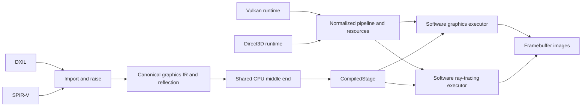
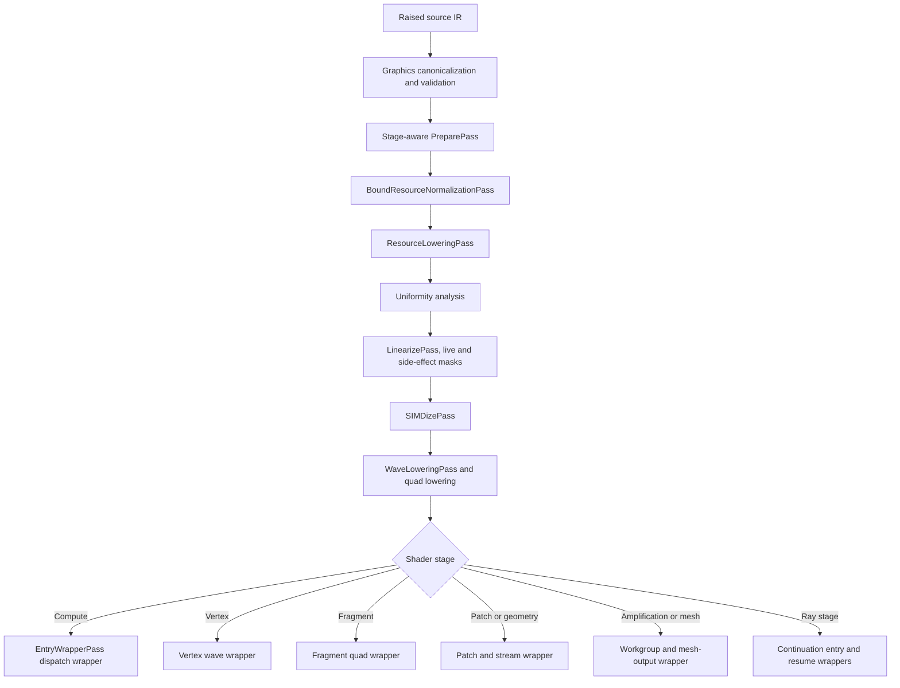

# FeMe Graphics Core and CPU Target Design

## Status

This is an initial design for extending FeMe's core shader representation and
CPU target from compute execution to graphics and ray-tracing workloads. It is a
companion to [Design.md](Design.md) and
[FeMeCPUDesign.md](FeMeCPUDesign.md), and supplies the shared compiler and
execution machinery required by [FeMeVulkanDesign.md](FeMeVulkanDesign.md)
and [FeMeWARPDesign.md](FeMeWARPDesign.md).

The Vulkan and Direct3D designs intentionally leave shader semantics in FeMe
and API semantics in their respective runtimes. This document defines the
missing boundary between them. It covers:

- an API-neutral representation of graphics stages, signatures, and stage
  operations in raised LLVM IR;
- CPU compilation and invocation ABIs for raster, mesh, and ray-tracing work;
- helper-lane, derivative, image, and sampler semantics;
- a reusable software graphics executor built around FeMe-compiled stages;
- artifact reflection, validation, testing, and an incremental implementation
  plan.

FeMe is not graphics-capable today, and the gaps are specific:

- `feme::cpu::PreparePass` selects an entry point with an
  `isComputeEntryPoint` predicate that string-compares the `hlsl.shader`
  function attribute against `"compute"` (closed by roadmap R16: it now
  selects by `feme::ShaderStage`), and `feme::cpu::runPipeline` has a
  single signature, `runPipeline(llvm::Module &, llvm::StringRef EntryPoint,
  unsigned WaveSize)`, with no stage parameter.
- `feme::cpu::EntryWrapperPass` emits only the dispatch wrapper
  `feme_cpu_entry_<name>(const FemeDispatchArgs *)`.
- `FemeDispatchArgs` carries dispatch state plus `void *Reserved[4]` of ABI
  headroom, but no stage input or output storage.
- `FemeDescriptor` describes only `ResourceKind::{Typed, Structured, Raw,
  CBuffer}`. There is no image or sampler descriptor, and `FemeDispatchArgs`
  types `SamplerHeap` as `const FemeDescriptor *`.
- `feme::dxil::MetadataRaisingPass` records the stage — as the `hlsl.shader`
  function attribute and as the environment component of the module's target
  triple — and then erases `!dx.entryPoints`, dropping the signatures needed
  to execute it.
- FeMe's SPIR-V to `llvm` dialect conversion deliberately fails to legalize
  non-builtin `Input` and `Output` variables rather than converting them to a
  pointer nothing can produce.
- `ArtifactInfo` is at `ArtifactAbiVersion = 2` and describes a compute
  dispatch only.

The central claim of this design is deliberately testable: after graphics
stage I/O and side effects are canonicalized, the existing uniformity,
control-flow linearization, SIMDization, and wave-lowering phases remain the
common CPU middle end. Graphics adds stage-aware preparation before those
phases and stage-specific wrappers after them; it does not fork a second
SIMD compiler.

### Prerequisites from the compute CPU target

Graphics does not start from a finished compute target. Several compute gaps
tracked by [Roadmap.md](Roadmap.md) are load-bearing for graphics milestones
and must land first, because the stages that need them cannot be made correct
by anything in this document:

| Compute gap | First graphics milestone that requires it |
|---|---|
| Root constants cover only one narrow shape | G1, for `FemeShaderResources::RootConstants` |
| A barrier inside a surviving branch is diagnosed, not split | G5 and G6, for patch and mesh workgroups |
| Divergent groupshared access is diagnosed | G5 and G6 |
| A `phi` live across a group-sync barrier cannot be spilled | G5 and G6 |

Status: three of these four rows were narrowed by compute work that landed
after this document's first draft, and the table above records the corrected
state. Roadmap step R12 landed `feme::cpu::RootConstantLoweringPass`, so root
constants are implemented — for the default `(b0, space0)` binding, a
non-array `dx.CBuffer`, and a constant row index only — and
`ResourceInfo::RootConstantSize` is genuinely populated; what G1 needs beyond
that is breadth, not a first implementation. Roadmap step R5 split a barrier
inside a *uniform, header-tested loop* and spilled ordinary values live across
a barrier, leaving only a barrier inside a surviving *branch* and a live
`phi`. Divergent groupshared access is unchanged. See feme/docs/Roadmap.md
§1.8.1 for the per-row priority these carry as graphics prerequisites.

G0 through G4 depend only on the compute middle end as it exists once root
constants work. G5 and G6 reuse the compute workgroup and barrier lowering
directly, so they inherit its restrictions rather than working around them.

## Summary

FeMe core should preserve shader-stage interfaces while importing DXIL and
SPIR-V, then canonicalize source-specific stage operations into a small raised
graphics contract. The CPU target should compile each programmable stage into
an immutable `CompiledStage`. A stage owns code and reflection but does not own
Vulkan or Direct3D objects.

The first graphics pipeline supports vertex and fragment shaders around a
tiled software rasterizer. Later milestones add patch tessellation, geometry,
amplification/mesh shading, and ray tracing without changing the ownership
boundary. API runtimes translate their pipeline state, resource views, vertex
input, framebuffer attachments, acceleration structures, and shader records
into FeMe's API-neutral descriptions. FeMe compiles and invokes programmable
stages; the software libraries perform tessellation, primitive processing,
rasterization, output merge, acceleration-structure traversal, and hit
selection.



There are three ownership layers:

1. **API runtimes** validate API objects and commands, translate pipeline
   state, manage synchronization and memory, and report capabilities.
2. **FeMe core and CPU target** preserve and compile shader semantics,
   resource operations, stage interfaces, waves, helper lanes, and
   derivatives.
3. **The software graphics executor** implements API-neutral fixed function
   from normalized immutable descriptions. API-specific corner cases remain
   in the frontend translation rather than leaking Vulkan or Direct3D types
   into this layer.

## Goals

- Compile conventional vertex and fragment shaders from both DXIL and SPIR-V.
- Provide explicit execution models for tessellation and geometry stages,
  amplification/task and mesh stages, and all programmable ray-tracing stages.
- Keep one raised graphics contract after source-format import.
- Reuse the CPU target's existing control-flow and SIMD phases.
- Define stage invocation and resource ABIs that work for JIT and AOT code.
- Preserve all metadata needed to link stages and execute system values,
  interpolation, derivatives, discard, depth, and coverage correctly.
- Share image, sampler, rasterization, and format code between the Vulkan and
  Direct3D software runtimes without sharing either API's object model.
- Share tessellation, mesh-output assembly, acceleration-structure traversal,
  and ray dispatch while retaining API-specific build and binding semantics in
  the frontends.
- Support deterministic reference execution and parallel tiled execution from
  the same compiled stage semantics.
- Fail unsupported stages, operations, formats, and malformed interfaces
  before native code executes.
- Keep one definition of each runtime structure. FeMe has not shipped, so
  graphics should correct the existing compute ABI in place rather than
  growing parallel versioned variants beside it.
- **Be sufficient for API conformance, not only for demos.** Both API
  runtimes now target full conformance for their respective APIs
  ([FeMeVulkanDesign.md](FeMeVulkanDesign.md)'s "Conformance Target": full
  Vulkan 1.4 including graphics and ray tracing;
  [FeMeWARPDesign.md](FeMeWARPDesign.md)'s equivalent Direct3D 12 target).
  Every milestone from G3 onward is therefore on a conformance critical
  path rather than optional: G5's tessellation/geometry stages, G6's
  mesh/task stages and G7/G8's ray query and ray-tracing pipelines each
  back an entire CTS group that reports zero failures today only because
  nothing is advertised. "Correctly `NotSupported`" stops being an
  acceptable end state for anything this document designs.

## Initial Non-Goals

- Tessellation, geometry, mesh/amplification, and ray tracing in the first
  executing graphics milestone. They are later milestones in this design
  (G5–G8), on the conformance critical path per the last Goal above, not
  permanently out of scope.
- Work graphs, video, or programmable blending.
- Presentation, swapchains, DXGI integration, or window-system integration:
  in scope for the API runtimes (Vulkan V8), but never in this core.
- Claiming Vulkan or Direct3D conformance *before it is measured*. Neither
  runtime may assert conformance, and the Vulkan ICD must continue to report
  a zero `VkConformanceVersion`, until the corresponding suites pass. This
  is a sequencing rule, not a scope limit: reaching those suites is the
  declared target of both runtimes.
- Performance parity with llvmpipe, SwiftShader, or WARP.
- A public cross-vendor shader ABI. These interfaces are internal FeMe
  implementation contracts and remain free to change until FeMe ships.
- Translating Vulkan semantics into Direct3D semantics or the reverse.
- Making API-specific pipeline objects part of FeMe core.

## Architectural Boundary

The API runtime must retain responsibility for:

- pipeline-layout/root-signature compatibility;
- descriptor-set or descriptor-heap lifetime and update rules;
- image creation, memory binding, subresource layout, and state transitions;
- render-pass/dynamic-rendering or render-target binding semantics;
- command ordering, barriers, queues, fences, and device loss;
- conversion of API enums and feature choices into normalized descriptions;
- truthful feature, limit, stage, and format reporting.

FeMe core and the CPU target own:

- stage identification and entry-point selection;
- input/output signature reflection and canonical stage operations;
- wave semantics, divergence, helper invocation behavior, derivatives, and
  quad operations;
- resource bounds checks and shader-visible image/sampler behavior;
- patch, mesh-workgroup, ray payload/attribute, and shader-call semantics;
- compiled-stage lifetime, artifact metadata, and invocation contracts.

The reusable graphics executor owns normalized fixed function:

- input assembly and vertex fetch;
- primitive assembly, clipping, viewport transform, and face determination;
- tile binning, sample coverage, and interpolation;
- fragment-quad formation and stage invocation;
- tessellation-coordinate generation and assembly of geometry or mesh outputs
  into the primitive stream;
- early/late depth and stencil, blending, logic operations, and attachment
  stores.

The reusable ray-tracing executor owns normalized acceleration-structure
build/refit helpers, traversal, instance transforms, procedural intersection,
hit selection, and scheduling of ray shader continuations. API runtimes still
own acceleration-structure objects, build-command validation, device-address
rules, shader-table/record interpretation, and synchronization.

The executor must not accept `VkGraphicsPipelineCreateInfo`,
`D3D12_GRAPHICS_PIPELINE_STATE_DESC`, or API handles. Each runtime lowers its
state into immutable FeMe descriptions and rejects combinations it cannot map
without changing semantics.

## Project and Library Boundaries

A tentative layout is:

```text
feme/
  include/feme/Graphics/          Stage and normalized pipeline interfaces
  include/feme/RayTracing/        Ray pipeline and traversal interfaces
  include/feme/Target/CPU/        CPU stage compilation and invocation ABI
  lib/Graphics/                   API-neutral software graphics executor
  lib/RayTracing/                 Acceleration structures and ray executor
  lib/Transforms/Graphics/        Raised graphics canonicalization/validation
  lib/Transforms/CPU/             Stage-aware CPU lowering and wrappers
  runtime/CPU/                    Image, sampler, and format helper bitcode
  test/Transforms/Graphics/       DXIL/SPIR-V convergence and validation tests
  test/Transforms/CPU/Graphics/   CPU lowering and execution tests
  unittests/Graphics/             Raster, interpolation, image, and format tests
  unittests/RayTracing/           Build, traversal, and continuation tests
```

`feme/lib/Transforms/CPU/` and `feme/runtime/CPU/` already exist; the rest are
new. Library names follow the existing convention in which the CMake target
mirrors the directory path (`FeMeTargetCPU`, `FeMeTransformsCPU`), giving
`FeMeGraphics`, `FeMeRayTracing`, and `FeMeTransformsGraphics`.

`FeMeGraphics` may depend on FeMe core, the CPU target, LLVM support, and the
portable threading library. It must not depend on Vulkan-Headers, Windows SDK
or WDK headers, DXGI, or an API loader. `libfeme_vulkan` and the FeMe Direct3D
software adapter depend on `FeMeGraphics`, not the reverse.

The graphics executor and CPU runtime helpers should remain independently
testable. Shader sampling belongs in linked helper bitcode because it executes
inside a compiled stage. Rasterization and output merge belong in the host
graphics library because they schedule stage invocations and operate on
pipeline state.

## Core Graphics Representation

### Stage identity

FeMe should introduce a source-independent `feme::ShaderStage` enumeration
covering:

```text
Vertex, Hull, Domain, Geometry, Fragment, Compute,
Amplification, Mesh, Library,
RayGeneration, Intersection, AnyHit, ClosestHit, Miss, Callable
```

The enumerator names follow Direct3D where the two APIs disagree on spelling
for the pre-raster stages (`Hull`, `Domain`, `Amplification`) and Vulkan where
Direct3D's spelling would be ambiguous in a software rasterizer (`Fragment`,
not `Pixel`). This is a naming choice, not a semantic one, and this document
uses "fragment" throughout; the Direct3D frontend maps `pixel` onto
`ShaderStage::Fragment`. Each enumerator has exactly one spelling in
reflection, diagnostics, and serialized artifacts.

This enumeration is reflection and pipeline data, not a replacement for LLVM
target triples. Stage information already survives import twice: DXIL raising
sets the `hlsl.shader` function attribute, and `feme::Driver` preserves the
recovered stage as the environment component of a
`dxil-unknown-shadermodelX.Y-<stage>` or `spirv-unknown-vulkan-<stage>` triple.
Those triple environments already spell every stage this design needs,
including `pixel`, `mesh`, `amplification`, `raygeneration`, and
`intersection`, and they must keep working unchanged for retargeting.

`feme::ShaderStage` is therefore a *validated projection* of that existing
information, recorded on the entry point as a `feme.shader.stage` attribute so
that stage selection is a checked enumeration rather than a string comparison.
Import derives it from the source-format stage and diagnoses any disagreement
with the module triple's environment. Existing `hlsl.shader` attributes remain
accepted, but CPU stage selection should stop using `isComputeEntryPoint`'s
comparison against `"compute"` as its fundamental model.

One module may contain several entry points. Selection is always explicit when
more than one compatible entry exists. A stage compile rejects a requested
entry whose declared stage does not match `StageCompileOptions::Stage`.

Status: implemented (roadmap R16). `feme::ShaderStage`, the
`feme.shader.stage` attribute, and their accessors live in
`feme/include/feme/Core/ShaderStage.h`; `feme::dxil::MetadataRaisingPass` and
the `spirv` -> `llvm` dialect conversion both record the attribute at import,
and `feme::cpu::PreparePass` takes the stage it selects as a
`feme::ShaderStage` (`feme-opt -feme-cpu-stage=<stage>`) instead of comparing
`hlsl.shader` against `"compute"`. Three details the sketch above leaves
open, decided by that implementation:

- **What "diagnosed against the module triple's environment" means per
  format.** A stage-specific DXIL profile (`cs`, `vs`, ...) fixes the
  environment before any entry point is examined, so an entry whose own
  `ShaderKind` property names a different stage is diagnosed directly. A
  `lib` profile -- and any triple whose environment names no stage at all --
  constrains nothing, since each entry point declares its own stage
  (`feme::isShaderStageCompatibleWithEnvironment`). SPIR-V has no separately
  authored triple to check against: FeMe *derives* the triple from the first
  entry point's execution model, so the same rule turns into a cross-entry
  consistency check, and a `spirv.module` mixing two stages is diagnosed
  rather than converted under a triple that describes only one of them.
- **`hlsl.shader` remains the fallback, not just an accepted duplicate.**
  `feme::getShaderStage` prefers `feme.shader.stage` and falls back to
  `hlsl.shader`, so hand-written IR and modules raised before R16 keep
  selecting. `hlsl.shader` also keeps being *written* at import: LLVM's own
  DirectX and SPIRV backends read the stage from it, so it is a backend
  interface rather than a transitional spelling, and the two attributes
  differ deliberately for one stage (`hlsl.shader="pixel"` alongside
  `feme.shader.stage="fragment"`).
- **`ShaderStage::Library` is an enumerator like any other.** It is the stage
  a `lib` profile's entry point declares when it declares none of its own,
  which keeps every DXIL entry point mapping to exactly one enumerator.

### Signature reflection

Every entry point has an input and output signature. A signature element
records enough information to retain both source identity and executable
linkage:

| Field | Purpose |
|---|---|
| Direction | Input, output, patch input, patch output |
| Location | API-neutral user-varying location, when one exists |
| Semantic | DXIL semantic name and index, when source-visible |
| System value | Position, vertex ID, instance ID, primitive ID, depth, coverage, and peers |
| Component type | Signed, unsigned, float, or boolean plus logical bit width |
| Shape | First component, component count, rows/array count |
| Interpolation | Flat, perspective, no-perspective, centroid, sample |
| Frequency | Per-vertex, per-primitive, per-patch, or per-sample |
| Stream | Geometry output stream, reserved until that stage is implemented |

The core representation should use stable numeric element IDs within one
entry point. Canonical stage operations refer to those IDs; import metadata
maps IDs back to DXIL signature rows/columns or SPIR-V interface variables.
This avoids embedding semantic strings in every operation while retaining them
for Direct3D linkage and diagnostics.

DXIL import must preserve the input, output, patch-constant, and root-signature
information in `!dx.entryPoints` before `MetadataRaisingPass` removes the
source metadata. SPIR-V import must convert non-builtin `Input` and `Output`
variables, `Location`, `Component`, `Index`, interpolation decorations, and
per-primitive/per-patch decorations instead of rejecting them.

Pipeline linking is frontend-sensitive:

- Vulkan primarily links user varyings by location and component.
- Direct3D links compatible signatures by semantic name/index and system
  value rules.

The API runtime performs that linkage and supplies a `StageInterfaceMap` from
producer element IDs to consumer element IDs. FeMe validates type, width,
interpolation, and system-value compatibility but does not impose one API's
linkage rules on the other.

Status: the data model, its verifier, and its serialization round trip are
implemented (roadmap R17). `feme::SignatureElement`/`feme::EntrySignature`
and the enumerations for each field above live in
`feme/include/feme/Core/Signature.h`; `feme::verifySignature` checks the
structural invariants the model relies on (unique element IDs, an in-range
component shape, a supported bit width, a semantic index only alongside a
semantic name, and patch direction/frequency agreeing), and
`feme::serializeSignature`/`feme::parseSignature` round-trip it through a
versioned byte layout, following `feme::cpu::ArtifactInfo`'s
serialize/parse convention in `feme/include/feme/Target/CPU/ResourceInfo.h`.
Import wiring is not yet fully part of this: SPIR-V's `Input`/`Output`
interface variables (R19) do not populate this model yet -- they convert
instead of failing to legalize (see the Status note below), but nothing yet
feeds them into `feme::EntrySignature` (DXIL's `!dx.entryPoints` rows, R18,
already do -- see the next Status note), so no canonical stage operation
refers to an `ElementID` this model assigned yet.
`SignatureInterpolationMode`'s enumerators are deliberately DXIL's paired
(base mode, sampling qualifier) kinds rather than the five independent axes
the table above lists, so that R18 could map onto it without re-deriving the
pairing; `SignatureSystemValue` currently only names the vertex/fragment
builtins "Builtins and system values" describes, since later stages' system
values are out of scope until their own milestones.

Status: DXIL's half of import wiring is implemented (roadmap R18).
`feme::dxil::convertEntrySignature`
(`feme/include/feme/Transforms/DXIL/SignatureImport.h`) converts a
`!dx.entryPoints` entry's `Signatures` tuple into a `feme::EntrySignature`,
and `feme::dxil::MetadataRaisingPass` calls it, then attaches the result as
`!feme.signature` function metadata (via `setEntrySignature`), before
erasing `!dx.entryPoints` itself. DXIL numbers its input, output and
patch-constant signatures independently starting at 0, so the converter
renumbers `ElementID` by combined position rather than reusing DXIL's own
per-list IDs, which would otherwise collide across the three lists and
violate `verifySignature`'s uniqueness check. `SignatureInterpolationMode`
and DXIL's `InterpMode` map directly per the pairing above, with DXIL's
`Undefined` (an element interpolation does not apply to) collapsing onto
`Flat` alongside `Constant`; DXIL semantic kinds with no `SignatureSystemValue`
counterpart yet (tessellation, geometry/mesh and shading-rate builtins, and
`Target`, a fragment shader's ordinary render-target output) convert to
`None` rather than being dropped, keeping the row itself but not claiming a
system value FeMe does not model.

A hull shader's patch-constant signature is its own *output*; a domain
shader's is an *input* it consumes. `convertEntrySignature` takes the
entry's `feme::ShaderStage` to decide which, since DXIL's metadata does not
otherwise distinguish the two.

R18 also covers an entry's root signature: DXIL's `EntryRootSigTag` (12)
entry property, a raw serialized byte blob, is preserved verbatim as
`!feme.dxil.rootsignature` function metadata (`setRootSignature`/
`getRootSignature`). FeMe does not parse a root signature's contents yet --
that is roadmap W2, tracked in feme/docs/FeMeWARPDesign.md's "Root
Signatures and Descriptor Heaps" -- so nothing here claims to interpret it,
only to stop it from being lost when `!dx.entryPoints` is erased.

See `feme/lib/Transforms/DXIL/SignatureImport.cpp` and
`test/Transforms/DXIL/dxil-raise-metadata-signature.ll`/
`dxil-raise-metadata-patch-constant.ll`.

Status: SPIR-V's half of import is implemented differently (roadmap R19),
scoped to what the roadmap entry itself asks for -- converting non-builtin
`Input`/`Output` variables instead of failing to legalize, not (yet)
populating `feme::EntrySignature`. `feme::spirv::populateSPIRVToLLVMTargetTypeConversions`
and the `StageIOGlobalVariablePattern`/`StageIOAddressOfPattern` pair
(`feme/lib/Conversion/SPIRVToLLVM/SPIRVToLLVMPatterns.cpp`) convert a
non-builtin `Input`/`Output` `spirv.GlobalVariable` to an ordinary
`llvm.mlir.global` in the address space (7/8) LLVM's SPIRV backend expects
that storage class to use, recording its `Location`/`Component`/`Index` and
boolean interpolation/`Patch`/`PerPrimitiveEXT` decorations as a
`feme.spirv.decorations` MLIR attribute
(`feme::spirv::getStageIODecorationsAttrName`); once
`mlir::translateModuleToLLVMIR` has produced a genuine `llvm::Module`,
`feme::spirv::attachStageIODecorations` (called from
`feme::SPIRVToLLVMTranslator::translate`, `feme/lib/Translate/SPIRV/
SPIRVToLLVMTranslator.cpp`) turns that attribute into real
`!spirv.Decorations` metadata on the matching `llvm::GlobalVariable` -- the
same shape `buildOpSpirvDecorations`
(`llvm/lib/Target/SPIRV/SPIRVUtils.cpp`) reads `OpDecorate`s back from (see
`llvm/test/CodeGen/SPIRV/linkage/hidden-interface-vars.ll`), verified
end to end through `llc`+`spirv-val`. `Input` collapses `spirv.mlir.addressof`
and the `spirv.Load` reading it into a single `llvm.load` at the
address-of site (mirroring how a builtin `Input` variable's `llvm.spv.*`
intrinsic result already works, since the two share one pointer-type
conversion rule and cannot be told apart by type alone); `Output` converts
to an ordinary pointer instead, there being no builtin `Output` variable to
collide with. Feeding these variables' element IDs into
`feme::EntrySignature` itself is left to R20 alongside the `feme.stage.*`
operation family below, which is what will actually consume them; MLIR's own
SPIR-V *deserializer* also does not yet parse `Component`/`Centroid`/
`Sample`/`PerPrimitiveEXT` from a real binary (an upstream MLIR gap this
conversion's own textual-IR-driven tests do not depend on). See
`feme/lib/Conversion/SPIRVToLLVM/SPIRVToLLVMPatterns.cpp`,
`feme/lib/Conversion/SPIRVToLLVM/StageIODecorations.cpp`, and
`test/Conversion/SPIRVToLLVM/spirv-to-llvm-stage-io.mlir`/
`test/Translate/SPIRV/spirv-to-llvmir-stage-io.mlir`.

**Deviation (roadmap H2a)**: neither R19 nor R20 covers a *builtin
interface block* -- a struct-typed `Input`/`Output` variable whose members
each carry their own `BuiltIn`/`Location` decoration via SPIR-V's
`OpMemberDecorate`, the shape glslang always emits `gl_Position`/
`gl_PointSize`/`gl_ClipDistance`/`gl_CullDistance` as (the implicit
`gl_PerVertex` block), rather than as standalone builtin variables the way
`buildStageIODecorationsAttr`/`BuiltInGlobalVariablePattern` both assume.
Neither pattern recognizes it: it is not a "non-builtin `Input`/`Output`
variable" (`StageIOGlobalVariablePattern`'s own scope), since its members
are builtins, and it is not a single "builtin variable" either
(`BuiltInGlobalVariablePattern`'s own scope, which maps one `BuiltIn`
decoration to one `llvm.spv.*` intrinsic call site, not a memory-backed
struct). The block still converts to an ordinary `llvm.mlir.global` via
`StageIOGlobalVariablePattern` (its per-variable `getBuiltInMapping` check
finds nothing to reject it on), but with no `!spirv.Decorations` metadata
at all, since `buildStageIODecorationsAttr` never looks at the struct
type's own per-member decorations. `feme::graphics::CanonicalizeStagePass`
requires that metadata to recognize a stage-IO global (see "Canonical
stage operations" below), so a `gl_Position` write is left completely
un-legalized -- confirmed against a real `dEQP-VK.multiview` run (454 of
838 cases, effectively every vertex shader in the suite; see "Roadmap H2a:
measured impact" in VulkanCTSReport.md). Tracked as roadmap rows H2c (the
SPIR-V import side: preserving per-member decorations) and H2d (the
`CanonicalizeStage.cpp` side: one `SignatureElement` per block member).

**Roadmap H2c**: `buildStageIODecorationsAttr`'s whole-variable read is
still exactly as narrow as the paragraph above describes -- a builtin
interface block still has no whole-variable `BuiltIn`/`Location` attribute
of its own for it to find. What changed is a second, parallel read:
`StageIOGlobalVariablePattern` now also checks whether the pointee is a
`mlir::spirv::StructType`, and if so walks its members'
`OpMemberDecorate`d decorations (`StructType::getMemberDecorations`,
already used by this same file's `isBufferBlockWritable` for a
storage-buffer block's `NonWritable` member decoration), recognizing the
same `BuiltIn`/`Location`/`Component`/`Index`/interpolation set the
whole-variable attribute does. The result is a second `llvm.mlir.global`
attribute, `feme.spirv.member.decorations` -- an `ArrayAttr` of
`(memberIndex, tuples)` entries, `tuples` in the same `(i32 decoration, i32
arg...)` shape the whole-variable attribute already uses -- which
`feme::spirv::attachStageIOMemberDecorations` turns into
`feme.spirv.MemberDecorations` metadata on the real `llvm::GlobalVariable`
once translation produces one. Unlike `!spirv.Decorations`, this metadata
kind has no real SPIR-V backend meaning: `OpMemberDecorate` decorates a
*type*, not a global variable, so there is nothing for LLVM's SPIRV
backend to attach a per-member decoration to at this granularity -- the
channel exists purely for `CanonicalizeStagePass` (roadmap H2d, not yet
implemented) to read. Since H2d has not landed, `isSPIRVStageIOGlobal`
still recognizes a stage-IO global purely by `!spirv.Decorations`'
presence, which a builtin interface block's global still does not carry
(only its new member-decorations metadata does) -- so `gl_Position`'s
write through `gl_PerVertex` is, as before, left completely un-legalized,
and the `dEQP-VK.multiview` numbers this row measured are unchanged from
H2's own baseline (0 pass / 499 fail / 339 not-supported); see "Roadmap
H2c: measured impact" in VulkanCTSReport.md.

**Roadmap H2d**: `isSPIRVStageIOGlobal` now also recognizes a global
carrying only `feme.spirv.MemberDecorations` (no whole-variable
`!spirv.Decorations`) -- the shape H2c's own builtin-interface-block
global produces -- and `canonicalizeSPIRVStage` decomposes it into one
`SignatureElement` per struct member, each keeping its own `BuiltIn`/
system-value identity (`gl_Position` -> `SignatureSystemValue::Position`;
`gl_PointSize`/`gl_ClipDistance`/`gl_CullDistance` -> `None`, since none has
a real ABI-field consumer downstream, the same "unmodeled system value"
treatment an unrecognized DXIL semantic already gets). A real
`dEQP-VK.multiview` run found the first landing's own model of "how a
block is loaded/stored" wrong: it assumed a single whole-aggregate load/
store (mirroring C8a's matrix/aggregate case), but real SPIR-V-derived IR
addresses each member -- and even each individual component of
`gl_Position` -- with its own scalar load/store instead, either a bare
global (SPIR-V's own offset-0 member access, which LLVM's constant-
`getelementptr` folding erases entirely) or a `getelementptr (i8, ptr
@block, i64 ByteOffset)` `ConstantExpr` (LLVM's own canonical byte-offset
form, not a struct-member-indexed `getelementptr`). `resolveStageIOAccess`/
`getStageIOBaseAndOffset` (`Value::stripAndAccumulateConstantOffsets` plus
the block's own `StructLayout`) resolve either shape back to the member,
row and component `loadStageIOValue`/`storeStageIOValue`'s existing
recursion needs. With that fix, `dEQP-VK.multiview` goes from 0/838 passing
to 78/838; see "Roadmap H2d: measured impact" in VulkanCTSReport.md for
the full breakdown of what remains (three already-tracked buckets, three
new ones spun off as roadmap rows H2e/H2f/H2g).

**Roadmap H2e**: unlike DXIL's `loadInput`/`storeOutput` split (where an
output is genuinely write-only), SPIR-V's `Output` storage class permits
reading back a value already written earlier in the same invocation --
`input_instance`'s own vertex shader does exactly this
(`gl_Position.y += 1.0f;` guarded by an `if`, GLSL's own compound-assignment
sugar for a read-modify-write). `feme.stage.input.load`/`.output.store`'s
Input-vs-Output dichotomy has no representation for "read back what this
invocation already wrote", so the read-back was lowered into a
wrong-direction `feme.stage.input.load`, correctly diagnosed (and
rejected) by `ValidateStagePass`. `canonicalizeSPIRVStage` now routes
every `Output`-direction leaf scalar (one per (`ElementID`, `Row`,
`Component`) -- the same granularity `loadStageIOValue`/
`storeStageIOValue`'s existing recursion already decomposes every access
to) through its own shadow `AllocaInst` (`ShadowValueMap`) instead: every
rewritten store also writes through to its own shadow alloca, and a
read-back load is redirected to read from it rather than emitting a
`feme.stage.input.load` at all. Once every instruction in the function has
been rewritten, `llvm::PromoteMemToReg` converts every shadow alloca to
SSA form, resolving each read-back to the dominance-correct reaching
store -- inserting a `phi` for a real control-flow join, exactly the SSA
construction a compiler's own `mem2reg` pass performs for a local
variable, which a linear "last stored value" scan could not do correctly
in general (a read-back on one control-flow path is not necessarily
dominated by a write on another). A real `dEQP-VK.multiview` re-run
confirms the root cause is gone (the `'... refers to element N with the
wrong direction'` diagnostic no longer occurs anywhere in the group), but
does not turn `input_instance` green on its own: all 24 cases now build
and run to completion, landing in the same `Fail (Fail)` image-comparison
bucket roadmap H2g already tracks, rather than failing earlier at
`vkCreateGraphicsPipelines`. See "Roadmap H2e: measured impact" in
VulkanCTSReport.md for the full breakdown.

### Canonical stage operations

After source raising, graphics behavior should be expressed by a small family
of canonical, typed operations represented as named calls until LLVM has an
appropriate intrinsic:

```text
feme.stage.input.load(element, row, component, vertex)
feme.stage.output.store(element, row, component, value, vertex)
feme.stage.patch.load(...)
feme.stage.patch.store(...)
feme.stage.discard(condition)
feme.stage.demote(condition)
feme.stage.is_helper()
feme.stage.derivative.x.fine(value)
feme.stage.derivative.y.fine(value)
feme.stage.derivative.x.coarse(value)
feme.stage.derivative.y.coarse(value)
feme.stage.quad.read(value, direction)
feme.stage.interpolate.at.centroid(element, component)
feme.stage.interpolate.at.sample(element, component, sample)
feme.stage.interpolate.at.offset(element, component, offset)
feme.stage.emit(stream)
feme.stage.cut(stream)
feme.stage.patch.tessfactor.store(edge-or-inside, index, value)
feme.stage.mesh.set_output_counts(vertices, primitives)
feme.stage.mesh.vertex.store(element, vertex, component, value)
feme.stage.mesh.primitive.store(element, primitive, component, value)
feme.stage.mesh.indices.store(primitive, indices)
feme.stage.mesh.dispatch(groups, payload)
feme.ray.trace(acceleration-structure, flags, mask, ray, payload)
feme.ray.report_hit(t, hit-kind, attributes)
feme.ray.ignore_hit()
feme.ray.accept_hit_and_end_search()
feme.ray.call_shader(index, parameters)
feme.ray.sysval.*(...)
feme.ray.query.*(...)
```

Three families are deliberately separate from `feme.stage.*`:

- `feme.image.*` and `feme.sampler.*` cover the load, store, sample, gather,
  query, and atomic operations described under [Images and
  Samplers](#images-and-samplers). They are not stage operations because they
  are legal in compute as well, and because their lowering target is linked
  helper bitcode rather than a stage wrapper.
- `feme.ray.sysval.*` covers ray system values (world and object ray origin
  and direction, `TMin`, current `T`, hit kind, instance and geometry
  indices, primitive index, ray flags, and the object/world transforms).
  These are invocation state supplied by the traversal executor, not
  signature elements, so they do not appear in the signature model even
  though they are system values in the source languages.
- `feme.stage.interpolate.at.*` is the pull model (HLSL
  `EvaluateAttributeAt*`, SPIR-V `InterpolateAt*`). It is distinct from the
  declared interpolation applied to `feme.stage.input.load`, because it
  re-evaluates an attribute at a caller-chosen location and therefore
  requires the wrapper to retain interpolation planes rather than only
  interpolated values.

`fwidth` and its variants are not canonical operations; they are expressed as
absolute values and a sum of the coarse or fine derivative operations above.
Fragment barycentric access is not yet canonicalized and is not part of the
first advertised capability set.

Only operations required by implemented stages are legal. The initial vertex
path needs input loads and output stores. The initial fragment path adds input
loads, output stores, discard/demote, derivatives, and quad reads. Later
milestones legalize patch, stream-emission, mesh-output, and ray operations only
for their corresponding stages. Validation also enforces uniformity rules such
as mesh output counts being set once per workgroup and payload/attribute sizes
matching the ray pipeline layout.

These calls are not the final CPU ABI. A graphics canonicalization pass
validates constant element IDs and component ranges, rewrites DXIL
`loadInput`/`storeOutput` and SPIR-V interface-variable accesses, and leaves a
source-independent module for target lowering. A non-CPU backend may lower the
same operations differently.

Status: implemented for the vertex and fragment stages (roadmap R20,
**completing G0**). `feme::StageOpKind`/`getOrInsertStageOp`/the
`createStage*` builders and matchers (`feme/include/feme/Core/StageOps.h`)
declare the `feme.stage.*` family as named calls, mangled per overload the
same way DXIL's own `dx.op.*` calling convention is (e.g.
`feme.stage.input.load.f32`). A new `FeMeTransformsGraphics` library
(`feme/lib/Transforms/Graphics`) provides the canonicalization and
validation passes this section calls for:

- `feme::graphics::CanonicalizeStagePass` (`feme-graphics-canonicalize-stage`)
  rewrites a vertex/fragment entry point's DXIL- and SPIR-V-derived stage IR
  into `feme.stage.*`. On the DXIL side, it raises `loadInput`(4)/
  `storeOutput`(5) directly (neither has an LLVM intrinsic form for
  `feme::dxil::OpRaisingPass` to raise through, since both need the entry's
  `!feme.signature` to resolve their signature-ID operand to an `ElementID`
  -- context that context-free pass does not have), along with
  `IsHelperLane`(221) and the pull-model interpolation family
  (`EvalCentroid`/`EvalSampleIndex`/`EvalSnapped`, opcodes 89/88/87); it also
  renames the `llvm.dx.discard`/derivative/quad-read intrinsic calls
  `OpRaisingPass` already produces into their `feme.stage.*` peers. On the
  SPIR-V side, it rewrites a non-builtin `Input`/`Output` stage-IO global's
  load/store (address space 7/8 with `!spirv.Decorations` metadata, from
  roadmap R19) into `feme.stage.input.load`/`output.store`, building and
  attaching the entry's `feme::EntrySignature` from those decorations along
  the way -- the piece R19's own status note explicitly left to this
  milestone -- and renames the analogous `llvm.spv.discard`/derivative/
  quad-read intrinsics the same way (mapping the unconditional
  `llvm.spv.discard` onto a constant-true `feme.stage.discard`, and SPIR-V's
  implicit-precision `llvm.spv.ddx`/`.ddy` conservatively onto the *fine*
  derivative variant, since DXIL has no implicit-precision op to pair it
  with). Roadmap E11 added `llvm.spv.demote.to.helper.invocation`
  (SPIR-V's `OpDemoteToHelperInvocation`, which needed a new MLIR
  `spirv.DemoteToHelperInvocation` op upstream before it could even be
  imported at all) to this same renaming, onto a constant-true
  `feme.stage.demote` -- unconditional exactly like `discard`, but not a
  terminator, matching the op's own non-terminating semantics. Roadmap E12
  similarly needed a new MLIR `spirv.TerminateInvocation` op for SPIR-V's
  `OpTerminateInvocation`, but that op's own `SPIRVToLLVMPatterns.cpp`
  conversion (not this pass) already lowers it directly to the same
  `llvm.spv.discard` call `OpKill` uses, followed by an explicit
  `llvm.return` (`OpTerminateInvocation`, unlike `OpDemoteToHelperInvocation`,
  is a true terminator), so this pass needs no changes of its own: the
  existing `llvm.spv.discard` renaming above already covers it. Roadmap C8
  taught the SPIR-V-side rewrite a matrix/array-typed (`ArrayType` of
  column vectors, the shape SPIRVToLLVM's `spirv.MatrixType` conversion
  produces, see SPIRVToLLVMPatterns.cpp) or single-member-struct-wrapped
  variant (glslang's own shape for a `varying`-block *member*, even a
  scalar/vector/matrix one -- e.g. a `mat4x2` member becomes the LLVM type
  `{ [4 x <2 x float>] }`): the struct wrapper is peeled first
  (`peelSingleMemberStruct`), and the resulting scalar/vector/array value
  is recursively decomposed into one `feme.stage.input.load`/
  `output.store` per (row, component), the same shape a plain vector
  already used, one level further out (`loadStageIOValue`/
  `storeStageIOValue`). The signature element gets `RowCount` set to the
  matrix's column count (1 for a plain scalar/vector, unchanged from
  before).
- `feme::graphics::ValidateStagePass` (`feme-graphics-validate-stage`)
  diagnoses (through `LLVMContext::emitError`, never rewrites) a
  `feme.stage.*` call whose element/row/component operands are non-constant,
  refer to an unknown element, use the wrong `SignatureDirection`, or fall
  outside the element's declared row/component range, and any stage
  operation that is not legal for the entry's declared stage (e.g. `discard`
  in a vertex shader).

Both passes are registered in `feme-opt`; see
`test/Transforms/Graphics/*.ll` and
`unittests/Transforms/Graphics/{CanonicalizeStage,ValidateStage}Test.cpp`.
Left for later milestones, matching "only operations required by
implemented stages are legal" above: the patch, stream-emission, mesh-output
and ray operation families; SPIR-V's `demote`/`is_helper` (there is no
upstream `llvm.spv.*` intrinsic to raise from yet, unlike DXIL's `Discard`/
`IsHelperLane`); arrays/structs of stage-IO variables (the same limitation
R19's SPIR-V conversion already has); and mesh output-count/ray
payload-size uniformity validation, which needs those later operation
families to exist first.

Roadmap H4a extended `CanonicalizeStagePass` from the vertex/fragment-only
`run` filter above to also reflect `TessellationControl`/
`TessellationEvaluation` entry points, closing R19's own tessellation gap
the same way this milestone closed it for vertex/fragment. A domain
(tessellation-evaluation) entry point needs no new mechanism -- it is
already a single FeMe stage, `DomainWrapperPass`'s -- but a SPIR-V
tessellation-*control* entry point is not: it is one SPIR-V function that
writes both its own per-vertex outputs and the patch-constant
`TessLevelOuter`/`TessLevelInner` factors, typically separated by one
`OpControlBarrier` (imported as
`llvm.spv.group.memory.barrier.with.group.sync`), whereas FeMe's D3D-shaped
hull ABI needs *two* separately compiled entries, discriminated by
`feme::cpu::isPatchConstantPhase`'s `SignatureDirection::PatchOutput` test
(`HullWrapperPass` for the control-point phase, `PatchConstantWrapperPass`
for the patch-constant phase). `splitTessellationControlEntry`
(CanonicalizeStage.cpp) performs that split at reflection time, before
either CPU wrapper ever sees the function: it requires exactly one
group-sync barrier call in the entry, splits the CFG at that call via
`splitBasicBlock`/`CloneBasicBlock`, and clones the post-barrier region into
a new `<name>.patchconstant` function, diagnosing (rather than
mis-splitting) multiple barriers or multiple entry edges into the
post-barrier region. A *zero*-barrier entry is not automatically a
diagnostic: `OutputVertices == 1` (a single control-point invocation)
needs no cross-invocation synchronization at all, so a real
tessellation-control shader shaped that way legally never emits a
barrier, yet is still semantically a patch-constant phase in its own
right -- there is only one control point, so nothing meaningfully
distinguishes "per control point" from "per patch" here. Roadmap H4f
handles this shape: `isPatchConstantOnlyEntry` recognizes it (every
address-space-8 store the entry makes is patch-frequency --
`Patch`-decorated or a tess-factor `BuiltIn`) and
`splitBarrierlessTessellationControlEntry` clones the *whole* entry as
`<name>.patchconstant`, replacing the original with a trivial
`ret void` control-point stub, rather than treating the absence of a
barrier as an error; an entry with no barrier that still writes an
ordinary (non-patch-frequency) per-vertex output is left unsplit exactly
as before (diagnosed downstream instead, since that shape cannot
legally arise for `OutputVertices == 1` and is not yet otherwise
supported). Roadmap H4c closed this
row's original remaining gap -- an SSA value defined before the barrier and
read back after it, the common real shape a per-patch tessellation factor
computed from control-point-body data takes -- by threading each such
captured value through a synthetic patch-scoped storage location rather
than diagnosing it: for every value the cloned post-barrier region still
references, the pass creates one new address-space-8 (`Output`-storage-
class) `GlobalVariable` with a synthetic, collision-free `Location`
decoration (`computeNextSyntheticLocation`), stores the captured value into
it immediately after the value's own definition in the control-point phase,
and loads it back at the top of a new `patchconst.captures` block prepended
to the patch-constant phase. This needed no new linking mechanism:
`classifySPIRVElement` already classifies such a global as an ordinary
per-vertex `Output` element in the control-point phase and as an ordinary,
non-`FromInputPatch` `Input` element in the patch-constant phase -- the
same "OutputPatch" shape a real `gl_out[]` read-back after the barrier
already takes -- so `PatchPipeline.cpp`'s existing `Location`-based
`HullToPatchConstant` link (`linkStageElements`) picks up the new pair
automatically. This is sound unconditionally, not merely for the common
case: SPIR-V only gives cross-invocation reads defined behavior *after* a
barrier, so anything computed before the one barrier this pass splits at
can only depend on the current invocation's own state, never another
invocation's, by the source language's own rules -- unlike this row's other
considered option, re-materializing/cloning the pre-barrier computation
into the patch-constant phase, which would only be sound when that
computation itself reads no other invocation's per-vertex output.
This is a different mechanism from the "generalize `EntryWrapperPass`'s
barrier-region-splitting machinery to the control-point batch ABI" item
`HullWrapperPass`'s own file comment and the G5 section above still list as
deferred: that item is about a control-point phase (as *received* by
`HullWrapperPass`, already a single FeMe-shaped entry) that itself contains
a barrier because one control point must read a sibling's output;
`splitTessellationControlEntry` instead removes SPIR-V's barrier before
`HullWrapperPass` ever runs, by construction (a real tessellation-control
shader's barrier always separates the per-vertex phase from the
patch-constant phase, never occurs *within* the per-vertex phase alone), so
it does not close that deferred item -- `HullWrapperPass` still diagnoses a
barrier reaching it as unsupported, exactly as before. `CanonicalizeStage.cpp`
also now maps SPIR-V's tessellation execution modes (`Triangles`/`Quads`/
`Isolines`, `SpacingEqual`/`SpacingFractionalEven`/`SpacingFractionalOdd`,
`VertexOrderCw`/`VertexOrderCcw`, `PointMode`, `OutputVertices`, captured by
`ConvertSPIRVToLLVMPass`'s `collectEntryPoints`/`applyEntryPointAttributes`
into `feme.tessellation.*` passthrough attributes) onto
`feme::graphics::TessellationState` fields via
`feme::graphics::getTessellationState` (Graphics/Tessellation.h/.cpp) --
returning only the subset of fields one entry point's attributes can
supply, since the evaluation-only fields (domain/spacing/winding/point
mode) and the control-only field (output control point count) never
co-occur on the same SPIR-V entry point; assembling a complete
`TessellationState` from both compiled stages plus
`VkPipelineTessellationStateCreateInfo::patchControlPoints` is H4b's job --
and `BuiltIn` `TessLevelOuter`/`TessLevelInner`/`TessCoord`/`PatchVertices`/
`InvocationId` onto `SignatureSystemValue::TessFactorEdge`/`TessFactorInside`/
`DomainLocation`/`PatchVertices`/`OutputControlPointID` (the latter two pairs
literal enumerator aliases, matching SPIR-V's spelling to the existing
D3D-derived system values one-for-one rather than adding parallel ones).

### Builtins and system values

System values use the same signature model when they are stage inputs or
outputs, but the CPU target may lower frequently used scalar values directly
from invocation state. The distinction must remain invisible to shaders.

The first vertex milestone supports:

- vertex ID and instance ID;
- base vertex, base instance, and draw ID where the source language exposes
  them;
- user vertex attributes;
- clip-space position and user varyings as outputs.

The first fragment milestone supports:

- interpolated user varyings and position;
- front-face, primitive ID, sample ID/position, coverage, and helper status;
- color, depth, and coverage outputs;
- discard/demote and derivative operations.

Unsupported system values are diagnosed during stage compilation. They are not
silently replaced with zero because doing so can produce plausible but wrong
images.

#### Status (roadmap H7e)

`gl_PointSize`/`SPIR-V`'s `PointSize` `BuiltIn` (value 1) now maps to
`SignatureSystemValue::PointSize` (`CanonicalizeStage.cpp`'s
`getSystemValueForBuiltIn`), a real vertex-stage output the executor's
point-topology quad expansion reads to derive a point primitive's
screen-space size (`largePoints`, `PhysicalDeviceInfo.cpp`). It needed no
new wrapper-pass code: every vertex-stage output, builtin or not, already
flows through one fully generic store path (`VertexWrapper.cpp`'s
`lowerVertexOutputStore`), so adding a new output system value is purely a
signature-mapping change. `ClipDistance`/`CullDistance` remain unmodeled
(`None`), tracked separately under roadmap H7 (`shaderClipDistance`/
`shaderCullDistance`).

#### Status (roadmap H7h)

`gl_ClipDistance`/`gl_CullDistance` (SPIR-V `BuiltIn` `ClipDistance`/3 and
`CullDistance`/4) now map to `SignatureSystemValue::ClipDistance`/
`CullDistance` (`CanonicalizeStage.cpp`'s `getSystemValueForBuiltIn`),
mirroring roadmap H7e's `PointSize` precedent: a `gl_PerVertex` interface
block's `float gl_ClipDistance[8]`/`gl_CullDistance[8]` members already
decompose generically into a `RowCount`-shaped `SignatureElement`
(`getStageIORowShape` folds the array dimension into `RowCount` with no
new code), so only the builtin-to-system-value mapping itself was a real
gap.

The executor (`Executor.cpp`) is the real consumer, added as part of this
same roadmap row:

- `gl_ClipDistance` becomes one additional Sutherland-Hodgman half-space
  clip per declared plane (up to 8, `clipTriangle`'s new
  `ClipDistanceCount` parameter), run after the existing 7 fixed frustum
  planes (their relative order is unconstrained by the spec, matching
  this file's existing guard-band-plane note), evaluated directly
  against the shader's own per-vertex value via `RasterVertex`'s new
  `ClipDistances` array (linearly interpolated like any other varying).
- `gl_CullDistance` discards a whole primitive outright, before it ever
  reaches clipping, when one declared cull-plane index is negative for
  every one of its (pre-clip) vertices (`isCulledByCullDistance`), per
  the Vulkan spec's per-plane, all-vertices-negative rule.

This is scoped to the **vertex stage only**, with **compile-time-constant
array indices only**, and does **not** include fragment-stage read-back of
the interpolated value. A real
`dEQP-VK.clipping.user_defined.{clip_distance,clip_cull_distance}.*`
re-run (see "Roadmap H7h: measured impact" in `VulkanCTSReport.md`) found
that scope is real (16/16 passing) but confirmed three further, separate
gaps this row does not close:

- **dynamic indexing** (`*_dynamic_index`): a non-constant
  `gl_ClipDistance[i]`/`gl_CullDistance[i]` array index is not
  canonicalized by `CanonicalizeStagePass` at all -- tracked as roadmap
  H7w.
- **fragment-shader read-back** (`*_fragmentshader_read`): the fragment
  stage has no system-value-linked input path for the interpolated
  clip/cull-distance value -- tracked as roadmap H7x.
- **tessellation/geometry-stage clip/cull-distance** (`vert_tess`/
  `vert_geom`): writing `gl_ClipDistance`/`gl_CullDistance` from a
  tessellation-evaluation or geometry stage hits an unrelated,
  pre-existing LLVM lowering gap (a `getelementptr` into an
  array-of-struct-typed SSA value, not a pointer) -- tracked as roadmap
  H7y.

Because only a small fraction of this feature's real mandatory CTS
surface passes today, `shaderClipDistance`/`shaderCullDistance`
(`PhysicalDeviceInfo.cpp`) stay at `VK_FALSE` -- advertising either bit
before H7w/H7x/H7y close would be a conformance violation, the same
standard set by roadmap H7o/`sampleRateShading`.

#### Status (roadmap H7w)

A non-constant (loop-carried) index into `gl_ClipDistance`/
`gl_CullDistance`'s own row dimension -- `gl_ClipDistance[i]` with a
runtime `i`, as opposed to H7h's own compile-time-constant-index-only
scope -- is now canonicalized: `CanonicalizeStage.cpp`'s new
`getDynamicRowIndexedAccess` recognizes a `GetElementPtrInst` rooted
directly at a stage-IO global with every index up to the final one
constant (resolving struct-member selection and/or nested array
peeling) and exactly one trailing non-constant index selecting a row
within an `ArrayType` member, threading that index through as
`StageIOAccess::Row` (already a `Value*`, not required constant --
`resolveStageIOAccess`'s other paths just never produced a non-constant
one before this row).

This is a genuinely different dimension from roadmap H5b/H6b's own
`getDynamicVertexIndexedAccess` (a non-constant index into a stage-IO
global's *outer* per-vertex/per-primitive array dimension, e.g.
geometry's `gl_in[i]` or mesh's `gl_MeshVerticesEXT[i]`): H7w's own
shape is a non-constant index one level *inside* a `gl_PerVertex`
interface block *member*'s own array (`ClipDistance`/`CullDistance`),
not the block's own outer dimension (`gl_PerVertex` is a `StructType`,
not itself an `ArrayType`), so the two recognizers cannot collide for
any real shape glslang produces.

**Deviation from the roadmap row's own text**: the row's text speculated
this "likely" needs "lowering to a bounds-checked runtime read/write";
no bounds check was added, matching this file's own established
precedent for `getDynamicVertexIndexedAccess`'s equally unchecked
`Vertex` index (out-of-range is undefined behavior for both, exactly as
SPIR-V's own default `OpAccessChain` semantics permit -- `RelaxedGL`-style
robustness clamping is a separate, currently-unimplemented concern, not
one this row's own CTS reproduction needed).

**`ShadowValueMap` (roadmap H2e's own `Output`-direction read-back
scheme) needed a real extension**, not just `CanonicalizeStage.cpp`'s own
pattern recognition: its per-(`ElementID`, `Row`, `Component`) shadow
`AllocaInst` scheme assumed `Row` was always a compile-time constant (a
distinct alloca per array element, promoted to SSA registers by
`PromoteMemToReg`, which requires `llvm::isAllocaPromotable` -- no
variable-index GEP into the alloca at all). A non-constant `Row` has no
compile-time value to key such an alloca on, so it instead gets one
`RowCount`-sized array alloca per (`ElementID`, `Component`), GEP'd by
the runtime `Row` index for both its store and its read-back load; that
array alloca is deliberately left out of the list `PromoteMemToReg`
consumes (its own GEP is not promotable), so it stays ordinary stack
memory rather than SSA registers -- correct, if a little less optimized,
mirroring how a real GPU driver's own dynamically indexed local array
likewise cannot live in registers.

Confirmed via a new `CanonicalizeStageTest.cpp` case,
`ThreadsDynamicRowIndexIntoClipDistanceOutputStore`, and via a real
`glslangValidator`/`feme-translate` IR reduction of the exact
`clip_distance_dynamic_index`/`clip_cull_distance_dynamic_index` CTS
shape (a loop-carried `gl_ClipDistance[i]`/`gl_CullDistance[i]` write),
which reproduced the pre-fix "unresolved stage-IO global-variable
access" diagnostic and confirmed it no longer fires post-fix.

A real CTS re-run (see "Roadmap H7w: measured impact" in
`VulkanCTSReport.md`) confirms the canonicalization gap this row targets
is closed -- the "unresolved stage-IO global-variable access" failure no
longer occurs anywhere -- but every sampled case still fails to reach a
final image, now for a wholly different, pre-existing, unrelated reason:
`feme::cpu::LinearizePass` (roadmap R27) rejects the CTS shader's own
loop shape outright ("has an internal branch ...; unsupported (roadmap
milestone 6 deviation)"), a design-scoped limitation of that pass (not
introduced or widened by this row) that blocks any stage entry with this
particular loop shape, stage-IO or not. `shaderClipDistance`/
`shaderCullDistance` stay `VK_FALSE` (H7w's own canonicalization fix
alone does not flip a feature bit whose bulk of mandatory CTS surface
still fails, the same standard as H7h/H7o).

#### Status (roadmap H7x)

A fragment stage's own read of `gl_ClipDistance`/`gl_CullDistance` --
H7h's own vertex-stage consumer never made the interpolated value
reachable from the fragment side at all -- needed two real fixes, one at
each of the two layers this row's own investigation found blocking it:

1. **`SPIRVToLLVMPatterns.cpp` (one layer below `CanonicalizeStage.cpp`
   entirely).** Unlike the vertex-stage `Output` side (always wrapped in
   the `gl_PerVertex` interface block), glslang emits a fragment-stage
   `gl_ClipDistance`/`gl_CullDistance` *read* as a standalone,
   `BuiltIn`-decorated `Input`-storage-class array global --
   `StageIOAddressOfPattern` (roadmap R19) already eagerly loads any
   non-builtin `Input` variable's whole value at its own
   `spirv.mlir.addressof` site (mirroring how a compute builtin `Input`
   is value-modeled, since SPIR-V's own `Input` pointer type cannot tell
   the two apart), which works for a variable loaded directly but
   crashed MLIR's own generic, pointer-assuming `spirv.AccessChain`
   pattern once one indexes into the resulting aggregate value
   (`'llvm.getelementptr' op operand #0 must be LLVM pointer type ...
   but got '!llvm.array<N x f32>'`) -- reproduced via a real
   `glslangValidator`/`feme-translate --spirv-to-llvmir` IR reduction of
   the exact shape. At the time, a new `StageIOArrayAccessChainPattern`
   legalized a single-constant-index `spirv.AccessChain` into a
   value-modeled array directly to `llvm.extractvalue`, mirroring
   `BuiltInAccessChainPattern`'s vector/`extractelement` precedent, with a
   non-constant index deliberately left unmatched (roadmap H7w's own
   already-tracked dynamic-index gap). **This `extractvalue`-based fix was
   superseded by roadmap H7y's own, more general one**: an array-typed
   `Input` variable (this one included) now stays a real pointer instead
   of an eagerly-loaded value at all -- see `StageIOAddressOfPattern`'s
   own comment -- so `StageIOArrayAccessChainPattern` (same class name,
   rewritten) now legalizes both a constant *and* a genuinely dynamic
   leading index uniformly into an ordinary pointer-result
   `getelementptr` instead, which is what H7y's own gap (a
   tessellation-evaluation/geometry-stage *output* composition needing a
   real pointer into the same kind of array) actually required. This
   fragment-stage *read* case still legalizes correctly under the new
   scheme (see this file's own "Status (roadmap H7y)" section) with no
   further changes needed here.
2. **`Executor.cpp`'s fragment/vertex varying-linking loop.** Extended to
   recognize a fragment input whose `SystemValue` is `ClipDistance`/
   `CullDistance` (these builtins carry no `Location`, so the loop
   previously skipped them outright) and link it against the
   already-resolved `VSClipDistance`/`VSCullDistance` vertex output by
   `SystemValue` instead, with a clear error if the vertex stage doesn't
   declare the matching output. Once linked as an ordinary
   `LinkedVarying`, no further special-casing is needed: both the
   per-vertex flatten and the per-fragment barycentric/perspective
   interpolation loop already operate generically over
   `LinkedVarying::RowCount`.

Two supporting pieces, both previously assuming every fragment
system-value input is sourced from the per-invocation
`FragmentInvocation` record rather than ordinary stage storage, needed a
narrow carve-out for these two builtins specifically:
`StageStorage.cpp`'s `buildStageStorage` (which otherwise skips
allocating storage for *any* system-value input) and
`FragmentWrapper.cpp`'s `lowerFragmentInputLoad` (which otherwise routes
every system-value input through `loadFragmentSystemValue`, which has no
`ClipDistance`/`CullDistance` case). Both now treat `ClipDistance`/
`CullDistance` fragment inputs as an ordinary linked varying instead.

Confirmed via a new `ExecutorTest.cpp` case,
`FragmentShaderReadsBackInterpolatedClipAndCullDistance`, and via the
same real IR reduction above, which no longer reproduces the
`getelementptr` verifier crash post-fix.

**A real CTS re-run reveals a third, deeper, previously-hidden blocker**
this row's own two fixes above do not reach: `feme-cpu-simdize`
(`SIMDize.cpp`) rejects the resulting IR with `"function 'main' has a
divergent value '' of aggregate type; component decomposition is not yet
supported (roadmap milestone 7 deviation)"` -- a per-fragment-lane
divergent `load [N x float]` (the whole `gl_ClipDistance`/
`gl_CullDistance` array, loaded once at the `StageIOAddressOfPattern`
site before this row's own `extractvalue` ever narrows it to a scalar)
is an aggregate-typed divergent value, a shape `SIMDize.cpp`'s own
producer/consumer classification (see its file comment) does not yet
decompose into per-lane widened components at all -- unrelated to, and
one layer below, both of this row's own fixes, which already resolved
their own targeted `getelementptr`-crash/no-linking-path gaps cleanly.
Broken out as a new, separate roadmap row (H7z) rather than folded into
this one, since `SIMDize.cpp`'s own aggregate-decomposition gap is
generic (any divergent aggregate-typed value hits it, not just
`gl_ClipDistance`/`gl_CullDistance`) and substantial enough to warrant
its own investigation. `shaderClipDistance`/`shaderCullDistance` stay
`VK_FALSE` (this row's own fixes, while real and independently tested,
do not by themselves clear a real passing CTS case end to end).

#### Status (roadmap H7y)

Writing `gl_ClipDistance`/`gl_CullDistance` from a tessellation-evaluation
or geometry stage (rather than the vertex stage) crashed at
shader-compilation time with `"'llvm.getelementptr' op operand #0 must be
LLVM pointer type ... but got '!llvm.array<N x ...>'"`. The real root
cause, found via a `glslangValidator`/`feme-translate --spirv-to-llvmir`
IR reduction of the exact CTS shape, turned out to be a foundational bug
in `StageIOAddressOfPattern` itself, not anything specific to a
non-vertex pre-rasterization stage or to clip/cull-distance: that pattern
eagerly loaded *any* `Input`-storage-class stage-IO variable's whole
value at its own `spirv.mlir.addressof` site, including an array-typed
one (`gl_in[]`'s own per-vertex input array, or a standalone
`gl_ClipDistance`/`gl_CullDistance` array read -- roadmap H7x), which
cannot represent a genuinely dynamic (loop-carried) index at all, since
`llvm.extractvalue`'s own index operands are compile-time-constant only.

The fix -- an array-typed `Input` variable now stays a real pointer
instead, exactly like the `Output` case already does -- required three
coordinated changes, discovered iteratively via
`feme-opt --debug-only=dialect-conversion` traces once the first attempt
alone produced silently-mistyped IR rather than an immediate error:

1. **`StageIOAddressOfPattern`** itself: an array-typed `Input` variable's
   `spirv.mlir.addressof` now replaces with the real pointer directly,
   instead of eagerly loading it.
2. **The `addConversion(spirv::PointerType)` callback** registered in
   `populateSPIRVToLLVMTargetTypeConversions` -- a separate, parallel
   source of truth from what patterns actually produce, which MLIR's
   dialect-conversion framework and other patterns query for a SPIR-V
   pointer type's "declared" converted type -- needed the same
   array-pointee-stays-a-pointer special case for `Input`, or the
   framework's own type-consistency bookkeeping silently produces
   wrongly-typed remapped values instead of erroring.
3. **A new, dedicated `StageIOArrayAccessChainPattern`.** MLIR's own
   generic, upstream `AccessChainPattern` cannot be reused here: it
   computes its GEP's *result* type by re-converting the access chain's
   *leaf* SPIR-V pointer type through the same type converter, which, for
   a scalar/vector leaf (e.g. `!spirv.ptr<f32, Input>`), is inherently
   ambiguous -- it could be a standalone scalar `Input` variable's own
   address (must stay a value) or the leaf of an access chain into this
   array (must be a pointer, since the base is one) -- and there is no
   way to tell the two apart by SPIR-V type alone. `StageIOArrayAccessChainPattern`
   sidesteps the ambiguity by building the `getelementptr` directly, with
   an explicit real-pointer result type, for exactly the case where the
   access chain's base is an array-typed `Input` pointer (a leading
   constant-`0` index, plus the chain's own constant or dynamic indices
   unchanged) -- covering both `gl_in[i].gl_Position`-shaped two-level
   accesses (dynamic outer index, constant inner member index) and a
   plain dynamic-index array read uniformly.

   The *load* that always follows such an access chain still sees the
   same ambiguity one level up (the framework's own operand-remapping
   bookkeeping keys off the type converter's "expected" answer for the
   leaf type, regardless of what this pattern's own real result type is),
   which needed a fourth piece: an **`addTargetMaterialization` callback**
   on the `LLVMTypeConverter`, resolving exactly this scenario -- when the
   framework needs a value of some expected scalar/vector type but only
   has a real `llvm.ptr` (address space 7, `Input`) on hand -- by emitting
   an ordinary `llvm.load` right there. This lets the existing,
   unmodified `LoadValuePattern` handle the resulting load correctly, with
   no bespoke load-legalizing pattern needed.

Confirmed by three lit tests in
`Conversion/SPIRVToLLVM/spirv-to-llvm-stage-io.mlir` (a constant-index
`gl_ClipDistance[0]` read, a genuinely dynamic-index read, and a
two-level `gl_in[i].gl_Position` read), and by a real IR reduction
(`glslangValidator`/`feme-translate --spirv-to-llvmir`) of a plain
geometry-shader `gl_in[i].gl_Position` read, which no longer crashes
post-fix.

**A real CTS re-run (`dEQP-VK.clipping.user_defined.{clip_distance,
clip_cull_distance}.vert_tess.*`/`vert_geom.*`, feature bits provisionally
flipped on to measure) confirms this row's own targeted `getelementptr`
crash is genuinely gone** -- it no longer occurs anywhere in either case
list -- but reveals three further, separate, already-distinguishable
blockers one layer below, none of which this row's own fix could have
addressed:

- `vert_geom` (non-`_fragmentshader_read`): `vkQueueSubmit` fails with
  `"vertex/domain stage output -> geometry stage input: element N and its
  producer element M disagree on component/row count or type"` -- a
  stage-linkage signature-matching gap in how a geometry stage's own
  `gl_ClipDistance`/`gl_CullDistance` *input* (per-vertex-arrayed, since a
  geometry stage reads every input per-primitive-vertex) is matched
  against the vertex stage's single, non-arrayed output of the same
  builtin.
- `vert_tess`: `vkCreateGraphicsPipelines` fails with
  `"feme-cpu-wrap-patch-constant: unsupported patch-constant input system
  value"` -- a tessellation-evaluation-stage system-value-input gap,
  unrelated to the array/pointer representation this row fixed.
- `*_fragmentshader_read` (both `vert_tess` and `vert_geom`):
  `vkCreateGraphicsPipelines` fails with `"feme-cpu-wrap-fragment:
  synthetic fragment layouts only support vertex operand 0"` -- a
  fragment-stage-linkage gap specific to a non-vertex-stage producer of a
  fragment-consumed varying.

These three are broken out as new roadmap follow-ons under a new
top-level milestone, **H13** (roadmap H7's own single-letter suffix space
is now fully used, `H7a`-`H7z`, and per the project's own one-letter-deep
nesting convention this cannot become `H7aa`), rather than folded into
this row: each is a distinct subsystem (stage-linkage signature matching,
tessellation patch-constant system values, and fragment-stage synthetic
layout construction respectively), none is specific to clip/cull-distance
by itself (though clip/cull-distance is the first real CTS case to reach
any of them), and none was in this row's own stated scope (the
`getelementptr`-into-a-non-pointer crash, now closed). `ninja check-feme`
passes in full, 2049/2108 (59 pre-existing, unrelated `Unsupported`, 0
`Failed`). `shaderClipDistance`/`shaderCullDistance` stay `VK_FALSE`
(this row's own fix, while real and tested, does not by itself clear a
real passing CTS case end to end -- the same standard as H7h/H7w/H7x).
See "Roadmap H7y: measured impact" in `VulkanCTSReport.md` for the full
reproduction.

#### Status (roadmap H7z)

`SIMDize.cpp`'s own producer/consumer precondition-checking loop
diagnoses, rather than miscompiles or asserts on, any divergent
(per-lane) SSA value of aggregate type it does not yet know how to
decompose into `N` per-lane, per-field scalars -- roadmap H7x's own CTS
re-run of the fragment-stage `gl_ClipDistance`/`gl_CullDistance`
read-back cases hit exactly this diagnostic, since `StageIOAddressOfPattern`
at the time loaded the whole `[N x f32]` array as one aggregate value
before H7x's own `extractvalue` ever narrowed it to a scalar.

This row's own investigation found **no code change was needed here**:
roadmap H7y's own fix -- made for an entirely unrelated reason
(supporting a genuinely dynamic array index for `gl_in[]`) -- keeps an
array-typed `Input` stage-IO variable as a real pointer instead of
eagerly loading it, so the fragment-stage read now reads exactly one
`f32` element through an ordinary scalar `llvm.load`, never the whole
array as a single aggregate value. This incidentally means the specific
shape this row's own text names no longer reaches `SIMDize.cpp` at all.
Confirmed by a real CTS re-run of the exact 16
`dEQP-VK.clipping.user_defined.{clip_distance,clip_cull_distance}.vert.
*_fragmentshader_read` cases this row's own text names (feature bits
provisionally flipped on to measure, then reverted): the `"has a
divergent value ... of aggregate type"` diagnostic no longer occurs
anywhere in either case list.

`SIMDize.cpp`'s own generic aggregate-diagnostic check is deliberately
left in place (not removed) -- it remains real, load-bearing protection
against any *other* divergent-aggregate producer this pass does not yet
support (a struct-typed load, or an array reached some other way), which
was previously only reachable -- and therefore only exercised by this
project's own test suite -- via this now-closed clip/cull-distance path.
A new, direct `SIMDizeTest.cpp` case,
`DiagnosesUnsupportedDivergentAggregate` (a synthetic divergent array
load through a thread-ID-derived address, independent of any stage-IO
machinery), gives this diagnostic real, dedicated coverage of its own
rather than relying on an indirect path that no longer reaches it.

**The CTS re-run's own remaining 16/16 failures are the already-tracked
roadmap H13c gap**, not a new blocker: `feme-cpu-wrap-fragment`'s own
synthetic fragment-input layout construction still only supports a
vertex-stage producer of the varying being read, confirmed by the
`FEME_VULKAN_LOG_CREATION_ERRORS=1` diagnostic text
(`"feme-cpu-wrap-fragment: synthetic fragment layouts only support
vertex operand 0"`) matching H13c's own exactly. `ninja check-feme`
passes in full, 2050/2109 (59 pre-existing, unrelated `Unsupported`, 0
`Failed`, up 1 test from this row's own new case). `shaderClipDistance`/
`shaderCullDistance` stay `VK_FALSE` (H13c alone still blocks a real
passing case end to end). See "Roadmap H7z: measured impact" in
`VulkanCTSReport.md` for the full reproduction.

### Tessellation and geometry stage model

DXIL hull/domain stages and SPIR-V tessellation-control/evaluation stages map
onto one patch model. A patch record contains input control points, output
control points, per-patch values, outer and inner tessellation levels, and the
normalized tessellator state. Signature frequency distinguishes per-control-
point from per-patch data.

The control stage executes as a workgroup-like patch invocation. Its lanes
write output control points and patch values into bounded patch storage;
barriers synchronize invocations exactly as required by the source model. DXIL
hull shader control-point and patch-constant phases are separate canonical
entry phases even when they originated in one function. SPIR-V tessellation-
control invocations use the same storage and synchronization contract.

After the control stage completes, an API-neutral fixed-function tessellator
uses the normalized domain, partitioning/spacing, winding, point-mode, and
maximum-factor state to generate domain coordinates and primitive connectivity.
The evaluation/domain stage runs over those coordinates and produces ordinary
primitive vertices. The frontend maps Vulkan and Direct3D rules into normalized
state only where their semantics agree; an unmappable combination is rejected
rather than approximated.

Geometry stages consume assembled primitives plus adjacency and run as bounded
invocations with one or more output streams. `emit` snapshots the current
output signature into a stream record and `cut` terminates a strip. The wrapper
checks the declared maximum output count before every emission. Stream output
and rasterization consume the same emitted records but retain their distinct
API ordering and capture rules.

#### Status (roadmap R34)

The signature/stage-op model this section needs is in place
(`SignatureSystemValue::TessFactorEdge/TessFactorInside/DomainLocation/
OutputControlPointID`, `StageOpKind::StreamEmit/StreamCut`), alongside the
host-side, standalone-tested tessellator (`feme::graphics::tessellate`,
Tessellator.h), patch storage (`feme::graphics::PatchRecord`, Patch.h),
adjacency topologies (Pipeline.h), and geometry stream builder
(`feme::graphics::GeometryStreamBuilder`, GeometryStream.h). Compiling a real
hull/domain/geometry entry point into an invokable `CompiledStage` batch --
this section's "wrappers" -- is now done for all three stages
(`HullWrapperPass`/`PatchConstantWrapperPass`/`DomainWrapperPass`/
`GeometryWrapperPass`); driving the tessellator through
`feme::graphics::executeDraws` (roadmap H4) and, in turn, driving the
geometry stage's stream builder from *its* output (roadmap H5d) are now both
done. `GraphicsPipeline::setGeometryStage`/`hasGeometryStages` mirror
`setTessellationStages`/`hasTessellationStages`; when bound, the geometry
stage's own signature becomes the new "last pre-rasterization stage" exactly
as the domain stage already does for a tessellating pipeline, and its merged
emitted-vertex stream (`feme::cpu::collectGeometryStreams`,
`feme::graphics::mergeGeometryStreamsInLaneOrder`) replaces the vertex/domain
stage's output for clipping, the viewport transform and the interpolator.

Deviation from a literal reading of the roadmap: `Executor::executeDraws`
gathers a geometry stage's per-primitive input vertex attributes with
`feme::graphics::linkStageElements`/`copyLinkedElements` (StageLink.h, the
general cross-stage attribute linker H4's own patch-pipeline chaining
introduced) rather than `feme::graphics::buildGeometryInputs`
(GeometryInputs.h). `buildGeometryInputs` takes a flat, already-ordered
scalar array and a caller-supplied `ScalarsPerVertex`; deriving the scalar
order it requires still needs a `Location`/system-value-based match between
the producing stage's output signature and the geometry stage's own input
signature -- exactly what `linkStageElements` already implements and what
every other stage transition in this codebase (vertex output -> fragment
input, hull output -> domain input) already uses. `buildGeometryInputs`
remains available for a caller that already has its own flat scalar layout
in hand; `buildGeometryInvocations` (the same header) is still used here to
build the per-primitive `FemeGeometryInvocation` records.

`GeometryState::Invocations` (SPIR-V's `Invocations` execution mode /
`gl_InvocationID`, letting one geometry entry point run more than once per
assembled input primitive) is modeled at the `FemeGeometryArgs`/
`FemeGeometryInvocation` ABI level: each record carries both `PrimitiveID`
and `InvocationID` fields, and `GeometryWrapperPass` lowers
`SystemValue::InvocationID` input loads the same way it already lowers
`SV_PrimitiveID` (roadmap H5d-a). `executeDraws` builds
`Invocations * PrimitiveCount` records for a bound geometry stage --
repeating each primitive's own input vertex attributes once per invocation,
primitive-major/invocation-minor (row `= P * Invocations + Inv`), each
stamped with its own `gl_InvocationID` -- rather than always exactly one
record per primitive. `collectGeometryStreams`/
`mergeGeometryStreamsInLaneOrder` needed no changes to support this: both
already treat `Args.PrimitiveCount` (i.e. the ABI record/row count) generically
as "row count" and merge lanes in array order, so N invocations per primitive
simply become N consecutive lanes for that primitive, verified with a real
end-to-end test (`ExecutorTest.
GeometryStageInvocationsRunOncePerDeclaredInvocationCount`). That test also
exposed a latent bug, now fixed: the merged `GeometryStreamBuilder`'s own
capacity must be sized from the combined `RowCount * GState.MaxOutputVertices`
total across every row, not a single row's own `GState.MaxOutputVertices`
bound alone, or later rows' emissions are silently truncated by the merge's
checked prefix sum once an earlier row's own budget is exhausted.

Roadmap H5e closes the Vulkan-API acceptance half of this model:
`vkCreateGraphicsPipelines` now accepts `VK_SHADER_STAGE_GEOMETRY_BIT`
alongside vertex/fragment/tessellation, compiling the module into a
`feme::ShaderStage::Geometry` `CompiledStage` and feeding its reflected
`GeometryState` into `GraphicsPipeline::setGeometryStage` exactly as this
section describes; `mapTopology` gains the four `*_WITH_ADJACENCY`
topologies (previously rejected unconditionally, even though the executor
side above has been ready to consume them since H5d); and
`PhysicalDeviceInfo.cpp`/`EntryPoints.cpp` advertise `geometryShader`,
`maxGeometry*` (already true, unbounded-by-design ceilings -- see this
row's own `PhysicalDeviceInfo.cpp` comment -- so left at core 1.0's own
mandatory minimums) and `multiviewGeometryShader`. This was deliberately
*not* the point at which real `dEQP-VK.geometry.*` shaders started passing:
`ConvertSPIRVToLLVMPass`/`SPIRVToLLVMPatterns` had no lowering for
SPIR-V's `spirv.EmitVertex`/`spirv.EndPrimitive` ops into the
`feme.stage.stream.emit`/`.cut` intrinsics this section's own paragraph
above already describes as fully implemented -- almost every real
geometry shader calls both, so this was the dominant blocker (122 of
H5e's own measured 167 failures). Roadmap H5e-a closes that gap:
`EmitVertexConversionPattern`/`EndPrimitiveConversionPattern`
(`SPIRVToLLVMPatterns.cpp`) convert each op directly into a call to
`feme.stage.stream.emit(0)`/`feme.stage.stream.cut(0)`, the constant
stream index matching both ops' own SPIR-V restriction to "only one
stream present". A real `dEQP-VK.geometry.*` re-run confirms the
`EmitVertex`/`EndPrimitive` failure bucket is gone entirely,
redistributing into several smaller, still-open buckets (roadmap H5e-b
through H5e-e; see `VulkanCTSReport.md`'s "Roadmap H5e-a: measured
impact" for the full breakdown). Roadmap H5e-c closes one of those:
every `dEQP-VK.geometry.layered.{1d_array,2d_array,cube,cube_array}.*`
case using a geometry stage's own `gl_Layer` output (`multiple_layers_
per_invocation`, `render_to_one`, `render_to_default_layer`) failed at
`vkQueueSubmit`, not because of anything geometry-stage-specific at all,
but because `RenderPass.cpp`'s `resolveAttachmentView` (see "Render
passes and dynamic rendering" in `FeMeVulkanDesign.md`) rejected any
render-target view whose dimension was not 2D/2D-array outright -- a
`VK_IMAGE_VIEW_TYPE_1D`/`_1D_ARRAY`/`_CUBE`/`_CUBE_ARRAY` attachment (all
four of which Vulkan permits as a color attachment) never had a chance to
render regardless of whether a geometry stage ever wrote `gl_Layer` into
it. Fixed by accepting all four dimensions, addressed identically to the
already-accepted 2D/2D-array case (see `FeMeVulkanDesign.md`'s own updated
status note). All 18 cases this row flagged now run to completion,
reclassified into the pre-existing `Rendered images are incorrect`
bucket roadmap H5e-e already tracks -- a real rendering-correctness gap,
left to that row.

### Amplification/task and mesh stage model

Amplification (Direct3D) and task (SPIR-V) stages are normalized as workgroups
that read resources, use groupshared memory and barriers, construct a bounded
payload, and request a three-dimensional grid of mesh workgroups. The payload
layout is pipeline reflection, not an opaque host pointer. Dispatch requests
are appended to a checked executor-owned queue after the amplification
workgroup completes.

A mesh stage is likewise a workgroup, but its result is a bounded meshlet:

- a uniform vertex and primitive count set once for the workgroup;
- per-vertex outputs, including position;
- per-primitive outputs, including cull and shading-rate data where supported;
- point, line, or triangle connectivity using indices into the emitted vertex
  array.

The CPU wrapper reuses compute's group ID, local invocation, groupshared, wave,
and barrier machinery, then adds mesh-output storage and validation. Counts and
indices are checked against shader declarations and device limits before the
meshlet enters clipping and rasterization. A failed or out-of-range emission
becomes a draw failure; it must not corrupt the executor's primitive queues.

The executor schedules amplification and mesh work breadth-first from bounded
queues. It does not recursively invoke mesh work on worker stacks. This gives
deterministic resource limits and prevents a shader-controlled dispatch tree
from exhausting host stack or address space.

### Ray-tracing stage model

The core stage set explicitly names ray generation, intersection, any-hit,
closest-hit, miss, and callable stages. A ray pipeline also describes hit
groups, payload and attribute layouts, callable parameter layouts, maximum
recursion depth, and shader-record requirements. DXIL library exports and
SPIR-V ray-tracing entry points converge on this reflection after frontend
linking.

Ray operations are not ordinary function calls. `trace`, callable invocation,
intersection reporting, any-hit decisions, and ray queries suspend or resume
shader state across acceleration-structure traversal. FeMe canonicalizes them
as explicit operations and lowers them through a continuation transform. The
initial implementation may use heap-allocated continuation frames and scalar
ray lanes. Native host recursion is not the ABI: recursion depth and frame
bytes must be checked before scheduling further work.

Payloads, hit attributes, callable parameters, and shader-record data are
typed, size-bounded byte layouts recorded in pipeline reflection. Canonical
operations access validated offsets in those layouts. Pointer identity from a
Vulkan shader binding table or Direct3D shader table never enters compiled
shader code.

Inline ray queries use the same traversal core but keep their state in the
calling stage. They require a resumable query object with explicit initialize,
proceed, candidate inspection/confirmation, and committed-hit operations.
Supporting ray queries is therefore separable from supporting a full ray
pipeline and should land with traversal foundations.

## CPU Lowering Pipeline

The CPU pipeline becomes a shared middle end with stage-specific ends:



The pass sequence up to the wrapper is exactly the one
[FeMeCPUDesign.md](FeMeCPUDesign.md) already defines
(`feme-cpu-prepare`, `feme-cpu-normalize-bound-resources`,
`feme-cpu-lower-resources`, `feme-cpu-linearize`, `feme-cpu-simdize`,
`feme-cpu-lower-wave`, `feme-cpu-wrap-entry`). Graphics adds one pass in front
of it and replaces the last one per stage. The reference path substitutes
`feme::cpu::ReferenceLoweringPass` and `feme::cpu::ReferenceEntryWrapperPass`
for the widening and wrapper phases and needs the same stage extension.

`feme::cpu::runPipeline` should take a `StageCompileOptions` value rather than
assuming a compute shader. Its result identifies the stage and exported symbol
plus complete reflection. The existing
`runPipeline(llvm::Module &, llvm::StringRef, unsigned)` signature can remain
as a compute-only compatibility overload.

Status (roadmap R27): implemented. `feme::cpu::StageCompileOptions`
(feme/include/feme/Target/CPU/Pipeline.h) carries `Stage`, `EntryPoint`, and
`WaveSize`; `runPipeline(llvm::Module &, const StageCompileOptions &)` selects
the entry point by `feme::ShaderStage` instead of assuming compute, and its
`PipelineResult` gains a `Stage` field. The original
`runPipeline(llvm::Module &, llvm::StringRef, unsigned)` signature is kept,
unchanged in behavior, as the compute-only compatibility overload this
section asks for, and every existing caller (`feme::cpu::JITEngine`/
`CompiledStage`, `feme::Driver`) still goes through it, always selecting
`ShaderStage::Compute`.

Status (roadmap R28): completed for the stages this section scoped to.
`runPipeline` now selects the final wrapper by stage as this diagram asks:
`EntryWrapperPass` for compute, `VertexWrapperPass` for vertex, and
`FragmentWrapperPass` for fragment. `CompiledStage::create(Context &, Module,
const StageCompileOptions &)` is stage-aware too, and the non-compute path now
reaches the same shared middle-end phases before those new wrappers instead of
forking a separate lowering pipeline.

### Preparation and validation

`PreparePass` should select any supported `feme.shader.stage` entry and retain
stage attributes needed by later passes. A new graphics validation step runs
before mutation and checks:

- the signature exists and every canonical operation references it legally;
- only operations legal for the selected stage are present;
- interpolation and system-value declarations are internally consistent;
- the wave size is one of the sizes `FeMeCPUDesign.md` supports (every power
  of two in `[4, 128]`, all of which are multiples of four, which is what
  fragment quad packing requires);
- required resource kinds, formats, image operations, and sampler operations
  are implemented;
- patch sizes, mesh output limits, and ray payload/attribute/call layouts are
  internally consistent and within configured limits;
- unsupported control-flow side effects are rejected before linearization.

The validation result should be structured reflection used by both JIT and AOT
paths, not only diagnostics recreated independently by each caller.

Status (roadmap R27): `PreparePass` selecting by `feme::ShaderStage` was
already implemented (roadmap R16); the stage-aware `runPipeline` overload
above now actually passes its `Stage` through to it, rather than always
requesting `Compute`. The pre-mutation graphics validation gate is
implemented for the part of this list that already has a real check: a
non-`Compute` `runPipeline` call runs `feme::graphics::ValidateStagePass`
(roadmap R20) against the incoming module before `PreparePass` or any other
pass mutates it, catching a `feme.stage.*` operand/signature/stage-legality
violation while the module is still in its as-authored shape. The remaining
bullets -- wave-size-range checking, required resource/image/sampler kinds,
patch/mesh/ray layout limits -- have no implementation to gate on yet (their
own stages/kinds do not exist), and structured (non-diagnostic-only)
validation reflection shared by JIT and AOT is left to whichever milestone
first needs a caller to act on a validation result rather than merely fail
on one.

Deviation (roadmap C8): the R27 status note above described only half of
what "CPU Lowering Pipeline"'s own diagram draws as one
"Graphics canonicalization and validation" box ahead of `PreparePass` --
`feme::graphics::CanonicalizeStagePass` (see "Canonical stage operations"
above) was never actually run by `runPipeline` at all, only by the separate
Vulkan graphics pipeline (`feme::vulkan`'s
`GraphicsPipeline.cpp`). A vertex/fragment entry point imported and run
through `feme-run`/`feme-cpu-simdize` directly therefore reached
`ValidateStagePass` (and, past it, `LinearizePass`/`SIMDizePass`) with its
DXIL `loadInput`/`storeOutput` calls or SPIR-V `Input`/`Output`-global
loads/stores still in their raw, un-canonicalized form -- not a validation
gap (there were no `feme.stage.*` calls yet to validate), but a real
correctness gap once `SIMDizePass` reached that shader's stage IO expecting
one. `runPipeline` now runs `CanonicalizeStagePass` immediately before
`ValidateStagePass`, so both import paths reach every later pass in their
already-canonical `feme.stage.*` form, matching the diagram. This closes a
real gap between `runPipeline`'s two callers, but -- measured against a
real `deqp-vk` run -- moves no CTS case: `feme::vulkan::compileGraphicsStage`
(`GraphicsPipeline.cpp`) already calls `CanonicalizeStagePass` directly,
since roadmap V6, before every real `vkCreateGraphicsPipelines` call
reaches `runPipeline` at all, so only `feme::cpu::JITEngine`/`feme-run`'s
direct entry points -- never a `dEQP-VK` case -- were ever routed through
this gap. See Roadmap.md's C8 row and VulkanCTSReport.md's "Roadmap C8:
measured impact" for the full before/after comparison.

### Shared middle-end phases

Uniformity analysis, control-flow preparation, linearization, SIMDization, and
ordinary wave operations remain shared for raster and mesh stages. The first
implementation must prove that claim with vertex, fragment, tessellation, and
mesh shaders run through the standalone passes, rather than cloning the passes
into stage variants.

Ray stages use the shared phases between continuation boundaries. The
continuation transform must run before a suspension point is lowered into
executor calls, and resumed regions may then pass through the ordinary SIMD
pipeline. G8 explicitly tests whether packetized ray continuations compose
with the current linearizer; scalar-per-lane continuation execution is the
required correctness fallback if they do not.

The important extension is mask semantics. Compute and vertex execution need
one live-lane mask. Fragment execution needs at least two:

- **live mask**: invocations that execute instructions and contribute values,
  including helper invocations;
- **side-effect mask**: invocations allowed to write resources, atomics,
  fragment outputs, depth, stencil reference, or coverage.

Discard removes a lane from both masks for subsequent operations. Demote keeps
the lane live for derivatives while removing it from the side-effect mask.
Control-flow linearization must update both masks explicitly. Every lowered
side effect consumes the side-effect mask; ordinary arithmetic and derivative
inputs consume the live mask.

This replaces the current implicit assumption that one active mask controls
both execution and stores. A fragment shader is accepted only after verifier
checks prove that no masked-off helper lane can reach an unguarded side effect.

Status (roadmap R27): the live/side-effect mask split is implemented in
`feme::cpu::LinearizePass` (`DiamondFlattener`/`LoopLinearizer` now thread a
`MaskPair` instead of a single scalar mask): `feme.stage.discard(cond)`
narrows both masks by `!cond`, `feme.stage.demote(cond)` narrows only the
side-effect mask, and `feme.stage.is_helper()` lowers to
`live && !sideeffect`. A plain `load` and a resource load use the live mask; a
`store`, `atomicrmw`, and resource store use the side-effect mask.
`--reference` mode gets its own counterpart in
`feme::cpu::ReferenceLoweringPass`: one invocation at a time has no mask to
narrow, so `discard` becomes a real conditional early return and
`demote`/`is_helper` read/write a per-invocation `helper` flag instead.
Deviation: the mask split (and `--reference`'s early return) only covers the
same divergent-diamond/divergent-loop-exit shapes this milestone's
`LinearizePass` already supported before R27 -- a `discard`/`demote`/
`is_helper` call inside an otherwise-uniform loop is diagnosed rather than
silently mis-widened; and `--reference` mode does not yet suppress a
`demote`d invocation's later side effects (only `is_helper` and the
side-effect summary bits are correct there), since doing so needs the same
predication machinery this deliberately-unwidened ground-truth mode has no
other use for. The verifier check that "no masked-off helper lane can reach
an unguarded side effect" this paragraph asks for is left to a later
milestone, once `feme::graphics::ValidateStagePass` or a sibling pass has a
concrete shape to check that against.

Status (roadmap R28): the shared-middle-end claim held, but not at literally
zero code change. The localized extensions that turned out to be necessary were
still confined to the shared phases themselves: `WaveUniformity` now treats
stage IO, derivatives, quad reads, and pull-model interpolation as per-lane;
`LinearizePass` rewrites `feme.stage.output.store` into a masked CPU-internal
helper and records fragment return masks; and `SIMDizePass` widens those stage
ops/helpers while carrying *two* entry masks (`wave_entry_mask` for live lanes,
`wave_sideeffect_mask` for stores). `PreparePass`, `ResourceLoweringPass`, and
the resource/root-constant lowering path needed no stage-specific changes, so
this remained a localized extension rather than a shared-middle-end boundary
revision.

### Vertex wrapper

The vertex wrapper receives a batch of vertex invocations prepared by input
assembly. Lanes map monotonically to invocation records; unlike fragment
waves, no 2D quad meaning is imposed. Each invocation record supplies vertex,
instance, draw, base-vertex, and base-instance IDs plus access to fetched
attributes.

Status (roadmap R28): implemented for synthetic in-memory stage layouts.
`feme::cpu::VertexWrapperPass` lowers `feme.stage.input.load` from a
structure-of-arrays `Inputs` block plus `FemeVertexInvocation` system values,
forms waves over `InvocationCount`, computes the partial-final-wave live mask,
and lowers masked stage output stores into the `Outputs` block through
`FemeStageLayout`. Deviation: the stage-op `vertex` operand is still required
to be 0 in this synthetic-layout path; the multi-vertex-per-invocation forms
that later patch/geometry work needs remain out of scope for this row.

The wrapper:

1. forms waves up to the compiled wave size;
2. creates a live mask for a partial final wave;
3. lowers input loads from structure-of-arrays stage storage;
4. invokes the widened shader body;
5. writes position and varyings to structure-of-arrays output storage.

Structure-of-arrays storage matches SIMD access and allows the rasterizer to
consume only outputs present in the linked interface. The ABI description,
not a C++ struct compiled into the shader, supplies offsets and strides.

Vertex reuse and post-transform caching belong to the graphics executor. The
compiled vertex stage is a pure batch operation with shader-visible resource
side effects; it does not know whether indices were cached.

### Fragment wrapper

The rasterizer supplies fragment work in 2x2 quads. Lanes `4k..4k+3` use the
quad ordering already fixed by `FeMeCPUDesign.md`; a wave contains one or more
whole quads and the wave size is a multiple of four.

Status (roadmap R28): implemented for the synthetic quad-record ABI this row
introduced. `feme::cpu::FragmentWrapperPass` seeds the widened body's live and
side-effect entry masks from `FemeFragmentInvocation::{LiveMask,SideEffectMask}`,
keeps helper lanes live, lowers `feme.stage.input.load` from the linked input
layout or fragment system-value records, lowers masked stage output stores into
`Outputs`, and writes the widened body's final live/side-effect masks to
`FemeFragmentResult` through the lowered `feme.cpu.stage.return.masks` helper.
Deviation: pull-model interpolation (`InterpolateAtCentroid/AtSample/AtOffset`)
is still diagnosed as unsupported here rather than miscompiled; that remains a
later milestone's work.

Each quad record supplies pixel/sample coordinates, interpolants or their
planes, primitive-facing data, coverage, depth, and initial live and
side-effect masks. The wrapper:

1. materializes interpolated inputs according to the pipeline's
   `StageInterfaceMap`;
2. executes the widened fragment body with helper lanes live;
3. lowers derivatives and quad reads using the fixed lane mapping;
4. collects color, depth, stencil-reference, and coverage outputs;
5. returns final masks and outputs to output merge.

The wrapper does not blend or write attachments. This permits the graphics
executor to select legal early/late depth behavior and preserve ordering
requirements without recompiling shader semantics into every API frontend.

### Derivatives and quad operations

Fine derivatives use the immediate 2x2 quad values. With lanes ordered as
`(0,0), (1,0), (0,1), (1,1)`:

Status (roadmap R28): implemented in `feme::cpu::WaveLoweringPass` for wave
sizes 4 and 8 only, the two widths this row scoped in. Fine derivatives use
the row/column-local differences this section specifies; coarse derivatives use
the top-row (`ddx`) or left-column (`ddy`) difference for all four lanes of one
quad, and wider wave-8 shaders simply repeat the same mapping independently for
the second quad. Any other wave size reaching a derivative or quad-read call is
diagnosed through `LLVMContext::emitError` instead of being mis-lowered or
crashing.

```text
ddx_fine = value[x=1] - value[x=0] on the same row
ddy_fine = value[y=1] - value[y=0] in the same column
```

Coarse derivatives select one horizontal or vertical difference for the quad
according to the source specification. Exact selection is part of the CPU
target contract and tested independently for DXIL and SPIR-V source forms.

Derivatives execute for helper lanes. Values are undefined where the source
specification makes them undefined, such as non-uniform control flow, but the
implementation must not read outside the allocated wave. A partial tile still
provides complete helper quads at framebuffer edges, with attachment writes
suppressed by the side-effect mask.

Quad operations are lowered separately from general wave shuffles. They never
cross a four-lane quad even when the compiled wave is wider than four.

### Patch and geometry wrappers

The patch wrapper allocates one bounded patch record, invokes the control
stage with workgroup barrier semantics, validates tessellation factors, and
hands the record to the tessellator. Evaluation invocations are batched over
generated domain coordinates and use the same structure-of-arrays output
layout as vertex waves. Patch records never outlive the draw work that consumes
them.

Landed for the control-point phase (`feme::cpu::HullWrapperPass`,
HullWrapper.h/.cpp, see G5 above): batching one invocation per output control
point, structure-of-arrays addressed exactly like a vertex wave, for the
common shape where a control point depends only on its own input control
point's attributes. "Workgroup barrier semantics" for *this* phase reduces to
nothing more than `feme::cpu::CompiledStage::invokePatch` running the whole
phase to completion before a patch-constant invocation reads its output -- a
hull shader whose control points cooperate through groupshared memory
*within* the control-point phase itself still needs a real group-sync
barrier, which needs `feme::cpu::EntryWrapperPass`'s barrier-region-splitting
machinery generalized to this batch ABI, not yet done (diagnosed rather than
silently mishandled, see HullWrapper.cpp).

Landed for the patch-constant phase, added after R34's initial landing
(`feme::cpu::PatchConstantWrapperPass`, PatchConstantWrapper.h/.cpp): a
single, non-batched invocation per patch that reads any (not just "its own")
output control point of the completed `OutputPatch` and writes tessellation
factors/patch constants to unbatched per-patch storage
(`FemePatchConstantArgs`). `feme::cpu::isPatchConstantPhase` (HullPhase.h)
discriminates a hull-stage function's two phases -- Direct3D/Vulkan give the
patch-constant function no stage of its own -- by checking for a
`SignatureDirection::PatchOutput` element, which only the patch-constant
phase ever writes. A group-sync barrier is diagnosed here too, for a simpler
reason than the control-point phase's own: a single invocation has no
sibling to synchronize with. An `InputPatch` parameter (the original,
pre-control-stage input control points, as opposed to the completed
`OutputPatch`) is now modeled too, in a further follow-up:
`FemePatchConstantArgs` grows a second, independent structure-of-arrays
input block (`InputPatch`/`InputPatchLayout`), and
`SignatureElement::FromInputPatch` on a `Direction::Input` element tells
`lowerPatchConstantInputLoad` which of the two blocks a given
`feme.stage.input.load` addresses.

Landed for the domain (evaluation) stage, added in a further follow-up
(`feme::cpu::DomainWrapperPass`, DomainWrapper.h/.cpp, plus `FemeDomainArgs`/
`PreparedDomainBatch`/`CompiledStage::invokeDomain`): "evaluation
invocations are batched over generated domain coordinates and use the same
structure-of-arrays output layout as vertex waves" above, now real. The
wrapper shape is `VertexWrapperPass`'s -- one independent invocation per
tessellator-generated domain point, waves of `<W x T>` over
`FemeDomainArgs::DomainPointCount` -- and what is new is that three input
sources meet in one entry point, each `feme.stage.input.load` routed to one
of them by the signature element it names: the completed patch's control
points (`SignatureDirection::Input`, readable at *any* control-point index,
since evaluating a patch means blending its control points), the per-patch
tessellation factors and patch constants (`SignatureDirection::PatchInput`,
addressed by row/component alone -- the mirror image of the patch-constant
phase's own unbatched output store), and `SV_DomainLocation`
(`SignatureSystemValue::DomainLocation`, read from the per-invocation
`FemeDomainInvocation` record the way a vertex batch reads `SV_VertexID`
from its own). Outputs are ordinary per-vertex outputs: a domain shader's
result is a vertex. Two shapes are diagnosed rather than silently
mishandled: a dynamically indexed domain-location component (the record is a
fixed-size ABI struct) and a group-sync barrier (domain invocations are
independent; there is no groupshared cooperation model for this stage).

The geometry wrapper receives primitive records and owns a bounded stream
builder per invocation. Emission is side-effecting even when no framebuffer
write occurs, so it consumes the current side-effect mask. SIMD lanes reserve
stream ranges with checked prefix sums; deterministic mode uses lane order
(`feme::graphics::mergeGeometryStreamsInLaneOrder`, GeometryStream.h, merges
one per-lane builder into a combined one this way).

Landed, closing R34's last remaining wrapper open item
(`feme::cpu::GeometryWrapperPass`, new GeometryWrapper.h/.cpp, plus
`FemeGeometryInvocation`/`FemeGeometryArgs`/`GeometryResources`/
`PreparedGeometryBatch`/`CompiledStage::invokeGeometry`): one invocation per
assembled input primitive, batched over `FemeGeometryArgs::PrimitiveCount`
the way `VertexWrapperPass` batches vertices. `Inputs`/`InputLayout` is
structure-of-arrays over `PrimitiveCount * VerticesPerPrimitive` slots
(primitive-major), and a `feme.stage.input.load`'s vertex-in-primitive
operand may name *any* of a primitive's vertices -- unlike
`HullWrapperPass`'s control-point phase, a geometry shader legitimately reads
more than one input vertex (an adjacency triangle's "opposite" vertices, for
instance), so there is no "own index only" restriction here. `feme.stage.
output.store` still writes ordinary per-invocation scratch storage, but
`feme.stage.stream.emit`/`.cut` (`StageOpKind::StreamEmit`/`StreamCut`) are
what turn that scratch storage into the stage's real, bounded, variable-count
result: `emit` snapshots the scratch storage's current values into one
record of three flat, host-owned arrays (`FemeGeometryArgs::
EmittedVertices`/`EmittedVertexCounts`/`StripEndsAfter`) rather than calling
back into a live `GeometryStreamBuilder` object from JIT-compiled code (no
precedent in this codebase for that), and `cut` flags a strip boundary in the
same flat storage. `feme::graphics::collectGeometryStreams`
(feme/include/feme/Graphics/GeometryStreamCollection.h -- living in
`feme::graphics` rather than `feme::cpu`, since `FeMeTargetCPU` does not
depend on `FeMeGraphics`, the reverse of `FeMeGraphics`'s own dependency)
replays those flat records back into one real `GeometryStreamBuilder` per
primitive and merges them via `mergeGeometryStreamsInLaneOrder`, closing that
function's own "driving it from a real widened invocation" deferral without
the two objects ever literally sharing memory. `emit`/`cut` are properly
masked by the per-lane side-effect mask, not just the wave's entry mask:
`LinearizePass` now threads it onto masked variants of them
(`feme.cpu.masked.stage.stream.emit`/`.cut`, StageMaskCalls.h/.cpp) exactly as
it already did for `feme.stage.output.store`, and `FunctionWidener` widens
those masked variants (SIMDize.cpp) the same way. Two shapes remain
diagnosed rather than silently mishandled: more than one output stream (this
milestone's `FemeGeometryArgs` only carries storage for stream 0), and a
group-sync barrier (geometry invocations are independent, like the domain
stage's). See GeometryWrapper.cpp's file comment for the full design.

Landed, closing R34's remaining "chain the four compiled stage invocations
together per patch/primitive" open item for its tessellation stages
(`feme::graphics::runPatchPipeline`, PatchPipeline.h/.cpp): given one patch's
input control points, a `PatchPipelineLinkage`, and the three compiled stages
above, it runs `invokePatch`, `invokePatchConstant`, extracts
`TessFactorEdge`/`TessFactorInside` from the patch-constant phase's own
attached signature to feed `feme::graphics::tessellate`, and `invokeDomain`
(via `buildDomainInvocations`), returning the domain stage's per-vertex
outputs alongside the tessellator's connectivity.

The hull control-point phase, patch-constant phase, and domain stage are
three independently compiled entry points, each with its own
`EntrySignature`/`ElementID` numbering, so nothing may be assumed to line up
between them. `feme::graphics::linkStageElements`/`copyLinkedElements`
(StageLink.h/.cpp) generalize the `Location`-based matching
`feme::graphics::Executor` already did for the vertex/fragment pair into a
reusable pass over any producing/consuming signature pair: elements match by
`Location`/`Component`, or by `SignatureSystemValue` for system values, and
copying is a scalar copy between the two stages' own tightly packed
`StageStorage` blocks (`feme::graphics::StageStorage`, StageStorage.h/.cpp,
shared by the executor and the patch pipeline). `linkPatchPipeline` builds
one `PatchPipelineLinkage` from the four signatures involved -- vertex out to
hull in, hull control-point out to both the patch-constant phase's
`InputPatch` and the domain stage's per-control-point inputs, and
patch-constant out to the domain stage's patch-constant inputs -- once per
pipeline rather than once per patch.

Landed on top of that, `feme::graphics::Executor::executeDraws` runs the
chain for a real draw. A `feme::graphics::GraphicsPipeline` carrying hull,
patch-constant and domain `CompiledStage`s (`setTessellationStages`) must use
`PrimitiveTopology::PatchList`, and vice versa; such a draw runs the vertex
stage over its fetched control points exactly as an untessellated draw would,
then feeds each `VertexCount / InputControlPointCount` group of consecutive
post-vertex control points through `runPatchPipeline` and concatenates every
patch's domain output into one flat block (`StageStorage::
appendStageInvocations`, a per-scalar copy rather than a `memcpy`, since a
block's component stride is a function of its own invocation count). From
there the pipeline is unchanged: everything downstream of the vertex stage
reads whichever signature and output block belongs to the *last
pre-rasterization stage* -- the domain stage when tessellating, the vertex
stage otherwise -- so on a tessellating pipeline it is the domain stage, not
the vertex stage, that must write `SV_Position` and every varying the
fragment stage consumes. The rasterized primitive class comes from the
tessellator's `TessOutputPrimitive` rather than from the topology, which on a
patch-list pipeline says nothing about what reaches the rasterizer, and
primitive index lists are absolute rather than per-instance-strided, since
two instances of one patch derive their tessellation factors from their own
control points and need not emit the same vertex count.

Chaining the geometry stage on top of `runPatchPipeline`'s result remains
open (roadmap H5d), as does the rest of the Vulkan-API surface: as of
roadmap H5a, `ConvertSPIRVToLLVMPass` captures a geometry entry point's
declared shape (`feme::graphics::GeometryState`, mirroring
`TessellationState`), but `CanonicalizeStage.cpp` still reflects only
`Vertex`/`Fragment`/`Hull`/`Domain` entry points -- not yet `Geometry` --
and `vkCreateGraphicsPipelines` still rejects the geometry stage bit
(roadmap H5c/H5e). Roadmap H5b has since closed the per-vertex
dynamic-index addressing gap that blocked lifting `CanonicalizeStagePass`'s
own stage filter: `CanonicalizeStage.cpp` now recognizes a `gl_in[i]`-shaped
access -- a SPIR-V array-typed `Input`-storage-class global indexed by a
genuine, non-constant loop variable, as opposed to a matrix's own
compile-time-fixed `Row` dimension -- and threads the extracted index
through as `feme.stage.input.load`'s `Vertex` operand, with
`ValidateStagePass` diagnosing a non-constant `Vertex` operand on every
stage except `Geometry`, the one stage whose ABI (`FemeGeometryArgs`'s
primitive-major `Inputs` layout) is actually built to address one at
runtime. Roadmap H5f has since closed the *constant*-index half H5b left
open: a `gl_in[k]` access with a compile-time-constant `k` now folds into
that same `Vertex` operand too (not the older `Row`-based path), and
`SignatureElement::RowCountIsVertexArray` records, for a whole (non-block)
per-vertex-arrayed `Input` global's own signature element, that its
`RowCount` is that array's own extent rather than a real matrix's row
count -- the two are otherwise indistinguishable in the signature.
Roadmap H5g has since closed the last gap between all of the above and a
real `gl_in[]` builtin block: `StageIOGlobalVariablePattern` in
`SPIRVToLLVMPatterns.cpp` now recognizes an `Input` global whose pointee is
an `mlir::spirv::ArrayType` of a `StructType` (not just a bare `StructType`,
the only shape it recognized before), attaching the inner struct's own
per-member decorations either way -- exactly the shape `gl_in[]` actually
takes. Roadmap H5c has since lifted `CanonicalizeStagePass::run`'s own
stage filter to accept `ShaderStage::Geometry`, routed through the same
`SPIRVCanonicalPhase::Ordinary` path Domain already uses -- no
barrier-splitting needed, since GLSL/SPIR-V compiles a whole geometry
shader to one entry point already. A real geometry entry point now
canonicalizes end to end at the IR level; what remains is the rest of the
Vulkan-API surface (`vkCreateGraphicsPipelines` still rejects the geometry
stage bit, roadmap H5e) and chaining the compiled stage into
`Executor::executeDraws` (roadmap H5d).

### Amplification and mesh wrappers

These wrappers extend the compute group ABI with immutable payload input and a
bounded output builder. Groupshared memory and barriers use the same lowering
as compute. The amplification wrapper returns dispatch records; the mesh
wrapper returns one meshlet record. No partially written record becomes
visible before every wave in the workgroup completes successfully.

### Ray continuation wrappers

A compiled ray stage exports entry and resume points described by
`StageArtifactInfo`. Each receives a versioned `FemeRayInvocation` containing
ray system values, validated shader-record data, payload/attribute storage, and
a continuation-frame handle owned by the ray executor.

Suspending operations return an executor action rather than calling traversal
recursively. The executor advances traversal or another shader, then schedules
the corresponding resume point. Any-hit outcomes are explicit actions:
continue, ignore the candidate, accept and continue, or accept and terminate.
The executor validates that an action is legal for the current stage and
candidate state.

## Graphics Runtime ABI

### ABI strategy

FeMe has not shipped, so none of these structures are frozen. The rule for
this design is therefore *one definition per concept, corrected in place*,
rather than a compatibility shim: where the compute ABI is wrong for graphics,
fix the compute ABI.

That rule still does not permit reinterpreting `FemeDispatchArgs::Reserved` as
a graphics payload. The objection there is semantic rather than binary: vertex
and fragment state have different invariants from a dispatch, and a field
whose meaning depends on the stage of its caller cannot be validated,
reflected, or fuzzed. Graphics gets its own argument blocks, sharing one
resource block with compute:

```c++
struct FemeShaderResources {
  const FemeDescriptor *ResourceHeap;
  uint32_t ResourceHeapCount;
  const FemeImageDescriptor *ImageHeap;
  uint32_t ImageHeapCount;
  const FemeSamplerDescriptor *SamplerHeap;
  uint32_t SamplerHeapCount;
  const void *RootConstants;
  uint32_t RootConstantSize;
};

struct FemeVertexArgs {
  uint32_t AbiVersion;
  const FemeShaderResources *Resources;
  const FemeStageLayout *InputLayout;
  const void *Inputs;
  const FemeStageLayout *OutputLayout;
  void *Outputs;
  const FemeVertexInvocation *Invocations;
  uint32_t InvocationCount;
};

struct FemeFragmentArgs {
  uint32_t AbiVersion;
  const FemeShaderResources *Resources;
  const FemeStageLayout *InputLayout;
  const void *Inputs;
  const FemeFragmentInvocation *Invocations;
  FemeFragmentResult *Results;
  uint32_t QuadCount;
};

struct FemeMeshArgs;
struct FemeRayInvocation;
struct FemeContinuationFrame;
```

`FemePatchArgs` has since been settled (roadmap R34's continuation) as the
control-point phase's real, C-compatible ABI struct -- see
feme/include/feme/Target/CPU/RuntimeABI.h's own comment for its final field
layout, which follows `FemeVertexArgs`'s shape closely (an
`OutputControlPointCount` in place of an explicit per-invocation record
array, since a control point's identity is its own index).
`FemePatchConstantArgs` and `FemeDomainArgs` have likewise been settled, as
the patch-constant phase's and the domain stage's own ABI structs.
`FemeMeshArgs`/`FemeRayInvocation`/`FemeContinuationFrame` remain shape
sketches, not final field layouts. The implementation milestone settles
their exact C-compatible definitions, explicit sizes, alignment, and
reserved fields after two end-to-end prototype shaders establish the data
actually required. All pointer ranges are accompanied by validated counts or
layouts; compiled code never follows API object pointers.

#### Relationship to the compute ABI

`FemeShaderResources` is the resource block for every stage, compute included.
Two of today's `FemeDispatchArgs` fields are wrong rather than merely
incomplete:

- `SamplerHeap` is typed `const FemeDescriptor *`, because it was reserved
  before sampling had any representation. It becomes
  `const FemeSamplerDescriptor *`.
- There is no image heap at all. Images do not belong in the buffer-oriented
  `ResourceHeap`, because `FemeDescriptor` cannot express dimensionality, mip
  and array ranges, sample layout, or plane layout.

`FemeDispatchArgs` should therefore be respelled to embed
`FemeShaderResources` alongside its dispatch state, rather than gaining a
second versioned spelling. Image and sampler lowering then emits identical
code in compute and graphics stages, and there is exactly one
resource-binding contract to validate, reflect, and fuzz.

This is a G2 deliverable, not a G3 one: compute shaders that sample images are
required by Vulkan V5 and Direct3D W3, both of which precede any raster stage.
Compiled artifacts produced before that change stop loading, which is
acceptable now and will not be later. The `AbiVersion` fields exist so that a
serialized AOT artifact and the runtime loading it disagree loudly rather than
silently; once FeMe ships, they become the mechanism for real compatibility
rather than a formality.

Status (roadmap R29): implemented as described above.
`feme/include/feme/Target/CPU/RuntimeABI.h` now defines
`FemeImageDescriptor` (base allocation/size, `ImageDimension`, extent, mip
and array counts, plane/sample counts, format, a dense-by-mip-level
`FemeImageSubresourceLayout` table for row/slice/sample pitches, and
sampled/storage/depth flags) and `FemeSamplerDescriptor` (min/mag/mip
filter, per-axis addressing modes, LOD bias/clamp, comparison function,
border color, anisotropy, and reduction mode). `FemeShaderResources` gained
`ImageHeap`/`ImageHeapCount` and `SamplerHeap` is now
`const FemeSamplerDescriptor *`. `FemeDispatchArgs` no longer declares its
own `ResourceHeap`/`SamplerHeap`/`RootConstants` fields; it embeds a
`FemeShaderResources Resources` member instead, so
`feme::cpu::EntryWrapperPass`/`ReferenceEntryWrapperPass` (via the new
`loadResourcesField` helper in `lib/Transforms/CPU/DispatchArgsLayout.h`) and
`feme::cpu::VertexWrapperPass`/`FragmentWrapperPass` all read the identical
resource block. `feme::cpu::PreparedDispatch`/`PreparedVertexBatch`/
`PreparedFragmentBatch` (`feme/include/feme/Target/CPU/ResourceHeap.h`) grew
matching `ImageHeap`/retyped `SamplerHeap` fields on their `*Resources`
input structs. Canonical `feme.image.*`/`feme.sampler.*` operations, the
format table, and sampling/addressing math remain R30's job: this milestone
only settles the descriptor shapes and the ABI fold-in, not how a compiled
shader uses them.

### Stage layout

`FemeStageLayout` is an immutable, bounds-checked table generated from stage
reflection and pipeline linkage. Each entry gives a stable element ID, scalar
type, component count, storage offset/stride, and interpolation information.
The stage wrapper receives only entries used by the compiled shader.

Status (roadmap R28): implemented as the plain-C-compatible `FemeStageElement`
/`FemeStageLayout` definitions in `feme/include/feme/Target/CPU/RuntimeABI.h`.
The finalized layout kept the sketch's linked-layout idea but made the storage
addressing explicit for compiled code: each entry now carries `DataOffset`,
`InvocationStride`, `ComponentStride`, and `RowStride`, with the table dense by
`ElementID` so a wrapper can index it directly without a second reflection map.
System-value/interpolation/frequency fields are retained for reflection even
when the current synthetic wrappers source those values directly from the
invocation records rather than from stage storage bytes.

Layouts use structure-of-arrays storage by default. A runtime may fetch packed
vertex formats directly into this storage, but packed API formats and buffer
strides are not exposed to compiled shaders. This keeps vertex conversion in
input assembly and prevents API format numbering from becoming ABI.

### Compiled stage API

The compute-oriented `JITEngine` should be factored into compilation ownership
shared by all stages:

```c++
namespace feme::cpu {

struct StageCompileOptions {
  ShaderStage Stage = ShaderStage::Compute;
  std::string EntryPoint;
  unsigned WaveSize = 0;
  llvm::CodeGenOptLevel OptLevel = llvm::CodeGenOptLevel::Default;
  bool EnableRobustness = true;
};

class CompiledStage {
public:
  static llvm::Expected<std::unique_ptr<CompiledStage>>
  create(Context Ctx, feme::Module M, const StageCompileOptions &Opts);

  ShaderStage getStage() const;
  const StageArtifactInfo &getArtifactInfo() const;
  llvm::Error invokeGroup(const PreparedDispatch &, std::array<uint32_t, 3>,
                          llvm::MutableArrayRef<uint8_t> GroupShared) const;
  llvm::Error invokeVertices(const PreparedVertexBatch &) const;
  llvm::Error invokeFragments(const PreparedFragmentBatch &) const;
  llvm::Error invokePatches(const PreparedPatchBatch &) const;
  llvm::Error invokeMeshGroups(const PreparedMeshBatch &) const;
  llvm::Expected<RayAction> invokeRay(const PreparedRayInvocation &) const;
  llvm::Expected<RayAction> resumeRay(const PreparedRayContinuation &) const;
};

} // namespace feme::cpu
```

`StageCompileOptions` supersedes `JITOptions` for stage compilation. It drops
`JITOptions::NumThreads`, which is a dispatch scheduling policy rather than a
compilation input and belongs on the caller's execution request; `JITEngine`
keeps it for its own convenience dispatch loop.

This type is the same object that [FeMeVulkanDesign.md](FeMeVulkanDesign.md)
proposes as `CompiledKernel` and that [FeMeWARPDesign.md](FeMeWARPDesign.md)
asks whether Direct3D can share unchanged. This design answers that question:
there is one type. `CompiledKernel` is `CompiledStage` restricted to
`ShaderStage::Compute`, and `invokeGroup` is the per-workgroup entry point
both runtimes already require, so Vulkan V1 and Direct3D W1 can build against
the final name rather than renaming it at G1. Whether the compute-only name
survives as an alias is an implementation detail; the ownership, threading,
and invocation contracts are identical.

Only the invocation matching `getStage()` is legal. The actual implementation
may expose typed stage wrappers if that prevents misuse more cleanly; artifact
ownership and compilation remain shared. Ray entry/resume interfaces are
actions consumed by the traversal executor, not public function pointers that
an API frontend chains itself.

As proposed by the Vulkan design for compute, a compiled stage owns the
`feme::Context`, LLVM context, ORC JIT, and code object required for its entire
lifetime, taking the `Context` by value or holding an ORC `ThreadSafeContext`
rather than borrowing a caller's `Context&`. Invocation is `const`; all
per-draw mutable data lives in prepared batches. Independent worker threads may
invoke one stage concurrently, and each concurrent compile uses its own
`feme::Context`.

`JITEngine` remains a compute convenience wrapper around `CompiledStage` or a
shared lower-level code object. It should not become a monolithic API-aware
graphics device.

Status (roadmap R21): `feme::cpu::CompiledStage` exists under this exact
name (`feme/include/feme/Target/CPU/CompiledStage.h`), landed first so
Vulkan V1 and Direct3D W1 can build against it without a later rename, as
intended above. `JITEngine` is now the thin wrapper described above and in
FeMeVulkanDesign.md's "CPU Runtime API Changes", holding a `CompiledStage`
and gaining a real `JITOptions::NumThreads` (a worker pool sized by
`llvm::hardware_concurrency`, or the calling thread with no pool at all when
`NumThreads == 1`).

This milestone narrows the sketch above in ways later milestones (R27, the
stage-aware follow-up) still need to close: `create` takes the existing
compute-only `JITOptions`, not `StageCompileOptions`, so there is no
`getStage()` yet and every `CompiledStage` is implicitly
`ShaderStage::Compute`; the stage-specific `invokeVertices`/`invokeFragments`/
`invokePatches`/`invokeMeshGroups`/`invokeRay`/`resumeRay` methods do not
exist yet either, since nothing before R27/R28 compiles a non-compute stage
in the first place. `invokeGroup`'s own contract is otherwise as designed
here; see FeMeVulkanDesign.md's "CPU Runtime API Changes" Status note for
the one deviation from its own sketch of `invokeGroup` (the wave loop stays
inside the compiled entry wrapper rather than moving into `invokeGroup`
itself, to keep `feme::cpu::EntryWrapperPass`'s existing barrier-splitting
machinery intact).

Status (roadmap R28): the stage-aware half is now implemented for vertex and
fragment stages. `StageCompileOptions` gained the sketch's optimization-policy
fields (`OptLevel`, `EnableRobustness`), `CompiledStage::create(Context &,
Module, const StageCompileOptions &)` compiles vertex and fragment entry
points through the ordinary CPU pipeline, `getStage()` exposes the compiled
stage, and `invokeVertices`/`invokeFragments` consume the new
`PreparedVertexBatch`/`PreparedFragmentBatch` helpers. The original
`create(Context &, Module, const JITOptions &)` / `invokeGroup` compute path is
kept unchanged as the compatibility API this section and the Vulkan design both
asked to retain.

### Artifact reflection

`ArtifactInfo` (today at `ArtifactAbiVersion = 2`) describes a compute
dispatch. Rather than leaving it in place and adding a parallel graphics
structure, generalize it into a stage-tagged `StageArtifactInfo` whose current
compute fields are one case. One structure keeps serialization, round-trip
testing, and reflection single-sourced. It contains:

- ABI version, shader stage, wave size, and entry symbol;
- input and output signatures;
- resource, sampler, and root-constant requirements;
- writes-depth, writes-coverage, uses-discard/demote, uses-derivatives, and
  uses-helper-status flags;
- early-depth eligibility and side-effect summary;
- required image operations, sampler features, and formats;
- tessellation domain/partitioning, patch size, geometry stream, and maximum
  emitted-vertex requirements;
- amplification payload and dispatch limits plus mesh topology, maximum vertex
  and primitive counts, and per-primitive output requirements;
- ray payload, attribute, callable-data and continuation-frame sizes, shader
  entry/resume symbols, hit-group membership, recursion requirements, and
  trace/query operation flags.

The serialized artifact uses fixed-width little-endian fields and checked
counted tails, following the conventions `ArtifactInfo` already establishes.
JIT reflection and serialized AOT reflection are built from the same structure
and round-trip in unit tests.

Pipeline creation uses this reflection to reject an incompatible interface or
unsupported fixed-function combination before recording a draw.

#### Status: `feme::cpu::StageArtifactInfo` (partial: R22)

Roadmap R22 lands this section's first slice: `ArtifactInfo` is renamed
`StageArtifactInfo` (`ArtifactAbiVersion` bumped to 3) and gains the `Stage`
tag, a serialized `feme::EntrySignature` `Signature` tail, and side-effect
`Flags` bits (`FEME_CPU_ARTIFACT_USES_DISCARD`/`_DEMOTE`/`_HELPER`, via the
new `feme::cpu::computeSideEffectFlags`), plus `WaveSize`/`GroupSize`/
`GroupSharedSize`/`GroupSharedAlign` -- part of the version-2 layout already,
but populated for the first time here (`feme::cpu::CompiledStage::
getArtifactInfo` for JIT reflection, `feme::Driver`'s CPU retargeting path
for AOT). Resource/sampler/root-constant requirements, depth/coverage/
derivative flags beyond the three landed here, image/sampler requirements, and
the tessellation/mesh/ray fields this section lists all remain open for their
own owning milestones (R25/R29/R30/R34/R35/R37).

Status (roadmap R28): `CompiledStage` now fills the generic stage-tagged pieces
for vertex and fragment artifacts too: `StageArtifactInfo::Stage` is the real
compiled stage, not always `Compute`, and `Signature` carries the serialized
attached `feme::EntrySignature` when one is present on the source module.
`feme::Driver`'s CPU AOT path still only goes through the compute-only pipeline
entry point today, so these new non-compute populations are currently a JIT
reflection capability rather than an AOT one.

## Images and Samplers

### Separate descriptor kinds

Images and samplers must not be squeezed into the existing buffer-oriented
`FemeDescriptor`. Introduce explicit descriptors with FeMe-owned enum values:

```text
FemeImageDescriptor
  base allocation and byte size
  dimensionality and extent
  mip and array ranges
  plane, sample count, and format
  row, slice, mip, and sample layout
  sampled/storage/depth flags

FemeSamplerDescriptor
  min/mag/mip filter
  U/V/W addressing modes
  LOD bias and min/max clamp
  comparison function
  border color
  anisotropy and reduction mode
```

Status (roadmap R29): implemented in
`feme/include/feme/Target/CPU/RuntimeABI.h` field-for-field as sketched
above, with one addition the sketch elided: `FemeImageDescriptor`'s "row,
slice, mip, and sample layout" is a dense-by-mip-level
`FemeImageSubresourceLayout` table (`Offset`/`RowPitch`/`SlicePitch`/
`SampleStride` per level), since a single stride cannot describe every mip
level of a mipped image. `ImageDimension` mirrors
`feme::dxsa::ResourceDimension` minus its buffer case.

API runtimes resolve views into these descriptors at command execution, just
as they materialize buffer descriptors. A descriptor references validated host
storage and layout metadata, never an API image object.

Combined image samplers remain two logical descriptors paired by lowering.
This matches Vulkan's separable model and Direct3D's distinct resource and
sampler heaps without forcing either frontend to synthesize opaque objects.

### Canonical image operations

Source-specific DXIL and SPIR-V operations lower to canonical calls for:

- integer-coordinate load and storage-image store;
- implicit- and explicit-LOD sample;
- bias, gradients, offsets, projection where required, and comparison sample;
- gather and component selection;
- dimensions, mip count, sample count, and residency/status results;
- format-aware storage image atomics where supported.

Each operation carries typed coordinates and operands, not packed API enums.
The CPU resource lowering pass converts it to a scalar helper with an explicit
lane mask. SIMDization either vectorizes a proven common case or scalarizes
active lanes through the helper. Correct scalar helpers come first; specialized
SIMD sampling is a later optimization.

Implicit LOD uses fragment derivatives of the coordinates. It is rejected in
stages where the source specification does not define it unless an API feature
explicitly supplies semantics. Helper invocations may sample and contribute to
LOD calculation but may not perform storage-image writes or atomics.

Status (roadmap R30): DXIL's `dx.op.sample`/`dx.op.sampleLevel`/
`dx.op.textureLoad` raise to LLVM's own `llvm.dx.resource.sample`/
`samplelevel`/`load.level` intrinsics (see Design.md's "Decision: texture
and sampler handle kinds" status note); these -- not a bespoke
`feme.image.*` MLIR dialect -- are the "canonical calls" this section
describes, since they are already target-generic in spelling across DXIL
and SPIR-V (`llvm.spv.resource.sample*` is SPIR-V's counterpart, produced
by the new `ImageSampleExplicitLodPattern`/existing
`ImageSampleImplicitLodPattern` in `feme/lib/Conversion/SPIRVToLLVM/
SPIRVToLLVMPatterns.cpp`) and LLVM's DirectX/SPIR-V backends already
lower them to real wire-format ops, exactly mirroring how a typed buffer
access was never given its own `feme.buffer.*` spelling either.
`feme::cpu::ResourceLoweringPass` (`lowerImageAccesses` in
ResourceLowering.cpp) is the CPU target's consumer, converting a 2D
`dx.Texture`/`dx.Sampler` handle pair's sample/load into
`feme.cpu.image.sample.2d.v4f32`/`samplecmp.2d.f32`/`load.2d.v4f32`
(`feme::cpu::ImageCalls`), implemented by `runtime/CPU/FeMeRuntimeCPU.c`'s
point/bilinear filtering, all five addressing modes, explicit-LOD mip
selection and PCF-style comparison sampling.

A follow-up pass closed R30's two self-contained remaining items:

- **CPU-side SPIR-V-sourced image lowering.**
  `feme::cpu::SPIRVResourceLoweringPass` now recognizes a bound,
  single-sampled, non-arrayed, float 2D `spirv.Image` and a
  `spirv.Sampler`, assigns them slots in the image and sampler heaps
  (numbered independently of the resource heap -- see
  `feme::cpu::BoundResourceClass`), and rewrites
  `llvm.spv.resource.sample`/`samplelevel` and an `OpImageFetch`'s
  `getpointer`+`load` pair into `feme.cpu.image.sample.2d.v4f32`/
  `load.2d.v4f32`. The `{image, sampler}` struct `OpSampledImage` lowers
  to is folded away first, since this design keeps the two descriptors
  separate throughout ("Combined image samplers remain two logical
  descriptors paired by lowering", above). This is what unblocked
  FeMeVulkanDesign.md's V5 deviation: a real Vulkan dispatch can now
  consume a descriptor-set-bound image and sampler.
- **Active-lane SIMD widening for a divergent sample.**
  `feme::cpu::SIMDize.cpp`'s `FunctionWidener` gained `widenImageCall`,
  which scalarizes a divergent `feme.cpu.image.*` call per lane the way
  `widenResourceCall` already did for buffers. It widens operands
  generically rather than positionally, since an image call's shape (two
  heaps, two descriptor indices, several coordinate operands) differs per
  call kind and does not fit `MatchedResourceCall`'s fixed shape (see
  ImageCalls.h's file comment); its `<4 x float>` result decomposes into
  one wide vector per component, exactly like a typed buffer load. A
  uniform sample -- every lane sampling the same coordinates and
  descriptor, the common compute-shader case -- worked before and still
  costs nothing.

What R30 still leaves for a later increment, each for a concrete,
documented reason rather than an oversight:

- **Bias/gradient sampling and gather.** DXIL has no numbered wire opcode
  for comparison sampling/gather in this LLVM tree yet (see Design.md's
  status note), so only the DXIL import half is blocked upstream; bias/
  gradient sampling has no import-side blocker but is simply not
  implemented yet.
- **1D and 3D/cube sampling**, and on the SPIR-V side an arrayed,
  multisampled, or storage image (a storage image would need a
  `feme.cpu.image.store.*` helper `runtime/CPU` does not implement yet).
  The runtime helpers' addressing/format/filtering building blocks are
  dimension-agnostic (see `runtime/CPU`'s own scope note), so these are a
  mechanical, on-demand extension rather than a redesign. A SPIR-V image
  view over a nonzero base array layer is likewise unmodeled: a
  `FemeImageDescriptor`'s per-mip `Offset`s are relative to the image
  base, and the ABI has no base-layer field to add the (per-mip) layer
  offset with, so a Vulkan frontend leaves such a binding unwritten rather
  than silently addressing layer 0.
- **Texel offsets.** Both `feme::cpu::ResourceLoweringPass` and
  `feme::cpu::SPIRVResourceLoweringPass` only lower a sample/load whose
  offset operand is a compile-time-zero constant; a nonzero offset is left
  as an unraised `llvm.dx.resource.*`/`llvm.spv.resource.*` call rather
  than silently dropped.

**Update (roadmap E26, closed):** an integer-format image can now be
fetched. `feme::cpu::ImageCalls` gained `ImageCallKind::Load2DI32`/
`createLoad2DI32`, the canonical `feme.cpu.image.load.2d.v4i32` call --
same shape as the existing float `Load2D`, just `<4 x i32>`-returning.
`feme::cpu::SPIRVResourceLoweringPass::classifySampledImage2DHandle` now
accepts an `i32`-channel 2D sampled-image handle alongside the existing
float one (SPIR-V's `OpTypeImage` "Sampled Type" operand is always a
single scalar, never a vector, so the channel type alone decides), and
`hasOnlySupportedImageUses` narrows an integer-channel handle's uses to
`OpImageFetch` only -- SPIR-V never legalizes a filtered
`OpImageSample*` against an integer-sampled image, so a filtered-sample
`ImageCallKind` for one is deliberately not added; there is nothing for it
to mean. `FeMeRuntimeCPU.c`'s `femeRTImageFormatElementSize` (shared with
the float path -- a texel's byte size does not depend on which vector
type reads it back) and a new `femeRTUnpackImageTexelI32` decode the
mandatory-sampled `_UINT`/`_SINT` formats the Vulkan spec's own
"Mandatory Format Support" tables list (`R32G32B32A32_UINT`/`_SINT`,
`R16G16B16A16_UINT`/`_SINT`, `R8G8B8A8_UINT`/`_SINT`,
`R10G10B10A2_UINT`), and `formatFeatureFlags` (Format.cpp) now advertises
`SAMPLED_IMAGE_BIT` (never `_FILTER_LINEAR_BIT`, for the same "no filtered
integer sample" reason) for exactly that set. `SIMDize.cpp`'s
`widenImageCall` needed no change at all: it was already generic over its
scalar helper's result element type, so a divergent
`feme.cpu.image.load.2d.v4i32` call widens the same way a divergent
`v4f32` one already did.

**Update (roadmap H7i, closed):** "Implicit LOD uses fragment derivatives
of the coordinates" above was, until now, aspirational rather than real:
every implicit-LOD sample resolved to mip level 0 unconditionally, since
no screen-space-derivative computation existed anywhere in the sampling
path. `ImageCalls.h`/`.cpp`'s `Sample2D` call shape gains four new
`DUdX`/`DUdY`/`DVdX`/`DVdY` float operands (between the `v` coordinate and
`lod`), and a new shared `feme::cpu::getOrSynthesizeSample2DDerivatives`
helper synthesizes real `feme.stage.derivative.{x,y}.coarse` calls on the
`(U, V)` operands for a Fragment-stage implicit sample -- the only stage
an implicit `texture()`/`Sample()` is ever legal from -- returning zero
constants otherwise (unchanged prior behavior). Both
`ResourceLowering.cpp` (DXIL) and `SPIRVResourceLowering.cpp` (SPIR-V)
call this helper symmetrically for their `Plain2D` sample case. Since
resource lowering runs before `LinearizePass`/`SIMDizePass`/
`WaveLoweringPass` in the CPU pipeline (`Pipeline.cpp`), these synthesized
derivative calls flow through the rest of the pipeline exactly like a
user-authored `dFdx`/`dFdy` call, reusing `WaveLoweringPass`'s existing
quad-lane derivative machinery with no changes needed there.
`runtime/CPU/FeMeRuntimeCPU.c`'s new `femeRTPlanImplicitLod` consumes
those real derivatives, implementing the standard "scale factor and level
of detail" formula (texel-space footprint extents along each screen axis,
the major/minor extents' ratio) to produce a genuine per-sample mip
level, and -- when `FEME_SAMPLER_ANISOTROPY_ENABLE` is set -- a tap count
bounded by the sampler's own `MaxAnisotropy`, with per-tap UV offsets
spread symmetrically along the footprint's major axis;
`femeCpuImageSample2DV4F32` averages these taps at the one derived mip
level. `SIMDize.cpp`'s `widenImageCall` needed no change, since it widens
`feme.cpu.image.*` calls generically by argument count rather than named
fields. This is scoped to the plain `Sample2D` shape only -- the one the
real `dEQP-VK.texture.filtering.2d.*anisotropy*` CTS cases exercise --
`Sample2DArray`/`SampleCube`/`SampleCubeArray` implicit samples are
unchanged, still always resolving to mip level 0, a known, pre-existing,
unrelated limitation left for a later increment. `PhysicalDeviceInfo.cpp`
now advertises `samplerAnisotropy` and raises `maxSamplerAnisotropy` to
`16.0f` to match.

### Texture layout and formats

The API-neutral image descriptor supports linear and FeMe-private tiled
layouts. API-visible copy footprints remain frontend responsibilities; the
runtime converts to or from the internal layout as required.

One central format table describes:

- storage size, block dimensions, component encoding, and planes;
- typed load/store conversion;
- filterability and comparison support;
- render-target, blend, depth/stencil, and multisample support;
- sRGB decode on sampling and encode on attachment stores.

Vulkan and Direct3D format maps target this table. A frontend may expose a
format capability only when every operation required by that capability is
implemented. Format aliases with identical storage still retain view
compatibility rules in the API runtime.

All image address arithmetic uses checked operations before forming a host
pointer. Out-of-range shader accesses return the source API's required robust
value or suppress writes; they never access unrelated process memory.

Status (roadmap R30): `runtime/CPU/FeMeRuntimeCPU.c`'s `femeRTImageFormatElementSize`/
`femeRTUnpackImageTexel` implement this table's "initial" slice --
`R32G32B32A32_FLOAT` (the identity format) and `R8G8B8A8_UNORM`/
`R8G8B8A8_UNORM_SRGB` (packed, with sRGB-to-linear decode on sampling for
the latter, per the bullet list above) -- covering typed load/store
conversion and the sRGB bullet concretely; render-target/blend/depth-
stencil/multisample support and encode-on-attachment-store are graphics-
executor (G3+) concerns this milestone does not reach. Every other
`feme::cpu::ResourceFormat` is a mechanical repeat of the same
format-to-decoder switch, added on demand -- the same "Additional formats
extend one helper implementation rather than every access site" pattern
`FeMeCPUDesign.md`'s "Descriptor formats" already establishes for buffers.
All image address arithmetic is checked before forming a host pointer via
the per-mip `FemeImageSubresourceLayout`'s own `SizeInBytes` bound (see
`femeRTFetchTexel2D`), matching the buffer-access bounds-checking rule
this section's own paragraph above requires.

## Software Graphics Executor

### Normalized pipeline

The executor consumes an immutable `GraphicsPipeline` containing:

- the compiled raster stages selected by the pipeline, including either the
  vertex/tessellation/geometry path or amplification/mesh path, plus fragment;
- a linked `StageInterfaceMap`;
- primitive topology and restart behavior;
- rasterization, viewport, scissor, culling, and provoking-vertex state;
- sample count and sample locations;
- depth/stencil and blend state;
- attachment format classes and shader reflection affecting execution.

Dynamic API state is supplied in a `PreparedDraw`. The frontend validates and
normalizes it before execution. Pipeline cache keys include shader bytes,
stage ABI, all normalized state affecting generated code, LLVM version, target
triple, CPU feature policy, wave size, image-helper ABI, and compiler version.
This is the same identity the Vulkan design requires of its pipeline cache
UUID, so a graphics cache key must never be narrower than the compute one.

Status (roadmap R31, "FeMeGraphics skeleton"): `feme::graphics::
GraphicsPipeline`/`PreparedDraw` (`feme/include/feme/Graphics/{Pipeline,
PreparedDraw}.h`, new `FeMeGraphics` library) implement these as plain
description types -- `GraphicsPipeline` owns the compiled vertex/fragment
`cpu::CompiledStage`s plus primitive topology, raster/depth/blend state and
attachment formats; `PreparedDraw` holds one draw's attachments, viewport/
scissor, vertex buffers, resource heap and draw commands. Deviations from
the sketch above: no `StageInterfaceMap`, sample locations, restart
behavior, or provoking-vertex field exists yet (nothing yet consumes
them), and only the conventional vertex+fragment path is described
(tessellation/geometry/mesh, G5-G6, have their own signature shapes and
are out of scope here). Roadmap R32 ("Basic triangle pipeline") adds the
executor that walks a `GraphicsPipeline`/`PreparedDraw` pair -- see "Draw
flow" below -- and grew `PreparedDraw`'s `VertexBufferBinding` an
`Attributes` list and added `IndexBufferBinding`/`DrawCommand::Indexed`
for indexed draws. `feme-render`
(`feme/tools/feme-render/feme-render.cpp`, see docs/CommandGuide/
feme-render.md) is the testing tool this section's design and "Testing
Tools" in feme/docs/Design.md specify: it parses a scene YAML
(`feme::graphics::parseScene`), builds and clears every attachment,
compiles `pipeline.vertex`/`pipeline.fragment` into a real
`GraphicsPipeline` when a scene has one, and (roadmap R32) executes a
non-empty `draws` list against it, encoding the scene's `vertex-buffers`/
`index-buffer` data into the executor's byte layouts. The heap YAML image
resource class this row also adds (§2.6.1 of feme/docs/Roadmap.md) lives
in `feme-run` itself (`ImageEntry` in feme-run.cpp): a new `images` list
builds `FemeImageDescriptor`s into the ABI's separate image heap,
alongside `resource-heap`/`bindings`, covering a single mip level and (for
a non-array dimension) a single array layer; multisample dimensions are
rejected, matching G4's later multisample milestone. The textual image
fixture (`feme::graphics::ImageFixture`) and scene
(`feme::graphics::Scene`) formats "Textual scene and image fixtures" in
Design.md specifies are implemented in the same `FeMeGraphics` library,
shared by `feme-render` and `unittests/Graphics/` as that section requires;
fixture format coverage matches what `runtime/CPU`'s image helpers already
implement (`R8G8B8A8_*` and the `R32*_FLOAT/UINT/SINT` family) and grows
mechanically, matching FeMeCPUDesign.md's "Descriptor formats" precedent.

### Draw flow

The initial indexed and non-indexed triangle path is:

```text
validate draw and materialize descriptors
  -> assemble vertex invocation keys
  -> fetch/convert attributes
  -> run vertex waves, with optional post-transform cache
  -> assemble primitives
  -> clip in homogeneous coordinates
  -> divide, viewport transform, cull, and set up edges/planes
  -> bin primitives into tiles
  -> generate covered 2x2 quads with helpers
  -> interpolate linked inputs
  -> run fragment waves
  -> perform required late tests and output merge
```

The first implementation may perform all vertex work before tile work. Later
streaming and pipelining are scheduling optimizations that must not change
observable ordering.

Status (roadmap R32, "Basic triangle pipeline"): `feme::graphics::
executeDraws` (`feme/include/feme/Graphics/Executor.h`, new `Executor.cpp`)
implements this flow for one `TriangleList`/`TriangleStrip` draw against one
color attachment, no depth/stencil, no multisampling, and `BlendMode::
Replace` -- every other pipeline/draw combination is a rejected `Error`
rather than a silent approximation. No post-transform cache exists yet
(every (instance, vertex-or-index) pair re-runs the vertex stage, exactly
the deferral the paragraph above permits); primitives are still binned into
fixed-size tiles, each batching its own quads into one `invokeFragments`
call and performing output merge in submission order once that call
returns -- painter's algorithm, since depth testing is roadmap R33's.
Clipping is Sutherland-Hodgman against all 6 homogeneous half-spaces (plus
a `w > 0` guard), fan-triangulating the result; a non-`Float` varying
survives clipping from the first vertex of the rasterized (possibly
clipped) triangle rather than the original mesh's provoking vertex, since
no provoking-vertex convention is modelled yet (see "Normalized pipeline"'s
own deviation note). Vertex/fragment stage elements are 32-bit scalars
only, per component; a matrix/array-typed vertex-output/fragment-input
varying (`RowCount > 1`, roadmap C8) is supported end to end -- linked,
clip-interpolated, and stored/read one row at a time (`StageStorage::
readRaw`/`writeRaw`'s `Row` parameter, `LinkedVarying::RowCount`) -- but a
matrix *vertex attribute* (bound from a vertex buffer, which needs one
`VkVertexInputAttributeDescription` per column at consecutive locations)
remains a mechanical, on-demand addition, same as 16-/64-bit varyings.
(Roadmap H6m deviation note) A SPIR-V `bool` (`OpTypeBool`/LLVM `i1`)
stage-IO scalar -- e.g. a mesh entry's own `gl_CullPrimitiveEXT` -- never
reaches `StageStorage` at its true 1-bit width: `CanonicalizeStage.cpp`
canonicalizes it to an ordinary 32-bit element (`SignatureComponentType::
Bool`, `BitWidth == 32`) at the SPIR-V-to-`feme.stage.*` boundary instead,
mirroring a real GPU driver's own in-memory representation of a
shader-visible `bool`, so this restriction stays genuinely "32-bit
scalars only" rather than gaining a 1-bit exception.
Vertex-output/fragment-input varyings link by `Location`, the same
Vulkan-style convention "Normalized pipeline" notes in place of a
`StageInterfaceMap`. `unittests/Graphics/ExecutorTest.cpp`
and `test/Tools/feme-render/draw-{triangle,vertex-buffer,indexed}.test`
cover this row; see Roadmap.md's own R32 entry for the full status note.

Status (roadmap R33, "Depth, stencil, blending, and multisampling"): depth
(`D16_UNORM`/`D32_FLOAT`)/stencil (`S8_UINT`) testing and writes, full
blend-factor/op combinations, per-channel write masks, logic ops
(`R8G8B8A8_*` only), multiple render targets, 1/2/4/8-sample multisampling
(8 added by roadmap C4b: `samplePositions`' own "N-rooks" 8-sample table in
Executor.cpp) with coverage/resolve, and a deterministic parallel tile
schedule (a `WorkerCount` worker pool over disjoint tiles, wiring up
`feme-render`'s previously-inert `--workers`) are all now implemented,
replacing the "no depth/stencil, no multisampling, `BlendMode::Replace`"
scope the paragraph above still describes for R32's original shape. Output
merge is no longer unconditionally painter's-order: depth/stencil tests --
scheduled early (before the fragment stage runs) or late (after it returns)
from the fragment stage's own `SV_Depth`/`SV_StencilRef`/discard
reflection, per "Early and late tests" below -- now gate whether a
fragment's color reaches an attachment at all. See Roadmap.md's own R33
entry for the full status note and deferred scope.

Status (roadmap C4b, culling): `feme::graphics::CullMode` gained
`FrontAndBack` (`VK_CULL_MODE_FRONT_AND_BACK`), which discards every
primitive regardless of winding -- one more comparison in `executeDraws`'
existing cull test, not new rasterizer machinery, unlike this section's
(now closed, see roadmap C4d/C4e below) topology and dual-source-blend
gaps.

Status (roadmap C4e, dual-source blending): `VK_BLEND_FACTOR_SRC1_*`
reads a fragment stage's second color output -- `SV_Target0`'s `Index=1`
companion -- which needed the one piece of plumbing this section's
original note called out as missing: `SignatureElement` gained an
`Index` field (`feme/include/feme/Core/Signature.h`, bumping the
serialized signature's ABI version to 3), and `CanonicalizeStage.cpp`'s
SPIR-V decoration parser (`parseSPIRVDecorations`) now reflects the
`Index` decoration into it instead of silently dropping it -- the
decoration itself already survived `spirv` -> `llvm` conversion
unmodified (`feme::spirv::attachStageIODecorations`'s own comment already
named `Index` as one of the decorations it threads through), so this was
a narrower gap than "nothing... yet threads through" originally
suggested. `executeDraws` looks up an `Index=1` element at `Location=0`
only when a pipeline's attachment-0 blend state actually uses a
`Src1Color`/`OneMinusSrc1Color`/`Src1Alpha`/`OneMinusSrc1Alpha` factor
(Vulkan requires exactly one color attachment for a pipeline using a
dual-source factor, so no other attachment index is ever consulted), and
rejects pipeline creation if the fragment stage has no such output.
`dualSrcBlend` is now an advertised `VkPhysicalDeviceFeatures` bit
(`PhysicalDeviceInfo.cpp`), honest since `maxFragmentDualSrcAttachments
== 1` was already set and the executor path now backs it. See
`unittests/Graphics/ExecutorTest.cpp`'s
`DualSourceBlendReadsTheSecondFragmentOutput` (a hand-built
`EntrySignature`) and `unittests/Vulkan/DrawTest.cpp`'s
`RendersWithDualSourceBlending` (real SPIR-V, exercising the `Index`
decoration end to end) for coverage. This closes roadmap C4's last open
item.

Status (roadmap C4d, correcting this section's own "materially larger
unit of work" framing for point/line/fan topologies): point, line,
line-strip, and triangle-fan topologies are all now implemented, and that
framing held for exactly one of the four. `TriangleFan` needed no new
rasterizer primitive at all -- it is the same clip/rasterize path as
`TriangleList`/`TriangleStrip`, just a different per-primitive
vertex-index assembly (`emitFanSegment` in `feme/lib/Graphics/
Executor.cpp`: every triangle shares the fan's first fetched vertex as
its pivot, and an indexed fan honors primitive restart the same way an
indexed strip does). Points and lines *do* need a new primitive shape,
but `executeDraws` gets one by expanding each into a two-triangle
screen-space quad and feeding it through the exact same clip (a
whole-primitive near-plane `W`-reject rather than a full
Sutherland-Hodgman clip; see the deviation note below)/rasterize/
fragment-invocation/output-merge path every other primitive already
uses, rather than writing a second rasterizer. `lineWidthRange`/
`pointSizeRange` (`PhysicalDeviceInfo.cpp`) now extend up to `64.0`
(roadmap H7e): `wideLines`/`largePoints` are advertised device features,
and the executor's line quad expansion reads a real, pipeline-set
`LineWidth` (roadmap F5) while the point quad expansion reads a real,
per-vertex `gl_PointSize` when one is written (`RasterVertex::PointSize`,
clamped to `[1.0, RasterState::MaxPointSize]` in `emitPointQuad`) rather
than hardcoding a fixed 0.5-pixel half-extent. The one deviation from a
"real" point/line rasterizer: a point or line gets no Sutherland-Hodgman
near/far/side-
plane clip, only a whole-primitive reject when a vertex's clip-space `W`
is at or below `clipTriangle`'s own `ClipEpsilon` guard (a point/line
that would need side-plane clipping is instead scissor/viewport-bound-
clamped by the existing tile-binning pass, which is sufficient for every
CTS case this milestone's own Vulkan CTS run exercises, but is a
narrower guarantee than a triangle gets). `mapTopology`
(`feme/lib/Vulkan/GraphicsPipeline.cpp`) and `vkCmdSetPrimitiveTopologyEXT`'s
own translation (`toDynamicTopology` in `CommandBuffer.cpp`) both accept
every one of these topologies now; `executeDraws`' primitive-restart
condition also grew to cover `LineStrip`/`TriangleFan` alongside
`TriangleStrip` (Vulkan applies restart to every strip/fan topology, not
only `TriangleStrip`), closing a latent gap the original triangle-only
scope never had reason to notice. Only the two remaining `*WithAdjacency`
list topologies and the two `*StripWithAdjacency` topologies (roadmap
R34, needing a geometry stage) are still rejected by
`executeDraws`/`mapTopology`. See `unittests/Graphics/ExecutorTest.cpp`'s
`RendersATriangleFan`/`HonorsPrimitiveRestartOnIndexedTriangleFan`/
`RendersAPointList`/`RendersAHorizontalLineList`/
`HonorsPrimitiveRestartOnIndexedLineStrip` and
`unittests/Vulkan/GraphicsPipelineTest.cpp`'s
`AcceptsEveryImplementedTopology`.

Status (roadmap C4c, dynamic state -- correcting roadmap C4's own
framing): C4's roadmap row grouped "`mapDynamicState` beyond its six
states" with the topology/dual-source-blend gaps above under one blanket
"needs new rasterizer primitives" verdict. That turned out not to hold for
`VK_EXT_extended_dynamic_state`'s 12 dynamic states: cull mode, front
face, depth test/write/compare-op, and stencil test-enable/op *all*
already had a complete static path before this milestone (`RasterState`,
`DepthState`, `StencilState`), so making each dynamic is the same "read
from the per-draw `DynamicGraphicsState` snapshot instead of the
pipeline's own creation-time value" pattern the pre-existing six dynamic
states (viewport, scissor, blend constants, the three stencil-mask states)
already used -- not a new rasterizer feature. `VIEWPORT_WITH_COUNT`/
`SCISSOR_WITH_COUNT` are the same states as `VIEWPORT`/`SCISSOR` under a
count-taking spelling (this ICD's `maxViewports == 1` means "with count"
carries no more information than the fixed-count commands). `PRIMITIVE_
TOPOLOGY` is dynamic only within the triangle class Vulkan itself requires
a pipeline's static topology to keep fixed, which `mapTopology`'s
triangle-only support already satisfied with no changes to topology
translation at all when this note was first written; roadmap C4d above
extended both `mapTopology` and this dynamic-state translation to every
point/line/triangle-class topology together, so that remains true of
whichever class the pipeline's static topology falls into, not just the
triangle class specifically. `VERTEX_INPUT_BINDING_STRIDE` (set through
`vkCmdBindVertexBuffers2EXT`'s `pStrides`, the one state with no
`vkCmdSet*` counterpart) reuses the vertex-fetch stride the static path
already reads per binding. `DEPTH_BOUNDS_TEST_ENABLE` was, when this note
was first written, accepted but inert: `depthBounds` was then an
unadvertised `VkPhysicalDeviceFeatures` bit, so a conformant caller could
never legally set it `VK_TRUE`, and the depth bounds test itself remained
unimplemented. Roadmap H7d closed both gaps together: `depthBounds` (and
`depthClamp`/`depthBiasClamp` alongside it) now advertises `VK_TRUE`, and
`Executor.cpp`'s `testDepthStencil` implements a real depth bounds test,
so `DEPTH_BOUNDS_TEST_ENABLE`'s own dynamic toggle is genuinely consumed
now, not merely accepted. All 12 are
implemented in `feme/lib/Vulkan/{GraphicsPipeline,CommandBuffer}.{h,cpp}`,
and the extension is advertised (`PhysicalDeviceInfo.cpp`'s
`getSupportedDeviceExtensions`, `EntryPoints.cpp`'s feature-struct
handling, `vk_gen_entrypoints.py`'s `SUPPORTED_EXTENSIONS`). This closes
roadmap C4's "mapDynamicState beyond its six states" item outright; only
the dual-source-blend gap above remains open, exactly as this section
already described before C4c (topology is now closed too, per C4d above).

Status (roadmap F5, line rasterization -- generalizing C4d's own "fixed
1-pixel point size/half-width" note): `feme::graphics::RasterState` gained
`LineRasterizationMode` (`Rectangular`/`Bresenham`/`RectangularSmooth`,
matching `VkLineRasterizationModeKHR`), `LineWidth`, and
`StippledLineEnable`/`StippleFactor`/`StipplePattern`. `executeDraws`'
line-topology quad expansion (`feme/lib/Graphics/Executor.cpp`) still
shares the triangle rasterizer C4d's own note describes, but each mode
now builds a different synthetic quad rather than one fixed 1-pixel-wide
rectangle: `Rectangular` builds it at `LineWidth` pixels wide (the same
shape as before, generalized); `RectangularSmooth` additionally feathers
the quad 1 pixel past its nominal width, carrying each corner's signed
perpendicular distance from the centerline (`ScreenTriangle::
EdgeDistance`) through the same per-pixel barycentric interpolation
`Depth` already uses, turning it into a 0..1 antialiasing coverage that
multiplies into the written alpha; `Bresenham` does not build a
width-dependent quad at all -- it walks the integer pixel grid directly
with Bresenham's own algorithm (always exactly 1 pixel wide, matching the
spec's own "not adjustable" rule for this mode), emitting a 1x1
axis-aligned quad per covered pixel, shaded at the line parameter nearest
that pixel's center. Every mode also carries each corner's distance along
the line's length (`ScreenTriangle::ArcLength`, accumulating across a
`LineStrip`'s connected segments per Vulkan's "continuously stippled"
rule, resetting at a `LineList` segment boundary or a strip's own
restart) so a stippled line can reject a covered sample whose position
falls in one of `StipplePattern`'s "off" bits -- tested per sample
alongside the ordinary triangle coverage test, at the same granularity a
real stipple test operates at.

On the Vulkan side, `GraphicsPipeline.cpp`'s `translateRasterState` reads
`VkPipelineRasterizationLineStateCreateInfoKHR` from the rasterization
state's `pNext` chain (absent entirely, a pipeline keeps `RasterState`'s
own `Rectangular`/unstippled default, matching
`VK_LINE_RASTERIZATION_MODE_DEFAULT_KHR`'s documented behavior) and the
static `lineWidth` field. `VK_DYNAMIC_STATE_LINE_WIDTH` (core 1.0,
previously a `vkCmdSetLineWidth` no-op stub) and `VK_DYNAMIC_STATE_LINE_
STIPPLE_KHR` (new, via `vkCmdSetLineStippleKHR`) both flow through
`DynamicGraphicsState`/`buildExecutorPipeline` exactly like every other
dynamic state C4c's own note describes. `rectangularLines`/
`bresenhamLines`/`smoothLines` and their three `stippled*` variants are
advertised `VK_TRUE` (the aggregate `VkPhysicalDeviceVulkan14Features`
struct and the dedicated `VkPhysicalDeviceLineRasterizationFeaturesKHR`
struct), and `lineSubPixelPrecisionBits` is a real `4` in both the
aggregate `VkPhysicalDeviceVulkan14Properties` struct and the dedicated
`VkPhysicalDeviceLineRasterizationPropertiesKHR` struct -- the same
conservative floor `subPixelPrecisionBits`/`subTexelPrecisionBits`
(`PhysicalDeviceInfo.cpp`) already use, honest since this software
rasterizer's line positions are full `float` screen-space coordinates
with no separate fixed-point snapping grid of their own to report a
tighter bound for.

One deliberate scope boundary at the time, since closed: `wideLines`/
`largePoints`/`lineWidthRange`/`pointSizeRange` stayed at their
degenerate fixed values here -- claiming those was roadmap H7's row, not
this one's, even though the line rasterizer above already genuinely
honored whatever `LineWidth` it was given (a conformant caller just could
not legally request anything other than `1.0` yet). Roadmap H7e has
since claimed both (see "Builtins and system values"'s own "Status
(roadmap H7e)" note, and the primitive-topology paragraph above, both in
this file). See `unittests/Graphics/ExecutorTest.cpp`'s
`RendersAWideRectangularLine`/`RendersABresenhamDiagonalLine`/
`RendersAStippledLine`/`RectangularSmoothLineAntialiasesItsEdge` (direct
`RasterState` coverage) and `unittests/Vulkan/GraphicsPipelineTest.cpp`'s
`TranslatesLineRasterizationState`/
`DynamicLineWidthAndStippleOverrideStaticState` plus
`unittests/Vulkan/DrawTest.cpp`'s `DynamicLineWidthWidensTheLine` (real
SPIR-V pipeline, end to end) for coverage.

Status (roadmap H7c, `fillModeNonSolid` -- reusing the line rasterizer
above rather than inventing a second one): `RasterState` gained a
`PolygonMode` field (`Fill`/`Line`/`Point`, matching `VkPolygonMode`),
translated by `GraphicsPipeline.cpp`'s `translateRasterState` from
`VkPipelineRasterizationStateCreateInfo::polygonMode` (previously
rejected outright unless `VK_POLYGON_MODE_FILL`). `executeDraws`'
solid-triangle assembly loop (`feme/lib/Graphics/Executor.cpp`) now
branches on it, after the existing cull-mode rejection (`VkCullModeFlags`
only ever applies to "a polygon" per the spec, so the *original*
triangle is culled by its own real winding before any decomposition) and
before the CW/CCW winding-fix swap: a `Line`-mode triangle decomposes
into its own 3 edges, each fed through the same `LineWidth`/`LineMode`/
stipple-aware quad expansion above (per `VK_KHR_line_rasterization`'s own
spec text, which extends those fields to "any line segment ... drawn ...
when polygonMode is VK_POLYGON_MODE_LINE"), each edge starting stipple
continuity at arc length 0 (a triangle's own 3 edges have no
Vulkan-defined "connected strip" concept, unlike a real line strip's
segments -- a deliberate scope choice, not a spec requirement, since the
spec does not define stipple continuity across a filled triangle's own
edges); a `Point`-mode triangle emits its own 3 vertices through the
existing fixed-size point quad expansion instead. `PhysicalDeviceInfo.cpp`
now advertises `fillModeNonSolid = VK_TRUE`. See
`unittests/Graphics/ExecutorTest.cpp`'s
`PolygonModeLineRastersOnlyTheTrianglesThreeEdges`/
`PolygonModePointRastersOnlyTheTrianglesThreeVertices` and
`unittests/Vulkan/GraphicsPipelineTest.cpp`'s
`TranslatesNonFillPolygonModes` for coverage.

The conventional tessellation path inserts patch control, fixed tessellation,
domain evaluation, and optional geometry execution between vertex shading and
primitive assembly. The mesh path replaces input assembly and conventional
pre-raster stages with amplification dispatch and meshlet production; emitted
meshlets join the same clipping, rasterization, and fragment path. This shared
primitive-stream boundary is the reason neither path needs a second
rasterizer.

### Acceleration structures and ray execution

The ray-tracing library defines a canonical CPU acceleration structure with
checked headers, nodes, instances, geometry records, and references to vertex,
index, transform, and procedural data. Frontends implement their API's build,
update, compaction, serialization, device-address, and synchronization rules,
then call shared builders or import a validated canonical structure. An API
object or arbitrary device address is never treated as a canonical node
pointer without validation.

The correctness implementation uses a BVH with deterministic build and
traversal modes. Triangle intersection follows the source API's watertightness,
culling, transform, and precision requirements; procedural leaves invoke the
intersection stage, whose reported candidates may invoke any-hit before the
closest committed hit is selected. Instance traversal maintains a bounded
transform/instance stack and exposes the required world/object ray system
values.

A normalized `RayPipeline` contains compiled ray stages, hit-group mappings,
shader-record layouts, recursion and frame limits, and resource reflection.
A `PreparedTrace` snapshots descriptor heaps, root/push data, shader tables,
acceleration structures, dimensions, and dynamic state. Shader-table records
are validated and translated to FeMe record IDs and local argument bytes before
worker execution.

Ray generation invocations may run in parallel. Within one invocation, an
executor-owned work queue advances traversal and continuation actions. A
wavefront scheduler may later regroup compatible continuation points into SIMD
packets, but scalar scheduling is the reference semantics. Observable shader
side effects follow API memory and invocation-order rules; deterministic mode
does not serialize races into defined behavior.

### Tiling and scheduling

Tiles are fixed-size implementation units chosen by benchmark after the
correctness prototype. Each tile task owns disjoint attachment regions unless
the draw uses an explicitly ordered feature. This allows parallel tiles
without locks in the common case.

Draws on one queue remain ordered. Within a draw, vertex batches and tiles may
run concurrently only when resource side effects and API ordering permit it.
The conservative implementation completes vertex work, joins, then processes
tiles. Barriers and draws with unordered shader writes use the same coarse join
model proposed by the Vulkan and Direct3D designs.

Rasterizer-ordered views, fragment shader interlocks, and ordered blending are
scheduler constraints. The existing `FEME_DESCRIPTOR_ROV` bit may participate
in reflection, but setting it does not by itself implement ordering.

Status (roadmap R33): `feme::graphics::executeDraws` takes a `WorkerCount`
parameter; vertex work for a draw command completes and joins before any
tile runs (unchanged from R32), and tiles then run on a small thread pool
pulling the next unprocessed flat tile index from a shared atomic cursor,
exactly the "parallel tiles without locks in the common case" this section
describes. Rasterizer-ordered views/interlocks/ordered blending remain
unimplemented scheduler constraints, as this section already anticipates.

### Rasterization correctness

The rasterizer needs focused tests for:

- homogeneous clipping and guard-band boundaries;
- viewport transform, depth range, origin, and winding conventions;
- top-left fill, zero-area primitives, culling, and provoking vertex;
- perspective, no-perspective, flat, centroid, and sample interpolation;
- fixed and programmable sample locations and coverage;
- helper quads at primitive, scissor, and framebuffer edges;
- early/late depth and stencil interactions with discard and shader depth;
- multisample coverage and resolve;
- blend factors, dual-source blending, logic operations, write masks, sRGB,
  integer targets, NaNs, infinities, and signed zero.

API differences are explicit normalized state or frontend choices. They must
not be hidden in conditionals on an API tag inside the rasterizer.

### Early and late tests

`StageArtifactInfo` identifies whether the fragment stage discards, writes
depth or coverage, uses storage side effects, or requires ordering. The
frontend combines that reflection with pipeline state to choose a legal test
schedule.

An early depth pass may reject side-effect invocations before fragment
execution only when the source API permits it. Helper lanes may still be
required for neighboring surviving fragments. When tests must be late, the
fragment stage returns masks and outputs to output merge, which performs depth,
stencil, blend, and attachment writes in specification order.

Status (roadmap R33): `feme::graphics::executeDraws` chooses early vs. late
scheduling from `SignatureSystemValue::Depth`/`StencilRef` fragment outputs
and `FEME_CPU_ARTIFACT_USES_DISCARD`/`_DEMOTE` (`cpu::StageArtifactInfo::
Flags`) -- exactly the reflection this section already specified, already
populated by the compute track's existing discard/demote lowering and the
graphics signature model, so no new reflection pass was needed. An early
test runs per sample (per the rasterizer's own fixed sample positions)
during quad generation, narrowing `FemeFragmentInvocation::Coverage`'s
per-lane bitmask before the fragment stage runs; a late test runs per
sample after the fragment stage returns, honoring a shader-written
`SV_Depth`/`SV_StencilRef` and gating output merge's color write exactly as
this section specifies.

## Determinism and Reference Execution

The graphics library should provide a deterministic mode that fixes:

- vertex-cache policy or disables the cache;
- tile size, bin order, tile traversal, and worker count;
- wave size and quad packing;
- reduction and blend operation order where the API leaves an implementation
  choice;
- floating-point contraction and reassociation policy;
- initialization of padding, helper inputs, and temporary storage;
- tessellation coordinate order, geometry/mesh emission order, BVH build
  choices, traversal tie breaking, and ray continuation queue order.

Deterministic mode cannot define shader races or API-undefined results. Its
purpose is reproducible tests for behavior the specification defines.

The reference path extends `feme-run --reference` with scalar vertex execution
and one-quad-at-a-time fragment execution. Derivatives require four live scalar
records evaluated in lockstep; a truly single-invocation fragment interpreter
cannot be the reference for them. Reference output merge uses direct scalar
format operations and no tiled fast paths. Tessellation and mesh reference
execution runs one patch or workgroup at a time. Ray reference execution uses
scalar traversal and explicit continuation frames with a deterministic queue.

## Error Handling and Security

Graphics adds untrusted signature metadata, image dimensions and layouts,
vertex/index data, pipeline state, draw counts, mesh output declarations,
acceleration-structure inputs, shader records, recursion depths, and payload
sizes. Implementations must:

- use checked arithmetic for every signature table, vertex fetch, primitive
  count, image footprint, mip offset, tile allocation, and draw product;
- cap shader outputs, varyings, attachments, view dimensions, mip levels,
  samples, viewports, scissors, and generated geometry to reported limits;
- cap tessellation expansion, amplification fanout, meshlet storage, BVH depth,
  ray recursion, continuation bytes, and pending executor actions;
- validate every stage operation before native code generation;
- bounds-check vertex, index, descriptor, image, and attachment access;
- suppress helper-lane side effects even after divergent control flow;
- avoid process symbol lookup from generated code;
- make JIT and helper failures explicit queue/device errors rather than
  continuing with a partial pipeline;
- fuzz signature import, interface linking, stage canonicalization, image
  layout, sampler state, clipping, raster setup, tessellation factors, mesh
  counts, acceleration-structure builds, shader tables, and continuation
  transitions.

A malformed shader or pipeline may fail compilation. It must not produce an
entry point whose argument interpretation disagrees with its reflection.

## Threading and Lifetime Rules

- Each concurrent stage compilation owns an independent `feme::Context`.
- A `CompiledStage` owns all code and context state required by invocation.
- Compiled stages and normalized pipelines are immutable after creation.
- Prepared draws own descriptor snapshots, root data, stage storage, image
  views, and dynamic state until all tile tasks finish.
- Prepared traces own translated shader records, acceleration structures,
  continuation frames, and resource snapshots until every ray action finishes.
- Worker tasks hold strong references to pipeline and attachment storage.
- Tile tasks do not call API frontend code while executor locks are held.
- Pipeline cache entries contain validated descriptions or exact-identity
  native code; untrusted native cache bytes are not loaded initially.
- Destruction joins or cancels all work before releasing JIT code or mapped
  resources.
- Amplification, mesh, and ray queues have explicit count and byte budgets;
  workers never wait while holding a queue lock needed by a child action.

## Implementation Milestones

### Sequencing against the API runtime designs

This document's milestones are prerequisites for milestones in
[FeMeVulkanDesign.md](FeMeVulkanDesign.md) and
[FeMeWARPDesign.md](FeMeWARPDesign.md), not a parallel track. The dependency
graph is:

| Graphics milestone | Unblocks in Vulkan | Unblocks in Direct3D |
|---|---|---|
| G0 core reflection | — | — |
| G1 stage-aware compilation | shared `CompiledStage` for V1 | shared `CompiledStage` for W1 |
| G2 images, samplers, formats | V5 images and sampling | W3 textures and sampling |
| G3 basic triangle pipeline | V6 graphics queue and pipelines | W4 basic graphics |
| G4 depth, stencil, blend, MSAA | V6 | W4 completion |
| G5 tessellation and geometry | V7 | W5 graphics completeness |
| G6 amplification and mesh | V8 | W6 mesh-shader evaluation |
| G7–G8 ray query and pipelines | V8 | W6 ray-tracing evaluation |

Two consequences follow, and both are load-bearing for planning:

- **G1 is not optional for compute.** `CompiledStage` is the compute
  `CompiledKernel` that Vulkan V1 and Direct3D W1 already require. Landing it
  as a stage-parameterized type from the start avoids compiling the compute
  runtime against a name that G1 would then replace.
- **The Vulkan design's compute-only device stops at V5 (images and
  sampling).** Its V6–V8 milestones — the graphics queue family,
  `VkRenderPass`/dynamic rendering, graphics pipeline state, mesh and
  ray-tracing exposure, and the WSI decision — are owned by that document and
  are written there, in its "Graphics, Presentation, and Window-System
  Integration" section. This design supplies only their FeMe-side content.
  The Direct3D design already schedules W4–W6, so it needs no new milestones,
  only the dependency on G2–G8 recorded above.

Neither runtime may advertise a graphics-capable queue, a
`VK_QUEUE_GRAPHICS_BIT` queue family, or a Direct3D feature level implying
raster support until the corresponding G milestone's completion test passes
for every format and state combination it reports. Truthful capability
reporting is a stated requirement of both runtime designs, and partial
graphics support is more damaging than none.

### G0: Core reflection and canonical graphics IR

- Add `feme::ShaderStage`, signature structures, serialization, and verifier.
- Preserve DXIL vertex/fragment signatures during metadata raising.
- Convert SPIR-V graphics interface variables and decorations.
- Canonicalize source input/output operations into `feme.stage.*` calls.
- Round-trip equivalent vertex and fragment interfaces from DXIL and SPIR-V
  into matching core reflection.

Completion test: import one vertex and one fragment shader from each source
format, print canonical signatures and operations, and match the same logical
interface with `FileCheck`.

### G1: Stage-aware CPU compilation

- Generalize entry selection and `runPipeline` with `StageCompileOptions`.
- Introduce `CompiledStage` ownership and `StageArtifactInfo`.
- Add vertex and fragment wrappers with in-memory synthetic stage layouts.
- Extend linearization and side-effect lowering to live/side-effect masks.
- Lower derivatives and quad reads for wave sizes 4 and 8.

Completion test: execute a vertex shader over synthetic attributes and a
fragment shader over synthetic quads, checking outputs, discard, helper-lane
write suppression, and derivatives without a rasterizer.

This is the discriminating milestone for the design's central claim. If either
shader cannot pass through the existing uniformity, linearization, SIMDization,
and wave-lowering phases with localized extensions, revise the shared
middle-end boundary before building fixed function.

### G2: Images, samplers, and format core

- Define the image and sampler descriptors, and fold `FemeShaderResources`
  into `FemeDispatchArgs` so compute and graphics share one resource block.
- Canonicalize the first load/store/sample/query operations from DXIL and
  SPIR-V.
- Implement robust 1D/2D image addressing, mip layout, point and linear
  filtering, explicit/implicit LOD, addressing modes, and comparison sampling.
- Implement the initial color format table and sRGB conversions.
- Add scalar reference helpers and active-lane SIMD lowering.

Completion test: run matched DXIL/SPIR-V fragment shaders over textual image
fixtures and compare sampling at texel centers, edges, mip boundaries,
out-of-range coordinates, and helper lanes.

### G3: Basic triangle pipeline

- Implement normalized pipeline and prepared-draw descriptions.
- Add vertex/index fetch, triangle assembly, clipping, viewport transform,
  culling, tile binning, top-left coverage, and interpolation.
- Run vertex and fragment stages through the graphics executor.
- Support one color attachment, one viewport/scissor, no multisampling, and
  replacement color stores.

Completion test: render off-screen triangles with analytic expected coverage
and interpolants, then compare supported cases against Mesa's lavapipe and
Microsoft's WARP without requiring presentation.

Status: roadmap R31 ("FeMeGraphics skeleton") and R32 ("Basic triangle
pipeline") implement every bullet above -- see "Normalized pipeline" and
"Draw flow" earlier in this document, and their own Roadmap.md entries, for
the full status notes and deferred scope (no post-transform vertex cache,
32-bit-scalar-only stage elements, `Location`-based varying linkage in
place of a `StageInterfaceMap`). The lavapipe/WARP differential half of the
completion test above is not yet automated; today's coverage is
`unittests/Graphics/ExecutorTest.cpp`'s analytic-coverage/interpolation
checks and `test/Tools/feme-render/draw-*.test`.

### G4: Depth, stencil, blending, and multisampling

- Add depth/stencil attachments and legal early/late scheduling.
- Add blend/write-mask/logic-op coverage and multiple render targets.
- Add multisample coverage, sample interpolation/shading, and resolves.
- Expand formats and texture operations required by the first advertised API
  graphics profile.
- Add deterministic and parallel tiled schedules.
- Begin capability-scoped raster conformance runs in both API runtimes.

Completion test: pass focused raster and output-merge suites plus the Vulkan
and Direct3D frontend tests for every advertised format/state combination.

Status: roadmap R33 ("Depth, stencil, blending, and multisampling")
implements every bullet above except the API-runtime conformance-run bullet,
which has no runtime to run against yet (V1/W1 land the Vulkan/Direct3D
object models first) -- see "Software Graphics Executor" and "Early and
late tests" earlier in this document, and Roadmap.md's own R33 entry, for
the full status note and deferred scope (per-sample shading/interpolation,
depth/stencil resolve, and 8+ sample counts are each a mechanical,
on-demand addition to the same shape; combined `D24_UNORM_S8_UINT` support
was added by roadmap C1 -- `packDepthClear`/`packStencilClear` and the
executor's `readDepth`/`writeDepth`/`readStencil`/`writeStencil` are
read-modify-writes of their own half of the shared word, so testing/
writing one never corrupts the other; `D32_FLOAT_S8X24_UINT` remains a
mechanical, on-demand addition to the same shape). Today's coverage is
`unittests/Graphics/ExecutorTest.cpp`'s depth/stencil/blend/write-mask/
logic-op/MRT/multisample/determinism checks,
`unittests/Graphics/ImageFixtureTest.cpp`'s depth/stencil pack/unpack
checks (including the combined format), and
`test/Tools/feme-render/draw-depth.test`.

### G5: Tessellation and geometry

Prerequisite: the compute barrier restrictions listed under [Prerequisites
from the compute CPU target](#prerequisites-from-the-compute-cpu-target) must
be lifted first. A tessellation-control stage that cannot synchronize inside
control flow cannot express the source model.

- Add geometry, hull, and domain stage signatures and wrappers.
- Implement patch storage, control-stage barriers, normalized tessellator
  state, domain-coordinate generation, and domain/evaluation execution.
- Implement bounded geometry streams, stream output, adjacency, and layered
  rendering.
- Add ordered fragment features only with explicit scheduler enforcement.

Completion test: render isolines, triangles, and quads across partitioning,
winding, point-mode, patch-size, adjacency, and multi-stream cases, comparing
generated coordinates and primitives with analytic references before image
comparison.

Status: roadmap R34 implements this milestone's reusable, host-side core,
each piece unit tested standalone against the completion test's own
"analytic references" language, but stops short of compiling a real hull/
domain/geometry entry point and wiring it into `executeDraws` -- so no
image-comparison test exists yet, and the milestone is not complete. Done:
the signature/stage-op model (`SignatureSystemValue::TessFactorEdge/
TessFactorInside/DomainLocation/OutputControlPointID`,
`StageOpKind::StreamEmit/StreamCut` -- patch input/output access reuses the
existing `InputLoad`/`OutputStore` ops rather than a new family);
`feme::graphics::tessellate` (Tessellator.h), the fixed-function tessellator
generating domain coordinates/connectivity for isoline/triangle/quad domains
across every partitioning/output-primitive combination, including
crack-free non-uniform per-edge tessellation for the triangle/quad
domains: each edge's own factor places that edge's own boundary vertices
(so two adjacent patches agreeing on a shared edge's factor produce
identical vertices along it, regardless of their other edges' or their
interior's factors), bridged to a uniformly-subdivided interior core --
strictly inset from the boundary, hence never itself a cross-patch
cracking concern -- via a concentric-ring triangulation that walks
corresponding boundary/core edges by proportional arc length
(`bridgeRingsByEdge` in Tessellator.cpp); `feme::graphics::PatchRecord`
(Patch.h), bounded
per-patch control-point/patch-constant/tess-factor storage (control-stage
barriers need no new code: `feme::cpu`'s groupshared/barrier lowering is
already stage-agnostic); the four adjacency `PrimitiveTopology` variants
plus list- and strip-topology adjacency splitting (Pipeline.h's
`splitListPrimitiveAdjacency`/`splitStripPrimitiveAdjacency`, the latter
added after R34's initial landing to close its own "documented follow-up");
`feme::graphics::GeometryStreamBuilder`
(GeometryStream.h), bounded per-invocation multi-stream emit/cut storage
retaining strip boundaries and emission order for both rasterization and
stream-output capture to share, plus `mergeGeometryStreamsInLaneOrder`
(added after R34's initial landing to close its own "documented
follow-up"): SIMD-lane stream-range reservation via a checked prefix sum,
merging one per-lane builder into a combined one in deterministic lane
order, rejecting a lane's whole reservation (and every later lane's, for
that stream) rather than overflowing the combined builder's declared
capacity, and forcing a strip boundary at every lane edge even when a
lane's own trailing strip was left open; and `feme::graphics::
resolveRenderTargetArrayLayer`/`AttachmentView::ArrayLayers`
(LayeredRendering.h/PreparedDraw.h), layer selection that discards (rather
than clamps) an out-of-range index; and, added after R34's initial landing to
begin closing its largest deferred item, `feme::cpu::HullWrapperPass`
(HullWrapper.h/.cpp) plus `FemePatchArgs`/`PreparedPatchBatch`/
`CompiledStage::invokePatch`: the control-point phase of a real hull entry
point compiled through the CPU lowering pipeline into an invokable batch, for
the common per-control-point-independent shape (each control point reads
only its own input control point's attributes, addressed by
`StageLayoutSystemValue::OutputControlPointID`). This phase alone needs none
of `EntryWrapperPass`'s barrier-region-splitting machinery: the
patch-constant function is a separate compiled entry receiving the
*completed* `OutputPatch` this phase produces, so the phase boundary itself
-- a plain sequential call from `CompiledStage::invokePatch` -- is the only
synchronization a hull shader whose control points are otherwise independent
needs. Two shapes remain diagnosed rather than silently mishandled: a control
point indexing a sibling control point's input (this milestone's wrapper
always addresses stage storage using the invoking lane's own flat invocation
index, exactly like `VertexWrapperPass`'s single-vertex-per-invocation
model), and a group-sync barrier within the phase (needed only by a control
point that must read a sibling's *output*, which requires generalizing
`EntryWrapperPass`'s barrier-splitting machinery to this batch ABI -- not yet
done). The patch-constant phase (`PatchConstantWrapperPass`, including its
`InputPatch` parameter) and the domain stage (`DomainWrapperPass` plus
`FemeDomainArgs`/`CompiledStage::invokeDomain`, see "Patch and geometry
wrappers" above) have since landed in follow-up sessions. And, added in a
further follow-up session to close that deferred list's last remaining
"wrapper" item, `feme::cpu::GeometryWrapperPass` (new GeometryWrapper.h/.cpp)
plus `FemeGeometryInvocation`/`FemeGeometryArgs`/`GeometryResources`/
`PreparedGeometryBatch`/`CompiledStage::invokeGeometry`: one invocation per
assembled input primitive, batched over `FemeGeometryArgs::PrimitiveCount`
the way `VertexWrapperPass` batches vertices, reading a structure-of-arrays
input block addressed `primitive * VerticesPerPrimitive + vertexInPrimitive`
(any vertex in the primitive, not just the invocation's own -- an adjacency
triangle's "opposite" vertices, for instance). `feme.stage.stream.emit`/
`.cut` (`StageOpKind::StreamEmit`/`StreamCut`) turn ordinary per-invocation
output-store scratch storage into the stage's real, bounded, variable-count
result: `emit` snapshots that scratch storage into one record of three flat,
host-owned arrays rather than calling back into a live
`GeometryStreamBuilder` object from JIT-compiled code (no precedent in this
codebase for that), and `feme::graphics::collectGeometryStreams` (new
feme/include/feme/Graphics/GeometryStreamCollection.h/feme/lib/Graphics/
GeometryStreamCollection.cpp -- living in `feme::graphics` since
`FeMeTargetCPU` does not depend on `FeMeGraphics`, the reverse of
`FeMeGraphics`'s own dependency) replays those flat records back into one
real `GeometryStreamBuilder` per primitive and merges them via
`mergeGeometryStreamsInLaneOrder`, finally closing *that* function's own
"driving it from a real widened invocation" deferral. This also closed a
latent gap `mergeGeometryStreamsInLaneOrder`'s own landing had not yet
exposed: `feme.stage.stream.emit`/`.cut` needed the same per-lane
side-effect-mask threading `feme.stage.output.store` already had
(`LinearizePass` now creates masked variants of them,
`feme.cpu.masked.stage.stream.emit`/`.cut` in StageMaskCalls.h/.cpp, and
`FunctionWidener` widens those variants in SIMDize.cpp) -- without it, SIMDize
left a `feme.stage.stream.emit`/`.cut` call with a uniform (constant) operand
completely unwidened, so it fired once per *wave* rather than once per
active *lane*. Two shapes remain diagnosed rather than silently mishandled:
more than one output stream (this milestone's `FemeGeometryArgs` only
carries storage for stream 0), and a group-sync barrier (geometry
invocations are independent, like the domain stage's). Deferred, documented
in GeometryWrapper.cpp's own file comment: generalizing
`EntryWrapperPass`'s barrier-region-splitting machinery to the control-point
batch ABI for a hull shader that needs it, and wiring any of this into
`executeDraws`/`feme-render`. (Crack-free non-uniform per-edge
tessellation, previously deferred here, was added after R34's initial
landing -- see the tessellator's own comment above.) `unittests/Graphics/
{Tessellator,Patch,GeometryStream,GeometryStreamCollection,LayeredRendering}Test.cpp`,
`unittests/Transforms/CPU/{HullWrapper,PatchConstantWrapper,DomainWrapper,GeometryWrapper}Test.cpp`,
`unittests/Target/CPU/CompiledStageTest.cpp`'s
`InvokePatch{,Constant}RunsStageAwarePath`,
`InvokeDomainRunsStageAwarePath` and `InvokeGeometryRunsStageAwarePath`
cases, and `PipelineTest.cpp`'s adjacency cases (including the new
strip-splitting cases) cover today's scope; `ninja check-feme`
(assertions-enabled, ccache build) passes in full before and after -- G5 is
not yet complete, since no image-comparison completion test exists (that
still needs the host-side glue "What's still open" in agent_thoughts.md's
most recent R34 session describes: wiring the compiled hull/domain/geometry
stages into `executeDraws`/`feme-render`).

### G6: Amplification and mesh shading

- Import and canonicalize DXIL amplification/mesh and SPIR-V task/mesh stages.
- Reuse compute workgroup, groupshared, barrier, and wave lowering with bounded
  payload and mesh-output builders.
- Implement checked amplification dispatch queues, meshlet assembly,
  per-vertex/per-primitive outputs, culling, and topology validation.
- Feed meshlets into the shared clipping and rasterization path.

Completion test: execute amplification fanout and mesh workgroups at several
wave sizes, verify every emitted meshlet structurally, and render equivalent
mesh and conventional pipelines to identical defined output.

Status: roadmap H6a begins this milestone's SPIR-V import half, mirroring
G5's own H5a first step for geometry: `feme::graphics::MeshState`
(Mesh.h/.cpp) and `ConvertSPIRVToLLVMPass`'s new capture of a mesh entry
point's output topology (`OutputPoints`/`OutputLinesEXT`/
`OutputTrianglesEXT`), maximum emitted vertex count (`OutputVertices`) and
maximum emitted primitive count (`OutputPrimitivesEXT`) into `feme.mesh.*`
passthrough attributes, disambiguating the enumerant values mesh shares
with geometry/tessellation (`OutputPoints`, `OutputVertices`) by the
declaring entry point's own stage. H6b canonicalizes a mesh entry's bounded
per-vertex/per-primitive output writes (non-constant `Output`-array indices
route through `feme.stage.output.store`'s `Vertex` operand, mirroring H5b's
own per-vertex input work for geometry); it explicitly left a task entry's
bounded payload write out of scope after finding `TaskPayloadWorkgroupEXT`
has no address-space mapping at all in LLVM's own SPIR-V backend (roadmap
H6h), and that `CanonicalizeStagePass::run`'s stage filter itself is not yet
lifted to accept `ShaderStage::Mesh`/`Amplification` (roadmap H6i). H6c
reuses the compute workgroup/groupshared/barrier lowering for mesh and task
entries: `feme::cpu::EntryWrapperPass`, the same wrapper compute already
uses, runs completely unmodified on a mesh- or task-tagged module because
`FemeMeshArgs`/`FemeTaskArgs` (mirroring `FemeGeometryArgs`) deliberately
share `FemeDispatchArgs`'s leading field layout; new bounded
`feme::graphics::MeshOutputBuilder`/`TaskPayloadBuilder` (mirroring
`GeometryStreamBuilder`, but structure-of-arrays rather than
stream-ordered) and `CompiledStage::invokeMesh`/`invokeTask` (mirroring
`invokeGeometry`) round out the ABI plumbing, but are not yet wired to any
real `feme.stage.*` mesh-output-store/task-payload-store operation (tracked
as roadmap H6c-a, split into H6c-a-a/H6c-a-b). H6h closed one half of that
blocker, giving `TaskPayloadWorkgroupEXT` an address-space convention
(address space 14) and a `TaskPayloadGlobalVariablePattern` global-variable
import pattern, mirroring `WorkgroupGlobalVariablePattern`/
`PushConstantGlobalVariablePattern`. H6i closes the other half:
`CanonicalizeStagePass::run`'s stage filter now accepts
`ShaderStage::Mesh`/`Amplification` too, routing both through
`canonicalizeSPIRVStage` (mirroring how H5c flipped geometry's own filter),
and a new `TaskPayloadStore` `feme.stage.*` op
(`feme.stage.task.payload.store(offset, value)`, StageOps.h/.cpp)
canonicalizes a task entry's bounded payload write by its resolved byte
offset -- carrying no `SignatureElement` of its own, since the payload is
raw task-defined memory rather than a piece of the vertex/fragment-style
signature. `MeshOutputBuilder`/`TaskPayloadBuilder` still have no real
caller: wiring them into a real dispatched meshlet/payload (H6c-a-a/
H6c-a-b) needs H6d's own checked dispatch queue to give them somewhere
real to read from/write into. No amplification dispatch queue or meshlet
assembly exists yet (roadmap H6d); the executor has no mesh-chaining path
(roadmap H6e); and `vkCreateGraphicsPipelines`/`PhysicalDeviceInfo.cpp`
accept and advertise nothing mesh-shader-related (roadmap H6f). Roadmap
H6j has since found and closed a gap H6b's own signature reflection left
unlike H5f's equivalent `Input`-side treatment: a mesh entry's own plain
(non-block) per-vertex/per-primitive `Output` global was reflected with its
outer per-vertex/per-primitive array dimension folded into `RowCount`
(mirroring H5f's `Input`-side `RowCountIsVertexArray`-flagged treatment
verbatim), which is wrong for this direction specifically -- unlike
`Input`, this element's `RowCount` is linked, by `Location`, against the
fragment stage's own unarrayed input (`GraphicsPipeline.cpp`'s
`validateStageInterfaces`/`feme::graphics::executeDraws`'s varying-linking
loop), neither of which consult the flag. `CanonicalizeStage.cpp` now
peels that dimension off a mesh entry's own plain `Output` global before
building its `SignatureElement`, the same way a builtin interface block's
per-member element already has it peeled, rather than folding it in and
flagging it. Roadmap H6k has since found and closed a related gap one
level down, in `CanonicalizeStage.cpp`'s constant-vertex-index fold
itself rather than its `RowCount` reflection: a real mesh entry's
per-vertex output stores are compile-time-unrolled by glslang into
constant-indexed stores, and the fold that routes a constant per-vertex
index into `Vertex` (rather than a real per-stage matrix's `Row`) needs
to cover a per-vertex *builtin interface block* (e.g. `gl_MeshVerticesEXT`
wrapping `gl_Position`), not just a plain array -- `resolveOffsetWithinElement`
already resolves a struct-shaped element's own per-member `ElementID`
generically, whether one member or several, so the fold needed no new
block-specific handling once the index itself folds identically either
way. Roadmap H6l has since found and closed a further, narrower gap in
that same constant-vertex-index fold: `VertexSize` -- the stride the
fold divides a constant byte offset by to recover `VertexIdx`/`Residual`
-- was computed as `DataLayout::getTypeAllocSize(ElemTy)`, the
ABI-alignment-padded allocation size of the per-vertex/per-primitive
array's own element type, which need not agree with the *tightly
packed* stride the SPIR-V-to-LLVM conversion actually bakes into the
constant offsets it embeds (a full four-member `gl_PerVertex`-shaped
block ends at byte 28 but allocates to 32, driven by its own leading
`vec4` member's 16-byte alignment; a `uvec3` per-primitive element is
addressed 12 bytes apart but allocates to 16, LLVM's own 4-wide SIMD
vector padding). A new `getPackedMeshElementSize` helper now computes
the tightly packed size directly instead, used only for this one fold's
own `VertexSize` -- `resolveRowComponent`'s separate row/component
peeling needs no equivalent fix, since a single stage-IO member's own
row shape is never one of the two shapes this padding gap affects.
Roadmap H6m has since found and closed a narrower, generic gap H6l's own
fix newly exposed: `StageStorage::buildStageStorage`'s "32-bit scalars
only" scope limit (below), previously unreachable in the stage-IO path,
rejects `gl_CullPrimitiveEXT`'s SPIR-V `OpTypeBool`/LLVM `i1` element
outright. Rather than widening `StageStorage`'s own per-element layout to
a genuine 1-bit scalar -- a real redesign of its byte-oriented
`InvocationStride`/`ComponentStride`/`RowStride` addressing this
milestone does not need -- `CanonicalizeStage.cpp`'s own
`getComponentType`/`loadStageIOValue`/`storeStageIOValue` canonicalize a
`bool` stage-IO scalar to an ordinary 32-bit element at the SPIR-V-to-
`feme.stage.*` boundary instead (mirroring a real GPU driver's own
in-memory representation of a shader-visible `bool`), so `StageStorage`
itself needed no change at all. See
Roadmap.md's H6a-H6m rows for the full remaining breakdown.

### G7: Ray-query and traversal foundations

- Define canonical acceleration structures, deterministic builders, and
  triangle/instance traversal with robust bounds validation.
- Import and canonicalize inline ray-query operations from DXIL and SPIR-V.
- Define ray, payload, attribute, callable-data, shader-record, and continuation
  reflection layouts.
- Execute inline ray queries from compute and fragment shaders using scalar
  traversal, including procedural candidate state where exposed.

Completion test: compare committed/candidate hits for generated triangle and
instance scenes against a brute-force intersector, including malformed builds,
transforms, culling flags, masks, and equal-distance candidates.

### G8: Ray-tracing pipelines

- Compile ray generation, intersection, any-hit, closest-hit, miss, and
  callable stages plus hit-group linkage.
- Implement the continuation transform, entry/resume wrappers, bounded frame
  allocation, shader-record translation, and recursion enforcement.
- Execute procedural intersections, any-hit decisions, nested traces,
  callables, and miss/closest-hit selection through `RayPipeline`.
- Add wavefront packetization only after scalar continuation execution is the
  differential reference.
- Extend the capability-scoped conformance runs begun in G4 to mesh and
  ray-tracing coverage in both API runtimes.

Completion test: trace textual scenes exercising every stage transition and
compare payloads, hit attributes, side effects, and images with brute-force
references and established software implementations where behavior is defined.

Work graphs remain a subsequent design. Their persistent, dynamically composed
node graph and backing-memory model is not equivalent to amplification fanout
or the bounded ray continuation queues defined here.

## Testing Strategy

Testing is layered so shader compilation failures can be separated from
rasterization and API frontend failures.

1. **Core import tests** compare DXIL and SPIR-V canonical signatures,
   operations, interpolation, patch/mesh declarations, ray layouts, and system
   values.
2. **CPU pass tests** run raster, patch, mesh, and ray continuation regions
  through each applicable pass at wave sizes 4, 8, and one native-wide size,
  checking mask, quad, barrier, output-bound, and spill/reload invariants.
3. **Runtime helper tests** exhaust image coordinates, formats, sampling,
   robustness, and helper-lane side effects.
4. **Graphics unit tests** use no shader frontend for clipping, edge rules,
   interpolation, depth/stencil, blending, tessellation, meshlet validation,
   BVH build/traversal, intersection, and layout calculations.
5. **End-to-end executor tests** render textual scenes to textual image
   fixtures through `feme-run` or a new `feme-render` tool. Both require
   extending `feme-run`'s heap YAML schema with an image resource class
   carrying dimensionality, extent, mip and array ranges, format, and layout,
   and adding the new tool to the tool list in [Design.md](Design.md).
6. **Frontend tests** create real Vulkan and Direct3D raster, mesh, and ray
  pipelines and compare defined output with analytic references and
  established software devices.

Required metamorphic tests include:

- identical wave-size-independent output across wave sizes;
- identical deterministic output across worker counts and tile traversal;
- identical linked varyings after irrelevant signature elements are added;
- identical sampling through storage-compatible API format aliases;
- no resource or attachment changes from helper-only quads;
- the same canonical shader behavior from equivalent DXIL and SPIR-V inputs;
- identical primitive streams from equivalent conventional and mesh pipelines;
- identical ray hits between BVH traversal and brute-force intersection;
- identical scalar and packetized ray continuation results.

Image comparisons alone are insufficient for edge rules. Tests inspect exact
coverage masks, barycentrics, interpolated values, depth/stencil transitions,
and packed attachment bytes.

Sanitizer configurations include ASan/UBSan for import and raster code, TSan
for prepared-draw and tile scheduling, forced allocation/JIT failures, and fuzz
targets for every serialized or size-bearing input. Stress configurations cap
tessellation, mesh queues, continuation memory, and ray recursion at small
values to exercise every resource-exhaustion path.

## Alternatives Considered

### Put all graphics code in each API runtime

This preserves a very strict frontend/backend boundary but duplicates image
sampling, formats, clipping, rasterization, interpolation, and output merge.
Those algorithms are not inherently Vulkan or Direct3D behavior once state is
normalized. Keep API validation and semantic differences in the frontends and
share the executor.

### Translate both APIs through an existing graphics IR

NIR or another established renderer IR would bring mature graphics lowering,
but it would make FeMe's DXIL/SPIR-V pipeline depend on another compiler stack
and bypass the raised LLVM IR and CPU SIMD work this project exists to reuse.
Such implementations remain valuable differential references.

### Model every graphics stage as compute

Dispatching fabricated thread groups is superficially convenient but cannot
correctly represent stage interfaces, helper lanes, interpolation, derivatives,
variable primitive production, ray suspension/resumption, or output merge.
Tessellation-control and mesh stages genuinely share workgroup machinery, but
their patch/payload/output contracts remain explicit. Reuse the middle end,
not the compute wrapper or dispatch ABI.

### Implement ray tracing with native host recursion

Direct calls from one JIT shader into traversal and another shader are simple
for a prototype, but make recursion and stack bytes host-dependent, obstruct
wavefront SIMD scheduling, and turn shader-controlled depth into host stack
exhaustion. Explicit continuation frames and executor actions cost more up
front but provide enforceable limits, AOT reflection, deterministic testing,
and a scalar-to-packet optimization path.

### JIT the entire raster pipeline per graphics pipeline

Specializing fixed function can improve performance, but making it the only
execution model greatly expands compile time and cache identity before
correctness exists. Begin with compiled programmable stages and a generic
normalized executor. Add measured specialization for hot format, blend, and
raster paths later.

### Use array-of-structures stage storage

It resembles API vertex buffers and is convenient for scalar code, but creates
gather/scatter traffic for widened stage execution and couples the ABI to
packed input formats. Fetch and convert once into structure-of-arrays storage;
retain scalar reference adapters for tests.

## Open Questions

1. Should canonical `feme.stage.*` operations become LLVM intrinsics, operand
   bundles, or remain verified named calls until their semantics stabilize?
2. Which signature data belongs in function metadata versus a module-level
   table shared by entry points from a shader library?
3. Can live and side-effect masks be added to `LinearizePass` without changing
   compute output, or should the pass expose a stage-selected mask policy?
4. What exact vertex and fragment C ABI minimizes repacking while remaining
   stable for AOT artifacts?
5. Should `CompiledStage` expose typed subclasses, a variant, or one checked
   invocation interface?
6. Which internal image layout gives acceptable sampling and attachment-store
   behavior on x86-64 and AArch64 while keeping copy conversion manageable?
7. Which tile size and vertex-batch size should be defaults, and which belong
   in deterministic pipeline identity?
8. How much fixed-function specialization belongs in generated code before
   pipeline creation latency becomes unsuitable for the API runtimes?
9. Which minimum format, blend, depth/stencil, and multisample matrix is enough
   to advertise the first truthful Vulkan and Direct3D graphics capabilities?
10. Which source-language differences in discard/demote, interpolation,
    derivatives, NaNs, and helper invocations require frontend normalization
    rather than one shared operation?
11. Can DXIL hull phases and SPIR-V tessellation-control execution use one
  patch wrapper without introducing source-specific synchronization paths?
12. Which normalized tessellation rules can be shared exactly, and which API
  differences must remain frontend-selected policies?
13. Should amplification dispatch and mesh output use callbacks, executor-owned
  builders, or a fixed C ABI with caller-provided bounded storage?
14. Where should continuation splitting occur relative to linearization and
  SIMDization, and what state must be spilled for a divergent `trace` call?
15. Which canonical acceleration-structure representation and builder provide
  the required Vulkan and Direct3D traversal guarantees without exposing an
  API's serialized format?
16. Is scalar-per-ray execution sufficient for the first truthful capability,
  or does an advertised profile impose practical packetization requirements?
17. Should `feme::ShaderStage` become the single source of stage truth,
  superseding the `hlsl.shader` attribute and the triple environment, or must
  all three coexist for retargeting?
18. At what point do the runtime ABI and artifact versions stop being
  advisory? They may change freely before FeMe's first release; after it,
  every change in this document's ABI section is a compatibility event.

Questions 1 through 5 are answered by G0 and G1. Question 6 is answered by G2,
which settles the image descriptor layout, and questions 7 and 8 by the
off-screen triangle prototype in G3. Question 9 is answered by working backward
from mandatory capability tables before either runtime advertises graphics.
Question 10 remains covered by paired source-format tests through every
milestone. Questions 11 and 12 are answered by G5, question 13 by G6, and
questions 14 through 16 by the scalar ray-query and continuation prototypes in
G7 and G8. Question 17 is answered by G0. Question 18 is a release-planning
decision rather than a milestone deliverable, and should be settled before the
first runtime advertises any capability to an application.
