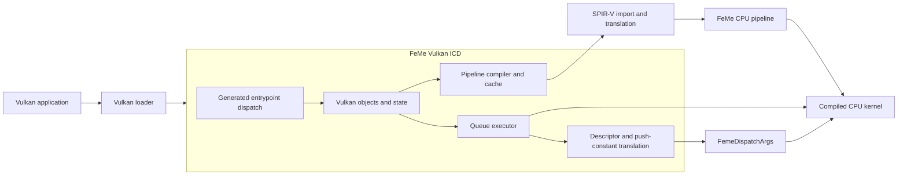
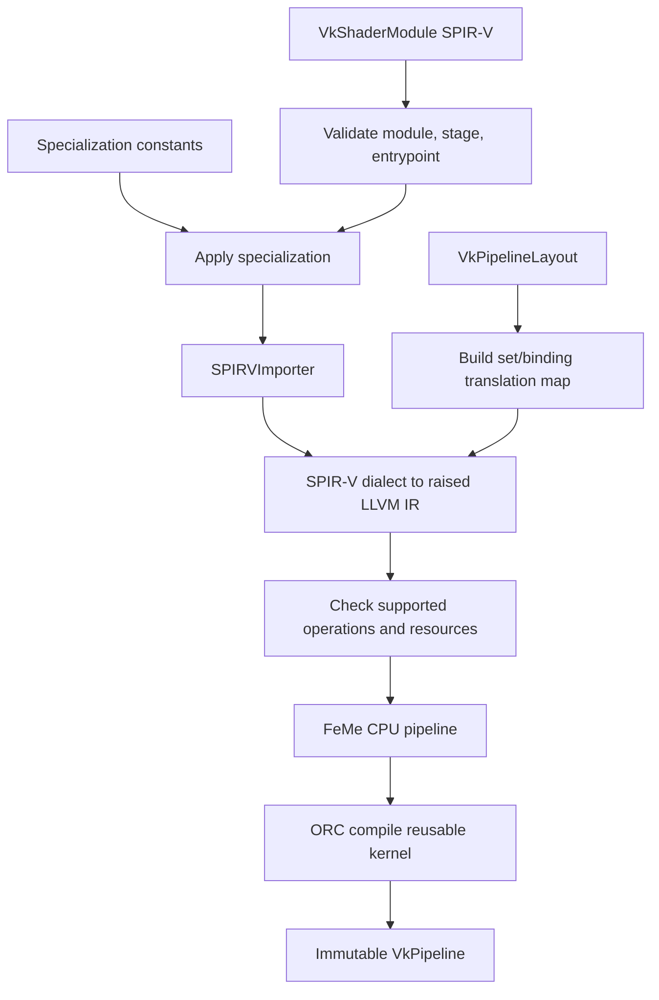

#FeMe Vulkan Runtime Design

## Status

This is an initial design for a Vulkan installable client driver (ICD)
backed by FeMe's CPU target. The first implementation target is a headless, compute - only Vulkan device
    .It is intended to sit below the standard Vulkan loader in the same position
        as Mesa 's lavapipe, but it does not initially aim to match lavapipe' s
            graphics,
    WSI,
    or extension coverage
            .

        The CPU shader compiler and
            execution machinery described in[FeMeCPUDesign.md](FeMeCPUDesign.md)
                already exists.The work designed here is the runtime layer which
        translates Vulkan objects and commands into that machinery,
    plus the FeMe changes needed to make the CPU target usable by a driver.

    The shared compiler,
    stage ABI, image / sampler,
    and software - rasterization work needed to extend
                   this compute device to graphics is designed
                   separately in[FeMeGraphicsDesign.md](FeMeGraphicsDesign.md)
                       .This document retains ownership of Vulkan pipeline,
    render - pass, command, synchronization, and WSI semantics; those are specified in "Graphics, Presentation, and Window-System
Integration" below and scheduled as milestones V6–V8. Everything before V6 is
a compute-only device.

Those FeMe changes are not incidental, and this design does not treat them as
such. Four of them gate the first executing milestone:

- `feme::SPIRVImporter` cannot yet ingest realistic Vulkan SPIR-V. Its
  structurization limits, not its resource coverage, are the first blocker.
  See "SPIR-V import prerequisites".
- `feme::cpu::JITEngine` compiles once and dispatches many times, and now has
  a per-workgroup entry point and a real worker pool (closed by roadmap R21:
  `feme::cpu::CompiledStage::invokeGroup` and `JITOptions::NumThreads`, see
  "CPU Runtime API Changes").
- ~~`feme::cpu` supports only *uniform* groupshared accesses today, which
  excludes the `gl_LocalInvocationIndex`-indexed shared arrays that dominate
  real Vulkan compute shaders. See "Physical Device and Capabilities".~~
  (closed by roadmap R23: `feme::cpu::FunctionWidener` now widens a
  divergent groupshared index, load, store, and atomic into real
  vector-of-pointers/masked-gather-scatter operations rather than
  diagnosing them; see "Limits and features")
- Root constant lowering covers only one narrow binding shape, so covering
  Vulkan's advertised push-constant range is a multi-pass CPU-target change
  rather than a translation detail. See "Descriptor Model".

The FeMe-side prerequisites above, and this document's milestones, are
scheduled against the rest of FeMe in [Roadmap.md](Roadmap.md) (§1.9 and
§3.3).

## Summary

FeMe should provide a shared library, tentatively `libfeme_vulkan`, which
implements the Vulkan loader-driver interface and exposes one software
`VkPhysicalDevice`. The device has one compute-only queue family. A compute
pipeline imports the application's SPIR-V with `feme::SPIRVImporter`,
translates it to raised LLVM IR, and compiles it with the FeMe CPU pipeline.
A queue submission interprets recorded command buffers, snapshots the bound
pipeline and descriptor state at each dispatch, translates Vulkan descriptors
into `feme::cpu::FemeDescriptor` values, and invokes the compiled entry point.

The central architectural boundary is:



The ICD owns Vulkan semantics. FeMe's CPU target continues to own shader
semantics. In particular, the CPU target must not acquire knowledge of
`VkDescriptorSet`, `VkBuffer`, queue submission, or Vulkan synchronization.

## Goals

- Load through the standard Khronos Vulkan loader using a driver manifest.
- Present a useful, compute-only Vulkan physical device on Linux first.
- Accept Vulkan SPIR-V compute shaders without translating through NIR,
  Gallium, or Mesa.
- Reuse FeMe's import, optimization, CPU lowering, runtime helper, and JIT/AOT
  infrastructure.
- Make all advertised limits, features, formats, and extensions truthful.
- Support multiple devices, queues, and pipeline compilations without mutable
  process-global FeMe state.
- Coexist in one process with other installed Vulkan drivers, including other
  LLVM-based software drivers, because the loader loads every discovered ICD.
- Preserve a path to graphics support without designing a software rasterizer
  into the compute milestone.
- Make malformed SPIR-V and hostile Vulkan object sizes fail cleanly rather
  than becoming host memory corruption.

## Initial Non-Goals

These are non-goals for the *initial*, compute-only device (V0–V5). Graphics,
mesh shading, ray tracing, and WSI are designed in "Graphics, Presentation,
and Window-System Integration" and scheduled as V6–V8; nothing below is
permanently excluded except where it says so.

- Graphics, ray tracing, mesh shading, and video queues. Video queues are
  permanently out of scope;
the rest are V6–V8.- Window - system integration, surfaces, swapchains,
    and presentation(V8).- Vulkan
                           conformance.Until the relevant CTS coverage passes,
    the driver must report a zero `VkConformanceVersion`,
    must not imply Khronos conformance in its device name, driver name,
    or documentation,
    and must not be distributed under a name that asserts a conformant Vulkan
            implementation.-
            Matching all lavapipe extensions
        or performance.-
               Reusing Mesa's NIR, Gallium, llvmpipe, or common Vulkan runtime as a link-time dependency
                   .-
               Device group execution,
    sparse residency, protected memory, external memory,
    and external synchronization handles.Their *features *report false and their
            capability queries return empty
        or degenerate results,
    but the core entrypoints that carry them-- `vkEnumeratePhysicalDeviceGroups`,
  `vkGetPhysicalDeviceSparseImageFormatProperties2`,
  `vkGetPhysicalDeviceExternalBufferProperties`,
    and their peers-- are still implemented.An
        advertised core version may report a feature as unsupported;
  it may not omit a command.
- Images, sampling, and samplers in the first executing milestone. These are
  required for broader Vulkan compute compatibility, but FeMe's current CPU
  resource runtime is buffer-oriented and deliberately does not implement
  sampling.

## Reference Model and Research Conclusions

There are two distinct interfaces to reproduce from lavapipe's position in the
stack:

1. The Vulkan loader-driver interface: discovery, interface negotiation,
   proc-address lookup, and dispatchable object layout.
2. Vulkan device behavior: object lifetime, memory, descriptors, pipeline
   creation, command recording, queue execution, and synchronization.

The first is comparatively small but exacting. The Khronos loader requires a
JSON driver manifest and discovers entrypoints through
`vk_icdGetInstanceProcAddr`. Modern drivers negotiate a loader-driver interface
version with `vk_icdNegotiateLoaderICDInterfaceVersion`. Driver-created
dispatchable handles (`VkInstance`, `VkPhysicalDevice`, `VkDevice`, `VkQueue`,
and `VkCommandBuffer`) are pointers to regular structures whose first field is
reserved for loader dispatch data and is initialized with the loader magic.
These requirements are separate from the Vulkan specification itself.

Lavapipe demonstrates a useful high-level split: Vulkan objects and recorded
commands live in a Vulkan frontend; pipeline compilation lowers SPIR-V into the
backend's shader representation; queue execution interprets commands and drives
the software backend. FeMe should preserve that split, but replace the
NIR/Gallium/llvmpipe path with FeMe's SPIR-V importer and CPU target.

Mesa's common Vulkan runtime is a valuable implementation reference, especially
for generated entrypoints, object bases, allocation callbacks, command pools,
and synchronization. Directly depending on it is not proposed: it is an
internal Mesa library, would make FeMe's LLVM subproject depend on a second
source tree and build system, and would not remove the FeMe-specific pipeline,
descriptor, and execution work.

Primary references:

- [Vulkan loader-driver interface](https://github.com/KhronosGroup/Vulkan-Loader/blob/main/docs/LoaderDriverInterface.md)
- [Vulkan specification](https://registry.khronos.org/vulkan/specs/latest/html/vkspec.html)
- [Vulkan-Headers and `vk.xml`](https://github.com/KhronosGroup/Vulkan-Headers)
- [Mesa lavapipe source](https://gitlab.freedesktop.org/mesa/mesa/-/tree/main/src/gallium/frontends/lavapipe)
- [Mesa common Vulkan runtime](https://gitlab.freedesktop.org/mesa/mesa/-/tree/main/src/vulkan/runtime)
- [LLVMpipe overview](https://docs.mesa3d.org/drivers/llvmpipe.html)

## Project and Library Boundaries

The proposed source layout is:

```text
feme/
  include/feme/Vulkan/            Public embedding and test interfaces, if any
  lib/Vulkan/                     FeMeVulkanCore: ICD objects, entrypoints,
                                   and queue execution
  tools/feme-vulkan/               The loader-facing feme_vulkan shared object
  tools/feme-vulkan-loader-smoke/ Tiny client used by the lit tests below
  test/Vulkan/                    Lit tests with small Vulkan clients
  unittests/Vulkan/               Object, descriptor, and synchronization tests
  share/vulkan/icd.d/             Configured development manifest template
```

The ICD is an optional FeMe component because a Vulkan SDK may not be present
in every LLVM build. Configuration should accept an installed Vulkan SDK (via
CMake's `find_package(Vulkan)`) and build `libfeme_vulkan` only when explicitly
enabled. The driver should depend on the Vulkan headers, FeMe, LLVM, MLIR, and
platform thread/dynamic-library support, but not on the Vulkan loader library
at runtime. Test clients link to the loader.

The Vulkan SDK would be FeMe's first external dependency of any kind: FeMe is
built in-tree only and currently has no optional external packages. The
configuration surface, the CI coverage for the disabled path, and the version
floor for `vk.xml` are therefore new project-wide obligations, not a reuse of
an existing pattern.

Vulkan entrypoint declarations and lookup tables should be generated from
`vk.xml`. Hand-maintaining hundreds of command names, aliases, core-version
promotions, and extension guards is error-prone even when only a subset is
implemented. The generated table maps supported names to ICD functions and
returns null for unsupported extension commands.

### Process Coexistence and Symbol Visibility

The Vulkan loader loads *every* discovered ICD into the application process, so
on a normal Linux desktop `libfeme_vulkan.so` is loaded alongside Mesa drivers
that link their own copy of LLVM. Two LLVM copies in one address space is a
known failure mode: duplicate `cl::opt` registration aborts at load time,
`ManagedStatic` and target-registry state collide, and RTTI/exception type
identity diverges. This is a hard requirement on the ICD, not a packaging
preference.

The driver must therefore:

- Link LLVM and MLIR statically, never against `libLLVM.so`/`libMLIR.so`, and
  never be opened with `RTLD_GLOBAL`.
- Build with `-fvisibility=hidden -fvisibility-inlines-hidden` and a linker
  symbol-export list (a version script on ELF, `-exported_symbols_list` on
  Darwin, a module-definition file on Windows -- see
  `LLVM_EXPORTED_SYMBOL_FILE`/`add_llvm_symbol_exports()`) that exports only
  the loader-facing `vk_icd*` symbols plus the legacy `vkGetInstanceProcAddr`
  alias. No LLVM, MLIR, or FeMe symbol may be dynamically exported.
- Register no `llvm::cl` option from any code reachable in the ICD, and perform
  LLVM's process-global target initialization exactly once under a
  `std::once_flag` during `vkCreateInstance`. FeMe itself has no process-global
  mutable state; LLVM's target registry does.
- Be verified by a test that runs a client with both the FeMe manifest and a
  system driver manifest visible, and by a link-time check that the exported
  dynamic symbol set matches the export list exactly.

## Loader Integration

The initial Linux manifest is generated with the built shared library's path:

```json
{
  "file_format_version" : "1.0.1", "ICD" : {
    "library_path" : "/path/to/build/lib/libfeme_vulkan.so",
                     "api_version" : "1.1.0",
                                     "is_portability_driver" : false
  }
}
```

The build-tree manifest uses an absolute path into the build directory; a bare
soname only resolves after installation into a loader search path. Two
manifests are configured: a development one for `VK_DRIVER_FILES` and an
installed one for the packaging path.

The exact advertised API version is selected during implementation from the
core command and CTS coverage actually achieved; `1.1.0` above is illustrative,
not a commitment. Vulkan has no pre-1.0 profile in which mandatory core
functionality can simply be omitted, so the early milestones below are
development checkpoints, not complete Vulkan implementations. Development
runs select the build-tree manifest with `VK_DRIVER_FILES`.

The library provides or makes queryable:

- `vk_icdNegotiateLoaderICDInterfaceVersion`
- `vk_icdGetInstanceProcAddr`
- `vk_icdGetPhysicalDeviceProcAddr`
- `vkGetDeviceProcAddr`
- Global commands needed before an instance exists, including instance version
  and extension enumeration

Supporting loader-driver interface version 7 is preferred. Exporting the
traditional ICD symbols as well as making them queryable retains compatibility
with older loaders at little cost.

Every dispatchable object starts with `VK_LOADER_DATA` from `vk_icd.h` and is
initialized with `set_loader_magic_value`. Non-dispatchable handles are typed
pointers internally on 64-bit hosts. A generated handle-cast layer keeps Vulkan
C handles out of the C++ implementation details.

## Object Model

All objects use the application's `VkAllocationCallbacks` when supplied. A
small common header stores object type, owning device or instance, allocator,
and debug name. Destruction validates no state in release builds; Vulkan's
externally synchronized lifetime rules remain the application's obligation.

| Vulkan object | FeMe ICD responsibility |
|---|---|
| `VkInstance` | Enabled instance extensions, allocator, one physical device |
| `VkPhysicalDevice` | Immutable properties, limits, memory types, queue families |
| `VkDevice` | Enabled features/extensions, queues, compiler service, worker pool |
| `VkQueue` | Ordered submission stream and synchronization state |
| `VkDeviceMemory` | Host allocation, size, memory type, map state |
| `VkBuffer` | Size/usage plus a bound memory range |
| `VkShaderModule` | Validated owned SPIR-V bytes or words |
| `VkDescriptorSetLayout` | Immutable binding metadata and compact slot layout |
| `VkPipelineLayout` | Ordered set layouts and push-constant ranges |
| `VkDescriptorPool` | Accounting and storage ownership for descriptor sets |
| `VkDescriptorSet` | Mutable descriptor records in layout-defined slots |
| `VkPipeline` | Immutable compiled compute kernel and binding map |
| `VkPipelineCache` | Serialized FeMe compilation artifacts keyed by pipeline inputs |
| `VkCommandPool` | Allocator and reset domain for command buffers |
| `VkCommandBuffer` | Append-only typed command stream while recording |
| `VkQueryPool` | Result storage and availability state per query |
| Fence/semaphore/event | Host synchronization state with condition-variable backing |

`VkQueryPool` is listed because `vkCreateQueryPool`, `vkCmdResetQueryPool`,
`vkCmdBeginQuery`/`vkCmdEndQuery`, `vkCmdWriteTimestamp`,
`vkCmdCopyQueryPoolResults`, and `vkGetQueryPoolResults` are core commands. A
compute-only device with zero `timestampValidBits` still has to implement the
object and the commands; timestamp queries may write zero and pipeline
statistics may be reported unsupported, but the pool cannot be absent.

`VkImage`, image views, samplers, and WSI objects are not created until their
features are implemented and advertised. Until then, `vkCreateImage` fails
cleanly rather than returning a half-initialized object.

## Physical Device and Capabilities

The ICD exposes one CPU physical device.

### Device identity

`vendorID`, `deviceID`, and the `VkDriverId` reported through
`VkPhysicalDeviceDriverProperties` are ecosystem-visible identifiers, not free
fields. Applications, engines, and driver allowlists key behavior off them, so
inventing values collides with real vendors. The driver must either use a
Khronos-registered `VkDriverId` and a registered vendor ID, or, until one is
allocated, set `vendorID` to the Khronos-reserved implementation-defined form
described by the specification and report `VK_DRIVER_ID_MAX_ENUM` rather than
impersonating another driver. Roadmap C5 makes these fields queryable through
`VkPhysicalDeviceDriverProperties`/`VkPhysicalDeviceVulkan12Properties` with
non-empty identifying strings and a truthful zero `VkConformanceVersion`, but
obtaining a registered `VkDriverId` remains an explicit prerequisite for
distributing the driver.

The device UUID and pipeline cache UUID must be deterministic for the FeMe ABI
version, LLVM version, target triple, host CPU feature policy, selected wave
size, and driver build. Cache identity must change whenever any of those can
change generated code or serialized data.

### Queue families

The first queue family exposes `VK_QUEUE_COMPUTE_BIT` and
`VK_QUEUE_TRANSFER_BIT`, and -- since V6 -- `VK_QUEUE_GRAPHICS_BIT` as well
(see "Graphics queue family" below for the rule that gates it). Queue count
should be small and truthful; one queue is sufficient for the first
milestone. Timestamp valid bits are zero until query timestamps are
implemented. Graphics does not add a second family.

Roadmap C7 ("Queue family capability combinations") added two more,
narrower families: a `VK_QUEUE_TRANSFER_BIT`-only family and a
`VK_QUEUE_COMPUTE_BIT | VK_QUEUE_TRANSFER_BIT`-only family (both excluding
`VK_QUEUE_GRAPHICS_BIT`). Several mandatory `dEQP-VK` cases require a queue
that excludes graphics (and, for the first of the two, compute as well),
which no single universal family can ever satisfy by construction. Unlike
"Expose a separate graphics queue family" below, neither of these invents
an independent execution engine that does not exist: each only *restricts*
what one logical submission queue promises to accept, and FeMe's single
worker pool can honor that restriction regardless of how many queue
families a caller sees. `feme::vulkan::PhysicalDeviceInfo::NumQueueFamilies`
(currently 3) and `QueueFamilies` are the source of truth; every command
that used to hardcode "queue family index 0 is the only one" now checks
against that count instead.

### Subgroup size

Core Vulkan 1.1 requires a single `VkPhysicalDeviceSubgroupProperties::subgroupSize`
for the whole device. FeMe's wave size is a compile-time constant chosen per
compilation from `{
  4, 8, 16, 32, 64, 128}`. The driver must therefore pin one
wave size device-wide, derive it from the host SIMD width once at physical
device initialization, report it as `subgroupSize`, and fold it into the device
and pipeline cache UUIDs. Per-pipeline wave sizes are only permissible if the
driver later implements `VK_EXT_subgroup_size_control` and honors its required
and full-subgroup semantics.

`subgroupSupportedStages` is compute-only, and `subgroupSupportedOperations`
starts at `VK_SUBGROUP_FEATURE_BASIC_BIT` and grows only as
`feme::cpu::WaveLoweringPass` coverage is demonstrated by tests. Roadmap C5
closes the object-model contradiction where `VkPhysicalDeviceSubgroupProperties`
reported `BASIC_BIT` but the promoted `VkPhysicalDeviceVulkan11Properties`
chain left `subgroupSupportedOperations` zeroed: both query paths now report
the same truthful baseline.

### Limits and features

Properties and limits are implementation contracts, not aspirational values.
In particular:

- `maxComputeWorkGroupInvocations` is bounded by FeMe's supported wave/group
  lowering and practical stack/groupshared limits.
- `maxComputeWorkGroupSize` and `maxComputeWorkGroupCount` must be checked both
  at pipeline creation and dispatch.
- ~~`maxComputeSharedMemorySize` cannot be advertised at the core-required
  minimum until FeMe's groupshared lowering supports *divergent* accesses.
  Today `feme::cpu` accepts only uniform groupshared indices and diagnoses
  anything else, which excludes the `gl_LocalInvocationIndex`-indexed shared
  arrays that most Vulkan compute shaders use. A shader that uses shared memory
  divergently must fail pipeline creation with a clear diagnostic until that
  lands; the advertised limit stays at whatever the driver can actually honor
  for the advertised core version, which means the divergent path is a
  prerequisite for claiming that version at all.~~ (closed by roadmap R23 --
  a divergent groupshared index, load/store, and atomic all lower correctly
  now, see the "Summary" note above -- so V2 raises
  `maxComputeSharedMemorySize` from the core-required minimum to 32768
  bytes, a value every `feme::cpu` groupshared allocation this milestone's
  host stack/heap can actually satisfy)
- `minMemoryMapAlignment`, `minStorageBufferOffsetAlignment`,
  `minUniformBufferOffsetAlignment`, `minTexelBufferOffsetAlignment`,
  `maxStorageBufferRange`, `maxUniformBufferRange`, and `nonCoherentAtomSize`
  must match the host allocator's real guarantees and the descriptor
  translation's real range checks, not the specification minima copied
  verbatim.
- Descriptor limits reflect the maximum safely representable heap and the
  allocation-overflow checks in the runtime, while still meeting every minimum
  required by the advertised core version.
- `maxPushConstantsSize` meets the core-required minimum. The driver is not
  considered core-complete until SPIR-V push constants and the CPU root
  constant path implement that advertised range; `feme::cpu`'s root constant
  lowering covers only one narrow binding shape today (see "Push constants"
  below).
- Robust buffer access is advertised only when the descriptor helper path
  enforces the Vulkan-required behavior for every supported buffer operation.
  Advertising it false does *not* relax bounds enforcement; see "Error Handling
  and Security".
- Features involving images, atomics, subgroup operations, 8/16/64-bit types,
  variable pointers, or physical storage buffer addresses are independently
  gated by importer and CPU-lowering coverage.

**Status (roadmap C6, "Mandatory 1.2 features and limits"):** closed, with
one deliberate exception. `hostQueryReset` (`vkResetQueryPool` already
existed), `uniformBufferStandardLayout`/`separateDepthStencilLayouts`
(neither restriction they relax was ever enforced), and
`shaderSubgroupExtendedTypes`/`subgroupBroadcastDynamicId` (vacuously true:
no `OpGroupNonUniform*` operation is converted at all yet, so neither bit
unlocks an untested code path) are now advertised, each through both its
dedicated feature struct and the aggregate `VkPhysicalDeviceVulkan12Features`
chain. `maxMemoryAllocationSize` (mirrors the real memory heap size),
`maxPerSetDescriptors`, `maxMultiviewViewCount`/`maxMultiviewInstanceIndex`,
and `maxTimelineSemaphoreValueDifference` (`UINT64_MAX`: a timeline
semaphore's counter is a plain in-memory `uint64_t` compare with no lower
implementation-side cap) are raised to or above their required minimums in
both their dedicated properties structs and the promoted
`VkPhysicalDeviceVulkan11Properties`/`VkPhysicalDeviceVulkan12Properties`
chains, fixing the `vkGetPhysicalDeviceFeatures2`/`Properties2`-versus-
promoted-struct disagreement `dEQP-VK.api.info.vulkan1p2_*_consistency`
checks for each. **`multiview` stays unadvertised**: it needs layered
rendering (a framebuffer/attachment with more than one array layer bound
per view), which is roadmap V7, not yet implemented -- see
`vkCreateFramebuffer`'s `layers != 1` rejection and
`vkCreateRenderPass2`'s `viewMask != 0` rejection, both untouched by this
milestone. The `maxMultiviewViewCount`/`maxMultiviewInstanceIndex`
properties are still raised to their required minimum regardless, since
`dEQP-VK.api.info.vulkan1p2_limits_validation` checks them unconditionally
once the advertised API version is >= 1.2, independent of whether
`multiview` itself is supported. See `feme/lib/Vulkan/PhysicalDeviceInfo.h`'s
field comments and `EntryPoints.cpp`'s `fillFeatures2Chain`/
`fillProperties2Chain` case comments for the full per-field reasoning.

The driver reports no device extension merely because Vulkan-Headers declares
it. Each extension has an implementation owner and a focused test before it is
enumerated. The enumerated set lives in one place --
`feme::vulkan::getSupportedDeviceExtensions`, mirrored by
`feme/utils/vk_gen_entrypoints.py`'s `SUPPORTED_EXTENSIONS`, which is what
makes an extension's commands resolvable at all -- and `vkCreateDevice`
refuses to enable anything outside it. V6 adds the first entry,
`VK_KHR_dynamic_rendering`; roadmap C4c adds the second,
`VK_EXT_extended_dynamic_state` (see "Graphics pipeline state"'s dynamic
state row and FeMeGraphicsDesign.md's own status note).

**Status (roadmap D1, "An accurate 1.3/1.4 mandatory-feature/limit/
extension inventory"):** the audit itself is done; closing what it found is
in progress. [Vulkan14FeatureInventory.md](Vulkan14FeatureInventory.md) is
the generated checklist (`feme/utils/vk_gen_feature_inventory.py`, reading
`vk.xml` directly the same way `vk_gen_entrypoints.py` already resolves
`CORE_FEATURES` transitively): of 1.3/1.4's 36 mandatory feature bits, only
`dynamicRendering` is genuinely implemented (roadmap E1: now reported
through both its pre-promotion `VK_KHR_dynamic_rendering` feature struct
and the aggregate `VkPhysicalDeviceVulkan13Features` struct);
`synchronization2`, `maintenance4`/`5`/`6`, `subgroupSizeControl`,
`shaderIntegerDotProduct`, `pipelineCreationCacheControl`,
`pushDescriptor`, and the rest are all confirmed unimplemented, not merely
unaudited. Roadmap E2 wires the promoted `...Properties` struct's
`vkGetPhysicalDeviceProperties2` case for both versions, enumerating every
one of the 70 mandatory limit fields as the conservative, honest `0`/
`VK_FALSE`/`nullptr` a still-unimplemented capability requires -- every
field is cross-checked by `dEQP-VK.api.info.vulkan1p3`/`vulkan1p4.
property_extensions_consistency` against its own dedicated,
pre-promotion extension struct (none of which has its own
`Properties2` case yet), so each field's own later row raises it only
once that row also adds the matching dedicated-struct case (see the
inventory doc's own "Findings"). Of 39 extensions `vk.xml` records as
promoted into 1.3 or 1.4, only the two already listed above are
implemented. See the inventory doc's own "Findings" for the full
breakdown and Roadmap.md's D1/E1/E2 rows.

## Shader and Pipeline Compilation

### Input and specialization

`vkCreateShaderModule` copies the SPIR-V and performs cheap structural checks.
Full validation and translation occur at compute pipeline creation, when the
entrypoint, specialization constants, and pipeline layout are known.

Specialization constants must be applied before FeMe lowers SPIR-V to LLVM IR.
The implementation should use SPIR-V/MLIR structured APIs rather than patching
binary words. The selected entrypoint and its execution modes determine the
thread-group size, and both of the specification's mechanisms for a
specializable group size must be handled before the CPU pipeline resolves group
dimensions:

- The `LocalSizeId` execution mode, whose operands are specialization constant
  ids.
- The deprecated `BuiltIn WorkgroupSize` decoration applied to a
  specialization-constant composite. This is what glslang emits by default and
  is therefore the common case in practice, not the rare one. When present it
  overrides `LocalSize`.

After specialization, the resolved group size is validated against
`maxComputeWorkGroupSize` and `maxComputeWorkGroupInvocations` at pipeline
creation.

### Compilation flow



The pipeline owns a compiler result rather than a `JITEngine` tied to one
dispatch. The result contains:

- A callable CPU entrypoint with lifetime tied to the compiled code object.
- Resolved workgroup size and wave size.
- Groupshared size and alignment.
- `ResourceInfo` plus a Vulkan `(set, binding, array element)` to physical
  FeMe heap-slot map.
- Push-constant byte ranges used by the shader.
- A strong cache key and optional serializable object-code payload.

Compilation may run concurrently for independent pipelines. A `feme::Context`
is not thread-safe, so each concurrent compile needs its own; immutable cache
entries and target configuration may be shared. Context *ownership* outlives
the compile, however: the JIT-compiled code object and the `llvm::LLVMContext`
behind it stay alive as long as the `VkPipeline` does. `CompiledKernel` must
therefore own its context -- either by taking it by value or by holding an ORC
`ThreadSafeContext` -- rather than borrowing a caller's `Context&` that the
caller may destroy after `vkCreateComputePipelines` returns. This is a
correctness constraint on the API proposed below, not an implementation
detail.

Vulkan's pipeline-creation feedback and early-return flags can be added once
the base compilation API exists.

### SPIR-V import prerequisites

The first blocker is not resource coverage; it is that `feme::SPIRVImporter`
cannot yet ingest realistic Vulkan SPIR-V at all. The importer is a thin
wrapper over `mlir::spirv::deserialize`, and that deserializer must rebuild
structured `spirv.mlir.selection`/`spirv.mlir.loop` regions from an unstructured
binary CFG. It cannot do so for every legal module. In particular, an `OpPhi`
in a loop merge block -- which any loop carrying a `break` that produces a
value emits -- is rejected outright, because `spirv.mlir.loop` has no results
to carry the incoming values. A Clang- or glslang-compiled compute shader with
resources has also been observed to fail to round-trip on `OpCopyObject`.

The practical consequence is that only shaders with trivial control flow can be
imported today. Making the importer survive real compiler output is a
prerequisite milestone (V0.5 below), not a detail of the resource work, and it
is the largest single unknown in this design. Two candidate approaches, to be
evaluated in that milestone:

- Fix the structurization gaps in MLIR's SPIR-V deserializer upstream, giving
  `spirv.mlir.loop`/`spirv.mlir.selection` the result values needed to carry
  merge-block phis.
- Bypass structured reconstruction for compute by translating the SPIR-V CFG
  directly to unstructured LLVM IR, and rely on `feme::cpu::PreparePass`'s
  existing structurizer -- which already has to handle raised DXIL's
  unstructured CFGs -- to restore structure. This aligns the SPIR-V path with
  how the CPU target already consumes DXIL.

The second is likely cheaper and lower-risk because FeMe's CPU pipeline already
does not require structured input, but it is a genuine architectural decision
and should be settled with a prototype before V1 work is scheduled.

**Status (V0.5): decided in favor of the second option**, and implemented as
`SPIRVImporter`'s default behavior rather than a fallback path. The prototype
found a second, independent reason beyond the deserialization failure this
section originally documented: even on the shaders where MLIR's structurizer
*does* successfully rebuild a `spirv.mlir.loop`, that op's own conversion to
the `llvm` dialect (`LoopPattern` in
`mlir/lib/Conversion/SPIRVToLLVM/SPIRVToLLVM.cpp`) asserts
("incorrect # of replacement values") on a loop-carried value -- which every
loop with an induction variable has, not only ones with an early `break`.
That crash happens in a later, independent pass, so no deserialize-time retry
can route around it; only skipping structured reconstruction entirely does.
`ImportOptions::SPIRVEnableControlFlowStructurization` therefore now defaults
to `false`: every SPIR-V import deserializes straight to plain block
arguments and branches, which convert to the `llvm` dialect and then LLVM IR
unconditionally, and `feme::cpu::PreparePass`'s existing restructurer (see
FeMeCPUDesign.md) recovers structure for the CPU target the same way it
already does for DXIL's naturally unstructured CFGs. Opting back into
structured deserialization remains possible (see
`ImportOptions::SPIRVFallBackToUnstructuredControlFlow`'s retry-on-failure
behavior) for a caller that wants the structured form for some other reason,
but no in-tree caller does.

Validated against a real `dxc -spirv` corpus rather than only hand-written
fixtures: `feme/test/Tools/feme-run/SPIRV/diamond.hlsl` JIT-dispatches an
`if`/`else` merge end to end, and `.../loop-merge-phi.hlsl` imports and
translates the exact loop-with-value-producing-`break` shape that motivated
this milestone all the way to raised LLVM IR (a full JIT dispatch of that
specific shape is separately blocked on `feme::cpu::LinearizePass`'s loop
linearizer, which only supports a narrow set of restructured loop shapes
today -- a pre-existing, format-independent limitation reproduced with
hand-written LLVM IR carrying the identical CFG, not a SPIR-V import gap).
`feme-spirv-import-fuzzer`'s seed corpus gained a matching unstructured,
multi-block seed (`loop-merge-phi.spv`) so the fuzzer mutates from a shape
representative of real shaders instead of only single-block ones. glslang
was not available in the environment this milestone was validated in, so
the corpus is DXC- and (pre-existing) `llc`/SPIRV-backend-sourced only;
growing it with a glslang-compiled (GLSL-sourced) shader remains open. The
`OpCopyObject` failure mode this section previously documented was not
reproduced with the DXC shaders this pass tried (a resource-taking helper
function and a local struct copy both round-tripped cleanly); it is left
here as un-confirmed-fixed rather than closed outright.

### Builtin and execution-shape mapping

The compute builtins the driver must map onto the CPU entry ABI, and their
sources, are:

| SPIR-V builtin | Source in `FemeDispatchArgs` / CPU entry |
|---|---|
| `WorkgroupId` | `GroupID` |
| `NumWorkgroups` | `GroupCount` |
| `WorkgroupSize` | Compile-time constant from execution mode |
| `LocalInvocationId` | Lane index within the group's wave loop |
| `LocalInvocationIndex` | Linearized local id |
| `GlobalInvocationId` | `GroupID * WorkgroupSize + LocalInvocationId` |
| `SubgroupSize` / `SubgroupLocalInvocationId` | Pinned wave size and lane index |

`NumWorkgroups` must report the full dispatch dimensions even when workgroups
are distributed across the worker pool, and must remain correct under
`vkCmdDispatchBase`, where the reported value is the original dispatch size
rather than the base-offset range.

### Required SPIR-V resource work

Once import works, FeMe still cannot execute a representative Vulkan resource
shader. The existing SPIR-V conversion handles important builtins and some
image handle types, but its documented gaps include:

- `StorageBuffer`/`Uniform` block conversion, represented by LLVM SPIR-V
  `target("spirv.VulkanBuffer", ...)` types.
- Push constants.
- General descriptor-backed resource operations.
- Sampling, image fetch/gather, and broad image operation coverage.
- A binding-to-heap normalization for SPIR-V (done by roadmap R26):
  `feme::cpu::SPIRVResourceLoweringPass` now reads a bound
  `spirv.VulkanBuffer` handle's own range-size and array-index operands
  rather than assuming an implicit range size of 1, assigning each
  (descriptor set, binding) identity a contiguous run of heap slots and
  range-checking a (possibly dynamic) array index into it -- see that
  pass's header comment and "Bound-resource normalization" in
  feme/docs/FeMeCPUDesign.md. `SPV_EXT_descriptor_heap` itself is still
  unraised, and DXIL still defines the only raised bindless-heap
  counterpart (`handlefromheap`); this row answers open question 3 below
  by staying a separate, SPIR-V-specific pass rather than routing through
  one.

Buffer descriptors are the first required extension. Sampling and image
resources remain a later milestone.

## CPU Runtime API Changes

`feme::cpu::JITEngine` already separates compilation from execution:
`JITEngine::create` compiles once and the returned engine serves many
`dispatch` calls against different `DispatchResources`. What it does not offer
is any unit of work smaller than a whole dispatch. `dispatch` materializes the
physical descriptor heap and then runs every workgroup to completion,
sequentially, on the calling thread; `JITOptions::NumThreads` is accepted and
ignored. That granularity, not the compile/execute split, is what makes it
unsuitable for a Vulkan queue executor.

Add a lower-level API that exposes per-workgroup invocation, tentatively:

```c++
namespace feme::cpu {
  class CompiledKernel {
  public:
    // Takes ownership of the context; the compiled code outlives compilation.
    static llvm::Expected<std::unique_ptr<CompiledKernel>>
    create(Context Ctx, feme::Module M, const CompileOptions &Opts);

    const ArtifactInfo &getArtifactInfo() const;

    llvm::Error invokeGroup(const PreparedDispatch &Prepared,
                            std::array<uint32_t, 3> GroupID,
                            llvm::MutableArrayRef<uint8_t> GroupShared) const;
  };

} // namespace feme::cpu
```

`invokeGroup` owns the *wave* loop within the group. The CPU entry wrapper is
not called once per workgroup: it is called once per wave, with an entry mask
selecting the active lanes of a partial trailing wave, as

```text
for W in 0 .. CeilDiv(GroupSize, WaveSize) - 1:
  feme_cpu_entry_<name>(Args, entry_mask(W))
```

Hiding that loop inside `invokeGroup` keeps the wave/mask ABI out of the ICD.
It also means `invokeGroup` -- not the caller -- is responsible for the
intra-group barrier semantics that sequential wave execution implies: an
`OpControlBarrier` scoped to the workgroup must be correct when the group's
waves execute one after another rather than concurrently. Confirming that
`feme::cpu`'s barrier lowering holds under this schedule is a prerequisite for
any multi-wave workgroup.

`PreparedDispatch` owns the materialized physical heap, the root-constant
bytes, and the immutable `FemeDispatchArgs` fields, so that workers vary only
`GroupID` and groupshared storage and no `std::vector<FemeDescriptor>` is
rebuilt per group. It is submission-local and immutable while workers run.

`JITEngine` can then become a convenience wrapper around `CompiledKernel`,
preserving its existing API for `feme-run` and tests, and gaining a real
implementation of `JITOptions::NumThreads` for free. This change provides the
ICD with:

- Workgroup scheduling controlled by the device worker pool.
- Correct host allocation for groupshared regions above the entry wrapper's
  stack threshold.
- One-time descriptor-heap materialization per Vulkan dispatch rather than per
  group.
- A future route to object-code caching independent of Vulkan.

Two further CPU-target changes are required:

- `ArtifactInfo` must be fully populated with wave size, group size, and
  groupshared size/alignment. The fields already exist in artifact ABI version
  2 and are reserved in its byte layout, so populating them is not an ABI
  break; they are simply always written as zero by the current builder.
- Groupshared lowering must accept divergent indices. Until it does, the ICD
  cannot honor `maxComputeSharedMemorySize` for realistic shaders.

Status (roadmap R21): `feme::cpu::CompiledStage` (`feme/include/feme/Target/
CPU/CompiledStage.h`) and `feme::cpu::PreparedDispatch`/`invokeGroup`
(`feme/include/feme/Target/CPU/ResourceHeap.h`) exist under those names --
this design's own `CompiledKernel` sketch above is superseded by
[FeMeGraphicsDesign.md](FeMeGraphicsDesign.md)'s `CompiledStage`, the shared
final name both this design and FeMeWARPDesign.md's own sketch build
against (see that document's "Compiled stage API": "there is one type").
`JITEngine` is now exactly the convenience wrapper described above: it holds
a `CompiledStage` and, when `JITOptions::NumThreads != 1`, an
`llvm::DefaultThreadPool` created once and owned for the engine's whole
lifetime; `dispatch` schedules every group across it (`NumThreads == 1`
still runs sequentially on the calling thread with no pool at all) rather
than accepting and ignoring the option.

Deviation: `invokeGroup` does **not** own a separate host-side wave loop as
sketched above (`for W in 0 .. CeilDiv(GroupSize, WaveSize) - 1:
feme_cpu_entry_<name>(Args, entry_mask(W))`). That loop already exists, just
not at the layer this sketch assumed: `feme::cpu::EntryWrapperPass`
(`feme/lib/Transforms/CPU/EntryWrapper.cpp`) builds it *inside* the compiled
`feme_cpu_entry_<name>` wrapper itself, computing each wave's entry mask
there, precisely so it can also split a barrier into separate wave loops
before and after the sync point and spill values live across it (roadmap
milestone 9's "Group Execution and Barriers", predating this milestone).
Moving that loop out to `invokeGroup` as sketched would require either
duplicating that barrier-splitting machinery on the host side or changing
the compiled entry point's ABI to take an explicit wave index and mask and
re-deriving barrier correctness against it -- neither of which R21 needed to
solve the actual gap it closes (a dispatch's unit of work smaller than the
whole thing, per §1.6/§1.8.1's "Dispatch is sequential, not thread-pooled").
`invokeGroup` therefore calls the compiled entry point exactly once per
group, and the existing per-wave loop inside it is unchanged. `PreparedDispatch`
and per-group scheduling are otherwise exactly as designed above.
`CompileOptions` in the sketch is `feme::cpu::JITOptions`
(`CompiledStage::create` does not yet take a stage-aware
`StageCompileOptions`; see FeMeGraphicsDesign.md's "Compiled stage API" for
why that split is left to roadmap R27), and `getArtifactInfo()` is not yet
exposed (`getResourceInfo()`/`getWaveSize()`/`getGroupSize()` are, matching
`JITEngine`'s pre-existing accessors; `ArtifactInfo` itself is still
compute-shaped and its wave/group-size fields are still unpopulated, per
this section's own "further CPU-target changes" above -- roadmap R22).

## Memory and Buffers

The initial physical device exposes one memory type and one heap. The type is
`HOST_VISIBLE | HOST_COHERENT | DEVICE_LOCAL`: on a software device the host
allocation genuinely is device memory, and applications that require a
device-local heap to select a device will otherwise reject the driver.
`HOST_CACHED` may be added once the driver is confident about the reporting's
implications for `vkFlushMappedMemoryRanges`. `vkAllocateMemory` allocates host
storage aligned to at least the advertised `minMemoryMapAlignment`;
`vkMapMemory` returns a pointer into it. Coherent memory avoids cache-management
work in the first implementation, so flush and invalidate validate ranges and
otherwise do nothing.

Binding a buffer records a `(VkDeviceMemory, offset)` pair after validating
alignment, range, and usage. A descriptor referring to a buffer resolves to:

```text
Data        = memory allocation base + buffer binding offset + descriptor offset
SizeInBytes = effective Vulkan descriptor range
Kind        = Raw or Structured
Flags       = read-only or UAV-equivalent access
```

Vulkan's `VK_WHOLE_SIZE`, texel-buffer formats, dynamic offsets, and robust
out-of-bounds behavior are resolved while preparing a dispatch. Integer
overflow is checked before every offset/range addition.

Device addresses are not exposed initially. Doing so would allow shaders to
bypass descriptor bounds and would require a separate robust-access design.

## Descriptor Model

A descriptor set stores source Vulkan records; it does not store
`FemeDescriptor` directly. This is important because buffers can be rebound,
dynamic offsets are supplied at command recording/execution, and the same set
may be consumed by pipelines with different compact heap layouts.

At pipeline creation, shader reflection plus `VkPipelineLayout` produces a
binding map. At dispatch preparation, the runtime walks only the bindings used
by the pipeline and builds the FeMe heap.

The binding map cannot be a per-descriptor slot table. A binding may be an
array, and a shader may index that array with a value not known at compile
time, so no static `(set, binding, array element)` to slot mapping exists for
the indexed case. The map must instead assign each *binding array* a
contiguous heap range and record `(base slot, count, stride)`, so a dynamic
index becomes `base + index` with a bounds check against `count`. Descriptor
arrays whose length exceeds what the reserved heap can represent must fail
pipeline creation rather than silently truncate. Non-uniform indexing across a
wave additionally requires the access to be lowered per lane, which gates
advertising any descriptor indexing feature.

| Vulkan descriptor type | Initial FeMe representation | Status |
|---|---|---|
| Storage buffer | Raw/structured `FemeDescriptor`, writable | Done (V2) |
| Uniform buffer | Read-only raw `FemeDescriptor` | Done (V3) |
| Dynamic storage/uniform buffer | Same, with bound dynamic offset | Done (V2 storage, V3 uniform) |
| Storage texel buffer | Typed `FemeDescriptor`, writable as allowed | Done (V4, `R32G32B32A32_{
  SFLOAT, UINT, SINT}`/`R8G8B8A8_{
  UNORM, SNORM, UINT, SINT}` only) |
| Uniform texel buffer | Typed read-only `FemeDescriptor` | Done (V4, same format scope) |
| Sampled/storage image | Future image descriptor ABI | Deferred |
| Sampler/combined image sampler | Future sampler descriptor ABI | Deferred |
| Inline uniform block | Push/root-data or cbuffer descriptor | Deferred |
| Acceleration structure | None | Out of scope |

Descriptor updates obey Vulkan's host synchronization rules. Queue submission
must preserve the visibility and lifetime semantics of update-after-bind and
descriptor update templates before advertising those features. The first
version should omit those features and snapshot all used descriptors into a
prepared dispatch before worker execution.

Push constants are copied into command-buffer state by `vkCmdPushConstants`
(done, V3). Each dispatch snapshots the bytes visible through its pipeline
layout and passes them as `RootConstants`. Vulkan push-constant members carry
absolute offsets within the push-constant block, while FeMe's root constant
parameter is a flat byte blob, so the translation records the base offset of
the pipeline layout's ranges and rejects a shader whose accessed range is not
fully covered by a range declared in the layout with the compute stage bit
set.

This depended on FeMe root constant lowering broader than what existed: R25
closed the DXIL half (any single register binding, an array, and a dynamic
row index are all accepted, and `ResourceInfo::RootConstantSize` reports the
binding's full advertised size). The SPIR-V half needed its own, separate
work R25 did not cover, since Vulkan push constants are a SPIR-V-only
concept with no DXIL register binding at all: `feme::cpu::
SPIRVPushConstantLoweringPass` (plus `feme::cpu::SPIRVResourceLoweringPass`'s
own combined-case handling) now lowers a load through the push-constant
global -- directly, or through a constant-index `getelementptr` into it --
into a bounds-checked `RootConstants` read.

## Command Buffers

Command buffers record a compact typed stream in command-pool-owned storage.
They do not execute commands at record time. Each record contains an opcode
and an aligned payload, with owned copies of variable-sized data where Vulkan
requires recording-time capture.

The first command set is:

- Bind compute pipeline.
- Bind descriptor sets and dynamic offsets.
- Push constants.
- Dispatch, dispatch base, and dispatch indirect.
- Fill, update, and copy buffers.
- Reset query pool, begin/end query, write timestamp, and copy query results.
- Pipeline barriers sufficient for supported host/buffer operations.
- Set/reset events and wait events, if events are advertised.
- Execute secondary command buffers.
- Begin/end debug labels as no-op metadata.

`vkCmdDispatchBase` is core in Vulkan 1.1 and cannot be omitted, but
`FemeDispatchArgs` carries only `GroupID` and `GroupCount` with no base offset.
The ICD emulates it by offsetting the `GroupID` it passes to `invokeGroup`
while still reporting the original dispatch size as `GroupCount`, so that
`NumWorkgroups` stays specification-correct. If a future FeMe ABI adds a base
field, the emulation collapses into it.

`vkCmdUpdateBuffer` is capped at 65536 bytes and requires 4-byte aligned offset
and size; `vkCmdFillBuffer` has the same alignment rule. Both bounds are
enforced at record time, and the update payload is copied into command-pool
storage, so both feed the command stream's checked size accounting.

Execution maintains explicit state containing the current compute pipeline,
descriptor sets, dynamic offsets, and push constants. A dispatch command
captures or prepares the state required by its pipeline, validates indirect
arguments if applicable, and schedules its workgroups.

Secondary command buffers are interpreted into the primary execution state.
Simultaneous-use support requires immutable command streams and submission-local
execution state; no cursor or bound state may be stored back into the command
buffer during execution.

**Status (V3): done as specified above.** Every row of the first command set
now has a real implementation; `debug labels` remain unimplemented (still
harmless to omit, matching Vulkan's optional-feature convention for a
debugging aid). `executeCommandBuffer`'s per-command interpretation loop is
`executeCommandsInto`, taking the bound-pipeline/descriptor-set/push-constant
state by reference so `vkCmdExecuteCommands` recurses into it for a
secondary buffer's own commands without any state living on the command
buffer object itself.

## Queues, Scheduling, and Synchronization

Each `VkQueue` is an ordered stream. The first implementation may use one
dedicated executor thread per queue, or execute submissions synchronously in
`vkQueueSubmit`; the dedicated executor is preferred because Vulkan fences and
semaphores should not require the submitting application thread to perform all
work.

Within a dispatch, independent workgroups can run on the device worker pool.
Each workgroup receives private groupshared storage. Commands before and after
the dispatch remain ordered according to the queue and barrier model.

The scheduling layers are therefore:

```text
queue order
  -> submission order
    -> command-buffer order
      -> command order
        -> parallel workgroups within one dispatch
```

For the initial coherent host-memory device, many cache operations collapse to
compiler fences and task dependencies, but Vulkan execution dependencies still
matter. A pipeline barrier cannot be treated as a universal no-op: it must
ensure earlier worker tasks covered by the source scope complete before later
commands in the destination scope start.

The first implementation gives that a deliberately coarse but obviously correct
meaning: a barrier is a join. Executing a `vkCmdPipelineBarrier` drains every
worker task previously scheduled by the command buffer under execution, then
issues an acquire/release fence pair, then continues. Per-resource dependency
tracking that would let independent tasks straddle a barrier is an optimization
to be added later with tests, not the initial semantics. The same join applies
at submission boundaries, at `vkCmdWaitEvents`, and before any host-visible
result is reported through a fence or semaphore.

Synchronization objects use monotonically changing state under a mutex and
condition variable:

- A fence becomes signaled after all work in its submission completes.
- A binary semaphore transitions between unsignaled and signaled and is
  consumed by a wait.
- A timeline semaphore stores a monotonically increasing 64-bit value.
- An event stores device-set/reset state and participates in command execution.

The queue executor waits without holding object-global locks needed by another
queue to signal. Device loss is latched once: subsequent queue/device operations
return `VK_ERROR_DEVICE_LOST`, and all pending host waits are awakened.

## Pipeline Cache

The first cache may be process-local and store compiled kernels by a strong key
over:

- SPIR-V bytes and selected entrypoint.
- Specialization data.
- Pipeline-layout binding map and push-constant ranges.
- FeMe/LLVM versions, CPU target triple, CPU feature policy, wave size, and
  optimization/robustness options.
- CPU runtime ABI and artifact ABI versions.

`vkGetPipelineCacheData` must not serialize ORC pointers or process addresses.
Persistent cache support therefore depends on a FeMe API that emits relocatable
object code plus complete `ArtifactInfo`, and a loader that can safely recreate
a `CompiledKernel`. Until then, the command may return a valid empty cache blob
with the driver header and retain only in-process entries.

The blob handed to `vkCreatePipelineCache` is fully attacker-controlled input:
it is typically loaded from a file the application wrote earlier and may have
been tampered with. Once object code is serialized, deserializing it is a
direct code-execution vector. The format must therefore:

- Begin with the specification-mandated header, validated for length, vendor
  ID, device ID, and pipeline cache UUID before any further byte is read.
- Carry a cryptographic digest over the payload, checked before use.
- Bounds-check every internal offset and count with checked arithmetic, and
  treat any inconsistency as a cache miss.
- Treat *any* validation failure as an empty cache, never as an error and never
  as a partial load. Vulkan explicitly permits ignoring stale or invalid cache
  data.
- Be excluded from the trust boundary entirely under a build option, so that
  security-sensitive embedders can disable persistent cache loading.

**Status (V4):** `feme::vulkan::PipelineCache` (lib/Vulkan/PipelineCache.h/cpp)
implements the process-local strong-key cache above, keyed by
`computePipelineCacheKey` over exactly this section's listed inputs (the
device's own `pipelineCacheUUID` already folds in the FeMe/LLVM
versions/CPU target triple/feature policy/wave size row, so the key itself
does not need to re-derive it separately). The blob format's every bullet
is implemented (`parsePipelineCacheBlob`/`serializePipelineCacheBlob`,
fuzzed by `feme-vulkan-pipeline-cache-fuzzer`, gated by the
`FEME_VULKAN_TRUST_PIPELINE_CACHE_DATA` build option), but -- as this
section's own sketch anticipated -- it carries no relocatable object code
(`CompiledStage`/`CompiledKernel` still has no such API), so persistent
data round-trips a key set only, letting a *fresh* process recognize "this
was known-good before" without letting it skip recompilation; a hit
within the same process (the same `VkPipelineCache` object) does skip it,
sharing one `CachedPipelineArtifact`.

## Graphics, Presentation, and Window-System Integration

Everything above describes a compute-only device, and milestones V0–V5 build
exactly that. This section is the Vulkan-side content for the graphics
milestones V6–V8 below. It exists because
[FeMeGraphicsDesign.md](FeMeGraphicsDesign.md) deliberately does not own it:
that document supplies the FeMe-side stage ABI, image/sampler model, and
software rasterizer, and states that the Vulkan-side milestones — the graphics
queue family, `VkRenderPass`/dynamic rendering, graphics pipeline state, and
the WSI decision — still have to be written here.

### Ownership boundary

The boundary drawn in "Summary" does not move for graphics. The graphics core
owns stage identity, signature reflection, the `feme.stage.*`/`feme.image.*`
operations, stage compilation into `CompiledStage`, and the software
rasterizer's normalized pipeline and prepared-draw descriptions. This ICD owns
every Vulkan concept those know nothing about:

| Vulkan concept | Owner |
|---|---|
| Graphics queue family, `VkQueueFlags`, submission order | ICD |
| `VkRenderPass`, subpasses, dependencies, dynamic rendering | ICD |
| `VkPipeline` graphics state, dynamic state, pipeline layout | ICD |
| `VkImageLayout` transitions, attachment load/store ops | ICD |
| Draw commands, vertex/index buffer binding, indirect draw | ICD |
| Surfaces, swapchains, present modes, image acquisition | ICD |
| Stage compilation, interpolation, coverage, blend math, tests | Graphics core |
| Image layout math, format conversion, sampling | Graphics core |

The rule is the same one the compute path follows: the ICD translates Vulkan
state into a normalized prepared draw and hands it over; `FeMeGraphics` must
not acquire knowledge of `VkRenderPass`, `VkFramebuffer`, or a swapchain.

### Graphics queue family

"Queue families" above exposes one family with `VK_QUEUE_COMPUTE_BIT |
VK_QUEUE_TRANSFER_BIT`. Adding graphics does **not** add a second family: a
single software device with one worker pool has no independent graphics
engine, and reporting two families would be an untruthful description of the
hardware model. `VK_QUEUE_GRAPHICS_BIT` is instead added to the existing
family, which is also what an application expects from a universal queue.

That bit may only be set once G3 *and* G4's completion tests pass for every
format and state combination the driver reports, per the capability rule both
this document and FeMeGraphicsDesign.md state. There is no intermediate
"graphics bit set, draws unimplemented" configuration: a queue advertising
graphics must accept every core graphics command on it.

Consequences that must land with the bit, not after it:

- `timestampValidBits`, pipeline-statistics queries, and occlusion queries are
  evaluated against the graphics pipeline, not only dispatch.
- `VkPhysicalDeviceLimits`' viewport, attachment, sample-count, vertex-input,
  and interpolation limits stop being unreachable and become contracts, and
  every one of them is checked at pipeline creation and at draw time.
- `subgroupSupportedStages` grows beyond compute only as the corresponding
  stage's wave lowering is demonstrated by tests.

### Render passes and dynamic rendering

Both entry points are required. `VkRenderPass`/`VkFramebuffer` is core in every
version this driver can advertise, and `VK_KHR_dynamic_rendering` (core in
1.3) is what current applications and the CTS increasingly use.

They are not implemented twice. The ICD normalizes both into one internal
*render-target binding*: an ordered attachment list with format, sample count,
load/store or resolve behavior, clear value, and read-only-ness, plus the
render area. A `VkRenderPass` is compiled at creation time into a sequence of
these, one per subpass, with its dependency graph resolved into the same join
semantics "Queues, Scheduling, and Synchronization" already defines for
`vkCmdPipelineBarrier`. `vkCmdBeginRendering` builds one directly.

Subpasses get the deliberately coarse treatment first: each subpass boundary
is a full join and, where the attachment's store/load ops require it, an
attachment resolve or clear. Tile-local subpass merging, and therefore
`VK_ATTACHMENT_LOAD_OP_LOAD` from an input attachment without a round trip
through memory, is an optimization to be added with tests. Roadmap C5 closes
only the object-model half of input attachments: a render pass now accepts and
retains input-attachment references, and the matching
`VK_DESCRIPTOR_TYPE_INPUT_ATTACHMENT` descriptor kind is materialized as an
ordinary read-only image binding, but a shader-side SPIR-V `subpassInput`
read is still a separate lowering step rather than silently pretending one
exists.

Attachment layout transitions are tracked, validated, and — for the internal
tiled layouts FeMeGraphicsDesign.md's "Texture layout and formats" permits —
may be real conversions. They may never be silently ignored: a layout the
driver cannot honor fails at render-pass creation, not at draw time.

**Status (roadmap C6): `VK_FRAMEBUFFER_CREATE_IMAGELESS_BIT`/
`imagelessFramebuffer` implemented.** `vkCreateFramebuffer` accepts a
framebuffer whose attachment views are deferred to each render-pass instance
(`VkRenderPassAttachmentBeginInfo` at `vkCmdBeginRenderPass`) rather than
bound at creation time; only the chained `VkFramebufferAttachmentsCreateInfo`
(attachment count, and, where a candidate view-format list is given, at
least one format-compatible entry) can be validated eagerly, with the same
format/sample-count/size check `vkCreateFramebuffer`'s concrete path already
performed deferred into `buildRenderTargetBinding` (`CommandBuffer.cpp`)
instead. This needed no layered-rendering support: an imageless framebuffer
is exactly as single-layer as a concrete one (`vkCreateFramebuffer`'s
`layers != 1` rejection is untouched), so it stayed in scope even though
`multiview` itself did not (see "Physical Device and Capabilities"'s
"Limits and features" status note).

### Graphics pipeline state

`vkCreateGraphicsPipelines` compiles each stage through the same flow the
compute path uses, with `StageCompileOptions` naming the stage, and then
translates the fixed-function state into `FeMeGraphics`' normalized pipeline
description. Every state block has an explicit owner:

| `VkGraphicsPipelineCreateInfo` state | Translation |
|---|---|
| Stages | One `CompiledStage` each, linked through `StageInterfaceMap` |
| Vertex input bindings/attributes | Normalized vertex fetch description; formats resolved through the central format table |
| Input assembly | Primitive topology and restart, validated against the advertised topologies |
| Tessellation | Patch control points; requires G5 (V7) |
| Viewport/scissor | Normalized viewport transform and scissor rects |
| Rasterization | Cull mode, front face, fill mode, depth bias, depth clamp/clip |
| Multisample | Sample count, sample mask, alpha-to-coverage, sample shading |
| Depth/stencil | Compare ops, write masks, stencil state, bounds test |
| Color blend | Per-attachment blend equations, write masks, logic op |
| Dynamic state | The subset that may vary per draw, snapshotted into the prepared draw |

Cross-stage interface matching is validated at pipeline creation against the
core reflection G0 produces, and a mismatch is a pipeline-creation failure with
a diagnostic, never a silently mislinked varying. A pipeline whose state
combination has no implemented path must also fail at creation; a draw is not
permitted to be the place a state combination is discovered to be unsupported.

Dynamic state is what makes the prepared draw a snapshot rather than a
pipeline pointer: the ICD resolves pipeline state and dynamic state together at
each draw, exactly as it snapshots descriptors and push constants at each
dispatch today.

The pipeline cache key from "Pipeline Cache" gains the normalized pipeline
description, the render-target binding, and every stage's SPIR-V and
specialization data. Two pipelines differing only in dynamic state that is
genuinely dynamic must produce the same key; anything folded into generated
code must not.

### Draw commands and vertex data

The command set from "Command Buffers" grows by:

- Bind graphics pipeline, vertex buffers, and index buffer.
- Begin/end render pass, next subpass; begin/end rendering.
- Set the supported dynamic state.
- Draw, indexed draw, indirect and indexed-indirect draw, and their count
  variants once they are advertised.
- Clear attachments, blit, and resolve image.
- Image copies and image/buffer copies (V5 supplies the layouts these move).

Indirect draw arguments are attacker-controlled and validated exactly like
indirect dispatch: read once, bounds-checked against the bound buffers and the
advertised limits, and rejected rather than clamped when they cannot be
honored. `firstInstance`/`vertexOffset` participate in the fetch bounds check,
not only in the index arithmetic.

Secondary command buffers recorded inside a render pass inherit the render-pass
state through `VkCommandBufferInheritanceInfo` and are interpreted into the
primary's execution state, with the same immutability rule the compute path
already requires for simultaneous use.

### Window-system integration

WSI is a decision, not a feature list, because a software ICD can be useful
with no presentation path at all. The decision recorded here:

1. **Headless first.** `VK_EXT_headless_surface` plus the swapchain machinery
   is the first target. It exercises every swapchain state transition —
   creation, acquire, present, out-of-date, retirement — with no display
   dependency, no platform-specific build configuration, and no CI display
   server. It is also what the CTS's WSI tests can run against.
2. **One platform next, chosen by CI, not by preference.** After headless,
   exactly one real platform surface is implemented, and it is whichever one
   this tree's CI can actually exercise. On Linux that is expected to be
   `VK_KHR_xcb_surface` or `VK_KHR_wayland_surface`; presenting a
   host-memory image to either is a blit, and the copy path is the same one
   `vkCmdCopyImage` already needs.
3. **No `VK_KHR_display`, no direct mode, no cross-driver image sharing.**
   Those require external memory and modifier negotiation, which "Initial
   Non-Goals" already excludes.
4. **Presentation is not a graphics prerequisite.** A swapchain can be
   presented from a compute or transfer queue writing an image. WSI is
   therefore scheduled in V8 rather than V6, and V6's completion is defined by
   off-screen rendering, matching how FeMeGraphicsDesign.md's G3 completion
   test compares off-screen images against lavapipe and WARP.

Surfaces and swapchains are ordinary objects under "Object Model" rules: an
unadvertised surface extension's `vkCreate*SurfaceKHR` is simply not exposed,
and `vkCreateSwapchainKHR` fails cleanly until implemented rather than
returning a half-initialized object.

### Mesh shading and ray tracing exposure

Mesh shading (`VK_EXT_mesh_shader`) and ray tracing (`VK_KHR_ray_query`,
`VK_KHR_ray_tracing_pipeline`, `VK_KHR_acceleration_structure`) are exposed
through the same rule as everything else: not until the corresponding graphics
milestone's completion test passes, and never partially.

Two Vulkan-specific obligations do not come from the graphics core and are
owned here:

- Acceleration-structure build inputs, `VkAccelerationStructureBuildRangeInfo`
  counts and strides, and device-address-based instance data are
  attacker-controlled and must be validated before any traversal structure is
  built. `VK_KHR_buffer_device_address` becomes reachable at this point, which
  the compute milestones deliberately avoided.
- Shader binding tables are application-authored memory with API-defined
  strides and alignments. Translating one into the graphics core's shader
  records requires the same checked arithmetic the pipeline-cache blob parser
  uses, and a malformed table must fail the trace, not index out of the buffer.

## Error Handling and Security

Vulkan applications supply untrusted SPIR-V, object counts, offsets, indirect
dispatch dimensions, and pipeline cache blobs. The runtime must:

- Use checked arithmetic for allocation sizes, descriptor ranges, command
  stream growth, and dispatch workgroup products.
- Cap allocations and compiler resource use according to advertised limits.
- Translate `llvm::Error` into the narrowest applicable `VkResult`, while
  preserving diagnostics for `VK_EXT_debug_utils` or an opt-in log callback.
  (Status, roadmap C4a: `feme::vulkan::logCreationFailure`
  (`feme/lib/Vulkan/Diagnostics.h`) is the opt-in log callback this bullet
  named ahead of either it or `VK_EXT_debug_utils` existing --
  `vkCreateGraphicsPipelines` calls it in place of a bare `consumeError`,
  printing the discarded `llvm::Error`'s message to `errs()` when the host
  environment sets `FEME_VULKAN_LOG_CREATION_ERRORS`, and remaining silent
  otherwise. It is deliberately an environment variable rather than
  `VK_EXT_debug_utils` itself: the latter is an unimplemented extension with
  its own object model (`VkDebugUtilsMessengerEXT`) and severity/type
  filtering that roadmap C4a's actual problem -- a state-side pipeline
  rejection triaged from source instead of from output -- does not need.
  Other `consumeError`-shaped call sites (e.g. `vkCreateComputePipelines` in
  `Pipeline.cpp`) are not yet routed through it; C4a's own scope is the
  graphics pipeline rejections the roadmap named.)
- Never print from reusable library code or mutate process-global diagnostic
  state.
- Run SPIR-V import and the new Vulkan-to-FeMe translation surfaces under
  fuzzers.
- Treat unsupported shader operations as pipeline-creation failures, never as
  partially lowered executable code.
- Keep robust and non-robust access modes distinct. The ICD must never set
  `FEME_DESCRIPTOR_TRUSTED` for application-controlled accesses unless it has
  proved the complete accessed range.

Host memory safety is independent of the advertised `robustBufferAccess`
feature. Vulkan leaves the *values* produced by an out-of-bounds access
undefined when robustness is not enabled, but for a software driver an
undefined value must never become an arbitrary host read or write: the shader
and the application share one address space. Descriptor bounds are therefore
always enforced, and `robustBufferAccess` controls only whether the driver
promises the specification's defined return values and no-op writes.
`FEME_DESCRIPTOR_TRUSTED` is off by default and is set only where the complete
accessed range has been proved at compile time.

Out-of-host-memory conditions return `VK_ERROR_OUT_OF_HOST_MEMORY`. A shader
compile failure returns `VK_ERROR_INVALID_SHADER_NV` only when that extension's
semantics apply; otherwise pipeline creation should use the core-permitted
failure result and emit a useful debug diagnostic. Internal execution failures
after submission generally become device loss.

## Threading Rules

- Independent `VkDevice` objects share no mutable FeMe context.
- Each concurrent pipeline compile uses its own `feme::Context`, and the
  resulting `CompiledKernel` owns that context for the lifetime of the
  `VkPipeline`. No `feme::Context` is shared between threads.
- LLVM's process-global target initialization runs exactly once per process
  under a `std::once_flag`, guarded so that repeated `vkCreateInstance` calls
  and concurrent instances are safe. This is the one piece of global state the
  driver cannot avoid, and it is the reason the ICD must not export LLVM
  symbols (see "Process Coexistence and Symbol Visibility").
- Vulkan externally synchronized objects rely on the application's required
  synchronization; internally synchronized entrypoints protect their state.
- Command buffers are immutable while pending.
- Compiled kernels and pipeline metadata are immutable and may be invoked by
  multiple worker threads.
- Descriptor snapshots and push constants are submission-local.
- Allocation callbacks are called with the scope and alignment required by the
  Vulkan specification and never while holding unrelated queue locks.

## Implementation Milestones

### V0: Loader-visible skeleton

- Add the optional Vulkan SDK dependency (via `find_package(Vulkan)`) and
  `vk.xml` entrypoint generator.
- Build the ICD shared library with hidden visibility and an export version
  script, and generate the development JSON manifest.
- Implement instance, physical-device, device, and one compute queue family.
- Implement truthful properties, features, memory properties, and extension
  enumeration, including device identity and the pinned subgroup size.
- Pass a loader smoke test and run a small client through
  `vkEnumeratePhysicalDevices` and `vkCreateDevice`.
- Pass a coexistence test with a second, LLVM-based system driver visible to
  the loader.

No shader execution is required in this milestone.

**Status: done.** `feme/utils/vk_gen_entrypoints.py` reads the Vulkan SDK's
`vk.xml` directly (core `VK_VERSION_1_0`/`VK_VERSION_1_1` commands only,
resolved transitively through any `VK_{BASE,COMPUTE,GRAPHICS}_VERSION_1_x`
sub-features a `vk.xml` revision links in via `depends`) and generates an
`FEME_VK_COMMAND`/`FEME_VK_COMMAND_IMPL` X-macro table, classifying
each command's dispatch level (global/instance/device) the same way the
Vulkan loader itself does; `lib/Vulkan/ImplementedEntrypoints.txt` lists the
~29 commands this milestone actually implements; every other core command
still occupies a table entry that resolves to null. `lib/Vulkan/Objects.h`
implements `Instance`/`PhysicalDevice`/`Device`/`Queue` with
`VkAllocationCallbacks`-aware allocation (`Icd.h`'s `Allocator`);
`PhysicalDeviceInfo.cpp` computes truthful properties, Vulkan 1.0 core
limits (the spec's own required minima, plus host-derived values for memory
size and the pinned subgroup size -- see `feme::cpu::resolveWaveSize`), an
all-false `VkPhysicalDeviceFeatures` (nothing is implemented well enough to
claim any yet), a single compute+transfer queue family, and an
`llvm::MD5`-derived device/pipeline-cache UUID pair folding in the LLVM
version, host triple/CPU name, and subgroup size. `lib/Vulkan/EntryPoints.cpp`
implements every command needed for the acceptance-test scenario in
"Testing Strategy" below, plus the loader's *required* entrypoints
(`vkGetPhysicalDeviceImageFormatProperties`/
`vkGetPhysicalDeviceSparseImageFormatProperties`, honestly unsupported since
no image exists yet, but present because the loader refuses to load an ICD
missing them). `feme/tools/feme-vulkan/VulkanICD.cpp` defines the four
loader-facing symbols (`vk_icdNegotiateLoaderICDInterfaceVersion`,
`vk_icdGetInstanceProcAddr`, `vk_icdGetPhysicalDeviceProcAddr`, the legacy
`vkGetInstanceProcAddr`) with explicit default visibility, restoring it
against `feme_vulkan`'s hidden-by-default preset; `libfeme_vulkan.map`
(alongside it in that same directory) exports exactly those four.
`feme/tools/feme-vulkan-loader-smoke` is a tiny
client linked against the *real* Vulkan loader (not `libfeme_vulkan`
directly); `feme/test/Vulkan/loader-smoke.test` runs it against the
build-tree manifest, and `two-icd-coexistence.test` runs it again with
Mesa's lavapipe manifest also on `VK_DRIVER_FILES`, both gated on lit
features (`system-vulkan-loader`/`system-second-vulkan-icd`) so a host
without a real loader or a second LLVM-based ICD installed skips them
instead of failing. `unittests/Vulkan` covers the object model, capability
truthfulness/determinism, and entrypoint-table dispatch-level filtering
directly against `FeMeVulkanCore` (a static library `feme_vulkan` links
into a real shared object; unit tests link it directly instead, since
hidden visibility only affects a *shared* object's exports).

Two scope decisions, recorded as deviations from this document's original
text:

- Formerly, V0 advertised `apiVersion = VK_API_VERSION_1_1` specifically so
  `VkPhysicalDeviceDriverProperties` did not need to be queryable yet. That
  deviation is now closed in part: this ICD advertises 1.2, answers both
  `VkPhysicalDeviceDriverProperties` and the promoted
  `VkPhysicalDeviceVulkan12Properties` chain with non-empty identifying
  strings plus a truthful zero `VkConformanceVersion`, and folds the same
  identity values into the device/pipeline-cache UUIDs. What remains open is
  the registered-driver-ID half: until FeMe has a Khronos-assigned
  `VkDriverId` of its own, the queried value stays `VK_DRIVER_ID_MAX_ENUM`
  alongside the reserved implementation-defined `vendorID`, rather than
  impersonating another driver.
- "Subgroup size"'s host-vector-width detection does not stand up a full
  `llvm::TargetMachine`/`TargetTransformInfo` the way `feme::Driver`'s own
  `getHostVectorBits` does; it uses `llvm::sys::getHostCPUFeatures()`
  directly instead. V0 does no shader compilation and therefore has no
  reason yet to perform the one-shot LLVM target-registry initialization
  "Process Coexistence and Symbol Visibility" requires before any such
  machinery runs; that initialization is deferred to whichever milestone
  (V0.5/V1) first JIT-compiles a pipeline.
- **Roadmap D0** bumped the advertised `apiVersion` again, from 1.2 to 1.4
  (`VK_API_VERSION_1_4`), reversing this document's own "Loader
  Integration" framing that the advertised version is "selected during
  implementation from the core command and CTS coverage actually
  achieved" -- D0 is a deliberate advance *ahead of* that coverage, to
  give Roadmap.md's new §1.9.2 a fixed target to plan the 1.3/1.4
  mandatory-feature work against, rather than re-deriving the target
  version at the end of every future roadmap step the way C6 had to
  re-derive it for 1.2. `vk_gen_entrypoints.py` still resolves only core
  `VK_VERSION_1_0`/`VK_VERSION_1_1` commands (see "Loader Integration"
  below); the 1.2-1.4 core command names it does not yet resolve remain
  future work, tracked by §1.9.2's D-series rows rather than by this
  document. See VulkanCTSReport.md's "Roadmap D0: measured impact" for
  what advertising 1.4 without the corresponding mandatory-feature work
  costs against a stock CTS run.

### V0.5: SPIR-V import that survives real shaders

This milestone exists because the importer, not the runtime, is the first
blocker. It is scheduled before V1 and its outcome may change V1's design.

- Assemble a corpus of glslang-, DXC-, and Clang-produced compute SPIR-V,
  including loops with value-carrying breaks, nested control flow, and
  `OpCopyObject`.
- Decide between fixing MLIR's SPIR-V structurized deserialization and adding
  an unstructured SPIR-V-to-LLVM path that relies on
  `feme::cpu::PreparePass`'s structurizer; prototype the chosen approach.
- Import the whole corpus without failure and round-trip it through the CPU
  pipeline's front half.
- Extend the SPIR-V importer fuzzer to the new path.

Status: decided in favor of the unstructured-CFG path and implemented as
`SPIRVImporter`'s unconditional default (see "SPIR-V import prerequisites"
above for the full writeup, including the downstream `spirv.mlir.loop` ->
`llvm` dialect conversion crash the prototype found and that the decision
avoids entirely, not only the originally-documented deserialization
rejection). Corpus: DXC-compiled (`feme/test/Tools/feme-run/SPIRV/{diamond,
loop-merge-phi}.hlsl`, gated on a new `system-dxc` lit feature so builds
without `dxc` installed skip cleanly) plus the pre-existing `llc`/SPIRV-
backend-sourced fixtures (`feme/test/Import/SPIRV/spirv-import-unstructured-
{default,fallback}.ll`); glslang was unavailable, so a GLSL-sourced entry is
still missing. "Round-trip it through the CPU pipeline's front half" is done
for both DXC entries -- `diamond.hlsl` JIT-dispatches end to end,
`loop-merge-phi.hlsl` imports/translates to raised LLVM IR (its own full
dispatch is blocked on `feme::cpu::LinearizePass`'s separate, pre-existing
loop-shape limitation, not on import). The fuzzer's seed corpus
(`feme/tools/feme-spirv-import-fuzzer/seed-corpus`) gained
`loop-merge-phi.spv`, an unstructured multi-block seed with a
merge-block-phi shape, alongside the pre-existing single-block seeds.
`OpCopyObject` was not reproduced with the DXC shaders this pass tried, so
it stays open rather than confirmed closed.

### V1: Empty compute dispatch

- Add device memory, buffers, shader modules, pipeline layouts, command pools,
  and command buffers.
- ~~Factor `CompiledKernel`/per-workgroup invocation out of `JITEngine`, with
  the wave loop and entry mask owned by `invokeGroup`~~ (closed by roadmap
  R21 under the name `feme::cpu::CompiledStage`, see "CPU Runtime API
  Changes" for the one deviation: the wave loop stays inside the compiled
  entry wrapper rather than moving to `invokeGroup`).
- Resolve group size from `LocalSize`, `LocalSizeId`, and the
  `BuiltIn WorkgroupSize` specialization-constant decoration.
- Compile and execute a resource-free SPIR-V compute shader using builtins.
- Implement queue submit, fences, queue/device idle, and private groupshared
  allocation.
- Implement direct dispatch, `vkCmdDispatchBase` emulation, and indirect
  dispatch, with dimension validation on all three.
- Populate `ArtifactInfo`'s wave size, group size, and groupshared fields.

This is the first end-to-end Vulkan-to-FeMe execution milestone. It remains a
development subset until all mandatory limits and operations for the manifest's
advertised core version are implemented. Push constants are deliberately *not*
here: they require root constant lowering broader than the single
`(b0, space0)`, non-array, constant-row-index shape `feme::cpu` implements
today, which is a multi-pass change of its own and is scheduled in V3.

**Status: done**, implemented across `feme/lib/Vulkan/{Memory,Buffer,
Pipeline,CommandBuffer,Sync,GroupSize}.{
  h, cpp}`, covered by
`feme/unittests/Vulkan/{Memory,Buffer,Pipeline,CommandBuffer,Sync,
GroupSize}Test.cpp`. `SyncTest.SubmitDispatchAndWaitOnFence` is this
milestone's own end-to-end scenario: it records `vkCmdBindPipeline` +
`vkCmdDispatch` against a real (MLIR-assembled) SPIR-V compute shader,
submits it to a queue, and observes the fence signal.

Deviations from this section's sketch, all with fuller rationale in the
implementing headers' own file comments:

- Group-size resolution (`LocalSize`/`LocalSizeId`/`BuiltIn WorkgroupSize`)
  is a Vulkan-ICD-local raw-SPIR-V-word scanner
  (`feme::vulkan::resolveComputeGroupSize`, GroupSize.h), not a change to
  the shared `feme::spirv::createConvertSPIRVToLLVMPass`. MLIR's
  `mlir::spirv::deserialize` does not preserve a `BuiltIn` decoration
  applied to a specialization-constant composite at all -- verified by
  reading `Deserializer::processSpecConstantComposite`/
  `processConstantComposite`, which never consult the generic
  per-result-id `decorations` map the way ops dispatched through the
  auto-generated instruction table do -- so there is no structured API
  left to recover it from. `VkSpecializationInfo` overrides are honored
  only for the specialization constants group-size resolution itself
  depends on (`SpecId`s reachable from `LocalSizeId`/the `WorkgroupSize`
  composite); a shader's other, unrelated specialization constants are
  not applied at all, since nothing in V1's own resource-free scope
  exercises them.
- `vkQueueSubmit` executes every submitted command buffer synchronously on
  the calling thread, one of the two first-implementation options
  "Queues, Scheduling, and Synchronization" explicitly allows, rather than
  a dedicated per-queue executor thread. A fence is therefore always
  already in its final state by the time `vkGetFenceStatus`/
  `vkWaitForFences`/`vkQueueWaitIdle`/`vkDeviceWaitIdle` could observe it.
- Dispatch execution (`feme::vulkan::executeCommandBuffer`,
  CommandBuffer.cpp) calls `feme::cpu::CompiledStage::invokeGroup`
  directly, one group at a time on the calling thread, rather than going
  through `feme::cpu::JITEngine::dispatch`: `JITEngine` always starts a
  dispatch's `GroupID`s at `{0,0,0}`, which cannot express
  `vkCmdDispatchBase`'s offset or `vkCmdDispatchIndirect`'s
  runtime-read group count without bypassing it anyway. Parallelizing
  independent groups across a worker pool the way `JITEngine` does is a
  later performance enhancement, not a V1 correctness requirement.
- `VkPipelineLayout` accepts only `setLayoutCount == 0` and
  `pushConstantRangeCount == 0` (descriptor sets are V2, push constants
  are V3), matching "compile and execute a resource-free SPIR-V compute
  shader using builtins"; `vkCreateComputePipelines` also rejects a
  shader whose `ResourceInfo` shows it needs descriptor-heap, root-
  constant, or sampler-heap resources, since this milestone's pipeline
  layout has nothing to bind them to.
- The V1 command set is restricted to exactly the bullet list above:
  `vkCmdBindPipeline` (compute only), `vkCmdDispatch`, `vkCmdDispatchBase`,
  `vkCmdDispatchIndirect`. Buffer copies/fills, pipeline barriers, query
  pools, events, and secondary command buffers from "Command Buffers"'s
  fuller first command set are not yet implemented; buffer copies and
  barriers are explicitly scheduled in V2.
- `ArtifactInfo`'s wave size/group size/groupshared fields were already
  populated by roadmap R22 before this milestone began (see "CPU Runtime
  API Changes"); this milestone only consumes them
  (`StageArtifactInfo::GroupSharedSize` sizes each dispatch's private
  groupshared allocation).

### V2: Storage buffers and descriptors

- ~~Add a SPIR-V binding-to-heap normalization, since
  `BoundResourceNormalizationPass` handles DXIL only.~~ (closed by roadmap
  R26 for the shader-compiler half: `feme::cpu::SPIRVResourceLoweringPass`
  now normalizes an arrayed binding into a contiguous heap range with a
  range-checked, possibly-dynamic array index, matching
  `BoundResourceNormalizationPass`'s own DXIL treatment -- see "Required
  SPIR-V resource work" above. The Vulkan object-model half -- descriptor
  pools/sets/updates actually producing `BoundResourceBinding`s for a
  dispatch -- remains this milestone's own work, listed below.)
- ~~Complete SPIR-V `StorageBuffer` lowering to the CPU resource model.~~
  (already covered by R26's `SPIRVResourceLoweringPass`, plus this
  milestone's own storage-buffer descriptor writes/dynamic offsets below --
  no further shader-compiler change was needed once both existed)
- ~~Implement descriptor layouts, pools, sets, updates, binding, and dynamic
  storage-buffer offsets, with contiguous heap ranges for arrayed
  bindings.~~ (done: `feme::vulkan::DescriptorSetLayout`/`DescriptorPool`/
  `DescriptorSet` (Descriptor.h/.cpp) implement the object model; a
  descriptor set stores source Vulkan records -- bound buffer, offset,
  range -- per "Descriptor Model", not a `FemeDescriptor` directly.
  `vkCmdBindDescriptorSets` records the bound sets and the dynamic offsets
  consumed for them, in ascending (set, binding) order per spec; dispatch
  execution's `buildBoundResources` (CommandBuffer.cpp) then materializes
  one `FemeDescriptor` array per (set, binding) with a non-empty declared
  array, folding a dynamic binding's offset into the descriptor's `Data`
  pointer with no shader-side change, matching "Memory and Buffers". A
  (descriptor set, binding) identity is exactly
  `feme::cpu::BoundResourceRange`'s `(Space, BaseRegister)`, so
  `VkPipelineLayout`'s ordered `VkDescriptorSetLayout` list needs no
  translation table -- `vkCreateComputePipelines` validates each of a
  shader's `BoundResourceRange`s directly against it)
- ~~Implement buffer copy/fill/update commands and buffer barriers with the
  join semantics described above.~~ (done: `vkCmdCopyBuffer`/
  `vkCmdFillBuffer`/`vkCmdUpdateBuffer` (CommandBuffer.cpp) bounds-check
  every region before copying; `vkCmdPipelineBarrier` is recorded as a
  plain marker, since this milestone's execution model already runs every
  command to completion strictly in record order on a single thread -- see
  "Queues, Scheduling, and Synchronization" -- so the join it specifies is
  already satisfied by construction rather than needing any tracked
  dependency state)
- ~~Implement divergent groupshared access in `feme::cpu`, without which
  `maxComputeSharedMemorySize` cannot be honored for realistic shaders.~~
  (closed by roadmap R23, a prerequisite that landed before this milestone
  began; this milestone's own remaining work was raising the Vulkan-
  advertised `maxComputeSharedMemorySize` itself from the core-required
  minimum (16384) to 32768 now that the CPU-target gap is closed -- see
  "Limits and features")
- ~~Run a Vulkan compute shader that reads and writes storage buffers.~~
  (`StorageBufferDispatchTest.ReadsAndWritesThroughBoundDescriptorSet`/
  `.DynamicOffsetShiftsBoundBinding`, feme/unittests/Vulkan/
  CommandBufferTest.cpp, are this milestone's own end-to-end scenario:
  bind a descriptor set over two storage buffers, dispatch a shader that
  reads one and writes the other, and observe the host-visible result)
- ~~Differentially compare results with lavapipe for the supported
  subset.~~ (`feme-vulkan-storage-buffer-diff` (feme/tools/
  feme-vulkan-storage-buffer-diff) links the real Khronos loader, binds
  the same two storage buffers through a real `VkDescriptorSet`, and
  prints its output; `test/Vulkan/storage-buffer-lavapipe-diff.test` runs
  it once against FeMe's ICD and once against Mesa lavapipe's, with
  `VK_DRIVER_FILES` restricted to a single manifest each time, and diffs
  the two outputs)

**Status: done**, implemented across `feme/lib/Vulkan/{Descriptor,
Pipeline,CommandBuffer}.{
  h, cpp}`, covered by
`feme/unittests/Vulkan/{Descriptor,Pipeline,CommandBuffer}Test.cpp` and
`feme/test/Vulkan/storage-buffer-lavapipe-diff.test`.

Deviations from this section's sketch:

- Per-descriptor-type pool-size accounting (`VkDescriptorPoolCreateInfo::
  pPoolSizes`) is not modeled -- `DescriptorPool` only enforces `maxSets`.
  This milestone's only two descriptor types share one simple accounting
  rule, and a real application's pool-size list beyond that is otherwise
  upstream validation's job, not this ICD's own correctness surface.
- Descriptor copies (`vkUpdateDescriptorSets`'s `pDescriptorCopies`) are
  implemented (`DescriptorSet::write` reused from the copy source's
  already-written array), even though "Descriptor updates obey Vulkan's
  host synchronization rules" above only discusses writes -- it was no
  additional design surface once writes existed, so it is not left as a
  gap.
- Update-after-bind and descriptor update templates remain unimplemented,
  matching "The first version should omit those features and snapshot all
  used descriptors into a prepared dispatch before worker execution" --
  `buildBoundResources` runs once per dispatch preparation, reading
  whatever a descriptor set's bindings hold at that moment.

### V3: Uniform data, push constants, and synchronization

- ~~Complete FeMe root constant lowering beyond the single `(b0, space0)`,
  non-array, constant-row-index shape it supports today~~ (closed by roadmap
  R25, a prerequisite that landed before this milestone began -- see V3's
  own dependency on R25 in Roadmap.md), ~~and map Vulkan push constants onto
  it, covering the full advertised `maxPushConstantsSize`~~ (done: discovered
  a second, SPIR-V-specific prerequisite R25 did not cover -- a SPIR-V
  push-constant block had no CPU-target lowering into the root-constant
  block at all, since `feme::cpu::RootConstantLoweringPass` only recognizes
  DXIL's register-bound `dx.CBuffer`. `feme::cpu::
  SPIRVPushConstantLoweringPass` (plus `feme::cpu::
  SPIRVResourceLoweringPass`'s own combined-case handling for a function
  that also uses bound resources) fills that gap, recognizing a load
  through the push-constant global directly or through a constant-index
  `getelementptr` into it. Doing this also surfaced and fixed a real,
  previously-latent MLIR SPIRVToLLVM conversion bug: any `Block`-decorated
  struct with explicit per-member `Offset` decorations -- the shape every
  real (`dxc`-compiled or binary-round-tripped) push-constant or uniform
  block actually has -- failed to convert at all, because MLIR's own
  `convertStructTypeWithOffset` sanity-checks itself by comparing against
  `VulkanLayoutUtils::decorateType`, which drops any struct-level
  decoration when it recomputes a canonical layout. `feme::vulkan::
  PipelineLayout` now records `VkPushConstantRange`s, and
  `vkCreateComputePipelines` validates a shader's root-constant span is
  fully covered, byte for byte, by the layout's compute-visible ranges and
  fits `maxPushConstantsSize`; `vkCmdPushConstants` writes into new
  per-command-buffer push-constant execution state, snapshotted into
  `RootConstants` for every dispatch)
- ~~Implement uniform buffers and dynamic uniform offsets~~ (done: the
  Vulkan object model -- `VK_DESCRIPTOR_TYPE_UNIFORM_BUFFER`/`_DYNAMIC`
  share storage buffers' pool/set/dynamic-offset accounting, materializing
  a read-only `FemeDescriptor` -- and the SPIR-V shader-compiler side both
  landed: a `Uniform` storage-class block's access shape,
  heterogeneously-typed fixed fields at fixed byte offsets, does not fit
  `feme::spirv::convertBufferBlockType`'s existing homogeneous-runtime-
  array model, so it needed its own conversion
  (`feme::spirv::convertUniformBlockType`, wrapping the block's own field
  struct directly in the same `spirv.VulkanBuffer` handle representation)
  and access-chain pattern (`feme::spirv::BlockAccessChainPattern`,
  resolving a field access to `llvm.spv.resource.getpointer` with the
  field's own struct index, one member per access -- deeper nesting into a
  field's own fields is left unmodeled, matching
  `feme::cpu::SPIRVPushConstantLoweringPass`'s own "one member per access"
  scope). `feme::cpu::SPIRVResourceLoweringPass` was generalized
  (`BufferKind::Storage`/`Uniform`) to lower that shape too: a uniform
  buffer's field index (always a compile-time constant) resolves directly
  to the field's own struct-layout byte offset -- no runtime index
  multiplication needed, unlike a storage buffer's dynamically-indexed
  array element -- and there is no `store` case at all, matching Vulkan's
  own read-only restriction on `VK_DESCRIPTOR_TYPE_UNIFORM_BUFFER`.
  `UniformBufferDispatchTest` (feme/unittests/Vulkan/CommandBufferTest.cpp)
  is the end-to-end scenario: bind a uniform buffer and a storage buffer in
  one descriptor set, dispatch a shader that reads the uniform buffer's
  *second* field (proving the field resolves to its own offset, not just
  field 0's) and writes it to the storage buffer, and observe the result)
- ~~Implement binary and timeline semaphores across queues, including the
  host `vkSignalSemaphore`/`vkWaitSemaphores` paths~~ (done:
  `feme::vulkan::Semaphore` covers both kinds; the host timeline-semaphore
  functions are core-only, not `KHR`-suffixed, in Vulkan 1.2's feature set
  rather than 1.1's, so the advertised API version and
  `vk_gen_entrypoints.py`'s `CORE_FEATURES` both moved to 1.2, consistent
  with this ICD's existing precedent of advertising a version while
  implementing only a growing subset of its mandatory surface)
- ~~Add secondary command buffers and the supported event subset~~ (done:
  `vkAllocateCommandBuffers` accepts `VK_COMMAND_BUFFER_LEVEL_SECONDARY`,
  and `vkCmdExecuteCommands` interprets one into the primary command
  buffer's own execution state -- `executeCommandBuffer`'s per-command
  switch is now `executeCommandsInto`, taking the bound-pipeline/
  descriptor-set/push-constant state by reference so it composes for
  this rather than each secondary buffer needing its own; `feme::vulkan::
  Event` plus `vkCreateEvent`/`vkSetEvent`/`vkResetEvent`/`vkGetEventStatus`
  (host) and `vkCmdSetEvent`/`vkCmdResetEvent`/`vkCmdWaitEvents` (device))
- ~~Implement query pools with zero-valued timestamps~~ (done, broadened by
  roadmap C5 now that V6's graphics path exists: `feme::vulkan::QueryPool`
  still reports zero-valued `VK_QUERY_TYPE_TIMESTAMP` results, but also
  accepts `VK_QUERY_TYPE_OCCLUSION` and accumulates the exact number of
  covered samples whose depth/stencil tests pass across draws recorded
  between `vkCmdBeginQuery`/`vkCmdEndQuery`, reusing
  `feme::graphics::executeDraws`' real per-sample coverage and
  depth/stencil-test results rather than fabricating zero. Pipeline-
  statistics queries remain rejected: unlike occlusion, this ICD still has
  no truthful counter for them)
- ~~Verify workgroup barrier correctness for multi-wave groups under
  sequential wave execution~~ (done: every prior barrier/groupshared test,
  end to end and at the `feme::cpu::EntryWrapperPass` structural level
  alike, dispatched a group of exactly one wave;
  entry-wrapper-barrier-multi-wave.ll and multi-wave-barrier-groupshared.ll
  are the first coverage of a group spanning more than one -- see the
  latter's own comment for exactly what it does and does not prove, and
  why a per-wave-uniform published value cannot yet be expressed to prove
  the rest)

**Status: done.** Deviations from this section's sketch:

- A uniform buffer's field access supports only one struct member per
  access -- a nested field within one of the block's own struct- or
  array-typed fields is left unmodeled, the same "flat access only"
  narrowing `feme::cpu::SPIRVResourceLoweringPass` already applied to a
  storage buffer's own element fields (see that pass's header comment).
- Dynamic uniform buffer offsets are covered by the same
  `isDynamicDescriptorType`/dynamic-offset machinery storage buffers
  already used -- no separate implementation was needed once the
  descriptor-type acceptance was extended.


### V4: Typed buffers and broader compute

- ~~Map supported `VkFormat` values to `ResourceFormat`~~ (done:
  `feme::vulkan::mapVkFormat`/`formatElementSize`, Format.h/cpp, cover
  every format `feme::cpu::ResourceFormat` itself lists).
- ~~Implement uniform/storage texel buffers~~ (done, scoped: `VkBufferView`
  (Buffer.h/cpp) plus `VK_DESCRIPTOR_TYPE_UNIFORM_TEXEL_BUFFER`/
  `_STORAGE_TEXEL_BUFFER` resolve to a `Kind::Typed` `FemeDescriptor`;
  `feme::cpu::SPIRVResourceLoweringPass` normalizes the `Dim::Buffer`
  `target("spirv.Image", ...)` handle LLVM's SPIRV backend materializes
  for one -- `OpImageRead`/`OpImageFetch`/`OpImageWrite` were already
  converted generically by the pre-existing `ImageReadPattern`/
  `ImageWritePattern` -- into `createTypedLoad`/`createTypedStore`.
  `VK_FORMAT_R32G32B32A32_SFLOAT`, `VK_FORMAT_R32G32B32A32_{
  UINT, SINT}`
  (added in a later V4 pass, alongside `femeCpuResourceLoadTypedV4I32`/
  `StoreTypedV4I32` and `isSupportedTexelElementType`'s `<4 x i32>`
  acceptance), and `VK_FORMAT_R8G8B8A8_{
  UNORM, SNORM, UINT, SINT}` (the
  latter three added in a still-later V4 follow-up pass, alongside
  `femeRTUnpackR8G8B8A8Snorm`/`Uint`/`Sint` and their `Pack` counterparts
  in FeMeRuntimeCPU.c) are usable in a texel buffer's `VkBufferView`,
  matching the formats the CPU runtime's typed-load/store helpers
  implement a conversion for; every other format `Format.h` maps is
  rejected at `vkCreateBufferView` by
  `feme::vulkan::isTexelBufferFormatSupported` (previously unenforced --
  any `mapVkFormat`-recognized format was silently accepted and would
  have been misconverted at dispatch time rather than rejected up front).
  Broader coverage (narrower-than-`<4 x T>` channel counts, the remaining
  16-bit-per-component packed formats, `R11G11B10_FLOAT`/
  `R10G10B10A2_*`) needs the runtime helper library to grow more
  `ResourceCallKind` mangled variants and, for the narrower channel
  counts, per-format zero/one-padding logic -- see Descriptor.h's file
  comment).
- ~~Expand subgroup, atomic, numeric-type, and robustness coverage~~ (done,
  scoped -- see "Deviations" below): `robustBufferAccess` is now
  advertised (`feme::cpu`'s bounds checking was already unconditional, so
  this closes an honesty gap rather than adding new checking), and
  `feme::cpu::SIMDizePass` now lowers Vulkan's `SubgroupSize`/
  `SubgroupLocalInvocationId` builtins -- previously raised to
  `llvm.spv.subgroup.*` calls with no CPU-target lowering at all, despite
  every other row of "Builtin and execution-shape mapping"'s table already
  working. Atomic and general numeric-type coverage are unchanged this
  milestone: SPIR-V has no dialect-conversion pattern for any
  `OpAtomic*` op at all yet (a gap this milestone's investigation found,
  not one already tracked), so a shader using one still fails to import a
  full pipeline; closing that is deferred, see "Deviations".
- ~~Add persistent pipeline cache object-code serialization, with header,
  UUID, and digest validation and a fuzzer over the blob parser~~ (done,
  scoped: `feme::vulkan::PipelineCache` -- previously `vkCreatePipelineCache`
  et al. did not exist at all, and `vkCreateComputePipelines` silently
  ignored its `VkPipelineCache` argument. The persistent blob is a
  `VkPipelineCacheHeaderVersionOne` header plus this ICD's own recorded
  key set and a SHA-256 digest, not relocatable object code -- see
  "Deviations" -- validated by `feme::vulkan::parsePipelineCacheBlob`
  (header/UUID/digest/bounds, any failure treated as an empty cache) and
  fuzzed by `feme-vulkan-pipeline-cache-fuzzer`. An in-process
  `CachedPipelineArtifact` *is* actually shared across a cache hit within
  one process, skipping recompilation).
- Begin Vulkan CTS runs for the intentionally advertised subset (see
  "Deviations": infrastructure only, no actual run).

**Status: partially done.** Deviations from this section's sketch:

- **Atomics are unraised from SPIR-V entirely.** MLIR's own
  `SPIRVToLLVM.cpp` conversion has no pattern for any `spirv.Atomic*` op
  (confirmed by inspection while scoping this milestone, not merely
  undocumented), unlike the buffer/image/sampling coverage this milestone
  otherwise builds on. Closing it needs a new `feme::spirv` conversion
  pattern (an atomic op's pointer already resolves through the same
  `spirv.VulkanBuffer`/image handle machinery this milestone extended for
  texel buffers) *and* a corresponding `feme::cpu` canonicalization step
  (a new `ResourceCallKind`-shaped call, or extending
  `SPIRVResourceLoweringPass`'s `hasOnlySupportedUses`/`lowerAccesses` to
  recognize an `AtomicRMWInst` alongside `load`/`store`) before it reaches
  `feme::cpu::SIMDizePass`'s existing (and already broad, DXIL-proven)
  atomic-widening support. Deferred past V4.
- **Numeric-type coverage is broader but still bounded.** The runtime now
  converts `R32G32B32A32_UINT`/`_SINT` (identity `<4 x i32>` reinterpret,
  `femeCpuResourceLoadTypedV4I32`/`StoreTypedV4I32`) and all four
  `R8G8B8A8_{
  UNORM, SNORM, UINT, SINT}` packed 8-bit-per-component formats
  (`femeRTUnpackR8G8B8A8Snorm`/`Uint`/`Sint` and their `Pack`
  counterparts, added in a follow-up V4 pass alongside the 32-bit float
  identity formats and `R8G8B8A8_UNORM` -- see
  `feme::vulkan::isTexelBufferFormatSupported`, the single place that
  whitelist lives and is enforced at `vkCreateBufferView`). Every other
  format `feme::cpu::ResourceFormat` lists -- the narrower-channel-count
  32-bit-identity formats (`R32_UINT`, `R32G32_UINT`, ...: SPIR-V's own
  `OpImageRead`/`OpImageFetch`/`OpImageWrite` always operate on a full
  four-component vector regardless of the underlying format's real
  channel count, so supporting these needs per-format zero/one-padding
  logic this milestone does not add, not just another mangled call), the
  16-bit-per-component packed formats (`R16G16B16A16_*`), and the
  `R11G11B10_FLOAT`/`R10G10B10A2_*` formats -- is rejected at
  `vkCreateBufferView` rather than misconverted.
- **The persistent pipeline cache blob carries no object code.** Per this
  section's own original sketch: "Persistent cache support therefore
  depends on a FeMe API that emits relocatable object code plus complete
  `ArtifactInfo`", which does not exist yet. `vkCreatePipelineCache`'s
  initial data can therefore only tell a fresh process which keys were
  known-good in some earlier one (real value for diagnostics/telemetry,
  and for `PipelineCacheTest.cpp`'s round-trip/tamper coverage, and for
  the fuzzer), not skip recompiling them -- an in-process hit (the same
  `VkPipelineCache` object, same process) *is* a real skip.
- **A real Vulkan-CTS run has now happened** (a later pass, once a
  VK-GL-CTS checkout became available in the environment) -- see
  `feme/docs/VulkanCTSReport.md` for the full report. `deqp-vk` is a
  separate, large upstream binary this milestone's own environment had no
  way to build or fetch (no network access to the Vulkan-CTS repository at
  the time); `feme/utils/filter_vulkan_cts_cases.py` (filtering a full case
  list to this ICD's advertised, compute-only subset) and
  `test/Vulkan/cts-compute-subset.test` (gated on a new `system-vulkan-cts`
  lit feature, so it skips cleanly everywhere `deqp-vk` is absent, the same
  way `system-dxc`/`system-second-vulkan-icd` already gate their own
  optional external tools) remain the in-tree, `lit`-integrated version of
  the same idea for any other host.

### V5: Images and sampling

- Design an image layout and sampler ABI rather than forcing images into the
  current buffer descriptor.
- Implement image memory requirements, image views, layout tracking, copies,
  storage images, sampled images, and samplers.
- Add the corresponding SPIR-V raising and CPU runtime helpers.

**Status: partially done.** The image layout/sampler ABI this section asked
for is not new work: roadmap R29 already designed and landed it as
`feme::cpu::FemeImageDescriptor`/`FemeSamplerDescriptor`
(feme/include/feme/Target/CPU/RuntimeABI.h), ahead of this milestone, exactly
so images did not have to be forced into `FemeDescriptor`'s buffer-oriented
shape -- this milestone's own work is entirely the Vulkan object model that
produces and consumes those descriptors:

- `feme::vulkan::Image`/`ImageView`/`Sampler` (lib/Vulkan/Image.{h,cpp}):
  `vkCreateImage`/`vkGetImageMemoryRequirements{
  , 2}`/`vkBindImageMemory{
  , 2}`/
  `vkCreateImageView`/`vkCreateSampler` and their destroy entry points. An
  image's storage is a packed, mip-major table of
  `feme::cpu::FemeImageSubresourceLayout` entries computed once at creation
  time (`Image`'s own file comment): `VK_IMAGE_TILING_LINEAR` and `_OPTIMAL`
  are not distinguished, since there is no real hardware tiling to model.
  Every subresource's `VkImageLayout` is tracked independently
  (`Image::layout`/`setLayout`).
- `vkCmdCopyBufferToImage`/`vkCmdCopyImageToBuffer`/`vkCmdCopyImage`
  (lib/Vulkan/CommandBuffer.cpp), and `vkCmdPipelineBarrier` gained real
  payload for the first time: an image memory barrier's layout transition is
  applied to its target image's tracked layout at execution time (every
  other barrier, buffer or memory, remains the no-op join V2 already
  documents, since this ICD's single-threaded sequential execution already
  satisfies it by construction).
- `VK_DESCRIPTOR_TYPE_SAMPLED_IMAGE`/`_STORAGE_IMAGE`/`_SAMPLER`/
  `_COMBINED_IMAGE_SAMPLER`/`_INPUT_ATTACHMENT` descriptor types
  (lib/Vulkan/Descriptor.{h,cpp}): a `DescriptorSet` now holds a per-binding
  `DescriptorImageBinding` array alongside its existing buffer-oriented one,
  written by `vkUpdateDescriptorSets`/`vkCmdBindDescriptorSets`'s existing
  paths and copyable by `vkCmdCopyDescriptorSet`, exactly like a buffer
  binding. `INPUT_ATTACHMENT` is retained as the same read-only image-view +
  layout record as a sampled image here: creation/update/bind are part of the
  mandatory object model even though subpass-input shader consumption remains a
  separate follow-up.

**Former deviation, now closed: a real dispatch can consume an image and a
sampler.** This milestone originally stopped at the object model, because
materializing a `FemeImageDescriptor`/`FemeSamplerDescriptor` heap from a
Vulkan descriptor set at dispatch time needs the same kind of reflection
the CPU target already built for a *bound buffer* -- a
`(descriptor set, binding) -> heap slot` assignment discovered from the
shader itself -- which did not exist for an image or sampler handle. R30's
follow-up added it:

- `feme::cpu::BoundResourceRange` gained a `BoundResourceClass`, and
  `ResourceInfo`/`StageArtifactInfo` gained `ReservedImageHeapSize`/
  `ReservedSamplerHeapSize` (artifact ABI version 5), so a range can name
  the image or sampler heap rather than the buffer-oriented resource one.
- `feme::cpu::SPIRVResourceLoweringPass` normalizes a bound 2D sampled
  image and sampler into those heaps and lowers their accesses to
  `feme.cpu.image.*` (see "Canonical image operations" in
  FeMeGraphicsDesign.md).
- `buildBoundResources` (lib/Vulkan/CommandBuffer.cpp) resolves a set's
  `SAMPLED_IMAGE`/`STORAGE_IMAGE`/`SAMPLER`/`COMBINED_IMAGE_SAMPLER`
  bindings into those descriptor arrays -- a combined binding into both,
  since this ICD keeps the two separate -- and `PreparedDispatch`
  materializes each heap from the ranges of its own class. A view's mip
  subrange is expressed by slicing the image's own mip-layout table while
  keeping `Data` at the image base, which the ABI's base-relative
  `FemeImageSubresourceLayout::Offset`s make exact.
- `compileComputePipeline` no longer rejects `UsesSamplerHeap`; instead
  every bound range must be satisfied by a descriptor type of its own
  class, so a shader that samples through (set, binding) can no longer be
  handed a storage buffer there.

`unittests/Vulkan/CommandBufferTest.cpp`'s `SampledImageDispatchTest` runs
the whole path (a compute shader sampling a bound 2x2
`R32G32B32A32_SFLOAT` image through a bound sampler, writing the texel to a
storage buffer), and `feme/test/Vulkan/sampled-image-loader-smoke.test`
does the same through the real Khronos loader -- the sampling counterpart
to this milestone's copy-only `image-loader-smoke.test`.

Remaining narrowings, all inherited from R30's own scope (see
FeMeGraphicsDesign.md's "Canonical image operations") rather than specific
to this ICD: only a single-sampled, non-arrayed, float 2D sampled image can
actually be *read* by a shader, a texel offset must be zero, and an image
view over a nonzero base array layer is left unwritten (an all-zero
descriptor, which reads as the robust zero result) because the image
descriptor ABI has no base-layer field. Writing a storage image from a
shader needs a `feme.cpu.image.store.*` runtime helper that does not exist
yet, so a `STORAGE_IMAGE` binding is materialized but not yet writable.
A shader-side `INPUT_ATTACHMENT` read is likewise not lowered yet: the
object model can carry the binding, but subpass-input consumption remains
part of the render-pass follow-up rather than silently pretending an
ordinary sampled-image lowering exists.

Also out of scope, narrower deviations: a 3D array image is not modeled
(Vulkan itself does not allow one). Three of this section's own former
narrower gaps closed in a follow-up pass rather than staying open for R30:
multisample images are now accepted at the object-model level (a 2D
sampled/storage image may request up to 4 samples per texel, each stored
contiguously per R29's own `FemeImageSubresourceLayout::SampleStride` --
`Image.h`'s file comment; `vkCmdCopyImage` copies every sample of a
matching-sample-count region verbatim, but nothing resolves or reads an
individual sample from a shader yet, so a multisample image remains a pure
copy source/destination until R30 *and* V6 both land); `vkCmdCopyImage` now
requires only a matching texel size between its two images, not an
identical `VkFormat` (`CommandBuffer.cpp`'s `runCopyImage`) -- matching real
Vulkan's own "compatible formats" copy rule, which never converts values on
either side; and `vkCreateSampler` now explicitly rejects a chained
`VkSamplerCustomBorderColorCreateInfoEXT`/
`VkSamplerBorderColorComponentMappingCreateInfoEXT`, not only the
`..._CUSTOM_EXT` `VkBorderColor` enumerators it already rejected, since
neither extension is advertised.

### V6: Graphics queue and basic rendering

The first milestone that advertises `VK_QUEUE_GRAPHICS_BIT`, and therefore the
first that may not be partial. It depends on FeMeGraphicsDesign.md's G3 *and*
G4 completing, because the bit commits the driver to every core graphics
command and to the depth/stencil, blend, and multisample state a core version
requires.

- Add the graphics stage compilation path: vertex and fragment
  `CompiledStage`s, cross-stage interface validation against core reflection,
  and pipeline-creation failure for any unimplemented state combination.
- Implement `VkRenderPass`/`VkFramebuffer` and `vkCmdBeginRendering`,
  normalized into the single internal render-target binding, with subpass
  boundaries as joins.
- Implement graphics pipeline state translation, including the dynamic-state
  subset, into `FeMeGraphics`' normalized pipeline and prepared-draw
  descriptions.
- Implement vertex/index buffer binding, draw, indexed draw, and both indirect
  forms with validated arguments.
- Implement attachment clears, blits, resolves, and image copies.
- Add `VK_QUEUE_GRAPHICS_BIT` to the existing queue family, and make every
  viewport, attachment, sample-count, and vertex-input limit a checked
  contract.
- Run the graphics subset of the CTS for the advertised version, plus an
  off-screen differential against lavapipe.

Completion test: render off-screen through a `VkRenderPass` and through
dynamic rendering, with depth, stencil, blending, MRT, and multisample
resolves, and match lavapipe for every format and state combination the driver
reports.

**Status (done, scoped).** Every bullet above is implemented; what follows is
the deviation list this milestone's own capability rule requires, since a
queue advertising graphics must be truthful about what it accepts.

*Graphics stage compilation.* `feme::vulkan::compileGraphicsStage`
(lib/Vulkan/GraphicsPipeline.cpp) runs a `VkShaderModule`'s SPIR-V through
the same import/translate flow the compute path uses --
`importShaderModule`, factored out of `compileComputePipeline` -- then
`feme::graphics::CanonicalizeStagePass` and `feme::cpu::CompiledStage::
create` with `StageCompileOptions::Stage`. Two compiler-side changes were
prerequisites, both outside this ICD: a SPIR-V *graphics* builtin
(`Position`, `VertexIndex`, `FragCoord`, `FragDepth`, ...) now keeps its
`BuiltIn` decoration through `SPIRVToLLVMPatterns.cpp`'s stage-IO conversion
and is mapped onto `feme::SignatureSystemValue` by `CanonicalizeStagePass`
(`getSystemValueForBuiltIn`) -- without which no real vertex shader's
`gl_Position` write was visible to the rasterizer at all -- and a
vector-typed interface variable access is decomposed into per-component
`feme.stage.*` operations, matching DXIL's own scalar shape, because
`feme::cpu::SIMDizePass` has no widened form for a whole divergent vector
value.

*Render passes and dynamic rendering.* Both normalize into
`feme::vulkan::RenderTargetBinding` (lib/Vulkan/RenderPass.h) exactly as this
document's "Render passes and dynamic rendering" section specifies, and the
draw path cannot tell which produced it. A subpass boundary is a full join,
already satisfied by this ICD's strictly sequential execution. Dynamic
rendering is exposed as `VK_KHR_dynamic_rendering` rather than as 1.3 core,
since the advertised `apiVersion` is 1.2; `feme/utils/vk_gen_entrypoints.py`
grew a `SUPPORTED_EXTENSIONS` list for it, and an extension may only appear
there once every command it declares is implemented.

*Deviations, all failing at creation rather than at draw time* (the rule
"a draw is not permitted to be the place a state combination is discovered
to be unsupported"): subpass-local merging is not implemented, so an input
attachment still goes through memory rather than a tile-local path, and a
shader-side `subpassInput` read is still unlowered even though the render-pass
and descriptor object model now accept the references; subpass dependencies are
validated and accepted but still collapse to the same full-join semantics this
ICD already applies at every subpass boundary; attachment formats are the
executor's own supported set (the 32-bit float family
family, `R8G8B8A8_UNORM`/`_SRGB`, `B8G8R8A8_UNORM`, `R10G10B10A2_UNORM`,
`R16G16B16A16_{
  FLOAT, UNORM, SNORM}` for color -- the Vulkan 1.2 mandatory
`COLOR_ATTACHMENT_BIT`/`_BLEND_BIT` set, roadmap C1 -- `D16_UNORM`/
`D32_FLOAT` for depth, `S8_UINT` for stencil, and `D24_UNORM_S8_UINT` as a
combined depth+stencil format, also roadmap C1: the two halves share one
word of storage, and a subpass may bind either or both); other packed
depth/stencil formats (`D32_FLOAT_S8X24_UINT`) remain rejected, a
mechanical, on-demand addition to the same shape; sample counts
are 1, 2 and 4; only the two triangle topologies rasterize;
rasterizer discard, depth clamp,
depth bias, non-fill polygon modes, `VK_CULL_MODE_FRONT_AND_BACK`, the depth
bounds test, sample shading, alpha-to-coverage/one, a partial sample mask,
dual-source blend factors, multiple viewports/scissors, layered framebuffers,
tessellation/geometry/mesh stages, and specialization constants on a
graphics stage are each rejected at pipeline (or render pass, or framebuffer)
creation. The implemented dynamic state is viewport, scissor, blend
constants, and the three stencil ones; any other `VkDynamicState` fails
creation rather than being silently treated as static.

*Narrower gaps closed in follow-up passes.* Per-instance vertex input rate
(`VK_VERTEX_INPUT_RATE_INSTANCE`) is implemented:
`feme::vulkan::translateVertexInput` (GraphicsPipeline.cpp) records each
binding's rate instead of rejecting anything but
`VK_VERTEX_INPUT_RATE_VERTEX`, `CommandBuffer.cpp`'s vertex-fetch bounds
check reaches into the instance range rather than the vertex range for such
a binding, and the executor (`Executor.cpp`) indexes a per-instance
binding's data by the invocation's instance index (`FirstInstance +`
instance) rather than its vertex index. Primitive restart
(`primitiveRestartEnable`) is also implemented, but only for
`VK_PRIMITIVE_TOPOLOGY_TRIANGLE_STRIP` -- a list topology combined with
restart still fails at creation, matching real Vulkan's own requirement of
an unadvertised extension for that combination: the executor's index fetch
recognizes the index type's all-1-bits value, excludes that lane from the
vertex-attribute fetch (it is not a real vertex, and its raw index is not a
valid array offset), and splits triangle assembly into independent strip
segments at each restart marker, each starting its own front/back winding
parity exactly as an unindexed strip would. `vkCmdBlitImage`
(`ImageOps.cpp`'s `runBlitImage`) also converts between differing formats
and mirrors a region along either axis (or both) now: the same
`unpackColor`/`packClearColor` central pack table the bilinear filter
already used for its four-neighbor weighting is now used for the nearest
filter too whenever the two images' formats differ (a same-format nearest
blit keeps its raw-byte-copy fast path), and every blit region's corners
are read as signed, independently-orderable extents -- a destination
texel's fractional position within its own rectangle names the
correspondingly-interpolated position between the source rectangle's own
two corners, so a reversed source or destination corner order mirrors that
axis without a separate code path.

*A narrower gap closed in a follow-up pass.* The pipeline cache now carries
a graphics entry. The blocker this milestone originally recorded was real:
a cache key computed only after `compileGraphicsPipeline` had already run
stage compilation would buy artifact sharing but never a skipped
recompile, since nothing before compilation had yet computed the vertex
bindings/attributes or attachment formats a correct key also needs. The fix
was the refactor that blocker implied rather than glue code alone:
`translateFixedFunctionState` now runs every fixed-function translation
(vertex input, raster/viewport/depth-stencil/blend/dynamic state,
multisample checks, and attachment formats) before either stage is
compiled, since none of it reads the compiled stages at all --
`compileGraphicsPipeline` computes `computeGraphicsPipelineCacheKey`
(PipelineCache.h) from that result plus both stages' SPIR-V/entry points
and the pipeline layout's binding/push-constant shape, checks
`PipelineCache::lookupGraphics` *before* calling `compileAndValidateStages`,
and only that miss path pays for compilation, `validateStageInterfaces`,
and the push-constant/bound-range checks -- a hit reuses the artifact those
checks already passed for an identical key. `PipelineCache` gained a
second, separately-typed table (`GraphicsEntries`) alongside compute's own,
since the two pipeline kinds share no artifact type; `vkGetPipelineCacheData`
serializes both tables' keys, and a key loaded from a persisted blob is
recorded as a placeholder in both (a placeholder never satisfies a lookup
in either, so this cannot manufacture a false hit across kinds). Every
fixed-function field is hashed individually rather than as a raw struct
copy (`serializeFixedFunctionState`'s own comment explains why): an
aggregate's inter-member padding is indeterminate for a plain,
non-value-initialized local, and hashing it would make an identical
logical pipeline state hash differently from one process run to the next.

*Also deferred.* A blit still cannot blit a multisample image, but that is
not a narrower deviation -- real Vulkan itself requires
`VK_SAMPLE_COUNT_1_BIT` on both images for `vkCmdBlitImage` and provides
`vkCmdResolveImage` for the multisample case instead. No CTS run happened
in this pass: `deqp-vk` was not available in this environment, exactly as V4
recorded for its own CTS bullet -- so this milestone did not carry Vulkan
CTS coverage yet. A later pass closed that gap once a VK-GL-CTS checkout
became available -- see `feme/docs/VulkanCTSReport.md`, which also found
(and fixed) four core commands this ICD had never implemented at all
(`vkTrimCommandPool`, `vkCreateRenderPass2`'s family,
`vkCreateDescriptorUpdateTemplate`'s family, and four dynamic-state
setters), each crashing the process rather than merely rejecting. Every
crash class that report once tracked -- including the upstream MLIR SPIR-V
deserializer bug on spec-constant composites over non-spec-constant
constituents (e.g. a `mat2` spec constant's columns) -- is now closed:
`VulkanCTSReport.md` records a complete, crash-free 54-group run, and
`feme/docs/Roadmap.md` §1.9.1 owns the plan for the failures that remain.
The lavapipe
half of "match lavapipe for every format
and state combination" is closed, in a follow-up pass: this environment does
have Mesa lavapipe installed, and `feme-vulkan-graphics-smoke`
(`test/Vulkan/graphics-lavapipe-diff.test`) now runs seven scenarios --
a `VkRenderPass`, dynamic rendering, depth, stencil, blending, MRT, and a
multisample resolve, one per completion-test bullet -- against both FeMe and
lavapipe with `VK_DRIVER_FILES` restricted to one manifest at a time, and
diffs the printed texels; all seven match byte-for-byte. That generalization
also surfaced two real portability bugs invisible against this ICD alone:
dynamic rendering's entry points must be resolved through
`vkGetDeviceProcAddr` rather than linked statically (the loader has no
static trampoline for a KHR extension) and enabled by name plus
`VkPhysicalDeviceDynamicRenderingFeatures` at device creation (this ICD
accepts the calls regardless of either); and a real driver's host-visible
memory type is not reliably index 0, so it must be found through
`vkGetPhysicalDeviceMemoryProperties`. The blend scenario deliberately uses
a 0.75 source alpha rather than 0.5, since an exact half-alpha blend lands
every channel on an 8-bit unorm quantization tie (127.5) where two
independent renderers may round either way without either being wrong. Only
the seven scenarios above are covered -- not "every format and state
combination the driver reports" in full, which would need the same
treatment for every attachment format, sample count, and topology this
milestone accepts, left for whoever next needs a specific one of them to
matter. `unittests/Vulkan/DrawTest.cpp` covers the same scenarios (plus
indexed and indirect draws, dynamic scissor, and attachment clears) against
`feme::vulkan`'s own entry points, and
`test/Vulkan/graphics-loader-smoke.test` renders the original fixed scene
through the real Khronos loader.

### V7: Tessellation, geometry, and graphics completeness

Depends on G5.

- Add tessellation control/evaluation and geometry stages, their pipeline
  state, and their signature and patch-constant reflection.
- Implement transform feedback only if it is advertised; otherwise report it
  unsupported truthfully.
- Add pipeline-statistics queries and any remaining occlusion-query state
  breadth not already closed by roadmap C5's exact passed-sample counting
  over ordinary draws (for example inherited-render-pass secondary-command-
  buffer coverage, if this ICD ever advertises that path), plus conditional
  rendering if advertised.
- Add layered rendering, viewport/layer array indexing, and multiple viewports
  and scissors.
- Complete the format matrix for the advertised graphics profile, including
  render-target, blend, depth/stencil, and multisample capability bits.
- Add secondary command buffers recorded inside a render pass.

Completion test: the CTS's tessellation, geometry, multi-viewport, and query
coverage for the advertised version, plus a lavapipe differential over the
same scenes rendered with and without the optional stages present.

### V8: Mesh shading, ray tracing, and presentation

Depends on G6, G7, and G8. These are grouped because each is an independently
advertisable capability rather than a step toward core completeness, and none
of them blocks another.

- Expose `VK_EXT_mesh_shader`: task/mesh stage compilation, bounded payload
  and mesh-output limits reported truthfully, and mesh draws through the same
  prepared-draw path.
- Expose `VK_KHR_acceleration_structure`, `VK_KHR_ray_query`, and
  `VK_KHR_ray_tracing_pipeline`: validated build inputs, shader binding table
  translation with checked strides, recursion limits enforced at pipeline
  creation, and `VK_KHR_buffer_device_address` with its own bounds model.
- Implement WSI in the order decided above: `VK_EXT_headless_surface` plus the
  full swapchain state machine first, then exactly one CI-exercisable platform
  surface.
- Add fuzzers for acceleration-structure build inputs and shader binding
  tables, per this document's own rule that every attacker-controlled parser
  ships with one.

Completion test: the CTS's mesh-shader, ray-query, ray-tracing-pipeline, and
WSI coverage for exactly the extensions advertised, with the headless surface
exercised in `lit` and the platform surface exercised wherever CI has a
display.

Video queues, sparse residency, external memory, and cross-driver image
sharing remain out of scope; see "Initial Non-Goals".

## Testing Strategy

Each milestone has four layers:

1. Unit tests for handles, allocation callbacks, object lifetimes, descriptor
   translation, command streams, cache keys, and synchronization transitions.
2. Lit tests invoking tiny Vulkan clients with `VK_DRIVER_FILES` set to the
   build-tree manifest.
3. End-to-end compute tests comparing buffer results against a scalar reference
   and, where available, lavapipe.
4. Vulkan CTS runs filtered to the API version, queue capabilities, features,
   and extensions actually advertised.

Additional required configurations include ASan/UBSan, TSan for queue and
pipeline concurrency, 32-bit handle-layout compilation where supported,
different host SIMD widths, forced allocation failures, runs with the Khronos
validation layers enabled, and runs with a second installed ICD visible to the
loader. The SPIR-V importer fuzzer remains relevant, and new fuzzers should
target descriptor updates, pipeline cache blob parsing, and command-stream
decoding because all three consume attacker-controlled counts and offsets.

From V6 onward, three more layers apply, and each belongs to the milestone
that makes it meaningful rather than to a late sweep:

5. Off-screen rendering differentials against lavapipe over the same scene,
   for exactly the formats and state combinations advertised. Presentation is
   never required to compare two images.
6. Metamorphic checks the graphics design already enumerates, restated at the
   API level: identical results across worker counts and tile traversal
   orders, across wave sizes, and between a `VkRenderPass` and the equivalent
   dynamic-rendering sequence.
7. Fuzzers for the new attacker-controlled parsers: indirect draw arguments,
   acceleration-structure build inputs, and shader binding tables.

The first acceptance test should be deliberately small:

```text
create instance
enumerate FeMe physical device
create compute-only device and queue
allocate/map two buffers
create descriptor set and compute pipeline
record bind + dispatch
submit with a fence
wait and verify output bytes
destroy every object with allocation accounting balanced
```

## Alternatives Considered

### Fork or embed lavapipe

Replacing only lavapipe's shader backend inside Mesa would provide mature
Vulkan object and WSI machinery sooner. It would also make FeMe a Mesa backend,
require NIR/Gallium integration or invasive lavapipe changes, and prevent the
runtime from being an in-tree LLVM component. This remains useful as an
experiment or differential oracle, not the proposed architecture.

### Depend on Mesa's common Vulkan runtime

This removes substantial boilerplate, but that runtime is not a stable external
API and carries Mesa build, utility, and generated-code assumptions. Revisit
only if the standalone implementation cost proves materially larger than
expected and Mesa is willing to support an external consumer boundary.

### Implement a Vulkan layer over another driver

A layer cannot replace a physical device's shader execution backend. It can
intercept calls, but it still needs an underlying ICD and therefore does not
satisfy the goal.

### Start with graphics for application compatibility

Graphics would make the driver visible to more applications, but it introduces
a software rasterizer and broad image/WSI semantics before validating the
FeMe-specific Vulkan-to-CPU path. A compute-only queue is a valid and sharply
testable first device.

### Expose a separate graphics queue family

A second family advertising `VK_QUEUE_GRAPHICS_BIT` alone would let graphics
land without touching the compute family's advertised capabilities. It would
also describe hardware that does not exist: one worker pool, one scheduler, no
independent engine. Applications make real scheduling decisions from family
counts and flags, so an invented family is an untruthful limit in the same
sense as an aspirational `maxComputeSharedMemorySize`. Graphics therefore adds
the bit to the existing universal family.

### Implement dynamic rendering only, and emulate `VkRenderPass` on top

Tempting, because `VkRenderPass` is the more complex object and dynamic
rendering is the direction the ecosystem moved. Rejected as a *stated*
architecture: `VkRenderPass` is core in every version this driver can
advertise, so it must work regardless, and its subpass dependency graph
carries information dynamic rendering does not express. Both are instead
normalized into one internal render-target binding, which is the same
"normalize at the edge, implement once" pattern the descriptor model uses.

### Implement a platform surface before a headless one

A real surface would demo better. It also makes the first swapchain
implementation depend on a display server that CI may not have, and mixes
presentation bugs with swapchain state-machine bugs. `VK_EXT_headless_surface`
exercises the entire state machine — acquire, present, out-of-date,
retirement — under `lit`, so the platform surface that follows only has to add
a blit.

## Open Questions

1. Should `CompiledKernel` be a CPU-target API independent of JIT/AOT, or should
   the ICD own a thinner wrapper around a generalized `JITEngine`? Either way it
   must own its `feme::Context`.
2. Should SPIR-V import be fixed by completing MLIR's structurized
   deserialization, or by adding an unstructured SPIR-V-to-LLVM path that reuses
   `feme::cpu::PreparePass`'s structurizer as the DXIL path already does? This
   is the highest-risk open question and V0.5 exists to answer it.
3. Answered by roadmap R26 (see below): `feme::cpu::SPIRVResourceLoweringPass`
   stays a separate, SPIR-V-specific pass rather than reusing
   `BoundResourceNormalizationPass` by first raising `SPV_EXT_descriptor_heap`.
4. Which Vulkan core version is the smallest practical target for the loader,
   ecosystem, and CTS in use when implementation begins?
5. Should queue submissions execute synchronously for V1 simplicity, or should
   the dedicated queue executor be present from the first dispatch?
6. What host CPU feature policy makes the physical-device and pipeline-cache
   identities stable across heterogeneous cores and process migration, and which
   single wave size should be pinned as the device `subgroupSize`?
7. Answered by roadmap R26 (see below): yes, the existing `BoundResourceRange`/
   `ResourceInfo` metadata already carries a Vulkan descriptor array as a
   contiguous heap range without losing set/binding identity, with no
   Vulkan-specific reflection record needed before `ResourceLoweringPass`.
8. Which robust-buffer-access guarantees can the current scalar runtime helpers
   prove for vector, atomic, and partially out-of-range accesses?
9. How large is the divergent-groupshared change in `feme::cpu`, and does it
   belong to the CPU target's own roadmap rather than the Vulkan milestones?
10. Can a registered `VkDriverId` and vendor ID be obtained, and what should the
    driver report until one exists?
11. Which core version's graphics profile does V6 target, and does the answer to
    question 4 survive the graphics limits it makes contractual?
12. Should subpass boundaries stay full joins, or does the tile scheduler
    FeMeGraphicsDesign.md describes make tile-local subpass merging cheap
    enough to be the initial semantics rather than a later optimization?
13. Which platform surface does this tree's CI make exercisable — xcb,
    Wayland, or neither — and does that answer change if presentation is only
    ever tested through `VK_EXT_headless_surface`?

Question 2 is answered first, by prototype, because it gates every later
milestone. Question 1 is answered next with a resource-free prototype
followed by one storage-buffer shader (questions 3 and 7 no longer need that
prototype to answer, since R26 settled both against the CPU-execution-track
implementation directly). Those exercise the
architectural boundary without prematurely committing to images, graphics, or
WSI. Questions 11–13 are not answered until V5 is close, because answering
them earlier commits to a graphics profile before there is a rasterizer to
measure it against.

Answered during this design and recorded here so they are not reopened:
The Vulkan SDK would be FeMe's first optional external dependency, and that
cost is accepted; Mesa's common Vulkan runtime is not a link-time
dependency; graphics adds `VK_QUEUE_GRAPHICS_BIT` to the existing queue family
rather than a second family; `VkRenderPass` and dynamic rendering are both
implemented, normalized into one internal render-target binding; and WSI
starts headless. Roadmap R26 answered questions 3 and 7 above: the SPIR-V
binding-to-heap normalization is a separate pass
(`feme::cpu::SPIRVResourceLoweringPass`), not a reuse of
`BoundResourceNormalizationPass` over a raised `SPV_EXT_descriptor_heap`, and
the existing `BoundResourceRange`/`ResourceInfo` metadata already carries an
arrayed binding as a contiguous heap range without a Vulkan-specific
reflection record.