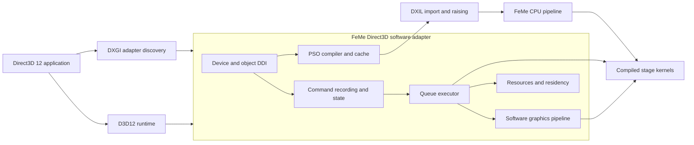
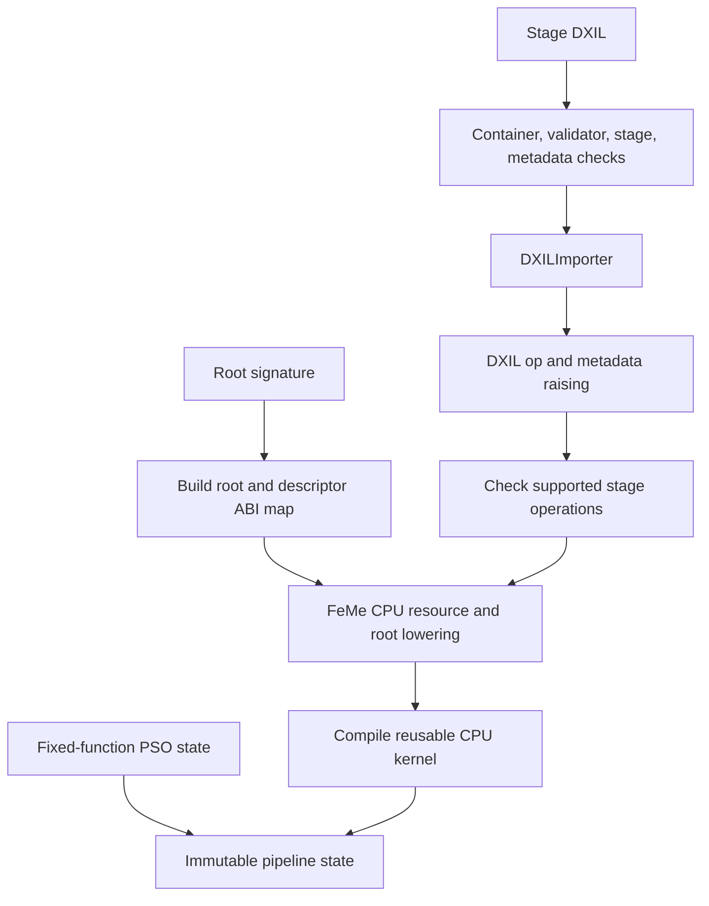

# FeMe Direct3D Software Adapter Design

## Status

This design defines a full-featured Direct3D 12 software adapter using FeMe's
CPU target as its shader execution engine. The completed adapter targets the
same reference, compatibility, testing, headless, and software-rendering use
cases for which applications select the Windows Advanced Rasterization
Platform (WARP). Its product baseline is complete feature level 12_2 behavior,
including conventional graphics, mesh shading, variable-rate shading, sampler
feedback, and DXR 1.1, plus separately reported post-12_2 capabilities where
the selected Windows runtime and DDI expose them.

This is not a compute adapter with graphics left as an optional extension.
Compute-only bring-up remains a useful implementation checkpoint, but every
public interface, ABI, resource model, and scheduling decision must be
compatible with the completed graphics, presentation, and ray-tracing driver.
The adapter reports only capabilities which have reached their required
behavioral and validation threshold; the implementation plan may be staged,
but the architecture and product contract are full-featured from the outset.

This document uses "WARP replacement" as shorthand for that role. It does not
assume that a third-party component can replace Microsoft's WARP binary or
intercept `D3D_DRIVER_TYPE_WARP`/`IDXGIFactory4::EnumWarpAdapter`. Those are
Windows-owned selection paths, not documented registration points for an
arbitrary software renderer. The first deployment target is therefore a
separately installed software adapter which applications enumerate through
DXGI and select explicitly. Transparent substitution, if it is required, is a
separate deployment problem and may require an application-facing compatibility
runtime rather than a display driver.

The shader compiler and execution machinery described in
[FeMeCPUDesign.md](FeMeCPUDesign.md) already imports DXIL and executes compute
shaders. The work designed here is the Direct3D/DXGI runtime, a software
graphics pipeline, and the FeMe CPU-target changes required to execute all
Direct3D shader stages. Like the expanded Vulkan ICD in
[FeMeVulkanDesign.md](FeMeVulkanDesign.md), the design includes complete
resource and synchronization semantics, rasterization, texture sampling,
format conversion, depth/stencil, blending, advanced shader stages, ray
tracing, and presentation interoperability.
The API-neutral core, CPU stage ABI, image/sampler, and software-executor
portions of that work are factored into
[FeMeGraphicsDesign.md](FeMeGraphicsDesign.md); this document owns their
Direct3D mapping and Windows deployment.

FeMe's DXIL path is further along than its SPIR-V path, but the CPU target is
not ready to back a Direct3D device today. The prerequisites below gate the
milestones at the end of this document, and all but the last are shared with
the Vulkan design rather than specific to Direct3D:

- ~~`feme::cpu::JITEngine` has no unit of work smaller than a whole dispatch.
  It runs every group sequentially on the calling thread and accepts but
  ignores `JITOptions::NumThreads`, so a command-queue executor needs the
  per-workgroup API the Vulkan design proposes.~~ (closed by roadmap R21:
  `feme::cpu::CompiledStage::invokeGroup` is that per-workgroup API, shared
  unchanged with the Vulkan design under FeMeGraphicsDesign.md's
  `CompiledStage` name, and `JITOptions::NumThreads` now runs a real worker
  pool; see FeMeVulkanDesign.md's "CPU Runtime API Changes" Status note)
- Root-constant lowering exists only in the narrow shape roadmap step R12
  landed: `feme::cpu::RootConstantLoweringPass` handles the default
  `(b0, space0)` binding, a non-array `dx.CBuffer`, and a constant row index,
  and `ResourceInfo::RootConstantSize` is populated from it. Any other
  register binding, an array, or a dynamic row index is still unsupported, and
  `feme::cpu::BoundResourceNormalizationPass` deliberately does not normalize
  constant buffers. Root constants and CBVs remain a multi-pass CPU-target
  change, not a frontend mapping.
- Groupshared lowering accepts only *uniform* indices, which excludes the
  `SV_GroupIndex`-indexed `groupshared` arrays that ordinary compute shaders
  use.
- `feme::cpu::ArtifactInfo`'s wave size, thread-group dimensions, and
  groupshared size/alignment fields exist in artifact ABI version 2 but are
  always written as zero.
- The CPU target is compute-only. `FemeDispatchArgs` describes a dispatch, not
  a shader stage with per-invocation inputs and outputs, and no `FemeDescriptor`
  field describes an image or a sampler. Every graphics stage below therefore
  needs new ABI, not only new runtime code.

The FeMe-side prerequisites above, and this document's milestones, are
scheduled against the rest of FeMe in [Roadmap.md](Roadmap.md) (§1.10 and
§3.3).

## Summary

FeMe should provide a Windows software adapter whose user-mode driver accepts
the complete Direct3D 12 command and DXIL surfaces required by feature level
12_2, lowers shaders through FeMe's existing DXIL importer and CPU pipeline,
and executes commands against host memory. The adapter is exposed through DXGI
with a distinct identity and is selected by applications as a software or
explicitly named adapter.

Implementation begins by validating device creation and headless compute
because those isolate the reusable object, compiler, queue, and synchronization
layers. That bring-up device is a development configuration, not the product
definition. The shipping architecture is a unified software graphics adapter:
programmable stages are compiled by FeMe; fixed-function graphics, ray
traversal, resource management, and Direct3D semantics live in API-neutral
graphics/ray-tracing cores plus the Direct3D runtime.



The Direct3D layer owns API semantics: object lifetime, root signatures,
descriptor heaps, resource states, command ordering, residency, tiled-resource
behavior, and graphics fixed function. FeMe continues to own shader semantics
and CPU code generation. FeMe must not acquire knowledge of `ID3D12Resource`,
DXGI adapters, command allocators, or Windows presentation objects.

## Goals

- Expose a truthful Direct3D 12 software adapter through DXGI on Windows.
- Deliver complete feature level 12_2 behavior rather than a representative
  subset of WARP workloads.
- Support the full conventional graphics pipeline, mesh/amplification shaders,
  DXR 1.1, variable-rate shading, sampler feedback, tiled resources, and the
  other capabilities required by feature level 12_2.
- Add independently queried modern capabilities, including enhanced barriers,
  later shader models, and Work Graphs, when the chosen runtime/DDI supports
  them and their feature-specific validation passes.
- Use headless compute only as an internal bring-up configuration which cannot
  constrain the final graphics-capable architecture.
- Consume application DXIL directly through `feme::DXILImporter`; do not
  translate through SPIR-V, NIR, or another shader compiler IR.
- Reuse FeMe's DXIL raising, optimization, CPU lowering, runtime helpers, and
  JIT/AOT infrastructure.
- Implement root signatures and Direct3D descriptor heaps directly over
  FeMe's resource and root-constant ABI.
- Preserve deterministic, specification-correct execution suitable for tests
  and differential comparison, with an optional performance-oriented mode only
  where it does not change observable results.
- Support concurrent devices, command queues, and pipeline compilations without
  mutable process-global FeMe state.
- Fail malformed DXIL, hostile object sizes, and unsupported features cleanly
  without exposing arbitrary host memory.
- Keep shader lowering independent of the rasterizer, ray traversal engine,
  and Direct3D object model.
- **Reach a Direct3D 12 compliance target equivalent in scope to the Vulkan
  ICD's conformance target**
  ([FeMeVulkanDesign.md](FeMeVulkanDesign.md)'s "Conformance Target": full
  Vulkan 1.4 including compute, graphics and ray tracing) — see
  "Conformance Target" below.

## Conformance Target

The Vulkan ICD's target is full Vulkan 1.4 conformance across compute,
graphics, and ray tracing. Direct3D has several distinct validation and
qualification mechanisms rather than one Khronos-style conformance submission,
so this design defines completion in corresponding Direct3D terms.

The minimum completed product reports **feature level 12_2** explicitly and
implements every capability that level requires. Feature level 12_2 is not
inferred from a collection of individual feature queries and does not imply
post-12_2 features or any performance level. Its required capability matrix
includes:

| Capability | Feature level 12_2 minimum |
|---|---|
| Driver/runtime baseline | WDDM 2.0-compatible D3D12 path |
| Shader model | 6.5 |
| Ray tracing | `D3D12_RAYTRACING_TIER_1_1` |
| Variable-rate shading | Tier 2 |
| Mesh shaders | Tier 1 |
| Sampler feedback | Tier 0.9 |
| Resource binding | Tier 3 |
| Tiled resources | Tier 3 |
| Conservative rasterization | Tier 3 |
| Root signatures | Version 1.1 |
| Shader and raster features | Wave operations, 64-bit integer shader operations, output-merger logic operations, depth bounds, fully typed format casting, unaligned block textures, and viewport/render-target array indices from any shader feeding the rasterizer without geometry-shader emulation |
| Commands and queries | Direct/compute/bundle `WriteBufferImmediate` support and copy-queue timestamp queries |
| GPU virtual addressing | At least 40 bits per resource and per process in 64-bit processes |

The implementation must maintain the normative feature-level table from the
selected SDK/WDK as checked data rather than relying on this summary. In
particular, resource heap tier is queried and tested independently; Resource
Heap Tier 2 is not an implied feature-level 12_2 capability.

Capabilities introduced or expanded independently of feature level 12_2 are a
second, equally intentional part of the high-feature design:

- **Enhanced barriers** are supported and reported through their dedicated
  options query and DDI only after split barriers, texture layouts, queue
  ownership, and discard semantics pass targeted tests.
- **Later shader models** are negotiated independently of feature level. The
  adapter supports the highest shader model implemented by FeMe and the
  selected runtime, with decreasing-version query behavior and per-model DXIL
  validation.
- **Work Graphs** are implemented as an independently tiered execution model
  over the shared scheduler, including backing-memory, node-record, recursion,
  and ordering semantics. They are not presented as an implication of 12_2.
- Later D3D12 options and tier revisions are added to a versioned capability
  inventory. No option bit is enabled merely because a CPU implementation
  appears able to emulate it.

Completion requires separate evidence:

1. The applicable Microsoft Direct3D 12 runtime conformance tests pass for
   each reported feature level.
2. The applicable graphics-driver HLK playlists pass for the installed-adapter
   deployment and all reported capabilities match observed behavior.
3. FeMe's focused unit, differential, stress, robustness, and cross-API tests
   pass for the same capability inventory.
4. "Windows Certified," "WHCP-qualified," and "WHQL-signed" are used only
   after the corresponding Microsoft Partner Center process succeeds. They are
   not synonyms for Direct3D behavioral compliance.

Three consequences follow, and they are the reason this section exists
rather than a single "be conformant" bullet:

1. **The equivalence is in the graphics/ray-tracing core, not the API
   layer.** G3–G8 are shared; what is Direct3D-specific is the object
   model, root signatures/descriptor heaps, resource states, DXGI, and the
   capability-reporting rules above. A Vulkan conformance gap traced into
   `feme::graphics`/`feme::raytracing` is a Direct3D gap too, and vice
   versa; the roadmap tracks it once.
2. **Shared-core sequencing may be Vulkan-first, deliberately.** The Vulkan
   CTS is runnable on this project's Linux hosts today, and the HLK is not
   (there is no Windows CI in this tree at all — see
   [Roadmap.md](Roadmap.md) §1.10). Driving the shared core to conformance
   through the CTS first is what makes the Direct3D target reachable at
   all. This affects implementation order, not the Direct3D product baseline.
3. **The honesty rules are identical.** No feature level, capability bit,
   or tier is reported before the tests behind it pass; no conformance is
   claimed in the adapter description string, documentation, or
   distribution name before the specific conformance, HLK, and project test
   evidence stated above exists to back it.

## Scope Boundaries and Bring-up Non-Goals

- Replacing Microsoft's signed WARP binaries or claiming that
  `D3D_DRIVER_TYPE_WARP` selects FeMe.
- Binary compatibility with undocumented WARP internals.
- Direct3D 11, Direct3D 10, or DXBC execution in the first implementation.
  D3D11-on-12 is the preferred eventual route for older APIs; native D3D11 DDI
  support is a separate design if that route proves insufficient.
- Hardware acceleration or forwarding work to another GPU.
- Video decode/encode/processing and DirectML-specific acceleration. These are
  separate API and scheduling designs; compute shaders used by DirectML remain
  supported as ordinary D3D12 workloads.
- Graphics, ray tracing, mesh/amplification shaders, and presentation in the
  first executing checkpoint. They remain mandatory product scope and their
  exclusion from early bring-up does not permit incompatible interim designs.
- Claiming D3D12 conformance, a feature level, or WARP performance parity
  before the corresponding tests pass. Reaching that conformance is the
  target of the section above; asserting it early is what is forbidden.
- Matching WARP's undocumented scheduling, floating-point implementation
  details, or output in cases where Direct3D permits multiple results.
- Supporting arbitrary application-supplied native code in pipeline libraries
  or caches. Cached executable code is accepted only after a separate trusted
  cache format and validation design exists.

## Replacement and Deployment Model

There are three materially different products that can be called a WARP
replacement:

1. **An installed Direct3D software adapter.** Applications enumerate it with
   DXGI and pass the selected adapter to `D3D12CreateDevice`. This is the target
   of this design, subject to confirming the supported Windows driver/DDI path.
   `IDXGIFactory::CreateSoftwareAdapter` loads a DLL implementing a complete
   driver interface and emulating required kernel graphics behavior. Public
   documentation does not provide a supported modern D3D12 third-party
   software-adapter recipe, but W0 must test whether this path can satisfy the
   selected runtime/DDI rather than dismissing it by assumption.
2. **An application-local compatibility runtime.** A replacement or forwarding
   `d3d12.dll`/DXGI-facing layer can make unmodified application calls reach a
   FeMe implementation in controlled test environments. This has deployment,
   API-coverage, and system-DLL redirection constraints and is not the primary
   architecture.
3. **Transparent replacement of system WARP.** The public API does not offer a
   provider registration mechanism for the built-in WARP selector. This design
   does not rely on such a mechanism.

The first prototype must resolve the exact supported Windows integration
contract before runtime implementation begins. D3D12's device driver interface
is versioned with Windows and the WDK; it is not equivalent to implementing the
public `ID3D12*` interfaces. The prototype should answer:

- Whether a render-only or software display adapter can be installed and
  enumerated on each target Windows version without a physical display device.
- Which driver model applies. Microsoft Compute Driver Model is useful only
  for a separate `D3D_FEATURE_LEVEL_1_0_CORE` compute prototype: it cannot host
  the graphics pipeline or presentation and therefore cannot be the foundation
  of the product designed here. W0 must establish a WDDM graphics path before
  product implementation proceeds.
- Which kernel-mode/display-miniport component, INF metadata, and test-signing
  workflow Windows requires even when all rendering occurs in user mode.
  Attestation signing is suitable for testing under current policy; retail
  Windows certification and distribution require the applicable HLK/WHCP
  submission and signing path.
- Which D3D12 DDI version is the smallest practical baseline and which headers,
  samples, and redistribution terms apply. The Agility SDK redistributes
  Microsoft's own runtime; it is not a hosting mechanism for third-party
  drivers.
- Whether the adapter can be made available in CI and developer machines
  without test-signing the whole system.

If that investigation shows that a generally installable adapter is not a
viable developer workflow, the first frontend should be an application-local
D3D12 compatibility runtime. The object model, shader compiler, command
executor, and software graphics pipeline below remain reusable; only the
Windows-facing boundary changes.

## Reference Model

The implementation has four independent contracts:

1. DXGI discovery, adapter identity, capabilities, and memory reporting.
2. The versioned D3D12 runtime/driver interface or, for a compatibility
   runtime, the public COM interface behavior.
3. Direct3D object and execution semantics.
4. Shader semantics encoded in DXIL and shader model metadata.

Microsoft's WARP behavior and the D3D12 reference rasterizer are useful
differential oracles, but observable agreement with them does not replace the
Direct3D specification or conformance tests. Open-source implementations such
as Mesa's D3D12 frontend and vkd3d-proton are valuable references for API and
DXIL behavior, but neither provides the proposed Windows software-adapter
boundary or FeMe CPU backend.

Primary references to pin to the selected WDK/SDK version during the prototype:

- Microsoft Direct3D 12 programming guide and functional specification.
- The normative Direct3D 12 feature level 12_2 capability and validation
  specification.
- Direct3D 12 DDI documentation and WDK headers.
- DirectX specifications for ray tracing, mesh shaders, variable-rate shading,
  sampler feedback, enhanced barriers, Work Graphs, resource binding, and each
  advertised shader model.
- DXGI adapter enumeration, software adapter, and residency documentation.
- DirectX Shader Compiler documentation and the DXIL specification.
- D3D12 runtime conformance tests, debug layer, DRED, Windows Hardware Lab Kit,
  and Windows Hardware Compatibility Program documentation.
- Mesa D3D12 and vkd3d-proton source as implementation references.

## Project and Binary Boundaries

A tentative source layout is:

```text
feme/
  include/feme/Direct3D/       Shared compiler/runtime interfaces, if any
  lib/Direct3D/                D3D12 objects, commands, and software pipeline
  lib/Direct3D/Windows/        DDI, DXGI, adapter, and OS integration
  test/Direct3D/               Lit tests with small D3D12 clients
  unittests/Direct3D/          Object, state, descriptor, and raster tests
```

The Direct3D component is Windows-only and optional. It depends on a selected
Windows SDK and WDK plus FeMe, LLVM, MLIR, and platform threading/dynamic-library
support. OS-facing code stays in `lib/Direct3D/Windows`; command execution,
resource layout, and software graphics code should remain portable enough to
unit test on non-Windows hosts.

The adapter is loaded into application processes which may already contain
other LLVM users, including DXC. It must statically link its private LLVM,
MLIR, and FeMe components, hide all non-DDI symbols, avoid `llvm::cl` option
registration, and initialize unavoidable LLVM target state exactly once. The
exported symbol set must be generated or checked against the selected DDI
contract.

## Object Model

The runtime maps Direct3D objects onto immutable descriptions and explicit
execution state:

| Direct3D object | FeMe adapter responsibility |
|---|---|
| Adapter | Identity, feature queries, node count, memory budgets |
| Device | Object creation, compiler service, queues, worker pool |
| Command queue | Ordered submission, fence signals, device removal state |
| Command allocator/list | Reusable storage and typed recorded command stream |
| Fence | Last signaled 64-bit value, pending waits, host event integration |
| Heap/resource | Host allocation, placed/committed layout, mapping, state |
| Descriptor heap | CPU records plus shader-visible compact descriptor slots |
| Root signature | Parameter layout, visibility, static samplers, ABI map |
| Pipeline state | Compiled stage kernels plus fixed-function state |
| Pipeline library | Validated cache of pipeline descriptions/artifacts |
| Query heap | Typed result slots resolved into a buffer by `ResolveQueryData` |
| Command signature | Validated indirect-command decoding plan |

COM identity and lifetime belong at the public-runtime boundary. A DDI-backed
implementation instead follows runtime-owned handle and callback rules. The
portable core should not expose either ownership model; it consumes validated
descriptions and returns explicit errors.

The first device exposes one node. Multi-adapter, linked-node, cross-adapter,
protected-session, and hardware-protected resource features report unsupported.

Direct3D 12 has no equivalent of a Vulkan queue-family advertisement, so a
graphics-capable adapter cannot describe itself as compute-only. Unless the
adapter is a compute-only device at `D3D_FEATURE_LEVEL_1_0_CORE`, direct
queues, allocators, and command lists must be creatable from the first
milestone. The compute prototype creates them, records the compute/copy command
subset, and fails graphics pipeline-state creation cleanly.

## Capabilities and Feature Reporting

Feature support is a contract. Every `CheckFeatureSupport` result, resource
limit, format capability, shader model, root-signature version, and command-list
tier must be backed by focused tests.

Capability state is represented as one immutable, test-generated support
profile containing:

- minimum Windows build and WDDM version;
- D3D12 DDI version;
- inbox or Agility SDK runtime identity and version;
- maximum feature level and shader model;
- root-signature version;
- every applicable `D3D12_OPTIONS*` result and feature tier;
- per-format `FORMAT_SUPPORT1`/`FORMAT_SUPPORT2`, multisample-quality, and
  plane-count results; and
- queue, node, memory, residency, and GPU virtual-address limits.

The installed adapter and compatibility-runtime frontend consume the same
profile. A profile is generated only from named tests and cannot contain
hand-maintained optimistic overrides. The development profile may initially
report a lower feature level while subsystems are brought up, but release
completion requires the full feature level 12_2 profile defined above.

Specific reporting rules include:

- Shader model 6.5 is part of the 12_2 baseline. Later shader models are
  exposed only after their new DXIL operations, validation rules, metadata, and
  execution semantics are implemented. Queries from runtimes newer than the
  adapter must return the specified `E_INVALIDARG`/retry behavior rather than
  guessing.
- An application that supplies DXBC fails pipeline-state creation with a clear
  result rather than being silently mishandled. D3D11-on-12 is the preferred
  compatibility path for DXBC-era APIs.
- Wave lane count is pinned device-wide, and the reported
  `WaveLaneCountMin`/`WaveLaneCountMax` must match FeMe's compile-time wave
  size policy. A shader model that lets a shader request a wave size is
  advertised only once that request is honored or rejected explicitly.
- Root Signature 1.1 and Resource Binding Tier 3 are release requirements.
  Unbounded ranges, directly indexed heaps, and non-uniform per-lane
  descriptors are therefore core ABI requirements, not optional follow-up.
- The format table is operation-specific. A format is not advertised for
  sampling, filtering, typed load/store, render target, blend, depth/stencil,
  multisampling, resolve, display, or atomic access until that exact operation
  is tested.
- UMA and cache-coherent UMA reporting must match actual map/visibility
  behavior. A software adapter is not automatically entitled to report every
  UMA capability.
- Tiled Resources Tier 3, Conservative Rasterization Tier 3, VRS Tier 2, mesh
  shaders, sampler feedback, DXR 1.1, copy-queue timestamps, and the remaining
  12_2 requirements are mandatory release gates.
- Enhanced barriers, Work Graphs, later shader models, and later option tiers
  are independently enabled in profiles whose runtime/DDI baseline supports
  them.

Adapter vendor/device IDs and LUIDs are ecosystem-visible. The implementation
must not impersonate Microsoft or WARP. It needs an allocated identity for
distribution and a deterministic development identity for tests. Pipeline
cache identity includes the FeMe ABI, LLVM version, target triple, host CPU
feature policy, wave size, and adapter build.

## Shader and Pipeline Compilation

Pipeline-state creation validates the root signature and fixed-function state,
imports each DXIL stage through `feme::DXILImporter`, raises `dx.op` calls and
metadata, verifies supported operations, and compiles an immutable CPU kernel.



All programmable stages use explicit stage ABIs rather than pretending every
stage is a compute kernel:

- Vertex shaders consume vertex/instance IDs and input-assembler attributes
  and produce position plus interpolants.
- Hull and domain shaders require patch storage, tessellation factors, and a
  software tessellator.
- Geometry shaders require variable output streams and primitive assembly.
- Pixel shaders consume interpolated attributes, derivatives, coverage/sample
  state, and helper-lane semantics, and produce color/depth/stencil outputs.
- Mesh and amplification shaders exchange task payloads, mesh vertices,
  primitives, culling data, and topology through bounded workgroup-local output
  storage before entering the shared primitive pipeline.
- Ray-generation, miss, closest-hit, any-hit, intersection, and callable
  shaders use a continuation-capable ABI carrying ray, hit, payload, attribute,
  shader-table, and local-root-signature state.
- Work Graph nodes consume and produce bounded node records through scheduler
  queues and backing memory; they are not lowered to unconstrained recursive
  host calls.

Each compiled stage owns the `feme::Context` and code object needed for its
lifetime. Concurrent PSO creation uses independent contexts. Pipeline state
cache keys include every shader byte, root signature, relevant PSO field,
compiler/runtime ABI version, CPU policy, and robustness option.

DXIL validation is a distinct concern from parsing. The adapter must determine
which signed/validated containers the D3D runtime guarantees and which inputs
it must validate itself. FeMe import succeeding is not evidence that a module
is valid DXIL or legal for the selected shader model.

## Root Signatures and Descriptor Heaps

Direct3D maps naturally onto FeMe's CPU ABI, but the mapping must preserve
Direct3D visibility, range, and volatility rules.

- Root constants become a submission-local root-constant byte block.
- Root CBV/SRV/UAV descriptors become bounds-checked `FemeDescriptor` records.
  A root descriptor is a bare GPU virtual address with no size, so the runtime
  must recover the owning resource's range to fill `SizeInBytes`. It must not
  fabricate an unbounded descriptor or set `FEME_DESCRIPTOR_TRUSTED` to avoid
  the lookup.
- Descriptor tables map each declared range to a contiguous physical FeMe heap
  range, preserving register, space, count, and append/explicit offsets.
- Static samplers become immutable pipeline metadata.
- Shader-visible CBV/SRV/UAV and sampler heaps remain distinct.
  `FemeDispatchArgs` already reserves a separate `SamplerHeap` pointer and
  count, but no `FemeDescriptor` field describes a sampler, so that heap stays
  empty until the sampler ABI lands in W2. At most one shader-visible heap of
  each type is bound at a time, and the heap size limits of the reported
  binding tier are part of the contract.
- Root Signature 1.1 volatility/static flags control when descriptor contents
  and referenced data may be cached. Treating every descriptor as volatile is
  a correct bring-up policy, but the final implementation must still preserve
  the stronger promises and invalid-use rules attached to static data.
- Direct heap indexing implements both resource and sampler heap builtins with
  per-lane non-uniform selection, bounds checks, and lifetime tracking.
- DXR global and local root signatures share the same validated layout engine;
  local arguments are decoded from shader records and cannot point outside the
  owning shader table.

The runtime stores source Direct3D descriptors, not raw `FemeDescriptor`
objects. At draw/dispatch preparation it snapshots the descriptors used by the
pipeline, resolves resource addresses and ranges, and materializes the compact
physical heap. This is required for descriptor copies, placed-resource aliasing,
heap rebinding, and resource lifetime checks.

That preparation happens on the queue timeline when the command executes, not
when it is recorded. Direct3D permits an application to write descriptors after
recording and before execution, and Root Signature 1.0 treats every descriptor
as volatile, so a record-time snapshot would read stale contents. Descriptors
changed while a queue may be executing a command that reads them remain
application error; the snapshot point does not repair that, it only stops the
runtime from creating the problem itself.

FeMe root-constant lowering covers only the default `(b0, space0)`, non-array,
constant-row-index shape, and constant-buffer handling is otherwise
incomplete. These are prerequisites for general D3D12 applications, not
frontend-only translation work. The first executing shader may therefore use
only bound raw/structured buffers and builtins; general root constants and
CBVs are a separate milestone.

## Memory, Resources, and Residency

Committed, placed, and reserved resources all reduce to host allocations plus
validated layout metadata, but their API behavior remains distinct.

- Upload, readback, and default heaps are separate API classes even if they
  share physical host memory.
- `Map` returns stable pointers only where the heap/resource contract permits.
- Placed resources retain heap-relative offsets and aliasing relationships.
- Reserved resources use sparse page tables with explicit tile mappings,
  null-tile behavior, packed-mip handling, and queue-ordered mapping updates.
  Tiled Resources Tier 3 is a feature level 12_2 release requirement.
- Resource descriptions use checked arithmetic for dimensions, mip chains,
  plane counts, alignments, and subresource footprints.
- Resource-state tracking validates and orders accesses; it is not erased just
  because CPU memory is coherent.
- Residency starts as a coarse budgeted model in which resident allocations
  are host allocations charged to the adapter. Eviction may retain a backing
  store, but must preserve contents and fence ordering.
- Shared heaps/resources and shared fences use validated NT handles and the
  selected WDDM lifetime model. Cross-adapter resources preserve the restricted
  layouts, flags, and synchronization rules visible to both adapters.
- Acceleration structures are opaque resources with explicit prebuild sizing,
  alignment, build/update/compaction state, and post-build information.
- Sampler-feedback maps preserve region granularity, mip-region encoding, and
  resolve semantics independently of the texture's private software layout.

Textures use a canonical internal layout plus explicit copy-footprint
conversion. The layout should optimize software sampling and raster writes
without exposing private tiling through public row-major footprints. Format
support must account for typed load/store, sampling, filtering, render-target,
depth/stencil, blend, multisample, resolve, video/display interoperability, and
copy capabilities independently.

Every shader memory access remains host-bounds checked even where Direct3D
does not promise a defined out-of-bounds value. Undefined GPU results must not
become arbitrary reads or writes in the application's CPU address space.

## Commands, Queues, and Synchronization

Command lists record typed commands into command-allocator-owned storage. They
do not execute at record time. Closing a list performs structural validation
and freezes the stream; submission creates execution-local state so the same
closed list can be submitted again when Direct3D permits it.

The command model covers direct, compute, copy, and bundle command-list
semantics; graphics and compute pipeline/root-signature binding; descriptor
heaps and root parameters; draws, dispatches, mesh dispatches, rays, and Work
Graphs; direct and indirect execution; all resource copy/resolve operations;
queries, predication, markers, and fence signaling. Unsupported commands are a
development-profile limitation, not an omitted release surface.

Legacy resource barriers and enhanced barriers lower to one internal dependency
model. It represents synchronization scope, access scope, queue ownership,
subresource or byte range, texture layout, split begin/end state, aliasing, and
discard. Legacy state promotion and decay remain frontend rules; enhanced
barriers must not be approximated as global queue drains once advertised.

Each command queue is ordered. Independent thread groups within one dispatch
run on a device worker pool; the queue waits for all groups before advancing to
a dependent command. Initial resource barriers use coarse join semantics:
complete prior worker tasks, issue the required host fences, update tracked
states, then continue. Finer per-resource scheduling is an optimization.

Fence values are 64-bit but are not required to be monotonic: a signal from
either timeline may set any value, including a lower one, and a wait is
satisfied when the value reaches or exceeds its target. The implementation
stores the last signaled value, re-evaluates pending waits on every signal, and
must not assume an ordering only the application can provide. Host waits
integrate with Windows event handles, including waits on multiple fences.
Queue execution errors latch device removal, capture diagnostic context, wake
pending waits, and make subsequent calls return the appropriate removed-device
status. DRED-style breadcrumbs and page-fault information should be designed
into the command stream and resource tracker early even if full OS reporting
lands later.

## Software Graphics Pipeline

Graphics is a runtime subsystem around FeMe-compiled programmable stages:

```text
input assembly -> vertex shading -> optional tessellation / geometry shading
                              or
amplification shading -> mesh shading
                              |
                              v
  -> primitive assembly and clipping
  -> viewport transform and binning
  -> tile rasterization and interpolation
  -> pixel shading
  -> depth/stencil, blending, and render-target stores
```

The initial graphics path should use tiled rasterization. Primitive setup bins
screen-space primitives into fixed-size tiles; worker tasks process independent
tiles to avoid fine-grained synchronization on render targets. Within a tile,
quad-based pixel shader execution provides derivatives and helper lanes.

Correctness requirements include top-left fill rules, clipping, guard bands,
perspective-correct and centroid/sample interpolation, primitive and sample
coverage, helper-lane side-effect suppression, early/late depth and stencil,
dual-source blending, logic operations, sRGB conversion, NaN behavior, and
multisample resolve. The rasterizer also implements conservative rasterization
Tier 3, programmable sample positions where reported, and VRS Tier 2
combiners, shading-rate images, and per-primitive rates. Rasterizer-ordered
views are ordering requirements on the tile scheduler, not a descriptor
property, even though `FemeDescriptor` already reserves
`FEME_DESCRIPTOR_ROV`. These belong to focused raster/format tests rather than
being inferred from image comparisons alone.

Texture sampling needs a dedicated image/sampler descriptor ABI and runtime
helpers for addressing, mip selection, filtering, comparison, gather, and
format conversion. It should not be forced into FeMe's existing buffer
descriptor representation.

## Ray Tracing and Work Graphs

DXR 1.1 is part of the feature level 12_2 baseline, not an optional experiment.
The Direct3D layer implements state objects and collections, shader identifiers,
shader tables and local root arguments, acceleration-structure build/copy/
compaction commands, ray dispatch, inline ray queries, and all required
geometry and instance forms. The API-neutral implementation in
[FeMeGraphicsDesign.md](FeMeGraphicsDesign.md) owns BVH construction and
traversal, intersection, continuation scheduling, and robustness; this layer
owns Direct3D state-object association, resource-state, command, and DXIL
mapping.

Traversal may use a deterministic high-quality CPU builder by default and a
faster builder as an optimization, but build flags, update eligibility,
serialization compatibility, post-build sizes, instance masking, culling, and
any-hit ordering remain API-visible behavior. Acceleration structures and
shader tables are validated before generated code can dereference them.

Work Graphs are a post-12_2, independently reported feature track. The runtime
models graph executables, program identifiers, backing-memory requirements,
entrypoint records, node-local and shared inputs, output record allocation,
recursion/depth limits, and dispatch modes explicitly. Graph scheduling reuses
the queue worker pool but must preserve the ordering and forward-progress rules
of the reported Work Graphs tier. Generic programs or later graph revisions
are added only when their separately versioned DDI and shader semantics are
implemented.

## Presentation and DXGI Interoperability

Headless resources and command execution do not require presentation during
bring-up, but desktop interoperability is part of the completed software
adapter. W0 must determine whether the driver can participate in DXGI swap
chains directly or must present by sharing/copying completed frames to a
display adapter. Off-screen-only operation is a supported mode, not a
substitute for resolving the product's presentation path.

Cross-adapter presentation introduces shared-resource handles, synchronization
with another adapter, format/modifier compatibility, and ownership transitions.
It must be designed against the actual WDDM/DDI contract. A CPU copy into a
display-adapter upload resource is a valid first prototype, but it is not
assumed to satisfy all flip-model, fullscreen, composition, or protected-content
requirements.

The presentation validation matrix covers flip-model swap chains, composition,
resize and buffer rotation, occlusion, color space and HDR metadata where
reported, tearing, frame-latency waitable objects, fullscreen behavior, device
removal, and transitions between render, copy, shared, and present ownership.
Protected content remains unsupported unless an end-to-end protected path can
be provided truthfully.

## Determinism and Reference Behavior

Reference use benefits from a mode that fixes all implementation-controlled
choices:

- Pin worker count, tile traversal, wave size, and reduction order.
- Disable reassociation, contraction, and host-dependent fast-math unless DXIL
  explicitly permits them.
- Initialize internal padding and temporary storage.
- Use deterministic pipeline cache keys and diagnostics.
- Serialize unordered atomics only when the API permits doing so and document
  that this cannot make an inherently racy shader deterministic.

The default adapter should remain specification-correct under parallel
execution. Deterministic mode is an execution policy, not a different shader
semantic model, and cannot promise identical values where the specification
leaves behavior undefined.

## Error Handling and Security

Applications supply untrusted DXIL, serialized root signatures, pipeline
libraries, descriptor contents, indirect arguments, resource dimensions, and
command counts. The adapter must:

- Use checked arithmetic for every allocation, footprint, descriptor offset,
  command-stream growth, and dispatch/draw product.
- Cap compiler time/memory and runtime work according to reported limits.
- Fuzz DXIL import, root-signature parsing, pipeline-cache parsing, descriptor
  translation, indirect-command decoding, and texture footprint calculations.
- Reject unsupported DXIL operations before executable code is produced.
- Keep generated code from calling arbitrary process symbols.
- Bounds-check all resource accesses unless a complete range is statically
  proved safe.
- Convert asynchronous failures into device removal without deadlocking queues
  or host fence waits.
- Route diagnostics through the D3D12 debug layer, DRED, or an explicit test
  callback; reusable libraries never print or mutate global diagnostic state.
  The debug layer and DRED are runtime components above the driver, so they are
  available to an installed adapter but would have to be reimplemented by an
  application-local compatibility runtime. The explicit callback is the only
  channel both deployments share.

Pipeline caches and libraries are attacker-controlled files in practice. The
first implementation stores validated descriptions or compiler-independent IR,
not executable object bytes. Persistent native-code caching requires a versioned
format, complete bounds validation, a strong digest, exact adapter/compiler
identity matching, and an option to disable loading it entirely.

## Threading Rules

- Each concurrent pipeline compilation uses its own `feme::Context`; compiled
  kernels own the contexts and code objects they require.
- Device objects share no mutable FeMe context.
- Command lists are immutable while executing; all cursors and bound state are
  submission-local.
- Compiled kernels and PSO metadata are immutable and may be invoked by many
  worker threads.
- Descriptor and root-argument snapshots remain alive until the associated
  queue work completes.
- Queue locks are never held while waiting on fences another queue must signal.
- LLVM target initialization is guarded once, and no LLVM/MLIR symbols escape
  the adapter binary.

## Implementation Milestones

### W0: Integration feasibility prototype

- Select supported Windows SDK, WDK, DDI, and minimum OS versions.
- Prove either that a software/render-only adapter can be installed and
  enumerated by DXGI, or select the application-local compatibility-runtime
  boundary instead.
- Document signing, INF, CI, and debugging requirements.
- Expose one adapter with truthful identity and feature queries, but no shader
  execution.

This milestone gates all Windows-facing implementation. It should be a small
throwaway-capable prototype because choosing the wrong integration boundary
would invalidate most object-layer work.

### W1: Full-architecture device and compute bring-up

- Implement device, queue, command allocator/list, fence, heap, buffer, and
  pipeline objects with the ownership and extensibility required by the final
  graphics adapter. Execute compute/copy commands first, but create the direct
  queue and graphics-capable device through the W0 product boundary.
- Import and raise DXIL through the existing FeMe path.
- ~~Factor reusable per-thread-group invocation and prepared-dispatch state
  out of `feme::cpu::JITEngine`, shared with the Vulkan design.~~ (closed by
  roadmap R21: `feme::cpu::CompiledStage`/`PreparedDispatch`, see the
  prerequisites list above)
- Populate `ArtifactInfo`'s wave size, group size, and groupshared fields.
- Execute a resource-free compute dispatch and verify builtin IDs.
- Verify workgroup barrier correctness for multi-wave groups under sequential
  wave execution within a group.
- Implement device-removal propagation and balanced object/allocation tests.
- Establish the generated capability-profile mechanism; the bring-up profile
  truthfully reports less than 12_2 and is never distributed as the completed
  adapter.

### W2: Complete resource, binding, and synchronization model

- Parse serialized Root Signature 1.0/1.1 data and implement descriptor heaps,
  tables, unbounded ranges, static samplers, root descriptors, direct heap
  indexing, and per-lane non-uniform selection.
- Complete FeMe root-constant and constant-buffer lowering.
- Implement divergent groupshared indexing in `feme::cpu`, without which
  ordinary `SV_GroupIndex`-indexed shaders cannot run.
- Complete raw, structured, and typed buffer operations, UAV counters, required
  atomics, and bounds behavior.
- Define image and sampler descriptor ABIs.
- Implement committed, placed, and reserved resources; texture layouts; copy
  footprints; views; residency; aliasing; and shared handles.
- Implement the complete sampling model and an operation-specific format
  matrix, including compressed, depth/stencil, planar, sRGB, multisample, and
  typed UAV cases required by the target profile.
- Implement direct/indirect execution, copies and resolves, queries,
  predication, legacy barriers, and the internal dependency model needed by
  enhanced barriers.

### W3: Complete conventional graphics

- Add input assembly, vertex shading, clipping, viewport transform, triangle
  setup, tile binning, quad rasterization, and pixel shading.
- Complete derivatives, interpolation modes, helper lanes, depth/stencil,
  blending, logic operations, multisampling, multiple render targets, stream
  output, indirect drawing, queries, and predication.
- Add hull, domain, and geometry stages plus the software tessellator.
- Complete rasterizer edge rules, NaN/precision behavior, clipping, viewport
  arrays, render-target arrays, and every advertised format/sample combination.
- Implement pipeline libraries and a validated persistent cache.
- Render the graphics corpus off-screen and compare against analytic
  references, WARP, and the Vulkan frontend over the shared graphics core.

### W4: Feature level 12_2 advanced graphics and resources

- Implement mesh and amplification shaders on the shared G6 stage model.
- Implement VRS Tier 2, sampler feedback Tier 0.9, Tiled Resources Tier 3,
  Conservative Rasterization Tier 3, depth bounds, typed-format casting, and
  the remaining feature level 12_2 raster/resource requirements.
- Complete Resource Binding Tier 3, Root Signature 1.1, required
  `WriteBufferImmediate` queue support, copy-queue timestamps, GPU virtual
  addressing minima, wave operations, 64-bit shader operations, and every
  required feature-level boolean.
- Generate a machine-readable gap report by comparing the implementation
  profile with the selected SDK's normative feature level 12_2 table.

### W5: DXR 1.1 and feature level 12_2 closure

- Implement acceleration-structure prebuild queries, build/update, compaction,
  copy/serialization operations, post-build information, and validation.
- Implement state objects and collections, shader identifiers and tables,
  global/local root signatures, ray dispatch, all ray-tracing shader stages,
  callable shaders, and continuation scheduling over the shared G7/G8 design.
- Implement inline ray queries and every `D3D12_RAYTRACING_TIER_1_1`
  requirement.
- Run the feature-level runtime conformance tests and report feature level 12_2
  only when W1-W5 and every generated capability-profile check pass.

### W6: Modern options, presentation, and compatibility

- Implement enhanced barriers on the shared dependency model.
- Implement the highest feasible post-6.5 shader model for the selected
  runtime/DDI and add Work Graphs, including the complete reported tier.
- Add newly selected D3D12 option tiers through the same inventory-and-test
  process; do not silently expand the release profile when SDK headers change.
- Complete direct or cross-adapter DXGI presentation, shared resources and
  fences, swap-chain behavior, and display interoperability established by W0.
- Validate Agility SDK and inbox-runtime combinations in the declared support
  matrix.
- Evaluate D3D11-on-12 coverage before considering a native D3D11 DDI.

### W7: Conformance readiness

The Direct3D counterpart of the Vulkan ICD's V9, and the milestone that
makes the full-feature product contract measurable rather than aspirational.

- Run the applicable Microsoft Direct3D 12 runtime conformance tests, graphics
  driver HLK playlists, and this project's portable execution tests against
  the exact capability profile the adapter reports.
- Reconcile every reported capability (feature level, tiers, format
  support table, shader model, runtime/DDI requirement, and optional feature)
  against what is actually implemented, the same way roadmap V9 reconciles the
  Vulkan inventories.
- Record the result alongside the Vulkan measurement of record, so a
  regression in the shared `feme::graphics`/`feme::raytracing` core is
  visible from either API's side.
- Complete WHCP/WHQL submission only if Windows certification and retail driver
  distribution are release goals; record it separately from behavioral
  conformance.

## Testing Strategy

Each milestone has five layers:

1. Portable unit tests for object state, layouts, root signatures, descriptors,
   commands, synchronization, formats, sampling, and raster rules.
2. Windows integration tests that enumerate the adapter and create a D3D12
   device through the selected runtime/DDI boundary.
3. End-to-end shader tests comparing buffers and images with scalar/analytic
   references and, where behavior is defined, WARP.
4. D3D12 debug-layer and DRED runs plus the applicable Microsoft runtime
   conformance tests.
5. Graphics-driver HLK runs for the installed-adapter deployment and explicit
   WHCP/WHQL qualification records when release policy requires them.

Required configurations include ASan/UBSan where supported, TSan on the
portable executor, forced allocation and compile failures, different host SIMD
widths, deterministic and parallel schedules, debug-layer validation, device
removal during queued work, and fuzzing of every serialized input surface.

The first acceptance test is intentionally small:

```text
enumerate and select the FeMe adapter
create a D3D12 device, compute queue, allocator, and command list
create upload/readback or mapped buffer resources
create a compute root signature and pipeline state from DXIL
bind resources, dispatch, close, execute, and signal a fence
wait and verify output bytes
release every object with allocation accounting balanced
```

The release acceptance test is the generated feature level 12_2 capability
profile: every required query has a passing focused test, every required
command and shader stage has end-to-end coverage, the applicable Microsoft
runtime conformance and HLK suites pass, and no unsupported optional feature is
reported. Post-12_2 profiles add the corresponding enhanced-barrier, shader
model, Work Graphs, and later-options suites without weakening the 12_2
baseline.

## Alternatives Considered

### Implement only a public `ID3D12*` compatibility runtime

This avoids WDDM driver installation and is attractive for tests and controlled
applications. It must reproduce a large COM surface, coexist with DXGI/system
components, and solve DLL redirection. Keep it as the fallback frontend if W0
shows that an installed software adapter is impractical.

### Implement D3D12 over the FeMe Vulkan ICD

Using vkd3d-style translation would reuse a mature D3D12 frontend once the
FeMe Vulkan driver is broad enough. It also adds a D3D12-to-Vulkan translation
layer, makes Direct3D correctness depend on two runtimes, and cannot help until
the Vulkan design grows full graphics and images. This is a useful bootstrap or
differential configuration, not the direct architecture proposed here.

### Add a FeMe backend to Mesa or another existing renderer

An existing frontend supplies much of the object and graphics machinery, but
it makes FeMe a backend of an external project and generally translates DXIL
through another IR before CPU code generation. It remains valuable for
prototyping the rasterizer/compiler boundary.

### Start with Direct3D 11

D3D11 has a smaller application-facing model but a less explicit execution and
resource model, while FeMe's strongest existing input path is DXIL. Starting
with D3D12 aligns root signatures and descriptor heaps with FeMe's CPU ABI and
lets D3D11-on-12 provide an eventual compatibility route.

## Open Questions

1. Can a third-party software/render-only D3D12 adapter be installed and
   enumerated on supported Windows releases with a practical signing and CI
   workflow, and under which WDDM graphics model? Can
   `CreateSoftwareAdapter` satisfy the selected D3D12 DDI, or is an installed
   adapter required? W0 must answer this before the frontend boundary is fixed.
2. Which D3D12 DDI, WDDM version, SDK/WDK pair, Agility SDK range, and minimum
   Windows release form the support matrix for the feature level 12_2 baseline
   and the separate enhanced-barrier/Work Graphs profiles?
3. Can the per-workgroup `CompiledKernel` API proposed by the Vulkan design be
   shared unchanged by D3D12, including barriers and groupshared allocation?
   Answered by roadmap R21: yes, under the name `feme::cpu::CompiledStage`
   (FeMeGraphicsDesign.md's "Compiled stage API"); barrier correctness under
   sequential wave execution is unaffected, since `invokeGroup` calls the
   compiled entry point once per group and the wave loop -- and the barrier
   splitting built on it -- stays inside that compiled entry point exactly as
   before (see FeMeVulkanDesign.md's "CPU Runtime API Changes" Status note).
   Groupshared allocation above the entry wrapper's own stack threshold
   remains unimplemented (roadmap milestone 9/R22).
4. What root-signature reflection survives FeMe's DXIL metadata raising, and
   what explicit binding map must pipeline creation retain before lowering?
5. Which DXIL validation responsibilities belong to the D3D runtime, the
   adapter, and FeMe when shaders arrive through each deployment model?
6. Which common descriptor/root-argument prefix and continuation representation
   should be shared by the narrowly typed graphics, ray-tracing, and Work Graph
   stage ABIs?
7. What tile size, wave size, and quad layout best preserve pixel-shader
   semantics across x86-64 and AArch64 without making adapter identity unstable?
8. Which texture layout and sampler ABI serve both Direct3D and the Vulkan
   runtime without forcing either API's object semantics into FeMe?
9. Which floating-point and rasterization choices are necessary for useful
   differential agreement with WARP, beyond specification-level correctness?
10. Can presentation be supported directly, or must the software adapter copy
    to a hardware display adapter through shared resources?
11. Is D3D11-on-12 sufficient for target compatibility workloads, and if not,
    which native D3D11 software-driver surface would be required? Separately,
    how many target D3D12 applications still submit DXBC shaders that FeMe
    cannot consume at all?
12. Which acceleration-structure builder and continuation strategy provide
    deterministic reference behavior while scaling across host core counts?
13. Which post-12_2 shader model and Work Graphs tier are stable in the
    selected runtime/DDI baseline, and which later options belong in the first
    high-feature release profile?

Question 1 is answered first because it controls the binary and deployment
boundary. Questions 3 through 5 are answered by the headless compute prototype.
Questions 6 through 9 are resolved while bringing up the first complete
vertex/pixel pipeline. Questions 12 and 13 are resolved before the DXR and
post-12_2 profile milestones respectively.
